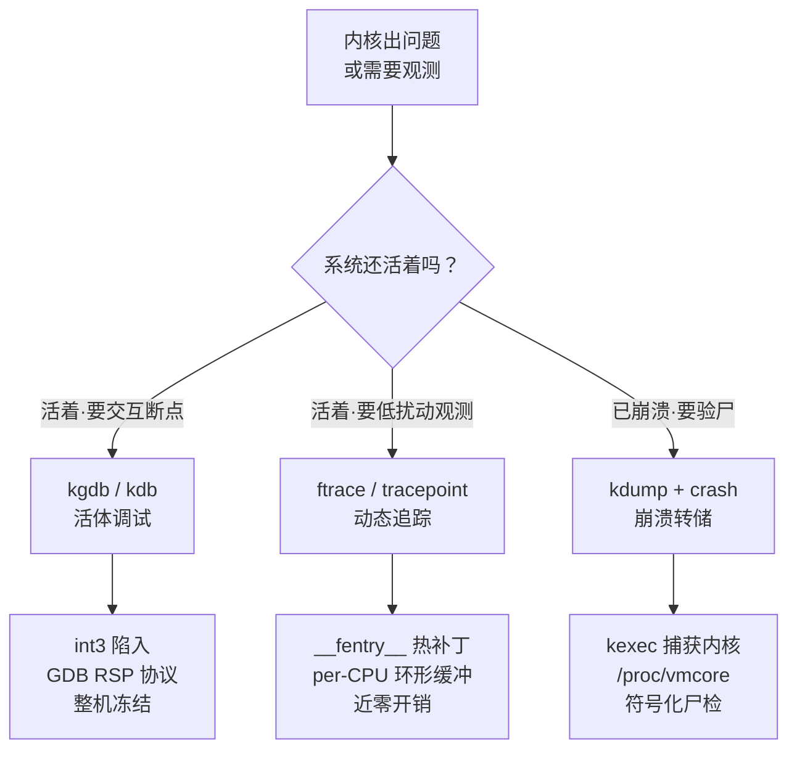
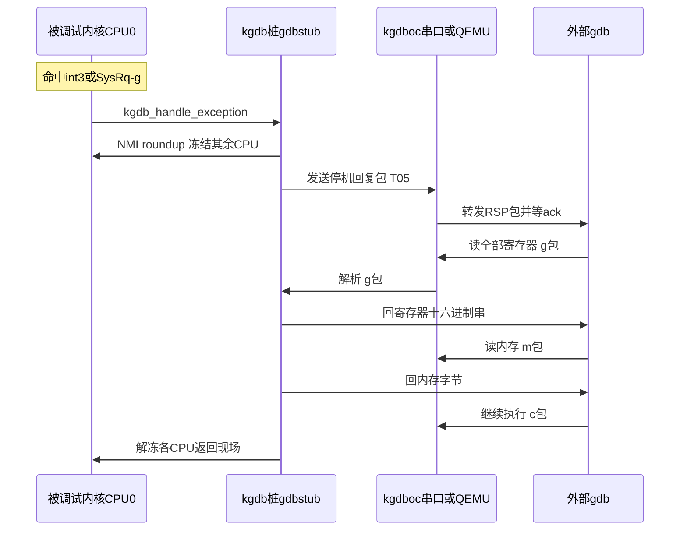
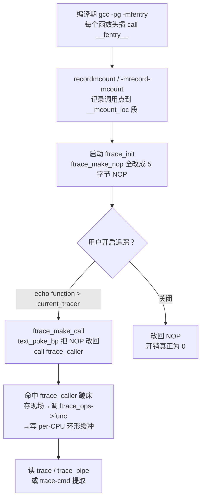
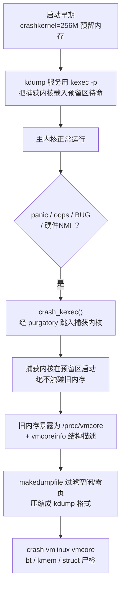

# Linux内核机制与内核利用（13）· 内核调试：kgdb与ftrace与crash
> [!abstract] TL;DR
> - 内核调试的根本难点是"自指"：调试器与被调试者共享同一套地址空间、中断与调度器，于是分化出三条路线——把整机冻结（kgdb 活体调试）、边跑边记的低扰动旁路（ftrace 追踪）、崩溃后再验尸（kdump/crash 转储），三者对应"活着且要交互 / 活着但不能停 / 已经死了"三种现场。
> - kgdb 是内核里的 GDB 桩：断点用 `int3`(0xcc) 异常陷入，主控 CPU 通过 GDB Remote Serial Protocol（`$data#cksum`）与外部 gdb 对话，其余 CPU 被 NMI roundup 冻结自旋；实战九成场景被 QEMU 内建 gdbstub（`-s -S`）替代，配 `vmlinux` 与 `scripts/gdb` 的 `lx-` 脚本符号化。
> - ftrace 的零开销来自"编译期埋点 + 运行期热补丁"：`-pg -mfentry` 在每个函数头插 `call __fentry__`，启动时 `ftrace_init` 全部回填成 5 字节 NOP，开启追踪才用 `text_poke_bp`（int3 桥接）就地改回 `call ftrace_caller`——关闭时开销真正为零。
> - tracepoint 靠 jump label（static key + `asm goto`）实现：关闭是 NOP、开启热补丁成跳转；这正是 eBPF fentry/kprobe 能"挂任意函数几乎不掉性能"的物理基础，function_graph 则靠劫持返回地址 + 每任务影子栈 `ret_stack` 记录出入时刻。
> - crash 转储链路是 kexec 的杀手级应用：`crashkernel=` 预留内存里驻留第二个"捕获内核"，panic 时 `crash_kexec` 直接跳入，旧内存原封不动导出为 `/proc/vmcore`（配 `vmcoreinfo` 描述结构），makedumpfile 过滤压缩后由 crash 工具做 `bt/kmem/struct` 尸检。
> - 逆向与利用视角：三件套是可利用性判定、堆风水观测（断点 `kmalloc/kfree`）、KASLR 偏移求解与 syzkaller 崩溃三分类的通用底座；但 `kcore/vmcore/tracefs` 同时是信息泄露与改写内核文本的攻击面，生产内核用 lockdown、`kptr_restrict`、`STRICT_DEVMEM` 收口。

## 概述与定位

内核调试与用户态调试的本质分野，可以一句话概括：**用户态调试是"旁观者清"，内核态调试是"给自己做开颅手术"**。当 gdb 调试一个进程时，调试器活在内核的庇护之下——被调试进程被 `ptrace` 停住，而内核、调度器、时钟中断照常运转，随时能把控制权干净地交回调试器。可当你要调试的正是内核本身时，这层庇护消失了：负责响应断点的异常处理、负责把调试数据送出去的串口驱动、负责调度调试逻辑的调度器，统统是被调试对象的一部分。断点若停在 `spin_lock` 持锁的临界区、停在硬中断上下文、停在 `printk` 内部，稍有不慎就是死锁、递归异常，乃至三重故障（triple fault）导致 CPU 复位。这种"自指"（self-reference）困境，决定了内核调试无法照搬用户态"随停随看"的模型，而是分化出三条互补的技术路线，恰好对应本篇的三件套。

第一条是**活体交互调试**（kgdb 与其孪生的 kdb）：接受"停下就得停全机"的代价，把整台机器冻结成一张一致性快照，让外部 gdb 慢慢看。它给出最强的控制力——任意地址下断点、单步、改寄存器与内存、看完整调用栈，代价是系统彻底停摆，且需要一个"第二实体"（另一台机器的 gdb，或 QEMU 宿主进程）来承接会话。

第二条是**低扰动追踪**（ftrace 与其之上的 tracepoint/kprobe 事件）：承认"停机不可接受"——尤其在生产服务器与硬实时系统上——于是放弃断点式的"停下来看"，改成"边跑边记"：在关键点埋下极轻的探针，把事件写进无锁的 per-CPU 环形缓冲，事后再读回来。它换来近乎不打断系统运行的观测能力，代价是只能看到预先埋点或可插桩之处，且拿不到任意瞬间的完整机器状态，更多是"时间轴上的行为流"而非"某一刻的静态全景"。

第三条是**崩溃转储验尸**（kdump 采集、crash 分析）：针对"系统已经死了、无法再交互"的场景，用 kexec 预先在内存里藏一个"捕获内核"，主内核 panic 的一瞬跳进去，把死者的整个物理内存原样导出成 `vmcore`，再用 `crash` 工具配符号表做尸检。它是唯一能处理"现场只有一次、且已是尸体"的手段——线上偶发 panic、量产设备回收的 core，往往只能靠它。



放到本系列的语境里，这三件套是后续所有攻防篇章的"工程底座"。第 14 篇讲 UAF/OOB/竞态时，判定一份崩溃"是不是可利用的漏洞"要靠 crash 读 `vmcore`、看 KASAN 报告落在 slab 的哪个偏移；第 15、16 篇开发利用原语与提权链时，几乎人人都在 QEMU + gdb 里断点 `kmalloc/kfree`、观察对象在哪个 kmem_cache、`cred` 结构长什么样；第 17 篇绕过 KASLR/SMEP/KPTI，第一步就是在调试器里读出内核基址偏移；第 18 篇的 syzkaller，本身就把 KASAN、ftrace 覆盖率、崩溃解析编织进自动化流水线。可以说，不会调三件套，前面学的机制就只是纸面知识，落不到手上。

## 原理与机制

三件套虽目标各异，但都在回答同一个问题：**如何在"内核既是观测者又是被观测者"的前提下，安全地取得内核内部状态**。它们给出的三种答案，构成了理解全篇的三条主线。

**kgdb —— 内核里的 GDB 桩（stub）。** 它的骨架是 `kernel/debug/debug_core.c`（体系无关核心）加 `kernel/debug/gdbstub.c`（协议实现），再加一个"I/O 驱动"把字节收发出去，最常用的是 `kgdboc`（kgdb over console，复用一个串口/控制台）。工作模型是**异常驱动**：内核在 die 通知链（`notify_die`）上注册钩子，当 CPU 命中软件断点（x86 上的 `int3`）、单步陷阱、或收到进入调试器的显式请求（`echo g > /proc/sysrq-trigger`、SysRq-g、`kgdbwait` 早期等待）时，控制流进入 `kgdb_handle_exception`。此后由一个"主控 CPU"独占，负责把 CPU 现场翻译成 GDB Remote Serial Protocol（RSP）的应答，与外部真正的 gdb 一来一回；其余 CPU 则被冻结自旋，保证整机状态在会话期间不再变化。kgdb 与 kdb 共享同一套核心：kdb 是内建在内核里的极简命令行前端（`bt`、`md` 读内存、`rd` 读寄存器），不需要第二台机器、串口敲命令即可用；kgdb 则把同一现场通过 RSP 交给功能完整的 gdb。二者可在会话中用 `$3#33`（gdb 里 `3`）互相切换，这是很实用的设计——kdb 应急看一眼，需要源码级能力时再切 gdb。

**ftrace —— 编译期埋点 + 运行期热补丁的追踪框架。** 它的用户接口是 `tracefs`（挂载在 `/sys/kernel/tracing`，旧路径 `/sys/kernel/debug/tracing`），核心数据结构是 `kernel/trace/ring_buffer.c` 里的 per-CPU 无锁环形缓冲。ftrace 家族包含两类探针来源：一是**函数追踪器**，依赖 gcc 的 `-pg`（现代 x86-64 上是 `-pg -mfentry`）在每个函数入口插入一次对 `__fentry__`/`mcount` 的调用，配合动态 ftrace 把这些调用点在运行时按需在 NOP 与 `call ftrace_caller` 之间热切换；二是**静态追踪点**（tracepoint），由 `TRACE_EVENT` 宏在源码里显式声明，用 jump label（static key）实现"关闭即 NOP、开启即跳转"。二者之上还能挂 kprobe/uprobe 动态事件、perf、以及 eBPF 程序。ftrace 之所以能成为 Linux 观测的事实标准，关键在于它把"探针在关闭时的开销"压到了几乎为零——这一点在下一节展开，它是整个设计哲学的核心。

**kdump/crash —— 用第二个内核抢救死者的内存。** 它建立在 `kexec` 之上：`kexec` 本是"绕过固件直接从内存里启动另一个内核"的机制，kdump 把它用作灾备——系统启动早期通过 `crashkernel=` 预留一块内存，`kdump` 服务用 `kexec -p` 把一个"捕获内核"（capture/dump-capture kernel）预先载入这块预留区并停在那里待命。一旦主内核 `panic()`/oops/`BUG()`/收到不可屏蔽的硬件错误，`crash_kexec()` 会跳过正常关机流程，经由 `purgatory` 小段过渡代码直接启动预留区里的捕获内核。捕获内核只用那块预留内存运行，绝不触碰旧内核的页面，于是死者的完整物理内存被原样保留下来，通过 `/proc/vmcore` 暴露出来。之后 `makedumpfile` 把它过滤压缩成磁盘上的转储文件，最终由 `crash` 工具（Dave Anderson 主导、以 gdb 为核、加了一大批内核感知命令）配 `vmlinux` 符号做分析。这条链路的精妙之处在于"两个内核"的隔离：正因为捕获内核在物理上与主内核内存不重叠，才敢在一个已经崩坏、可能内存都被踩烂的系统里，可靠地把现场搬运出来。

## 深度详解：断点陷入、动态插桩与二次内核转储

这一节把三条主线各自最"内核"的机制拆开讲透——它们分别回答"如何安全地停下并对话""如何做到关闭零开销的热插桩""如何在崩溃时可靠搬运现场"。

### kgdb：int3 陷入、NMI 冻结与 RSP 协议

**软件断点的物理实现是"改一个字节"。** x86 上的软件断点，本质是把目标地址的首字节改写成 `0xcc`（`int3`，单字节断点指令），并把被覆盖的原始字节保存起来。CPU 执行到这里触发 `#BP` 异常，`do_int3` 经 `notify_die` 把控制交给 kgdb。命中后要"透明地继续"就得把原字节写回、单步执行该指令、再把 `0xcc` 补回去。写内核文本区（正常是只读的）要走安全通道——现代内核用 `text_poke` 家族，早期用 `probe_kernel_write` 临时提权页表。硬件断点则完全不改代码：x86 的调试寄存器 `DR0~DR3` 存放最多 4 个断点线性地址，`DR7` 控制每个断点的启用位、长度与触发类型（执行/写/读写），命中触发 `#DB`。二者取舍很清楚——软件断点数量不限但要改代码（对只读/XOM 区域、或想对"写访问"下断时无能为力），硬件断点不改代码且能做"数据观察点"（watchpoint，监视某地址被写），但全局只有 4 个，是稀缺资源。

```
x86-64 调试寄存器（硬件断点）
DR0..DR3 : 4 个断点的线性地址
DR6      : 状态，哪个断点命中（B0..B3）、单步(BS)等
DR7      : 控制
           Ln/Gn  局部/全局启用位（每断点1位）
           R/Wn   00=执行 01=写 11=读写
           LENn   00=1字节 01=2 10=8 11=4
```

**单步靠 EFLAGS 的 TF 位。** 让内核只执行一条指令就再次陷入，x86 的经典做法是置上 EFLAGS 的陷阱标志 `TF`：CPU 每执行完一条指令就产生一次 `#DB`。kgdb 的 `s`（step）就建立在此之上。这也解释了内核单步为何格外危险——若单步跨进中断/异常入口、或跨过关中断区间，时序会被彻底打乱，稍有不慎就走飞。

**为什么必须冻结其余 CPU。** 单核时代停一个 CPU 就等于停机；SMP 下若只停命中断点的那个核，其余核仍在飞速修改内存与运行队列，gdb 看到的"快照"会在读的过程中被改写，毫无一致性可言。kgdb 的对策是 `kgdb_roundup_cpus`：主控 CPU 进入调试器后，向其余各 CPU 发送**NMI**（不可屏蔽中断，而非普通 IPI），把它们逼进 `kgdb_nmicallback` 自旋等待。之所以用 NMI 而非普通 IPI，是因为出问题的 CPU 很可能正处于关中断状态，普通 IPI 送不进去、会永久卡住；NMI 是关不掉的，能强行把失联的核拉进来。会话结束时主控 CPU 释放，各核解冻返回现场。

**RSP：一问一答的文本协议。** kgdb 桩说的是标准 GDB Remote Serial Protocol，包格式极简：`$` 开头、`#` 结尾，`#` 后跟两位十六进制校验和（包体各字节之和模 256），接收方回 `+`（收妥）或 `-`（重发）。核心命令屈指可数：

```
$g#67            读全部寄存器 -> 回 十六进制寄存器串
$G<hex>#..       写全部寄存器
$maddr,len#..    读内存 -> 回 该段字节的十六进制
$Maddr,len:<hex> 写内存
$c[addr]#..      继续执行（continue）
$s[addr]#..      单步（step）
$Z0,addr,kind    设软件断点（Z1=硬件断点，z 为删除）
$?#..            查询最近停机原因（信号号）
$T05thread:..;#  停机回复：信号5(SIGTRAP)+当前线程等
$qSupported#..   能力协商
```

理解这套协议有个直接的实战回报：**QEMU 的内建 gdbstub 说的是同一种 RSP**。也就是说，在虚拟机里调内核根本不需要真的启用 kgdb——`qemu -s -S` 就在 1234 端口开了个 gdbstub，`gdb vmlinux` 里 `target remote :1234` 即可，QEMU 从虚拟机外部提供了"永远冻结得住、永远送得出字节"的第二实体，彻底绕开了"调试器与被调试者同处一体"的自指困境。这是今天绝大多数内核开发与漏洞研究的默认姿势，真机 kgdb 反而只在调硬件相关、或没有虚拟化的场景才登场。kgdb 在真机上还有一堆恼人边界：进入调试器后系统时钟停摆，回到现场时 jiffies、定时器全乱；软件看门狗（soft/hard lockup detector）会以为系统卡死而触发 panic，得先关掉；串口本身若正是被调试对象也会打架。这些"调试器污染被调试环境"的问题，本质都是自指困境的余波。



### ftrace：从 mcount 到 NOP 热补丁的零开销之道

**问题的起点：静态插桩必然有常驻开销。** 若在每个函数入口硬写一条"调用追踪器"的指令，哪怕不追踪时，这条 `call` 也要执行、要污染分支预测与 icache——内核有几万个函数，累加起来是不可接受的常驻税。ftrace 的全部精巧，就是为了把这笔税在"不追踪时"降到零。

**编译期：埋点但先记账。** 打开 `CONFIG_FUNCTION_TRACER` 后，内核以 `-pg`（x86-64 上是 `-pg -mfentry`）编译，编译器在每个函数入口插入一次对 `__fentry__`（老式为 `mcount`）的调用。`-mfentry` 的关键改进是把这个 `call` 放在函数序言（建栈帧）之前，因此追踪器能拿到未被扰动的入参寄存器，这也是后来 `DYNAMIC_FTRACE_WITH_REGS`、乃至 eBPF `fentry` 能安全读参数的前提。与此同时，构建期的 `recordmcount` 脚本（或更现代的编译器选项 `-mrecord-mcount`）扫描目标文件，把所有这些调用点的地址收集进一个专门的 `__mcount_loc` 段，相当于给内核附了一张"哪里有插桩点"的全表。

**启动期：全部回填成 NOP。** 内核启动时 `ftrace_init` 遍历 `__mcount_loc`，通过 `ftrace_make_nop` 把每一个 `call __fentry__` 就地改写成一条等长（x86 上 5 字节）的 NOP。至此，插桩点在"不追踪"状态下就是一条 NOP——现代 CPU 对齐良好的 NOP 近乎免费，常驻开销归零。ftrace 同时为每个插桩点建立一条 `dyn_ftrace` 记录，构成可按需开关的索引。

**开启追踪：int3 桥接的活体热补丁。** 当用户 `echo function > current_tracer`，ftrace 用 `ftrace_make_call` 把选中函数的 NOP 改回 `call ftrace_caller`。难点在于：要在 SMP、多核可能正在执行这条指令的情况下，安全地改写一条正在运行的内核文本。朴素做法是 `stop_machine` 把所有核停住再改，代价大；现代内核用 `text_poke_bp`（int3 桥接）做到不停机热补丁——先把目标指令首字节原子地换成 `int3`，全局同步一次（此时其他核若执行到这里会走 int3 异常处理，被引导到正确目的地），再改写指令其余字节，再同步，最后把首字节从 `int3` 换成真正的新首字节。这套"int3 当临时跳板"的技巧，是 Linux 活体改内核文本的通用基建，jump label、静态调用、alternatives 都用它。

**命中路径：蹦床与动态 trampoline。** 打了补丁后，函数一进来就 `call ftrace_caller`。`ftrace_caller` 是一段汇编蹦床（`arch/x86/kernel/ftrace_64.S`）：保存现场（视配置保存部分或完整 `pt_regs`），调用注册在该函数上的 `ftrace_ops->func`，再恢复现场返回。当某函数只挂了一个 `ftrace_ops` 时，ftrace 会为它分配一条**专属动态 trampoline**，跳过遍历 ops 链表的通用开销——这解释了 eBPF `fentry` 那种"直连蹦床"为何比传统 kprobe 更快。追踪器最终把事件写进 per-CPU 环形缓冲；该缓冲用 cmpxchg 做无锁提交，划分为页、维护 head/commit/tail 与独立的 reader page，因而多核并发写入无需自旋锁。

**function_graph：劫持返回地址 + 影子栈。** 普通函数追踪只看得到"进入"；要同时拿到"退出"与函数耗时，就得在返回时也插一脚。ftrace 的办法是在函数入口把栈上的**返回地址替换**成一个统一蹦床 `return_to_handler`，并把真正的返回地址连同进入时间戳压进一个**每任务的影子栈** `ret_stack`（`prepare_ftrace_return`/`ftrace_graph_caller`）。函数执行完 `ret` 到 `return_to_handler`，蹦床记录退出时刻、算出耗时、从影子栈弹回真实返回地址继续。这套"劫持返回地址"的机制，与 kretprobe、乃至攻击者的 ROP 在原理上同源——都是把控制流的"回程票"掉包，区别只在善意与恶意。



**tracepoint 与 jump label。** 静态追踪点走的是另一条路。`TRACE_EVENT`/`DECLARE_EVENT_CLASS` 宏在源码显式声明埋点，编译成一个 `struct tracepoint` 和一段用 `asm goto`（jump label / static key）守卫的调用块。没有任何探针挂上去时，该点是一条 5 字节 NOP，`asm goto` 直接掠过；一旦有人 `echo 1 > events/.../enable`，`static_key_enable` 用同样的 int3 桥接把 NOP 热补丁成一条跳转，转去执行探针回调。这就是"关闭近零、开启才付费"哲学在静态点上的化身。tracepoint 的另一价值是**稳定与自描述**：每个事件在 `events/<子系统>/<事件>/format` 里导出字段布局，perf、trace-cmd、eBPF 据此解析二进制记录，无需硬编码结构偏移。

**kprobe：给任意地址下动态断点。** tracepoint 只在内核开发者预埋处存在；要在**任意**指令地址插桩，就用 kprobe。它的经典实现同样是把目标指令首字节换成 `int3`，命中后先跑 `pre_handler`，再把被覆盖的原指令在别处（out-of-line 缓冲）单步执行一遍，跑 `post_handler`，然后跳回原流。为省掉每次 int3 陷入的开销，**优化 kprobe** 在安全时把 `int3` 升级为一条 `jmp` 到 detour 蹦床，直接省去异常往返。kretprobe 则如 function_graph 般劫持返回地址来观测函数出口。tracefs 的 `kprobe_events`/`uprobe_events`/`dynamic_events` 把这套能力开放给用户态：一行文本即可在 `<函数>+<偏移>` 处动态造出一个可开关的追踪事件，读取指定寄存器/内存作为参数——这也是它成为信息泄露攻击面的原因，后文再议。

### kdump/crash：kexec 二次内核与 vmcore 的诞生

**为什么非要"第二个内核"。** 系统 panic 时，内核自身可能已经被踩烂——页表、slab 元数据、甚至内存分配器都不可信，此刻再想在原内核里从容地把内存写盘，无异于让垂死之人给自己写遗书。kdump 的解法是彻底换一套干净的执行环境：预先在**物理上隔离**的一小块预留内存里备好一个完好的捕获内核，崩溃瞬间跳过去，用它这套完好的页表、驱动与文件系统，去读旧内核那片"案发现场"。隔离是关键——捕获内核绝不复用旧内存，才敢在废墟上可靠工作。

**链路拆解。** 启动早期靠 `crashkernel=256M`（或 `crashkernel=auto`）预留内存；`kdump` 服务用 `kexec_file_load`/`kexec_load` 把捕获内核连同其 initramfs 载入预留区待命。`kexec` 本身是"绕过固件、直接从内存启动内核"的机制，省去 BIOS/UEFI 自检，两内核之间夹一段 `purgatory` 过渡代码负责校验镜像完整性并搭好交接。崩溃时 `panic()` 调 `crash_kexec()`，直接引导捕获内核在预留区起来。捕获内核眼中，旧内核的整块物理内存以 `/proc/vmcore` 的形式呈现——它本质是个 ELF core：若干 `PT_LOAD` 段把物理内存映射进去，外加一个记录 `vmcoreinfo` 的 note。

**vmcoreinfo：没有完整符号也能走结构。** 分析一份转储要在原始内存里"走"内核数据结构（顺着 `init_task` 遍历进程链表、顺着 `mem_map` 找页帧），这需要知道 `struct task_struct` 里 `tasks` 成员的偏移、`struct page` 的大小之类的元信息。`vmcoreinfo` 就是内核在崩溃前导出的一张"结构说明书"，用 `VMCOREINFO_SYMBOL`/`_STRUCT_SIZE`/`_OFFSET` 宏登记关键符号地址、结构大小与成员偏移，存于 `/sys/kernel/vmcoreinfo`（给出物理地址）。有了它，`makedumpfile` 与 `crash` 无需完整 DWARF 也能定位并遍历核心结构，也让转储工具能跨小版本适配。

**makedumpfile：过滤与压缩。** 直接 dump 整块物理内存又大又慢，且绝大多数是无关的空闲页、页缓存。`makedumpfile` 借助 `vmcoreinfo` 认得页帧状态，按 **dump level** 位掩码剔除不需要的页——`1` 零页、`2` 缓存页、`4` 私有缓存、`8` 用户页、`16` 空闲页，常用 `31` 表示尽量精简——再用 zlib/lzo/snappy/zstd 压成"压缩 kdump 格式"，把几十上百 GB 内存的转储压到可管理的量级。要注意：转储里含内核与用户的全部在世数据（密钥、口令、隐私），本身就是高度敏感物，见后文安全一节。



## 工具视角与实战

**QEMU + gdb：内核研究的默认工作台。** 起虚拟机时加 `-s -S`（`-s` 等价 `-gdb tcp::1234`，`-S` 让 CPU 一上电就停住等你），另一端 `gdb vmlinux` 里 `target remote :1234`。用带调试信息的 `vmlinux`（`CONFIG_DEBUG_INFO=y`，`CONFIG_DEBUG_INFO_DWARF*` 视需要）才有源码级能力。几条心法：内核多用 `hbreak`（硬件断点）而非 `break`，因为早期或改写页表阶段软件断点写不进去；调模块要先在虚拟机里 `cat /sys/module/<mod>/sections/.text` 拿到加载地址，再 `add-symbol-file <mod>.ko <text_addr>` 才认得符号；**务必先关 KASLR**（内核命令行加 `nokaslr`），否则符号地址与运行地址对不上，是新手最常见的坑。内核源码自带的 gdb 辅助脚本极大提效——`gdb -x vmlinux-gdb.py` 后可用 `lx-symbols`（自动为已加载模块加符号）、`lx-dmesg`（不进系统直接读内核日志环形缓冲）、`lx-lsmod`、`lx-ps` 等，把裸内存读成人话。研究漏洞时的典型动作：`b __kmalloc`、`b kfree`、观察目标对象落在哪个 `kmem_cache`、`p *(struct cred *)$rax` 看凭据结构，全在这套环境里完成。

**真机 kgdb/kdb。** 设 `kgdboc=ttyS0,115200`（命令行或运行时 `echo ttyS0 > /sys/module/kgdboc/parameters/kgdboc`），触发进入用 `echo g > /proc/sysrq-trigger` 或魔术键 SysRq-g；要调早期启动加 `kgdbwait` 让内核在初始化早段就停下等 gdb 接管。应急时 kdb 无需第二台机器，串口直接敲 `bt`、`md`、`rd`、`go`。

**ftrace 徒手配方（无需任何用户态工具）。** 全在 `tracefs` 里用 echo/cat 完成，这是它"随处可用"的最大优点：

```
cd /sys/kernel/tracing
cat available_tracers                 # function function_graph nop ...
echo function_graph > current_tracer  # 带缩进与耗时的调用图
echo 'ext4_*' > set_ftrace_filter     # 只追踪 ext4 前缀函数
echo 1 > tracing_on ; cat trace_pipe  # trace_pipe 边读边清空（阻塞）

echo 1 > events/syscalls/sys_enter_openat/enable  # 打开单个 tracepoint
echo 1 > events/net/enable                          # 打开整个子系统
# 动态在任意函数下 kprobe 事件并取参数：
echo 'p:myprobe do_sys_openat2 file=+0(%si):string' > kprobe_events
echo 1 > events/kprobes/myprobe/enable
```

要点辨析：`trace` 是可反复读、可 seek 的快照，`trace_pipe` 是读一次消费一次的流；延迟类追踪器 `irqsoff`/`preemptoff`/`wakeup_rt` 是实时系统定位长关中断/抢占延迟的利器；`stack_trace` 找最深内核栈以防栈溢出。工程化则用 `trace-cmd record -p function_graph -P <pid>` 落盘、`trace-cmd report` 或图形界面 KernelShark 分析。要长期、可编程、低开销地观测，再往上就接 eBPF（详见本系列第 12 篇），fentry/fexit 程序正是挂在 ftrace 的直连蹦床上。

**crash 尸检与读 oops。** 先看最常打交道的 oops——它是内核给出的第一手死亡证明，读懂它常常不必开转储：

```
BUG: unable to handle page fault for address: 0000000000000010
RIP: 0010:ext4_do_something+0x42/0x180   <- 出错指令：函数+偏移
Code: 48 8b 40 10 ...                     <- RIP 周围原始机器码
RSP: 0018:ffffc9000...  RAX: ...          <- 崩溃瞬间寄存器
Call Trace:
 <TASK>
  some_caller+0x1a/0x40
  ? maybe_stale_frame+0x0/0x20            <- ? 表示栈上疑似残留、未必真实
Tainted: G           O   6.x  ...          <- 污染标志：O=外部模块 等
```

`RIP` 的"函数+偏移"用 `./scripts/faddr2line vmlinux ext4_do_something+0x42` 精确定位到源码行（比裸 `addr2line` 更能处理内联与函数相对偏移）；`decode_stacktrace.sh` 能把整段 Call Trace 批量翻成 `文件:行号`；`Code:` 段可反汇编看究竟哪条访存挂了；带 `?` 的帧是基于栈扫描的猜测、不可全信；`Tainted` 标志提示内核是否被外部/未签名模块污染，是排障前提。

真要开转储，`crash vmlinux vmcore` 进交互环境，常用命令：`bt` 看 panic 任务栈、`bt -a` 看所有 CPU、`ps` 进程表、`log`/`dmesg` 内核日志、`sys` 系统概览、`kmem -s` 巡检 slab（找被破坏的 kmem_cache）、`kmem -i` 内存总览、`struct task_struct <addr>` 或 `struct cred <addr>` 按类型解读内存、`dis <sym>` 反汇编、`rd <addr>` 裸读、`foreach bt` 遍历所有任务栈、`mod -s <mod>` 加载模块符号、`vtop`/`ptov` 虚实地址互转。判定一个 fuzzing 崩溃是否可利用，就是在这里读 KASAN 报告落点、看越界写踩到相邻对象的哪个字段、UAF 释放后重分配成了什么。

**抓不到转储时的兜底。** 若 panic 太早或 kdump 没起来，`pstore`/`ramoops` 把最后的 dmesg 写进一块跨重启保留的 RAM（或 EFI 变量、ACPI ERST），重启后从 `/sys/fs/pstore` 捡尸；`netconsole` 把内核日志实时 UDP 到另一台机器；配合 `panic_on_oops`、`panic_on_warn` 让"本该只 oops"的错误升级为 panic 以触发 kdump，是排查偶发内存踩踏的常用开关。

## 安全性与正确使用

> [!caution]
> 本篇所有技术仅用于**你自有或已获明确书面授权的环境、CTF 靶场与安全研究**，立场是防御与教育。kgdb/QEMU 调试、ftrace 追踪、crash 尸检在漏洞研究中确实与利用开发同源——研究者用它们在**自己的内核副本**上定位 bug、观测堆布局、判定可利用性、复现 syzkaller 崩溃，这是正当且必要的。但**严禁**将其用于未授权访问、窃取他人生产系统内存、绕过商业软件授权或制作针对真实目标的武器化配方。本文只讲原理与自有环境下的方法论，不提供"打某真实目标"的成品步骤。取得的任何内核内存内容都可能含他人隐私与密钥，须依授权范围与法律妥善处置。

抛开合规，这三件套在技术上都是典型的**双刃工具**，其能力边界本身就是内核攻击面的一部分，防御者尤须理解为何生产内核要处处设限。

**全内存读取即 KASLR 与凭据的裸奔。** `/dev/mem`、`/proc/kcore`、`/proc/vmcore` 本质是"把物理/内核内存整片读出来"的接口——落到攻击者手里，KASLR 偏移一读即破，`cred`、密钥、口令一览无余。因此内核用多道闸门收口：`CONFIG_STRICT_DEVMEM` 限制 `/dev/mem` 只能碰特定区域；`kernel.kptr_restrict` 把 `%pK` 打印的内核指针对非特权者置零，堵住 `/proc` 里的地址泄露；lockdown LSM 的 confidentiality 档直接封掉 `/dev/mem`、`kcore`、`kprobe` 读任意内存等一切可窥内核的通道。转储文件更要当敏感物管理——分享给厂商前应意识到它含全量在世数据，必要时用 `makedumpfile` 的过滤级别或专门工具做脱敏。

**能改内核文本 = 潜在的代码执行原语。** ftrace/kprobe 的热补丁能力，从防御视角看就是"合法地改写正在运行的内核代码"。若这类接口暴露给非特权上下文，等于把改内核文本的钥匙递出去。故 `tracefs` 与 `kprobe_events` 需要 root/`CAP_SYS_ADMIN`，`perf_event_paranoid` 分级限制非特权 perf/tracepoint，lockdown 的 integrity 档禁掉 kprobe 改写、未签名模块、`/dev/kmem` 写入等一切可动内核完整性的路径。攻防两端要记住：动态追踪基建（int3 桥接、jump label、直连蹦床）与 rootkit 的内核挂钩在机理上是同一套东西，区别只在谁持钥、是否受策略约束。

**kgdb 是彻底的信任让渡。** 一条 kgdb 串口 = 对内核的完全控制（改任意内存与寄存器、绕过一切检查）。因此它只应存在于物理可信、隔离的开发/研究环境；lockdown 开启时 kgdb 直接被禁用。真机长期开着 kgdboc，等于留了一扇物理后门。

**正确使用的工程守则。** kdump 要按机型实测 `crashkernel=` 大小——预留太小捕获内核起不来、太大浪费内存；捕获内核的 initramfs 要够精简以在废墟中可靠启动。ftrace 生产使用要用 `set_ftrace_filter` 收窄范围、及时 `echo 0 > tracing_on` 关掉，避免环形缓冲与蹦床持续吃 CPU 与内存。调试改内核命令行加的 `nokaslr`、开的看门狗豁免、串口后门，都只应存在于调试镜像，绝不能带进生产——"调试便利"与"生产防护"必须物理隔离成两套构建。

## 小结

内核调试的一切复杂性，都源自"内核既是观测者又是被观测者"的自指困境，本篇的三件套正是对它的三种正面回答。**kgdb** 选择"停全机换强控制"：`int3` 陷入、NMI roundup 冻结其余 CPU、主控 CPU 用 GDB RSP 与外部 gdb 一问一答；而 QEMU 内建 gdbstub 说的是同一种 RSP，从虚拟机外部提供了一个"永远冻得住、送得出"的第二实体，成了今日内核研究的默认工作台。**ftrace** 选择"边跑边记换近零扰动"，其零开销的秘密是"编译期埋点 + 运行期热补丁"：`__fentry__` 调用点启动即回填 NOP，开启追踪才用 int3 桥接热改回 `call`，tracepoint 用 jump label 达成同样的"关闭即 NOP"，function_graph 靠劫持返回地址加影子栈观测出口——这套基建向上直通 kprobe 与 eBPF。**kdump/crash** 选择"崩溃后验尸"，用 kexec 在物理隔离的预留内存里备好捕获内核，panic 时 `crash_kexec` 跳入，把死者内存原样导出为 `vmcore`，再靠 `vmcoreinfo` 描述结构、makedumpfile 过滤压缩、crash 工具符号化尸检。三者共同构成本系列后续漏洞判定、利用开发、防护绕过、Fuzzing 三分类的工程底座；也共同提醒我们：这些能读遍内存、改动内核文本、完全掌控现场的能力，天然是双刃的——用在自有与授权环境是研究，越界即是攻击，lockdown、`kptr_restrict`、`STRICT_DEVMEM`、`perf_event_paranoid` 正是内核给这些利器上的锁。

## 相关阅读

- 官方文档：`Documentation/dev-tools/kgdb.rst`（kgdb/kdb 与 kgdboc）、`Documentation/trace/ftrace.rst` 与 `ftrace-design.rst`（ftrace 设计与 tracefs 接口）、`Documentation/trace/kprobes.rst`、`Documentation/admin-guide/kdump/kdump.rst`（kdump/kexec/makedumpfile/vmcoreinfo）、`Documentation/dev-tools/gdb-kernel-debugging.rst`（`scripts/gdb` 的 `lx-` 命令）。
- 工具与协议：GDB Remote Serial Protocol（GDB 手册 "Remote Protocol" 附录）、`crash` utility 与 `makedumpfile` 项目手册、`trace-cmd`/KernelShark、Steven Rostedt 在 LWN 上的 ftrace 系列文章。
- 书目：Robert Love《Linux Kernel Development》、Bovet & Cesati《Understanding the Linux Kernel》、Corbet/Rubini/Kroah-Hartman《Linux Device Drivers》调试章节。
- 同系列：[[09.内核模块与LKM开发|内核模块与LKM开发]]（模块符号与加载地址）、[[12.eBPF架构与验证器|eBPF架构与验证器]]（fentry/fexit 挂在 ftrace 蹦床）、[[14.内核漏洞类型：UAF与OOB与竞态|下一章：内核漏洞类型]]（转储与 KASAN 判定可利用性）、[[18.内核Fuzzing与syzkaller|内核Fuzzing与syzkaller]]（崩溃自动三分类）。
- 跨库对照：[[38.Windows内核与驱动逆向/13.内核漏洞与利用基础]]、[[38.Windows内核与驱动逆向/26.内核池风水与利用]]（Windows 侧 WinDbg/池调试的对称视角）、[[34.现代二进制防护机制/15.内核防护与kCFI]]（lockdown 与 KASLR/SMEP/SMAP/KPTI）、[[15.操作系统加载与启动/11.init与systemd启动]]（kexec 与捕获内核启动路径）、[[49.Fuzzing与漏洞挖掘/14.内核与驱动Fuzzing：syzkaller]]（追踪与覆盖率反馈）。

[[00.Linux内核机制与内核利用总览|⬆ 系列总览]] | [[12.eBPF架构与验证器|← 上一章]] | [[14.内核漏洞类型：UAF与OOB与竞态|→ 下一章]]
