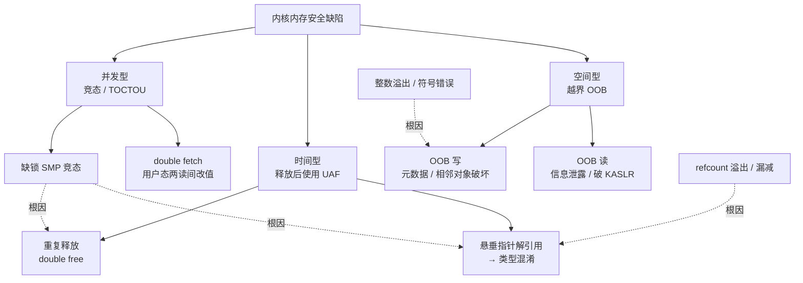
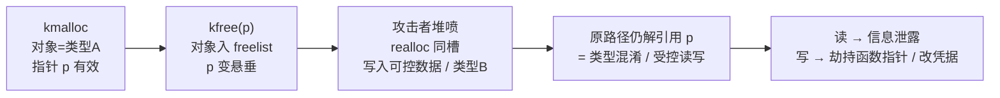
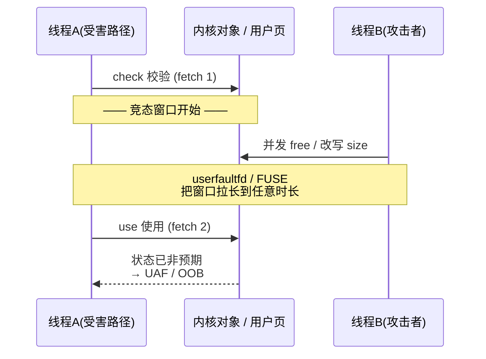

# Linux内核机制与内核利用（14）· 内核漏洞类型：UAF与OOB与竞态
> [!abstract] TL;DR
> - 内核内存安全缺陷分三族：**空间型**（OOB 越界读/写）、**时间型**（UAF 释放后使用、double free）、**并发型**（竞态/TOCTOU/double fetch）。三者常互为因果——竞态是很多 UAF 的根因、整数溢出是很多 OOB 的根因、UAF 经再分配变类型混淆又升级为 OOB 读写。
> - UAF 的可利用性来自 SLUB 的**确定性对象复用**：per-CPU freelist 的 LIFO 让「刚 free 的对象最先被 realloc 回来」，堆喷据此把悬垂指针指向的对象换成可控数据；`SLAB_FREELIST_HARDENED/RANDOM`、`init_on_free` 抬高门槛但不根治。
> - 竞态窗口再窄也能被拉宽：**userfaultfd / FUSE** 让内核在访问用户页时阻塞在攻击者手里，把纳秒级 TOCTOU 变成任意时长的可控停顿；**double fetch** 则是「读两遍用户内存」的语义鸿沟。
> - 典型 CVE 模式高度可归类：refcount 溢出/漏减→UAF（CVE-2016-0728）、整数下溢绕过长度检查→堆 OOB 写（CVE-2022-0185）、协议解析无界 memcpy→OOB（CVE-2021-43267）、状态机重入→double free（CVE-2017-6074）、COW 与页回收竞态→写只读文件（Dirty COW）。
> - 检测靠 sanitizer 家族：**KASAN**（影子内存+quarantine 抓 UAF/OOB）、**KMSAN**（未初始化读）、**KCSAN**（数据竞争）、**KFENCE**（低开销采样、可上生产），配合 KCOV+syzkaller 覆盖引导模糊测试形成流水线。
> - 逆向视角看漏洞 = 看补丁：n-day 常从「加了一把锁 / 一个 `refcount_get` / 一处边界判断 / 把 double fetch 改成 fetch-once」反推被修的窗口。本篇只讲**成因与识别**，武器化（原语/堆喷/提权/绕防护）留给后续章。

## 概述与定位

内核代码跑在 ring 0，与所有进程共享同一套内核虚拟地址空间，拥有对全部物理内存、页表、凭据结构（`struct cred`）与硬件的最终控制权。这意味着一个用户态看起来「无关紧要」的内存缺陷，一旦发生在内核里，其后果不是「崩一个进程」，而是**潜在的全机沦陷**：读一个越界字节可能泄露 KASLR 基址，写一个越界字节可能改掉 `cred->uid`，用一个悬垂指针可能劫持一次内核函数调用。因此内核漏洞研究的第一课，不是「怎么打」，而是**先把缺陷本身的成因、边界与识别方式讲透**——这正是本篇（第 14 篇）在整个系列里的定位：它是「漏洞学」的地基，往上才是第 15 篇的利用原语与堆喷、第 16 篇的提权 ROP、第 17 篇的绕防护。

从内存安全的经典二分法看，绝大多数可利用的内核缺陷落在两个维度上：**空间安全（spatial safety）**要求每次访问都落在对象自己的边界内，破坏它就是 **OOB（Out-Of-Bounds，越界）**；**时间安全（temporal safety）**要求指针只在对象存活期内被解引用，破坏它就是 **UAF（Use-After-Free，释放后使用）**。而内核相比用户态多了一个几乎无处不在的第三维——**并发**：SMP 多核、可抢占内核、软中断、RCU 宽限期……任何「本应原子却没上锁」的操作序列都可能被两条执行流交错触发出 **竞态条件（race condition）**。竞态本身未必是内存错误，但它极常见的落点恰恰就是「制造出一个 UAF 或 OOB」。三者的对应 CWE 分别是：CWE-125（OOB 读）、CWE-787（OOB 写）、CWE-416（UAF）、CWE-415（double free）、CWE-362（竞态）、CWE-367（TOCTOU / double fetch），根因侧还牵连 CWE-190（整数溢出）与 CWE-457/908（未初始化内存读，即信息泄露）。

内核攻击面天然广阔：`syscall` 直接入口（见 [[03.系统调用实现与入口]]）、字符设备的 `ioctl`（见 [[10.字符设备与ioctl攻击面]]）、netlink/netfilter/nftables、各类网络协议解析（DCCP、SCTP、TIPC、af_packet）、文件系统与 `fs_context`、eBPF（见 [[12.eBPF架构与验证器]]）、以及近年最火的 `io_uring`。历史演进上有一条清晰主线：早期以**栈溢出**为主，随着栈保护普及转向**slab/slub 堆越界**，syzkaller 大规模上线后 **UAF 一跃成为占比最高的类别**，同时把大量**竞态**从「理论上存在」变成「可稳定复现」。理解这条主线，才能解释为什么现代缓解（refcount_t、freelist 加固、KASAN、`init_on_free`）恰好是冲着这几类去的。

## 原理与机制

三族缺陷的机制可以用一句话各自锚定，然后再展开。

**OOB＝空间越界。** 指针本身指向一个合法对象，但访问的偏移超出了对象边界。它细分为：线性溢出（heap overflow，写穿相邻对象/slab 元数据）、下溢（underflow，往前越界）、off-by-one（差一，常见于漏算 NUL 终止符或 `<=` 写成 `<`）。按方向又分**OOB 读**（泄露相邻内存内容→信息泄露、破 KASLR）与 **OOB 写**（破坏相邻对象→控制流/数据劫持）。按位置分栈 OOB、堆（slab）OOB、全局/BSS OOB。其**根因**几乎总是：边界检查缺失或写错、长度计算里的**整数溢出/符号错误**、把用户可控的长度直接拿去 `memcpy`。

**UAF＝时间越界。** 对象已经 `kfree`，但某处仍持有并解引用它的指针（悬垂指针，dangling pointer）。**double free** 是它的特例：同一对象被释放两次，破坏 freelist 或触发再分配后的混乱。UAF 的**根因**有四类典型：引用计数漏减/漏加（对象提前被释放）、引用计数**回绕**（计数溢出到 0 触发释放）、错误路径上「先 free 后 use」、以及**竞态**导致的「一边 free 一边 use」。UAF 真正致命的地方在于**再分配后的类型混淆**：释放类型 A 的对象后，攻击者让分配器把同一内存块交回来当类型 B 用，于是 A 视角里的「某个函数指针字段」其实是 B 里可被控制的普通数据。

**竞态＝并发时序错。** 正确性依赖于「若干操作不被打断地按序完成」，但在多核/可抢占下另一条执行流插了进来。要区分两个概念：**数据竞争（data race）**是 C 内存模型层面的「无同步地并发访问同一内存且至少一写」，是 KCSAN 抓的东西；**竞态条件（race condition）**是更高层的时序 bug，未必是数据竞争，也未必可利用。内核里最危险的两种形态是：**SMP 缺锁竞态**（两个 CPU 各跑一半，检查与使用之间对象状态被改）和**用户/内核 double fetch**（内核对同一用户地址 `copy_from_user` 两次，攻击者在两次之间改值）。关键认知是：**竞态往往只是「根因」，其可观测的破坏几乎总是落在 UAF 或 OOB 上**——所以下面这张图里，并发型会用虚线指回时间型与空间型。



为什么这些在内核里格外「好用」？因为内核用**专用对象分配器**（slab/slub，见 [[04.虚拟内存：伙伴系统与slab与slub]]）管理绝大多数结构体，分配/释放路径高度确定、可预测，攻击者能相当可靠地「把释放腾出的坑，用自己控制的对象填回去」。这就把抽象的「悬垂指针」变成了具体的「可控读写原语」。下面这张 UAF 生命周期图给出直觉，随后的深度板块再把每一步的机制拆开。



## 对象生命周期与竞态窗口详解

这一段是本篇的核心：把「为什么这些缺陷可利用」落到**对象在 slab 里的确定性生命周期**与**竞态窗口的可控性**两件事上。理解了这两点，读者即使不看任何 exploit 代码，也能明白后续章节的堆喷、原语构造为何成立。

### SLUB 对象生命周期与确定性复用

SLUB 为每种大小/类型维护一组 slab（由伙伴系统给的若干物理页切成等大对象），并为每个 CPU 保留一个「当前活跃 slab」和一条 **freelist（空闲链表）**。空闲对象不额外占内存记账，而是**把「下一个空闲对象」的指针直接写在空闲对象自己的内存里**（位于 `s->offset` 处）。分配就是从 freelist 头摘一个，释放就是把对象压回 freelist 头——这是一个**后进先出（LIFO）**的栈式结构。

这条 LIFO 语义正是 UAF 可利用性的物理基础：**你刚 `kfree` 掉的对象，几乎一定是下一次同大小 `kmalloc` 最先拿到的那一个**。于是攻击者的套路是——触发释放，紧接着在同一 CPU 上高速分配大量「内容可控、大小同槽」的对象（堆喷/heap spray，细节见 [[15.内核利用原语与堆喷]]），让悬垂指针 `p` 指向的那块内存被自己的数据精确覆盖。分配的确定性越强，利用越稳定；这也解释了缓解措施的设计动机：

- **`CONFIG_SLAB_FREELIST_RANDOM`**：slab 初始化时把空闲对象的链表顺序打乱，破坏「地址连续＝分配顺序连续」的假设，让**相邻越界的落点不可预测**。
- **`CONFIG_SLAB_FREELIST_HARDENED`**（4.14+）：freelist 里存的不是裸指针，而是 `ptr ^ swab(s->random) ^ &对象内存` 的混淆值。攻击者即使能越界写到 freelist 指针，也**无法在不知道 per-cache 随机数与自身地址的情况下伪造出合法 next 指针**，堵死了经典的「freelist 投毒」。
- **`init_on_free` / `init_on_alloc`**（5.3+）：释放或分配时把对象清零。它主要**削弱信息泄露**（悬垂读到的是 0 而非残留敏感数据）并让某些「靠残留内容」的 UAF 变难，但**挡不住 UAF 写**——对象被 realloc 成别的类型后照样能被控制。
- **`SLUB_DEBUG` / SLAB 毒化**：调试构建下释放的对象被填 `0x6b`（POISON_FREE），越界红区填 `0xa5`，配合 KASAN 的 quarantine 延迟复用，专门为「早暴露」而生。

还有一类高级手法叫 **cross-cache（跨缓存）**：当目标对象位于专用 cache（比如被隔离的 `cred_jar`）里、无法用普通 `kmalloc-N` 直接同槽占位时，攻击者把某个 slab 里的对象全部释放，使这一整页归还给伙伴系统，再诱导内核把**同一物理页**重新分配给另一个 cache 使用，从而跨缓存制造类型混淆。它绕过了「按对象/按 cache 隔离」这类缓解，是近年 kCTF 里对付隔离化对象的常规武器（利用细节属第 15 章，本篇只点其原理）。

### 从释放到重用：UAF 的四类根因

**其一，引用计数失衡。** 内核靠 `refcount`/`kref` 决定对象何时释放。任何一条路径「拿了引用却在错误分支上没还」，或者「该拿引用却没拿」，都会让对象在还有人用时被 `put` 到 0 而释放。**Binder 的 CVE-2019-2215** 是活教材：把 binder fd 加入 epoll 后，epoll 的等待队列里挂着指向 `binder_thread` 内部字段的引用，而 `BINDER_THREAD_EXIT` 直接释放了 `binder_thread`，epoll 侧的引用瞬间悬垂——这是被证实**在野利用**过的 Android 提权。

**其二，引用计数回绕。** 计数用 32 位整数，若能让某路径「每调用一次泄漏一个引用」，循环约 2³² 次即可把计数**回绕到 0**，从而在对象仍被大量引用时触发释放。**CVE-2016-0728**（keyring）就是 `join_session_keyring()` 在特定分支泄漏一次引用，攻击者循环调用把 `usage` 计数器绕回 0，释放仍在使用的 keyring → UAF。修复之道是引入 **`refcount_t`**：它在**加到溢出时饱和（saturate）而不回绕**，在**从 0 自增**或**减到 0 后再用**时告警，把这一整类「算术回绕→UAF」在类型层面掐死。这也是逆向识别的一个信号——补丁把 `atomic_t` 改成 `refcount_t`，往往就意味着这里曾有回绕 UAF。

**其三，状态机重入导致 double free。** 协议/驱动的状态机在非预期报文序列下，可能对**同一对象释放两次**。**CVE-2017-6074**（DCCP）即在特定报文序列下重复释放与 skb 关联的对象，造成 double free / UAF，是 syzkaller 早期的标志性战果。

**其四，错误路径 free-then-use、以及竞态并发 free/use。** 前者是「失败清理时释放了对象，但后续代码还引用它」；后者见下一小节——两条执行流一个在 free、一个在 use，本质上竞态就是 UAF 的一个「并发版根因」。

四类根因的共同下游都是**类型混淆**：一旦悬垂指针指向的内存被 realloc 成攻击者可控的对象，原代码里对某个字段的读写就变成了对攻击者数据的读写。若那个字段恰是**函数指针**（内核里 `file_operations`、`timer`、`tty_operations` 等回调结构俯拾皆是），一次「正常的回调调用」就成了控制流劫持的起点。

### OOB 的成因：整数、符号与边界

越界写的根子，十有八九在**长度算错**，而长度算错最典型的就是**整数溢出/下溢**与**符号错误**。**CVE-2022-0185**（`fs_context` 容器逃逸）是教科书级案例：`legacy_parse_param()` 里有形如 `if (len > PAGE_SIZE - 2 - size)` 的检查，`size` 为无符号，当它足够大时 `PAGE_SIZE - 2 - size` **无符号下溢**成一个巨大的值，于是「`len` 大于它」永远为假，检查被绕过，后续 `memcpy` 把超量数据拷进一个页大小的堆缓冲区 → 堆 OOB 写。修复即调整运算次序与类型，先判 `size` 再算。

**符号错误**是它的近亲：一个本应非负的长度被声明为有符号 `int`，攻击者传入负值通过了 `if (len > MAX)` 之类的上界检查，随后传给按 `size_t`（无符号）取参的 `copy_from_user`/`memcpy` 时被解释成**接近 2⁶⁴ 的巨值**，瞬间越界。**off-by-one** 则常源于「漏算 NUL 终止符」或「`<=` 与 `<` 用反」，虽只差一字节，但若那一字节恰好落在 slab 对象头/相邻对象的关键字段（如大小、标志位、指针低字节），照样致命。

协议解析是 OOB 的重灾区，因为长度字段来自**远端不可信输入**。**CVE-2021-43267**（TIPC）在处理 MSG_CRYPTO 报文时，直接用报文里的密钥长度字段做 `memcpy` 而未校验其是否超过实际报文大小 → 堆越界（读写皆可），且**可远程触发**。**CVE-2021-22555**（netfilter `x_tables`）则是 32 位兼容层把 compat 结构翻译成 64 位时，`memset` 的计算尺寸多写了几个字节，造成小额 OOB 写，被用于**容器逃逸**。OOB 读的价值同样不可小觑：读到相邻对象里的内核指针即可**击破 KASLR**（缓解与对抗见 [[17.绕过内核防护：KASLR与SMEP与SMAP与KPTI]] 与 [[34.现代二进制防护机制/15.内核防护与kCFI]]），为后续写原语提供地址。

### 竞态窗口的解剖与放大

竞态窗口（race window）就是「检查」与「使用」之间、或「两个本应原子的操作」之间的那段时间。窗口越短越难命中，于是利用的关键艺术是**把窗口拉长到攻击者可控**。

先看 **SMP 缺锁竞态**：**CVE-2016-8655**（af_packet）中，`packet_set_ring()` 与 `setsockopt(PACKET_VERSION)` 之间缺乏互斥，`tp_version` 在被校验之后、被使用之前遭另一线程改写，导致按一种版本分配的环形缓冲被当成另一种版本解释 → UAF/OOB，被用于本地提权。这类 bug 的补丁特征极鲜明：**加一把锁、或把「读—判断—用」收进同一临界区**。

再看**用户/内核 double fetch**（CWE-367）：内核对同一用户地址 `copy_from_user` 两次——第一次读长度做校验，第二次读长度做拷贝——攻击者在两次之间用另一线程改掉长度，绕过校验制造越界。微软的 Bochspwn 项目曾用此思路批量挖出双取 bug。修复原则是「**fetch once**」：一次性把用户数据拷到内核局部副本，之后只用副本，绝不回头再读用户内存。

窗口放大最强的两件武器是 **userfaultfd** 与 **FUSE**：

- **userfaultfd**：进程可注册一段虚拟内存，当**内核**访问到其中缺页时（例如 `copy_from_user` 触碰到该页），内核会**阻塞并把控制权交给用户态的 fault handler**。这等于给了攻击者一个「暂停键」——内核可能正持着某把锁、或正处在检查与使用之间，被硬生生冻住任意长的时间，攻击者从容地在另一线程完成 free/改写，再放行内核继续跑进悬垂/越界。它把纳秒级的天然窗口变成秒级的可控停顿，是把「理论竞态」变「稳定利用」的分水岭。正因如此，主流发行版加了 `vm.unprivileged_userfaultfd=0` 把非特权 userfaultfd 关掉。
- **FUSE**：用用户态文件系统后备一段 mmap，内核读到该页时阻塞在等 FUSE 守护进程应答，达到与 userfaultfd 类似的「可控停顿」效果，常作为其被禁用后的替代。

经典的 **Dirty COW（CVE-2016-5195）** 就是纯竞态的巅峰演示：私有只读映射在写时复制（COW）「断开」出私有副本的过程，与 `madvise(MADV_DONTNEED)` 丢弃该副本的操作发生竞态；借助 `get_user_pages` 的 `FOLL_WRITE|FOLL_FORCE` 语义，重试路径重新取到了原始只读页，却让写落到了**文件页缓存**上，从而无写权限地改写 root 拥有的只读文件（如 `/etc/passwd` 或 setuid 程序）。它不制造 OOB/UAF，而是破坏了「只读」这一权限不变式——提醒我们竞态的破坏面不止内存损坏。

下面这张时序图把「窗口—并发插入—放大」三件事画在一起：



### 典型 CVE 模式速查

把上面的成因压成一张「模式 → CWE → 代表 CVE → 根因/修复」的对照表，逆向时可据「补丁改了什么」反推「原来是哪类窗口」：

```
模式                          CWE       代表 CVE        根因 → 修复要点
refcount 回绕 / 漏减 → UAF     CWE-416   CVE-2016-0728   atomic 计数回绕；改用 refcount_t 饱和
状态机重入 → double free       CWE-415   CVE-2017-6074   DCCP 重复释放；置空指针 / 状态校验
整数下溢绕过检查 → 堆 OOB 写    CWE-190   CVE-2022-0185   无符号减法回绕；调运算次序 / 先判大小
协议长度未校验 → OOB           CWE-787   CVE-2021-43267  TIPC 无界 memcpy；加边界判断（可远程）
compat 转换 → OOB 写           CWE-787   CVE-2021-22555  x_tables 越界 memset；修正尺寸/偏移
COW 与页回收竞态 → 写只读文件   CWE-362   CVE-2016-5195   Dirty COW；FOLL_FORCE 语义修正
ring 版本切换竞态 → UAF        CWE-362   CVE-2016-8655   af_packet 缺锁；把检查与使用纳入临界区
epoll 引用悬垂 → UAF           CWE-416   CVE-2019-2215   binder 提前释放；补引用 / 调整销毁序
未初始化标志 → 写只读(非竞态)   CWE-909   CVE-2022-0847   Dirty Pipe：pipe_buffer.flags 未清零
```

最后一行是刻意的反例：**Dirty Pipe（CVE-2022-0847）既不是 UAF 也不是 OOB，更不是竞态**，而是 `pipe_buffer.flags` 未初始化残留了 `PIPE_BUF_FLAG_CAN_MERGE`，导致 splice 进管道的只读文件页被后续 write「合并」写入页缓存。列它是为了强调：**不要把每个高危 bug 都硬塞进三分法**——未初始化内存（infoleak 与逻辑破坏）、逻辑权限绕过同样能撬动系统。现代热门攻击面里，`io_uring`（请求对象 UAF、异步完成竞态）、`nftables`（对象 UAF，如 CVE-2023-32233 一类）、以及 mm 子系统（StackRot CVE-2023-3269 的 maple tree UAF）都在持续产出这三族的新变体。

## 工具视角与实战

**Sanitizer 家族是识别这三族缺陷的主力**，各司其职：

- **KASAN（Kernel Address Sanitizer）**：编译期在每次内存访问前插桩，查一张 1:8 的**影子内存（shadow memory）**判断该地址是否可访问。分配对象周围插**红区（redzone）**抓 OOB；释放的对象进入 **quarantine 隔离区延迟复用**并标记为「已释放毒」，从而在悬垂访问命中时立刻报 UAF。它有 Generic、SW_TAGS、以及基于 arm64 MTE 的 HW_TAGS 三种实现。影子字节语义如下：

```
KASAN 影子内存(shadow，1:8)语义：
  每 8 字节内存 → 1 字节影子
  0x00          这 8 字节全部可访问
  0x01..0x07    仅前 1..7 字节可访问(尾部为红区)
  负值 / 特殊值   已毒化(poison)：红区 / 已释放 / 已回收页
  典型毒：KMALLOC_REDZONE(越界红区)、KMALLOC_FREE(已释放 → UAF)
影子地址 = (addr >> 3) + KASAN_SHADOW_OFFSET     // SCALE_SHIFT = 3
访问前查影子字节：命中红区 = OOB，命中释放毒 = UAF（具体取值随版本变动）
```

  读 KASAN 报告要抓三处关键信息：**报告头**（`use-after-free` / `out-of-bounds` / `double-free` 直接给出类别）、**访问栈**（谁在越界/悬垂访问）、以及 UAF 独有的 **Allocated by / Freed by 两段栈**——「谁分配、谁释放」是定位对象生命周期错误的命门：

```
==================================================================
BUG: KASAN: use-after-free in <func>+0x.../0x...
Read of size 8 at addr ffff8880xxxxxxxx by task poc/1234
 ... 访问栈回溯 ...
Allocated by task 1234:      ← 分配栈（对象从哪来）
 kmalloc / <构造路径>
Freed by task 1234:          ← 释放栈（关键：被谁 free）
 kfree / <释放路径>
The buggy address belongs to the object at ffff8880xxxxxxxx
 which belongs to the cache kmalloc-256 of size 256   ← 落在哪个 slab 槽
==================================================================
```

- **KFENCE**：基于**采样**的低开销守卫式分配，把少量对象放到带 guard page 的独立页上，越界/释放后访问会触发缺页而被捕获。开销极低、**可上生产环境**，代价是概率性——单次命中率低，靠大规模部署积累样本。
- **KMSAN**：追踪**未初始化内存的读**，专抓信息泄露类（栈/堆残留数据被拷回用户态）。
- **KCSAN**：**数据竞争检测器**，配合 `READ_ONCE`/`WRITE_ONCE` 与 Linux 内核内存模型（LKMM，见 [[07.内核同步：自旋锁与RCU]]）定位无同步并发访问。注意它抓的是「数据竞争」，与「可利用的竞态条件」不完全等价——需要人再判定后果。

**发现层面**靠 **KCOV + syzkaller** 的覆盖引导模糊测试（系统化内容见 [[18.内核Fuzzing与syzkaller]] 与 [[49.Fuzzing与漏洞挖掘/14.内核与驱动Fuzzing：syzkaller]]）：KCOV 采集内核基本块覆盖，syzkaller 据此变异系统调用序列，配合上面几个 sanitizer 当「裁判」，是过去十年内核 UAF/竞态数量激增的直接推手。静态侧则有 **smatch**（越界/整数）、**Coccinelle**（模式匹配）、**sparse**（`__user` 指针误用、字节序/符号）辅助审计。

**无 sanitizer 时如何从裸 oops 判类别？** 看崩溃地址的形态：解引用 `0x6b6b6b6b6b6b6b6b`（SLAB_POISON 的 `POISON_FREE='k'`）强烈暗示**用了一个被毒化的已释放对象**，即 UAF；地址为 `ZERO_SIZE_PTR`(0x10) 一带常是长度为 0 的分配被解引用；`GP fault` 配非规范地址多是野指针；页错误落在对象边界外则偏 OOB。再用 ftrace/kprobe（见 [[13.内核调试：kgdb与ftrace与crash]]）在 `kmem_cache_alloc`/`kfree` 上挂钩追踪目标对象的分配-释放时序，或用 `crash` 工具翻 slab、`/proc/slabinfo`、`slabtop`、`page_owner`、`kmemleak` 交叉印证，即可把一次崩溃**归因到具体对象与生命周期节点**。

**逆向 / n-day 视角：看漏洞就是看补丁。** 拿到 CVE 后先定位上游修复 commit，diff 往往一眼道破窗口——加了一把锁 ⇒ 原为竞态；把 `atomic_t` 改 `refcount_t` 或补一次 `get()` ⇒ 原为 refcount UAF；多了一处 `if (len > ...)` 或调整了整数运算次序 ⇒ 原为 OOB；把两次 `copy_from_user` 合并 ⇒ 原为 double fetch。commit message 常被「脱敏」成中性描述，但代码结构不会骗人。随后用 syzbot 提供的 `repro.C` 在**打了 KASAN 的自建内核**里复现，即可把「补丁语义」还原成「触发序列」。至于把触发序列进一步做成稳定利用——堆布局、占位对象选择、原语构造与提权——那是 [[15.内核利用原语与堆喷]] 与 [[16.内核提权：ret2usr与ROP与pt_regs]] 的主题，本篇到「识别与归因」为止。

## 安全性与正确使用

本篇讲的是**如何认识缺陷**，其正当用途是防御加固、代码审计、教学与经授权的研究，而非攻击。请守住合规边界。

> [!caution] 合规边界与红线
> 本篇仅剖析漏洞**成因与识别方法**，服务于防御、审计、CTF 靶场与**经授权**的安全研究/教育。
> - 一切实践只在你**自有或获得书面授权**的环境、专用靶机、kCTF/CTF 沙箱中进行；对真实生产系统、他人设备的探测与利用可能构成犯罪。
> - 全程保持**防御 / 教育视角**：目标是「看懂缺陷 → 修复缺陷 → 加固系统」，不是打击他人系统。
> - **不提供**针对真实目标的武器化成品配方（稳定堆喷/提权链/绕防护），也**不为绕过商业授权、版权或 DRM** 提供武器化手段——原理讲透，但不给「打某个真实目标」的一键脚本。
> - 发现真实漏洞走**负责任披露**（厂商 / 上游 / CVE 流程），遵守当地法律与平台规则。

从**防御工程**角度，这三族缺陷有一套成熟的收敛手段，值得在你自己的系统里落地：开发/CI 阶段常态开启 **KASAN/KCSAN/KMSAN** 并接入 **syzkaller** 持续模糊；代码层用 **`refcount_t`** 取代裸 `atomic_t` 计数、用 `struct_size()`/`check_add_overflow()` 等**溢出安全的尺寸计算**、坚持 **fetch-once** 消灭 double fetch；构建选项打开 **`SLAB_FREELIST_HARDENED/RANDOM`**、**`init_on_free=1`**、**`CONFIG_FORTIFY_SOURCE`**；运行时设 **`vm.unprivileged_userfaultfd=0`**、用 **seccomp** 收窄进程可达的 syscall/ioctl 攻击面、及时**回合 stable 分支的安全修复**（n-day 的窗口往往就是「补丁已出但没更新」）。更长远的方向是内存安全语言——**Rust for Linux** 正是冲着「在类型系统层面消灭 UAF/OOB/数据竞争」而来。把这些串起来，就是从「识别单个 CVE」升维到「系统性降低整类缺陷的存在概率与可利用性」。

## 小结

- 内核内存安全缺陷三族——**OOB（空间）/ UAF（时间）/ 竞态（并发）**——并非孤立：竞态是 UAF/double free 的常见根因，整数溢出/符号错误是 OOB 的常见根因，UAF 经再分配又升级为类型混淆式的读写原语。看懂这张因果网，比背 CVE 列表更重要。
- UAF 的可利用性根植于 **SLUB 的确定性复用（per-CPU freelist LIFO）**；OOB 的成因集中在**长度算错（整数/符号/边界）**；竞态的胜负手在于**窗口能否被 userfaultfd/FUSE 拉长**与是否存在 **double fetch**。这三条主线足以解释绝大多数内核 CVE 的形态与对应缓解。
- 识别靠 **sanitizer 家族 + syzkaller** 流水线，归因靠**读 KASAN 报告的分配/释放栈**与**看补丁 diff 反推窗口**；无 sanitizer 时靠毒化模式（如 `0x6b6b...`）与 alloc/free 追踪。
- 本篇止步于**成因与识别**。如何把一个已识别的缺陷做成稳定原语、堆喷占位、进而提权与绕过 KASLR/SMEP/SMAP/KPTI，接续在第 15–17 章展开；Windows 侧的对称机制可横向对照阅读。

## 相关阅读

- 同系列（前后衔接）：[[04.虚拟内存：伙伴系统与slab与slub]]（slab/slub 与 freelist 内部）、[[07.内核同步：自旋锁与RCU]]（竞态与 LKMM 的正面）、[[10.字符设备与ioctl攻击面]]（攻击面入口）、[[12.eBPF架构与验证器]]（验证器 OOB）、[[13.内核调试：kgdb与ftrace与crash]]（崩溃归因工具）、[[15.内核利用原语与堆喷]]（把缺陷变原语）、[[16.内核提权：ret2usr与ROP与pt_regs]]、[[17.绕过内核防护：KASLR与SMEP与SMAP与KPTI]]、[[18.内核Fuzzing与syzkaller]]
- Windows 对称：[[38.Windows内核与驱动逆向/13.内核漏洞与利用基础]]、[[38.Windows内核与驱动逆向/26.内核池风水与利用]]
- 防护呼应：[[34.现代二进制防护机制/15.内核防护与kCFI]]（KASLR/SMEP/SMAP/KPTI 与 kCFI）
- Fuzzing 呼应：[[49.Fuzzing与漏洞挖掘/14.内核与驱动Fuzzing：syzkaller]]
- 权威参考（官方文档 / 分类标准）：内核源码树 `Documentation/dev-tools/` 下的 `kasan.rst`、`kfence.rst`、`kcsan.rst`、`kmsan.rst`；`Documentation/security/self-protection.rst`（内核自我保护）；MITRE CWE-416/787/125/415/362/367/190 条目；各 CVE 的上游修复 commit 与 syzbot 报告页。

[[00.Linux内核机制与内核利用总览|⬆ 系列总览]] | [[13.内核调试：kgdb与ftrace与crash|← 上一章]] | [[15.内核利用原语与堆喷|→ 下一章]]