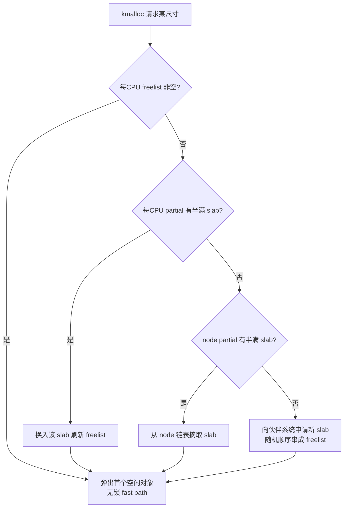
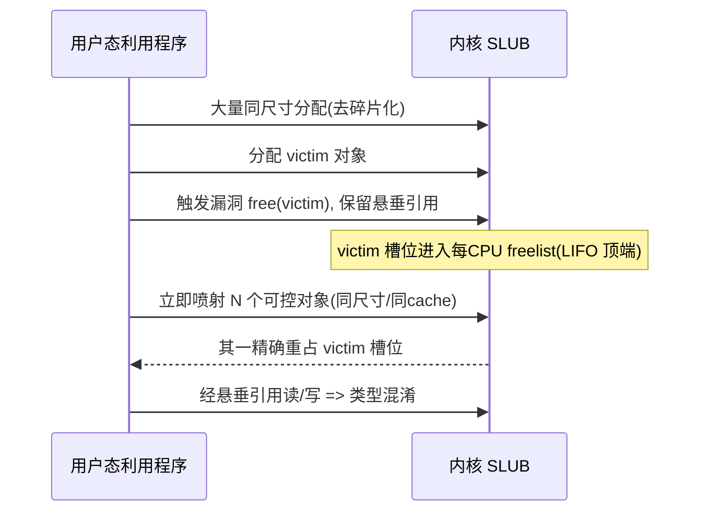
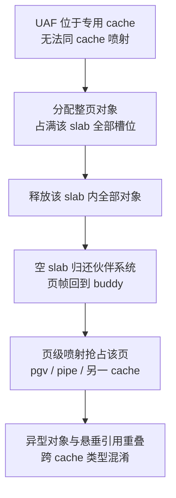
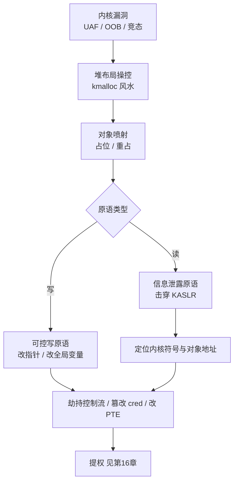

# Linux内核机制与内核利用（15）· 内核利用原语与堆喷

> [!abstract] TL;DR
> - 「原语（primitive）」是把一个原始漏洞（UAF/OOB/竞态）加工成的可复用能力：**读原语**击穿 KASLR、**写原语**改指针或全局变量、**分配原语**决定对象落点；利用的本质是「用低级原语拼出任意读写」。
> - **kmalloc 风水（heap feng shui/grooming）** 是对 SLUB 每-CPU freelist 的 LIFO、slab 合并、去碎片化行为的精确操控，让被害对象与可控对象在同一 slab 内可预测地相邻或重叠。
> - **对象喷射** 依赖「弹性对象」——尺寸用户可控、内容用户可控、生命周期可控的内核对象（`msg_msg`、`sk_buff`、`pipe_buffer`、`setxattr` 缓冲、`add_key` 载荷），用它们占位/重占任意 kmalloc-N cache。
> - **可控写** 的落点分两类：改对象内**函数指针**（`seq_operations`/`tty_struct`/`pipe_buffer->ops`）劫持控制流，或改**全局变量**（`modprobe_path`/`core_pattern`）不劫流直接提权；SLUB freelist 投毒还能换来「任意地址分配」。
> - 现代缓解——`FREELIST_HARDENED`、`FREELIST_RANDOM`、`kmalloc-cg` 分离、`RANDOM_KMALLOC_CACHES`、`init_on_free`——正逼迫利用转向 **cross-cache（跨 cache）** 与 **DirtyCred/DirtyPagetable** 这类不依赖泄露与 ROP 的通用手法。
> - 全流程强调**确定性**：绑核（`sched_setaffinity`）、去噪、按分配器状态机顺序编排 spray，是把「概率利用」变成「一发入魂」的工程核心。

## 概述与定位

在这个系列里，第 14 章讲清了漏洞「是什么」——UAF、OOB、竞态是三类根因。本章要回答的是漏洞「怎么用」的前半程：如何把一个孤立的、往往只是「越界几字节」或「多释放一次」的缺陷，转化成攻击者手里稳定、可复用的**能力单元**，即利用原语（exploitation primitive）。第 16、17 章负责后半程（提权载荷、绕过 SMEP/SMAP/KASLR/KPTI）。可以把整条利用链理解成一条流水线：**原始 bug → 堆布局操控 → 对象喷射 → 读/写原语 → 控制流劫持或数据篡改 → 提权**。本章聚焦中段三块拼图：kmalloc 风水、对象喷射、可控写。

为什么内核利用几乎总是绕不开「堆」？因为绝大多数内核数据结构（进程凭据 `cred`、文件 `file`、套接字、tty、管道缓冲……）都由 slab 分配器从 `kmalloc-N` 系列 cache 里切出。一个堆漏洞若想变现，必须让**被害对象**（存在悬垂引用或会被越界写到的对象）与**攻击者可控对象**在物理内存里精确地相邻或重叠。分配器不是随机撒豆子，它是一台有确定状态机的机器——理解并操控这台机器的行为，就是「堆风水」。

一句话定位：**漏洞给你一次「异常」，原语把这次异常放大成「任意」，堆喷是放大的杠杆。** 与 Windows 内核池风水（见 [[38.Windows内核与驱动逆向/26.内核池风水与利用]]）是同一套思想的两种方言：Windows 玩的是 pool/segment heap 的 chunk 布局，Linux 玩的是 SLUB 的 freelist 与 slab；本章会不时点出二者的深层异同。

## 原理与机制

### SLUB：利用者视角的再认识

第 04 章从内存管理角度讲过伙伴系统与 slab/slub；这里只补齐「攻击者必须盯住」的那几个语义。现代内核（6.8 起 SLAB 已删除，SLUB 是唯一实现）用 SLUB：

- **cache 分级**：通用分配走 `kmalloc-8/16/32/64/96/128/192/256/512/1024/2048/4096/8192`。请求尺寸向上取整到最近的 cache。这意味着尺寸不同但落进同一档的对象是「邻居」。
- **cache 合并（slab merging）**：`find_mergeable()` 会把尺寸/对齐/flags 兼容的专用 cache 合并进通用 kmalloc cache。带构造函数、`SLAB_TYPESAFE_BY_RCU`、或（在开启 memcg 时）`SLAB_ACCOUNT` 的 cache 不合并。**合并对攻击者是大利好**：几十种不同类型的对象共处一 cache，才有「用 A 型对象去重占 B 型对象」的类型混淆空间。
- **每-CPU freelist 与 LIFO**：分配的快路径从 `kmem_cache_cpu` 的 `freelist` 弹出第一个空闲对象；释放的快路径把对象压回同一链表头。**后进先出**——「刚释放的对象，紧接着的同尺寸分配大概率原地拿回」——这是 UAF 重占成立的物理基础。
- **freelist 是嵌在空闲对象体内的单链表**：每个空闲对象在某个偏移 `s->offset` 处存「下一个空闲对象」的指针。这也意味着：一旦你能写进一个**空闲**对象，就能篡改分配器的下一步。

下图是一次 `kmalloc` 走过的判定，越靠上越快、越可控：



### 三块拼图如何咬合

- **kmalloc 风水**负责「把 slab 揉成我要的形状」：去碎片、挖洞、让被害对象落在我预知的槽位。
- **对象喷射**负责「往形状里填我可控的内容」：批量分配弹性对象去占位或重占。
- **可控写**负责「把布局优势兑现成任意写」：越界改到邻居的关键字段，或经悬垂引用改到重占对象的函数指针/freelist 指针。

三者不是线性的三步，而是反复交织：常常先喷射去碎片、再挖洞、再喷射重占、最后写。下面第三段把每一环拆到「不看代码也能懂」的粒度。

## 堆布局操控与利用原语构建详解

### 一、kmalloc 风水：把不确定性榨干

新装的系统里，目标 cache 的 slab 往往是「半满且顺序被打乱」的——直接释放-重占，重占对象未必落到你要的那一格。风水的第一步是**去碎片化（defragmentation）**：连续分配大量同尺寸对象，把所有 partial slab 填满、逼出若干整齐的全新 slab。此时分配器状态被「归零」，后续行为可预测。

第二步是**挖洞（hole punching）**：在一片连续分配的对象里，按需释放特定几个，制造精确的空槽。因为 freelist 是 LIFO，「最后释放的洞，会被下一次分配最先填上」。第三步才是把被害/可控对象投进洞里。

绑核是风水的隐形前提。freelist 是**每-CPU**的：若你在 CPU0 释放、却被调度到 CPU1 分配，就走了慢路径、拿到别的 slab，布局全乱。因此利用程序开场就 `sched_setaffinity` 把自己钉在单核，并尽量减少无关系统调用带来的「分配噪声」。这类似 Windows 上要考虑 per-processor lookaside——见 [[38.Windows内核与驱动逆向/26.内核池风水与利用]]。

**两类缓解直接冲着风水来：**

- `CONFIG_SLAB_FREELIST_RANDOM`：新 slab 的初始 freelist 顺序被打乱，「相邻分配 = 相邻地址」不再成立。对策是**多喷**、用相对布局而非绝对顺序，或改用「释放-立即重占」这种只依赖 LIFO 顶端、不依赖整条链顺序的手法。
- `CONFIG_RANDOM_KMALLOC_CACHES`（6.6+）：为每个 `kmalloc-N` 克隆出多份（当前实现 16 份）副本，按**调用点返回地址的哈希**异或每启动种子来选副本。于是「同尺寸」不再等于「同 cache」——你从系统调用 A 喷的对象，可能进不了被害对象（来自代码路径 B）所在的那份副本。对策：寻找与被害对象**同一调用点/同一份副本**的喷射原语，或干脆放弃同-cache，改走下文的 cross-cache。

### 二、对象喷射：弹性对象武器库

一个对象要成为好的喷射素材，理想上要三「可控」：**尺寸可控**（能打进任意 kmalloc-N）、**内容可控**（能写入伪造指针/魔数）、**生命周期可控**（能按需保活或释放）。满足度越高越万能。常用弹性对象：

| 对象 | 触发接口 | 落点 cache | 特长 |
|---|---|---|---|
| `msg_msg` | `msgsnd/msgrcv` | kmalloc-cg-*（5.14 后被 memcg 计账） | 尺寸 64B~4KB 任意；`MSG_COPY` 可只读不释放（读原语）；改 `m_ts`→越界读 |
| `sk_buff` 数据区 | 收发网络包 | kmalloc-* | 内容近乎全可控，但头部有开销/校验 |
| `pipe_buffer` 数组 | `pipe()`+`F_SETPIPE_SZ` | 默认 kmalloc-1024 | 含 `ops` 函数指针表；数量可调改落点 |
| `setxattr` 缓冲 | `setxattr`（无 xattr 的 fs） | 任意尺寸 | 内容全可控，但**分配即释放**，需 uffd/FUSE 卡住才保活 |
| `add_key` 载荷 | `add_key/keyctl` | 任意尺寸 | 内容可控且**长期驻留**，适合稳定占位 |

`msg_msg` 是「一等公民」，因为它既能喷射、又自带读原语。它的头部布局（64 位）值得刻进脑子：

```
struct msg_msg  (头部固定 48 字节)
偏移  字段            大小  利用价值
0x00  m_list.next     8    链表指针(泄露可暴露 slab 内地址)
0x08  m_list.prev     8
0x10  m_type          8    msgrcv 按 type 定位具体消息
0x18  m_ts            8    ← 文本长度; 改大它 => msgrcv 越界读(泄露原语)
0x20  next            8    ← 指向 msg_msgseg; 改它 => 近似任意地址读
0x28  security        8    LSM 标签指针
0x30  ....            data 用户可控内容(喷射填充)
```

散文讲清它为何强：`msgsnd` 先在内核分配 `48+datalen` 字节、把用户数据拷进 `data` 区，然后消息挂在队列里**一直活着**，直到你 `msgrcv` 取走。于是它同时是「占位器」和「探针」。若某个越界写恰好改到相邻 `msg_msg` 的 `m_ts`（把它从 8 改成 0x1000），随后 `msgrcv(...MSG_COPY...)` 就会从这条消息起**越界拷贝**出后续内存——KASLR 泄露就这么来。若能改 `next` 指向任意地址，则读得更远。正因太好用，内核在 5.14 把它改成 `GFP_KERNEL_ACCOUNT`，从 `kmalloc-*` 挪进独立的 `kmalloc-cg-*`，压缩它与非计账对象的共处面——这是一次「把明星喷射器隔离出去」的定向缓解。

**喷射的两种战术姿势**：

- **重占（reclaim，服务 UAF）**：free 被害对象 → 悬垂引用还在 → 立刻喷 N 份可控对象 → 其一凭 LIFO 落回原槽 → 经悬垂引用把它当原类型读/写，形成**类型混淆**。
- **占位相邻（服务 OOB）**：先排布好可控对象，令被害对象后面**紧跟**一个可控对象，越界写就写进邻居的关键字段（改 `msg_msg->m_ts` 做泄露，或改函数指针）。



### 三、cross-cache：当被害对象在专用 cache

若 UAF 落在**不与 kmalloc 合并的专用 cache**（如 `cred_jar`、`file` 等带 `SLAB_ACCOUNT`/RCU 的 cache），你无法用普通弹性对象同-cache 重占。此时上跨一层，操控**伙伴系统**：把该 cache 的一整个 slab 的对象全部分配出来再全部释放，空 slab 会被 SLUB 归还给 buddy；随后用**页级喷射**（`PACKET_MMAP`/PGV 页、管道页、或另一 cache 的新 slab）抢占这块刚回收的页帧，让异型对象与悬垂引用**跨 cache 重叠**。这是绕过「cache 隔离」类缓解的主力手法。



### 四、可控写：把布局优势兑现成「任意」

拿到「能写到某处」后，落点决定收益，分三条路：

**（1）改对象内函数指针 → 劫持控制流。** 首选那些「小、好分配、含裸函数指针」的对象。经典是 `seq_operations`（32 字节，落 kmalloc-32）：

```
struct seq_operations (32 字节 -> kmalloc-32)
0x00 start  函数指针  ← 覆盖它, read() 时 call *start => 劫持 RIP
0x08 stop   函数指针
0x10 next   函数指针
0x18 show   函数指针
触发: open("/proc/self/stat") 分配; 首次 read() 即调用 start
```

`open("/proc/self/stat")` 会分配一个 `seq_operations`；对它 `read()` 时内核 `call start`。若你用 UAF 把这块重占成可控内容、把 `start` 改成某个 gadget/`stack pivot`，`read()` 一瞬 RIP 即被你接管（如何从这里落地提权、如何配合 SMEP/KPTI，见 [[16.内核提权：ret2usr与ROP与pt_regs]]）。同类还有 `tty_struct`（kmalloc-1024，首字段魔数 `TTY_MAGIC=0x5401` 便于验证重占是否命中，其 `ops` 指向 `tty_operations` 函数表，`open("/dev/ptmx")` 触发）、`pipe_buffer->ops`（配合 `release` 回调）。

**（2）改全局变量 → 不劫流直接提权。** 若你已有「任意地址写 + 已知内核基址」，最省事的是覆盖全局字符串：`modprobe_path`（默认 `"/sbin/modprobe"`）改成 `"/tmp/x"`，随后执行一个「未知格式」的二进制会触发内核以 root 调 `modprobe`，即运行你的脚本；`core_pattern` 改成 `"|/tmp/x"`，制造一次崩溃即让内核以 root 管道运行你的程序。这条路**不碰控制流、不需 ROP、天然规避 CFI/kCFI**（见 [[34.现代二进制防护机制/15.内核防护与kCFI]]），只要有稳定任意写就成立，因而极受青睐。

**（3）改 SLUB freelist 指针 → 换取「任意地址分配」。** 若能写进一个**空闲**对象的 freeptr，就能让下一次分配返回你指定的地址，等价于「在任意地址凭空造一个对象」，再往里写可控内容。但 `CONFIG_SLAB_FREELIST_HARDENED` 让这条路变难——存进去的不是裸指针：

```
存入空闲对象 freeptr 处的值:
  stored = next_ptr  XOR  s->random  XOR  swab(&freeptr)
其中:
  next_ptr    下一个空闲对象的真实地址
  s->random   每个 kmem_cache 一份的每启动 64 位随机数
  swab(x)     x 的字节序翻转; &freeptr 为该指针的存放地址
=> 想伪造 freelist 指向目标 T, 必须构造:
  fake = T XOR s->random XOR swab(&freeptr)
  需同时已知 s->random 与写入槽位地址, 单纯覆盖失效
```

散文解释这道「三重异或」的巧思：把 `s->random` 混进去，攻击者不泄露该 cache 的随机数就伪造不出合法指针；把 `swab(&freeptr)`（存放位置地址的字节翻转）混进去，则**同一 slab 内不同槽位的编码互不相同**，堵死「抄邻居的编码值来做部分覆盖」的偷懒。加之 5.7 起 freeptr 被挪到对象**中部**（而非头部），越界覆盖对象开头（常放 vtable/魔数）时不会立刻踩到 freeptr——这层「错位」进一步抬高了门槛。破法通常回到「先拿读原语泄露 `s->random`，再精确构造 `fake`」，或绕开 freelist 走上面的（1）（2）。

### 五、原语的「组合律」：读 × 写 → 任意读写

单个原语很少直接通关；利用是把原语**串成链**。典型闭环：先用一次 OOB/UAF 制造**受限读**（如 `msg_msg` 越界读）→ 泄露内核基址击穿 KASLR、再泄露目标对象地址；再用一次 UAF 制造**受限写**（改函数指针或 freelist）→ 升级为**任意写**；有了任意读 + 任意写，剩下的只是选载荷。近年两种「通用兑现」尤其值得记：

- **DirtyCred**：把 `struct file`/`struct cred` 的 UAF，转成「用一个高权限对象替换掉低权限对象」，**无需泄露、无需 ROP、无需劫流**即可提权/改写只读文件；本质是「让类型混淆发生在权限对象上」。
- **DirtyPagetable**：用 UAF/OOB 让可控对象与**页表项（PTE）**重叠，改一个 PTE 即获得对任意物理页的读写——这是最强的写原语，直接越过 KASLR/CFI，堪称「一旦到手即游戏结束」。

下面这张总图把「bug→原语→兑现」的分叉画全：



## 工具视角与实战

**看清 cache 与对象落点。** `cat /proc/slabinfo` 列出各 cache 的对象大小、每 slab 对象数、活跃/总数——判断某尺寸落哪档、观察喷射前后活跃数变化以确认命中。`pahole -C msg_msg vmlinux`（或对任意结构体）打印**精确偏移与洞**，是确定 `m_ts`/`next`/`ops` 在第几字节的权威手段，比读源码更防版本漂移。`/sys/kernel/slab/<cache>/` 下的 `object_size`、`slab_size`、`cpu_partial`、`order` 揭示该 cache 的几何，`red_zone`/`poison`/`store_user` 则告诉你调试特性是否开着。

**调试与观察布局。** 用 QEMU 起内核 + `gdb` 远程接入（配合 `vmlinux` 符号）单步看分配器状态；启动参数 `slub_debug=FZPU,kmalloc-1024`（或 `,<cache>`）开启红区、投毒、双释放检测与 owner 记录，能在开发利用时把「越界/UAF 命中哪个字节」直接打到 dmesg。`CONFIG_KASAN` 是最强的越界/UAF 侦测器（影子内存精确到字节），研究阶段用于**定位原语的可达边界**极为高效（生产不开，性能代价大）。`ftrace`/`kprobe`（见 [[13.内核调试：kgdb与ftrace与crash]]）可挂在 `kmem_cache_alloc`/`kfree` 上，观察喷射真实打到哪。

**风水代码骨架（示意，讲清编排逻辑）。** 一份稳定利用通常这样组织：`sched_setaffinity` 绑核 → 循环 `msgsnd` 去碎片并占满 partial → 分配 victim → 释放 victim（保留悬垂 fd/引用）→ 紧接一个**同 cache** 的喷射循环（`open("/proc/self/stat")` 批量造 `seq_operations`，或 `add_key` 批量造载荷）→ 经悬垂引用读回验证魔数命中 → 写函数指针/触发。每一步之间尽量**不夹入无关分配**，以免污染 freelist 顶端。

**CTF 语境。** kernelCTF、corCTF、D3CTF 等把这些手法标准化：题目给一个自写 LKM 的 `ioctl`（见 [[10.字符设备与ioctl攻击面]]）暴露 UAF/OOB，选手用 `msg_msg`/`seq_operations`/`pipe_buffer` 喷射、`modprobe_path` 收尾。围绕它沉淀了大量可复用「exploit 骨架」与查表（哪个尺寸配哪个喷射器、哪个对象含函数指针），是学习本章最好的动手场。真实漏洞的发现侧，则交给 [[49.Fuzzing与漏洞挖掘/14.内核与驱动Fuzzing：syzkaller]] 与本系列第 18 章。

**版本/平台差异要记账。** 同一手法跨版本常失效：`msg_msg` 5.14 后进 `kmalloc-cg`；6.6 后 `RANDOM_KMALLOC_CACHES` 打乱同-cache 假设；`init_on_free` 默认开与否随发行版不同；结构体偏移随小版本浮动（务必对目标内核跑 `pahole`）。做利用先固定「目标内核 config + 版本」，再选手法，而非反过来。

## 安全性与正确使用

> [!caution] 合规边界（务必先读）
> 本章内容仅用于**防御研究、漏洞修复验证、CTF 靶场与教学**，且仅可在**你本人拥有或已获书面授权**的环境中实践。文中一切原语均以**原理与检测**视角呈现：不提供针对真实生产系统或他人系统的武器化成品链，不为绕过任何商业授权/许可提供可直接投递的配方。未经授权对系统实施内存破坏利用、提权或权限维持，在多数司法辖区均属犯罪。把这些知识用于「加固与教育」，而非「攻击他人」。

站在防御方，理解攻击原语的价值在于**知道该开哪些开关、该盯哪些信号**：

- **让风水失效**：开启 `CONFIG_SLAB_FREELIST_RANDOM`、`CONFIG_SLAB_FREELIST_HARDENED`、`CONFIG_RANDOM_KMALLOC_CACHES`；它们不消灭漏洞，但把「确定性利用」压回「概率利用」，显著抬高成本。
- **让重占无料可读**：`init_on_free=1`（或 `CONFIG_INIT_ON_FREE_DEFAULT_ON`）在释放时清零对象，UAF 读回的是 0，掐断「读残留指针泄露」；`init_on_alloc` 同理防未初始化泄露。代价是性能，需权衡。
- **让越界拷贝被拦**：`CONFIG_HARDENED_USERCOPY` 在 `copy_to/from_user` 时校验缓冲不越过 slab 对象边界，阻断一部分「越界读写用户缓冲」型泄露。
- **收缩喷射面**：`kmalloc-cg` 分离把 memcg 计账（多为攻击者可诱发）的分配与非计账对象隔开；对高价值对象（`cred` 等）用不合并的专用 cache。
- **限制辅助原语**：`vm.unprivileged_userfaultfd=0`（默认）与对 FUSE 的管控，削弱「卡住内核拷贝以保活瞬态对象/赢竞态」的能力。
- **收缩武器落点**：`modprobe_path`/`core_pattern` 类全局串是经典写靶，可结合 LSM/IMA（见 [[11.LSM与SELinux与AppArmor]]）与只读化、以及最小化 `modprobe` 触发面来缓释。
- **纵深与检测**：结合 KASLR/SMEP/SMAP/KPTI（见 [[17.绕过内核防护：KASLR与SMEP与SMAP与KPTI]] 与 [[34.现代二进制防护机制/15.内核防护与kCFI]]）与 kCFI；运行时用 KASAN（研究）、生产用异常分配模式监控（某进程短时暴涨 `msg`/key/pipe 计数往往是喷射特征）。

一句话：**缓解不是消灭漏洞，而是逐项拆掉「把漏洞变成任意读写」所依赖的确定性与素材**。攻防的真实战线，正是在这些开关的一开一关之间来回拉扯。

## 小结

本章把「漏洞→利用」的中段拆成三块并逐层讲透：**kmalloc 风水**是对 SLUB 每-CPU freelist（LIFO）、cache 合并、去碎片与挖洞的精确操控，目标是让被害对象与可控对象可预测地相邻或重叠；**对象喷射**用 `msg_msg`/`sk_buff`/`pipe_buffer`/`setxattr`/`add_key` 这些「尺寸-内容-生命周期」可控的弹性对象去占位或重占任意 kmalloc-N；**可控写**把布局优势兑现成任意能力——或改对象内函数指针（`seq_operations`/`tty_struct`）劫流，或改全局串（`modprobe_path`/`core_pattern`）不劫流直接提权，或投毒 freelist 换任意分配。当同-cache 之路被 `FREELIST_HARDENED`/`RANDOM_KMALLOC_CACHES`/`kmalloc-cg` 堵住，利用转向 **cross-cache** 与 **DirtyCred/DirtyPagetable** 这类不依赖泄露与 ROP 的通用兑现。贯穿始终的方法论只有一个词——**确定性**：绑核、去噪、按分配器状态机顺序编排。理解了这套原语工厂，第 16 章的提权载荷与第 17 章的防护绕过才有立足之地。

## 相关阅读

- 本系列前置：[[14.内核漏洞类型：UAF与OOB与竞态]]（本章原语所加工的原始 bug 三类根因）
- 本系列后续：[[16.内核提权：ret2usr与ROP与pt_regs]]（拿到控制流/任意写之后的提权载荷）、[[17.绕过内核防护：KASLR与SMEP与SMAP与KPTI]]（读原语为何要击穿 KASLR、写原语如何避开 SMEP/SMAP）
- 分配器原理：[[04.虚拟内存：伙伴系统与slab与slub]]（SLUB/伙伴系统的内存管理视角，本章的攻击视角与之互补）
- 攻击面来源：[[10.字符设备与ioctl攻击面]]（多数可复现堆漏洞由此暴露）、[[13.内核调试：kgdb与ftrace与crash]]（调试与观察布局的工具）
- Windows 对称阅读：[[38.Windows内核与驱动逆向/13.内核漏洞与利用基础]]、[[38.Windows内核与驱动逆向/26.内核池风水与利用]]（pool/segment heap 风水，与 SLUB 的同异）
- 防护呼应：[[34.现代二进制防护机制/15.内核防护与kCFI]]、[[11.LSM与SELinux与AppArmor]]
- Fuzzing 呼应：[[49.Fuzzing与漏洞挖掘/14.内核与驱动Fuzzing：syzkaller]]
- 权威资料：内核源码 `mm/slub.c`（`freelist_ptr`/`__slab_alloc`）、内核文档 `Documentation/dev-tools/kasan.rst` 与 `Documentation/mm/slub.rst`、`slub_debug` 启动参数说明；书目《A Guide to Kernel Exploitation》《Linux Kernel Programming》；`pahole`(dwarves) 与 `/proc/slabinfo` 手册页

[[00.Linux内核机制与内核利用总览|⬆ 系列总览]] | [[14.内核漏洞类型：UAF与OOB与竞态|← 上一章]] | [[16.内核提权：ret2usr与ROP与pt_regs|→ 下一章]]
