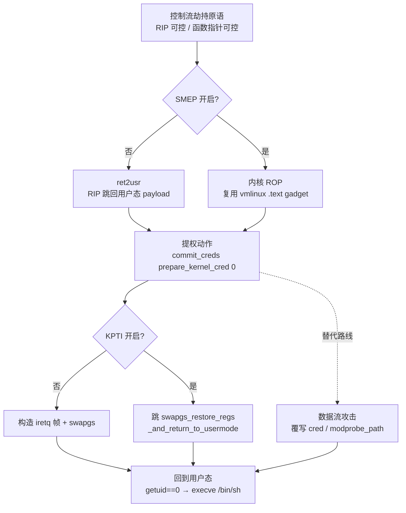
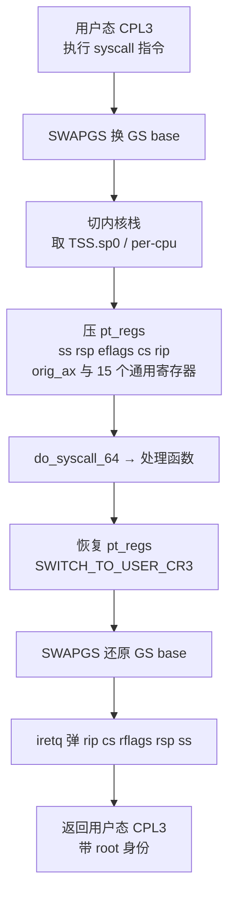

# Linux内核机制与内核利用（16）· 内核提权：ret2usr与ROP与pt_regs
> [!abstract] TL;DR
> - 本篇讲"最后一公里"：把 ch14/ch15 得到的控制流劫持原语，转化为真正的 root——三条路线 ret2usr（前 SMEP 时代）、内核 ROP（前 kCFI 时代）、数据流覆写 cred/modprobe_path（后 CFI 时代）沿防护演进依次登场。
> - 内核态提权目标唯一：拿到一份 uid=0、满 capability 的 cred。经典配方 `commit_creds(prepare_kernel_cred(0))`；较新内核改用 `commit_creds(&init_cred)` 或直接把 cred 里 8 个 32 位 id 清零。
> - pt_regs 是贯穿全篇的暗线：它既是 syscall 入口在内核栈顶保存的寄存器块（进入时几乎全部由攻击者控制），又是返回用户态的载体（iretq 帧的来源）——理解它才能理解"从哪来、回哪去"。
> - 返回用户态要精确重建 `iretq` 帧（rip/cs/rflags/rsp/ss）并配 `swapgs`；KPTI 开启后必须借道 `swapgs_restore_regs_and_return_to_usermode` 蹦床完成 CR3 切换，否则一条 `iretq` 就崩。
> - SMEP 杀死 ret2usr、SMAP 迫使 ROP 链驻留内核内存、KASLR 要求先泄漏内核基址——这些防护的细节在 ch17，本篇只把它们当作"逼出下一代技术"的推手。

## 概述与定位

前面两章分别讲了漏洞类型（ch14：UAF/OOB/竞态）和利用原语（ch15：任意读写、堆喷、控制流劫持）。本章接手的是**提权链条的最后一段**：假设你已经拿到了"内核态某处 RIP 可控"或"内核态一次任意写"这样的原语，如何把它变成一个真正在你手里跳出来的 `# ` root shell。换句话说，ch14 找到裂缝，ch15 把裂缝撬成撬棍，ch16 用撬棍打开保险柜。

内核提权和用户态 exploit 的最大区别在于"目标语义"不同。用户态里你劫持了 RIP，通常直接 ROP 到 `system("/bin/sh")` 就赢了；内核态里劫持 RIP 只是**手段**，赢的**标志**是"当前进程的凭据变成 root"。因为内核和所有进程共享同一套地址空间视图（内核映射在每个进程的高半区），你在内核态能做的事几乎无限，但你最终还是要"活着回到你那个用户态进程"，并让这个进程带着 root 身份跑下去。这就决定了内核提权天然是"去程 + 回程"两段式：去程做提权动作，回程干净地返回用户态。**pt_regs 正是连接去程与回程的那根轴**——它是 syscall 进入内核时在内核栈顶保存的那一整块寄存器现场，回程时又要靠它（或它的等价物）把 CPU 送回 ring 3。

历史上，提权技术沿着"防护每加一道、攻击就退一步"的节奏演进，本章的三个关键词恰好是三个时代的代表：

- **ret2usr（return-to-user）**：内核态把 RIP 直接跳回一段位于**用户内存**的提权代码。简单粗暴，在 SMEP 出现前是标准答案。
- **内核 ROP**：SMEP 禁止 CPL0 执行用户页后，只能复用内核自身 `.text` 里的 gadget 拼出提权逻辑，本质是把 ret2usr 的那段代码"用内核的砖头重砌一遍"。
- **数据流攻击（覆写 cred / modprobe_path）**：kCFI/FineIBT 约束了间接调用与返回、让 ROP 越来越难之后，攻击者干脆不劫持控制流，只用一次任意写改内核里的一个关键数据，等内核自己走到那里替你提权。

需要划清与相邻章节的边界：**KASLR、SMEP、SMAP、KPTI 这些防护本身及其绕过在 ch17**，本章只解释它们"为什么逼出了下一代技术"，不展开绕过配方；**堆喷、cross-cache、原语构造在 ch15**，本章默认你已经有原语。与 Windows 的对称在 [[38.Windows内核与驱动逆向/13.内核漏洞与利用基础]]——Windows 上等价目标是"偷 SYSTEM 进程的 Token"，Linux 上则是"换 cred"，思路同源、结构不同，读完两边会对"OS 如何存放特权"有立体认识。

## 原理与机制

要讲清 ret2usr 和 ROP，得先把三件底层事实摆平：**特权级如何切换、cred 如何决定身份、返回用户态经过哪些门**。

### 特权级、段与地址空间

x86-64 上进程跑在 CPL3（ring 3），内核跑在 CPL0（ring 0）。CPL 由当前代码段选择子 `CS` 的低 2 位决定，因此"我现在是不是内核"这件事，物理上就写在 `CS` 里。地址空间被 canonical 规则劈成两半：低半区（`0x0000...`）给用户，高半区（`0xffff8000...` 起）给内核，内核映射进**每一个**进程的高半区且带 U/S=Supervisor 标志——这既是内核能随手访问任意进程内存的根源，也是 ret2usr 得以成立的土壤：内核在 CPL0 下取指，MMU 不会因为目标地址落在用户区就天然拒绝（在 SMEP 之前）。

### syscall 入口：pt_regs 是怎么诞生的

用户态执行 `syscall` 指令后，CPU 做的事很有限：把用户 RIP 存进 `RCX`、RFLAGS 存进 `R11`，按 `MSR_LSTAR` 跳到内核入口 `entry_SYSCALL_64`，切到 CPL0，但**不切栈、不切 GS**。剩下的全靠软件补齐：先 `swapgs` 把 GS base 从"用户 TLS"换成"内核 per-cpu"，再从 per-cpu 里取出内核栈指针切栈，然后把一整套寄存器按固定顺序压栈——压完的这块内存，就是 `struct pt_regs`。

```text
struct pt_regs（x86-64，低地址→高地址，即栈顶→栈底方向）
  +0x00 r15
  +0x08 r14
  +0x10 r13
  +0x18 r12
  +0x20 rbp
  +0x28 rbx
  +0x30 r11
  +0x38 r10
  +0x40 r9
  +0x48 r8
  +0x50 rax
  +0x58 rcx
  +0x60 rdx
  +0x68 rsi
  +0x70 rdi
  +0x78 orig_rax   ; 进入时的系统调用号
  +0x80 rip        ; ← 返回用户态的地址（来自 rcx）
  +0x88 cs         ; ← __USER_CS，决定回到 ring 3
  +0x90 eflags     ; ← 来自 r11
  +0x98 rsp        ; ← 用户栈
  +0xa0 ss         ; ← __USER_DS
```

这里藏着本章第一个关键认知：**pt_regs 里 r15~r8、rbp、rbx、以及 rdi/rsi/rdx 等，全部是你进 syscall 前放进寄存器的值**。也就是说，只要你想，内核栈顶那十几个 qword 几乎完全由攻击者投喂。后面讲 pt_regs 复用时会反复用到这一点。

### cred：Linux 把"你是谁"存在哪

每个 `task_struct` 挂着两个凭据指针：`real_cred` 和 `cred`（有效凭据）。`struct cred` 里塞着 `uid/gid/suid/sgid/euid/egid/fsuid/fsgid` 八个 32 位 id，外加四组 `kernel_cap_t` 能力位。**"我是 root"在内核里没有别的含义，就是"当前 task 的 cred 里这些 id 是 0、能力位是满的"**。改变身份的正规入口是 `commit_creds(struct cred *new)`：它把 `new` 装到 `current->cred` 上（走 RCU 替换旧的）。而 `prepare_kernel_cred(NULL)` 会仿照 init 进程伪造出一份全 root 的新 cred。于是经典提权就是一句：

```c
commit_creds(prepare_kernel_cred(0));  // 造一份 root cred 并装到当前进程
```

> 版本陷阱：在 6.2 前后，`prepare_kernel_cred(NULL)` 的取值/校验语义有过调整，一些利用作者改用 `commit_creds(&init_cred)`——`init_cred` 是内核内置的那份 root 凭据，直接拿地址用即可，省掉一次 `prepare_kernel_cred`。这条差异在跨内核版本移植 exploit 时经常踩坑。

### 返回用户态：iretq 帧与 swapgs

内核干完活要回用户态，正规路径是 `iretq`（或更快但更受限的 `sysretq`）。`iretq` 从栈上依次弹出 5 个 qword：`RIP、CS、RFLAGS、RSP、SS`，并据 `CS`/`SS` 的 RPL 切回 CPL3。因此**回程的本质就是在栈上摆好这 5 个值再 `iretq`**：

```text
iretq 期望的栈布局（低地址在上，iretq 从上往下弹）
  [rsp+0x00] user_rip     ; 你要回到的用户函数
  [rsp+0x08] user_cs      ; __USER_CS（RPL=3）
  [rsp+0x10] user_rflags  ; 通常预存一份，含 IF
  [rsp+0x18] user_rsp     ; 一段可用的用户栈
  [rsp+0x20] user_ss      ; __USER_DS（RPL=3）
```

`iretq` 之前必须 `swapgs`，把 GS base 换回用户 TLS——否则用户态一读 `%gs:` 就读到内核 per-cpu，轻则数据错乱重则崩溃/泄漏。这也是为什么后面 ROP 链的收尾往往不是自己拼 `swapgs; iretq`，而是直接跳内核现成的返回蹦床：**顺序、CR3、GS 一步都不能错，自己拼极易翻车**。

## 指令与执行详解：从RIP劫持到root shell

这一段把三条路线逐一拆到"不看代码也能讲清"的粒度。



### ret2usr：让内核跳回你写的代码

思路极简：在用户态写好一个 `escalate()` 函数，函数体就是 `commit_creds(prepare_kernel_cred(0))`（两个函数地址在无 KASLR 时是已知常量，或从 `/proc/kallsyms`、`System.map` 拿），然后想办法把内核态的 RIP 劫持成 `escalate` 的用户态地址。内核在 CPL0 上"替你"执行了这段代码，`current->cred` 就被换成 root。

为什么这招在早期无往不利？因为**内核取指时不检查目标页是不是用户页**——CPL0 有最高权限，跳哪执行哪。攻击者甚至不需要 gadget，一整段 C 逻辑随便写，还能顺手在同一个 `escalate()` 末尾把回程需要的 `swapgs; iretq` + 栈帧一并写好，一气呵成。

去程之前有个必做动作：**在进 syscall 触发漏洞之前，先把用户态现场存下来**，供回程 `iretq` 用。

```c
unsigned long u_cs, u_ss, u_rsp, u_rflags;
void save_state(void){
    __asm__ volatile(
        "movq %%cs,  %0\n"
        "movq %%ss,  %1\n"
        "movq %%rsp, %2\n"
        "pushfq\n popq %3\n"
        : "=r"(u_cs),"=r"(u_ss),"=r"(u_rsp),"=r"(u_rflags) :: "memory");
}
```

ret2usr 的死因是 **SMEP（Supervisor Mode Execution Prevention，CR4 第 20 位）**：一旦置位，CPL0 从"U/S=User"的页取指立刻触发缺页/GP，内核 oops。于是"跳回用户代码"这条路被物理封死。理论上你可以在 ROP 阶段先用 `mov cr4, rXX` 之类 gadget 把 SMEP 位抠掉再 ret2usr，但现代内核对 CR4/CR0 关键位做了 **pinning**（`native_write_cr4` 会把被清掉的保护位再或回去），这条"曲线 ret2usr"基本也堵上了——细节留给 ch17。

### pt_regs：既是弹药也是回程票

pt_regs 在利用里有三重身份，值得单独拎出来讲透：

**其一，它是攻击者可控的一块高质量便签内存。** 前面说过，syscall 进入时 r15~r8、rbp、rbx 等都由你在用户态填好。这意味着内核栈顶那片 pt_regs 区域，是一块"位置半已知、内容你说了算"的连续 buffer。经典技巧"**stack pivot 到 pt_regs**"就是：当漏洞只给你一次"控制 RIP + 控制一个寄存器"的机会、不足以直接铺 ROP 链时，找一个把 `rsp` 指向 pt_regs 区域的 pivot gadget（例如 `push rXX; pop rsp; ret` 或 `mov rsp, rXX` 类），让 CPU 把你在 pt_regs 里预置的那十几个 qword 当成 ROP 链吃下去。你等于用系统调用的寄存器传参，隔空在内核栈上写好了一条链。

**其二，它是返回用户态的模板。** 回程要的 `rip/cs/rflags/rsp/ss` 恰好就是 pt_regs 的尾部五个字段。任何"干净返回"最终都要凑出一个合法 pt_regs 尾。

**其三，它可被伪造以劫持返回。** 数据流攻击里，如果你能改写内核栈上的 pt_regs（比如通过一次栈相关的 OOB），直接把 `pt_regs.rip` 改成目标、`pt_regs.cs` 设成 `__USER_CS`，等这次 syscall 自然返回时，内核就"合法地"把你送到任意地址、任意特权级——连 gadget 都省了。这类似用户态的 SROP（sigreturn 伪造现场）在内核里的影子。

一个现实约束：`CONFIG_RANDOMIZE_KSTACK_OFFSET` 会在每次 syscall 给内核栈加一个随机偏移，让 pt_regs 的**绝对**地址每次抖动；但 pt_regs 相对栈顶的**结构**不变，靠 pivot/相对定位的手法不受影响，靠硬编码绝对地址的手法会失效。

### 内核 ROP：用内核的砖头重砌 escalate()

SMEP 之后，提权代码必须由**内核 `.text` 里已有的字节**拼出来。vmlinux 通常几十 MB，gadget 极其丰富，用 `ROPgadget`/`ropper` 一扫一大把。一条最小提权链的骨架是：

```text
; 目标：rax = prepare_kernel_cred(0); commit_creds(rax); 返回用户态
[pop rdi ; ret]                 ; rdi = 0
[0]
[prepare_kernel_cred]           ; rax ← 新 root cred
[mov rdi, rax ; ret]            ; 把返回值搬进第一个参数（这一步最磨人）
[commit_creds]                  ; 安装 root cred
[swapgs_restore_regs_and_return_to_usermode + off]  ; 回程蹦床
[dummy] [dummy]                 ; 蹦床要吃掉的两个占位 qword
[user_rip] [user_cs] [user_rflags] [user_rsp] [user_ss]  ; iretq 帧
```

几处必须讲清的门道：

- **rax→rdi 的搬运是链子里最别扭的一环。** `prepare_kernel_cred` 把结果放 `rax`，而 `commit_creds` 从 `rdi` 取参数，你需要一个 `mov rdi, rax; ret` 之类的桥。这种桥 gadget 不一定存在，实战里常退而求其次：用 `mov rdi, rax; call rXX`（再吃掉一个返回地址）、或 `push rax; pop rdi; ret`、或干脆改用 `commit_creds(&init_cred)`——`init_cred` 地址是常量，一个 `pop rdi; ret` 直接喂进去，绕开搬运难题。
- **KASLR 让 gadget 地址不再是常量。** 上面所有内核地址都要加上运行时泄漏出的内核基址（`kbase`）再用；没有 leak，这条链根本无从落地。如何拿 leak 属于 ch17。
- **SMAP 决定 ROP 链存哪。** SMAP（CR4 第 21 位）禁止 CPL0 访问用户页数据。开了 SMAP，你就不能"把链子铺在用户内存，再 pivot `rsp` 过去"——CPL0 一读用户页就 fault。因此链子必须驻留**内核内存**：要么喷进内核堆（ch15 的堆喷/占位对象），要么就用上面说的 pt_regs（内核栈）。这也是为什么现代内核 pwn 里"把 ROP 链喷进某个内核对象再触发调用"成了标准姿势。
- **栈对齐与寄存器污染。** 某些内核函数对 `rsp` 16 字节对齐敏感、或会踩 `rbx/rbp`；链子中途要留意别让关键寄存器被中间 gadget 破坏，必要时插入对齐用的 `ret`。

### 回程：iretq 帧与 KPTI 蹦床



没有 KPTI 时，回程可以自己拼：一个 `swapgs; ret` gadget 加一个 `iretq` gadget，后面跟上预先摆好的 5 元组 iretq 帧即可。**有 KPTI（页表隔离）时，麻烦大了**：内核态用的是"内核 CR3"（映射全部内核），用户态用的是"用户 CR3"（内核部分几乎不映射，只留一小块蹦床）。你若在内核 CR3 下直接 `iretq` 回用户，用户代码所在页在内核 CR3 里可能没映射、且没做 CR3 切换，`iretq` 后瞬间三重错误。

解决办法是**借道内核自带的返回蹦床 `swapgs_restore_regs_and_return_to_usermode`**。这个符号后半段专门干三件事：`SWITCH_TO_USER_CR3`（切回用户 CR3）→ `swapgs` → `iretq`，而且它落在两套 CR3 都映射的蹦床区。利用时通常**跳到该符号 + 一个偏移**，偏移用来跳过开头那段 `POP_REGS`（它会连弹一堆寄存器），直接落在"接下来就要用栈上数据切 CR3 并 iretq"的位置。此时栈需要按它的预期摆：先是两个会被它消费/占位的 qword，紧跟着标准的 `rip/cs/rflags/rsp/ss` 五元组。

> 这个偏移**随内核版本变化**（不同编译下 `POP_REGS` 展开长度不同），常见值如 `+22`，但**必须对着目标 vmlinux 反汇编逐条确认**，照抄别人的偏移是新手最常见的崩溃原因。

回到用户态后，落点是你 `save_state` 时约定的那个函数，一般先 `getuid()` 确认返回 0，再 `execve("/bin/sh", ...)` 起 shell。注意此刻你是"从一次系统调用里非正常地跳出来"，进程的其他状态未必自洽，通常在拿到 shell 前不做多余动作，见好就收。

### 数据流提权：不劫持控制流，只改一个数

当 kCFI/FineIBT 让 ROP/间接调用越来越难，最优雅的路线是**根本不碰控制流**，用一次任意写改内核里的关键数据，让内核自己替你提权。两个最常用靶子：

**靶子 A：直接覆写当前进程的 cred。** cred 里那 8 个 id 是连续的 32 位值，构成一个极好认的"指纹"——普通用户 uid=1000 时，内存里就是 8 个连续的 `0x000003e8`。

```text
struct cred 关键字段（连续排布，是可扫描的指纹）
  usage        (atomic, 勿动，动了引用计数崩)
  uid  gid     ; 4B + 4B
  suid sgid    ; 4B + 4B
  euid egid    ; 4B + 4B   ← 这 8 个 id 连成 32 字节
  fsuid fsgid  ; 4B + 4B
  ... cap_inheritable / permitted / effective / bset / ambient ...
```

拿到当前 cred 的地址后，把这 32 字节（8 个 id）全写 0，进程即刻变 root；讲究点的再把几组 `cap_*` 写成全 1。**找 cred 地址**的经典无泄漏手法：`prctl(PR_SET_NAME, "some_magic")` 给自己的 `task_struct->comm` 打个独特标记，再用任意读扫内核堆定位到该 `comm`，由固定偏移回推到 `task_struct->cred` 指针，解引用即得。要点是**别碰 `usage` 引用计数、别去替换整个指针**（那会牵扯 RCU 释放），只改字段最稳。

**靶子 B：覆写 `modprobe_path`。** 这是纯"只需一次任意写 + 内核基址"的降维打击，连 cred 地址都不用找。内核里有个全局字符串 `modprobe_path`（默认 `"/sbin/modprobe"`）。当系统尝试执行一个"无法识别格式"的可执行文件、或加载一个缺失的模块时，内核会以 **root 身份**调用 `call_usermodehelper(modprobe_path, ...)`。于是：把 `modprobe_path` 改写成 `"/tmp/x"`（你的脚本），再故意 `execve` 一个魔数非法的文件触发路径，内核就用 root 跑了你的脚本。`core_pattern`（设成 `"|/tmp/x"`，进程 core dump 时以 root 触发）是同族技巧。这条路的美妙在于**目标是固定符号**（只依赖 KASLR 基址、不依赖堆布局），且完全绕过控制流防护。防御侧的对策是 `CONFIG_STATIC_USERMODEHELPER`，把 usermodehelper 路径钉死。

## 工具视角与实战

一套内核 pwn（尤其 CTF）的工作流大致如下，工具各司其职：

- **取 vmlinux**：题目常给 `bzImage`/`vmlinuz`（压缩内核）。用内核源码里的 `scripts/extract-vmlinux bzImage > vmlinux` 解出未压缩 ELF，才能扫 gadget、看符号。
- **找 gadget**：`ROPgadget --binary vmlinux`、`ropper -f vmlinux`。重点找 `pop rdi; ret`、`mov rdi, rax; ret`（或替代桥）、`push rXX; pop rsp` 类 pivot、以及内核自带的 `swapgs`/返回蹦床。
- **要符号地址**：`commit_creds`、`prepare_kernel_cred`、`init_cred`、`swapgs_restore_regs_and_return_to_usermode`、`modprobe_path` 的地址，从题目给的 `System.map` 或运行时 `/proc/kallsyms`（常被 `kptr_restrict`/`dmesg_restrict` 关掉）取；有 KASLR 时这些是"相对基址的偏移"，运行时加 leak。
- **要结构体偏移**：`pahole -C cred vmlinux`、`pahole -C task_struct vmlinux`（需内核带 BTF 或 DWARF）给出 `task_struct->comm`、`->cred`、cred 内字段的精确偏移——不同 `.config` 下偏移会变，务必对目标内核实测。
- **调试**：QEMU 起题时加 `-s -S`（gdbstub + 冻结），gdb 里 `add-symbol-file vmlinux` 后下断、看寄存器、验证链子。观察 `run.sh` 里 `-cpu`（是否 `+smep,+smap`）、`-append`（`nokaslr`、`kpti=1`、`pti=on`）来判断题目开了哪些防护，直接决定你走 ret2usr 还是 ROP、回程用不用蹦床。

一个可落地的 exploit 骨架（去掉具体漏洞触发）长这样：

```c
int main(void){
    save_state();                 // 1. 存用户现场，供回程 iretq
    // 2. （ch15）打开设备/建立堆布局/拿泄漏，算出 kbase
    // 3. 触发漏洞：改 RIP → 指向 ROP 链，或做一次任意写
    trigger_bug();
    // 4. 控制流回到这里（数据流路线）或跳到 win()（控制流路线）
    win();                        // getuid()==0 ? execve("/bin/sh")
    return 0;
}
```

实战常见翻车点，逆向视角尤其要留意：**蹦床偏移抄错**（版本不符）、**iretq 帧少摆/多摆占位 qword**、**忘了 `swapgs` 导致回用户后立刻崩**、**SMAP 下把链子放在了用户页**、**KASLR 基址算错一个页**、**改 cred 时误伤 `usage`**、**pt_regs 绝对地址被 kstack 随机化打乱**。这些几乎都表现为"内核 oops / 进程段错误"，配合 QEMU 的 `-d int,cpu_reset` 和 gdb 单步能快速定位是哪一门没过。

## 安全性与正确使用

> [!caution]
> 本文所有原理、链条骨架与技巧，**仅用于你拥有或已获明确书面授权的环境、CTF 靶场与防御研究**。内核提权直接跨越操作系统的安全边界，在未授权的真实系统上实施属于违法行为。本文一律采取**防御/教育视角**：只讲"机制为何这样、防护为何有效"，**不提供针对任何真实生产系统或他人系统的成品武器化步骤，也不为绕过商业授权/DRM 提供可直接套用的配方**。请把这些知识用于加固、检测与教学。

从防御工程角度，本章每种技术都对应着可落地的缓解，值得反过来读：

- **对 ret2usr**：开启 **SMEP**（CPL0 禁取用户页）从根上封死"跳回用户代码"；配合 CR4/CR0 关键位 pinning，防止 exploit 中途把 SMEP 抠掉。
- **对内核 ROP**：**SMAP** 迫使链子无处安放（不能借用户页），**KASLR** 抬高地址不确定性，**kCFI/FineIBT** 约束间接调用/返回的合法目标，让 gadget 链难以成立——这条线的纵深见 [[34.现代二进制防护机制/15.内核防护与kCFI]] 与 ch17。
- **对回程蹦床滥用与 pt_regs 复用**：**KPTI** 让随意 `iretq` 回用户变得极易崩，**`CONFIG_RANDOMIZE_KSTACK_OFFSET`** 打乱内核栈绝对地址，削弱硬编码 pt_regs 定位。
- **对数据流提权**：**`CONFIG_STATIC_USERMODEHELPER`** 钉死 `modprobe_path` 之类的 usermodehelper 路径；**hardened usercopy、SLAB freelist 加固、`init_on_alloc/free`** 抬高任意读写定位关键对象的门槛；对 `commit_creds` 的异常调用者、对进程"无正当 setuid 却变 root"做审计/检测（EDR、内核完整性度量）能在提权后一刻抓现行。

蓝队视角的一句话总结：**提权的成功标志是"某进程的 cred 变 root"**，因此检测的锚点也应放在"cred 变更是否来自合法路径"，而不是去追每一个可能的漏洞。

## 小结

内核提权是一条"去程做提权、回程回用户"的两段式链条，三种代表技术沿防护演进接力：**ret2usr** 在 SMEP 前直接跳用户代码；**内核 ROP** 在 SMEP 后复用内核 `.text` 拼出 `commit_creds(prepare_kernel_cred(0))`，并受 SMAP（链子只能驻内核内存）、KASLR（需先泄漏基址）、KPTI（回程须走蹦床）层层加码；**数据流攻击** 在 CFI 时代绕开控制流，用一次任意写覆写 cred 或 modprobe_path 让内核自我提权。贯穿始终的是 **pt_regs**——syscall 入口在内核栈顶保存的寄存器块，它同时是攻击者可控的弹药、stack pivot 的落点、以及回程 `iretq` 帧的模板与可伪造的返回现场。把这三重身份想透，"从哪劫持、拿什么提权、怎么活着回来"这三个问题就串成了一条清晰的线。下一章我们正式进入这些防护本身：KASLR、SMEP、SMAP、KPTI 各自拦住了链条的哪一环、又能被从哪里撬开。

## 相关阅读

- 系列总览与前后章：[[00.Linux内核机制与内核利用总览|⬆ 系列总览]]、[[14.内核漏洞类型：UAF与OOB与竞态]]（原语来源）、[[15.内核利用原语与堆喷]]（把链子喷进内核内存）、[[17.绕过内核防护：KASLR与SMEP与SMAP与KPTI]]（本章反复提到的防护细节与绕过）
- Windows 对称：[[38.Windows内核与驱动逆向/13.内核漏洞与利用基础]]（Token 窃取 vs cred 替换）、[[38.Windows内核与驱动逆向/26.内核池风水与利用]]
- 系统调用与启动前置：[[15.操作系统加载与启动/10.系统调用机制]]（syscall 入口/pt_regs 的来龙）、[[15.操作系统加载与启动/11.init与systemd启动]]
- 防护呼应：[[34.现代二进制防护机制/15.内核防护与kCFI]]（KASLR/SMEP/SMAP/KPTI/kCFI 的机制侧）
- Fuzzing 呼应：[[49.Fuzzing与漏洞挖掘/14.内核与驱动Fuzzing：syzkaller]]
- 官方与经典文献：Linux 源码 `arch/x86/entry/entry_64.S`（`entry_SYSCALL_64`、`swapgs_restore_regs_and_return_to_usermode`）、`kernel/cred.c`（`commit_creds`/`prepare_kernel_cred`/`init_cred`）、`kernel/kmod.c`（`modprobe_path` 与 usermodehelper）；Linux Kernel Documentation 的 "Self-protection" 一节；书目《A Guide to Kernel Exploitation》(Perla & Oldani)。

[[00.Linux内核机制与内核利用总览|⬆ 系列总览]] | [[15.内核利用原语与堆喷|← 上一章]] | [[17.绕过内核防护：KASLR与SMEP与SMAP与KPTI|→ 下一章]]