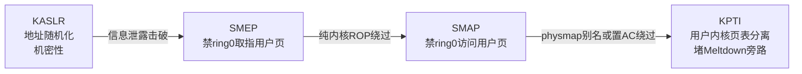
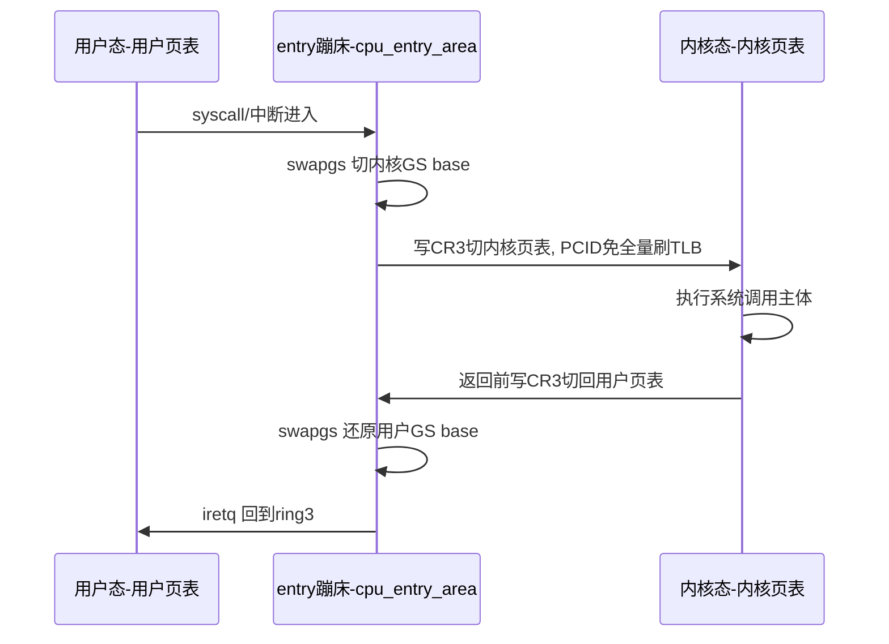
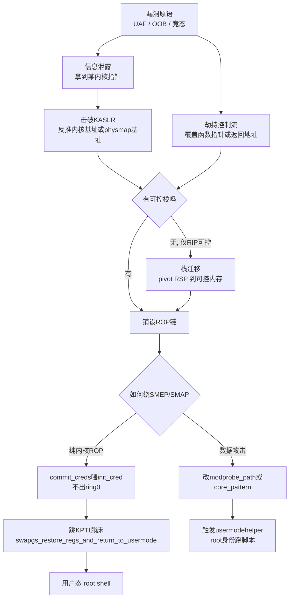
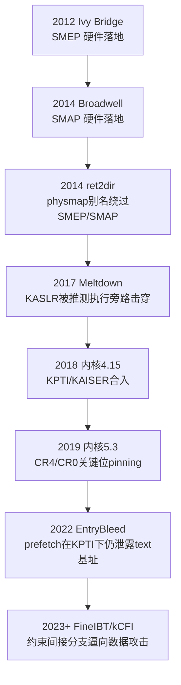

# Linux内核机制与内核利用（17）· 绕过内核防护：KASLR与SMEP与SMAP与KPTI

> [!abstract] TL;DR
> - KASLR/SMEP/SMAP/KPTI 是四层正交防护：KASLR 藏地址（机密性），SMEP 禁 ring0 取指用户页，SMAP 禁 ring0 访问用户页，KPTI 隔离页表堵 Meltdown 旁路；击破次序通常是「先泄露破 KASLR → 再中和执行/数据隔离 → 最后干净返回用户态」。
> - 击破 KASLR 的正道是**信息泄露**（未初始化内存、OOB/UAF 读、结构体夹带内核指针）；无泄露时用 **prefetch/TLB 时序旁路**，EntryBleed（CVE-2022-4543）证明即便开 KPTI，entry 蹦床的固定映射仍会经 prefetch 泄露内核 text 基址。
> - SMEP/SMAP 的经典绕法「ROP 改 CR4 清位」在内核 5.3+ 被 **CR4 pinning** 堵死；现代主流改走**纯内核 ROP**、**physmap 别名（ret2dir）** 或用 `stac`/`popfq` 置 EFLAGS.AC。
> - KPTI 让「改完 cred 直接 iretq 回用户态」必然崩溃——必须跳进 `swapgs_restore_regs_and_return_to_usermode` 蹦床，由它替你切 CR3 + swapgs + iretq。
> - 终极绕过是**纯数据攻击**：改 `modprobe_path`/`core_pattern` 触发 usermodehelper 以 root 跑脚本，不劫持控制流，一举绕开 SMEP/SMAP/KPTI/kCFI 全家桶。
> - 栈迁移（stack pivot）是「有 RIP 无栈」场景的桥梁：`xchg rsp,rax`、`push rXX;pop rsp`、`leave;ret` 把 RSP 挪到可控内存（内核堆喷区或用户区）后再展开 ROP。

## 概述与定位

上一章（[[16.内核提权：ret2usr与ROP与pt_regs|第 16 篇]]）里，我们把一次内核提权拆成了「拿到内核态执行/写入能力 → 调用 `commit_creds(prepare_kernel_cred(0))` 把当前进程凭据换成 root → 干净返回用户态起 shell」这条主干。但那条主干成立有一堆隐含前提：你**知道** `commit_creds` 在哪、你能把 RIP 指向**用户态的 shellcode**、你能让内核**读你摆在用户态的假结构体**、你能一条 `iretq` 平滑回到用户态。本篇的四大主角——KASLR、SMEP、SMAP、KPTI——恰好逐一击碎这四个前提。理解它们，本质上就是理解「现代内核利用为什么不能照抄 2010 年的 exploit」。

先给一个总的心智模型：这四层防护是**正交**的，各管一件事，攻击者必须一层层把它们拆掉。



- **KASLR**（Kernel Address Space Layout Randomization）是一道**机密性**防线：它不阻止任何操作，只是把内核加载基址随机化，让你「不知道往哪打」。它一旦被信息泄露击破，其它三层的门牌号就都暴露了——所以 KASLR 几乎总是攻击链的第一环。
- **SMEP**（Supervisor Mode Execution Prevention）是**执行完整性**防线：CPU 在 ring0 时禁止从「用户可访问」的页取指，直接掐死了 ret2usr——那种「把内核 RIP 指向用户态 shellcode」的祖传打法。
- **SMAP**（Supervisor Mode Access Prevention）是**数据隔离**防线：ring0 连**读写**用户页都不许（除非置了 AC 标志），于是「让内核解引用你摆在用户态的假 `file_operations`」「把栈迁移到用户栈」这类招数也失效了。
- **KPTI**（Kernel Page Table Isolation）本是为堵 **Meltdown** 而生的**旁路隔离**：把内核页表从用户态页表里拆出去，用户态根本看不到内核映射。它顺带把「返回用户态」这一步变复杂了——因为返回前必须切换 CR3。

本篇的威胁模型沿用系列前几章：假设你已经通过 [[14.内核漏洞类型：UAF与OOB与竞态|第 14 篇]] 的某类漏洞（UAF/OOB/竞态）拿到了**读原语**或**写原语**乃至 **RIP 控制**，本篇专注于「拿到原语之后，如何在四层防护下把它转化为 root」。全篇为**防御/教育视角**：讲透原理与失败模式，帮助读者理解为什么某些加固选项能救命，而不提供针对真实生产系统的成品武器。

## 原理与机制

### KASLR：随机化了什么、有多少熵、为什么一次泄露就够

不开 KASLR 时，x86-64 内核 text 固定映射在 `0xffffffff81000000`，所有符号地址在 `System.map` 里写死。KASLR 在启动早期（解压 stub，`arch/x86/boot/compressed/kaslr.c`）给内核镜像挑一个随机落点，并在 `mm/kaslr.c` 的 `kernel_randomize_memory()` 里再把三大内核内存区各自加一个随机偏移：

- **内核 text/data 镜像**：在 `0xffffffff80000000`–`0xffffffffc0000000` 这 1 GiB 窗口内、以 `CONFIG_PHYSICAL_ALIGN`（默认 2 MiB）对齐落点，约 512 个 slot，**熵约 9 bit**——这是四项里最容易被侧信道穷举的一项。
- **physmap / 直接映射**（`page_offset_base`，默认 `0xffff888000000000`）：内核把**全部物理内存**线性映射到这里，随机化其基址。
- **vmalloc 区**（`vmalloc_base`）与 **vmemmap 区**（`vmemmap_base`）：同样各加随机偏移。

随机数种子来自 `kaslr_get_random_long()`：优先 `RDRAND`，退化到 `RDTSC`，再退化到 i8254 定时器抖动。

KASLR 的**致命弱点**在于：**镜像内部所有偏移是固定的**。你只要泄露到**任意一个已知符号**的运行时地址，减去它在 vmlinux 里的静态偏移，就得到本次启动的「KASLR 滑动量」（slide），进而算出**所有**符号。所以对攻击者而言，破 KASLR 不是「泄露一堆地址」，而是「泄露一个、且知道它是谁」。反过来，防守方的 `kptr_restrict`、`dmesg_restrict`、隐藏 `kallsyms` 都是在堵这「一个」泄露点。要特别注意：泄露到的指针属于**哪个区**决定你算出的是哪个基址——一个函数指针给你 text 基址，一个堆对象指针给你 physmap 基址，两者滑动量不同、不能混用。

### SMEP：一个 CR4 位掐死 ret2usr

SMEP 是 `CR4` 的第 20 位（Intel Ivy Bridge，2012 落地）。硬件规则极简：**当 CPL=0（内核态）尝试从一个 U/S=1（用户可访问）的页取指，且 CR4.SMEP=1，触发 #PF**（错误码标明是取指 + 保护违例）。

```
CR4 关键位
 bit 20  SMEP  = 1 → ring0 取指用户页 → #PF
 bit 21  SMAP  = 1 → ring0 访问用户页 且 EFLAGS.AC=0 → #PF
 bit 17  PCIDE = 1 → 开启 PCID（配合 KPTI 降本）
 bit 11  UMIP  = 1 → 用户态禁执行 sgdt/sidt 等泄露指令
```

它为什么设计成「只管取指」？因为 ret2usr 的核心动作就是**在内核态跳去执行用户页里的 payload**；只要 CPU 拒绝从用户页取指，这条路就断了。注意 SMEP **不管读写**——内核仍能读写用户页，那是 SMAP 的活。这也解释了为什么单开 SMEP 时，「把假结构体放在用户态让内核去读」依旧可行——直到 SMAP 补上这个洞。

### SMAP：连读写用户页都禁，AC 是唯一的门

SMAP 是 `CR4` 第 21 位（Intel Broadwell，2014/2015 落地）。规则：**CPL<3 访问（读或写）用户页，且 CR4.SMAP=1 且 EFLAGS.AC=0，触发 #PF**。这里的 `EFLAGS.AC`（第 18 位，Alignment Check）被复用成 SMAP 的「临时放行开关」：AC=1 时本次访问被允许。

内核自己当然要合法地读写用户内存（`copy_from_user`/`copy_to_user`），它的做法是用 `STAC`（置 AC）/`CLAC`（清 AC）把真正触碰用户内存的那几条指令夹起来——上层封装是 `user_access_begin()/user_access_end()` 与各类 `uaccess` 助手，且访问前先过 `access_ok()` 做地址范围检查。于是攻击者绕 SMAP 有三条路：**要么置上 AC**（找 `stac` gadget，或用 `popfq` 弹入一个 AC=1 的 EFLAGS），**要么根本不碰用户内存**（把 payload 全留在内核——堆喷或 physmap），**要么走 physmap 别名**（下节详述）。

### KPTI：为堵 Meltdown 而把页表劈成两半

2017 年的 **Meltdown**（CVE-2017-5754）证明：CPU 的乱序/推测执行会在异常「补票」前就把内核数据加载进缓存，用户态借缓存时序侧信道即可**读任意内核内存**——包括把 KASLR 扫得一干二净。软件层面根治它的思路简单粗暴：**别在用户态页表里映射内核**，让推测执行也无内核可读。这就是 KAISER 论文催生的 **KPTI**（`CONFIG_PAGE_TABLE_ISOLATION`，主线 4.15，回栈到 4.14 LTS）。

KPTI 给每个进程维护**两套 PGD**（顶级页表）：**内核 PGD** 映射全部（内核 + 用户），**用户 PGD** 只映射用户空间 + 一小块 `cpu_entry_area`（进入/退出蹦床、entry 栈、IDT/GDT/TSS 等最小必要）。用户态跑在用户 PGD 上，每次进出内核都要切 CR3。

```
CR3（KPTI 下）
 bit 12    PTI_USER_PGTABLE_BIT → 1 选用户 PGD, 0 选内核 PGD（两 PGD 相邻分配）
 bit 0..11 PCID（开 PCIDE 时）→ 内核/用户不同 ASID
 bit 63    置1 = 本次写 CR3 不刷该 PCID 的 TLB
```

每次 CR3 切换都全量刷 TLB 的代价高得离谱，所以 KPTI 依赖 **PCID**（进程上下文标识）：给内核/用户地址空间打不同 ASID 标签，写 CR3 时置 bit 63 即可「换页表但不刷 TLB」，把 KPTI 的性能损耗从灾难级压到个位数百分比。下面这张时序图是理解 KPTI 对利用影响的关键——**注意那两次 CR3 切换**：



## 绕过链路详解：从信息泄露到干净返回

这一段是全篇的重心，把「四层防护如何被逐一拆解」按攻击链顺序讲透。总览如下，随后逐环展开：



### 一、信息泄露：破 KASLR 的正道

信息泄露的手法基本可归为几类，理解它们「泄露的是什么区的指针」比记住招式更重要：

- **未初始化内存泄露**：内核把一个未清零的栈/堆缓冲区经 `copy_to_user` 回给你，padding 或未赋值字段里残留着上一位「租客」留下的内核指针。这是最常见的一类，通常泄露 text 或 physmap 指针。经典案例是结构体里编译器插入的对齐填充字节从未被清零。
- **越界读（OOB read）**：读越过对象边界，捞到相邻对象的指针字段（比如相邻 `tty_struct` 的 `ops` 指针 → text 基址，或相邻对象的 `list_head` → physmap 基址）。
- **UAF 读**：释放后把对象以「可读回其内容」的另一类型重新占位，读出旧指针残留。
- **指针直接外泄**：某些 `ioctl`/`getsockopt`/`proc` 接口因 bug 直接把内核地址返回用户——最省事的一类。
- **侧信道（无泄露时的兜底）**：当代码路径干净、无任何指针外泄时，仍可用**微架构时序**破 KASLR。`prefetch` 侧信道（「Jump over ASLR」）对候选内核地址执行 `prefetch` 并测时延，命中「已映射」的地址时延不同，从而定位内核 text 基址；DrK 用 TSX 探 TLB。尤其要点名 **EntryBleed（CVE-2022-4543，2022）**：即便开了 KPTI，用户 PGD 里**仍映射着** syscall entry 蹦床（`cpu_entry_area`），其地址随 KASLR 变动，于是对该蹦床区做 `prefetch` 时序即可恢复内核 text 基址——**这说明 KPTI 并不能完整保护 KASLR**，两者是不同的防线。

把泄露转成基址的算式恒定为：`slide = 泄露地址 − 该符号在vmlinux里的静态地址`；`目标符号运行时地址 = 目标符号静态地址 + slide`。前提是你能**认出泄露的是哪个符号**——这一步靠对内核对象布局的逆向。

**FGKASLR** 的复杂化值得一提：函数粒度 KASLR 在启动时把各函数**重新洗牌**排列，于是「泄露一个函数指针推全部」的假设被打破——你只拿到了那**一个**函数的地址，别的函数偏移全乱了。它把「一次泄露定全局」逼成「泄露你需要的每一个 gadget/符号」，大幅抬高门槛（但也因兼容性代价，主线普及有限）。

### 二、栈迁移：有 RIP 却没栈时的桥梁

很多内核利用不是靠栈溢出拿 RIP，而是靠**覆盖某个函数指针**（如 `obj->ops->func`）。当内核执行 `call [obj->ops->func]` 时你确实控制了 RIP，但 RSP 还老老实实停在合法的内核栈上——你没有一段连续可控内存来放 ROP 链。**栈迁移**就是把 RSP 挪到你控制的内存。关键洞察是：控制流被劫持的那一刻，某个寄存器往往指着你控制的对象（常见 RDI/RSI/RAX = 那个被劫持对象的地址）。于是你用一条把「该寄存器搬进 RSP」的 gadget 完成 pivot：

```
常见栈迁移 gadget（选取受当时寄存器状态约束）
 xchg rsp, rax ; ret        ← 若 RAX 指向可控区
 mov rsp, rax  ; ret
 push rax ; pop rsp ; ret
 leave ; ret                ← 等价 mov rsp,rbp; pop rbp（借 RBP 迁移）
 xchg esp, eax ; ret        ← 只改低32位, 常配合固定低地址喷射
```

迁移目标的选择直接牵动 SMAP：迁到**内核堆喷区**（你用 [[15.内核利用原语与堆喷|第 15 篇]] 的手法喷满 ROP 链的 slab 对象）是 SMAP 安全的；迁到**用户内存**则需要 SMAP 关闭或已置 AC，否则 pivot 后第一次 `pop` 就 #PF。

### 三、绕 SMEP/SMAP：四种主流姿势

**姿势 1——改 CR4 清位（已基本失效，但必须懂原理）。** 早年最爽的一招：用 `mov cr4, rdi ; ret`（或 `native_write_cr4`）把 CR4 的 SMEP/SMAP 位清 0，然后回到祖传 ret2usr。但内核 5.3（2019）引入 **CR4 pinning**（Kees Cook，commit `873d50d58f67`）：`native_write_cr4()` 会把 SMEP/SMAP/UMIP 等「敏感位」**强制 OR 回去**，你 ROP 调它清位根本清不掉；配套还有 CR0.WP pinning。所以现代内核上这招失效——但理解它解释了为什么后面要换思路。

**姿势 2——纯内核 ROP（当代主流）。** 干脆**永不离开 ring0**：整条链在内核态里跑完，既不从用户页取指（不触发 SMEP），也不读用户页数据（不触发 SMAP）。经典目标是提权原语本身：

```
纯内核 ROP 提权骨架（寄存器/gadget 约束因内核而异）
 pop rdi ; ret        → rdi = 0
 call prepare_kernel_cred
 mov rdi, rax ; ret   → rdi = 新cred（返回值在rax）
 call commit_creds
 → 跳 KPTI 蹦床干净返回
```

一个**版本陷阱**：内核 6.2 起 `prepare_kernel_cred(NULL)` 语义被加固，传 NULL 不再等价 root 凭据。现代做法直接 `commit_creds(&init_cred)`——`init_cred` 是内核里一个 uid/gid 全 0、满 capability 的全局凭据，可经 kallsyms/偏移定位，比 `prepare_kernel_cred` 链更短更稳。

**姿势 3——physmap 别名 / ret2dir。** 这是绕 SMEP/SMAP 最优雅的思路（Kemerlis 等，USENIX Security 2014）。内核把全部物理内存线性映射进 physmap（`page_offset_base`），意味着**你在用户态 mmap 的每一页，在 physmap 里都有一个内核地址别名**。这个别名页的 U/S=0（是内核页），于是对它取指不触发 SMEP、访问不触发 SMAP。做法：在用户态大量喷射 payload，设法得到它的 physmap 地址（需 `page_offset_base` 泄露 + 你那页的 PFN，或堆喷/整理内存后落到可预测偏移），再把内核执行/解引用指向该别名。对应的防守是 **XPFO**（eXclusive Page Frame Ownership）与把 physmap 置为**不可执行（NX）**，斩断这条别名路。

**姿势 4——置 AC 位。** 若非得让内核读用户内存，找一条 `stac ; ret` gadget，或构造一次 `popfq` 把 AC=1 的 EFLAGS 弹入，之后 SMAP 对该 CPU 放行。实战中较少单独用，多在无法完全内核化时兜底。

### 四、KPTI 干净返回：为什么必须借内核自己的蹦床

假设 `commit_creds(&init_cred)` 已执行完，当前进程已是 root，现在要回用户态起 shell。**在 KPTI 下你不能手搓 `swapgs ; iretq` 了事**：此刻 CR3 仍指向**内核页表**。若就这么 `iretq` 回 ring3，用户代码是能跑（内核页表也映射了用户页），但 CR3 还赖在内核页表上；下一次 syscall/中断进内核时，entry 代码对「当前 CR3 是用户页表、需切内核」的假设被打破（它靠 CR3 的 PTI 位翻转来切换），随即 fault。GS base 若再 `swapgs` 错一次更是雪上加霜。

正解是**复用内核自己的出口蹦床** `swapgs_restore_regs_and_return_to_usermode`（`arch/x86/entry/entry_64.S`）。它天生就会按正确顺序做「切回用户 CR3 → swapgs → iretq」。技巧是**跳到它的中段**——跳过开头 `POP_REGS`（那段会拿栈上数据去还原一堆通用寄存器），落在「弹两个占位寄存器 + 切 CR3 + swapgs + iretq」这一小节，让它直接消费你摆好的假 `iretq` 帧：

```
栈布局（跳 swapgs_restore_regs_and_return_to_usermode 中段, 偏移随版本, 常见 +22）
 [占位 rax]        ← 被 pop rax 吃掉
 [占位 rdi]        ← 被 pop rdi 吃掉
 [用户 RIP]        ┐
 [用户 CS  含RPL=3]│
 [用户 RFLAGS 0x202]├ iretq 五元帧
 [用户 RSP]        │
 [用户 SS]         ┘
```

具体偏移**因内核版本/编译而异，必须反汇编自己的 vmlinux 确认**（找到那条 `pop rax ; pop rdi` 起点）。用户 CS/SS/RFLAGS/RSP/RIP 从哪来？在触发漏洞**之前**先用一小段内联汇编把用户态的 `cs`、`ss`、`rflags`、`rsp` 存下来，`rip` 填成你的 `get_shell` 函数地址；返回后 `iretq` 把执行权平滑交回 root 身份的用户代码。若你能算出用户 CR3，也可手写 `mov cr3, reg ; swapgs ; iretq`，但那要多泄露一份 CR3，通常不如借蹦床省事。

### 五、纯数据攻击：把四层防护一次性架空

上面全是围绕「劫持控制流」在和 SMEP/SMAP/KPTI 缠斗。但如果你手里是一个**任意写**（或受控写）原语，有一条路能把这一切**全部跳过**：**不劫持控制流，只改内核数据**。

- **改 `modprobe_path`。** 内核在需要加载模块时（如执行一个魔数未知的可执行文件、创建一个未知协议族的 socket、挂载未知文件系统）会调 `call_usermodehelper` 以 **root** 身份运行 `modprobe_path`（默认 `/sbin/modprobe`）指向的程序。它是内核 `.data` 里一个固定偏移的字符串，破了 KASLR 就知道地址。把它覆写成 `/tmp/x`，再在用户态执行一个头几字节非法的「可执行文件」触发 `request_module` → 内核以 root 跑你的 `/tmp/x` 脚本。**全程无控制流劫持、无用户页取指、无用户指针解引用**——SMEP/SMAP/KPTI 乃至 kCFI 全部无从触发。
- **改 `core_pattern`。** 覆写成 `|/tmp/x`，随后让某进程段错误，内核会把 core 通过管道喂给 `/tmp/x`，同样以 root 执行。

这类攻击只需「一个 KASLR 泄露 + 一次内核数据写」，连 ROP 链都不用铺。正因为 **kCFI/FineIBT**（见 [[34.现代二进制防护机制/15.内核防护与kCFI|kCFI]]）越来越狠地约束间接跳转、让 ROP/JOP 举步维艰，攻击面被**逼向数据攻击**——这是当代内核 pwn 的大势。四层防护挡的是「控制流被劫持」这个动作，而数据攻击根本不做这个动作，遂成「银弹」。这也提醒防守方：`CONFIG_STATIC_USERMODEHELPER` 把 usermodehelper 路径固定化、以及把关键 `.data` 结构标记只读，才是对症下药。

### 历史演进：一条攻防拉锯的时间线



每一步都是「防护落地 → 被绕 → 加固绕法 → 再被新旁路击穿」的循环。看清这条线，就明白没有任何单层防护是终点，纵深防御（defense in depth）才是内核加固的真正逻辑。

## 工具视角与实战

以下是 CTF 靶场 / 自有授权环境里研究这些机制的标准工具链与流程（[[49.Fuzzing与漏洞挖掘/14.内核与驱动Fuzzing：syzkaller|syzkaller]] 负责挖洞，这里负责「拿到洞之后的验证」）：

- **抽 vmlinux、找 gadget**：`bzImage` 先用 `extract-vmlinux` 或 `vmlinux-to-elf` 还原带符号的 ELF，再喂给 `ROPgadget`/`ropper` 搜 `pop rdi ; ret`、栈迁移 gadget、`swapgs_restore_regs_and_return_to_usermode` 偏移。符号地址查 `System.map` 或（开发机上）`/proc/kallsyms`。
- **算偏移**：从 vmlinux 拿 `commit_creds`、`init_cred`、`modprobe_path`、`prepare_kernel_cred`、KPTI 蹦床的静态地址，配合运行时泄露算 slide。
- **调试**：QEMU 起内核加 `-s -S`，gdb 里 `add-symbol-file vmlinux <slide后基址>`，在 `commit_creds`、`__x64_sys_xxx`、蹦床处下断，单步观察 CR3/CR4/GS 变化——**亲眼看一次 CR3 在进出内核时翻转**，胜过读十遍文档。
- **辨识靶场防护档位**：读 `run.sh` 的 QEMU 命令行——`nokaslr`?、`kpti=1`/`nopti`?、`-cpu` 是否带 `+smep,+smap`?、以及内核 `.config` 里 `CONFIG_RANDOMIZE_BASE`/`CONFIG_PAGE_TABLE_ISOLATION`。这决定你要拆几层。rootfs 通常是 cpio，`/init` 把你降权成普通用户，flag 只有 root 可读——提权目标就是读 flag。
- **触发程序**：用 pwntools 组织交互，用户态 exploit 静态交叉编译塞进 cpio。触发漏洞前记得 `save_state()` 存好用户 CS/SS/RFLAGS/RSP 与 `get_shell` 的 RIP。
- **逆向视角**：先逆出目标驱动的 `ioctl` 命令字与对象生命周期（见 [[10.字符设备与ioctl攻击面|第 10 篇]]），锁定可被劫持的 `ops` 表或可被写坏的关键字段，再决定走「劫持控制流 + 纯内核 ROP」还是「任意写 + 数据攻击」。

## 安全性与正确使用

> [!caution] 合规边界
> 本文所述 KASLR/SMEP/SMAP/KPTI 的原理与绕过思路，**仅用于你自有或获得明确书面授权的环境、CTF 靶场与防御性安全研究**。文章刻意停留在**机制与原理层面**，不提供针对任何真实生产系统、他人系统或商业授权保护的**武器化步骤、成品 exploit 或「打某真实目标」的配方**。在未授权的系统上实施内核提权，涉嫌违反《网络安全法》《刑法》第二百八十五/二百八十六条等，法律后果自负。研究请始终以「理解防护为何这样设计、如何把防护配得更硬」为落脚点。

把攻击链倒过来读，就是一份**加固清单**，这才是本篇对防守方的真正价值：

- **喂饱随机化**：`CONFIG_RANDOMIZE_BASE` + `CONFIG_RANDOMIZE_MEMORY` 开满；封堵泄露点——`kernel.kptr_restrict=2`、`kernel.dmesg_restrict=1`、`kernel.perf_event_paranoid` 收紧、隐藏 `kallsyms`。记住 KPTI 不等于 KASLR 保护（EntryBleed 为证），别把两者混为一谈。
- **保住执行/数据隔离**：确保 `CONFIG_X86_SMAP`、SMEP 生效，且内核 ≥5.3 使 **CR4/CR0 pinning** 默认在位，堵死「ROP 改 CR4」。
- **堵旁路**：`CONFIG_PAGE_TABLE_ISOLATION` 开启，配合 PCID 降本；及时打微架构漏洞（Meltdown/L1TF/MDS 等）缓解。
- **斩断数据攻击**：`CONFIG_STATIC_USERMODEHELPER` 固定 usermodehelper 路径，让 `modprobe_path`/`core_pattern` 覆写失效；`CONFIG_STRICT_KERNEL_RWX` 把内核 .rodata 真正只读；对 `core_pattern` 等敏感 sysctl 加监控与完整性校验。
- **缩小攻击面 + 抬高门槛**：`CONFIG_CFI_CLANG`/FineIBT 约束间接分支，配合 [[11.LSM与SELinux与AppArmor|LSM]] 与 lockdown、限制非特权 user namespace、按需禁用高危子系统（如 `io_uring`）；physmap 侧上 **XPFO/NX-physmap**。
- **纵深防御的心法**：任何单层都会被绕（历史时间线已反复证明），价值在于**层层叠加抬高综合成本**——攻击者需要同时集齐「泄露 + 原语 + 绕过每一层」才能得手，缺一环则链断。

## 小结

- 四层防护各司其职：**KASLR** 藏地址、**SMEP** 禁 ring0 取指用户页、**SMAP** 禁 ring0 访问用户页、**KPTI** 隔离页表堵 Meltdown 旁路；它们正交叠加，构成纵深防御。
- 现代内核利用的通用范式是「**信息泄露破 KASLR → 栈迁移铺链（如需）→ 纯内核 ROP 或 physmap 绕 SMEP/SMAP → 借 `swapgs_restore_regs_and_return_to_usermode` 蹦床干净返回**」；而**纯数据攻击**（改 `modprobe_path`/`core_pattern`）能把这四层一次性架空，是 kCFI 时代的主流。
- 每一层都有其「被绕—再加固—再被旁路」的历史：CR4 pinning 废掉了清位法，EntryBleed 证明 KPTI 不保 KASLR，FineIBT/kCFI 把攻击者逼向数据攻击。理解这条拉锯线，比记住任何单一 exploit 更重要。
- 对防守方，本篇的每个绕过点都对应一个加固开关；把它们配齐，就是让攻击链「缺一环则断」。

## 相关阅读

- 本系列前置：[[14.内核漏洞类型：UAF与OOB与竞态]] · [[15.内核利用原语与堆喷]] · [[16.内核提权：ret2usr与ROP与pt_regs]] · [[18.内核Fuzzing与syzkaller]] · [[00.Linux内核机制与内核利用总览|系列总览]]
- 攻击面与调试：[[10.字符设备与ioctl攻击面]] · [[11.LSM与SELinux与AppArmor]] · [[13.内核调试：kgdb与ftrace与crash]]
- 防护呼应（强烈建议对照）：[[34.现代二进制防护机制/15.内核防护与kCFI]]（KASLR/SMEP/SMAP/KPTI 与 kCFI 的防守侧总览）
- Windows 对称视角：[[38.Windows内核与驱动逆向/13.内核漏洞与利用基础]] · [[38.Windows内核与驱动逆向/26.内核池风水与利用]]
- 启动与系统调用前置：[[15.操作系统加载与启动/10.系统调用机制]] · [[15.操作系统加载与启动/11.init与systemd启动]]
- Fuzzing 呼应：[[49.Fuzzing与漏洞挖掘/14.内核与驱动Fuzzing：syzkaller]]
- 权威文档与论文：Linux Kernel Documentation `Documentation/x86/pti.rst` 与 `Documentation/admin-guide/hw-vuln/*`（KPTI 与微架构缓解）；Intel SDM Vol.3A（CR4.SMEP/SMAP、CR3、PCID 语义）；KAISER 论文（Gruss 等，ESSoS 2017）；ret2dir 论文（Kemerlis 等，USENIX Security 2014）；《A Guide to Kernel Exploitation》（Perla & Oldani）。

[[00.Linux内核机制与内核利用总览|⬆ 系列总览]] | [[16.内核提权：ret2usr与ROP与pt_regs|← 上一章]] | [[18.内核Fuzzing与syzkaller|→ 下一章]]
