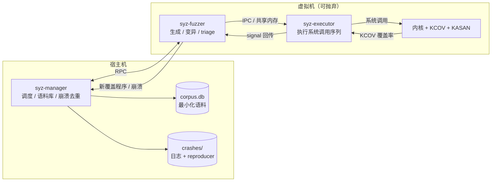
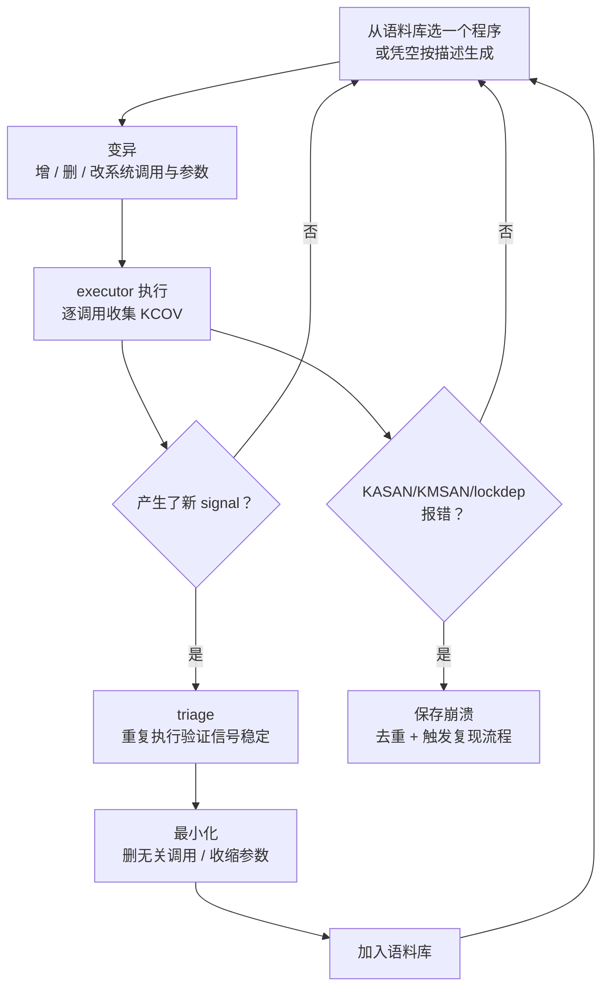
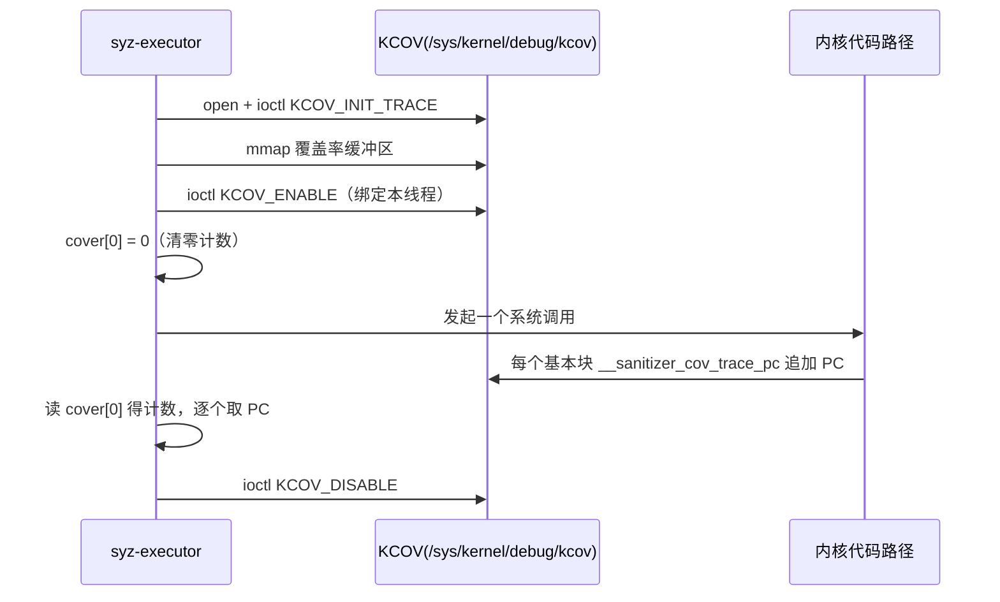
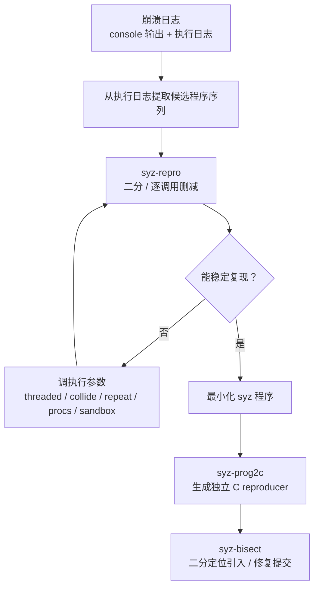
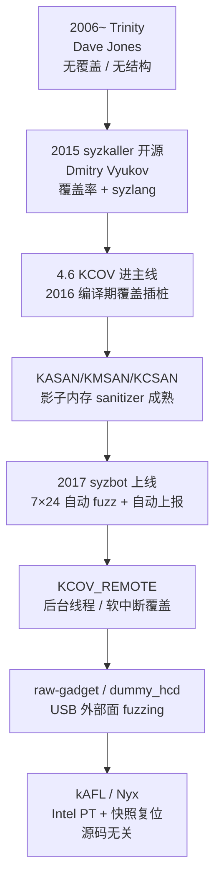

# Linux内核机制与内核利用（18）· 内核Fuzzing与syzkaller
> [!abstract] TL;DR
> - syzkaller 是「覆盖率引导 + 结构化描述（syzlang）+ 消毒器（sanitizer）」三位一体的内核 fuzzer；三者缺一，内核 fuzzing 就退化为浅层的随机敲打，撞不进深水区、撞到了也判不出来。
> - KCOV 用编译期插桩把每个基本块边缘变成一次 PC 记录，syzkaller 再把相邻 PC 旋转异或哈希成 32 位 signal（近似「边覆盖」）；**产生新 signal 是保留/变异一个程序的唯一裁决依据**。
> - syzlang 用 `resource` 把系统调用串成有数据依赖的序列（`fd`/`socket` 的产出→消费），让 fuzzer 生成语义合法、能穿过早期参数校验直达深层逻辑的程序——这是内核 fuzzing 相对文件 fuzzer 的根本差异。
> - 复现的本质，是把一次**非确定**的崩溃日志收敛成最小化、可独立编译的 C reproducer；`threaded/collide/repeat/procs/sandbox` 这些执行语义必须一并固化，竞态类 bug 才复现得出，很多竞态 bug 至今拿不到稳定 repro。
> - sanitizer（KASAN/KMSAN/KCSAN/KFENCE）是 fuzzer 的「预言机」，把静默内存破坏变成可观测的内核报错；没有它，fuzzer 踩中 UAF/OOB 也无从判定。
> - syzbot 把「manager→VM→executor→KCOV→triage→minimize→bisect→上报」整条流水线自动化成 7×24 的持续 fuzzing，是当代 Linux 内核 bug 最主要的来源之一。

## 概述与定位

内核 fuzzing 要解决的问题，和用户态文件 fuzzing 表面相似、内核却截然不同。用户态 fuzzer（如 AFL）喂给目标的是**一段字节流**，程序读取它、崩溃了就重启进程；而内核的攻击面不是「一段输入」，而是一台**巨大的、有状态的、并发的状态机**——它对外暴露成千上万个系统调用、无数 `ioctl` 命令码、netlink 消息族、socket 协议族、文件系统镜像、eBPF 字节码、io_uring 提交队列、乃至 USB 描述符。要触达其中任何一处深层代码，你必须先构造出一串**彼此有依赖、参数语义合法**的调用序列：先 `socket` 拿到 fd，再 `bind`，再 `setsockopt` 打开某个特性，最后那个真正含 bug 的 `sendmsg` 才可能被执行到。随机字节几乎永远走不到这一步。

这就是为什么第一代内核 fuzzer（Dave Jones 的 **Trinity**）虽然聪明地给每个系统调用参数塞「看起来合理」的值，却始终停在浅水区——它既没有覆盖率反馈来知道自己走到了哪、也没有资源依赖模型来把调用串成有意义的序列。**syzkaller** 由 Dmitry Vyukov 于 2015 年在 Google 开源，它的贡献正是把这两块补齐并工程化：一套声明式的系统调用描述语言 syzlang 提供「结构」，一套内核覆盖率机制 KCOV 提供「反馈」，再配合 KASAN 等一族 sanitizer 提供「崩溃判定」，构成了今天 Linux 内核 fuzzing 事实上的标准。

在本系列的坐标里，需要把边界划清楚。[[14.内核漏洞类型：UAF与OOB与竞态]] 讲的是 bug 长什么样、[[15.内核利用原语与堆喷]] 与 [[16.内核提权：ret2usr与ROP与pt_regs]] 讲的是拿到 bug 之后如何利用——本章讲的是**上游一步：如何自动化地发现这些 bug**。它与 [[13.内核调试：kgdb与ftrace与crash]] 的调试手段互补（fuzzer 负责撞、调试器负责查根因），与 [[17.绕过内核防护：KASLR与SMEP与SMAP与KPTI]] 的关系是「攻防两端」（fuzzing 环境里我们反而**主动关掉** KASLR、以换取崩溃地址可复现）。本章聚焦内核内部机制与漏洞挖掘工程学；若你想从**通用 fuzzing 方法论**（变异算子、语料调度、覆盖度量）的角度理解 syzkaller，请对照阅读 [[49.Fuzzing与漏洞挖掘/14.内核与驱动Fuzzing：syzkaller]]，两篇刻意错开、互为补充。

## 原理与机制

syzkaller 的运转可以浓缩成一句话：**在一台可抛弃的虚拟机里，不断生成/变异「系统调用程序」，用 KCOV 度量它跑到了哪些新代码，把带来新覆盖的程序留下继续繁衍，直到某个程序触发了 sanitizer 报错**。围绕这句话，它拆成宿主机与虚拟机两侧的多进程架构。

- **syz-manager**（宿主机）：总控。它管理一组虚拟机的生命周期（启动、崩溃后重启）、持有全局**语料库**（corpus.db，一组去重、最小化后合起来能覆盖最多代码的程序）、负责崩溃的**去重**与**复现**调度、并跑一个 web dashboard 展示实时覆盖率与崩溃列表。manager 从不亲自执行系统调用——它只调度。
- **syz-fuzzer**（虚拟机内）：每台 VM 里一个，通过 RPC 从 manager 领语料、做**生成与变异**、驱动 executor 执行、收集覆盖率、做本地 triage，把新覆盖的程序与崩溃回传 manager。
- **syz-executor**（虚拟机内）：最底层的执行体，用 C++ 写成以求极致轻量。它从 fuzzer 通过共享内存收到一个序列化的程序，逐个系统调用地执行、按需在多线程/多进程里执行，并把每个调用产生的 KCOV 覆盖率读出来回传。

为什么一定要**虚拟机、而且要能随时重启**？因为内核是全局共享状态：一个程序可能污染了 slab、留下了泄漏的引用、改动了某个全局 sysctl，这些都会漂移到下一个程序，让覆盖率与崩溃变得不可复现；更别说一旦真的触发内存破坏，内核可能已处于不一致状态。所以 syzkaller 把「一批程序」跑在一台一次性 VM 里，崩溃即重启换新内核实例——**隔离**换取的是可复现与可观测。

下图是这套架构的数据流。



真正的「进化」发生在下面这个循环里。它本质是一个遗传算法：语料库是种群，覆盖率是适应度，变异是繁殖，triage+最小化是选择压。



这个循环里，**「生成」与「变异」按比例混合**：纯变异会困在已知语料附近，纯生成又浪费掉已经积累的深路径，syzkaller 让 fuzzer 大部分时间变异语料、小部分时间凭描述凭空生成新程序以引入新鲜血液。而**裁决只看一个东西——有没有产生新 signal**；有则说明踩到了从未走过的代码边，值得留种。

## 描述语言、覆盖率与复现三支柱详解

这一节把 syzkaller 之所以有效的三根支柱逐一拆开——它们恰好对应本篇的种子：**描述语言、覆盖率、复现**。理解了这三者如何咬合，也就理解了内核 fuzzing 工程学的全部核心。

### syzlang：用类型系统与资源依赖把「乱敲」变成「有意义的序列」

syzlang（描述文件位于 `sys/linux/*.txt`）是一门声明式小语言，用来告诉 fuzzer「每个系统调用的参数长什么样、它们之间有什么依赖」。一个最朴素的例子：

```
# 资源：一个系统调用产出、另一个系统调用消费，从而把调用串成有依赖的序列
resource fd[int32]
resource fd_dir[fd]

open(file ptr[in, string], flags flags[open_flags], mode flags[open_mode]) fd
openat(dirfd fd_dir, file ptr[in, string], flags flags[open_flags], mode flags[open_mode]) fd
read(fd fd, buf buffer[out], count len[buf])
write(fd fd, buf buffer[in], count len[buf])
close(fd fd)

# 结构体 + flags + 长度字段：ioctl 的参数是一段有内在约束的内存
ioctl$FOO_SET(fd fd, cmd const[FOO_SET], arg ptr[in, foo_req])
foo_req {
    len   len[data, int32]        # len 字段自动等于 data 的长度
    flags flags[foo_flags, int32] # 只从合法标志位集合里取值
    data  array[int8]
}
```

这段描述里藏着四类关键信息，每一类都直接决定 fuzzer 能不能走深：

- **类型（type）**：`int/ptr/array/struct/union/const/flags/string/buffer/len` 等。fuzzer 知道某参数是指向字符串的指针、某参数只能取一组标志位的或，于是生成的值天然能通过内核入口的合法性检查（`copy_from_user` 之后的 range check、magic 校验），而不是被 `-EINVAL` 挡在门口。
- **资源（resource）**：这是 syzlang 的灵魂。`open` **返回** `fd`，`read/write/ioctl` **消费** `fd`；fuzzer 据此构建一张「谁产出谁消费」的依赖图，自动把 `open→ioctl→close` 这样的合法序列拼出来。没有资源模型，你手里的 `ioctl` fd 永远是随机整数，99.99% 直接 `EBADF` 返回——深层驱动逻辑一行都跑不到。
- **长度与偏移（len/bytesize/offsetof）**：`len[data]` 让 `len` 字段自动跟随 `data` 实际长度。很多内核解析器先读长度、再据此拷贝，长度字段乱填要么早退、要么触发的是「长度校验」这条浅路径；让它保持一致，才能深入到真正解析 payload 的代码。
- **方向（in/out/inout）**：告诉 executor 哪些内存需要 `copyin`（喂给内核）、哪些是内核 `copyout` 回来的（可作为后续调用的输入，或用于 KCOV_TRACE_CMP 的提示）。

对无法用纯声明表达、或需要复杂前置设置的场景，syzkaller 提供**伪系统调用（pseudo-syscall）**，即以 `syz_` 开头、由 executor 用 C 实现的「胶水调用」：`syz_open_dev$xxx`（按模板打开 `/dev/xxx` 设备节点）、`syz_mount_image$ext4`（把一段 fuzz 出来的字节当作文件系统镜像挂载，这是文件系统 fuzzing 的入口）、`syz_kvm_setup_cpu`（配好一个 KVM vCPU 再交给 fuzzer 玩客户机）、`syz_usb_connect`（模拟 USB 设备枚举）。它们把「难以描述的初始化」封成一个原子调用，让描述层保持简洁。

描述如何变成可执行代码？两步编译，也是 syzlang 能跨架构复用的原因：

- **syz-extract**：读内核头文件，把描述里用到的符号常量（各种 `FOO_SET` 的实际数值、`ioctl` 编号、flag 位）为**特定架构**抽取成 `.const` 文件。同一个 flag 在 amd64 与 arm64 上数值可能不同，抽取因此必须针对目标架构、并需要内核源码。
- **syz-sysgen**：把描述 + 常量编译成两份产物——给 fuzzer 用的 Go 代码、给 executor 用的 C++ 代码。

一个正被 fuzz 的程序，其人类可读形态长这样（地址都指向 executor 预先 `mmap` 的固定数据区 `0x7f0000000000`，`r0/r1` 是资源变量）：

```
r0 = openat(0xffffffffffffff9c, &(0x7f0000000000)='./file0\x00', 0x42, 0x1a4)
write(r0, &(0x7f0000000100)="deadbeef", 0x8)
r1 = dup(r0)
ioctl$FOO_SET(r1, 0x40085500, &(0x7f0000000200)={0x2, 0x1, "aabb"})
close(r0)
```

看得出：`openat` 产出 `r0`，`dup` 从 `r0` 派生 `r1`，`ioctl` 消费 `r1`——一条语义完整、能穿到驱动内部的序列，而这正是随机字节永远拼不出来的东西。**描述的完备性直接决定覆盖的天花板**：一个没人写描述的新驱动 `ioctl`，syzkaller 只能瞎蒙其参数，覆盖极浅——这也催生了 DIFUZE、SyzGen++、KSG 等一批「自动生成 syzlang 描述」的研究工作。

### KCOV：编译期插桩把执行路径变成可采集的信号

有了能生成深序列的能力，还得有眼睛看它到底走到哪。**KCOV**（Kernel Coverage，Linux 4.6 主线）就是这只眼睛。它的原理是编译期插桩：内核用 `-fsanitize-coverage=trace-pc` 编译后，编译器在**每一个基本块边缘**插入一次对 `__sanitizer_cov_trace_pc()` 的调用。运行时，如果当前任务开启了 KCOV，这次调用就把「当前指令地址」记进一块与该任务绑定的 per-task 缓冲区。

关键设计是**按任务（per-task）采集**：只有显式 `KCOV_ENABLE` 的那个线程，其内核执行路径才被记录，别的线程、中断的噪声都不会混进来。这让 syzkaller 能精确地把「这一段覆盖」归因到「这一个系统调用」。用户态的用法（executor 内部就是这么做的）：

```c
#define KCOV_INIT_TRACE _IOR('c', 1, unsigned long)
#define KCOV_ENABLE     _IO('c', 100)
#define KCOV_DISABLE    _IO('c', 101)
#define COVER_SIZE (64 << 10)
#define KCOV_TRACE_PC 0

int fd = open("/sys/kernel/debug/kcov", O_RDWR);
ioctl(fd, KCOV_INIT_TRACE, COVER_SIZE);
unsigned long *cover = mmap(NULL, COVER_SIZE * sizeof(unsigned long),
                            PROT_READ | PROT_WRITE, MAP_SHARED, fd, 0);
ioctl(fd, KCOV_ENABLE, KCOV_TRACE_PC);
__atomic_store_n(&cover[0], 0, __ATOMIC_RELAXED); // 清零计数
read(-1, NULL, 0);                                // 被观测的目标系统调用
unsigned long n = __atomic_load_n(&cover[0], __ATOMIC_RELAXED);
for (unsigned long i = 0; i < n; i++)
    /* cover[i+1] 就是第 i 个被执行到的 PC */;
ioctl(fd, KCOV_DISABLE, 0);
```

缓冲区约定极简：`cover[0]` 是计数器，`cover[1..n]` 是这段执行踩到的 PC 序列。时序如下。



拿到裸 PC 序列后，syzkaller 并不直接用它比对——**裸 PC 是「点覆盖」，无法表达「从 A 到 B 这条边是否走过」**。它把相邻两个 PC 组合（当前 PC 与上一 PC 做旋转异或后哈希）压成一个 32 位数，称为 **signal**，近似表达「边覆盖」。裁决语料的适应度用的就是 signal 集合：一个程序产生了语料库里没有的 signal，就说明它踩到了新的控制流边。32 位空间会有哈希碰撞、偶尔漏掉真实新边，但这是 syzkaller 刻意选择的**性能/精度折中**——碰撞率可接受，换来极低的采集与比对开销。需要给人看的时候（web dashboard 的行级覆盖高亮），才用未哈希的裸 PC 集合（syzkaller 里叫 **cover**），并借 `CONFIG_DEBUG_INFO` 的调试信息把 PC 符号化回源码行。

### KCOV_TRACE_CMP：给「魔数比较」一点提示

纯覆盖反馈有个经典盲区：`if (magic == 0xCAFEBABE)` 这种精确比较，靠随机变异几乎不可能猜中那 32 位常量，于是 `==` 成立的那条分支永远走不到。syzkaller 用 `-fsanitize-coverage=trace-cmp`（内核选项 `CONFIG_KCOV_ENABLE_COMPARISONS`）应对：它在每个比较指令处插桩，记录下**比较的两个操作数与类型**。fuzzer 拿到这些操作数当「提示（hints）」——如果某次比较里一个操作数正是我们输入里的某个值、另一个是常量 `0xCAFEBABE`，那就把输入里那个值直接替换成常量，一步跨过精确比较。这相当于一套轻量、廉价的「污点/concolic」近似，不需要真正的符号执行引擎，却能显著提升穿透 magic 校验的能力。

### 语料、triage 与最小化：让种群保持精悍

新覆盖不能盲目入库，否则语料库会被冗余、不稳定的程序撑爆。所以有 **triage**（分诊）：一个产生新 signal 的程序，先被**重复执行**几遍，只有那些**稳定**复现的 signal 才算数——把因调度、时序抖动而偶发的「假新覆盖」剔除掉。通过 triage 后进入**最小化（minimization）**：反复尝试删掉序列里的某个调用、收缩某个数组/缓冲区长度、把参数往更简单的值上退，只要新 signal 仍在就接受这次删减。最小化后的程序才写入 `corpus.db`。这一步的意义在于：语料库不是「所有见过的程序」，而是「一组彼此正交、合起来覆盖最广、每个都尽量短」的精悍种群——短程序变异更快、执行更省、复现更容易。多台 manager 之间还能通过 **syz-hub** 交换语料，让不同配置/子系统的发现互相受益。

### 复现：把非确定崩溃收敛成可独立编译的 C reproducer

fuzzing 的产物是崩溃，但一次崩溃日志本身**不是**一个可交付的漏洞证明——它往往夹在成百上千个并发执行的程序噪声里，且可能依赖特定时序。**复现（reproduction）**就是把它收敛成最小、可稳定重放的东西。流程如下。



这里最微妙的是 **executor 的执行语义必须一并固化**，因为很多内核 bug 是竞态或状态累积的产物：

- **threaded**：每个系统调用放进独立线程，避免某个阻塞调用卡死整条序列，也为并发创造条件。
- **collide**：把相邻两个调用**故意并发**执行，专门用来撞竞态（[[14.内核漏洞类型：UAF与OOB与竞态]] 里的 race/double-free 多半靠它）。
- **repeat / procs**：把整个程序**重复很多遍 / 多进程并行**跑，用来累积状态（如耗尽某个 slab、触发引用计数回绕）或提高竞态命中率。
- **sandbox**：`none/setuid/namespace/android`，决定以什么权限/隔离级别执行——它既影响能触达的攻击面，也影响 repro 在别处能否重放。

syz-repro 会在这些开关的组合空间里搜索，找到「最简单的、仍能触发」的那一组。找到后用 **syz-prog2c** 把 syz 程序翻译成一段**不依赖 syzkaller 运行时、可 `gcc` 直接编译**的 C 代码——这就是提交给维护者的标准漏洞证明。最后 **syz-bisect** 在内核提交历史上二分，自动定位「引入 bug 的提交」和「修复它的提交」。

必须坦白复现的**失败模式**：竞态窗口极窄、依赖特定 CPU 数/内存布局/调度时序的 bug，可能在任何参数组合下都无法稳定重放。syzkaller 对这类 bug 会**在没有 reproducer 的情况下也照样上报**（附上崩溃调用栈），因为「拿不到 repro」不等于「不是 bug」。这也是为什么 syzbot 上大量条目标注着「no reproducer」——它们同样真实、同样需要修。

## 工具视角与实战

先说**内核侧的先决条件**，缺任何一项 fuzzer 都会瞎或哑。编译目标内核时至少要开：`CONFIG_KCOV=y`、`CONFIG_KCOV_INSTRUMENT_ALL=y`、`CONFIG_KCOV_ENABLE_COMPARISONS=y`（比较提示）、`CONFIG_DEBUG_INFO=y`（符号化覆盖）、`CONFIG_KALLSYMS=y` 与 `CONFIG_KALLSYMS_ALL=y`（解析崩溃栈）、`CONFIG_DEBUG_FS=y`（KCOV 挂在 debugfs）、以及作为预言机的 `CONFIG_KASAN=y`（配 `KASAN_INLINE` 更快）。要 fuzz USB 面还需 `CONFIG_USB_RAW_GADGET=y`、`CONFIG_USB_DUMMY_HCD=y`。此外通常在内核命令行加 `nokaslr` 关掉 [[17.绕过内核防护：KASLR与SMEP与SMAP与KPTI]] 里的 KASLR——注意这与「防护」目标相反：fuzzing 要的是**地址可复现**，好让同一崩溃每次落在同一符号上、便于去重与 bisect。

启动一次 fuzzing 只需一个 manager 配置：

```json
{
  "target": "linux/amd64",
  "http": "127.0.0.1:56741",
  "workdir": "/home/user/syz/workdir",
  "kernel_obj": "/home/user/linux",
  "image": "/home/user/syz/bullseye.img",
  "sshkey": "/home/user/syz/bullseye.id_rsa",
  "syzkaller": "/home/user/go/src/github.com/google/syzkaller",
  "procs": 8,
  "type": "qemu",
  "vm": { "count": 4, "kernel": "/home/user/linux/arch/x86/boot/bzImage", "cpu": 2, "mem": 2048 }
}
```

`./bin/syz-manager -config my.cfg` 起来后，浏览器打开 `http://127.0.0.1:56741` 就能看实时覆盖率增长曲线、行级覆盖高亮、以及崩溃列表。VM 后端不止 qemu：`gce`（Google Compute Engine，syzbot 用它横向扩几千台）、`gvisor`（fuzz gVisor 自身）、`adb`（真机 Android）、`isolated`（用你自己的物理机）都支持。

几个逆向/调试时高频的**独立工具**：

```bash
# 反复执行某个程序并打印它的覆盖（-cover），复现/研究单个程序时用
./bin/syz-execprog -executor=./bin/syz-executor -repeat=0 -procs=1 -cover prog.txt

# 把 syz 程序翻译成可独立编译的 C reproducer
./bin/syz-prog2c -prog prog.txt > repro.c

# 语料库是二进制 db，用 syz-db 解包/打包来审阅里面的程序
./bin/syz-db unpack workdir/corpus.db corpus_dir/

# 为某内核源码抽取常量（需要 SOURCEDIR 指向内核树）
make extract TARGETOS=linux SOURCEDIR=/home/user/linux
```

**给自研驱动写描述**是把 syzkaller 真正对准某个具体攻击面的关键动作，也是 [[10.字符设备与ioctl攻击面]] 的实战延伸。典型套路：先在描述里声明设备节点的打开方式（`syz_open_dev$mydev(...) fd_mydev`），把 fd 定义成资源；再把该驱动每个 `ioctl` 命令码连同其参数结构逐条写成 `ioctl$MYDEV_CMD(fd fd_mydev, cmd const[MYDEV_CMD], arg ptr[in, mydev_req])`，并把参数里的长度、标志、内嵌指针都精确建模。描述越贴近驱动真实的输入约束，fuzzer 越能穿过命令分发的 `switch-case` 直插处理函数——这一步的投入产出比往往极高，很多 CVE 就是给某个此前无人描述的驱动补了几十行 syzlang 后当天撞出来的。

**USB 外部面 fuzzing** 是 syzkaller 一块杀伤力惊人的能力：借 `raw-gadget` + `dummy_hcd` 在内核里虚拟出一个「插入的 USB 设备」，用伪系统调用 `syz_usb_connect` 喂进 fuzz 出来的设备描述符、配置、端点数据，去撞各类 USB 驱动的枚举与解析路径。因为后台枚举跑在**内核线程**里、不在发起 `ioctl` 的那个任务上下文，普通 per-task KCOV 采不到——于是有了 **KCOV_REMOTE**（远程覆盖），让内核把后台线程/软中断里的覆盖也归集回发起方。同理，syzkaller 还能做**故障注入**（`failslab`/`FAULT_INJECTION`），系统性地让某次内存分配失败，去撞那些几乎没人测过的错误处理路径——大量 UAF/泄漏就藏在 `goto err_out` 之后。

崩溃出来后，**去重**靠从报告里解析出一个规范化标题（KASAN 报告的首个非插桩栈帧、报告类型等），把「同一根因、不同触发路径」的崩溃归并成一条，避免同一个 bug 淹没列表。工程上要有心理准备的**常见坑**：覆盖率会在某个点**趋于平台期**（好摘的果子摘完了，剩下的需要更长依赖链或更精准 magic）；描述不全的子系统会**长期浅覆盖**；竞态 bug 的 repro **天生 flaky**；某个程序触发**内核死锁/hung task** 会拖垮整台 VM 拉低吞吐——这些都不是 bug，而是内核 fuzzing 的常态，需要靠补描述、加 collide 权重、隔离已知 hang、扩 VM 数来缓解。

横向对比一下同类方案，理解 syzkaller 的适用边界：**Trinity** 无覆盖无结构，今天基本只作历史参照；**AFL/AFL++** 是文件/字节流 fuzzer，喂内核要靠 `TriforceAFL` 这类把 QEMU 断点当覆盖源的适配，且缺乏系统调用序列语义；**kAFL / Nyx** 走 hypervisor + Intel PT 路线，**不需要内核源码**就能采覆盖（因此能 fuzz Windows 内核、闭源驱动），Nyx 还用 VM 快照做**极快复位**（免整机重启），代价是没有 syzlang 那样的结构化生成、深序列构造更难。一句话总结这条分水岭：**syzkaller = 需要源码（KCOV）换来结构化深序列生成，是开源内核的首选；kAFL/Nyx = 源码无关的通用覆盖，是闭源目标与追求快照复位时的选择**。二者互补而非替代。

下面这张图把内核 fuzzing 的关键演进串起来（用箭头而非时间线组件）。



## 安全性与正确使用

内核 fuzzing 是**防御性、研究性**的技术：它的价值在于比攻击者更早、更系统地发现并修复内核缺陷。但它同时具备强破坏性与攻防两用性，必须守住边界。

> [!caution] 合规与伦理边界
> - **只在自有或获授权的环境中运行**：一次性虚拟机、隔离测试机、CTF 靶场、以及你有权测试的内核。fuzzing 会真实地使内核崩溃、损坏内存、破坏磁盘镜像与文件系统——**绝不可对生产系统、他人系统或云上共享内核开跑**。
> - **一律防御/教育视角**。本文讲透的是「如何发现 bug 并把它收敛成可修复的报告」，不提供、也不推导针对任何真实生产目标或他人系统的**武器化利用**步骤；从崩溃走向提权利用属于 [[15.内核利用原语与堆喷]]、[[16.内核提权：ret2usr与ROP与pt_regs]] 的防御研究范畴，同样以自有/授权环境为前提。
> - **不为绕过商业授权或 DRM 提供武器化配方**。对闭源驱动/固件的分析仅限合法安全研究与互操作范围，遵守当地法律与授权协议。
> - **负责任披露**：撞出真实 0-day 后，走协调披露（CVD）——先私下通知维护者/厂商、给出复现与修复窗口，**不在修复前公开可直接打真实目标的 reproducer**。syzbot 对部分敏感 bug 设有 embargo，其自动上报、`#syz fix:` 跟踪修复的机制本身就是把「发现」与「负责任地修复」绑在一起的范例。

从工程正确性角度，还有两点必须强调。其一，**sanitizer 是判定的前提而非可选项**：没有 KASAN，越界写只会是「有时崩、有时不崩」的薛定谔状态，fuzzer 既撞不稳也判不出，等于白跑——务必带 sanitizer 编译。其二，**fuzzing 环境刻意关闭 KASLR/部分缓解措施**是为了崩溃可复现，这与真实系统应有的防护姿态相反；切勿把这套「为便于挖洞而拆掉护栏」的配置误当作可用于生产的内核配置。挖洞环境与生产环境，安全取向根本对立，二者的配置不可混用。

## 小结

syzkaller 的强大不来自任何单点魔法，而来自三根支柱的严丝合缝：**syzlang 用类型与资源依赖提供「能走深的结构」，KCOV 用编译期插桩提供「知道走到哪的反馈」，sanitizer 提供「撞到了能判出来的预言机」**。三者之上，是一个以覆盖率为适应度的遗传循环（生成/变异→执行→triage→最小化→入库），和一条把非确定崩溃收敛成可交付 C reproducer、再自动二分定位提交的复现流水线。syzbot 把这一切自动化成 7×24 的持续 fuzzing，成为当代 Linux 内核质量与安全的一道基础设施。

对逆向与漏洞研究者而言，掌握 syzkaller 的真正门槛不在「把它跑起来」，而在**为你关心的攻击面写出精准的描述**、以及**读懂并复现它吐出的崩溃**——前者决定你能挖到多深，后者决定你的发现能否变成可交付、可修复的成果。理解了本篇的机制，你也就理解了为什么现代内核 bug 的发现越来越工程化、自动化，以及一个「好的描述 + 稳定的复现」为何是内核漏洞研究里最有杠杆的两项投入。

## 相关阅读

- 同系列上一章：[[17.绕过内核防护：KASLR与SMEP与SMAP与KPTI]]（为何 fuzzing 环境反而关闭 KASLR）
- 同系列漏洞与利用：[[14.内核漏洞类型：UAF与OOB与竞态]]、[[15.内核利用原语与堆喷]]、[[16.内核提权：ret2usr与ROP与pt_regs]]
- 同系列攻击面与调试：[[10.字符设备与ioctl攻击面]]、[[12.eBPF架构与验证器]]、[[13.内核调试：kgdb与ftrace与crash]]
- Fuzzing 方法论对照篇（互为补充）：[[49.Fuzzing与漏洞挖掘/14.内核与驱动Fuzzing：syzkaller]]
- Windows 对称视角：[[38.Windows内核与驱动逆向/13.内核漏洞与利用基础]]、[[38.Windows内核与驱动逆向/26.内核池风水与利用]]
- 系统调用前置：[[15.操作系统加载与启动/10.系统调用机制]]、[[15.操作系统加载与启动/11.init与systemd启动]]
- 防护呼应：[[34.现代二进制防护机制/15.内核防护与kCFI]]
- 官方文档与资料：syzkaller 官方文档（github.com/google/syzkaller/tree/master/docs）、Linux 内核文档 `Documentation/dev-tools/kcov.rst` 与 `kasan.rst`、syzbot 看板（syzkaller.appspot.com）、syzlang 描述规范（`docs/syscall_descriptions_syntax.md`）

[[00.Linux内核机制与内核利用总览|⬆ 系列总览]] | [[17.绕过内核防护：KASLR与SMEP与SMAP与KPTI|← 上一章]]
