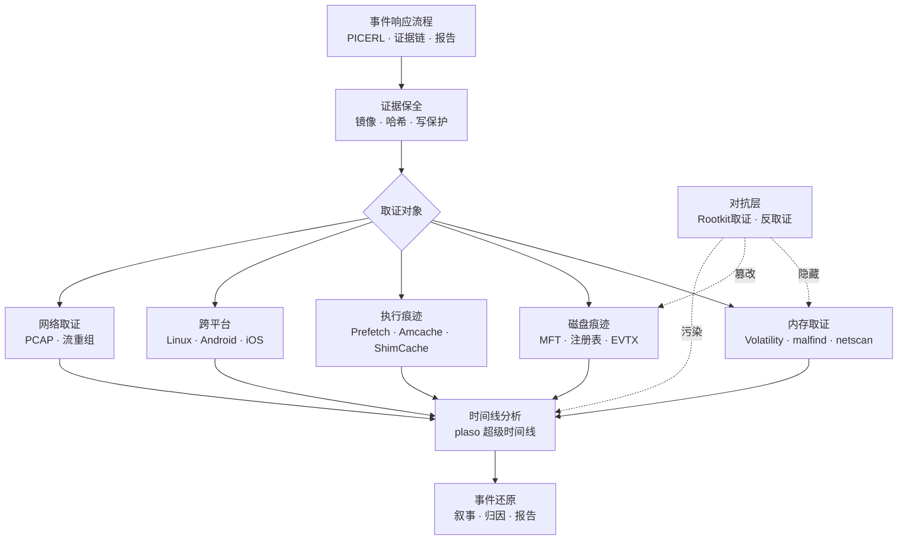
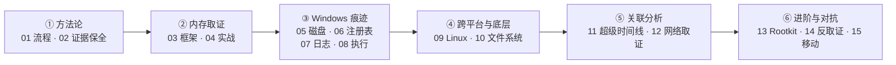

# 数字取证与事件响应 · 系列总览

> 内存/磁盘/日志取证与事件响应流程，是 [[50.恶意代码分析与免杀对抗/00.恶意代码分析与免杀对抗总览|系列 50（恶意分析）]] 的天然下游：从「样本做了什么」到「主机上留下什么痕迹、如何还原时间线」。如果说恶意分析回答的是「这段代码意图为何」，那么 DFIR 回答的是「它在真实主机上落地后，如何被发现、固定、串联，并复盘整起入侵」——前者面向样本，后者面向现场，二者合起来才构成从检测到复盘的完整闭环。

本系列以「一次真实入侵的取证复盘」为主线，串起证据保全 → 多源痕迹提取 → 超级时间线还原的全链路，横跨 Windows / Linux / 移动三大平台，并专辟反取证一章，训练在证据被篡改、清除时仍能识别异常的对抗视角。

## 取证全景

## 篇目导航

| # | 章节 | 说明 |
| --- | --- | --- |
| 01 | [[01.DFIR全景与事件响应流程]] | PICERL/SANS 流程、证据链、报告 |
| 02 | [[02.证据保全与取证镜像]] | 写保护、哈希校验、镜像格式 E01/dd |
| 03 | [[03.内存取证：采集与Volatility框架]] | 内存采集、profile、插件体系 |
| 04 | [[04.内存取证实战：进程与网络与注入检测]] | pslist/malfind/netscan、隐藏进程 |
| 05 | [[05.Windows磁盘取证痕迹]] | MFT、USN、回收站、LNK/Jump List |
| 06 | [[06.Windows注册表取证]] | hive、run key、USB、shellbags |
| 07 | [[07.Windows事件日志分析]] | EVTX、登录事件、横向移动痕迹 |
| 08 | [[08.执行痕迹：Prefetch与Amcache与ShimCache]] | 程序执行证据、时间戳解读 |
| 09 | [[09.Linux取证与痕迹分析]] | 日志、bash history、cron、systemd |
| 10 | [[10.文件系统取证：NTFS与EXT]] | 时间戳、删除恢复、slack 空间 |
| 11 | [[11.时间线分析与超级时间线]] | plaso/log2timeline、事件关联 |
| 12 | [[12.网络取证与流重组]] | PCAP 分析、会话重组，呼应系列 72 |
| 13 | [[13.恶意持久化与Rootkit取证]] | 持久化点排查、内核隐藏检测，呼应系列 50 |
| 14 | [[14.反取证技术与对抗]] | 时间戳篡改、痕迹清除、检测思路 |
| 15 | [[15.移动设备取证：Android与iOS]] | 逻辑/物理提取、应用数据、钥匙串 |

> [!tip] 学习建议与阅读顺序
> - **先立方法论再动手**：01（流程/证据链）与 02（证据保全）是一切取证的地基，顺序错乱会污染证据、丧失法律效力，务必先读，先形成「先固定、后分析」的肌肉记忆。
> - **内存优先于磁盘**：内存是最易失证据，03-04 要重点吃透「断电/关机前采集」的时机逻辑；其中 malfind/netscan 与系列 50 的进程注入、持久化直接对应，建议交叉阅读。
> - **Windows 痕迹成组学**：05-08 是四类互补证据（文件系统 / 注册表 / 日志 / 执行痕迹），建议针对同一事件横向对照它们的映射关系，训练「多源印证」而非孤立看单一痕迹。
> - **时间线是收敛点**：11 把前面所有痕迹汇成一条超级时间线，是从「孤立证据」到「完整叙事」的关键；建议读完 05-10 后再回头精读，收益最大。
> - **对抗留到最后**：13-14 讲 Rootkit 取证与反取证——只有先熟悉正常痕迹形态，才能识别被篡改、被清除的异常；15（移动取证）独立性较强，可按需插入。

## 学习路径

## 与知识库既有体系的衔接

- 恶意上游：[[50.恶意代码分析与免杀对抗/08.持久化技术大全]]、[[50.恶意代码分析与免杀对抗/06.进程注入技术全谱]]
- 网络呼应：[[72.抓包与协议分析实战/19.网络取证与流重组]]
- 硬件取证呼应：[[39.固件与IoT嵌入式逆向/22.eMMC与NAND芯片级取证]]
- 内核痕迹：[[38.Windows内核与驱动逆向/11.Rootkit原理与检测]]
