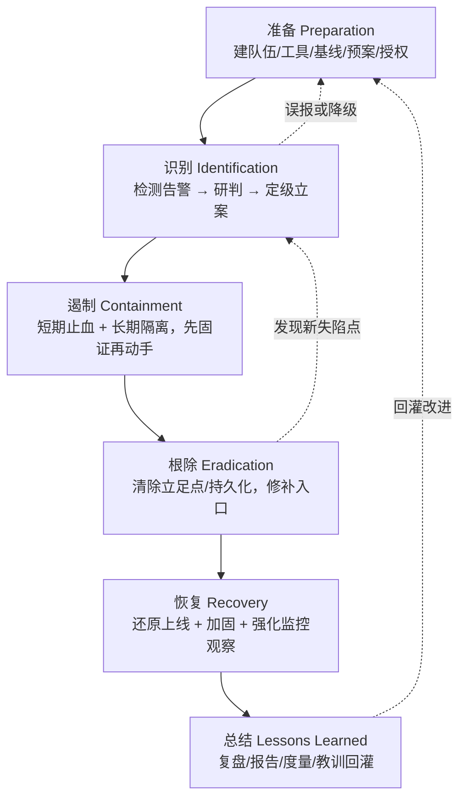
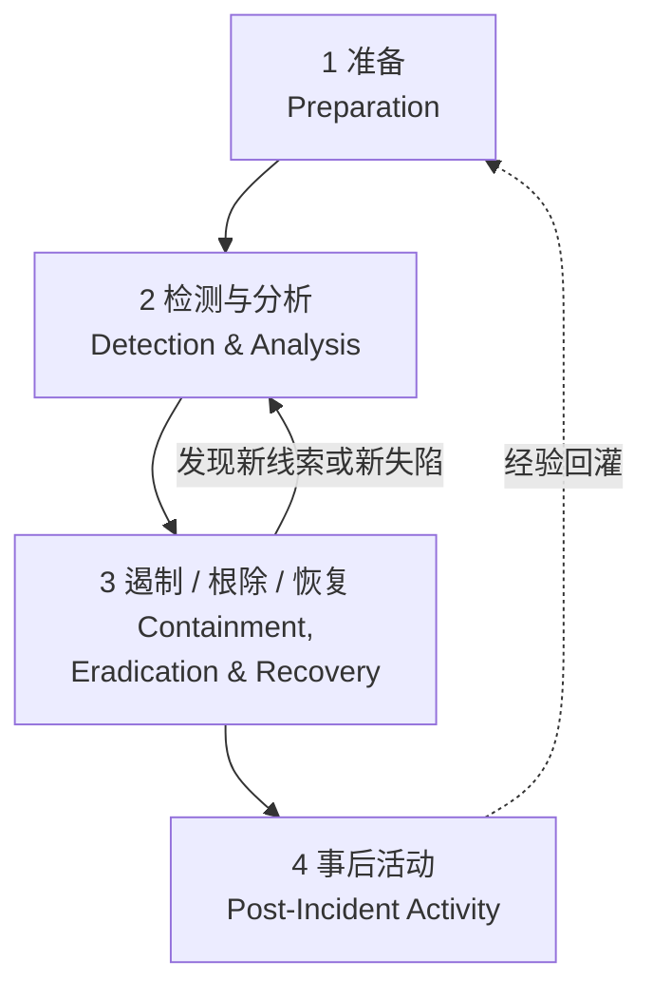
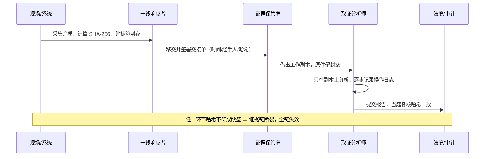
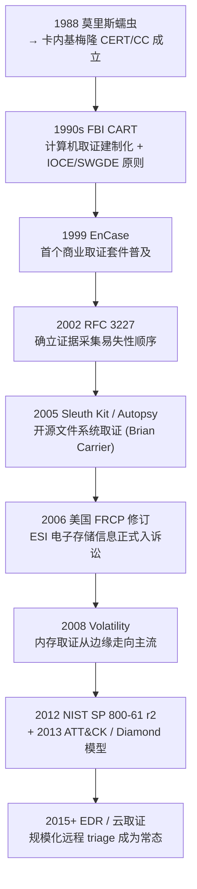

# 数字取证与事件响应（1）· DFIR全景与事件响应流程
> [!abstract] TL;DR
> - DFIR 是取证（DF，回答"发生了什么、如何证明"）与响应（IR，回答"如何止血、如何恢复"）的合流；二者的根本张力是"慢而严谨"对"快而止损"，整套流程设计就是在调和这对矛盾——先固证再动手，而不是动完手才想起取证。
> - 主流程模型两套：SANS 的 **PICERL** 六步（准备-识别-遏制-根除-恢复-总结）粒度细、适合写操作手册；NIST **SP 800-61** 四阶段把遏制/根除/恢复合并成一个可反复迭代的子环，强调"检测分析"与"处置"之间来回跳转，二者本质同构而非对立。
> - 取证可靠性有四块基石：**洛卡德交换原理**（有接触必留痕，是取证得以成立的哲学前提）、**RFC 3227 易失性顺序**（先抓 RAM 再抓磁盘）、**哈希+写保护**保证比特级完整性、**ACPO 四原则**保证"不改动原件、全程可审计、独立可复现"。
> - **证据链（chain of custody）** 是一份记录每次交接 who/what/when/where/why/how 的连续文档；它证明证据"从采集到呈堂从未失控"。链一旦断裂，证据即丧失证明力——技术上再完美的镜像也救不回程序上断掉的链。
> - 报告与复盘让流程闭环：**MTTD/MTTR/驻留时间（dwell time）** 把一次响应量化，Lessons Learned 把教训回灌到 Preparation，使 IR 成为不断自我强化的循环，而非一次性救火。

## 概述与定位

**DFIR** 是 Digital Forensics and Incident Response 的缩写，直译"数字取证与事件响应"，但它并非两个词的简单并列，而是两个原本独立、目标甚至冲突的学科在实战压力下合流成的一门工程实践。理解这门实践的第一步，是分清它内部这两股力量各自要回答什么问题。

**数字取证（DF）** 脱胎于执法与司法：它要回答"到底发生了什么、是谁干的、如何用能被法庭或仲裁机构接受的方式证明它"。取证的天职是**真相与可采性（admissibility）**，因此它天然偏慢、偏严谨——每一步操作都要可复现、可审计，宁可多花几小时做全盘镜像，也不肯在原始介质上多敲一个回车。

**事件响应（IR）** 脱胎于运维与安全运营：它要回答"现在正在出血的伤口在哪、怎么最快止住、业务怎么尽快恢复、怎么防止再犯"。IR 的天职是**止损与恢复**，它天然偏快——攻击者还在内网横向移动时，每多一分钟都可能意味着更多主机失陷、更多数据外泄。

这两股力量的张力显而易见：**取证要求"别动现场"，响应要求"赶紧动手"**。历史上它们分属不同团队——取证在法务/审计线，响应在 IT/安全运营线——结果反复上演同一出悲剧：运维为了"赶紧恢复业务"重启了服务器、重装了系统、清空了日志，等取证人员到场，内存里的攻击者进程、临时目录里的载荷、未落盘的网络连接早已灰飞烟灭，只剩一台"干净"却毫无线索的机器。DFIR 这个合成词的出现，本质上就是行业承认了一个教训：**响应动作必须内建取证意识，取证流程必须能跟上响应节奏**——在按下"重启"之前，先花几分钟抓一份内存镜像；在拔网线隔离之前，先记录下当前的网络连接。这就是为什么本系列把"流程"放在第一篇，而把具体的镜像、内存、磁盘技术放在后面：**没有正确的流程做骨架，再高超的取证技术都是在污染过的现场上做无用功。**

需要把 DFIR 和几个相邻学科划清边界，才能准确定位它：

- **SOC 监控（安全运营中心）** 负责 7×24 告警的产出与初筛，是 DFIR 的"上游触发器"；SOC 分析师判定一个告警值得深挖时，才升级为一次事件（incident），DFIR 才启动。
- **威胁狩猎（Threat Hunting）** 是"没有告警也主动去找"的假设驱动搜索，与 IR 的"告警驱动响应"方向相反，但共用同一套取证痕迹知识。
- **恶意代码分析（Malware RE）** 是 DFIR 的一个专门子能力：当取证在磁盘/内存里捞出可疑样本，需要逆向分析师拆解其行为、提取 IOC，本系列与《恶意代码分析与免杀对抗》在此交汇。
- **红队/渗透测试** 是"扮演攻击者"，DFIR 是"追踪攻击者"，二者是同一枚硬币的两面——懂持久化与注入怎么打，才知道去哪里找痕迹。

因此，本篇的定位是整个系列的**地图与总纲**：它不教你敲某条取证命令，而是搭起后续 14 篇技术细节将要挂靠的骨架——流程模型（何时做什么）、取证原理（为什么这么做才算数）、证据链与报告（怎么让结果站得住脚）。读完本篇，你应当能在真实事件中回答"现在处于流程哪一步、下一步该固定哪类证据、这份证据将来会不会被一句'你怎么证明它没被篡改'击穿"。

## 原理与机制

在讲具体流程之前，必须先建立一组**取证公理**。它们不是某个工具的功能，而是让"数字证据"这四个字得以成立的底层原理；后续所有流程步骤和工具操作，都是这些原理的工程化落实。

**其一，洛卡德物质交换原理（Locard's Exchange Principle）。** 这条源自 20 世纪初法医学的原理说："凡有接触，必留痕迹（every contact leaves a trace）"。搬到数字世界，它意味着：攻击者与系统的每一次交互——登录、执行、写文件、发包、提权——都不可避免地在某处留下印记，可能是一条日志、一个 Prefetch 记录、一段内存残留、一个时间戳跳变。**这条原理是取证的哲学前提**：正因为"必有痕迹"，取证才不是碰运气，而是有方法论的系统搜寻。反过来，攻击者的反取证（anti-forensics）本质就是在与这条原理博弈——不是消灭痕迹（做不到），而是让痕迹尽量少、尽量难解读、尽量指向错误方向。理解这一点，就明白为什么取证从不指望"某一处铁证"，而是靠**多源痕迹相互印证（correlation）**：单条日志可以被伪造，但要同时篡改磁盘时间线、内存、注册表、网络对端日志且不留矛盾，成本高到几乎不可能。

**其二，证据的易失性顺序（Order of Volatility，RFC 3227）。** 不同介质上的数据"活得久不久"天差地别：CPU 寄存器和缓存以纳秒计，内存里的进程/网络连接一掉电就没，交换分区和临时文件随时可能被覆盖，而磁盘上的数据相对稳定，归档介质最持久。RFC 3227《Guidelines for Evidence Collection and Archiving》据此定了一条铁律：**采集证据必须从最易失的开始，向最稳定的推进**。这条原理直接决定了现场处置的动作顺序——为什么强调"先抓内存再关机"、为什么"拔网线"这个动作要三思（它会瞬间清空所有活动网络连接这一易失证据）。它也解释了 IR 与取证的先后关系：响应者到场第一件事往往不是隔离，而是抢救易失证据。

```
证据易失性从高到低（采集优先级从先到后）：
  1. CPU 寄存器 / 缓存 ........... 纳秒级，几乎无法直接取
  2. 内存 RAM：进程表 / 网络连接 / ARP / 内核态 ... 掉电即失 ← 现场首抓
  3. 临时文件系统 / 交换分区 / pagefile ......... 易被覆盖
  4. 磁盘 / SSD ................. 相对稳定（注意 SSD 的 TRIM/GC 会自毁）
  5. 远程日志 / 监控 / NetFlow ... 存在他方，需及时固定
  6. 物理网络拓扑 / 归档介质 ..... 最稳定
```

**其三，完整性与可复现（Integrity & Repeatability）。** 数字证据的致命弱点是"太好改且改了看不出来"——比特就是比特，复制品与原件毫无物理差异。取证用两件工具对抗这个弱点：**密码学哈希**（采集时算一次，之后每次核验都算，只要 SHA-256 一致，就能证明这一坨比特一个都没变）和**写保护/写阻断（write blocker）**（在硬件或软件层拦住一切写命令，保证连接原始介质分析时物理上不可能改动它）。这两件事是第 2 篇《证据保全与取证镜像》的主角，这里只需确立原理：**先固定完整性基线（哈希），再在副本上工作，原件永久封存。** 与之配套的是"可复现"——独立的第三方，用同样的方法和输入，应能得到同样的结果；这是把取证从"专家凭经验说"提升为"科学方法"的关键，也是法庭采纳的前提。

**其四，取证的行为准则：ACPO 四原则。** 英国警长协会（ACPO）的《数字证据良好实践指南》把上述原理浓缩成四条被全球广泛引用的操作准则：

1. **不改动原则**——任何操作都不应改变将来可能在法庭上被援引的数据。
2. **胜任例外原则**——若确实必须访问原始数据（如活体取证无法避免地改动系统），操作者必须有足够能力，并能解释其行为的相关性与影响。
3. **可审计原则**——应完整记录所有施加于证据的过程，独立第三方按此记录复核应能得到相同结果。
4. **负责人原则**——调查负责人对全程遵守法律与上述原则负总责。

这四条把抽象原理翻译成了"到底该怎么做"：第 1 条对应写保护/镜像，第 2 条承认了活体取证（live forensics）的现实妥协——你没法在不改动系统的前提下抓内存，那就诚实记录你改动了什么、为什么，第 3 条对应证据链与操作日志，第 4 条对应角色与问责。**读懂 ACPO，就读懂了整个 DFIR 流程为什么长成后面那个样子。**

## 流程模型与证据链详解

有了原理，现在把它们编织进可执行的流程。业界有两套主流模型，一套细、一套粗，但同构。

### SANS 六步：PICERL

SANS《Incident Handler's Handbook》提出的六步法，因首字母缩写 **PICERL** 而流传，是最适合写成操作手册（playbook）的粒度：



- **准备（Preparation）** 是唯一在"平时"做的一步，也是最被低估的一步。它包括：组建并授权 CSIRT（谁有权拔线、谁有权对外发声）、准备好取证工具箱与"跳板机/干净取证工作站"、建立系统与网络基线（不知道"正常"长什么样，就认不出"异常"）、部署可留存足够久的日志（很多事件败在"日志只留 7 天，攻击者潜伏了 3 个月"）、演练预案。**为什么它排第一且最重要？** 因为响应中的一切速度都是准备买来的——事到临头才找取证工具、才申请授权、才发现关键日志没开，注定手忙脚乱。
- **识别（Identification）** 从一个信号（SIEM 告警、EDR 拦截、员工报告、威胁情报命中）出发，做**研判与定级**：这是真事件还是误报？影响面多大？定为什么级别？这一步的产物是"立案"——从此刻起，证据链开始计时，所有动作进入取证纪律。**关键陷阱**：过早定性会导致遏制方向错误，"识别"要留出并行取证的时间，而非一看到告警就冲去关机。
- **遏制（Containment）** 是止血，分**短期**（立刻隔离失陷主机、封禁 C2 域名/IP、禁用被盗账户）与**长期**（打临时补丁、加访问控制，撑到能彻底根除）。**这一步与取证的冲突最尖锐**：隔离手段（关机、拔网线、快照回滚）都会破坏易失证据。正确做法是遵循易失性顺序——**先抓内存与活动连接，再隔离**；能用"网络层隔离"（丢进隔离 VLAN、只保留取证通道）就别直接关机，从而既止血又保住现场。
- **根除（Eradication）** 是清除攻击者的一切立足点：删木马、清持久化（计划任务、服务、注册表 Run 键、WMI 订阅——详见《持久化技术大全》）、封堵最初入口（补漏洞、改弱口令）。**难点在"清干净"**：只删了看得见的后门，漏掉一个隐蔽的 Web shell 或一台被遗忘的失陷主机，攻击者当晚就卷土重来。所以根除强烈依赖前面取证摸清的"全部立足点清单"，这也是流程里 E 步会回跳到 I 步的原因。
- **恢复（Recovery）** 是把业务安全地搬回生产：从干净备份还原、验证系统完整、加固后再上线，并在上线后**强化监控一段时间**，确认攻击者没死灰复燃。恢复的隐性风险是"从被污染的备份还原"——若备份本身包含后门，等于把攻击者一起请回来。
- **总结（Lessons Learned）** 在事件平息后（通常两周内）召开复盘，产出正式报告，量化度量（见后文），最重要的是把教训**回灌 Preparation**：这条攻击路径为什么没被早点发现？该补什么监控、改什么策略？没有这一步，同样的事会再发生。

### NIST SP 800-61：四阶段

NIST 的《Computer Security Incident Handling Guide》（SP 800-61，现行 Rev.2）把流程压成四阶段，把 PICERL 的遏制/根除/恢复合并为一个整体，并**显式画出"检测分析"与"处置"之间的循环箭头**：



两套模型**本质同构**，差别只在剪裁：PICERL 把处置拆成三步、利于写细粒度手册与分工；NIST 把三步捆成一个反复迭代的子环，更贴近真实——现实中根除时常发现新失陷点，被迫跳回检测分析，如此往复。选哪套不重要，**重要的是理解它们共同的内核：一个以准备开始、以经验回灌闭合的循环，中间夹着"先看清再动手、边处置边取证"的处置期。** 另有一个更偏取证科学的模型是 **NIST SP 800-86**（取证四步：采集 Collection → 检验 Examination → 分析 Analysis → 报告 Reporting），它聚焦"证据怎么变成结论"，与 800-61 的"事件怎么响应"互补——前者是本系列后续技术篇的骨架，后者是本篇的骨架。

### 证据链（Chain of Custody）详解

如果说流程保证"做对事"，证据链就保证"做的事能被证明"。**证据链是一份连续、不间断地记录某件证据从产生到销毁全过程中"每一次经手与移交"的文档**，它要能回答关于每一件证据的六个问题：**What**（是什么，含品牌/型号/序列号/容量）、**Who**（谁采集、每次谁经手谁保管）、**When**（每次交接的精确时间）、**Where**（在哪采集、存放于何处）、**Why/How**（为何采集、用什么方法）。核心一栏是**哈希**——采集时算一次，每次交接核验一次。

```
证据编号 : EVD-2026-0731-001
物品描述 : Dell OptiPlex 7090, S/N 7GXYZ23, 500GB NVMe
采集人   : 张三 (工号 IR-014)
采集时间 : 2026-07-31 14:22:07 +08:00   （带时区，避免跨时区歧义）
采集地点 : 北京 IDC 3F 机柜 R12
采集方法 : 断电后取盘 → Tableau 写保护器 → dd 全盘位对位镜像
镜像哈希 : SHA-256 3f2a…9c1b (原盘)  ==  3f2a…9c1b (镜像)  ✓
—— 交接记录（每次移交一行，缺一不可） ——
#1 2026-07-31 15:40  张三 → 证据室 王五   签字___  哈希复核 ✓
#2 2026-08-02 09:10  王五 → 分析师 李四   签字___  （借工作副本，原件封存）
#3 2026-08-05 17:30  李四 → 证据室 王五   签字___  哈希复核 ✓
```



**为什么证据链如此致命地重要？** 因为对方律师（或审计方）不需要证明你篡改了证据，他只需要指出**"你无法证明它没被篡改"**——只要证据链中有一段空白（一次没记录的交接、一个对不上的时间、一处缺失的签名），就足以让法官以"无法排除污染可能"为由排除该证据。这就是那句行话的含义：**技术上再完美的镜像，也救不回程序上断掉的链。** 一份 SHA-256 完美一致的镜像，若中间有 48 小时没人能说清它在谁手上，照样可能被整份排除。因此证据链的纪律是"连续、冗余、可审计"：宁可多签一次字、多记一行，也不留一段空白。

### 证据的可采性（Admissibility）

证据链解决"没被污染"，可采性解决"法律上认不认"。虽然各法域规则不同，但英美法系的几条规则已成为数字取证事实上的国际参照，值得了解其原理：

- **最佳证据规则（Best Evidence Rule，FRE 1002）**：原则上要出示原件。数字世界的巧妙之处在于——**位对位的镜像加哈希佐证，在法律上被视同原件**，这正是"分析副本、封存原件"做法能成立的法理基础。
- **鉴真（Authentication，FRE 901）**：你得证明"这份证据确实是它声称的那个东西"，哈希与证据链就是数字证据的鉴真手段。
- **专家证言与科学方法（FRE 702 + Daubert 标准）**：取证结论往往需要专家出庭。Daubert 标准要求所用方法**可检验、有已知错误率、经同行评议、被业界普遍接受**——这解释了为什么取证偏爱开源/公开算法的工具、为什么 NIST 会做 **CFTT（Computer Forensic Tool Testing）** 工具验证：一个黑盒、无法复现、错误率不明的工具，其产出可能过不了 Daubert 这关。
- **传闻规则的业务记录例外（FRE 803(6)）**：日志之所以能作为证据，往往靠"系统在正常业务过程中自动生成"这一例外。

理解这些不是要你去当律师，而是让技术动作有法理指向：**你之所以算哈希、封原件、用可复现的公开工具、记录每一步，最终都是为了让证据跨过采信门槛。** 取证工程的每个"麻烦"步骤，背后都有一条法律规则在撑腰。

### 历史演进

DFIR 的形态是被一系列标志性事件"逼"出来的：



这条线索揭示了一个趋势：取证对象从"一块拔下来的硬盘"（死盘取证），演进到"运行中的内存"（活体/内存取证），再到"根本没有物理介质可拔的云与容器"（云取证）；同时响应从"事后司法鉴定"演进到"攻击进行中的实时对抗"。**驱动力始终是攻击者**——无文件攻击（fileless）逼出内存取证，反取证逼出多源印证，云上入侵逼出 API 日志取证。DFIR 永远在追赶攻击面的形变。

## 工具视角与实战

本篇是总纲，具体的镜像、内存、磁盘工具留给后续各篇；这里聚焦**把流程跑起来的编排层工具与心智模型**——它们恰好是后面技术篇不会单独讲、却决定一次响应成败的东西。

**案件与工单管理（Case Management）。** 一次真实事件会产生几十上百条证据、线索、待办与时间戳，靠脑子和微信记必然失控。**TheHive + Cortex** 是开源主力：TheHive 管案件、任务、可观测量（observables），Cortex 对接各类分析器自动富化 IOC。商用侧有 IBM Resilient、Splunk SOAR（Phantom）等。它们的本质价值不是花哨功能，而是**为"识别→复盘"全程强制一条可审计的记录轨**——谁在何时做了什么判断、基于什么证据，天然长成证据链与报告的骨架。

**规模化分诊与远程取证（Triage at Scale）。** 现代事件动辄涉及成百上千台主机，逐台拔盘做全量镜像既不现实也无必要。实战靠**远程分诊**先做减法：**Velociraptor**（用 VQL 在全网端点上按需查询与采集，是近年 DFIR 的明星）、Google **GRR**、以及本地快速采集的 **KAPE**（按目标批量抓取 Prefetch、注册表、日志、浏览器痕迹等"取证宝库"文件）。它们体现的方法论是 **triage 优先**：先用低成本手段在全网快速定位"哪几台真的有问题"，再对少数关键主机做深度全量取证——把有限的取证人力用在刀刃上。

**处置的心智模型：三张图。** 响应中"接下来该找什么、攻击者可能在哪一步"需要框架支撑：

- **Cyber Kill Chain（洛克希德·马丁）**：把入侵拆为侦察→武器化→投递→利用→安装→C2→目标行动七阶段。它帮你判断"攻击者走到哪了、下一步会做什么、在哪个环节还能截断"。
- **Diamond Model**：把每次攻击事件抽象为"对手—能力—基础设施—受害者"四顶点，擅长做**归因与关联**——同一 C2 基础设施、同一工具能力，把散落的事件串成同一波战役。
- **MITRE ATT&CK**：以战术（Tactics）与技术（Techniques）编目真实世界攻击手法。它是当代 DFIR 的**通用语**：取证发现一个持久化手法，映射到 T1547；发现进程注入，映射到 T1055。ATT&CK 让"我发现了什么"能被标准化地沟通、检索与防御覆盖度评估。

**度量与报告（闭环的量化）。** 复盘不能只有定性叙事，要有可比较的数字：

- **MTTD（平均检测时间）**：从失陷到被发现有多久。
- **MTTR（平均响应/恢复时间）**：从发现到处置完成有多久。
- **Dwell Time（驻留时间）**：攻击者从进入到被清除潜伏了多久——Mandiant 的 M-Trends 年报以此为核心指标，行业均值多年来从数百天降到数十天，正是 EDR 普及之功。

报告本身是分层交付物：给管理层的**执行摘要**（一页讲清"发生了什么、影响多大、花了多少、还有什么风险"）、给技术团队的**详细时间线与 IOC 清单**、给合规/法务的**证据链与处置记录**。一份好报告的检验标准是：**半年后有人接手，靠这份报告能完整复现"当时判断的依据与处置的理由"**，而不必再来问你。这也是为什么报告写作被列为 DFIR 的核心能力而非附属杂务。

## 安全性与正确使用

DFIR 本身是一套能读取系统最深层数据、能切断业务、能给个人定责的高权限实践，用不好会从"解决问题"变成"制造问题"。以下是它必须守住的安全与合规边界。

- **授权先于一切。** 未经明确授权就去"取证调查"一台机器（尤其是员工设备），本身可能违反隐私法、劳动法乃至刑法。正确做法是在 **Preparation 阶段**就把授权矩阵定清楚——谁有权在什么条件下采集、隔离、对外通报，并保留书面依据。事到临头才临时口头授权，既拖慢响应，又给日后留下"越权取证"的把柄。
- **隐私与数据最小化。** 取证会接触大量与事件无关的个人数据（邮件、聊天、文件）。GDPR、个保法等要求**目的限定与最小化**：只采集、只分析、只保留与本次事件相关的部分，用完按规定销毁，并全程记录数据处置。把整块盘拷回家"以后可能有用"是典型的合规雷区。
- **别自己污染现场。** 最常见的自伤是响应者本人破坏了证据：直接双击可疑样本"看看是啥"（改了访问时间、可能触发载荷）、在原始系统上装分析工具（改了磁盘、内存）、用生产管理员账号登进失陷机（把自己的凭据也送进了攻击者可能布控的机器）。纪律是**"只在副本上分析、用干净的取证专机、遵循易失性顺序"**——ACPO 第一、二条的落地。
- **遏制的副作用与"打草惊蛇"。** 隔离与封禁并非没有代价：过早封掉一个 C2，可能让攻击者察觉暴露、抢先删证据或引爆勒索；直接关机会毁掉内存证据。成熟的做法是在**充分固证并摸清全部立足点之前，尽量用不惊动对方的隔离**（如静默的网络层隔离），把"何时动手遏制"当成一个需要权衡取证收益与出血风险的决策，而非条件反射。
- **通信纪律：假设对方在看。** 攻击者可能已控制邮件、IM 甚至工单系统。事件通信应走**带外（out-of-band）通道**并遵循 need-to-know，否则你的处置计划会被对方实时读到。这一条常被技术团队忽视，却屡屡是响应功亏一篑的原因。
- **工具与结论的可信度。** 用未经验证的黑盒工具得出"铁证"，在法律与技术上都危险。正确使用意味着**优先选可复现、算法公开、经 NIST CFTT 之类验证的工具**，对关键结论用不同工具/不同方法交叉验证，并在报告中诚实标注不确定性与工具局限。取证的可信不来自"工具说是"，而来自"方法可被独立复核"。

一句话概括正确使用的边界：**DFIR 的权力越大，越要用流程与记录把它关进笼子**——授权、最小化、只碰副本、交叉验证、全程可审计。这些约束不是绊脚石，而正是让你的结论最终"算数"的东西。

## 小结

本篇为整个《数字取证与事件响应》系列铺设了骨架。核心可收束为四层：

- **合流之因**：DFIR 是取证的"严谨求真"与响应的"快速止损"在实战中的和解，其全部流程设计都在回答"如何既止血又不毁证"。
- **原理之基**：洛卡德交换原理（必有痕迹）、易失性顺序（先易失后稳定）、完整性与可复现（哈希+写保护）、ACPO 四原则（不改动/胜任例外/可审计/负责人）——这四条是后续一切技术动作的合法性来源。
- **流程之形**：PICERL 六步与 NIST SP 800-61 四阶段同构，共享"以准备开始、以经验回灌闭合"的循环，中段是"边看清边处置、先固证再动手"的处置期；SP 800-86 的取证四步与之互补。
- **成果之据**：证据链保证证据"从未失控"，可采性规则（最佳证据/鉴真/Daubert）决定它"认不认"，报告与 MTTD/MTTR/驻留时间等度量让循环闭合并可量化改进。

带着这张地图，后续各篇的技术细节——镜像、内存、磁盘、注册表、日志、时间线、网络、持久化取证——都能各归其位：它们是这套流程在不同证据源上的具体展开。下一篇《证据保全与取证镜像》将深入本篇多次提到却按下不表的两块基石——**写保护与哈希**，讲清一份"法庭级"镜像到底是怎么炼成的。

## 相关阅读

- 权威标准与规范：**NIST SP 800-61 Rev.2**《Computer Security Incident Handling Guide》、**NIST SP 800-86**《Guide to Integrating Forensic Techniques into Incident Response》、**RFC 3227**《Guidelines for Evidence Collection and Archiving》、**ACPO**《Good Practice Guide for Digital Evidence》、SANS《Incident Handler's Handbook》(PICERL)、NIST **CFTT** 工具验证项目、MITRE **ATT&CK** 知识库。
- 经典书目：Brian Carrier《File System Forensic Analysis》、Eoghan Casey《Digital Evidence and Computer Crime》、Mandiant《Incident Response & Computer Forensics》、《The Art of Memory Forensics》。
- 本系列后续：[[02.证据保全与取证镜像]]（写保护与哈希的深挖）、[[03.内存取证：采集与Volatility框架]]（易失证据首选）、[[07.Windows事件日志分析]]、[[11.时间线分析与超级时间线]]、[[14.反取证技术与对抗]]。
- 同库交叉：[[50.恶意代码分析与免杀对抗/08.持久化技术大全]]、[[50.恶意代码分析与免杀对抗/06.进程注入技术全谱]]（根除阶段要清除的对象）、[[72.抓包与协议分析实战/19.网络取证与流重组]]（网络侧证据）、[[39.固件与IoT嵌入式逆向/22.eMMC与NAND芯片级取证]]（芯片级介质取证）、[[38.Windows内核与驱动逆向/11.Rootkit原理与检测]]（内核持久化痕迹）。

[[00.数字取证与事件响应总览|⬆ 系列总览]] | [[02.证据保全与取证镜像|→ 下一章]]
