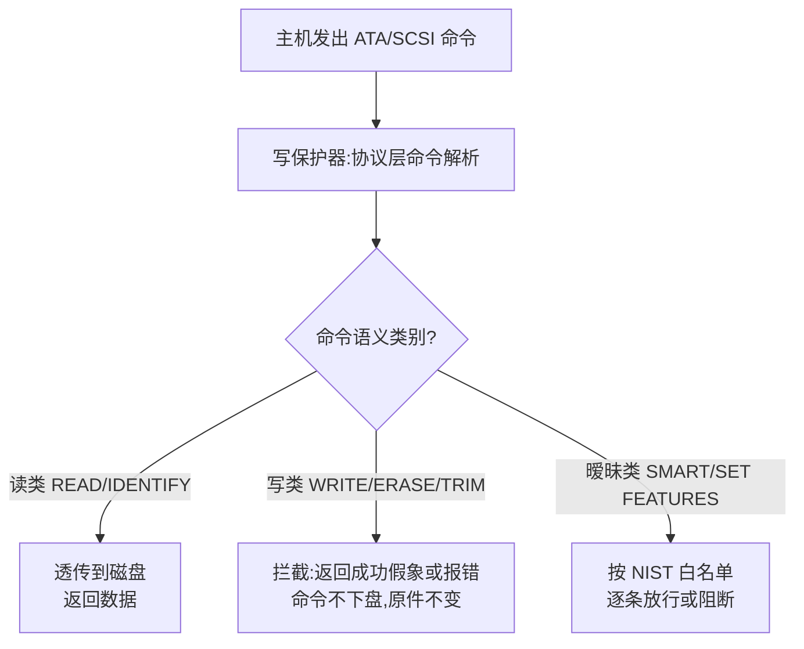
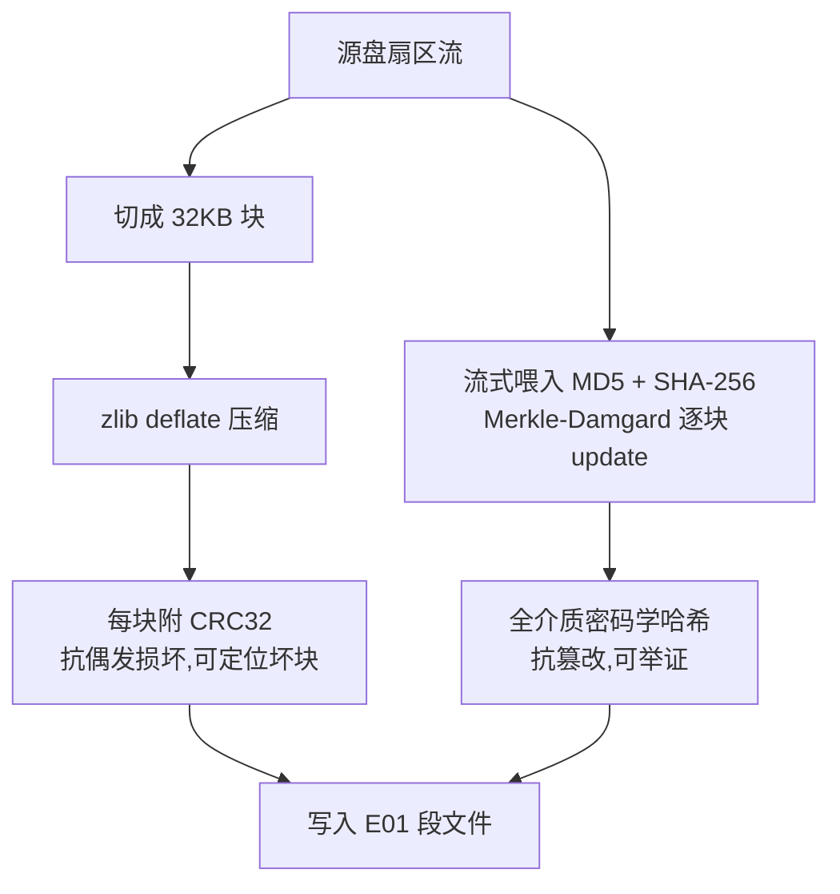
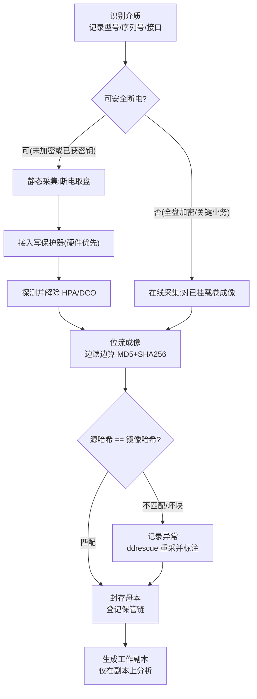

# 数字取证与事件响应（2）· 证据保全与取证镜像
> [!abstract] TL;DR
> - 证据保全的技术契约是「取证可靠性」（forensic soundness）：不改动原始介质（完整性）、能用哈希证明副本忠实（可验证）、覆盖全部扇区含未分配空间/slack/坏块（完整性）、流程可复现且全程留痕（保管链）。四者缺一，后续 03–15 篇的一切分析都可能在法庭上被一击推翻。
> - 写保护分硬件与软件两路：硬件写保护器在**协议层**过滤 ATA/SCSI 命令，放行读类、拦截写类，独立于宿主 OS 的信任链；软件写保护（`blockdev --setro`、Windows `StorageDevicePolicies`）依赖 OS 守约，存在「枚举—设只读」之间的竞态窗口，故正式取证以硬件为先。
> - 哈希在取证里承担两件事：完整性举证与已知文件比对。MD5/SHA-1 的**碰撞抗性**已破，但与举证真正相关的是**第二原像抗性**（至今未破），故 MD5「仍能用」；但可辩护实践一律用 MD5+SHA-256 双哈希 + 分段哈希，把坏块定位与抗篡改一起解决。
> - E01/EWF 是「压缩 + 元数据 + 两级完整性」的取证容器：每 32KB 块附 CRC32 抗偶发损坏，全介质附 MD5/SHA 抗篡改；RAW/dd 无元数据、无压缩但绝对通用。坏块处理必须 `conv=noerror,sync` 补零保持扇区对齐，否则后续所有偏移与哈希全线错位。
> - SSD 让「采集确定性」这一前提失效：TRIM/垃圾回收/磨损均衡使得通电即可能后台擦除已删数据、同一 SSD 两次成像哈希可能不一致；逻辑层不可及的重映射块与预留区（OP）需芯片级取证承接（见 39）。

## 概述与定位

在 DFIR 的作业链条里，本篇处在一个「承上启下的咽喉」位置。上一篇（01）讲的是全景与响应流程——如何识别事件、判定范围、决定「拔电还是优雅关机」、按易失性顺序确定先动谁；从下一篇（03）开始一直到全系列结束，讲的都是**在已获取的证据上做分析**：内存、磁盘痕迹、注册表、日志、时间线、网络流。而横在「现场」与「分析」之间的这道工序，就是**证据保全与取证镜像**——把一块还在运转或刚断电的存储介质，变成一份可以搬回实验室、反复研究、经得起对方专家质证的**位级副本（bit-stream image）**。

这道工序看似只是「复制一块盘」，实则是在履行一份技术契约，即前面反复提到的**取证可靠性（forensic soundness）**。它可以拆成四条彼此独立、缺一不可的要求：

- **完整性（integrity / 不改动）**：采集过程不得对原始介质产生任何写入。哪怕只改了一个文件的访问时间、写了一条日志、更新了一次文件系统日志（journal），都意味着「原件已被污染」，而污染无法撤销。
- **可验证性（verifiability）**：必须能在数学上证明「这份镜像 == 当时那块盘」，并证明此后镜像未被改动。承担这个证明的是**密码学哈希**。
- **完整覆盖（completeness）**：取的是**整块物理盘的每一个扇区**，包括分区表、分区之间的间隙、未分配空间、文件 slack、乃至被 HPA/DCO 隐藏的区域——而不是「把看得见的文件拷出来」。因为删除数据、反取证痕迹、恶意载荷往往恰恰藏在「看不见」的地方。
- **可复现与留痕（repeatability & chain of custody）**：换一个人、用另一套工具重做，应得到相同哈希；且从查封、贴签、封存到每一次开封分析，都有连续的**保管链**记录。

理解本篇边界也很重要，以免与相邻篇重复：**内存（RAM）的采集**属易失性最高一档，放在 03/04 篇；**芯片级（chip-off / eMMC / NAND）**在逻辑接口不可及时才登场，放在 39 篇；**文件系统内部结构（NTFS/EXT）**放在 10 篇；**磁盘上的具体痕迹解读**放在 05 篇。本篇只管一件事——**如何把「盘」安全、完整、可证地变成「镜像」**，即写保护、哈希校验、镜像格式（E01/dd）这三件核心武器，外加把它们串起来的采集流程与保管链。

一句话定位：**本篇是整条证据链的「地基」。地基一旦有裂缝（污染、哈希缺失、漏取 HPA、用错写保护器），上面盖多高的分析大楼都可能被推倒。**

## 原理与机制

### 易失性顺序与「静态采集」的相对性

RFC 3227 给出的**易失性顺序（order of volatility）**是整条采集决策的总纲：寄存器/缓存 → 内存与运行态（进程、网络连接、路由表）→ 临时文件系统 → 磁盘 → 远程日志/物理介质。越易失越要先取。磁盘位于中下游，相对「稳定」——但「稳定」是相对的：只要系统还在通电运行，磁盘就在被持续写入（日志、swap、时间戳、SSD 后台整理），所以「静态」二字只有在**断电或写保护介入之后**才真正成立。这条链条的上游细节在 01 篇展开，本篇从「决定对磁盘成像」这一步接手。

### 物理采集 vs 逻辑采集：为什么必须位流

- **逻辑采集**：只复制某个卷/分区里「文件系统认为存在」的文件，或打包成一组文件（如 EnCase 的 L01）。它丢掉了分区外的未分配空间、卷 slack、分区间隙。
- **物理采集（位流 / bitstream）**：从 LBA 0 到最后一个扇区，逐扇区照抄，不理会文件系统的「存在与否」判断。

取证标准是**位流**，深层原因在于：被「删除」的文件在文件系统里只是标记了「此空间可覆盖」，数据本体仍躺在未分配空间；文件 slack（文件实际大小到簇边界之间的残余）里可能残留前一个文件的碎片；反取证工具、隐藏分区、引导区木马都活在「文件视图之外」。**逻辑采集等于让嫌疑人替你决定哪些证据可见**——这是不可接受的。

### 写保护：在「读」与「写」之间划一道物理红线

写保护要解决的根本威胁是：**只要把证据盘接上一台开机的电脑，操作系统就会忍不住去动它。** Windows 会尝试挂载、更新「最近访问」、写入卷影/回收站元数据、给无签名磁盘写签名；Linux 若配了自动挂载也会 replay journal。这些都是写。于是需要一道机制，在读被允许的同时，把写彻底掐断。

**硬件写保护器（hardware write blocker）** 是一枚插在「磁盘 ↔ 主机」之间的物理设备（针对 SATA/SAS/IDE/USB/NVMe 各有专款）。它的工作层次是**接口协议命令层**：ATA/SCSI 命令集里每条命令都有「是否会修改介质」的语义，写保护器维护一张白名单，`READ SECTORS`、`IDENTIFY DEVICE` 等读类命令透传，`WRITE SECTORS`、`ERASE`、`TRIM/DSM` 等写类命令被拦截——要么直接向主机返回「写成功」的假象（让上层 OS 不报错、不重试），要么返回错误，但**无论如何都不把命令送到盘**。对 `SMART`、`SET FEATURES`、`SECURITY` 这类语义暧昧的命令，按策略白名单逐条决定。硬件方案的**根本优势是不依赖宿主 OS 的诚信**：在主机第一次「看见」这块盘之前，红线就已经在硬件里生效了。

**软件写保护（software write blocker）** 则是改变 OS 行为：Linux 用 `blockdev --setro /dev/sdX` 把块设备设为只读，或 `hdparm -r1`，或干脆禁用自动挂载 + 只读挂载；Windows 自 XP SP2 起有注册表键 `HKLM\SYSTEM\CurrentControlSet\Control\StorageDevicePolicies\WriteProtect`（仅对 USB 有效）。软件方案的**致命弱点是竞态窗口**：从内核枚举出这块盘、到你把只读标志设上去，中间存在一段时间差，Windows 完全可能在这个窗口里就已经写了磁盘签名。因此正式取证以硬件为先，软件写保护多用于「Linux 取证启动盘（如 CAINE、Paladin，默认全盘只读、不自动挂载）」这类整体环境可控的场景。

硬件写保护器的命令层过滤逻辑可概括为下图——它不是「拦住电流」，而是**逐条判读协议命令的语义**再决定放行与否：



### 哈希校验：用第二原像抗性把「忠实」变成可举证的数学命题

采集完得回答一个问题：**凭什么说这份镜像就是当时那块盘、且此后没被人动过手脚？** 答案是密码学哈希：采集时对源（或边读边）算一个哈希 H_src，对写出的镜像算 H_img，二者相等即证明位级一致；此后任何时刻重算镜像哈希，与封存时记录的值比对，即证明未被篡改。

这里有个**长期被误解的点**：MD5（2004 年王小云）、SHA-1（2017 年 SHAttered）的**碰撞抗性（collision resistance，找到任意两个同哈希输入）**确实已被攻破，于是常有人喊「取证还用 MD5 就是不专业」。但要分清三种抗性：

- **原像抗性**：给定 H，反推出 M。
- **第二原像抗性**：给定 M，找到另一个 M' 使 hash(M')=hash(M)。
- **碰撞抗性**：自由地找任意一对 (M, M') 同哈希。

取证「证明这份特定镜像未被替换」依赖的是**第二原像抗性**——对手要伪造一份「不同内容却同 MD5」的镜像去顶替原件——而 MD5/SHA-1 的第二原像抗性至今仍接近 2^128 / 2^160，**并未被攻破**。所以 MD5「在完整性验证这个用途上仍然能用」并非外行话。但**可辩护的现代实践**不赌这个边界：一律**双哈希（MD5 + SHA-256）**，让对手必须同时在两个算法里制造碰撞，难度陡增；对已知文件比对（NSRL 哈希集）也用双哈希降低误判。

### HPA/DCO：主动被隐藏的扇区

ATA 规范提供两个能「合法藏盘」的特性：**HPA（Host Protected Area，主机保护区）** 通过 `SET MAX ADDRESS` 缩小 OS 可见容量，厂商用来放恢复分区，攻击者用来藏数据；**DCO（Device Configuration Overlay）** 更底层，能改写 `IDENTIFY` 报告的容量与特性。若采集前不探测并临时解除它们，成像就会**漏掉隐藏区**——而这恰恰是最可能藏东西的地方。棘手之处在于：解除 HPA/DCO 需要发出「修改设备配置」的命令，与写保护「一律拦写」的原则冲突。实务做法是：用可配置为「允许解除 HPA/DCO」的专业写保护器，或在受控步骤里短暂放行这些命令、完整记录，再恢复。

### 死采集 vs 在线采集：全盘加密如何逼你上「活体」

- **死采集（dead / static）**：断电、取盘、过写保护器、成像。最干净，首选。
- **在线采集（live）**：系统不能断电时对**已挂载的卷**成像。代价是采集期间数据仍在变（称为 smearing / 涂抹），只能对镜像本身算哈希、无法与「源」做逐位比对。

**全盘加密（BitLocker / FileVault / LUKS）的普及是把在线采集从「例外」推向「常态」的关键推手**：一旦断电，拿到的是一坨密文，没有密钥毫无价值。于是必须在系统运行、卷已解密挂载的状态下，抓取**解密后的逻辑视图**，或先从内存中提取密钥（与 03 篇内存取证联动）。此外，关键业务不可停机、证据仅存于 RAM 盘，也都是在线采集的理由。

### SSD/闪存：采集「确定性」这一前提的坍塌

机械硬盘时代有个隐含前提：**LBA 与物理位置一一对应，写保护住就万事大吉，重复读同一块盘哈希恒定。** SSD 把这个前提打碎了：

- **TRIM**：OS 告诉 SSD 哪些块已空闲，SSD 的**垃圾回收（GC）**会在后台把这些块真正擦除清零。这意味着——**只要盘还通着电，已删数据可能在你还没接上写保护器之前就被主控自行抹掉了**；写保护只能拦住来自主机的命令，拦不住 SSD 主控自己的后台行为。
- **磨损均衡（wear leveling）**：逻辑块被动态重映射到不同 NAND 单元，加上**预留空间（over-provisioning）**，有相当一部分物理颗粒**在 ATA 逻辑接口上根本不可见**，要靠芯片级取证（39 篇）才能触及。
- **非确定性后果**：同一块 SSD 先后成像两次，哈希**可能不相等**（后台 GC 改变了盘面）。这不是采集出错，而是介质物理特性——必须在报告中如实记录采集时间、说明该现象，否则「二次哈希对不上」会被误读成「证据被篡改」。

## 镜像格式与校验算法详解

镜像格式的选择，本质是在**通用性、体积、内建完整性、元数据**四者间权衡。下面把三大类拆到字节与算法层面。

### RAW / dd：最朴素也最通用

RAW 就是把每个扇区顺序倒进一个文件，无头无尾、无压缩（除非稀疏文件）、无元数据。体积等于源盘容量。优点是**绝对通用**（任何工具、任何 `losetup`/`mount` 都能直接吃），缺点是**哈希、案件信息只能存在旁边的独立文件里**，本身不带任何完整性结构；大盘就是大文件，为兼容 FAT32/介质限制常切成 `.001/.002…` 的分卷 RAW。它是「最小公分母」，也是 E01 在内部解压后呈现的形态。

### EWF / E01：取证容器的事实标准

EWF（Expert Witness Format）源自 ASR Data 的 Expert Witness，被 EnCase（Guidance Software）发扬光大，`.E01` 成为业界通用词。开源实现是 Joachim Metz 的 **libewf**（配套 `ewfacquire/ewfverify/ewfmount/ewfinfo/ewfexport`）。它的字节布局如下：

```
EWF / E01 段文件（.E01, .E02 …）总体布局
┌────────────────────────────────────────────────────┐
│ 文件头 File Header (13 字节)                          │
│   签名 "EVF\x09\x0d\x0a\xff\x00" + 字段起始           │
├────────────────────────────────────────────────────┤
│ section: header2   (zlib压缩, UTF-16 元数据)          │ ← 检材号/案件号/调查员/采集时间/OS/备注
│ section: header    (zlib压缩, ASCII 元数据副本)        │
├────────────────────────────────────────────────────┤
│ section: disk/volume  几何信息                        │ ← 块数, 64扇区/块, 512字节/扇区, 总扇区数
├────────────────────────────────────────────────────┤
│ section: sectors    压缩数据区                        │
│   [chunk0][chunk1] ... [chunkN]                      │ ← 每块 = 64 扇区 = 32KB, deflate 压缩
│   （未压缩存储的块尾部附 CRC32）                        │
├────────────────────────────────────────────────────┤
│ section: table     块偏移表 (+CRC)                    │ ← 偏移最高位标记该块是否压缩；O(1) 随机定位
│ section: table2    table 的备份副本                    │
├────────────────────────────────────────────────────┤
│ section: digest    MD5 + SHA-1   (EnCase 6+)          │ ← 全介质密码学哈希
│ section: hash      MD5                                │
│ section: done      结束标记                            │
└────────────────────────────────────────────────────┘
每个 section 前有描述符：类型串 + 下一段偏移 + 段大小 + 段自身 CRC
```

几个设计要点值得逐一讲透，因为它们回答了「为什么 E01 这样设计」：

- **为什么切 32KB 块**：块太大则随机读一个扇区要解压一大坨、浪费；块太小则压缩率和表开销都差。32KB（64 扇区）是压缩效率与随机访问粒度的折中。配合 `table` 段的偏移表，读第 N 个扇区可 O(1) 定位到它所在块、只解压那 32KB。
- **压缩为何常常「奇效」**：未分配空间、未用扇区往往是大片零，deflate 压到几乎为零，所以一块 1TB 但只用了一成的盘，E01 可能只有几十 GB。反过来，**已满盘或加密盘是高熵数据，几乎压不动**，E01 体积逼近原盘——这解释了为什么「加密盘成像又大又慢」。
- **两级完整性（本格式最精妙处）**：**每个块附 CRC32**（未压缩块显式附加，压缩块借 zlib 自带的 Adler-32），用于**抗偶发损坏**——镜像文件在长期存储/拷贝中某个扇区坏了，能立刻定位是哪一块、而不至于让整份镜像作废；**全介质另附 MD5/SHA-1**，用于**抗篡改、可举证**。二者分工的深层原因见下一节。
- **变体谱系**：`E01`（原始 EWF）→ `Ex01`（EnCase 7 的 EWF2，压缩更好、支持 bzip2、支持 AES-256 加密镜像）；`L01/Lx01` 是**逻辑证据文件**（打包选定文件而非整盘）。分段命名 `.E01/.E02…`，历史上单段常设 640MB/2GB 上限，可配置。

### 为什么 CRC 不能替代密码学哈希（也不能反过来）

E01 同时用 CRC32 和 MD5/SHA，不是冗余，是**两种威胁模型**：

- **CRC32** 本质是 GF(2) 上的多项式除法，是**线性校验和**。它擅长检测「传输/存储中的突发比特翻转」，计算极快，但**可被轻易构造碰撞**——改动数据的同时把 CRC 也算对，是初学者都能做的事。所以 CRC 只对付「老天爷造成的偶发错误」，对「人为篡改」毫无防御。
- **密码学哈希（MD5/SHA-256）** 具备（第二）原像抗性，对付「有意的对手」。但它慢，且是「全或无」——一个比特变了，整盘哈希就变，无法定位是哪坏了。

于是 E01 让二者各司其职：**CRC 管「哪一块坏了」（可定位、抗偶发），密码学哈希管「有没有人动过」（抗篡改、可举证）**。这也正是**分段哈希（piecewise hashing）**的思想——dc3dd/dcfldd 支持每读 N MB 就落一个哈希，坏块只让对应段失配、不牵连全盘，同时保留密码学强度。E01 采集时这两级完整性是**并行生成**的：



### 密码学哈希为何能「边读边算」：Merkle–Damgård 流式结构

MD5/SHA-1/SHA-256 都是 **Merkle–Damgård 构造**：把消息切成定长块（MD5/SHA-1/SHA-256 均为 512-bit 块），维护一个「链接状态（chaining value）」，每吃一个块就用压缩函数更新状态，最后输出终态。这个结构的**工程意义在于流式（streaming）**：采集时**每读一个扇区就 `update` 一次**，无需把整盘先读进内存再算——这才使得「TB 级盘边读边出哈希」在恒定内存下可行。（M-D 结构有个「长度扩展」弱点，在 HMAC/签名语境要小心，但对「算一份镜像的完整性摘要」这一用途无影响，此处点到为止。）顺带一提，SSD 的**模糊哈希（ssdeep / 上下文触发分段哈希 CTPH）**是另一回事——它算的是「相似度」而非「完整性」，用于找相似文件，不能拿来证明忠实，别混用。

### AFF / AFF4：开放格式的另一条路线

Garfinkel 的 **AFF（Advanced Forensic Format）** 与其现代版 **AFF4** 走的是「开放、可扩展、元数据一等公民」路线。AFF4 用 ZIP 作容器、以 URN 寻址，支持**离散/稀疏存储（只存实际读到的区域）**、条带化、以及在一个证据对象里引用多个来源——这些设计对「云、虚拟磁盘、超大稀疏盘」更友好，被 Rekall 等现代工具采用。它与 E01 不是替代关系，而是面向不同场景的并存选项。

### 三类格式横向对比

| 维度 | RAW / dd | EWF / E01 | AFF4 |
|---|---|---|---|
| 元数据（案件/调查员） | 无（需旁存） | 内建 | 内建、可扩展 |
| 压缩 | 无（除稀疏） | zlib/bzip2 | 支持 |
| 内建完整性 | 无 | 块 CRC + 全盘 MD5/SHA | 分段哈希 |
| 加密镜像 | 无 | Ex01 支持 AES-256 | 支持 |
| 通用性 | 最高（直接 loop-mount） | 高（libewf 生态） | 中（较新） |
| 随机访问 | 直接偏移 | 靠 table 表 O(1) | URN/稀疏索引 |
| 典型场景 | 快速/跨工具/Linux | 主流刑事/企业取证 | 云/超大稀疏/虚拟盘 |

## 工具视角与实战

下面按「一次规范采集」的顺序把工具串起来。所有命令均在 Linux 取证机上示意（`/dev/sdb` 为证据盘）。整个决策与流程可先用下图统摄，再逐步落到命令：



### 第一步：写保护并核对

```bash
# 软件写保护：设只读，并回读确认（1 = read-only）
blockdev --setro /dev/sdb
blockdev --getro /dev/sdb            # 期望输出 1
hdparm -r /dev/sdb                   # readonly = on

# 探测 HPA / DCO 隐藏区（这是最容易漏的一步）
hdparm -N /dev/sdb                   # 看 max sectors 与 native max 是否不一致 → 有 HPA
hdparm --dco-identify /dev/sdb       # DCO 报告的真实容量/特性
```

正式场景应叠加**硬件写保护器**（Tableau/CRU/WiebeTech 等），软件只读作为双保险。核对写保护是否生效，本身就是保管链记录的一部分。

### 第二步：位流成像 + 边读边哈希

dd 家族有三代，差异要分清：

- **`dd`**：内核基础工具，无哈希、无进度、错误处理原始。**取证不直接用裸 dd**。
- **`dcfldd`**：DoD 计算机取证实验室版，加了**边读边算哈希、进度、分段哈希、同时写多份**。
- **`dc3dd`**：DoD Cyber Crime Center 版，作为 GNU dd 的补丁维护、更贴近上游，功能类似且日志更规整。

```bash
# 用 dc3dd 生成 RAW，边读边算 SHA-256，全程落日志
dc3dd if=/dev/sdb of=case42_disk1.dd hash=sha256 log=case42.log hlog=case42.hash

# 用 ewfacquire 生成 E01（EnCase6 格式、最佳压缩、内建 SHA-1、交互填案件元数据）
ewfacquire -t case42_disk1 -f encase6 -c deflate:best -d sha1 -u /dev/sdb
```

**坏块处理是这一步的生死线**。真实旧盘常有读不出的扇区。若用裸 dd 且不加保护，遇错即停或直接跳过；**跳过而不补齐会让后续每个字节偏移错位**——一个 512 字节坏扇区被「跳过」，其后所有数据前移 512 字节，文件系统结构错乱、全盘哈希失去意义。正确姿势：

```bash
# 遇错不停(noerror)，且用零补齐坏读以保持扇区对齐(sync)——两者必须同时出现
dd if=/dev/sdb of=out.dd bs=512 conv=noerror,sync

# 更专业：GNU ddrescue，智能重试/反向读/多遍/记录 mapfile，最大化抢救坏盘
ddrescue -d -r3 /dev/sdb case42_disk1.dd case42.map
```

`ddrescue` 的 mapfile 记录了哪些区域读成功、哪些是补零，这本身就是坏块的取证文档；对濒死盘，它的「先抢好区、坏区later 多遍重试」策略能救回最多数据。

### 第三步：验证与挂载分析

```bash
# 校验 E01：重算并与内建哈希比对
ewfverify case42_disk1.E01
ewfinfo   case42_disk1.E01          # 查看元数据/几何/哈希

# 校验 RAW：与采集时记录值比对
sha256sum case42_disk1.dd

# 只读挂载 E01 供分析：先把 E01 暴露成 RAW，再 loop 其分区
ewfmount case42_disk1.E01 /mnt/ewf              # /mnt/ewf/ewf1 即解出的 RAW
mount -o ro,loop,offset=$((2048*512)) /mnt/ewf/ewf1 /mnt/eve
```

**永远不要在母本上分析**：验证通过后，母本封存，另生成**工作副本（working copy）**，所有分析只在副本上做。哪怕分析工具意外写了盘，损失的也只是可再生的副本。

### GUI 与商业工具

- **FTK Imager**（免费）：Windows 下事实标准的采集/预览工具，支持 RAW/E01/AFF、内存转储、逻辑镜像，界面友好，取证入门必备。
- **Guymager**（Linux GUI）：**多线程压缩**、速度快、支持 dd/E01/AFF，取证发行版标配。
- **X-Ways / EnCase / Tableau Imager**：商业重装，覆盖采集到分析全链路。
- **NVMe/PCIe**：M.2 NVMe 盘需要**专用 NVMe 写保护器**（传统 SATA 写保护器不通用）；软件侧仍可 `blockdev --setro /dev/nvme0n1` 兜底，但硬件适配是新硬件形态下的现实痛点。

## 安全性与正确使用

本篇不是武器化对抗篇，但「证据保全」这道工序自身的**安全影响、误用风险与正确边界**极其关键——因为它的产物要进法庭、决定他人命运。

**威胁模型有三层**：其一是**污染（contamination）**，采集过程无意改动了原件（挂载写了签名、忘了写保护、在母本上分析）；其二是**举证失败（spoliation / 不可采）**，缺哈希、缺保管链、用了未经验证的工具，导致证据在 Daubert/FRE 702、或 ISO/IEC 27037、我国《电子数据取证规则》等框架下被判不可信；其三是**篡改（tampering）**，事后有人替换或修改镜像，这正是密码学哈希要防的。

**规范与可辩护性**。可辩护实践强调「用经过验证的工具、走标准流程」：**NIST CFTT（计算机取证工具测试）** 对写保护器、成像工具做独立测试并公开报告；**RFC 3227**（证据收集与归档指南）、**NIST SP 800-86**（取证融入应急响应）、**ISO/IEC 27037**（数字证据识别、收集、获取、保全）、**SWGDE** 系列最佳实践、英国 **ACPO 四原则**，共同构成「怎么做才不被推翻」的行业基线。核心一条：**能证明「你没改动原件」比「你抓到了什么」更重要**。

**高频误用与陷阱**（每一条都对应过真实翻车）：

- **忘探测 HPA/DCO** → 漏取隐藏区，被对方专家指出「采集不完整」。
- **接口用错写保护器**（拿 SATA 的去接 NVMe）→ 要么读不到、要么保护失效。
- **软件写保护的竞态窗口** → Windows 在设只读前已写了磁盘签名，母本哈希与「理论原盘」对不上。
- **在线采集的 smearing** → 采集期间盘在变，要在报告里说明「活体采集、无法与源逐位比对」，而不是假装拿到了静态镜像。
- **SSD 二次哈希不一致** → 若不提前记录采集时间、说明 TRIM/GC 特性，会被误读为「证据被动过」。
- **只用 MD5** → 虽然第二原像抗性仍在，但辩方可拿「MD5 已被攻破」做文章；**双哈希（MD5+SHA-256）**是零成本的防御。
- **挂载后才算哈希**、或**在母本上直接分析** → 从根上破坏完整性，前功尽弃。

**正确使用的边界**：源端就算哈希、双哈希并存、母本封存贴签、只在工作副本上分析、镜像与哈希清单**分开存放**（防同时被改）、长期存储的镜像定期重算校验（防位腐 bit-rot）、含隐私的证据在静态存储时加密（Ex01/AES-256 或容器加密）、且严守**取证范围最小化与合法授权**——只取授权范围内的数据，避免过度采集侵犯无关隐私。写保护器、取证机本身也要定期用 CFTT 方法自测，确认「读类不改盘、写类真拦住」。

## 小结

证据保全与取证镜像，是把「一块运转中的盘」凝固成「一份可举证的位级副本」的工序，也是整条证据链无法回避的地基。它围绕三件核心武器展开：**写保护**在协议层给「读」与「写」划一道物理红线（硬件优于软件，因其独立于宿主 OS 信任、无竞态窗口）；**哈希校验**用第二原像抗性把「副本忠实」变成可在法庭复算的数学命题（MD5 因第二原像仍在而「能用」，但双哈希 + 分段哈希才是可辩护姿态）；**镜像格式**在通用性与完整性间取舍——RAW 通用而朴素，E01 以「32KB 块 + 块级 CRC 抗偶发 + 全盘密码学哈希抗篡改」的两级完整性成为事实标准，AFF4 面向云与超大稀疏盘。把它们串起来的，是「探测 HPA/DCO → 写保护 → 位流成像（坏块 `noerror,sync` 补零对齐）→ 验证 → 母本封存 → 工作副本分析」的规范流程，以及贯穿始终的保管链。最后要清醒认识到：**SSD 用 TRIM/GC/磨损均衡打碎了「采集确定性」这一古典前提**——通电即可能失据、二次成像哈希可能不同、逻辑层不可及的颗粒要交给芯片级取证。理解这些「为什么」，才能在下一篇内存取证、乃至后续全部分析里，站在一块可信的地基上。

## 相关阅读

- 本系列：[[00.数字取证与事件响应总览|⬆ 系列总览]]、[[01.DFIR全景与事件响应流程]]（易失性顺序、拔电 vs 关机、响应流程）、[[03.内存取证：采集与Volatility框架]]（RAM 采集与全盘加密下的密钥提取）
- 磁盘/文件系统承接：[[05.Windows磁盘取证痕迹]]、[[10.文件系统取证：NTFS与EXT]]（未分配空间/slack 里到底藏了什么）
- 芯片级承接：[[39.固件与IoT嵌入式逆向/22.eMMC与NAND芯片级取证]]（逻辑接口不可及的重映射块/预留区/磨损均衡）
- 内核痕迹：[[38.Windows内核与驱动逆向/11.Rootkit原理与检测]]（引导区/内核层隐藏，位流采集才可见）
- 网络呼应：[[72.抓包与协议分析实战/19.网络取证与流重组]]（易失态与磁盘证据的互补）
- 上游威胁（我们在为何取证）：[[50.恶意代码分析与免杀对抗/08.持久化技术大全]]、[[50.恶意代码分析与免杀对抗/06.进程注入技术全谱]]
- 标准与规范（原始文献，非搬运）：RFC 3227《Guidelines for Evidence Collection and Archiving》、NIST SP 800-86、ISO/IEC 27037、NIST CFTT（写保护器/成像工具测试报告）、SWGDE Best Practices、ACPO Good Practice Guide

[[00.数字取证与事件响应总览|⬆ 系列总览]] | [[01.DFIR全景与事件响应流程|← 上一章]] | [[03.内存取证：采集与Volatility框架|→ 下一章]]
