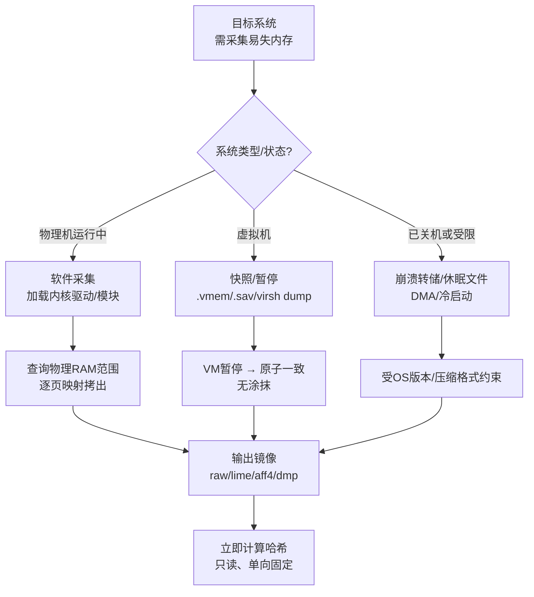
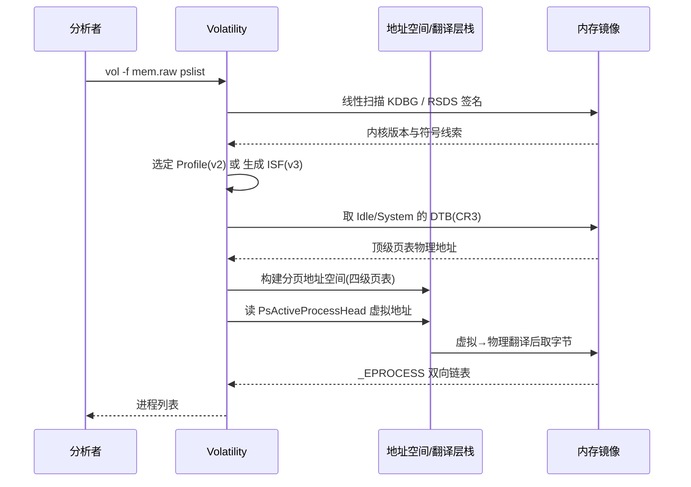
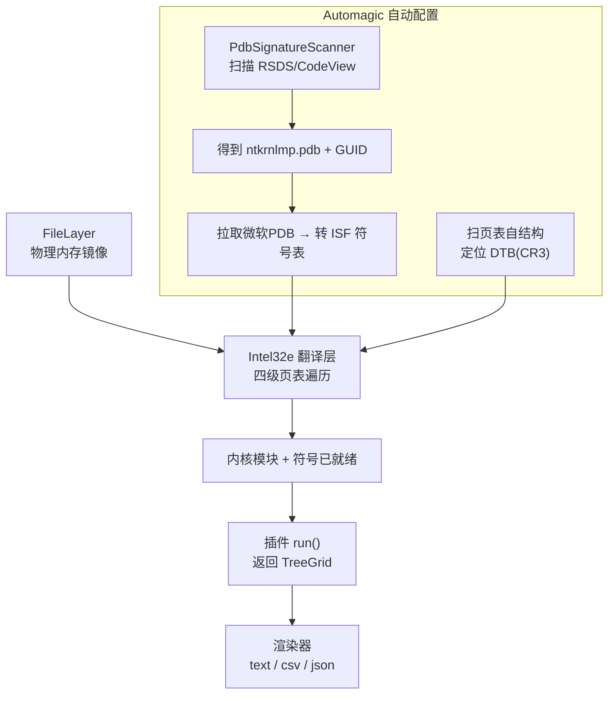

# 数字取证与事件响应（3）· 内存取证：采集与Volatility框架
> [!abstract] TL;DR
> - 内存是易失证据的金矿：解密后的明文、注入代码、无文件恶意体、网络连接、凭据与密钥只在 RAM 里存在，磁盘上要么加密要么根本没有；采集必须遵循「易失性顺序」赶在断电与磁盘镜像之前。
> - 软件采集靠加载内核驱动遍历物理内存范围逐页拷出，天生非原子，会产生「涂抹（smear）」；虚拟机快照因暂停而原子一致，是最干净的来源；崩溃转储/休眠文件/DMA/冷启动是关机或受限场景的补充。
> - Volatility 的核心难题是「自举」——在一坨物理字节里先找到内核结构：定位 DTB(CR3) 建立虚拟→物理翻译，再借 KDBG/符号找到进程链表等锚点。
> - Volatility 2 用 Profile（预生成的 vtype 结构偏移表）+ 手选版本；Volatility 3 改用 ISF 符号表 + Automagic 自动识别，Windows 直接拉取微软 PDB 免选 Profile，Linux/Mac 仍需用 dwarf2json 从内核调试信息自建符号。
> - 插件体系是分层地址空间/翻译层之上的可组合分析单元：v3 插件实现 get_requirements/run 返回 TreeGrid，链表遍历与池标签扫描是两类互补的取证原语。

## 概述与定位

内存取证（Memory Forensics）研究的是一台运行中的计算机在某一时刻 RAM 的完整快照，从这坨看似无序的物理字节里，重建出操作系统当时的活体状态：有哪些进程、谁连接了网络、加载了哪些驱动、内存里藏着什么被解密或被解包的代码。它在整个 DFIR 流程里的位置非常特殊——[[01.DFIR全景与事件响应流程|第 1 篇]]讲的响应流程强调「易失性顺序（Order of Volatility，RFC 3227）」：寄存器/缓存最易失，其次是内存，再往下才是网络状态、磁盘、归档。内存排在磁盘之前，意味着**只要你还想要它，就得在断电、在做[[02.证据保全与取证镜像|磁盘镜像]]之前先把它抓下来**。一旦关机，RAM 内容在几秒到几十秒内衰减殆尽（除非用冷启动手法保温）。

为什么内存值得如此优先？因为大量关键证据**只存在于 RAM，从不落盘或落盘即加密**：全盘加密（BitLocker/LUKS/VeraCrypt）的卷主密钥、TLS 会话密钥、SSH 私钥的解密副本都在内存里明文躺着；无文件（fileless）恶意代码只在内存执行，磁盘上找不到载体；加壳样本在磁盘上是密文，运行时才在内存里解包出真身；LSASS 里缓存着明文/哈希凭据；被 DKOM 从进程链表摘掉的隐藏进程、已退出但内存尚未回收的进程、剪贴板、命令历史、注册表的易失键——这些都是磁盘取证永远拿不到的。可以说，磁盘取证回答「发生过什么」，内存取证回答「此刻正在发生什么、以及攻击者藏了什么」。

本篇聚焦两件事：**如何正确地把内存抓下来（采集）**，以及**分析内存的事实标准框架 Volatility 的内部原理（Profile/符号体系与插件体系）**。至于用具体插件去猎捕进程、还原网络连接、检测代码注入——那是[[04.内存取证实战：进程与网络与注入检测|下一篇]]的实战主题，本篇只把框架的机理讲透，为实战打地基。Volatility 由 AAron Walters 主导、起源于 2007 年的 Volatility Systems，脱胎于更早的 FATKit/Volatools 研究，如今是开源内存取证的通用语言；它有两条并存的代码线——老而弥坚的 Volatility 2 与重写的 Volatility 3，二者在 Profile/符号机制上的根本差异，是理解这个工具的关键，本篇会掰开揉碎讲清。

## 原理与机制

### 物理内存长什么样、为什么采集需要驱动

「采集内存」本质是把整块**物理内存（physical memory）**的内容读出来存成文件。但物理地址空间并不等于「0 到 RAM 大小」的连续区间：其中掺杂着大量**内存映射 I/O（MMIO）**区域——显卡显存、PCI 设备寄存器等被映射进物理地址空间。盲目地从 0 线性读到顶，一旦读到某些设备寄存器，可能触发副作用甚至挂起机器。因此采集工具必须先向内存管理器查询**真实的物理内存范围**（Windows 用 `MmGetPhysicalMemoryRanges`，Linux 读 `/proc/iomem` 里标 "System RAM" 的资源树），只拷贝这些范围，对空洞在 raw 格式里补零。

用户态程序为什么不能直接读物理内存？出于安全，现代系统封死了这条路：Windows 自 Server 2003 SP1/Vista 起，`\Device\PhysicalMemory` 对用户态关闭；Linux 的 `/dev/mem` 在 `CONFIG_STRICT_DEVMEM` 下只允许访问 1MB 以下的设备区，够不到普通 RAM。**所以所有软件采集工具都必须加载一个内核驱动/模块**，在内核态里把每个物理页帧临时映射到内核虚拟地址空间，再拷贝出来。这就是 WinPmem 带着签名驱动 `winpmem_x64.sys`、Linux 用 LiME 内核模块 `insmod` 的根本原因。

### 采集的四条路线



**一是软件采集。** 运行中的物理机最常用，代表工具 Windows 有 WinPmem、DumpIt（Comae，前 MoonSols）、Magnet RAM Capture、Belkasoft RAM Capturer、FTK Imager；Linux 有 LiME、微软的 AVML；macOS 有 osxpmem（但近年 SIP 与内核扩展限制让它日益艰难）。软件采集的最大软肋是**非原子性**——系统在你拷贝的整个过程里仍在飞速运行，稍后详述其后果。

**二是虚拟机快照。** 若目标是虚拟机，直接在宿主层做快照/暂停是最优雅的路线：VMware 暂停后 `.vmem` 就是原始物理内存、`.vmsn` 是快照元数据；VirtualBox 用 `VBoxManage debugvm <vm> dumpvmcore` 导出 ELF core，或 `.sav` 挂起态；Hyper-V 有 `.bin/.vsv`（旧）或 `.vmrs`（新）；KVM/QEMU 用 `virsh dump` 或 QMP 的 `dump-guest-memory`。**因为快照时 VM 被冻结，内存状态是某一瞬间的原子切片，没有涂抹**，是 Volatility 分析最干净的输入。

**三是崩溃转储与休眠文件。** 目标已关机或不便装驱动时，可退而求其次：Windows 完全内存转储（可用 NotMyFault 强制蓝屏，或注册表 `CrashOnCtrlScroll` 触发）落成 `.dmp`，头部有 `PAGEDU64` 魔数与指向 KdDebuggerDataBlock 的指针；休眠文件 `hiberfil.sys` 是 RAM 的 Xpress/Xpress-Huffman 压缩快照，头格式随 Windows 版本变化，Volatility 能解析/转换；页面文件 `pagefile.sys` 不是完整镜像，但保存了被换出的页，可作补充（v3 能把它作为「交换层」叠上来补全被换出的虚拟页）。

**四是硬件与物理手段。** 通过 FireWire/Thunderbolt/PCIe 的 DMA（如 PCILeech、FPGA 设备）绕过操作系统直接读物理内存，但会被 IOMMU/VT-d（若开启）拦截；冷启动攻击（Cold Boot）利用 DRAM 断电后的残留效应，低温保温后重启进最小系统或移植内存条，抢救出密钥。这些手段常用于目标锁屏/不可控的对抗场景。

### 采集的三大陷阱：涂抹、观察者效应、反取证

**涂抹（Page Smear）是软件采集的原罪。** 假设一台 64GB 内存的机器，通过 USB 采集要好几分钟；这几分钟里 OS 调度照跑，页表和内核结构持续变化。若 Volatility 在采集起点 T0 读到某个 PML4 项，而它指向的页帧内容在 Tn 才被写入镜像，指针就「过期」了——翻译出的物理地址要么是垃圾，要么指向已被重分配的内容。更糟的是内核链表（如进程链表）可能在变更的半途被抓下，`Flink/Blink` 指向已释放或已改写的内存，导致插件崩溃或漏报。这就是为什么**能用 VM 快照（原子暂停）就绝不用软件采集，非用不可时也要尽量快、尽量冻结系统**。

**观察者效应（Heisenberg）不可避免。** 采集工具自身要占内存、要加载驱动、要开缓冲区，这些动作必然覆盖掉一部分原始内存。缓解之道是让工具足迹尽量小、从外置介质运行、并在报告里明确记录采集工具与版本，承认这部分「污染」。

**反取证会主动破坏采集。** 恶意代码可以 Hook 采集驱动、用 DKOM 把自己从活动进程链表摘除、检测常见采集工具名，甚至向采集器返回伪造的内存。这提醒我们：单一插件的结果不可全信，实战中要交叉验证（例如链表遍历 vs 池扫描，见下一篇）。

### 镜像格式

采集产物有几种主流格式，各有取舍：**raw/dd/.mem/.vmem** 是扁平物理镜像，物理偏移≈文件偏移，空洞补零，最简单也最大（64GB RAM 就是 64GB 文件）；**LiME 格式**带地址范围头（魔数 `EMiL`），跳过空洞不存零，省空间；**AFF4**（WinPmem 默认）能稀疏存储、压缩（snappy/lz4），还能把内存、页面文件、PDB 符号打包进一个容器；**Windows 崩溃转储**有结构化头与物理内存段描述；**hiberfil.sys** 是压缩的休眠镜像。格式选择直接影响后续能否被 Volatility 直接吃、以及要不要先转换。

## 地址空间、Profile 与符号解析详解

这一段是理解 Volatility「为什么能工作」的核心。给你一个几十 GB 的物理内存文件，它只是一堆字节；要从中读出「进程列表」，工具必须解决三个层层递进的问题：**(1) 怎么把内核用的虚拟地址翻译成文件里的物理偏移？(2) 怎么知道各个内核结构体的字段在哪个偏移？(3) 怎么找到第一个锚点（进程链表头在哪）？** Profile/符号体系与地址空间栈，正是分别回答这三问的机制。

### 分层地址空间：翻译的流水线

Volatility 不把内存镜像当平面来读，而是**堆叠一串地址空间（v2 术语 Address Space）/ 翻译层（v3 术语 Translation Layer）**，像洋葱一样一层套一层：最底层是读文件的物理层（`FileAddressSpace` / `FileLayer`），只按文件偏移取字节；上面叠一个**分页层**（如 v2 的 `WindowsAMD64PagedMemory`、v3 的 `Intel32e`），它实现 x64 四级页表遍历，对外提供「给我虚拟地址、我还你内容」的接口。上层插件只管用虚拟地址，翻译的脏活由这条流水线完成。这种可堆叠设计的妙处在于：换个架构就换个分页层，加个页面文件就再叠一个交换层，物理层甚至可以是被压缩/加密的镜像加一个解压层——**关注点彻底分离**。

### x64 四级页表遍历：软件重现 MMU

CPU 靠 MMU 硬件用 CR3 寄存器指向的页表把虚拟地址翻译成物理地址；内存镜像里 CPU 早已停摆，Volatility 必须**用软件重走这条路**。x64（48 位规范地址）的虚拟地址被切成五段：

```
63          48 47      39 38      30 29      21 20      12 11         0
+-------------+----------+----------+----------+----------+-----------+
|  符号扩展    | PML4 idx | PDPT idx |  PD idx  |  PT idx  |  页内偏移  |
| (须=bit47)  |  9 bits  |  9 bits  |  9 bits  |  9 bits  |  12 bits  |
+-------------+----------+----------+----------+----------+-----------+
   DTB(=CR3) → PML4项 → PDPT项 → PD项 → PT项 → 物理页帧(PFN)<<12 | 偏移
```

翻译分步走：从 **DTB（Directory Table Base，即 CR3 的值，是顶级页表 PML4 的物理地址）** 出发，用 PML4 索引取出一项拿到 PDPT 基址，逐级 PDPT→PD→PT，最后一级 PTE 给出物理页帧号（PFN），左移 12 位加页内偏移即为物理地址。每一级页表项都是 64 位，Volatility 要解析其中的关键位：

```
bit  63   62..52   51.............12   11..9   8   7    6   5   4   3    2    1   0
     NX    保留      物理帧号 PFN         AVL    G   PS   D   A  PCD PWT  U/S  R/W  P
     └不可执行                                     └大页(2MB/1GB)         └用户/内核  └存在
```

其中 **P（Present）位为 0** 表示该页不在物理内存（可能被换出到 pagefile，或从未映射）——这正是「涂抹」和「换出页」造成翻译失败的物理原因；**PS（Page Size）位**表示大页，遍历到 PD 级若 PS=1 则是 2MB 大页、到 PDPT 级 PS=1 则是 1GB 巨页，翻译提前终止。关键点：**每个进程有自己的 DTB（自己的地址空间），内核高半区映射在所有进程间共享**。所以要读某进程的用户态内存，必须用它自己的 DTB；读内核则任意进程的 DTB 皆可。Windows 还用「自引用 PTE」（PML4 第 0x1ED 项指向自身）让内核在固定虚拟地址访问页表本身，Volatility 也借此定位页表。

### 自举难题：先有鸡还是先有蛋

要翻译内核虚拟地址，先得有内核 DTB；可 DTB 本身藏在内核结构里——这是个先有鸡还是先有蛋的自举问题。Volatility 的破局办法是**扫描签名**：先在物理内存里线性扫特征，找到 KPCR（每 CPU 的处理器控制区）或 KDBG（`_KDDEBUGGER_DATA64`，即 KdDebuggerDataBlock，带 "KDBG" 特征），或直接从 Idle/System 进程（PID 0）的 `_EPROCESS.Pcb.DirectoryTableBase` 里取内核 DTB。拿到 DTB 建好分页层后，再从 KDBG 里读出 `PsActiveProcessHead`（活动进程链表头的虚拟地址）、`PsLoadedModuleList`（驱动链表）等一系列锚点，顺藤摸瓜遍历整个系统。



值得一提：新版 Windows 把 KdDebuggerDataBlock **加密**了（`nt!KdpDataBlockEncoded=1`，块内容被异或编码），`kdbgscan` 找到后还得用 KdCopyDataBlock 的密钥解码——Volatility 内部已处理。这也是 Volatility 3 逐步弱化对 KDBG 依赖、转向直接用符号的动因之一。

### Profile（v2）：预编译的结构偏移表

第二问「字段在哪个偏移」由 **Profile** 回答。`_EPROCESS.UniqueProcessId` 在 Win7x64 里可能在偏移 0x180，换个版本就变了——结构体布局随 OS 版本、Service Pack、架构而异。Volatility 无法在运行时读 PDB，于是把每个 OS 版本的结构布局**预先提取成 vtype（一个巨大的 Python 字典，记录每个成员的偏移与类型）**，连同符号地址打包成 Profile，如 `Win7SP1x64`、`Win10x64_19041`。分析时把 vtype「套」在内存字节上，就把裸字节实例化成有字段的对象。

Windows 的 Profile 由 Volatility 官方预置了几十个，用户 `imageinfo`/`kdbgscan` 探测后手动 `--profile=` 指定。**但 Linux/Mac 的 Profile 必须自己现场编译**：因为 Linux 内核结构随每次编译（版本、config、编译器）而变，没有通用预置。做法是进 `tools/linux` 目录 `make`，用当前内核头编译出 `module.dwarf`（DWARF 调试类型信息），再把它和 `/boot/System.map-$(uname -r)`（符号地址表）一起 `zip` 成 Profile 丢进 overlays 目录。**痛点在于必须在与目标内核完全一致的系统上构建**——事后取证时若原机已毁，凑不出一致内核就束手无策，这是 v2 时代 Linux 内存取证最大的门槛。

### ISF 符号表与 Automagic（v3）：把手动变自动

Volatility 3 的重写（2019–2020，配合 Python 2 于 2020 年 1 月 EOL）根本目标就是干掉手选 Profile。它把 Profile 换成 **ISF（Intermediate Symbol Format）**——一份 JSON（可 xz 压缩），含 `symbols`（名字→地址）、`user_types/base_types/enums`（结构布局）、`metadata`。ISF 从调试信息生成：Windows 从 PDB、Linux/Mac 从 DWARF，转换工具是 Go 写的 **dwarf2json**（也能转 PDB）。

关键洞见让 Windows 分析彻底自动化：**Windows 内核 PDB 是公开的，躺在微软符号服务器上**。Volatility 3 从内存镜像里读出内核模块的 CodeView/RSDS 调试记录（含 `ntkrnlmp.pdb` 名 + GUID + age），据此自动去微软符号服务器拉对应 PDB 转成 ISF——**于是 Windows 完全不用手选 Profile**。这套自动配置的魔法叫 **Automagic**：一组自动化类先用 `PdbSignatureScanner` 扫 RSDS 签名定位内核与符号、再扫页表自结构定位 DTB、拼好翻译层栈，全程无需人工。Linux/Mac 仍需你用 dwarf2json 从内核的 vmlinux 调试信息或调试包自建 ISF（v3 靠内核 banner 字符串 "Linux version ..." 匹配正确的符号表），但比 v2 的现场编译门槛低、可复用。



一句话对比：**v2 = 预编译结构表 + 人肉选版本，稳定但 Linux 现场编译痛苦、Win10 后 KDBG 加密渐吃力；v3 = 运行时符号解析 + Automagic 自动识别，Windows 免选 Profile、Linux 靠 banner+dwarf2json，代价是首次分析可能要联网拉 PDB。** 二者代码线目前并存，老镜像/老 Profile 生态在 v2，新分析优先 v3。

## 工具视角与实战

### 采集：几条常用命令

采集的第一要务是**先固定证据**——采完立刻算哈希、只读保存。以下命令展示各平台主力工具：

```bash
# Windows —— WinPmem 输出 AFF4（可稀疏/压缩，能同时纳入分页文件与符号）
winpmem_mini_x64.exe -o mem.aff4
winpmem_mini_x64.exe --format raw -o mem.raw     # 需要扁平 raw 时

# Windows —— DumpIt 一键采集（可输出 raw 或微软崩溃转储格式）
DumpIt.exe /OUTPUT mem.dmp

# Linux —— LiME 内核模块（format 可选 raw/padded/lime）
sudo insmod lime.ko "path=/tmp/mem.lime format=lime"

# Linux —— AVML（微软，免编译模块、跨内核、自带压缩，云主机友好）
sudo ./avml /tmp/mem.compressed

# 采集后立即单向固定
sha256sum /tmp/mem.lime > /tmp/mem.lime.sha256
```

AVML 值得单独一提：它不装内核模块，而是智能地依次尝试 `/proc/kcore`、`/dev/crash`、`/dev/mem` 等来源读内存，因此**在不能编译模块的云主机上也能跑**，Azure 事件响应里很常见。VM 场景则优先宿主快照，前文已述。

### Volatility 2 vs 3：命令风格

```bash
# Volatility 2（Python2，需探测并指定 profile）
vol.py -f mem.raw imageinfo                       # 建议 profile（慢）
vol.py -f mem.raw kdbgscan                         # 更可靠地确认 KDBG/profile
vol.py -f mem.raw --profile=Win7SP1x64 pslist      # 用链表遍历列进程

# Volatility 3（Python3，自动识别，无需 profile）
vol3 -f mem.raw windows.info                        # 内核基址/DTB/版本/符号
vol3 -f mem.raw windows.pslist
vol3 -f mem.raw -o ./out windows.pslist --dump      # 落地进程可执行体
```

直观差异：v2 每条命令都要背 profile 名，`imageinfo` 还慢；v3 一个 `windows.info` 自动搞定环境识别，插件名走 `os.plugin` 的命名空间（`windows.` / `linux.` / `mac.`）。若要解析被换出的页，v3 能把 `pagefile.sys` 作为交换层叠进层栈，补全那些 P 位为 0 的虚拟页——这是 v2 难以做到的。

### 插件体系：可组合的分析单元

插件是 Volatility 的灵魂。**框架把「怎么翻译地址、怎么套结构」做成基础设施，插件只专注一件取证任务**，因而社区能贡献海量插件（早年的年度插件大赛极大丰富了生态）。v3 插件的骨架清晰到可以背下来：实现类方法 `get_requirements()` 声明需要什么（内核模块、翻译层、符号表、PID 参数等），`run()` 返回一个 `TreeGrid`（列定义 + 生成器），由可插拔渲染器输出成 text/csv/json：

```python
from volatility3.framework import interfaces, renderers
from volatility3.framework.configuration import requirements

class HelloPids(interfaces.plugins.PluginInterface):
    @classmethod
    def get_requirements(cls):
        return [requirements.ModuleRequirement(
            name="kernel", description="Windows kernel",
            architectures=["Intel32", "Intel64"])]

    def _generator(self):
        kernel = self.context.modules[self.config["kernel"]]
        # 从 PsActiveProcessHead 遍历 _EPROCESS 双向链表 ...
        for proc in kernel.object_from_symbol("PsActiveProcessHead") ...:
            yield (0, (int(proc.UniqueProcessId),
                       proc.ImageFileName.cast("string", max_length=15)))

    def run(self):
        return renderers.TreeGrid([("PID", int), ("Name", str)],
                                  self._generator())
```

v2 的插件则是继承 `commands.Command`，`calculate()` 干活并 `yield` 数据、`render_text()` 输出，结构类似但更松散。理解插件体系，关键是掌握两类**取证原语**，它们贯穿所有分析：**链表遍历（list-walking）**顺着内核维护的双向链表走（如 `pslist` 走 `PsActiveProcessHead`），快但**能被 DKOM 摘链欺骗**；**池标签扫描（pool tag scanning）**在物理内存里暴力扫内核分配的池标签（进程是 `Proc`、线程 `Thre`、文件 `File` 等，`ExAllocatePoolWithTag` 打的四字节标签，前面是 `_POOL_HEADER`），再启发式校验结构（如 `psscan`），**能挖出被摘链的隐藏进程、乃至已退出但池未回收的进程**，代价是可能误报、且 Win10 的段堆/大页池改动让它更难。这一「遍历 vs 扫描」的对抗，正是[[04.内存取证实战：进程与网络与注入检测|下一篇]]猎捕隐藏进程、还原网络、检测注入的核心武器，本篇只点明其框架机理。

### 格式转换与叠层

实战常需转换：v2 的 `imagecopy` 能把崩溃转储/休眠文件转成 raw；`hibinfo`/`crashinfo` 查看头信息。遇到 AFF4/LiME 直接喂给 Volatility 即可（它认这些格式）。多来源时（内存 + pagefile）叠层分析能显著提高被换出数据的可读性。

## 安全性与正确使用

内存取证的「安全性」有两层含义：一是**它作为证据的可靠与合规**，二是**采集动作本身对目标系统的风险**，两者都必须敬畏。

**证据完整性与保管链。** 采集完必须**立刻对镜像计算哈希（SHA-256）并只读保存**，任何后续分析都在副本上做，原始镜像单向固定、纳入[[02.证据保全与取证镜像|保管链]]。要在采集记录里如实写明：采集工具与版本、时间、操作者、目标系统状态——因为软件采集非原子、有观察者效应，这些「污染」必须被披露而非掩盖，否则证据在法庭上会被质疑。

**采集动作的风险不可低估。** 在生产系统上加载内核驱动有让机器蓝屏/宕机的真实风险；驱动必须签名，否则在开启强制签名的系统上根本装不上；采集器自身的内存足迹会覆盖原始数据，选足迹小、从外置介质运行的工具。DMA/冷启动等硬件手段更可能损坏或改变系统状态，仅在授权、可控、目标不可交互的场景审慎使用。

**隐私与法律边界。** RAM 快照几乎包含目标此刻的一切——明文密码、私钥、TLS 会话密钥、他人的邮件与聊天、全盘加密卷主密钥、PII。这意味着一份内存镜像是**极高敏感度的资产**：必须在明确的授权范围（搜查令/事件响应授权书划定的范围）内采集，加密存储、严格访问控制、按规定期限销毁。「能从内存里恢复 BitLocker/LUKS 密钥」是强大的取证能力，也是必须被授权约束的能力，误用即越界。

**分析结论的可信度。** 反取证是真实威胁：DKOM 摘链、Hook 采集驱动、伪造内存都可能让单一插件说谎。正确姿势是**交叉验证**——链表遍历与池扫描对照、多个独立信号互印，任何异常都存疑复核。

**符号来源的信任。** Volatility 3 会自动从微软符号服务器拉 PDB——这在隔离取证网里意味着要预先离线准备符号包，也意味着要意识到这条「联网拉取」的供应链：确认符号来源可信、必要时用官方 Volatility 符号包离线部署，避免分析环境因联网被污染或泄露「你正在分析哪台机器」的元数据。

## 小结

内存取证的价值在于捕获只存在于 RAM 的活体证据，因而必须遵循易失性顺序、赶在断电与磁盘镜像之前采集。采集有软件（加载内核驱动逐页拷贝，非原子、有涂抹与观察者效应）、虚拟机快照（原子一致、最干净）、崩溃/休眠文件、DMA/冷启动四条路线，产物有 raw/LiME/AFF4/崩溃转储等格式，采后须立即哈希固定。Volatility 的精髓是解决自举难题：靠堆叠的地址空间/翻译层用软件重走四级页表把虚拟地址翻成物理偏移，靠扫描签名定位 DTB 与 KDBG/符号锚点。Profile（v2 预编译结构表 + 手选版本，Linux 需现场编译）与 ISF 符号表 + Automagic（v3 运行时符号解析，Windows 自动拉 PDB 免选 Profile，Linux 靠 banner+dwarf2json）是两代框架的分水岭。插件体系把翻译与结构套用做成基础设施，插件专注单一任务并可组合，链表遍历与池标签扫描是贯穿始终的两类取证原语——它们如何被用来猎捕进程、还原网络、检测注入，是下一篇的实战主题。

## 相关阅读

- 官方文档与工具：[Volatility 3 官方文档](https://volatility3.readthedocs.io/) · [Volatility Foundation](https://www.volatilityfoundation.org/) · [LiME（Linux Memory Extractor）](https://github.com/504ensicsLabs/LiME) · [AVML（微软）](https://github.com/microsoft/avml) · [dwarf2json](https://github.com/volatilityfoundation/dwarf2json)
- 规范与书目：RFC 3227《证据收集与归档准则（易失性顺序）》 · 《The Art of Memory Forensics》（Ligh、Case、Levy、Walters 著）——内存取证的权威教材
- 本系列：[[00.数字取证与事件响应总览|⬆ 系列总览]] · [[01.DFIR全景与事件响应流程]] · [[02.证据保全与取证镜像]] · [[04.内存取证实战：进程与网络与注入检测]]
- 恶意上游（内存里被检测的对象）：[[50.恶意代码分析与免杀对抗/08.持久化技术大全]] · [[50.恶意代码分析与免杀对抗/06.进程注入技术全谱]]
- 网络呼应：[[72.抓包与协议分析实战/19.网络取证与流重组]]
- 硬件取证呼应（芯片级采集）：[[39.固件与IoT嵌入式逆向/22.eMMC与NAND芯片级取证]]
- 内核痕迹（反取证/隐藏）：[[38.Windows内核与驱动逆向/11.Rootkit原理与检测]]

[[00.数字取证与事件响应总览|⬆ 系列总览]] | [[02.证据保全与取证镜像|← 上一章]] | [[04.内存取证实战：进程与网络与注入检测|→ 下一章]]
