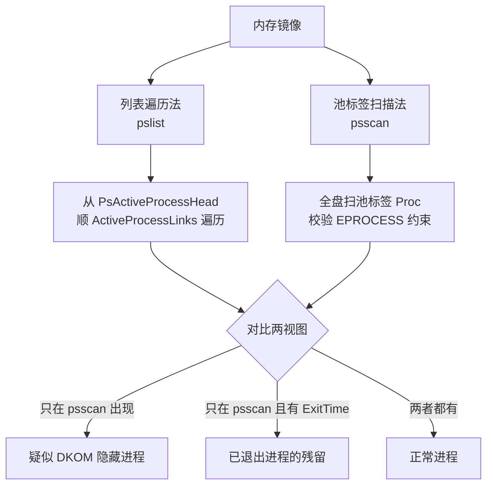
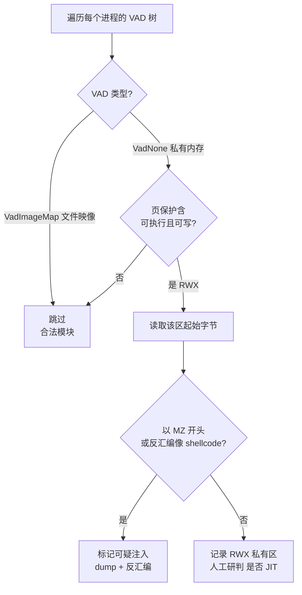
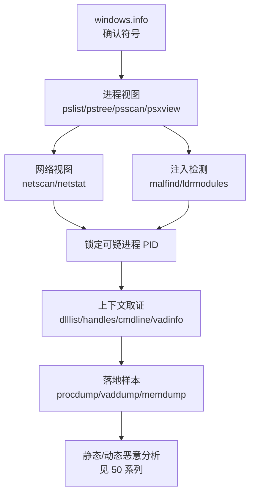

# 数字取证与事件响应（4）· 内存取证实战：进程与网络与注入检测
> [!abstract] TL;DR
> - 内存取证进程分析的本质是「列表遍历 vs 池标签扫描」两条相互独立的证据链交叉比对：`pslist` 走 `ActiveProcessLinks` 双向链，`psscan` 全盘扫池标签，两个视图的差异就是隐藏进程信号。
> - DKOM 摘除 `ActiveProcessLinks` 能让进程从 `pslist` 消失，但线程仍挂在调度器就绪链里照常运行；`psxview` 用 7 路独立证据源交叉验证，击穿这种「摘链隐身」。
> - `netscan` 靠池标签扫描 `tcpip.sys` 的 `_TCP_ENDPOINT`/`_UDP_ENDPOINT`，连已关闭的连接残留都能捞回来，是网络 IOC 的富矿；`netstat` 走哈希表更精确但只见活动连接。
> - `malfind` 遍历 VAD 树，锁定「私有内存 + 可执行可写 + 带 PE 头/shellcode」的异常区，是反射式注入与 shellcode 落地的照妖镜；.NET/JVM/浏览器的 JIT 是最大误报源。
> - `ldrmodules` 用 PEB 三条模块链与 VAD 交叉比对，揪出手动映射、从加载器链上摘除的隐藏 DLL；进程镂空则看主模块 VAD 是否被私有内存顶替。
> - 一切结论以「多源交叉 + 落地样本复核」为准，任何单一插件的输出都不能当作定论。

## 概述与定位

上一章（[[03.内存取证：采集与Volatility框架|采集与 Volatility 框架]]）解决的是「怎么把易失内存固定成镜像、怎么让分析框架认出这份镜像的操作系统符号」。本章接着往下走：镜像在手、符号已定，如何真正地从这团几个 GB 的字节里，把「谁在运行、谁在联网、谁被注入了外来代码」这三件应急响应最关心的事查清楚。这一章是整个内存取证系列的「实战核心」，对应到 Volatility 的三组主力插件：进程视图（`pslist`/`pstree`/`psscan`/`psxview`）、网络视图（`netscan`/`netstat`）、注入检测（`malfind`/`ldrmodules`/`vadinfo`）。

为什么内存取证能看见磁盘取证看不见的东西？因为很多现代恶意代码的核心逻辑根本不落盘，或者落盘的是加密壳、真正解密后的载荷只存在于内存。无文件攻击（fileless）、反射式 DLL 注入、进程镂空（process hollowing）、纯 shellcode 驻留，这些手法在磁盘上要么没有痕迹、要么只是一段无意义的加密数据，唯有在内存里才能看到解密后的真身、已建立的网络连接、注入到宿主进程的可执行页。这就是内存取证不可替代的价值。

需要先划清与相邻篇目的边界，避免读者产生「这里没讲全」的错觉：**采集手段与框架安装**属于上一章；**DKOM/Rootkit 的内核级原理与更深的隐藏对抗**归 [[13.恶意持久化与Rootkit取证|第 13 章]] 和 [[38.Windows内核与驱动逆向/11.Rootkit原理与检测|内核 Rootkit 检测]]；**网络流量层面的重组与协议还原**属于 [[72.抓包与协议分析实战/19.网络取证与流重组|网络取证与流重组]]。本章只聚焦「用内存镜像做进程/网络/注入三件事的落地方法」，会点到 DKOM 但不深挖内核实现，会看网络连接对象但不做流重组。至于注入与持久化的攻击方视角，则对应上游的 [[50.恶意代码分析与免杀对抗/06.进程注入技术全谱|进程注入技术全谱]] 与 [[50.恶意代码分析与免杀对抗/08.持久化技术大全|持久化技术大全]]——本章是「防守方如何从内存里把这些技术检测出来」。

一句话定位：**攻击方在内存里布下的每一处异常，都会在某个内核数据结构上留下与「正常状态」不一致的偏差；内存取证的方法论，就是用多条相互独立、攻击方难以同时篡改的证据链，把这些偏差交叉暴露出来。**

## 原理与机制

### 进程为什么能被「列表遍历」到，也能被「扫描」到

Windows 内核用 `_EPROCESS` 结构体表示一个进程。系统维护一条以 `PsActiveProcessHead` 为锚点的**双向循环链表**，每个 `_EPROCESS` 通过内部的 `ActiveProcessLinks`（一个 `_LIST_ENTRY`，含 `Flink`/`Blink` 两个指针）串在链上。任务管理器、`tasklist`、以及 Volatility 的 `pslist`，本质都是「从 `PsActiveProcessHead` 出发，顺着 `Flink` 一路走到底」——这叫**列表遍历法**。

```
_EPROCESS（Win10 x64，偏移随版本/补丁浮动，仅示意）:
  +0x000 Pcb               : _KPROCESS      // 内含 DirectoryTableBase(CR3/DTB)
  +0x2e0 UniqueProcessId   : Ptr64          // PID
  +0x2e8 ActiveProcessLinks: _LIST_ENTRY    // Flink/Blink —— pslist 遍历它
  +0x3d8 Peb               : Ptr64          // 指向用户态 PEB（模块表/命令行都挂这）
  +0x448 ImageFileName     : UChar[15]      // 进程短名，超过 15 字节被截断
  +0x…   ThreadListHead    : _LIST_ENTRY    // 本进程的线程链
  +0x…   InheritedFromUniqueProcessId       // 父进程 PID（pstree 靠它建树）
  +0x…   ExitTime          : _LARGE_INTEGER // 非零表示已退出
```

关键洞察在于 `DirectoryTableBase`（DTB，即该进程的页目录基址、x64 上是 CR3/PML4 物理地址）。Volatility 拿到某个 `_EPROCESS` 的 DTB，就能重建该进程的完整虚拟地址空间——这是后面 `malfind`、`vaddump`、`memdump` 能按进程读取内存的地基。

但双向链表有个致命弱点：**它是可写的普通内核数据结构，没有硬件保护**。内核态代码（Rootkit、恶意驱动）可以直接改写某个 `_EPROCESS` 前后节点的指针，把自己从链上「摘」下来——这就是 DKOM（Direct Kernel Object Manipulation，直接内核对象操纵）。

```
// DKOM 摘链（内核态执行）：把目标进程 T 从活动进程链摘除
T.ActiveProcessLinks.Blink->Flink = T.ActiveProcessLinks.Flink;
T.ActiveProcessLinks.Flink->Blink = T.ActiveProcessLinks.Blink;
// 效果：pslist 从 PsActiveProcessHead 遍历时直接跳过 T，T 从任务管理器消失
```

这里藏着一个反直觉却极其重要的事实：**Windows 调度器调度的是线程（`_ETHREAD`/`_KTHREAD`），不是进程**。线程挂在调度器的就绪/等待队列（`KiDispatcherReadyListHead` 等）上，跟 `ActiveProcessLinks` 完全是两套链。所以把进程从活动进程链摘掉，它的线程照样被调度、代码照样运行、网络照样收发——**进程「隐身」了但没「停摆」**。这正是 DKOM 隐藏进程之所以既有效又难防的根源。

那防守方怎么办？答案是**池标签扫描法**（pool tag scanning）。内核对象是从内核池（pool）里分配的，每块池内存前面有个 `_POOL_HEADER`，里面记着 4 字节的**池标签**（`_EPROCESS` 对象的标签通常是 `Proc`）。`psscan` 不走任何链表，而是把整个物理内存当成字节流，逐块扫描「池标签 == Proc 且后续结构满足 `_EPROCESS` 约束（PID 合理、DTB 对齐、时间戳可信……）」的内存块。DKOM 只改了链表指针，**并没有、也无法轻易抹掉每个进程对象自身的池头标签**（那样会破坏内存管理），所以摘链隐藏的进程逃得过 `pslist`，逃不过 `psscan`。

**列表遍历 vs 池标签扫描，是内存取证最底层的方法论二元对立**：前者快、准、语义清晰，但信任了可被篡改的链表；后者慢、可能有误报（扫到已释放但未被覆盖的旧对象），但绕开了链表信任、能挖出隐藏与残留。两者交叉比对，才是硬道理。



### 网络连接为什么能从内存里捞出来

同样的二元对立延续到网络。Windows 的 TCP/IP 栈在 `tcpip.sys` 里维护连接状态：每条 TCP 连接对应一个 `_TCP_ENDPOINT` 对象，每个监听端口对应一个 `_TCP_LISTENER`，每个 UDP 绑定对应一个 `_UDP_ENDPOINT`。这些对象同样从内核池分配、同样带池标签（Vista 及以后：`TcpE`/`TcpL`/`UdpA`，另有 `TWTC` 表示 TIME_WAIT）。

`netscan` 走的是池扫描路线：全盘找这几个标签、校验结构、还原出「本地地址:端口 ↔ 远端地址:端口、状态、属主 PID、进程名、创建时间」。它的杀手锏是**能捞回已经关闭、但池内存尚未被覆盖的连接残留**——恶意程序连过的 C2 地址，哪怕连接早断了，只要那块池没被重新分配，`netscan` 就能挖出来，这对复盘攻击时间线极为关键。

对比之下，Volatility 3 的 `netstat` 走的是「像 live `netstat` 一样遍历 `tcpip.sys` 的分区表/哈希表」路线，只能看到当前活动连接，但更精确、误报更少。二者关系与 `pslist` 对 `psscan` 完全同构：一个走结构化链表求准，一个扫池标签求全。

要特别提醒的版本差异：**XP/2003 与 Vista+ 的网络结构完全不同**。老系统用 `_TCPT_OBJECT`（标签 `TCPT`）和 `_ADDRESS_OBJECT`（标签 `AddrObj`），对应 Volatility 2 的 `connections`/`connscan`/`sockets`/`sockscan` 四个老插件；Vista 之后才是 `netscan` 统一处理。分析老镜像时选错插件会直接扫不到东西。

### 注入为什么会在 VAD 上露馅

每个进程的虚拟地址空间由一棵 **VAD 树**（Virtual Address Descriptor，虚拟地址描述符）描述——这是一棵自平衡二叉树（AVL 树），每个节点 `_MMVAD` 描述一段连续虚拟地址区间 `[StartingVpn, EndingVpn]`、它的内存类型和页保护属性。VAD 是理解注入检测的钥匙。

核心区别在于 VAD 的 `VadType`：
- **`VadImageMap`（映像映射）**：这段内存是某个磁盘上的 PE 文件（EXE/DLL）被映射进来的。合法加载的模块都是这一类，其可执行页来自 PE 的 `.text` 节，保护通常是 `PAGE_EXECUTE_WRITECOPY`（写时复制），并且**在 VAD 里能查到对应的文件对象和路径**。
- **`VadNone`（私有内存）**：`VirtualAlloc` 分配出来的匿名内存，不对应任何磁盘文件。

正常程序的可执行代码几乎总是来自 `VadImageMap`；而注入进来的 shellcode、反射式 DLL、解密后的载荷，是攻击方 `VirtualAllocEx` 出来的**私有内存**，为了能写入又能执行，往往被设成 `PAGE_EXECUTE_READWRITE`（RWX）。「私有内存 + 可执行 + 可写」这个组合，在正常程序里是罕见的（合法代码不需要自改写、数据不需要可执行，W^X 原则），一旦出现就是强烈的注入信号。`malfind` 检测的正是这个偏差。

## 内核对象与检测算法详解

这一段把三类检测的算法内核拆开讲透——读者理解了算法，才能看懂插件输出、才能判断误报、才能在插件失灵时手工验证。

### psxview：7 路证据源交叉验证

`pslist` 对 `psscan` 只是「两路对比」，一个更强的武器是 `psxview`——它同时从**七个相互独立的证据源**收集进程信息，然后横向拉平成一张表。攻击方要想彻底隐身，得同时篡改这七处，难度呈指数上升。七路是：

1. **pslist**：`ActiveProcessLinks` 活动进程链（最容易被 DKOM 摘）。
2. **psscan**：`Proc` 池标签扫描（DKOM 摘链影响不到它）。
3. **thrdproc**：扫描 `_ETHREAD` 池对象（标签 `Thre`），每个线程都记着自己所属的进程——**只要进程还在跑，就必然有线程，就必然被 thrdproc 找到**。这是击穿「运行中的隐藏进程」最有力的一路。
4. **pspcid**：遍历 `PspCidTable`（PID/句柄到对象的全局映射表），进程创建时会在这注册。
5. **csrss**：`csrss.exe` 为它服务的每个进程持有句柄，遍历 csrss 的句柄表能反查进程。
6. **session**：会话空间（`_MM_SESSION_SPACE`）的进程链。
7. **deskthrd**：桌面堆里被引用的线程，反查其进程。

判读逻辑：某进程若**七路全 True**，正常；若**在 pslist 为 False 但在 psscan/thrdproc/pspcid 为 True**，就是典型的 DKOM 摘链隐藏——它还在跑（thrdproc 抓到线程）、对象还在（psscan 抓到）、只是从可见链上被摘了。反过来，只在 psscan 为 True 且带 `ExitTime`、其余全 False，多半是已退出进程的池残留，不是隐藏。

必须知道的陷阱：**几路证据源天生就对某些进程「缺席」，这是正常的，不能一律当隐藏**。比如 `csrss` 不持有指向它自己、`smss.exe`、以及 System/Idle 的句柄；System 进程没有常规意义上的 deskthrd 记录。Volatility 2 的 `psxview -R`（apply rules）会内置这些已知例外来压误报。不懂这些规则，就会把系统正常进程误报成 Rootkit。

### malfind：VAD 遍历 + 保护位 + PE 特征

`malfind` 的算法可以一步步复述清楚，不看代码也能懂：

1. 对每个进程，遍历它的整棵 VAD 树。
2. 对每个 VAD 节点，先看类型：是 `VadImageMap`（文件映像）就跳过——合法模块不是它的目标。
3. 对 `VadNone`（私有内存）节点，检查页保护：只盯**同时可执行又可写**的（`PAGE_EXECUTE_READWRITE` 是最典型的，`PAGE_EXECUTE_WRITECOPY` 在私有区也可疑）。
4. 命中后，读取该区起始的若干字节，做两件事：看是不是以 `MZ`（`4D 5A`，PE 文件头魔数）开头——那意味着有人往私有 RWX 内存里塞了一个完整 PE（反射式 DLL/手动映射的强证据）；再把开头字节反汇编，看是不是像有意义的 shellcode（合法的 push/mov/call 序列，而非全 0 或乱码）。
5. 命中项 dump 出来 + 反汇编展示，交给分析师研判。

`malfind` 的强项是**反射式 DLL 注入**和**纯 shellcode 驻留**：这两者的本质就是「私有 RWX 内存里放可执行代码」，正中算法要害。它的软肋是**进程镂空**——镂空是把主模块本身替换掉，主模块 VAD 可能仍是 `VadImageMap` 或被改成私有映射，需要配合「主模块内存镜像与磁盘文件比对」才能确认，`malfind` 未必直接命中。

**误报是 malfind 绕不开的现实**：.NET CLR、JVM、V8（浏览器/Node）这些 JIT 引擎，天然需要「运行时生成机器码再执行」，会合法地分配大量 RWX 私有内存。所以在装了浏览器、跑着 .NET 服务的机器上，`malfind` 动辄几十上百条命中，**绝大多数是 JIT 的正常行为**。判读的关键是：看命中进程是不是本就该有 JIT（`chrome.exe`/`w3wp.exe`/`java.exe` 的 RWX 很正常，`notepad.exe`/`svchost.exe` 里冒出 RWX + shellcode 就极可疑），看内容是不是真的像恶意载荷，再结合父子关系、命令行、网络连接综合定性。



### ldrmodules：PEB 三链与 VAD 的交叉比对

DLL 层面也有一套「摘链隐藏」，`ldrmodules` 专治此症。用户态的 PEB（进程环境块）里有个 `Ldr` 结构，维护着**三条模块链表**，分别按不同顺序串起本进程加载的所有模块：

- `InLoadOrderModuleList`（按加载顺序）
- `InMemoryOrderModuleList`（按内存地址顺序）
- `InInitializationOrderModuleList`（按初始化顺序）

一个用 `LoadLibrary` 正常加载的 DLL，会**同时出现在这三条链里，并且在 VAD 树里有对应的 `VadImageMap` 映像**。`ldrmodules` 把「VAD 里的映像映射」和「PEB 三条链」做交叉：

- 三链齐全 + VAD 有映像 → 正常。
- **VAD 里有映像，但 PEB 某条/某几条链里没有** → 有人手动从加载器链上摘除了这个模块（用户态版 DKOM），想让 `dlllist`（`dlllist` 就是读 PEB 链）看不见它。这是隐藏 DLL 的典型手法。
- **反射式/手动映射的 DLL**：压根没调 `LdrLoadDll`，三条 PEB 链里都没有它；如果攻击方是以 `SEC_IMAGE` 方式映射，VAD 里可能有映像但无正常路径，或干脆是私有内存（那就该 `malfind` 出手了）。

`ldrmodules` 输出里的 `InLoad`/`InInit`/`InMem` 三个布尔列，就是这三条链的命中情况。三列有 False 而 VAD 有映像，就是重点嫌疑。这再次印证全章主线：**攻击方篡改的是「某一条可见链」，防守方的活儿就是找一条它没篡改到的独立证据链来对质。**

### 注入手法与检测插件的对应关系

把上游 [[50.恶意代码分析与免杀对抗/06.进程注入技术全谱|进程注入技术全谱]] 的攻击手法，映射到本章的检测抓手：

- **经典 DLL 注入**（`CreateRemoteThread` + `LoadLibrary`）：DLL 在 PEB 链里正常可见，靠 `dlllist` 看到「不该出现在此进程的 DLL」+ 可疑远程线程识别。
- **反射式 DLL 注入 / 手动映射**：PEB 三链缺席（`ldrmodules`）+ 私有 RWX 带 PE 头（`malfind`）。
- **进程镂空（Process Hollowing / RunPE）**：主模块内存镜像与磁盘文件不一致、或主模块 VAD 被私有内存顶替；需 `procdump` 落地后与磁盘原文件比对。
- **纯 shellcode 注入 / APC 注入落点**：私有 RWX + shellcode（`malfind`）。
- **线程劫持（`SetThreadContext`）**：线程的 `Win32StartAddress` 指向不属于任何已知模块的地址区——用 `threads`/`thrdscan` 看线程起始地址落在哪个 VAD。
- **Doppelgänging/Herpaderping/Ghosting**：磁盘文件已被改写或删除，**内存里的镜像才是权威真身**——这正是内存取证相对磁盘取证的降维优势。

## 工具视角与实战

### Volatility 2 与 Volatility 3 命令对照

Volatility 2（Python 2、基于 profile）与 Volatility 3（Python 3、基于 PDB 符号/ISF）插件命名不同，实战中两版都会遇到（很多老 writeup、老靶场基于 v2）。核心对照如下：

```
功能            Volatility 2                     Volatility 3
进程链表        --profile=<X> pslist             windows.pslist
进程树          pstree                           windows.pstree
进程池扫描      psscan                           windows.psscan
进程交叉视图    psxview                          windows.psxview
网络（池扫描）  netscan                          windows.netscan
网络（哈希表）  —（XP用connscan/sockscan）       windows.netstat
注入检测        malfind                          windows.malfind
模块链交叉      ldrmodules                       windows.ldrmodules
DLL 列表        dlllist                          windows.dlllist
句柄            handles                          windows.handles
命令行          cmdline                          windows.cmdline
VAD 信息        vadinfo / vaddump                windows.vadinfo / windows.vadwalk
进程转储        procdump / memdump               windows.pslist --dump / windows.memmap --dump
```

一个关键差异：**Volatility 2 需要 `imageinfo`/`kdbgscan` 先猜 profile 再手动 `--profile=` 指定**；**Volatility 3 不用 profile，靠自动匹配 PDB 符号（ISF 文件）**，省心但依赖符号库联网或本地缓存齐全（这属于上一章框架配置的范畴）。下文命令以 Volatility 3 语法为主，v2 读者按上表平移即可。

### 一次典型内存取证的操作流

不要拿到镜像就一头扎进 `malfind`。正确的顺序是「先全局进程/网络视图，锁定嫌疑，再对嫌疑进程深挖上下文，最后落地样本」：

```bash
# 0) 环境/符号确认（详见上一章）
vol.py -f mem.raw windows.info

# 1) 进程全景：先看正常态，建立基线直觉
vol.py -f mem.raw windows.pslist
vol.py -f mem.raw windows.pstree          # 看父子关系：谁 spawn 了谁
vol.py -f mem.raw windows.psscan          # 池扫描，找摘链/残留
vol.py -f mem.raw windows.psxview         # 7 路交叉，锁定隐藏

# 2) 网络全景：找外联、找可疑端口、找 C2 残留
vol.py -f mem.raw windows.netscan
vol.py -f mem.raw windows.netstat

# 3) 注入检测：全局扫一遍，再针对可疑 PID 精查
vol.py -f mem.raw windows.malfind
vol.py -f mem.raw windows.malfind --pid 1337
vol.py -f mem.raw windows.ldrmodules --pid 1337

# 4) 对锁定进程做上下文取证
vol.py -f mem.raw windows.cmdline --pid 1337     # 命令行参数
vol.py -f mem.raw windows.dlllist --pid 1337     # 加载了哪些模块
vol.py -f mem.raw windows.handles --pid 1337     # 文件/注册表/互斥体句柄
vol.py -f mem.raw windows.vadinfo --pid 1337     # VAD 保护/类型细节

# 5) 落地样本，交给恶意分析
vol.py -f mem.raw -o ./out windows.malfind --pid 1337 --dump
vol.py -f mem.raw -o ./out windows.pslist --pid 1337 --dump   # 进程主体
vol.py -f mem.raw -o ./out windows.vadinfo --pid 1337 --dump  # 指定 VAD 落地
```

### 判读要点：把输出翻译成结论

- **`pstree` 看反常父子链**：`svchost.exe` 的父应是 `services.exe`；`cmd.exe`/`powershell.exe` 的父若是 `winword.exe`/`excel.exe`，几乎坐实钓鱼文档触发。`explorer.exe` 下挂着一个随机名、无窗口的进程也很可疑。父 PID 复用是真实存在的坑（PID 会回收），要结合创建时间戳判断父是否真的还是那个父。
- **`ImageFileName` 只有 15 字节**：`_EPROCESS.ImageFileName` 被截断到 15 字符，伪装成 `svchost.exe` 但路径不在 `System32`、或者拼写近似（`scvhost`/`svch0st`）要靠 `dlllist`/`cmdline` 看完整路径揭穿。
- **`cmdline` 可被伪造但仍有价值**：命令行存在 PEB 的 `ProcessParameters` 里，攻击方能改（命令行欺骗），但大多数真实样本不改，编码过的 PowerShell（`-enc`）、可疑下载命令一眼可见。
- **`handles` 找感染标记**：恶意程序常用**命名互斥体（Mutant）**做「本机是否已感染」的单实例标记，`handles` 里一个奇怪的命名 Mutant 往往就是家族 IOC；打开的可疑文件、被操作的注册表 Run 键也在这里现形。
- **`netscan` 的 Owner 与进程视图对账**：某条外联连接的属主 PID，如果在 `pslist` 里查无此进程、却在 `psscan` 里有——网络证据反过来印证了隐藏进程的存在，这是最漂亮的交叉印证。
- **时间戳交叉**：进程 `CreateTime`、连接创建时间、`ExitTime` 拼在一起就是一条内存内的微时间线，能和 [[11.时间线分析与超级时间线|超级时间线]] 里磁盘侧的痕迹对齐。



### 失败模式与陷阱清单

- **符号不匹配**：Vol3 找不到对应 PDB、或 Vol2 profile 选错，插件会报错或输出乱数据。别信「跑出来了就是对的」，先用 `pslist` 看 System(4)/进程数是否合理来自检。
- **`smear`（内存涂抹）**：采集是在系统运行时进行的，几个 GB 的镜像不是原子快照，采集期间内核结构在变，可能导致链表指针指到半更新状态、扫描出损坏对象。这是**运行态采集的固有代价**，表现为个别插件报错或对象字段异常，需交叉验证而非纠结单点。
- **`psscan` 的假阳性**：池被释放后未被覆盖，`psscan` 会扫到「历史进程的尸体」，带 `ExitTime`、无活动线程，别当成隐藏进程。
- **`malfind` 的 JIT 海啸**：如前所述，浏览器/.NET/JVM 会淹没输出，必须按进程语义过滤。
- **加密/加壳载荷**：内存里拿到的可能仍是加密态（比如尚未解密的第二阶段），`malfind` dump 出来是乱码，需结合执行时机判断。
- **反取证**：高级样本会主动抹掉 PE 头（dump 出来缺 `MZ`）、加密自身内存页、检测采集工具并自毁。对抗细节属于 [[14.反取证技术与对抗|反取证与对抗]]，此处只提醒：**dump 缺头不等于没问题，恰恰可能是刻意抹头的信号**。

## 安全性与正确使用

内存取证虽是纯防守/分析行为，但其对象往往是真实的失陷主机镜像，涉及他人系统数据与个人隐私，且本章讲透的注入/隐藏原理天然与攻击技术同源，必须明确使用边界。

> [!caution] 合规与伦理边界
> - 本章所有技术仅用于**你拥有所有权或已获书面授权的环境、CTF 靶场、以及防御性安全研究**。对内存镜像的采集与分析，须建立在合法取证授权、事件响应委托或明确同意之上。
> - 一律以**防御、检测、教育视角**呈现：目标是「把攻击方藏在内存里的东西检测出来」，不为「在真实生产系统或他人系统上实施注入/隐藏/驻留」提供武器化步骤或成品配方。文中对 DKOM、反射式注入、进程镂空的原理阐述，均为**理解其检测特征**服务，不含针对特定真实目标的落地攻击教程。
> - 内存镜像常含**明文口令、会话令牌、密钥、个人隐私、聊天/邮件内容**。分析中须遵守最小必要原则、数据脱敏、访问控制与保留期限规定，遵循 GDPR/《个人信息保护法》等适用法规。
> - **证据完整性优先**：分析全程基于镜像**只读副本**操作，原始镜像哈希（详见 [[02.证据保全与取证镜像|证据保全与取证镜像]]）须先固定；每一步分析动作、工具版本、插件参数、结论依据都要记入取证日志，保证**证据链可复现、可法庭举证**。
> - **不以单一插件定罪**：`malfind` 命中不等于恶意（JIT）、`psscan` 独有不等于隐藏（残留）。结论必须多源交叉、样本复核后给出，避免误伤合法软件与无辜进程。

从工程正确性看，还要强调：内存取证的产出是**线索与证据**，不是终点。落地的样本要移交到 [[50.恶意代码分析与免杀对抗/06.进程注入技术全谱|恶意代码分析]] 流程做静态/动态确认；网络侧的可疑外联要移交 [[72.抓包与协议分析实战/19.网络取证与流重组|网络取证]] 做流量印证；持久化线索接 [[50.恶意代码分析与免杀对抗/08.持久化技术大全|持久化分析]] 与 [[13.恶意持久化与Rootkit取证|Rootkit 取证]]。内存只是「案发现场的一张高清快照」，把它和磁盘、日志、网络、固件（[[39.固件与IoT嵌入式逆向/22.eMMC与NAND芯片级取证|芯片级取证]]）的证据拼起来，才是完整的事件响应。

## 小结

本章把内存取证的「进程—网络—注入」三件核心工作从原理到实战讲了一遍，贯穿始终的是同一条方法论主线：**攻击方能篡改某一条可见的内核数据链（活动进程链、PEB 模块链、正常内存映射），防守方就用另一条它没能同时篡改的独立证据链（池标签、线程对象、PspCidTable、VAD 树）与之对质，靠交叉比对暴露偏差。**

- **进程**：`pslist`（走 `ActiveProcessLinks`）遇上 DKOM 摘链会失明，`psscan`（扫 `Proc` 池标签）和 `psxview`（7 路交叉）把隐藏进程揪出来；记住调度器调度线程而非进程，所以摘链能隐身却停不了运行，`thrdproc` 抓线程是最硬的一路。
- **网络**：`netscan`（池扫描）能捞活动连接与已关闭残留，是 IOC 富矿；`netstat`（哈希表）更准但只见活动；连接属主 PID 与进程视图对账，能反证隐藏进程。
- **注入**：`malfind` 盯「私有 + RWX + PE头/shellcode」的 VAD 异常，克反射式注入与 shellcode，但要防 JIT 误报；`ldrmodules` 用 PEB 三链对 VAD，揪摘链隐藏与手动映射的 DLL；进程镂空靠内存镜像对磁盘比对。
- **实战纪律**：先全景后深挖、多源交叉、样本落地复核、只读操作、全程留痕。

下一章起，取证战场从易失的内存转向持久化的磁盘——去 [[05.Windows磁盘取证痕迹|Windows 磁盘取证痕迹]] 看攻击者在文件系统与操作系统结构上留下的另一类痕迹。

## 相关阅读

- 本系列上游/下游：[[03.内存取证：采集与Volatility框架]] · [[05.Windows磁盘取证痕迹]] · [[02.证据保全与取证镜像]] · [[11.时间线分析与超级时间线]] · [[13.恶意持久化与Rootkit取证]] · [[14.反取证技术与对抗]]
- 攻击方视角（上游原理）：[[50.恶意代码分析与免杀对抗/06.进程注入技术全谱]] · [[50.恶意代码分析与免杀对抗/08.持久化技术大全]]
- 内核与网络呼应：[[38.Windows内核与驱动逆向/11.Rootkit原理与检测]] · [[72.抓包与协议分析实战/19.网络取证与流重组]]
- 硬件取证呼应：[[39.固件与IoT嵌入式逆向/22.eMMC与NAND芯片级取证]]
- 官方文档与书目：Volatility 3 官方文档（volatilityfoundation.org / GitHub `volatilityfoundation/volatility3`）· 《The Art of Memory Forensics》（Ligh, Case, Levy, Walters）· Microsoft《Windows Internals》（第 7 版，进程/线程/内存管理章节）· MITRE ATT&CK T1055（Process Injection）/ T1014（Rootkit）技术条目

[[00.数字取证与事件响应总览|⬆ 系列总览]] | [[03.内存取证：采集与Volatility框架|← 上一章]] | [[05.Windows磁盘取证痕迹|→ 下一章]]
