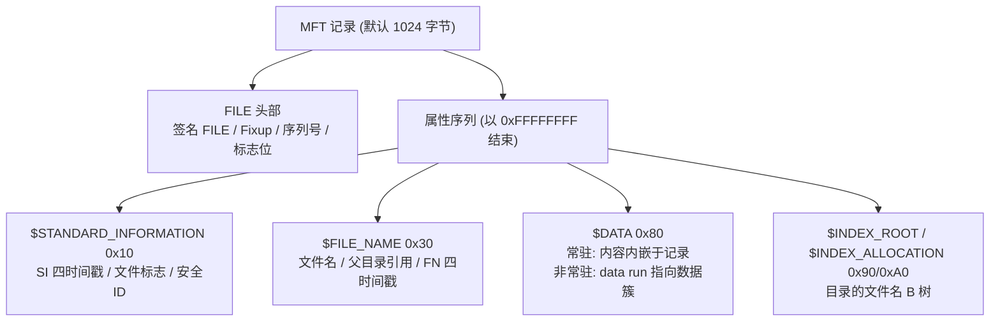
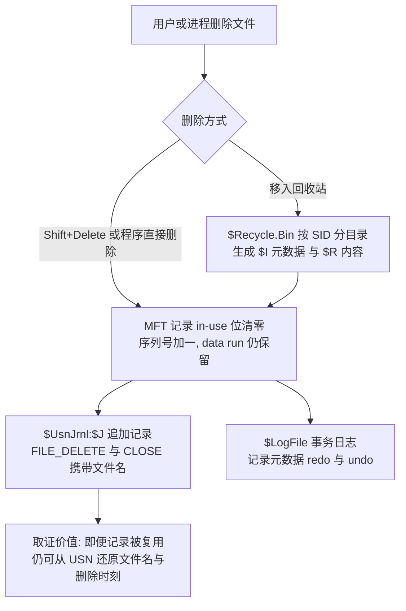
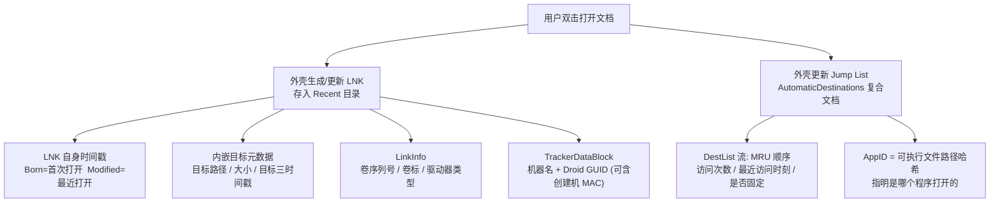

# 数字取证与事件响应（5）· Windows磁盘取证痕迹
> [!abstract] TL;DR
> - NTFS 中"一切皆文件"，`$MFT` 是元数据总账；每条 1024 字节的 FILE 记录都带 `$STANDARD_INFORMATION` 与 `$FILE_NAME` 两套 MACB 时间戳，比对二者是识别 timestomping（时间戳篡改）的核心手法。
> - 变更日志 `$Extend\$UsnJrnl:$J` 以"文件名 + 变更原因位"记录 创建/删除/改名/写入，即便 MFT 记录已被复用、文件早已消失，仍能还原"落地—执行—自删"的完整链条。
> - 回收站在 Vista 后改为 `$Recycle.Bin\<SID>\` 下的 `$I`（元数据）/`$R`（内容）双文件，`$I` 保存原始路径、大小与删除时刻，并天然按 SID 把删除动作归属到具体用户。
> - LNK 快捷方式在用户打开文档时由外壳自动生成，内嵌目标路径、大小、时间戳、卷序列号，甚至 `TrackerDataBlock` 里藏着创建机的 MAC 地址；即使源 U 盘拔走、目标删除，LNK 仍能证明"它曾被谁、在哪个卷上打开"。
> - Jump List 按 AppID（可执行文件路径的哈希）聚合，`DestList` 流以 MRU 顺序记录访问次数与时刻，是回答"哪个程序打开了哪个文件、几次"的长效证据。
> - 单条痕迹易被伪造或清除，磁盘取证的纪律是：多源交叉验证 + 卷影副本回溯 + 全程只读镜像作业，绝不凭一处时间戳下结论。

## 概述与定位

磁盘取证痕迹（disk forensic artifacts）指的是：在不依赖运行中系统、仅凭一份静态存储介质镜像的前提下，能够重建"谁、在何时、对哪个文件、做了什么"的那一整套文件系统层与外壳（shell）层留痕。它是 DFIR 证据链里最"耐久"的一层——内存断电即失（见 [[03.内存取证：采集与Volatility框架]]、[[04.内存取证实战：进程与网络与注入检测]]），网络流不抓即逝（见 [[72.抓包与协议分析实战/19.网络取证与流重组]]），而磁盘上的元数据常常在文件本体被删除后仍长期滞留。本篇聚焦 Windows/NTFS 平台四类高价值痕迹：主文件表 MFT、变更日志 USN、回收站、以及快捷方式 LNK 与跳转列表 Jump List。

**边界厘清**（避免与相邻篇重复）：NTFS 更底层的数据结构（目录 B 树索引、簇分配位图、data run 完整语义、与 EXT 的对照）在 [[10.文件系统取证：NTFS与EXT]] 系统展开；注册表类外壳痕迹（ShellBags、各类 MRU、UserAssist、USB 设备历史）属 [[06.Windows注册表取证]]；程序执行专项（Prefetch/Amcache/ShimCache）在 [[08.执行痕迹：Prefetch与Amcache与ShimCache]]；把散点连成"超级时间线"是 [[11.时间线分析与超级时间线]] 的主题。本篇只取"磁盘上直接可解析、能证明文件曾存在 / 被访问 / 被删除"的那一类痕迹，把它们的二进制机制与取证语义讲透。

**为什么恰是这四类**：NTFS 的世界观是"一切皆文件"，连元数据自身都是隐藏的系统文件（`$MFT`、`$LogFile`、`$Extend\$UsnJrnl` 等）。因此文件系统的"账本"（MFT）与"流水"（USN/$LogFile）天然就是取证富矿——它们不是为取证设计的，却因为要保证一致性、支持索引与备份而被迫留下了大量可追溯信息。回收站、LNK、Jump List 则是外壳层为"方便用户"而维护的便利数据结构：删除有暂存、最近打开有列表、任务栏右键有跳转。便利的另一面就是留痕：这些数据结构默默记录了用户行为，且往往比用户以为的活得更久。取证人做的，本质是把"为效率与便利而生的副产品"翻译成"行为证据"。

一个贯穿全篇的判断原则：**痕迹的价值 = 独立性 × 耐久性 × 可归属性**。USN 之所以珍贵，是因为它在 MFT 记录被复用后仍独立留存文件名（耐久 + 独立）；LNK 之所以关键，是因为它把外部卷的信息固化到了本机（归属 + 耐久）；回收站之所以好用，是因为它天生按 SID 分家（可归属）。理解每类痕迹在这三维上的强弱，才能在真实案件里知道该信谁、该拿谁去印证谁。

## 原理与机制

### NTFS 元数据文件全景

NTFS 卷格式化时会在 MFT 前 16 条记录里预置一批系统文件（记录号固定）：`0 $MFT`（主文件表本身）、`1 $MFTMirr`（前几条记录的镜像备份）、`2 $LogFile`（事务日志）、`3 $Volume`、`4 $AttrDef`、`5 .`（根目录）、`6 $Bitmap`（簇分配位图）、`7 $Boot`、`8 $BadClus`、`9 $Secure`（安全描述符库 `$SDS`）、`10 $UpCase`、`11 $Extend`。`$Extend` 是个目录，里面挂着 `$UsnJrnl`（变更日志）、`$Quota`、`$ObjId`、`$Reparse`。取证时这些文件是"元证据"：`$MFT` 给出所有文件的元数据，`$Bitmap` 告诉你某个删除文件的簇是否已被再分配（决定内容可恢复性），`$LogFile` 与 `$UsnJrnl` 提供操作流水。

### MFT：文件系统的总账

MFT 是一张定长记录表，默认每条 **1024 字节**（该值写在 `$Boot` 里）。系统里每一个文件、每一个目录，都至少对应一条 MFT 记录；小到几百字节的文件，其**内容甚至直接内嵌在 MFT 记录内部**（常驻属性，resident）。这条设计对取证意义重大：一是元数据高度集中，解析一份 `$MFT` 就能重建整棵目录树与全部时间戳；二是删除并不立即抹除记录，只是把"使用中"标志位清零、序列号加一，记录与其指向数据的 data run 都仍在，直到该记录被新文件复用——这正是"删除文件恢复"的物理基础。

每条记录由一个 FILE 头部加若干**属性**组成。取证最常打交道的两个属性是 `$STANDARD_INFORMATION`（简称 SI，类型 0x10）与 `$FILE_NAME`（简称 FN，类型 0x30）：二者**各自携带一套四时间戳**（创建 / 修改 / MFT 变更 / 访问，合称 MACB）。SI 的时间戳就是资源管理器展示、`SetFileTime` 能改的那套；FN 的时间戳则由内核在文件创建、改名、移动时才更新，公开 API 无法直接设置。这一"一软一硬"的非对称，是后文时间戳反取证检测的关键。

### USN 变更日志：文件级的操作流水

USN（Update Sequence Number）变更日志由 `$Extend\$UsnJrnl` 承载，含两条数据流：`$J` 存放实际记录，`$Max` 存放日志元数据（最大尺寸、分配增量、日志 ID）。`$J` 被实现为**稀疏文件**——逻辑偏移（USN）单调递增、永不回绕，但文件头部的旧记录簇会被系统持续释放，形成"逻辑无限、物理有界"的近似环形缓冲。每当文件发生创建、删除、改名、数据写入、属性变更、安全变更等，内核就往 `$J` 追加一条记录，写明目标与父目录的 MFT 引用、时间戳、**变更原因位掩码**（Reason）和**文件名**。

USN 的取证价值在于"独立于 MFT 的文件名快照"。想象一段典型攻击：恶意程序把 payload 落地到 `%TEMP%`、执行、随即自删。事后 MFT 里那条记录可能已被别的临时文件复用，磁盘上文件本体无踪——但 `$J` 里那对 `FILE_CREATE` 与 `FILE_DELETE`（外加最终的 `CLOSE`）连同文件名与精确到 100 纳秒的时刻仍在。改名类攻击（如把 `svchost_evil.exe` 改成 `svchost.exe` 伪装）会留下配对的 `RENAME_OLD_NAME` 与 `RENAME_NEW_NAME`，直接暴露伪装动作。因为容量有限并会滚动，繁忙卷上 `$J` 通常覆盖数小时到数天，安静卷可达数周。恶意持久化与自删行为的上游细节见 [[50.恶意代码分析与免杀对抗/08.持久化技术大全]]。

需要与 `$LogFile` 区分：二者都是"日志"，但定位不同。`$LogFile` 是 NTFS 的**事务日志**，为文件系统一致性服务，记录底层元数据的 redo/undo，粒度极细、生命极短，`chkdsk` 与崩溃恢复靠它；它能还原极近期的完整属性变更、旧文件名、索引项，但很快被覆盖。`$UsnJrnl` 是**面向应用的高层变更通知**（索引、备份、复制服务消费它），粒度到"文件发生了何种变化"，留存更久。取证上：查最近几分钟的精细操作看 `$LogFile`，查数天内的文件名级历史看 `$UsnJrnl`。

### 回收站：带元数据的删除暂存

Vista 起，回收站是每个卷根下的 `$Recycle.Bin\<用户SID>\` 目录。每删除一个文件，生成**两个配对文件**：`$I` 开头的元数据文件与 `$R` 开头的内容文件（六个随机字符 + 原扩展名）。`$I` 记录**原始完整路径、原始大小、删除时刻（UTC FILETIME）**；`$R` 就是被改名后的原内容。"从回收站还原"就是读 `$I` 拿到原路径、把 `$R` 移回去。取证含义有三：其一，按 SID 分家使删除动作**天然可归属到具体用户账户**；其二，即便回收站被"清空"，`$R` 内容在簇被覆盖前仍可能被雕刻（carving）恢复；其三，`$I` 独立保存了原路径，哪怕 `$R` 丢了也知道删了什么。注意：Shift+Delete、超过配额、从可移动/网络盘删除会**绕过回收站**，此时痕迹落到 MFT 与 USN 而非这里。XP/2000 的老格式则是 `RECYCLER\<SID>\` 加一个 `INFO2` 数据库，文件改名为 `Dc<序号>`，仍偶见于旧镜像案件。

### LNK 与 Jump List：把"打开过"钉死在磁盘上

LNK 是 Shell Link 二进制格式（微软规范 MS-SHLLINK）。除了用户手工创建的桌面快捷方式，**只要用户用图形界面打开过一个文档，系统就会在 `%AppData%\Microsoft\Windows\Recent\` 自动生成或更新一个 LNK**。它的取证威力在于：LNK 自身的文件时间戳给出"首次打开"（LNK 创建时间）与"最近打开"（LNK 修改时间）；而 LNK 内部又**固化了目标当时的全部信息**——目标路径、大小、目标自己的三个时间戳、目标所在卷的序列号与卷标、驱动器类型，甚至一个 `TrackerDataBlock` 里存着创建机的 NetBIOS 名和两对 Droid GUID（其中的对象 ID 是版本 1 UUID，节点字段就是网卡 MAC）。于是即便目标文件被删、源 U 盘被拔走，LNK 仍能证明"某文件曾以某大小、某时间戳、存在于某序列号的卷上，并被本机在某时刻打开过"。这类"外部卷指纹"与 [[39.固件与IoT嵌入式逆向/22.eMMC与NAND芯片级取证]] 的物理侧取证互为补充。

Jump List 是 Win7 起任务栏右键的"最近/常用"列表，按应用聚合，存于 `AutomaticDestinations\<AppID>.automaticDestinations-ms` 与 `CustomDestinations\<AppID>.customDestinations-ms`。`AutomaticDestinations` 是一个 **OLE 复合文档**（MS-CFB，与老式 `.doc` 同容器）：每个以十六进制命名的流内嵌一段 LNK 结构，另有一个 `DestList` 流充当 MRU/MFU 有序列表，记录每项的访问次数、最近访问时刻、是否固定（pinned）、主机名与 Droid。`AppID` 是应用**可执行文件路径的 CRC-64 哈希**，故"从异常路径运行同一程序"会得到不同 AppID——这本身就是线索。Jump List 的耐久性尤佳：它是每应用的聚合数据库，即使 Recent 目录被清、目标文件被删，它仍长期留存"哪个程序、打开了哪个文件、几次、何时"。



## 结构与格式详解

本节把四类痕迹拆到字节层，并讲清解析算法与取证判读要点——刻意用"代码块 + 中文散文"表达布局，读者不看结构图也能懂原理。

### MFT FILE 记录头与 Fixup（更新序列数组）

```
偏移   大小  含义
0x00   4    签名 "FILE"（坏记录为 "BAAD"）
0x04   2    更新序列数组(USA/Fixup)偏移
0x06   2    Fixup 条目数 = 1(校验值) + 扇区数
0x08   8    $LogFile 序列号 (LSN)，与 $LogFile 事务关联
0x10   2    序列号 (Sequence Number)，复用检测用
0x12   2    硬链接计数
0x14   2    第一个属性的偏移
0x16   2    标志: 0x01=使用中  0x02=目录
0x18   4    本记录已用字节数
0x1C   4    本记录分配字节数（通常 1024）
0x20   8    基记录引用（$ATTRIBUTE_LIST 扩展时指向基记录）
0x28   2    下一个属性 ID
```

**Fixup 机制为何存在、又为何是取证陷阱**：一条 1024 字节记录横跨两个 512 字节扇区，若掉电导致"扯裂写入"（torn write）——只写成一半——记录会静默损坏。NTFS 的对策是：把**每个扇区最后 2 字节**换成同一个"更新序列号"，被换下的原始 2 字节存进头部的 USA 数组；读时校验各扇区尾 2 字节是否等于同一序列号（等则写入完整），再用数组把原字节**回填**。取证解析器必须先做这步回填，否则记录里位于扇区边界（1KB 记录的 0x1FE、0x3FE 处）的字段会读到序列号而非真值，导致时间戳、data run 等在边界处诡异错乱。自己写 MFT 解析器时，忘记 Fixup 是头号 bug 来源。

### 八个时间戳与 timestomping 检测

SI 与 FN 各一套 MACB，共八个 64 位 FILETIME（自 1601-01-01 UTC 起的 100 纳秒计数）。四个字母的含义与**更新触发条件**是判读核心：

- **M（Modified，内容修改）**：写文件内容时更新 SI.M。
- **A（Accessed，访问）**：历史上每次访问更新；Vista–Win8 默认**关闭**最后访问更新（`NtfsDisableLastAccessUpdate=1`）以提性能；Win10 1803+ 改为"系统托管"，重新启用但**限流为每小时至多一次**。故现代 Windows 的 A 时间只有小时级参考价值，切勿当精确证据。
- **C（Changed，MFT 记录变更）**：任何元数据（属性、权限、名字）改动时更新，`$MFT` 内部时钟，用户不可直接设。
- **B（Born，创建）**：文件创建。

**为什么 SI 与 FN 的分裂能抓篡改**：`SetFileTime` 之类公开 API 只能改 **SI** 的时间戳，`timestomp`、Cobalt Strike 的 `timestomp` 命令都走这条路；**FN** 时间戳只在内核创建/改名/移动文件时被设置，公开 API 够不着。于是出现两类硬指标：其一，若 **SI 时间早于 FN 时间**（正常情况下二者初始相等，之后 SI 只会更晚），几乎必是把 SI 往回改的"回溯做旧"；其二，正常文件的亚秒字段（100ns 分数）几乎不会全零，而许多篡改工具只精确到秒、把纳秒清零，或把四个 SI 时间设成完全相同——这些都是红旗。稳妥做法是把 SI/FN 八个时间连同 USN、`$LogFile`、Prefetch 的时间并排比对，靠**多源不一致**定位篡改，而非只信一处。反取证专章见 [[14.反取证技术与对抗]]。

### 非常驻内容与 data run 解码

内容放不进记录时，`$DATA` 属性转为**非常驻**，用一串 data run 描述内容占用的簇。每个 run 以一个头字节起头：**低半字节 = 长度域字节数，高半字节 = 偏移域字节数**；随后按小端读出"簇数"与"起始簇号"，而**起始簇号是相对前一个 run 的有符号增量**（故可为负，支持任意碎片顺序与稀疏空洞）。

```
示例 run 字节: 21 18 34 56
  头字节 0x21 → 长度域 1 字节, 偏移域 2 字节
  长度 = 0x18 = 24 簇
  偏移 = 小端(34 56) = 0x5634 = 22068 簇（相对上一 run 的增量）
  含义: 从 LCN 22068 起, 连续 24 个簇
```

取证意义：解出 data run 才能把非常驻文件的簇拼回内容；对已删除文件，若 `$Bitmap` 显示这些簇尚未被再分配，则内容大概率可完整恢复。反之，**几百字节的小文件多为常驻**，删除后只要 MFT 记录未被复用，内容随记录一起在——这类小文件恢复率极高，恶意脚本、配置、密钥常正中此列。

### 回收站 `$I` 文件布局（版本 1 与版本 2）

```
偏移   大小   含义（Windows 10, 头部版本 = 2）
0x00   8     头部版本: Vista/7/8 = 0x01, Win10+ = 0x02
0x08   8     原始文件大小（小端）
0x10   8     删除时间（FILETIME, UTC）
0x18   4     原始路径字符数（含结尾 NUL）—— 仅版本 2
0x1C   变长   原始完整路径（UTF-16LE）
—— 版本 1 中 0x18 起为固定 520 字节(260 宽字符, MAX_PATH)路径 ——
```

版本 1 用定长 `MAX_PATH` 存路径，浪费但解析简单；版本 2 改为"4 字节长度 + 变长路径"，因 Win10 起支持长路径。判读要点：删除时间是 UTC，展示时按时区换算别搞错；`$I` 与 `$R` 靠**六字符随机串配对**，成对才完整，只剩 `$R` 时可雕刻内容但丢原路径与删除时刻。XP 的 `INFO2` 则是定长数据库，每条记录 **800 字节**（含 ANSI 与 Unicode 两份原路径、删除时间、大小、驱动器号），头部第 0x0C 偏移写着记录长度。

### LNK ShellLinkHeader 与关键内嵌块

```
偏移   大小   含义
0x00   4     HeaderSize = 0x0000004C
0x04   16    LinkCLSID = 00021401-0000-0000-C000-000000000046
0x14   4     LinkFlags（是否含 TargetIDList/LinkInfo/参数/是否 Unicode 等位）
0x18   4     目标 FileAttributes
0x1C   8     目标 CreationTime（FILETIME）
0x24   8     目标 AccessTime
0x2C   8     目标 WriteTime
0x34   4     目标 FileSize（低 32 位）
0x38   4     IconIndex
0x3C   4     ShowCommand
0x40   2     HotKey
```

头部之后按 `LinkFlags` 依次是：`LinkTargetIDList`（一串外壳项 PIDL，其中文件系统项常带 `0xBEEF0004` 扩展块，内含目标的 MFT 记录号/序列号、长短文件名与额外时间戳）、`LinkInfo`（卷序列号、卷标、驱动器类型、本地绝对路径，或网络共享名）、`StringData`（名称/相对路径/工作目录/命令行参数/图标位置的计数字符串）、以及若干 `ExtraData` 块。最有取证味的是 `TrackerDataBlock`（签名 `0xA0000003`，长 0x60）：含机器 NetBIOS 名与两对 Droid GUID；**Droid 里的对象 ID 是版本 1 UUID，节点 48 位就是创建该对象的机器 MAC**——这是把文件出处钉到具体物理机的少数途径之一。命令行参数字段还常抓到"用快捷方式伪装的恶意命令"，与 [[50.恶意代码分析与免杀对抗/06.进程注入技术全谱]] 里 LNK 投递手法呼应。

### Jump List 的 DestList 流

`AutomaticDestinations` 复合文档里，`DestList` 流是理解 Jump List 的钥匙：头部记录版本、条目总数、固定项数与"最后签发的条目 ID"计数器（据此可推断历史累计添加过多少项）；随后每条包含目标的 Droid（又一处 MAC 泄露点）、主机名、访问次数、最近访问 FILETIME、条目 ID、固定状态与目标路径。逐条解析并按 MRU 排序，就能重建"该应用被用户操作的先后序列"。Win7 与 Win10 的条目布局有出入（字段偏移与长度不同），解析器需按版本分支——这也是自研工具最易踩坑处，实战直接用成熟工具最稳。`CustomDestinations` 则非复合文档，而是**多段 LNK 结构首尾相连**，承载应用自定义分类（任务、固定项），格式更简单但同样含目标信息。



## 工具视角与实战

### 工具地图

- **The Sleuth Kit（TSK）**：`mmls` 看分区表、`fls -r -m` 输出目录树与时间戳（bodyfile）、`istat` 看单条 MFT 记录、`icat` 按 inode 抽内容。开源、可脚本化，是超级时间线的常见前端。
- **Eric Zimmerman 套件**（业界事实标准）：`MFTECmd` 解析 `$MFT`/`$J`（USN）/`$Boot`/`$SDS`/`$LogFile`；`RBCmd` 解回收站 `$I`/`INFO2`；`LECmd` 解 LNK；`JLECmd` 解 Jump List；结果用 `Timeline Explorer` 排序透视。
- **plaso / log2timeline**：把上述所有痕迹（外加注册表、事件日志、浏览器史）统一抽成 `.plaso` 再导出 CSV/时间线，是 [[11.时间线分析与超级时间线]] 的主力。
- **综合平台**：Autopsy（TSK 图形前端）、X-Ways、EnCase、FTK，适合大案与出报告。

```
# 解析 MFT，导出为可透视的 CSV（含 SI 与 FN 八时间戳）
MFTECmd.exe -f "E:\case\C\$MFT" --csv "E:\case\out"

# 解析 USN 变更日志（$J），还原创建/删除/改名流水
MFTECmd.exe -f "E:\case\C\$Extend\$UsnJrnl_$J" --csv "E:\case\out"

# 解回收站 $I（-d 递归整个 $Recycle.Bin）
RBCmd.exe -d "E:\case\C\$Recycle.Bin" --csv "E:\case\out"

# 解 Recent 下全部 LNK 与 Jump List
LECmd.exe  -d "E:\case\Users\bob\AppData\Roaming\Microsoft\Windows\Recent" --csv "E:\case\out"
JLECmd.exe -d "E:\case\Users\bob\...\Recent\AutomaticDestinations" --csv "E:\case\out"
```

### 一个串证的实战叙事

设警报是"某主机疑似被投递并执行了后门"。落地取证怎么把散点连成故事：

1. **USN 先行**：在 `$J` 里搜可疑扩展名或 `%TEMP%` 路径，命中一条 `FILE_CREATE`（时刻 T0，文件名 `update.tmp`）、随后同一 MFT 引用的 `RENAME_NEW_NAME`→`svchost.exe`（伪装）、再后 `FILE_DELETE`+`CLOSE`（T2 自删）。文件本体已不在，但"落地—改名—自删"时间线成立。
2. **MFT 印证**：查该 MFT 记录号，若已被复用，看序列号是否对得上；比对残留记录的 SI 与 FN——若 SI 被改得比 FN 早，叠加"自删"，篡改与反取证意图坐实。
3. **执行印证**：转 [[08.执行痕迹：Prefetch与Amcache与ShimCache]] 找 `SVCHOST.EXE-xxxx.pf` 的运行时刻是否落在 T0–T2 之间，且其加载模块指向 `%TEMP%`（正常 svchost 绝不在 Temp）。
4. **访问与出处**：`Recent` 里若有指向该样本或其配置的 LNK，其 `LinkInfo` 卷序列号 + `TrackerDataBlock` MAC 可指认样本源自哪台机器/哪个 U 盘；Jump List 的 `DestList` 给出用户手动打开的次数与时刻。
5. **回收站兜底**：若攻击者"删进回收站又清空"，`$Recycle.Bin\<SID>` 里残留的 `$I` 或可雕刻的 `$R` 能补出原路径与删除时刻，并把动作归到该 SID。
6. **回溯扩窗**：以上都可能被清理，故务必挂载**卷影副本（VSS）**，从历史快照里取更早的 `$MFT`、`$J`、LNK、Jump List，把时间线往前拉——很多"当前卷已被清"的证据在昨天的快照里完好。

这条链的方法论内核是：**没有任何单一痕迹能独立定案，价值来自互相印证**。USN 给文件名与动作，MFT 给元数据与篡改信号，执行痕迹给"确实跑了"，LNK/Jump List 给"谁打开的、从哪来的"，回收站给归属与兜底，VSS 给时间深度。网络侧的 C2 回连再由 [[72.抓包与协议分析实战/19.网络取证与流重组]] 补齐，内核级隐藏由 [[38.Windows内核与驱动逆向/11.Rootkit原理与检测]] 排查。



## 安全性与正确使用

**这些痕迹既是证据，也是隐私与攻击面。** 正确使用有三层含义：作业纪律、判读克制、防御加固。

**作业纪律（证据可信的前提）**：一切解析都在**只读**的取证镜像或写保护副本上进行，绝不在原盘直接跑工具——挂载即可能刷新访问时间、改动 `$LogFile`/`$UsnJrnl`。全程记录哈希与操作，维持监管链（chain of custody），细节见 [[02.证据保全与取证镜像]]。尤其注意：**在活体系统上直接双击这些证据文件本身就会污染 LNK、Jump List、Recent 与访问时间**，让证据自我改写。

**判读克制（别被痕迹骗）**：磁盘痕迹极易被误读或伪造，常见陷阱——① 现代 Windows 的**最后访问时间**默认限流/关闭，不可当精确访问证据；② **复制会刷新目标的创建时间**（新生），**同卷移动则保留**时间戳、**跨卷移动 = 复制+删除**，不懂这套语义就会把"复制"错判成"当天新建"；③ **卷序列号可被人为设置**、MAC 可伪造、时间戳可篡改，单点绝不可定案；④ 记录复用后，MFT 里"删除文件"的残迹可能张冠李戴，须用序列号校验引用是否新鲜。纪律是**多源交叉 + 明示不确定性**，宁可结论保守，不可过度归因。

**反取证认知与检测边界**：攻击者会做 timestomping（改 SI 时间）、`fsutil usn deletejournal` 删变更日志、`sdelete` 安全擦除 `$R`、注册表关 Recent/Jump List。但"清理"本身留痕：删 USN 会换新的日志 ID（前后 ID 断裂即异常）、SI 与 FN 分裂暴露改时间、应有痕迹的**缺失**本身就是线索（干净得反常）。取证方的正确姿势不是假设痕迹完整，而是**主动找缺口与矛盾**，并用 VSS 快照绕过对当前卷的清理。这属防守视角；武器化对抗的系统展开在 [[14.反取证技术与对抗]]。

**防御加固（把痕迹用好）**：企业侧应主动**增大并保留 USN 日志**（`fsutil usn createjournal m= a=` 调大容量，覆盖更长窗口）、开启对象访问审计与 Sysmon 以补足文件系统事件、**保留并定期采集卷影副本**以留住历史元数据、集中转发关键日志防止本地被清。同时须知这些痕迹**泄露隐私**：LNK/Jump List 会把内网主机名、MAC、外部卷标、用户打开过的文件路径固化在磁盘，分享样本或截图前应脱敏，避免二次信息泄露。加固的分寸是：为可追溯性而保留、为隐私而最小披露，二者靠"只读取证 + 输出脱敏"平衡。

## 小结

Windows 磁盘取证的四根支柱各司其职：**MFT** 是元数据总账，SI/FN 八时间戳与"删除即标记不即抹除"支撑了时间线与文件恢复，并靠软硬两套时间戳的分裂暴露 timestomping；**USN** 是文件级操作流水，以文件名 + 原因位在 MFT 被复用后仍能还原创建/改名/删除，专治"落地即自删"；**回收站** 的 `$I`/`$R` 双文件按 SID 归属删除动作，`$I` 独立保存原路径与删除时刻；**LNK/Jump List** 把"打开过"连同目标路径、卷序列号乃至创建机 MAC 钉死在磁盘，即便源盘拔走、目标删除也证据犹存。贯穿始终的方法论是：理解每类痕迹在"独立性 × 耐久性 × 可归属性"上的强弱，只读作业、克制判读、多源交叉、卷影回溯——把一堆"为效率而生的副产品"翻译成经得起质疑的行为证据。深入 NTFS 结构去 [[10.文件系统取证：NTFS与EXT]]，把这些点连成超级时间线去 [[11.时间线分析与超级时间线]]。

## 相关阅读

- [[02.证据保全与取证镜像]] —— 只读镜像、哈希与监管链，磁盘取证的作业前提。
- [[06.Windows注册表取证]] —— ShellBags、MRU、USB 历史等外壳/注册表痕迹，与本篇互补。
- [[08.执行痕迹：Prefetch与Amcache与ShimCache]] —— 印证"文件是否真的被执行"。
- [[10.文件系统取证：NTFS与EXT]] —— NTFS 底层结构与 EXT 对照的系统展开。
- [[11.时间线分析与超级时间线]] —— 用 plaso 把磁盘痕迹汇成超级时间线。
- [[14.反取证技术与对抗]] —— timestomping、日志擦除与检测的攻防专章。
- [[50.恶意代码分析与免杀对抗/08.持久化技术大全]] · [[50.恶意代码分析与免杀对抗/06.进程注入技术全谱]] —— 磁盘痕迹背后的恶意行为上游。
- [[72.抓包与协议分析实战/19.网络取证与流重组]] · [[38.Windows内核与驱动逆向/11.Rootkit原理与检测]] · [[39.固件与IoT嵌入式逆向/22.eMMC与NAND芯片级取证]] —— 网络、内核、硬件侧的呼应取证。
- 官方与经典参考：微软 **MS-SHLLINK**（Shell Link 二进制格式）、**MS-CFB**（复合文件二进制格式，Jump List 容器）规范；Brian Carrier《File System Forensic Analysis》（NTFS 权威）；Harlan Carvey《Windows Forensic Analysis Toolkit》；SANS FOR500《Windows Forensic Analysis》；Eric Zimmerman 工具官方文档（MFTECmd/RBCmd/LECmd/JLECmd）。

[[00.数字取证与事件响应总览|⬆ 系列总览]] | [[04.内存取证实战：进程与网络与注入检测|← 上一章]] | [[06.Windows注册表取证|→ 下一章]]