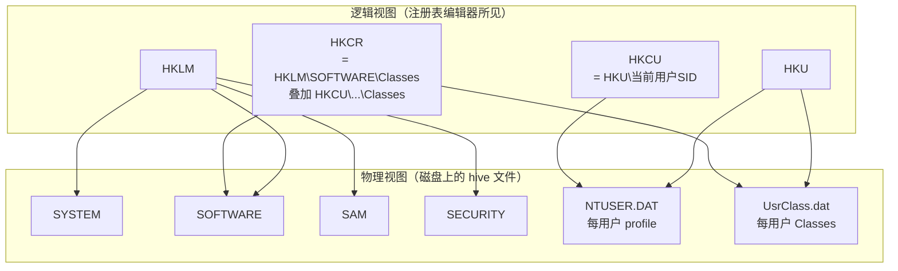
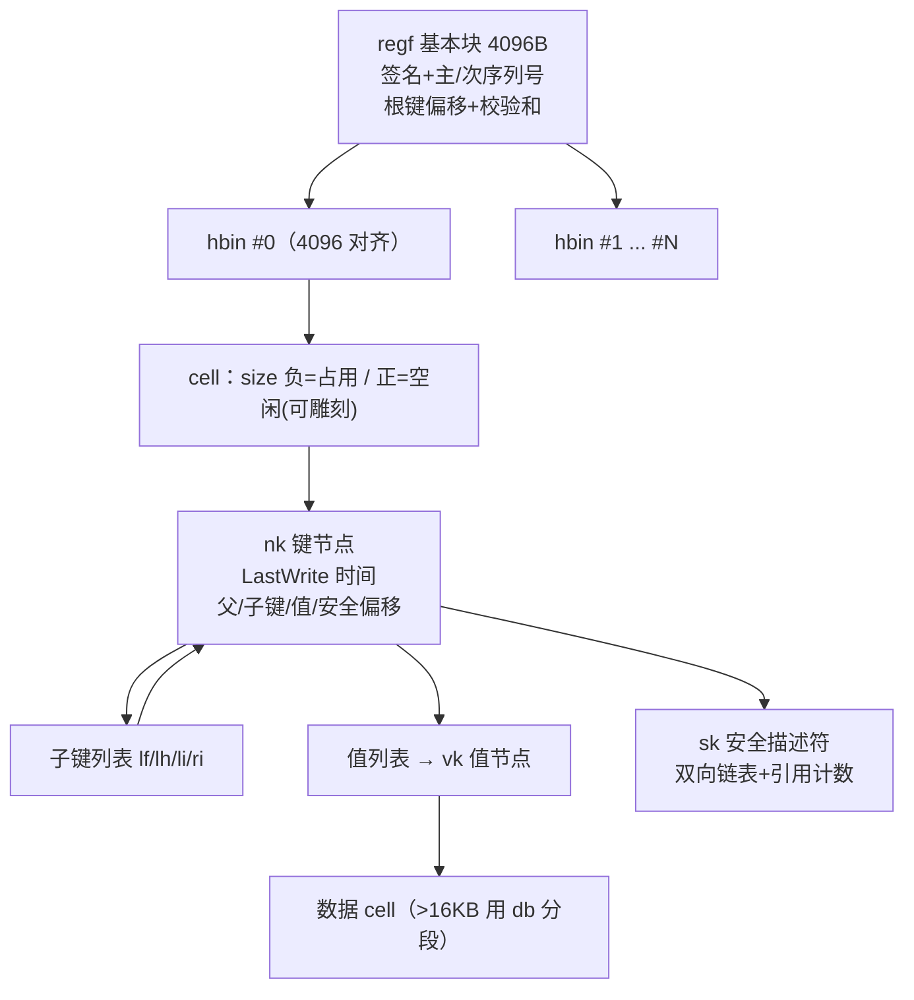
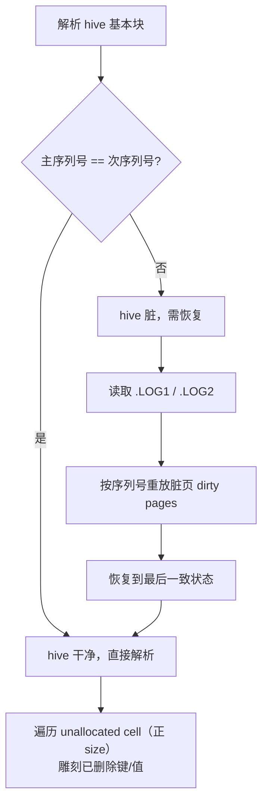
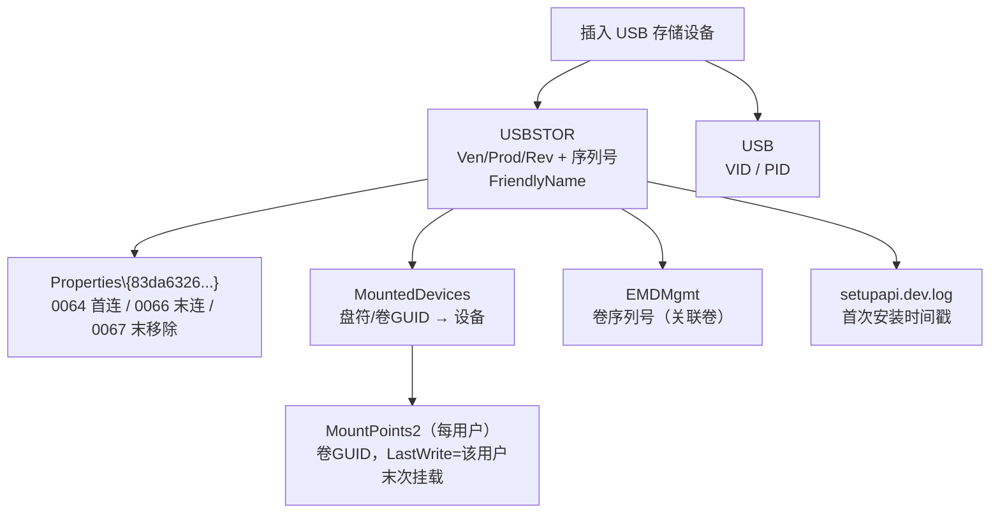
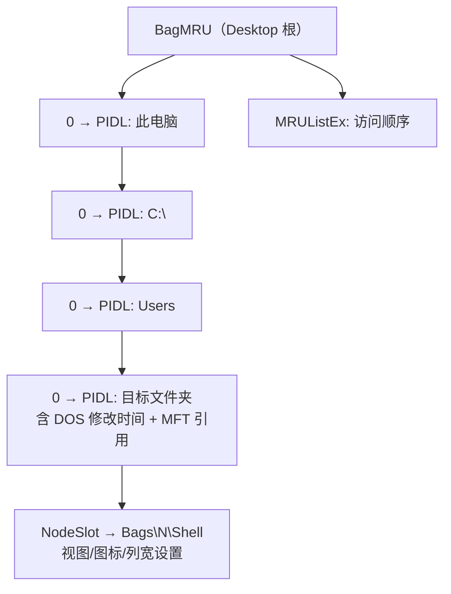

# 数字取证与事件响应（6）· Windows注册表取证
> [!abstract] TL;DR
> - 注册表在磁盘上是一组 `regf` 格式的 hive 文件（SYSTEM / SOFTWARE / SAM / SECURITY / NTUSER.DAT / UsrClass.dat），由 4096 字节基本块 + 若干 hbin + cell 构成；键节点 `nk` 携带 LastWrite 时间戳，值节点 `vk` 不带——这从底层决定了"注册表时间线"的粒度只到键、到不了值。
> - 取证禁止直接读活动系统的注册表：脏（dirty）hive 必须先用 `.LOG1/.LOG2` 事务日志重放（transaction log replay）恢复到一致态，否则会丢掉最后一批尚未落盘的写入，甚至读到断裂的结构。
> - Run/RunOnce/Winlogon/Services/IFEO 是持久化取证的第一现场；UserAssist、BAM、ShimCache、Amcache 则把"哪个程序在何时被执行过"直接写进了注册表。
> - USB 溯源要跨 `USBSTOR`、`MountedDevices`、`MountPoints2`、`DeviceClasses` 与 `setupapi.dev.log` 交叉比对：序列号第二位是 `&` 表示这是系统生成的伪序列号，同一 U 盘在不同机器上 ID 会不同。
> - ShellBags（BagMRU/Bags，位于 UsrClass.dat 与 NTUSER.DAT）以 PIDL 树记录用户在资源管理器里浏览过的每个文件夹，即便该文件夹已删除、位于已拔出的移动介质或网络共享上，痕迹仍长期留存。
> - 删除的键值不会立即抹除：cell 的 size 字段"由负转正"即释放，未分配空间里可雕刻（carve）出已删键名、值名与数据，这是反-反取证的关键。

## 概述与定位

Windows 注册表是一个**层次化的配置数据库**，从 Windows 95/NT 起取代了 Win16 时代散落各处的 `.INI` 文件，把系统、驱动、服务、应用与每个用户的偏好统一收纳到一棵可枚举、可 ACL、可事务化的树里。对取证人员而言，它的价值不在"配置"这个用途本身，而在一个副作用：**操作系统、应用程序和用户的几乎每一个动作都会在注册表里留下写入**。插一次 U 盘、双击一次程序、在资源管理器里点开一个文件夹、连一次 Wi-Fi、装一个服务、改一次时区——这些行为都会新建键、改写值或刷新 LastWrite 时间戳。注册表因此像飞机的"黑匣子"：它不是为取证设计的，却被动记录了大量可复盘的状态与行为。

从证据类型看，注册表能回答五类调查问题，本篇会逐一展开：**系统画像**（OS 版本、安装时间、计算机名、时区偏移、网络配置、上次正常关机时间）、**账户信息**（SAM 里的本地账户、RID、登录次数、末次登录、口令提示）、**持久化**（各类自启动键——恶意代码赖以在重启后存活的落脚点）、**执行痕迹**（UserAssist / BAM / ShimCache / Amcache 记录的"程序被运行过"）、以及**设备与用户操作史**（USB 设备接入历史、ShellBags 文件夹浏览史、各种 MRU 最近使用列表）。这五类里，持久化与执行痕迹直指恶意活动，设备史与操作史则常用于内部违规、数据外泄和"人在键盘前做了什么"的还原。

在本系列的坐标系里，本篇处于取证镜像（[[02.证据保全与取证镜像|第 2 篇]]）与磁盘痕迹（[[05.Windows磁盘取证痕迹|第 5 篇]]）之后：拿到镜像后，注册表和文件系统、事件日志是三条并行的证据线。要划清与相邻篇的边界——**ShimCache（AppCompatCache）与 Amcache.hve 虽然物理上就是注册表结构，但它们承载的"执行证据"语义留给 [[08.执行痕迹：Prefetch与Amcache与ShimCache|第 8 篇]] 深讲**，本篇只交代它们"在注册表里的位置与读取方式"；事件日志的时间线归 [[07.Windows事件日志分析|第 7 篇]]；而注册表被恶意利用做持久化、藏 payload、藏键的那部分，恶意视角在 [[50.恶意代码分析与免杀对抗/08.持久化技术大全]] 与 [[38.Windows内核与驱动逆向/11.Rootkit原理与检测]]，本篇站在取证侧讲"如何发现与解释"。

## 原理与机制

### 逻辑结构：hive、key、value 与值类型

逻辑上，注册表是一棵树：根下面挂若干 **hive（配置单元）**，hive 里是 **key（键）**，键可嵌套子键，键的叶子上挂 **value（值）**。一个值由三元组构成——**名字、类型、数据**。这里有一条对取证极其关键的非对称性：**键有 LastWrite 时间戳（一个 64 位 FILETIME），值没有**。任何对某键下"增/删/改值"的操作只会更新该键的 LastWrite，无法区分是哪个值被动了、也无法给出值本身的时间。这不是工具的局限，而是 `regf` 磁盘格式的设计使然（下一节详解）。理解这条，才不会在报告里写出"某值在某时刻被修改"这种超出证据粒度的结论。

值的类型决定了数据如何解读，常见的有：`REG_SZ`（1，字符串）、`REG_EXPAND_SZ`（2，含 `%VAR%` 环境变量的字符串）、`REG_BINARY`（3，裸二进制——ShellBags、UserAssist、MountPoints 等取证富矿几乎都是它）、`REG_DWORD`（4，小端 32 位）、`REG_MULTI_SZ`（7，双空结尾的字符串数组）、`REG_QWORD`（11，64 位）。取证解析时最容易踩坑的是把 `REG_BINARY` 当"看不懂就跳过"——恰恰相反，最有价值的行为记录都藏在这些二进制斑块里。

### 五个根键：哪些是真 hive，哪些是投影

注册表编辑器里看到 `HKLM / HKU / HKCU / HKCR / HKCC` 五个"根"，但只有前两个对应真实的物理 hive，后三个是**符号投影**，取证时要还原到它们真正的落点：

- **HKLM（HKEY_LOCAL_MACHINE）**：机器级配置，其下 `SYSTEM / SOFTWARE / SAM / SECURITY` 四个子树各自对应一个磁盘 hive 文件；`HARDWARE` 是**易失 hive**（开机时由内核枚举硬件动态构建，不落盘）。
- **HKU（HKEY_USERS）**：所有已加载用户配置的集合，每个子键是一个用户 SID，对应该用户的 `NTUSER.DAT`（及其 `Classes` 对应 `UsrClass.dat`）。
- **HKCU** = `HKU\<当前登录用户的 SID>`，只是当前会话的便捷投影。
- **HKCR** = `HKLM\SOFTWARE\Classes` 与 `HKCU\Software\Classes`（即用户的 `UsrClass.dat`）**叠加合并**的视图；离线取证时没有"当前用户"概念，必须分别去两个 hive 里找。
- **HKCC** = `CurrentControlSet` 下的当前硬件配置文件投影。



### 磁盘上的 hive 文件与定位

机器级 hive 位于 `C:\Windows\System32\config\`，无扩展名：`SYSTEM`、`SOFTWARE`、`SAM`、`SECURITY`、`DEFAULT`（本地 SYSTEM/服务用的默认配置文件）、以及可能的 `COMPONENTS`（组件存储）。每个 hive 旁边有**事务日志** `<hive>.LOG1`、`<hive>.LOG2`（Win8.1 前是单个 `.LOG`）。用户级 hive 随 profile 走：`C:\Users\<用户>\NTUSER.DAT`（承载 HKCU 主体）和 `C:\Users\<用户>\AppData\Local\Microsoft\Windows\UsrClass.dat`（承载该用户的 `Classes`，ShellBags 大部分在这里）。此外 `Amcache.hve` 位于 `C:\Windows\AppCompat\Programs\`，也是 `regf` 格式。

因为运行中的系统会**独占锁定**这些文件，取证采集不能简单 `copy`。三条常规路子：从磁盘镜像/E01 里离线抽取；从卷影副本（VSS）里取历史版本；活体采集时用 `reg save`、`RawCopy`、`FTK Imager` 或 `esentutl /y` 之类能绕过共享锁读原始扇区的手段。别忘了把 `.LOG1/.LOG2` 一并取走——没有日志就无法对脏 hive 做恢复。

### ControlSet 与 Select：读哪一份控制集

`SYSTEM` hive 里通常有 `ControlSet001`、`ControlSet002` 等多份"控制集"，而运行时以 `CurrentControlSet` 这个易失符号链接指向其中一份。哪一份是"当前"？由 `SYSTEM\Select` 键裁决：`Current` 值（DWORD）指向正在用的那份，`LastKnownGood` 指向上次成功启动的那份，`Failed` 记录上次失败的那份。**离线取证若照搬 `ControlSet001` 就可能读错**——必须先读 `Select\Current`（比如值为 1 就看 `ControlSet001`）。这类"符号链接/多副本"是注册表机制层面的陷阱，工具如 RegRipper 会自动跟随，手工分析时务必自查。

### 易失键、备份与事务日志（概览）

不是所有键都落盘。`HKLM\HARDWARE`、各 `Enum` 子树的部分节点、`MountPoints2` 之外的一些运行态数据是**易失（volatile）**的，只存在于内存中的 hive 映射里，一断电即失。这意味着**内存取证与磁盘注册表取证互补**——想要活动系统的完整注册表状态（含易失键、已加载但未落盘的写入），需要 [[03.内存取证：采集与Volatility框架|第 3 篇]] 从内存里重建 hive。至于备份，`config\RegBack\` 曾长期保存 SYSTEM/SOFTWARE 等的定期副本，但从 Windows 10 1803 起**默认停止写入**（为省磁盘），别再指望它有新鲜数据。事务日志的细节留到下一节，这里先记住结论：**脏 hive 必须先重放日志再解析**。

## 结构与算法详解：regf 磁盘格式、cell 与事务日志恢复

这一节钻到字节层面——只有理解了 `regf` 格式，才能明白"为什么值没有时间戳""删除的键为什么还能恢复""脏 hive 为什么要重放日志"这些取证结论从何而来。

### 基本块（base block / regf 头）

hive 文件开头是 4096 字节的基本块，记录版本、序列号、根键位置和校验和：

```
偏移    大小   字段
0x000   4      签名 "regf"
0x004   4      主序列号 Primary sequence number
0x008   4      次序列号 Secondary sequence number   ← 二者相等 = 上次干净卸载
0x00C   8      最后写入时间 FILETIME
0x014   4      主版本号（通常 1）
0x018   4      次版本号（3/4/5/6，随 NT 演进）
0x01C   4      文件类型（0=primary, 1=transaction log）
0x020   4      文件格式（1=direct memory load）
0x024   4      根键 cell 偏移（相对 hbin 数据区起点）
0x028   4      hbin 数据区总字节数
0x030   64     hive 内部文件名（UTF-16LE，末段路径）
...
0x1FC   4      校验和（前 508 字节按 127 个 dword 逐个 XOR）
```

**主/次序列号**是脏检测的核心：一次写事务开始时先把主序列号 +1 并落盘，事务成功结束后再把次序列号更新到相同值。若某次崩溃发生在中途，磁盘上就会留下"主 != 次"的痕迹，解析器据此判定 hive 脏、需要恢复。

### hbin 与 cell：分配的最小单位

基本块之后是连续的 **hbin（hive bin）**，每个 hbin 以 `"hbin"` 签名开头，大小是 4096 的整数倍。hbin 内部再切成 **cell**，cell 是注册表的分配单位。cell 头只有一个 **有符号 4 字节 size**，其符号位就是"分配状态"：

```
cell:
0x00  4  有符号 size：负值=已分配(in use)，正值=空闲(free/已删除)
0x04  ... cell 数据（结构化 cell 前 2 字节是类型签名，如 nk/vk/sk/lf...）
```

**"负=占用、正=空闲"这个约定，正是删除数据可恢复的物理根源**：删除一个键或值时，系统往往只是把对应 cell 的 size 由负翻正（标记空闲），并不清零内容。于是在被复用覆盖之前，未分配 cell 里还完整躺着已删键名、值名甚至数据。取证工具遍历 hbin、专挑正 size 的 cell 做**雕刻（carving）**，就能捞回"regedit 里已经看不到"的条目——这是反制嫌疑人"删注册表灭迹"的关键能力。

### nk、vk、sk 与子键列表

结构化 cell 有多种，取证最常打交道的是键节点 `nk` 和值节点 `vk`：

```
nk（键节点）:
0x00  2  签名 "nk"
0x02  2  标志位（ROOT、是否 ASCII 名等）
0x04  8  LastWrite 时间 FILETIME     ← 注册表时间线唯一的来源
0x10  4  父键 cell 偏移
0x14  4  稳定子键数
0x1C  4  子键列表 cell 偏移（指向 lf/lh/li/ri）
0x24  4  值个数
0x28  4  值列表 cell 偏移
0x2C  4  安全描述符 sk cell 偏移
0x4C  2  键名长度
0x50  N  键名（ASCII 或 UTF-16LE）

vk（值节点）:
0x00  2  签名 "vk"
0x02  2  值名长度（0 = 默认值 Default）
0x04  4  数据大小；最高位置1 = 数据"驻留"在下方偏移字段里(≤4字节)
0x08  4  数据 cell 偏移（或当驻留时即数据本身）
0x0C  4  数据类型（REG_SZ=1, REG_BINARY=3, REG_DWORD=4 ...）
0x14  N  值名
```

看清楚了：**LastWrite 时间戳只出现在 `nk` 里，`vk` 结构里根本没有时间字段**。这就是"值没有时间戳"的字节级证据，也是本篇反复强调的时间线粒度上限。另一个实用细节是 `vk` 的**数据大小最高位**：当数据不超过 4 字节（典型如 DWORD），系统不会另开数据 cell，而是把数据直接塞进 `0x08` 偏移字段并把 size 的最高位置 1，称为**驻留（resident）数据**；超过则 `0x08` 是指向独立数据 cell 的偏移。而当数据超过约 16344 字节，会用 `db`（big data）结构把数据切成多段、用一张分段表索引——解析 ShellBags 这种大二进制值时要能处理 `db`，否则会截断。

子键的组织用四种列表 cell：`lf`（fast leaf，按名字前 4 字符的哈希加速）、`lh`（hash leaf，按整名哈希）、`li`（index leaf，无哈希）、`ri`（index root，指向下一层若干 li/lf/lh，用于超大键）。安全描述符单独放在 `sk` cell 里，`sk` 之间构成**双向链表并带引用计数**——多个键共享同一 ACL 时只存一份，这也是为什么导出权限要跟 `sk` 链走。



### 事务日志与脏 hive 恢复

注册表要在崩溃后保持一致，靠的是**先写日志再改主文件**的思路。老格式（Win8.1 前）是单个 `.LOG`，用一张"脏向量（DIRT）"标记哪些页被改过。新格式（Win8.1 及以后）改为 `.LOG1`/`.LOG2` **双日志交替**写，日志内容是一条条 **log entry（`HvLE`）**，每条带序列号、哈希和一批脏页。双日志的意义在于容错：若在写某个日志时又崩溃，另一份仍是完好的上一代，避免"日志本身也坏了"的死角。

**恢复（replay）算法**大致是：解析器先看基本块的主/次序列号是否相等——相等则 hive 干净，直接解析；不等则 hive 脏，需要恢复。此时读取 `.LOG1/.LOG2`，挑出序列号比 hive 当前更新的 log entry，按序把其中的脏页覆盖回主文件，直到把 hive 推进到日志所记录的最后一致状态。**对取证的含义极重要**：一台被强制断电或直接拔硬盘的机器，其 SYSTEM/SOFTWARE 往往是脏的，主文件里缺了最后一批写入——而那批写入（可能正是攻击者最后的操作）就躺在日志里。**不重放日志就解析，等于主动丢弃最新证据**，甚至因结构不一致而误读。Eric Zimmerman 的 Registry Explorer 会在加载脏 hive 时提示你附带 `.LOG` 一起重放，`RECmd --recover`、`yarp-recover` 也做同样的事。这一步是注册表取证的"规定动作"，不是可选项。



## 工具视角与实战

### 工具箱

- **RegRipper**（`rip.pl` / `rip.exe`）：Perl 写的插件化解析器，一个插件对应一类痕迹（如 `usbstor`、`shellbags`、`userassist`、`run`）。优点是插件把"键路径 + 解读逻辑"固化下来，一条命令出结论，适合批量与标准化。
- **Registry Explorer / RECmd**（Eric Zimmerman，.NET）：Registry Explorer 是带脏 hive 自动重放、书签（把已知取证键预置成书签）、可雕刻已删条目的 GUI；RECmd 是其命令行版，配合社区 batch 文件（如 `Kroll_Batch`）能一次性把上百个取证键导成 CSV，是当前主流。
- **regipy**（Python）/ **yarp**（Python）：库+CLI，适合自动化流水线与自研解析；`yarp` 对底层 cell、日志重放、删除项恢复支持细腻。
- **hivex / reged / hivexregedit**（Linux）：libguestfs 系工具，在 Linux 平台离线读写 hive。
- **Autopsy / plaso**：Autopsy 有注册表模块；plaso 能把注册表痕迹并入超级时间线（见 [[11.时间线分析与超级时间线|第 11 篇]]）。

下面按"调查问题"组织痕迹清单——这是实战里真正的用法：不是背键路径，而是带着问题去查对应的键。

### 系统画像

- **OS 版本/安装时间**：`SOFTWARE\Microsoft\Windows NT\CurrentVersion` 的 `ProductName`、`CurrentBuild`/`DisplayVersion`、`InstallDate`（Unix 时间）、`RegisteredOwner`。
- **计算机名**：`SYSTEM\ControlSet00X\Control\ComputerName\ComputerName`。
- **时区偏移**：`SYSTEM\...\Control\TimeZoneInformation` 的 `ActiveTimeBias`（分钟）与 `TimeZoneKeyName`。**这个值是所有 FILETIME 换算成本地时间的基准**，报告里时间对不上，十有八九是时区没校准（详见下一节"陷阱"）。
- **上次关机时间**：`SYSTEM\...\Control\Windows\ShutdownTime`（FILETIME 二进制）。
- **网络**：`SOFTWARE\Microsoft\Windows NT\CurrentVersion\NetworkList\Profiles` 有每个网络的 `ProfileName`（SSID）、`DateCreated`/`DateLastConnected`（首末次连接，128 位 SYSTEMTIME）；`Signatures\Unmanaged` 记录网关 MAC，可把机器"绑"到某个物理网络。网络流量侧的呼应见 [[72.抓包与协议分析实战/19.网络取证与流重组]]。

### 账户

`SAM\SAM\Domains\Account\Users` 下每个 RID 子键的 `F` 值（二进制）含末次登录、登录失败次数、登录计数、账户状态；`V` 值含用户名、口令提示。SID 到用户名/profile 路径的映射在 `SOFTWARE\Microsoft\Windows NT\CurrentVersion\ProfileList`——把 HKU 下的裸 SID 翻译成"张三/李四"就靠它。

### 持久化（自启动落脚点）

这是应急响应查恶意代码的第一现场，恶意实现细节见 [[50.恶意代码分析与免杀对抗/08.持久化技术大全]]、注入落地见 [[50.恶意代码分析与免杀对抗/06.进程注入技术全谱]]，本篇讲"查"：

- **Run / RunOnce**：`SOFTWARE\Microsoft\Windows\CurrentVersion\Run`、`RunOnce`、`RunOnceEx`，以及 32 位程序的 `Wow6432Node` 分身，还有每用户版本 `NTUSER\...\CurrentVersion\Run`。
- **Winlogon**：`SOFTWARE\Microsoft\Windows NT\CurrentVersion\Winlogon` 的 `Shell`（正常应为 `explorer.exe`）、`Userinit`（应为 `userinit.exe,`）——被追加额外程序是经典手法。
- **Services**：`SYSTEM\CurrentControlSet\Services\<名>` 的 `Start`（2=自动）、`ImagePath`、`ServiceDll`；恶意服务/驱动常藏于此，内核落地见 [[38.Windows内核与驱动逆向/11.Rootkit原理与检测]]。
- **IFEO 劫持**：`...\Image File Execution Options\<exe>\Debugger`，用"调试器"字段把正常程序偷换成恶意体。
- **其他**：`AppInit_DLLs`、`ShellServiceObjectDelayLoad`、`Session Manager\BootExecute`、`Explorer\Run` 等冷门键，专业工具的 autoruns 类插件会一网打尽。

### 执行痕迹

- **UserAssist**：`NTUSER\...\Explorer\UserAssist\{GUID}\Count`，记录该用户经 GUI（开始菜单/桌面/资源管理器）启动过的程序，含**运行次数、聚焦时长、末次运行时间**。程序路径用 **ROT13** 编码（把每个字母移 13 位，纯粹为了"不显眼"，不是加密），解码即得原路径。两个 GUID 分别对应可执行文件与快捷方式。
- **BAM/DAM**：`SYSTEM\CurrentControlSet\Services\bam\State\UserSettings\{SID}`（Win10 1709+），值名是程序全路径，数据里含**该程序末次执行的 FILETIME**——直接给出"谁、跑了什么、什么时候"，是近年应急响应的高价值痕迹。
- **ShimCache（AppCompatCache）** 与 **Amcache.hve**：分别在 `SYSTEM\...\Control\Session Manager\AppCompatCache` 和 `C:\Windows\AppCompat\Programs\Amcache.hve`，记录被系统"见过/执行过"的可执行文件及其时间与 SHA1（Amcache）。它们物理上是注册表，但执行语义的深解留给 [[08.执行痕迹：Prefetch与Amcache与ShimCache|第 8 篇]]，这里只需知道"从注册表里怎么取"。
- **MUICache**：`UsrClass.dat\...\Shell\MuiCache`，缓存运行过的程序的显示名。

### USB 设备接入史（种子）

这是注册表取证的招牌题，因为**没有单一的键能给出全貌，必须跨键交叉印证**：

- `SYSTEM\CurrentControlSet\Enum\USBSTOR`：按 `Disk&Ven_厂商&Prod_型号&Rev_版本` 分类，其下子键就是**设备序列号**，含 `FriendlyName`。序列号里藏着一条判据——**若序列号第二个字符是 `&`，说明设备没有内置唯一序列号，是 Windows 现场生成的伪序列号**，因此同一个 U 盘在不同机器上的 ID 会不同，跨机溯源时不能拿它当唯一指纹。
- 时间戳（Win8+）在 `USBSTOR\...\序列号\Properties\{83da6326-...}\` 下：`0064`=首次连接、`0066`=末次连接、`0067`=末次移除。
- `SYSTEM\CurrentControlSet\Enum\USB`：给出 `VID`/`PID`（厂商/产品 ID）。
- `SYSTEM\MountedDevices`：把盘符（`\DosDevices\E:`）和卷 GUID 映射到具体设备，USB 卷这里的数据是含 `USBSTOR` 字样的字符串，可与上面对齐。
- `NTUSER\...\Explorer\MountPoints2`：**每用户**记录挂载过的卷 GUID，其**键 LastWrite 时间 = 该用户末次挂载该卷**——这一步把"设备"绑到"具体的人"。
- `SOFTWARE\Microsoft\Windows Portable Devices\Devices` 给友好名与盘符；`EMDMgmt`（ReadyBoost 用）里含**卷序列号**，可与文件系统侧的卷序列号关联，实现"设备↔卷↔盘符"闭环。
- 最后与 `C:\Windows\INF\setupapi.dev.log` 交叉——它记录设备**首次安装**的时间戳，补上"这台机器第一次见到它是什么时候"。若要下探到芯片级溯源，见 [[39.固件与IoT嵌入式逆向/22.eMMC与NAND芯片级取证]]。



### 用户操作痕迹：ShellBags（种子）与 MRU 家族

**ShellBags** 记录用户在资源管理器里浏览过的文件夹。数据在 `UsrClass.dat` 的 `Local Settings\Software\Microsoft\Windows\Shell\BagMRU`/`Bags`（多数文件夹，含移动介质、ZIP、网络）和 `NTUSER.DAT` 的 `Software\Microsoft\Windows\Shell`（桌面、网络）。`BagMRU` 是一棵**镜像文件夹层级的树**：每个节点下用 `0/1/2...` 命名的值各是一段 **PIDL（ITEMIDLIST，shell 条目）**二进制，解析它能还原文件夹名，某些类型的条目里还嵌着 **DOS 修改时间与 MFT 文件引用号**；`NodeSlot` 指向 `Bags\N\Shell` 里保存的该文件夹视图设置；`MRUListEx` 记录同级访问顺序。

ShellBags 的取证价值在于**它证明"某文件夹曾被用户在图形界面里打开过"，且这一痕迹极其顽固**：文件夹后来被删除、U 盘拔走、网络共享断开、ZIP 关闭，ShellBag 依然留存——因为它记录的是"用户的浏览行为"而非"文件夹当前是否存在"。这对还原"人在键盘前找过哪些目录、看过哪块移动盘"极有力。



**MRU（Most Recently Used）家族**同样藏在 `NTUSER.DAT`，都用 `MRUListEx`（二进制的 DWORD 序列）表达顺序：

- `Explorer\RecentDocs`：按扩展名分类的最近打开文档。
- `ComDlg32\OpenSavePidlMRU` / `LastVisitedPidlMRU`：通用"打开/保存"对话框里用过的文件与目录——常能抓到"某程序打开过某敏感文件"。
- `Explorer\RunMRU`：Win+R 运行框历史（明文命令，含手打的路径/程序）。
- `Explorer\TypedPaths`：资源管理器地址栏手输过的路径。
- `TypedURLs`：IE 地址栏历史。
- `Explorer\WordWheelQuery`：资源管理器搜索框关键词——嫌疑人搜过什么，一目了然。

RegRipper 一条命令即可批量出这些痕迹，例如：

```bash
# 用 RegRipper 跑单个 hive 的对应插件
rip.exe -r NTUSER.DAT -p shellbags
rip.exe -r NTUSER.DAT -p userassist
rip.exe -r SYSTEM     -p usbstor

# 用 RECmd 批处理把已知取证键批量导出为 CSV
RECmd.exe --bn Kroll_Batch.reb -d "E:\case\config" --csv "E:\out"

# regipy：命令行导出某 hive 全部键值
registry-dump NTUSER.DAT
```

## 安全性与正确使用

**注册表既是取证富矿，也是攻击面**——理解它被滥用的方式，才能既查得准、又不误判、还不破坏证据。

**作为攻击面**：其一，持久化——上一节列的自启动键正是恶意代码重启存活的落脚点，应急要把它们当"必查项"逐一核对基线。其二，**无文件（fileless）驻留**：Poweliks、Kovter 这类恶意程序把 PE、脚本或 shellcode 以 base64/二进制形式塞进注册表值（常用超长的、非打印字符命名的、或藏在 `Classes` 深处的键），运行时由一段小 loader 从注册表读出并在内存里执行，磁盘上几乎不落 PE——查这类要主动 **hunt 异常大的二进制值、非可打印字符的键名、Run 键里指向 `mshta`/`rundll32`/`powershell -enc` 的可疑命令**。其三，**藏键**：用原生 API 写入含 `\0`（空字符）的键名，`regedit` 与很多用户态工具会在空字符处截断显示，导致键"隐身"，只有从底层直接解析 cell 的取证工具才能看见（内核态隐藏见 [[38.Windows内核与驱动逆向/11.Rootkit原理与检测]]）。

**反取证与误判风险**：攻击者可用 `NtSetInformationKey(KeyWriteTimeInformation)` / `SetKeyLastWriteTime` **篡改键的 LastWrite 时间戳**（时间戳伪造），也可删除键值灭迹，或专用**易失键**——那些永不落盘的键做到"重启即无痕"。因此**绝不能把单个 LastWrite 当铁证**：要与文件系统时间、事件日志、Prefetch、Amcache 多源交叉印证（时间线交叉见 [[11.时间线分析与超级时间线|第 11 篇]]），互相矛盾时优先怀疑被篡改。删除的键值则反过来是我方武器——从未分配 cell 雕刻已删条目，能捞回对方以为抹掉的痕迹。

**正确的取证使用与边界**：

- **只在副本上操作，绝不改活动系统的注册表**——一次误写就改了 LastWrite、污染了证据、破坏了监管链（chain of custody，见 [[02.证据保全与取证镜像|第 2 篇]]）。
- **必带事务日志并完成重放**：脏 hive 不重放就解析会漏掉最新写入，这是本篇反复强调的规定动作。
- **先定 ControlSet**：读 `Select\Current` 再选控制集，别照搬 `ControlSet001`。
- **时区必须校准**：所有 FILETIME 都是 UTC，换算本地时间要用受检机器的 `ActiveTimeBias`，而不是分析机的时区——这是新手最常见的"时间对不上"根因。
- **尊重证据粒度**：LastWrite 是键级、不是值级；MRU 顺序看 `MRUListEx`、不是键的物理排列；UserAssist 记得 ROT13 解码；USB 伪序列号（第二位 `&`）不能当跨机唯一指纹；ShellBag 的存在证明"浏览过"、但不必然等于"用户主观意图"（自动化进程也可能生成）。把这些边界写清楚，结论才经得起质证。

一句话：注册表取证的正确姿势是"离线副本 + 日志重放 + 多源印证 + 粒度自律"，任何越过证据粒度的断言都是隐患。

## 小结

注册表取证的底座是 `regf` 磁盘格式：4096 字节基本块（主/次序列号做脏检测）+ 若干 hbin + cell（负 size 占用、正 size 空闲），键节点 `nk` 独占 LastWrite 时间戳、值节点 `vk` 没有——这从字节层面锁定了"时间线到键为止"的粒度，也解释了删除项为何可雕刻、脏 hive 为何必须用 `.LOG1/.LOG2` 重放。往上，逻辑树把机器级（SYSTEM/SOFTWARE/SAM/SECURITY）与用户级（NTUSER.DAT/UsrClass.dat）hive 组织成五个根键的投影，取证时要还原投影、跟随 `Select\Current` 选对控制集、并意识到易失键只在内存里（需内存取证补全）。

实战上，注册表能同时回答系统画像、账户、持久化、执行痕迹与设备/操作史五类问题：Run/Winlogon/Services/IFEO 是查持久化的第一现场；UserAssist/BAM/ShimCache/Amcache 给出执行证据；USB 溯源靠 USBSTOR↔MountedDevices↔MountPoints2↔DeviceClasses↔setupapi 交叉闭环；ShellBags 与 MRU 家族则把"人在键盘前的浏览与操作"顽固地留存下来。安全侧要同时防两头——既把注册表当攻击面（无文件驻留、藏键、持久化）去 hunt，又守住取证纪律（副本、重放、印证、粒度），警惕时间戳篡改与时区误算。掌握了字节格式与痕迹地图，注册表就从"一堆看不懂的键"变成了可复盘的行为黑匣子。

## 相关阅读

- 本系列上下游：[[05.Windows磁盘取证痕迹|第 5 篇 · Windows磁盘取证痕迹]]、[[07.Windows事件日志分析|第 7 篇 · Windows事件日志分析]]、[[08.执行痕迹：Prefetch与Amcache与ShimCache|第 8 篇 · 执行痕迹]]、[[03.内存取证：采集与Volatility框架|第 3 篇 · 内存取证]]、[[11.时间线分析与超级时间线|第 11 篇 · 时间线分析]]、[[02.证据保全与取证镜像|第 2 篇 · 证据保全与取证镜像]]
- 同库交叉：[[50.恶意代码分析与免杀对抗/08.持久化技术大全]]、[[50.恶意代码分析与免杀对抗/06.进程注入技术全谱]]、[[38.Windows内核与驱动逆向/11.Rootkit原理与检测]]、[[72.抓包与协议分析实战/19.网络取证与流重组]]、[[39.固件与IoT嵌入式逆向/22.eMMC与NAND芯片级取证]]
- 权威资料：Harlan Carvey《Windows Registry Forensics》；《Windows Internals》（Russinovich 等）注册表章节；Microsoft Docs "Registry Hives" 与 "Structure of the Registry"；Joachim Metz 的 `libregf`/`regf` 格式规范；Eric Zimmerman 工具集（Registry Explorer / RECmd）与 SANS "Windows Forensic Analysis" 海报中的注册表痕迹速查表。

[[00.数字取证与事件响应总览|⬆ 系列总览]] | [[05.Windows磁盘取证痕迹|← 上一章]] | [[07.Windows事件日志分析|→ 下一章]]
