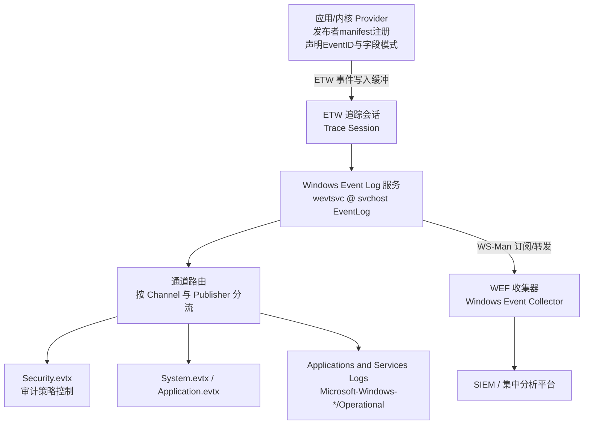
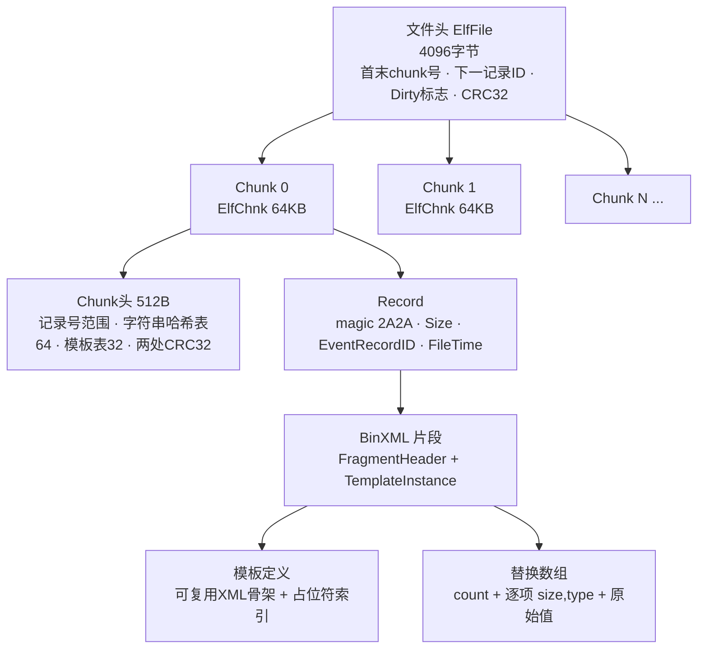
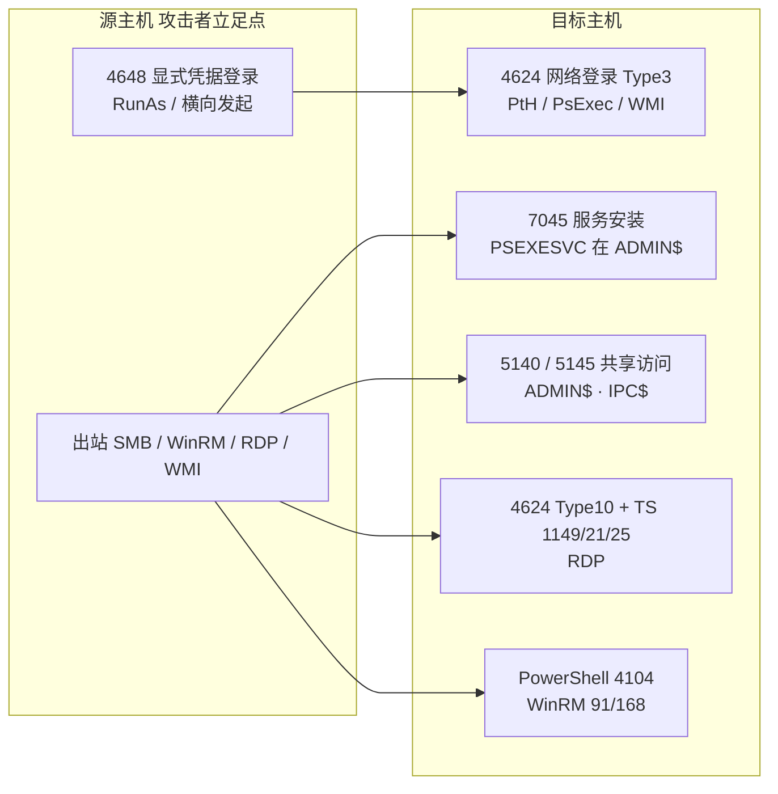

# 数字取证与事件响应（7）· Windows事件日志分析

> [!abstract] TL;DR
> - Windows 事件日志是 ETW（Event Tracing for Windows）管道的持久化终点，自 Vista 起以 EVTX 二进制格式（ElfFile/ElfChnk/BinXML 模板化编码）存于 `%SystemRoot%\System32\winevt\Logs`，彻底取代旧的 EVT，带来结构化 XML、发布者—订阅模型与远程转发能力。
> - 登录取证的核心是 Security 通道的 4624/4625/4634/4648/4672 加上 Logon Type：Type 2/10 是交互/RDP，Type 3 是网络访问，Type 9 常见于 Pass-the-Hash，Type 值几乎单独决定横向移动的性质判定。
> - 横向移动必须在「源主机—目标主机」两侧对账：PsExec 看 7045+5145、RDP 看 4624 T10+TerminalServices 21/25/1149、WMI 看 WMI-Activity、WinRM/PSRemoting 看 4624 T3+PowerShell 4104。
> - 模板化 BinXML 既是压缩手段也是解析难点：同一 Provider 的相同事件共享模板骨架，删除单条记录会破坏 chunk 的 CRC32 与 EventRecordID 单调链，反取证多用 phant0m 杀服务线程或整体清空（清空必留 1102/104）。
> - 默认审计策略只记录冰山一角：命令行审计、PowerShell 脚本块日志（4104）、Sysmon 都需显式开启，取证前第一件事是确认「当时到底记了什么」，而非直接下结论。

## 概述与定位

Windows 事件日志（Event Log）是操作系统对「谁、在什么时间、以什么身份、对什么对象、做了什么、成功还是失败」这一系列问题的官方书面记录。在 DFIR 的证据三角（磁盘、内存、日志）中，它既不像磁盘痕迹那样被动沉淀、也不像内存那样易失，而是一份由系统主动、结构化、带时间戳生成的行为账本。相较于本系列第五篇的磁盘痕迹与第六篇的注册表取证，事件日志的独特价值在于它天生带「动作语义」：磁盘上的 `$MFT` 时间戳告诉你文件何时被改，注册表告诉你配置是什么状态，而事件日志直接告诉你「Administrator 于 10:32:07 从 10.0.0.5 通过网络登录成功」——这种主谓宾俱全的语义，是重建攻击时间线（第十一篇）时最省力的骨架。

事件日志的历史分水岭是 Windows Vista。Vista 之前（2000/XP/2003）使用的是 EVT 格式：单文件、固定的三大日志（Application、System、Security）、二进制记录松散、编码依赖代码页、时区处理混乱、几乎无法结构化查询。Vista 及之后引入了全新的 EVTX 格式与 Windows Event Log 服务，彻底重构：日志被拆成上百个「通道（Channel）」，每个应用/组件可注册自己的发布者（Publisher）并定义事件模式；记录以二进制 XML（BinXML）编码、时间统一为 UTC 的 FILETIME、支持基于 XPath 的结构化查询、支持通过 WS-Management 远程订阅与转发。本篇的一切分析对象默认是 EVTX；遇到 XP/2003 时代镜像才需回退到 EVT 解析器（如 `libevt`）。

从取证定位看，本篇聚焦三条主线：EVTX 的二进制格式与解析（这是所有工具的底层，也是判断日志是否被篡改的依据）、登录事件（身份与访问的核心证据）、横向移动痕迹（内网攻击链在日志上的投影）。它上承第六篇注册表取证（事件日志的通道配置、大小上限、保留策略都存在注册表里），下启第八篇执行痕迹（Prefetch/Amcache 补足事件日志「没开命令行审计时看不到执行细节」的盲区），并与第五十章的持久化与进程注入互为「攻击方视角」的镜像——日志里的 7045 服务安装、4698 计划任务，正是 [[50.恶意代码分析与免杀对抗/08.持久化技术大全]] 中技术在防守侧留下的脚印。

## 原理与机制

要读懂日志，先要理解一条事件从产生到落盘的完整管道。现代 Windows 的日志底座是 ETW。ETW 是一套内核级、高性能的事件追踪框架，采用「发布者（Provider）—会话（Session）—消费者（Consumer）」三段式架构：内核组件或应用程序作为 Provider，通过预先注册的「插桩清单（instrumentation manifest）」声明自己能发出哪些事件（EventID、字段模式、级别、关键字）；事件被写入内核维护的追踪缓冲区；Windows Event Log 服务（`wevtsvc.dll`，寄宿在一个 `svchost.exe` 进程里，服务名 `EventLog`）作为一类特殊的实时消费者，订阅需要持久化的 Provider，按「通道」把事件路由并写入对应的 `.evtx` 文件。

这条管道解释了几个取证上的关键事实。其一，**日志是「配置驱动」的**：一个事件即便被 Provider 发出，只有当对应通道处于启用状态、且审计策略要求记录时，才会落盘——这是为什么「没有日志」不等于「没有发生」。其二，**通道分四类**：Admin（面向管理员、默认启用、稳定）、Operational（面向排障、常默认启用）、Analytic 与 Debug（高频、默认关闭、需手动开）。经典三大日志属于 Admin 级，而海量攻防线索藏在 `Applications and Services Logs` 下的 `Microsoft-Windows-<组件>/Operational` 通道里（如 TerminalServices、WMI-Activity、WinRM、PowerShell、Sysmon）。其三，**渲染依赖 Provider 资源**：EVTX 里存的是结构化数据加模板 ID，而人类可读的「消息文本」是运行时用 Provider DLL 里的消息资源渲染出来的；把 EVTX 拷到另一台缺少该 Provider 的机器上直接双击，就会看到「找不到事件源的描述」——这是离线取证的常见坑，解法是用能内置模板或忽略渲染的工具（EvtxECmd、python-evtx）。

每条事件记录在逻辑上分两层：`System` 段与 `EventData`/`UserData` 段。`System` 段是所有事件共有的元数据骨架，字段包括：Provider（名字与 GUID）、EventID 与 Version、Level（严重级别）、Task 与 Opcode、Keywords（关键字位掩码）、TimeCreated（`SystemTime` 属性，UTC）、**EventRecordID（全局单调递增的记录序号，篡改检测的命门）**、Correlation（ActivityID，用于跨事件关联同一操作）、Execution（发出事件的 ProcessID/ThreadID）、Channel、Computer、以及 Security 段里的 UserID（发出者 SID）。`EventData` 段则是该 EventID 专属的业务字段，例如 4624 里的 `TargetUserName`、`LogonType`、`IpAddress`、`LogonProcessName`。理解这个两层结构，才能写出精确的 XPath/`FilterHashtable` 查询——你既能按 `System` 里的 EventID 粗筛，也能按 `EventData` 里的 `Data[@Name='LogonType']='10'` 精确锁定 RDP。

下图勾勒从 Provider 到落盘再到集中转发的整条链路，也顺带标出取证时需要关注的每一个环节。



## EVTX 二进制格式与 BinXML 解析详解

EVTX 的字节级设计是本篇的「结构与算法」核心。它的目标有三个：可追加写入（append-only，日志不断增长）、可容忍崩溃（掉电后仍能定位到最后一条完整记录）、可压缩重复（同类事件的 XML 骨架不重复存储）。为达成这三点，格式采用「文件头 + 定长 chunk + 记录 + 模板化 BinXML」四级结构。

**文件头（ElfFile）** 固定占 4096 字节（实际有效字段约 128 字节，其余填零）。它像一本账本的封面，记录全局状态：

```
偏移        长度  字段
0x00        8    Signature = "ElfFile\x00"
0x08        8    FirstChunkNumber（当前最早 chunk 号，滚动时前移）
0x10        8    LastChunkNumber（当前最新 chunk 号）
0x18        8    NextRecordIdentifier（下一条记录将分配的全局 ID）
0x20        4    HeaderSize = 0x80
0x24        2    MinorVersion（1 或 2）
0x26        2    MajorVersion（3）  → 版本 3.1 / 3.2
0x28        2    HeaderBlockSize = 0x1000（4096）
0x2a        2    NumberOfChunks
0x78        4    Flags（bit0=Dirty 脏，bit1=Full 满）
0x7c        4    Checksum = 前 120 字节的 CRC-32
```

其中 **Dirty 标志** 是崩溃一致性的关键：服务正常关闭日志时会清掉该位，非正常终止（掉电、崩溃、被强杀）则该位残留为 1。取证时看到 Dirty 位置位，意味着日志可能有未完全写入的尾部记录，也可能是机器被暴力断电——这本身就是一条线索。

**chunk（ElfChnk）** 是 EVTX 的分配与校验单元，固定 65536 字节（64KB）。日志增长时以 chunk 为粒度追加；每个 chunk 自带一份 512 字节的头部与两处 CRC32，因此单个 chunk 损坏不会连累其他 chunk——这也是从未分配空间「雕刻（carving）」残留日志的基础：只要找到 `ElfChnk\x00` 特征串，就能独立还原一整块 64KB 的记录。

```
偏移        长度  字段
0x00        8    Signature = "ElfChnk\x00"
0x08        8    FirstEventRecordNumber（本 chunk 内首记录序号）
0x10        8    LastEventRecordNumber
0x18        8    FirstEventRecordIdentifier（全局 ID）
0x20        8    LastEventRecordIdentifier
0x28        4    HeaderSize = 0x80
0x2c        4    LastEventRecordDataOffset
0x30        4    FreeSpaceOffset（下一条记录写入位置）
0x34        4    EventRecordsChecksum（记录区 CRC-32）
0x7c        4    Checksum（chunk 头 CRC-32）
0x80        256  CommonStringOffsetArray（64 项字符串哈希表）
0x180       128  TemplatePtrArray（32 项模板指针表）
```

chunk 头里的 **字符串哈希表与模板指针表** 是 EVTX「省空间」的机器：同一 chunk 内反复出现的元素名、属性名（如 `EventID`、`TargetUserName`）只存一次，后续以偏移引用；而完整的 XML 骨架被抽象成「模板（Template）」，同 chunk 内第一次出现某类事件时定义模板，之后同类事件只存「模板引用 + 变化的值」。这就是为什么一个装满 4624 的 Security 日志能被压得很小。

**事件记录（Event Record）** 紧随 chunk 头，结构简单但暗藏两处校验冗余：

```
偏移    长度  字段
0x00    4    Signature = 0x00002a2a（ASCII "**"）
0x04    4    Size（整条记录长度，含末尾 Size 副本）
0x08    8    EventRecordIdentifier（全局单调递增）
0x10    8    WrittenTime（FILETIME：自 1601-01-01 UTC 起的 100ns 数，64 位）
0x18    ...  BinXML 片段（事件正文）
末尾    4    Size 副本（与开头 Size 相等，供反向遍历与完整性校验）
```

首尾各存一份 Size，使解析器既能正向也能反向遍历记录链；而 EventRecordID 全局单调递增，一旦中间缺号，就说明有记录被删——**这正是检测「精准删除单条日志」反取证手法的技术支点**。WrittenTime 是 UTC 的 FILETIME，意味着分析时区换算要自己做，且它反映的是「服务写入时刻」而非「事件发生时刻」（二者通常仅差毫秒，但在系统繁忙或时间被回拨时可能背离）。

最难的一层是 **BinXML**。它把 XML 编成一串 token，避免存储冗长的标签文本。核心 token 如下：

```
0x00 EndOfStream          流结束
0x0f FragmentHeader        片段头（主/次版本 + flags）
0x0c TemplateInstance      模板实例（模板定义偏移 + 替换数组）
0x01/0x41 OpenStartElement 开始标签（0x40 位 = 该元素带属性）
0x02 CloseStartElement     标签闭合 ">"
0x03 CloseEmptyElement     空元素 "/>"
0x04 EndElement            结束标签 "</...>"
0x05/0x45 Value            内联字面值
0x06/0x46 Attribute        属性
0x0d NormalSubstitution    普通替换（按索引从替换数组取值）
0x0e OptionalSubstitution  可选替换（若该值类型为 Null 则整节点省略）
```

模板机制这样工作：一个 `TemplateInstance` token 指向一段「模板定义」——那是带占位符的 XML 骨架，占位符用 `NormalSubstitution`/`OptionalSubstitution` 标出，每个占位符带一个索引 `i`；紧跟其后的是「替换数组（substitution array）」，先给出条目数 count，再是 count 个 `(size, type)` 描述符，最后是各值的原始字节。渲染时，解析器遍历模板，遇到索引 `i` 的占位符就去替换数组取第 `i` 个值，按其 `type`（下表节选）解释字节：

```
0x00 Null     0x01 String(UTF-16LE)  0x04 UInt8    0x06 UInt16
0x08 UInt32   0x0a UInt64            0x0d Bool     0x0e Binary
0x0f Guid     0x11 FileTime          0x13 Sid      0x15 HexInt64
0x21 BinXml（嵌套片段）  0x80 位 = 数组变体
```

`OptionalSubstitution` 的语义尤其要留意：当替换值的类型是 Null（0x00）时，对应的 XML 节点被**整体省略**。这解释了一个常见困惑——为什么同一个 EventID 在不同记录里 XML 字段时多时少：不是日志坏了，而是可选字段在该次事件里为空被省了。手工解析或写 YARA/carver 时若不处理这一点，就会错位读值。

解析算法因此可归纳为：定位并校验文件头 → 遍历 chunk（校验两处 CRC32）→ 在 chunk 内正向扫描 `0x2a2a` 记录 → 对每条记录解析 BinXML → 遇 `TemplateInstance` 先解析/缓存模板骨架，再套用替换数组还原完整 XML → 用 Provider 消息模板渲染人类可读文本。取证工具（`libevtx`、`python-evtx`、EvtxECmd）本质都是这套流程的实现；理解它，你才能判断「工具解析失败」到底是文件损坏、CRC 不符（可能被篡改），还是仅仅缺了 Provider 模板（无害）。

下图给出 EVTX 的四级嵌套结构，便于对照上面的字节表建立整体观感。



## 工具视角与实战

**原生工具三件套**。图形界面是 `eventvwr.msc`，适合快速浏览与「筛选当前日志」，但不适合大规模离线分析。命令行首选 `wevtutil`（查询 `qe`、导出 `epl`、列通道 `el`、查配置 `gl`、清空 `cl`）。真正的主力是 PowerShell 的 `Get-WinEvent`：它能直接读离线 `.evtx`（`-Path`），支持高效的 `-FilterHashtable`（在底层下推到日志引擎，比先取全量再 `Where-Object` 快几个数量级），也支持 `-FilterXPath` 精确匹配 `EventData` 字段。老旧的 `Get-EventLog` 只能读经典三大日志、不认新通道，遇 Vista 后系统一律用 `Get-WinEvent`。

```powershell
# 取目标机 Security 日志里全部成功登录（4624）并展开关键字段
Get-WinEvent -Path .\Security.evtx -FilterXPath "*[System[EventID=4624]]" |
  ForEach-Object {
    $x = [xml]$_.ToXml()
    [pscustomobject]@{
      Time   = $_.TimeCreated
      User   = ($x.Event.EventData.Data | ? Name -eq 'TargetUserName').'#text'
      Type   = ($x.Event.EventData.Data | ? Name -eq 'LogonType').'#text'
      SrcIP  = ($x.Event.EventData.Data | ? Name -eq 'IpAddress').'#text'
      Proc   = ($x.Event.EventData.Data | ? Name -eq 'LogonProcessName').'#text'
    }
  }
```

**专业取证工具链**。Eric Zimmerman 的 **EvtxECmd** 是离线分析首选：内置大量事件「地图（maps）」把晦涩字段标准化成统一列，一条命令把整个 `winevt\Logs` 目录转成 CSV/JSON 喂给时间线。跨平台脚本化用 Willi Ballenthin 的 **python-evtx**（`evtx_dump.py` 直接吐 XML）与底层 C 库 **libevtx**。检测导向的新一代工具是 **Chainsaw** 与 **Hayabusa**：它们把 Sigma 规则（社区维护的跨 SIEM 检测语言）直接跑在 EVTX 上，几秒钟标出「疑似横向移动/凭据转储/日志清除」的命中。轻量脚本还有 **DeepBlueCLI**，专攻可疑登录与命令行。方法论上，**Sigma** 值得单独强调：它让检测逻辑与具体平台解耦，是把「事件 ID + 字段条件」沉淀为可复用规则的事实标准。

**登录事件实战**。登录取证的第一张表是 EventID 速查，第二张表是 Logon Type——后者比 EventID 更能说明「登录的物理/逻辑通道」：

| EventID | 通道 | 含义 | 取证要点 |
|---|---|---|---|
| 4624 | Security | 登录成功 | 主证据，配合 LogonType 定性 |
| 4625 | Security | 登录失败 | 爆破/喷洒；`SubStatus` 区分密码错/账号锁/账号不存在 |
| 4634 / 4647 | Security | 注销 / 用户主动注销 | 与 4624 的 LogonID 配对算会话时长 |
| 4648 | Security | 使用显式凭据登录 | RunAs、横向发起端；常是攻击起点 |
| 4672 | Security | 分配特殊权限 | 紧跟高权限 4624，标记管理员/SYSTEM 登录 |
| 4768 / 4769 / 4771 | Security | Kerberos AS-REQ / TGS-REQ / 预认证失败 | 域内认证、Kerberoasting、票据滥用 |
| 4776 | Security | NTLM 凭据校验 | 本地/域 NTLM，含 workstation 名 |

| Type | 名称 | 触发场景 | 横向移动含义 |
|---|---|---|---|
| 2 | Interactive | 键盘/控制台本地登录 | 物理到场或 KVM |
| 3 | Network | SMB、共享、多数无交互远程访问 | **横向移动最常见**：PsExec、PtH、WMI |
| 4 | Batch | 计划任务 | 任务被触发执行 |
| 5 | Service | 服务启动 | 服务以某账号起 |
| 7 | Unlock | 解锁工作站 | 本地有人 |
| 8 | NetworkCleartext | 明文口令过网（IIS Basic） | 凭据可能明文暴露 |
| 9 | NewCredentials | RunAs /netonly | **Pass-the-Hash 特征**（mimikatz sekurlsa::pth） |
| 10 | RemoteInteractive | RDP、终端服务 | **RDP 横向**，配合 TerminalServices 通道 |
| 11 | CachedInteractive | 缓存凭据离线登录 | 断域环境 |

**横向移动痕迹对账**。横向移动的取证精髓是「不要只看一台机器」。同一次横移会在源主机与目标主机各留一组互补痕迹，把两侧按时间与账号对齐，才能坐实攻击路径。不同技术的指纹迥异：

- **PsExec / SMB 服务安装**：目标机 System 日志出现 `7045`（服务安装，服务名典型为 `PSEXESVC`、镜像路径在 `ADMIN$`），Security 出现 `4624 Type 3` 与 `5140/5145`（访问 `ADMIN$`、`IPC$` 共享）；源机出现 `4648`。
- **RDP**：目标机 `4624 Type 10`、`4778/4779`（会话重连/断开），并在 `Microsoft-Windows-TerminalServices-LocalSessionManager/Operational` 出现 `21`（登录成功）、`22`（Shell 启动）、`25`（重连），`RemoteConnectionManager` 的 `1149` 事件里**直接带来源 IP 与用户名**。
- **WMI 远程执行**：目标机 `4624 Type 3` 加 `Microsoft-Windows-WMI-Activity/Operational` 的 `5857/5860/5861`（`5861` 还标记永久事件消费者——常见持久化）。
- **WinRM / PowerShell Remoting**：目标机 `4624 Type 3`、`Microsoft-Windows-WinRM/Operational` 的 `91/168`，以及 PowerShell 的 `4103`（模块/管道）、`4104`（脚本块，能还原实际执行的命令）。
- **计划任务横移**（`schtasks /s`、`at`）：目标机 `4698`（任务创建）、`TaskScheduler/Operational` 的 `106/200/201`，触发时 `4624 Type 4`。



把这些事件按 UTC 时间线与 LogonID/ActivityID 串起来，就能重建「A 机 4648 → B 机 4624 T3 + 7045 → B 机 4104 执行侦察命令 → B 机 4648 → C 机……」的横移链；这条链正是喂给第十一篇超级时间线的核心素材，也与 [[72.抓包与协议分析实战/19.网络取证与流重组]] 的网络侧证据互相印证（日志说「谁登录了」，流量说「传了什么」）。

## 安全性与正确使用

事件日志既是防守方的证据源，也是攻击方的清除目标，因此「日志本身的完整性」是本篇最需警惕的安全议题。

**篡改与反取证**。最粗暴的是整体清空：`wevtutil cl Security` 或图形界面「清除日志」。好消息是清空本身会留痕——Security 通道产生 `1102`（审计日志被清除），System 通道产生 `104`（日志被清除），且这两条事件记录了执行者的账号与时间，反而成了强力线索。更隐蔽的是「精准删除单条记录」：如 DanderSpritz 的 `eventlogedit`，它直接改 chunk、抹掉指定 EventRecordID 并试图修复引用——但很难同时修好 chunk 的两处 CRC32 与 EventRecordID 单调链，所以**校验和不符、记录序号跳号，就是精准删除的实锤**。还有一类不删记录而「让日志停止记录」的手法，典型是 **phant0m**：它枚举 Event Log 服务进程里负责写日志的线程并挂起/杀死，服务看似仍在运行（`sc query` 正常），实则从某刻起不再落盘——检测这类攻击要看「日志是否出现异常的、与系统活跃度不符的静默期」，并结合内存取证（第四篇）查 `svchost` 线程状态。mimikatz 的 `event::drop`/`event::clear` 同样属于这一族。需要点明的是：EVTX 内部 WrittenTime 独立于文件系统时间戳，单纯对 `.evtx` 文件做 timestomp（改 MACB）并不能改事件的内部时间——这是它比多数痕迹更抗篡改之处。

**恢复被清日志**。即便日志被清，仍有多条恢复路径：卷影副本（VSS）里往往留有历史 `.evtx`；未分配空间与 pagefile/hiberfil 里可用 `ElfChnk` 特征串雕刻残块（chunk 自校验特性使单块可独立还原）；内存中 Event Log 服务的缓冲区可能仍持有尚未落盘或刚被删的记录；若部署了 Windows 事件转发（WEF），副本早已在收集器/SIEM 上，攻击者清本地也徒劳。这也直接给出加固方向。

**正确使用与加固边界**。其一，**先扩大「记什么」**：默认审计策略只覆盖极少事件，必须启用高级审计策略（Advanced Audit Policy），并开启进程创建审计的**命令行记录**（`4688` 的 `CommandLine` 字段，需组策略显式打开，否则只有进程名没有参数）、PowerShell 的**脚本块日志（4104）**与转录（Transcription）、以及 **Sysmon**（提供 EVTX 原生审计缺失的进程树、网络连接、镜像加载、注册表改动等高保真遥测）。取证前的第一步永远是查 `Get-WinEvent -ListLog *` 与审计策略配置，搞清「当时到底开了哪些」，否则容易把「没记」误判成「没发生」。其二，**扩大「记多久、记到哪」**：合理增大关键通道的日志上限（Security 默认偏小、易被高频事件挤掉滚动覆盖）、设置为「归档满则新建」而非直接覆盖、部署 WEF 把日志实时推到独立收集器，使本地被清也不影响集中副本。其三，**保护日志本身**：收紧 `winevt\Logs` 目录 ACL、限制 `SeSecurityPrivilege`（管理清除审计日志的权限）、对收集器做只追加存储。其四，**证据规范**：EVTX 时间是 UTC，出报告务必标注时区换算；离线分析优先在副本上做，保留原始文件的哈希与采集链（呼应第二篇证据保全）；对 4624 的 `IpAddress` 为 `-` 或 `127.0.0.1` 的情形要理解其语义（本地登录无远程 IP），避免误读。

需要清醒认识的误用风险：日志字段可被攻击者部分伪造（如 NTLM 场景下的 workstation 名、可被篡改的主机名），单一事件不足以定案，必须多源交叉（日志 + 磁盘 + 内存 + 网络）；审计开得过猛也会带来性能与存储负担、甚至淹没真正线索，加固要在「可见性」与「噪声/开销」之间取平衡。

## 小结

Windows 事件日志是 ETW 管道的持久化产物，EVTX 用「文件头—chunk—记录—模板化 BinXML」四级结构在可追加、抗崩溃、可压缩之间取得平衡；理解 CRC32 校验与 EventRecordID 单调链，就掌握了判定日志真伪的技术支点。登录取证以 Security 通道的 4624/4625/4648/4672 为骨、以 Logon Type 为魂，Type 值直接区分交互、网络、RDP 与 Pass-the-Hash。横向移动分析的方法论是「源—目标两侧对账」：不同技术（PsExec、RDP、WMI、WinRM、计划任务）在两侧留下互补且可辨识的事件指纹，按 UTC 时间线与会话 ID 串联即成攻击链。安全上，日志既是证据也是攻击目标，清空必留 1102/104、精准删除会破坏校验与序号、phant0m 类手法制造静默期；防守侧的关键是「先确认记了什么」，并通过高级审计、命令行与脚本块日志、Sysmon、WEF 集中化把可见性做厚、把日志本身保护好。带着这套认知，下一篇的执行痕迹（Prefetch/Amcache/ShimCache）将补足「审计没开时程序到底跑没跑过」的盲区。

## 相关阅读

- 官方文档：Microsoft Learn — 《Windows Event Log（EVTX/EVT）》与《Advanced Security Audit Policy Settings》、《Appendix L: Events to Monitor》（4624/4625/4648/4672/1102 等事件字段权威定义）。
- 格式规范：Joachim Metz，《Windows XML Event Log (EVTX) format》与 `libevtx` 项目文档（ElfFile/ElfChnk/BinXML 字节级参考）；Willi Ballenthin，`python-evtx` 与 BinXML 解析笔记。
- 检测与工具：SwiftOnSecurity 的 Sysmon 配置基线；SigmaHQ 规则库；Eric Zimmerman 的 EvtxECmd；Chainsaw 与 Hayabusa 项目文档。
- 书目：Harlan Carvey，《Windows Forensic Analysis Toolkit》；《Investigating Windows Systems》；SANS FOR508 相关资料。
- 同库延伸：[[50.恶意代码分析与免杀对抗/08.持久化技术大全]]（7045/4698 在攻击侧的技术来源）、[[50.恶意代码分析与免杀对抗/06.进程注入技术全谱]]（日志难见的内存态执行）、[[72.抓包与协议分析实战/19.网络取证与流重组]]（登录事件与流量互证）、[[38.Windows内核与驱动逆向/11.Rootkit原理与检测]]（内核态对日志/服务的隐藏）、[[39.固件与IoT嵌入式逆向/22.eMMC与NAND芯片级取证]]（芯片级恢复被清日志的物理底层）。

[[00.数字取证与事件响应总览|⬆ 系列总览]] | [[06.Windows注册表取证|← 上一章]] | [[08.执行痕迹：Prefetch与Amcache与ShimCache|→ 下一章]]
