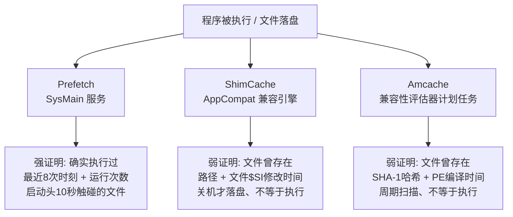
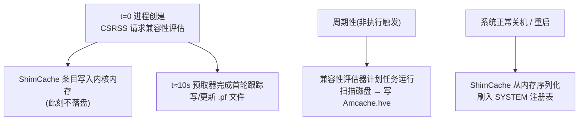
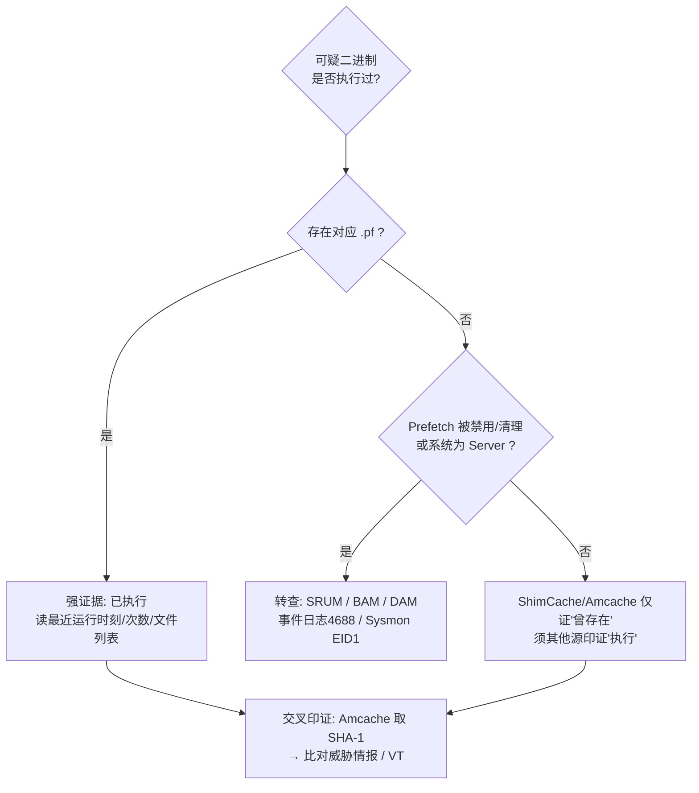

# 数字取证与事件响应（8）· 执行痕迹：Prefetch与Amcache与ShimCache
> [!abstract] TL;DR
> - **Prefetch 是三者中唯一能强证明"程序确实运行过"的痕迹**：它记录最近 8 次运行时刻（Win8+）、累计运行次数，以及进程启动头 10 秒触碰的全部文件列表——后者常能揪出 LOLBin 加载的恶意 DLL/脚本；而 ShimCache 与 Amcache 只证明"文件曾存在于磁盘"，**存在 ≠ 执行**。
> - **写入时机与主体各不相同**：Prefetch 由 SysMain 服务在进程启动约 10 秒后写 `.pf`；ShimCache 常驻内核内存、**仅在正常关机/重启时**序列化刷入 SYSTEM 注册表；Amcache 由计划任务"Microsoft 兼容性评估器"**周期性扫描**磁盘生成——都不是"一执行就落盘"。
> - **时间戳语义必须分清**：Prefetch 的"最近运行时间"是真实执行时刻（UTC），而 ShimCache/Amcache 携带的多是目标文件的 `$STANDARD_INFORMATION` 修改时间与 PE 编译时间——**可被时间戳篡改、可被攻击者伪造**，绝不能当执行时间用。
> - **Amcache 的最大价值是 SHA-1 文件哈希**：即便样本已被删除，凭 Amcache 里的哈希也能回溯 VirusTotal/威胁情报，锁定已知恶意家族。
> - **取证工程要点**：ShimCache 要读"关机前"那份、实时系统需从内存 dump（Volatility `shimcachemem`）；`Amcache.hve` 与 `SYSTEM` 都要先重放事务日志（`.LOG1/.LOG2`）；Prefetch 在 Windows Server、SSD 策略或被清理时可能整片缺失。多源交叉印证永远胜过单一痕迹下定论。

## 概述与定位

"执行痕迹（Evidence of Execution）"回答应急响应里最尖锐的一个问题：**这台机器上，某个可疑程序到底有没有跑起来？如果跑了，什么时候跑的、跑了几次、从哪个路径跑的、跑起来又碰了哪些文件？** 攻击者可以删掉落地样本、清空事件日志、卸载工具，但 Windows 为了"性能优化"和"应用兼容性"这两件与安全毫不相干的事，会在系统各处留下大量执行副产物。取证人员正是靠这些"设计时压根没打算当证据用"的痕迹，把已被清场的攻击链重新拼回来。

本篇聚焦三大执行痕迹：**Prefetch（预取文件）**、**Amcache（应用兼容性缓存 hive）**、**ShimCache（AppCompatCache / 应用兼容性缓存）**。它们常被并称为"执行证据三件套"，但三者的证明力天差地别——把它们混为一谈、笼统地说"ShimCache 里有就是执行过了"，是 DFIR 报告里最常见、也最致命的误判。本篇会把每一个的"能证明什么、不能证明什么"钉死。

在整个系列的坐标系里，本篇处在"Windows 痕迹"这一段的中枢：它上承 [[05.Windows磁盘取证痕迹]] 的文件系统层证据、[[06.Windows注册表取证]] 的注册表结构（ShimCache/Amcache 本质就是注册表 hive）、[[07.Windows事件日志分析]] 的进程创建日志 4688/Sysmon EID1，下启 [[11.时间线分析与超级时间线]] 里把所有时间点熔进一条超级时间线。执行痕迹的上游是 [[50.恶意代码分析与免杀对抗/08.持久化技术大全]] 与 [[50.恶意代码分析与免杀对抗/06.进程注入技术全谱]]——攻击者跑的正是这些东西，而痕迹就是它们留下的脚印。

## 原理与机制

三件套的取证价值，全是操作系统三个"善意功能"的意外泄漏。要读懂痕迹，先得读懂微软**为什么**要造它们。

### Prefetch：为"冷启动加速"而生

程序第一次启动时，代码页、依赖 DLL、配置文件散落在磁盘各处，CPU 触发一连串分页缺页（page fault），机械硬盘磁头来回寻道，冷启动因此很慢。Windows 的**预取器（Prefetcher）**在进程启动后的**头约 10 秒**里，跟踪 Cache Manager 缺页记录——精确到"读了哪个文件的哪些偏移"，把这份"访问轨迹"序列化进 `C:\Windows\Prefetch\` 下的 `.pf` 文件。下次再启动同一程序时，**SysMain 服务**（Win8 前叫 Superfetch）读出这份轨迹，把相关页**顺序、提前**批量读入内存，冷启动就快了。

为了让预取器决定"哪些文件值得优先预读、这条轨迹还新不新鲜、该不该淘汰老轨迹"，`.pf` 里必须记账：**这个程序跑过几次（运行计数）、最近一次什么时候跑的（运行时间）、跑起来引用了哪些文件（文件列表）**。这三项记账字段，恰好就是取证的金矿——它们的存在纯属功能副产物。Prefetch 自 Windows XP（2001）引入，**在 Windows Server 版上默认关闭**（服务器不在乎桌面应用启动速度），这是取证时第一个要意识到的边界。

### ShimCache：为"应用兼容性垫片"而生

老程序在新 Windows 上可能崩溃，微软用**垫片（Shim）**在加载时给它打补丁——伪造系统版本号、重定向注册表/文件路径等。要决定"这个 exe 需不需要打垫片"，兼容性引擎（位于 CSRSS/AppCompat 一侧）会在**进程即将创建时**拿该文件去比对兼容性数据库（`sysmain.sdb`）。为避免对同一个没改动过的文件反复比对，它把比对结论**以"路径 + 文件最后修改时间"为键**缓存进 `AppCompatCache`。所以一条 ShimCache 条目的含义是"**兼容性引擎评估过这个文件**"——它确实在进程创建时评估，但**从 Vista/2008 起，用 explorer 浏览一个目录、让某个 exe 在窗口里可见，也会为它生成条目**。这就是"存在 ≠ 执行"的机制根源。

这个缓存**常驻内核内存**，只有在**系统正常关机/重启时**才序列化写入 `SYSTEM` 注册表（Win7 起如此），这样才能跨重启保留。于是产生了取证上最反直觉的一条铁律：**实时运行的系统里，最新的 ShimCache 条目只在内存里、离线镜像根本读不到**。而键里存"文件最后修改时间"是为了做缓存失效判断（文件改了就得重新评估），这解释了为什么 ShimCache 的时间戳是**文件时间、不是执行时间**。

### Amcache：为"升级兼容性评估"而生

Amcache 属于 Windows 升级遥测/兼容性体系。计划任务 `\Microsoft\Windows\Application Experience\Microsoft Compatibility Appraiser`（Microsoft 兼容性评估器）**周期性地**清点系统上的已安装程序、驱动、可执行文件，评估"下一个 Windows 版本会不会让它们坏掉"，把元数据（发布者、版本、**SHA-1 哈希**、PE 编译日期、二进制类型 pe32/pe64 等）写进专用 hive `C:\Windows\AppCompat\Programs\Amcache.hve`。关键在于：它是**盘点式、周期触发**的，**不是执行触发**。所以 Amcache 的时间戳反映的是"评估器几点扫到了这个文件"，条目的存在反映"文件当时在盘上"——同样不等于执行。SHA-1 本是给微软比对已知程序库用的，落到取证手里成了识别已知恶意样本的利器。

下图把"谁写、写什么、能答什么"一图钉死：



## 结构与算法详解

这一段把三种痕迹的二进制/hive 结构、命名哈希算法、以及所有时间戳的语义拆到字节级。

### Prefetch 文件格式与 MAM 压缩

`.pf` 文件名形如 `CALC.EXE-02CD573A.pf`：前半是**大写可执行文件名**，后半 8 位十六进制是**路径哈希**。从 Windows 10 起，`.pf` 在磁盘上是 **MAM 压缩**的，外层包一层：

```
偏移   大小   字段
0x00   3      "MAM" (0x4D 0x41 0x4D)
0x03   1      压缩算法 (0x04 = Xpress Huffman)
0x04   4      解压后大小 (小端)
0x08   ...    Xpress-Huffman 压缩数据
```

解压后（或 Win10 前直接）是 SCCA 主体，头部布局：

```
偏移   大小   字段
0x00   4      版本 (0x1E=30 Win10/11; 0x1A=26 Win8/8.1; 0x17=23 Vista/7; 0x11=17 XP)
0x04   4      签名 "SCCA" (0x53 0x43 0x43 0x41)
0x08   4      0x11000000 (固定)
0x0C   4      文件总大小
0x10   60     可执行文件名 (UTF-16LE, 0x0000 结尾, 最长30字符)
0x4C   4      Prefetch 哈希 (与文件名后缀十六进制一致)
0x50   4      标志位
```

主体之后是文件信息段，包含：**文件度量数组（Metrics）**、**轨迹链数组（Trace Chains）**、**文件名字符串块**（引用到的所有文件的完整路径）、**卷信息块**（卷序列号、创建时间、设备路径）。以及取证最看重的两项：**最近运行时间数组**——Win8+ 是 **8 个 FILETIME** 的环形缓冲（保留最近 8 次执行，第 9 次挤掉最老的），Win7 只存 1 个；**运行计数**（自首次执行以来累计次数）。

**为什么文件列表是宝**：它是进程启动头 10 秒实际读过的所有文件的完整路径。对 `rundll32.exe`、`regsvr32.exe`、`powershell.exe`、`wscript.exe`、`mshta.exe` 这类"living-off-the-land"宿主，Prefetch **不记录命令行参数**，但它的文件列表里常常赫然躺着被加载的恶意 `.dll`、被执行的 `.js/.vbs/.ps1` 脚本、被打开的诱饵文档路径——这是从一个看似无害的系统进程反查真实载荷的关键跳板。

**命名哈希算法**：文件名后缀的哈希由内核函数 `CcPfHashValue` 对**可执行文件的大写设备路径**计算得出（由 Yogesh Khatri 逆向、Hexacorn 公开）。XP 版：

```python
# 常量: RNDM_CONSTANT = 314159269, RNDM_PRIME = 1000000007
def ssca_xp_hash(path_upper):      # path_upper: 大写 UTF-16 设备路径
    h = 0
    for ch in path_upper:
        h = ((h * 37) + ord(ch)) & 0xFFFFFFFF
    h = (h * 314159269) & 0xFFFFFFFF
    if h > 0x80000000:
        h = 0x100000000 - h
    return (abs(h) % 1000000007) & 0xFFFFFFFF
```

Vista/7 版更简单，以圆周率数字 `314159` 作种子，省掉末尾质数取模：`h = 314159; 逐字符 h = (h*37 + ord(ch)) & 0xFFFFFFFF`。这个算法有两个直接的取证推论：

1. **哈希只吃路径、不吃命令行参数**——所以带不同参数跑同一 exe 会命中同一个 `.pf`，运行计数累加进同一文件；
2. **同名 exe、不同哈希的多个 `.pf` = 从多个不同路径执行过**。经典场景：攻击者把恶意程序命名成 `svchost.exe` 放进非系统目录运行，磁盘上会出现第二个 `SVCHOST.EXE-<另一个哈希>.pf`——正常系统只有系统路径那一个。反向利用哈希算法可以**为磁盘上每个 exe 预算出其应有的路径-哈希对照表**，再拿去比对 Prefetch 目录，异常一目了然。

补充：`NTOSBOOT-B00DFAAD.pf` 是开机引导预取轨迹，`Layout.ini`、`ReadyBoot\` 与启动优化相关，非应用执行证据。

### ShimCache（AppCompatCache）二进制格式

ShimCache 是 `SYSTEM` hive 里一个二进制值：`SYSTEM\CurrentControlSet\Control\Session Manager\AppCompatCache\AppCompatCache`（Vista 起；XP 32 位在 `...\AppCompatibility\AppCompatCache`）。头部魔数随版本变，是判版依据：

```
版本                    魔数              条目上限
Windows XP (32位)       0xDEADBEEF        96
Server 2003             0xBADC0FFE        512
Vista / 7 / 8 / 8.1     0xBADC0FFE        1024
Windows 10 / 11         "10ts"(逐条签名)   1024
```

Win7（64 位）单条目布局，以及那个聚讼多年的执行标志位：

```
偏移   大小   字段
0x00   2      路径长度
0x02   2      路径最大长度
0x04   4      填充
0x08   8      路径偏移 (指向路径字符串区)
0x10   8      最后修改时间 FILETIME (来自目标文件 $STANDARD_INFORMATION)
0x18   4      插入标志 InsertFlags
0x1C   4      Shim 标志
0x20   8      数据长度
0x28   8      数据偏移
```

`InsertFlags` 枚举里 **`Executed = 0x00000002`**（`Unknown1=0x1`、`Unknown4=0x4`）——Vista 到 8.1 期间，该位置 1 **曾被认为**表示"已执行"。Win10/2016 起微软**移除了这个执行标志**，改用一个更隐晦的信号：条目 **Data 字段的最后 4 字节若为 `01 00 00 00` 则暗示已执行**（AppCompatCacheParser 会解析这一位）。

但**这两个执行信号都极不可靠，务必当心**：其一，Win10 的"末 4 字节"机制**只对非原生 Windows 二进制生效**，且**假阴性严重**——很常见的情况是某程序有 Prefetch 铁证证明跑过、其 ShimCache 的 `InsertFlag/末4字节`却是"未执行"。所以它只能用来**佐证**执行、**绝不能用来排除**执行。其二，Vista 起 explorer 浏览目录就会给目录内可见的 exe 建条目，根本没跑过。**结论：把 ShimCache 当"存在过 + 文件最后修改时间"来用，别把它当执行日志。**

ShimCache 的两个致命工程边界：**① 只在关机/重启时落盘**——实时系统的最新条目只在内存，离线取证读不到，要么正常关机后再取，要么用 Volatility 从内存 dump；**② 条目顺序是"缓存插入序（近似 MRU）"、不是严格执行序，且没有任何执行时间戳**，唯一的时间戳是可被 timestomp 篡改的文件 `$SI` 修改时间。

### Amcache hive 结构与 FileID

`Amcache.hve` 是标准注册表 hive（`regf` 格式），前身是 Win7 的 `RecentFileCache.bcf`。它经历过一次大改版：

- **旧格式（Win8 / 早期 Win10）**：`Root\File\{卷GUID}\<FileID>`。`FileID` 由目标文件的 MFT 引用派生（`0000` 前缀 + MFT 序号）。值名是一堆晦涩的十六进制编号（如 `15`=完整路径、`101`=SHA-1、`f`=PE 编译时间、`11`=文件 `$SI` 修改时间、`17`=链接日期、`100`=ProgramId）。
- **新格式（Win10 1607+）**：`Root\InventoryApplicationFile\<名称>|<哈希>`，值名改成人类可读，常见字段：

```
LowerCaseLongPath   完整路径(小写)
Name                文件名
FileId              "0000" + 文件 SHA-1        ← 取证最值钱
Size / BinaryType   大小 / pe32|pe64
ProductName / Version / Publisher / ProgramId
BinFileVersion      PE 版本资源里的文件版本
LinkDate            PE 头编译时间戳(字符串)     ← 攻击者可伪造
Usn                 USN 日志序号
```

以及并列的 `Root\InventoryApplication`（已安装程序）、`Root\InventoryDriverBinary`（驱动，含驱动 SHA-1，查 BYOVD/恶意驱动神器）等分支。

**FileID 里藏着 SHA-1** 是 Amcache 最大的实战价值：样本即便被删，你仍握有它的 SHA-1，可直接砸进 VirusTotal / 威胁情报平台确认家族与 IOC。但要牢记**历史教训**：早年有人把 `Root\File\` 条目当"执行证据"，Blanche Lagny（ANSSI，2019）的系统研究表明这**并不可靠**——Amcache 本质是**盘点**，大量条目只是被评估器扫到、从未执行。所以 Amcache 的正确定性是：**存在 + 哈希 + 元数据，执行信号很弱。**

### 时间戳解读：全篇最易翻车之处

三件套里每个时间戳的"语义"完全不同，混用就是错案：

```
证据             时间字段               真实语义                     可信度 / 陷阱
Prefetch         最近运行时间(≤8个)     进程实际启动时刻(UTC)         高; 仅保留最近8次
Prefetch         运行计数               自首次以来执行次数            高; 删pf清零、上限滚动
Prefetch .pf     MFT 创建时间           ≈ "首次执行" + ~10s          高; 可被timestomp
Prefetch .pf     MFT 修改时间           ≈ "最近执行" + ~10s          高
Amcache          键 LastWrite           评估器扫到该文件的时刻        中; 非执行时刻
Amcache          LinkDate               PE 编译时间(来自PE头)         低; 攻击者可任意伪造
Amcache          "11"/最后修改          目标文件 $SI 修改时间         低; 可timestomp
ShimCache        最后修改时间           目标文件 $SI 修改时间         低; 可timestomp、非执行时间
ShimCache        (无任何执行时间戳)     —                            —
```

**"约 10 秒"规则**值得单独讲：预取器在进程启动后约 10 秒才写/更新 `.pf`，所以 `.pf` 自身的 MFT 时间比进程真实启动晚约 10 秒，而 `.pf` **内部**的"最近运行时间"FILETIME 才是进程启动那一刻。取证时用**内部时间**定执行时刻，用**外部 MFT 时间**做交叉校验（两者背离约 10 秒是正常的，若严重不符要警惕 timestomp）。所有这些 FILETIME 都是 **UTC**，写进时间线前统一按 UTC 处理，再落地到调查时区。

下图把"一次执行"里各痕迹的落盘时机拉直，解释为什么它们的时间戳不能等同：



## 工具视角与实战

主力是 **Eric Zimmerman 工具集（EZ Tools）**，配 Volatility、RegRipper、KAPE。

**Prefetch —— PECmd**：
```
PECmd.exe -d C:\Windows\Prefetch --csv out\ --csvf pf.csv
PECmd.exe -f C:\Windows\Prefetch\POWERSHELL.EXE-59F99B9A.pf
```
输出含：可执行名、运行次数、**最多 8 个运行时刻**、卷信息、**完整文件引用列表**。`-k` 可高亮关注关键字。它自动处理 Win10 的 MAM 解压。NirSoft 的 `WinPrefetchView` 是轻量 GUI 替代。

**ShimCache —— AppCompatCacheParser**：
```
AppCompatCacheParser.exe --csv out\ -f C:\Windows\System32\config\SYSTEM
# 不加 -f 则解析当前活动系统的注册表
```
它跨 XP/7/8.x/10/11 自动判版，输出路径、最后修改时间、以及尽力而为的 `Executed` 列（Win10 常显示 NA）。**离线镜像务必解析 `SYSTEM` hive 文件**，并注意选对 ControlSet（经 `Select\Current` 映射）。要拿"关机前内存里那份"，用 **Volatility3/2 的 `shimcachemem`** 插件从内存镜像提取——这是绕过"只在关机落盘"限制的唯一正道。Mandiant 的 `ShimCacheParser.py` 是老牌 Python 替代。

**Amcache —— AmcacheParser**：
```
AmcacheParser.exe --csv out\ -f C:\Windows\AppCompat\Programs\Amcache.hve -i
```
输出 `UnassociatedFileEntries`（含路径、**SHA-1**、编译时间、大小、发布者）与程序/驱动清单。RegRipper 的 `amcache`、`appcompatcache` 插件是经典轻量方案。

**采集与事务日志重放**：`Amcache.hve` 和 `SYSTEM` 在实时机上被独占锁定，需用 **KAPE**（目标 `RegistryHives`/`Amcache`）、FTK Imager 或 RawCopy 走原始 NTFS 读取或卷影副本（VSS）拿出。**极关键的一步**：hive 取出后往往是"脏"的（有未提交的事务日志页），必须**重放 `.LOG1/.LOG2`** 才能得到一致快照——EZ Tools 会自动重放，手工用 python `regipy`/`registry` 处理时别忘了。

**调查工作流（相关性分析）**：单一痕迹永远不下定论，标准套路是拿"是否执行过某可疑二进制"去逐级印证：



三件套之外，别忘了**相邻执行痕迹**（细节见 [[06.Windows注册表取证]]、[[07.Windows事件日志分析]]）：**BAM/DAM**（`SYSTEM\...\Services\bam\State\UserSettings\<SID>`，Win10 1709+，**按用户按 exe 记最近一次执行时间**，是难得的"执行时间"来源）、**SRUM**（应用资源用量数据库，含运行时段与网络字节）、**UserAssist**（GUI 交互式启动计数与时间）、**MUICache**、**Jump Lists**。ShimCache/Amcache 的短板（无可靠执行/执行时间），恰好由 Prefetch、BAM、SRUM、4688/Sysmon 补齐——**多源合围才是硬证据。**

## 安全性与正确使用

**取证证明力的边界（本节最核心）**：把三件套的证明力说准，直接决定报告能不能在法庭/事件定性上站住：

- **Prefetch = 执行的强证据**。有 `.pf` 基本等于该 exe 确实运行过，且能给出可信的执行时刻与次数。但**缺失不等于没执行**：Server 默认无 Prefetch、SSD 策略或 `EnablePrefetcher=0` 会关闭、攻击者可主动删 `.pf` 或触发上限滚动淘汰。"没有 Prefetch"只能说"无此证据"，不能反推"没运行"。
- **ShimCache / Amcache = 存在的证据，不是执行的证据**。写报告时严禁用一句"ShimCache 里有 X，故 X 被执行"——它可能只是被 explorer 浏览目录或被评估器扫描而登记。**过度解读 ShimCache/Amcache 的执行含义，是本领域最常见的举证错误。**
- **时间戳可被篡改**。ShimCache/Amcache 携带的是文件 `$SI` 修改时间与 PE 编译时间，二者都在攻击者控制范围内（timestomp、伪造编译戳）。真正抗篡改的"执行时刻"来自 Prefetch 内部运行时间、BAM、SRUM、4688。交叉印证时，若某源时间与其它源系统性背离，优先怀疑该源被动过手脚。

**反取证与失败模式**：攻击者会删 `.pf`、清 Prefetch 目录、设 `EnablePrefetcher=0`、从不落盘的位置（如纯内存执行、`\\?\` 长路径、可移动介质策略下）规避预取；也会 timestomp 让文件时间错位。但 ShimCache **只在关机落盘**这一特性反而利于防守——攻击者难以在不重启的情况下"清掉内存里那份"，取证方从内存 dump 常能拿到未落盘的真相。Amcache 的 SHA-1 也难被清理者一并抹掉（它在独立 hive 里，很多清理工具只盯事件日志和 Prefetch）。

**防守方加固建议**：**不要为了"省空间/性能"去禁用 Prefetch 与 SysMain**——那等于亲手销毁执行证据；桌面端应保持开启。用 **Sysmon（EID1 进程创建，含命令行、哈希、父进程）+ 进程创建审计（4688 开启命令行记录）** 主动补齐三件套天生的短板（无参数、无可靠执行时间）。对关键主机，将 `SYSTEM` hive、`Amcache.hve`、Prefetch 目录纳入定期离线备份/日志转发，抵御"关机前内存态丢失"和事后清理。理解这些机制本身不构成攻击能力，但**用错它们下结论**会造成误判甚至冤枉——这才是本篇要防的"误用"。

## 小结

Prefetch、Amcache、ShimCache 都是操作系统性能/兼容功能的副产物，却成了应急响应里重建"谁跑了什么、何时跑的"的支柱。**记住一句话就抓住了全篇：Prefetch 证明"执行"，ShimCache 与 Amcache 只证明"存在"。** Prefetch 给你可信的执行时刻（最近 8 次）、次数与"头 10 秒文件列表"这条反查载荷的暗道；Amcache 给你抗删除的 SHA-1 去锚定威胁情报；ShimCache 给你一部可回溯上千条、连被删文件都还在册的"曾存在名录"，但它没有可靠执行标志、只在关机落盘、时间戳还能被篡改。工程上，ShimCache 要读关机前那份或从内存 dump，hive 要先重放事务日志，Prefetch 可能整片缺席。任何单一痕迹都不足以定案——把三件套与 BAM/SRUM/4688/Sysmon 熔进同一条时间线，让多源互相印证、互相证伪，才是执行痕迹分析的正确姿势，也正是下一步 [[11.时间线分析与超级时间线]] 要做的事。

## 相关阅读

- 同系列上下文：[[00.数字取证与事件响应总览|系列总览]]、[[07.Windows事件日志分析]]（4688/Sysmon EID1 补齐执行时间与命令行）、[[06.Windows注册表取证]]（ShimCache/Amcache 的 hive 结构、BAM/UserAssist）、[[05.Windows磁盘取证痕迹]]（`.pf` 的 MFT 时间与 `$SI`/timestomp）、[[11.时间线分析与超级时间线]]（多源痕迹熔炼）
- 攻击上游对照：[[50.恶意代码分析与免杀对抗/08.持久化技术大全]]、[[50.恶意代码分析与免杀对抗/06.进程注入技术全谱]]、[[38.Windows内核与驱动逆向/11.Rootkit原理与检测]]（Amcache `InventoryDriverBinary` 查恶意/BYOVD 驱动）
- 网络与硬件呼应：[[72.抓包与协议分析实战/19.网络取证与流重组]]、[[39.固件与IoT嵌入式逆向/22.eMMC与NAND芯片级取证]]（底层介质提取被抹除的 hive/`.pf`）
- 权威格式与研究文献：libyal/**libscca**《Windows Prefetch File (PF) format》（Joachim Metz，Prefetch 结构权威）；Hexacorn《Prefetch Hash Calculator》与 Yogesh Khatri（swiftforensics）对 `CcPfHashValue` 的逆向；Mandiant/FireEye《Leveraging the Application Compatibility Cache in Forensic Investigations》（Andrew Davis，ShimCache 白皮书）；Blanche Lagny《Analysis of the AmCache》（ANSSI，2019，Amcache 权威研究）；Eric Zimmerman《EZ Tools》官方文档（PECmd / AppCompatCacheParser / AmcacheParser）；SANS FOR500/FOR508《Windows Forensic Analysis》海报与教材；microsoft-learn 关于 SysMain（Superfetch）与 Application Compatibility 的官方说明。

[[00.数字取证与事件响应总览|⬆ 系列总览]] | [[07.Windows事件日志分析|← 上一章]] | [[09.Linux取证与痕迹分析|→ 下一章]]
