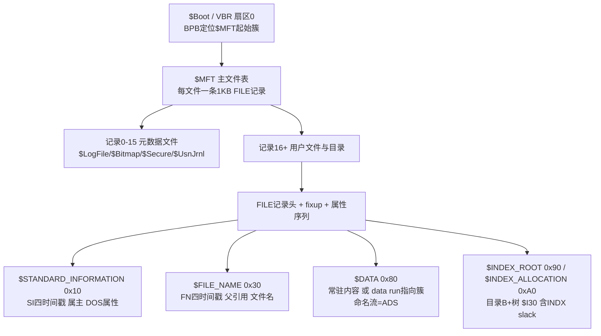
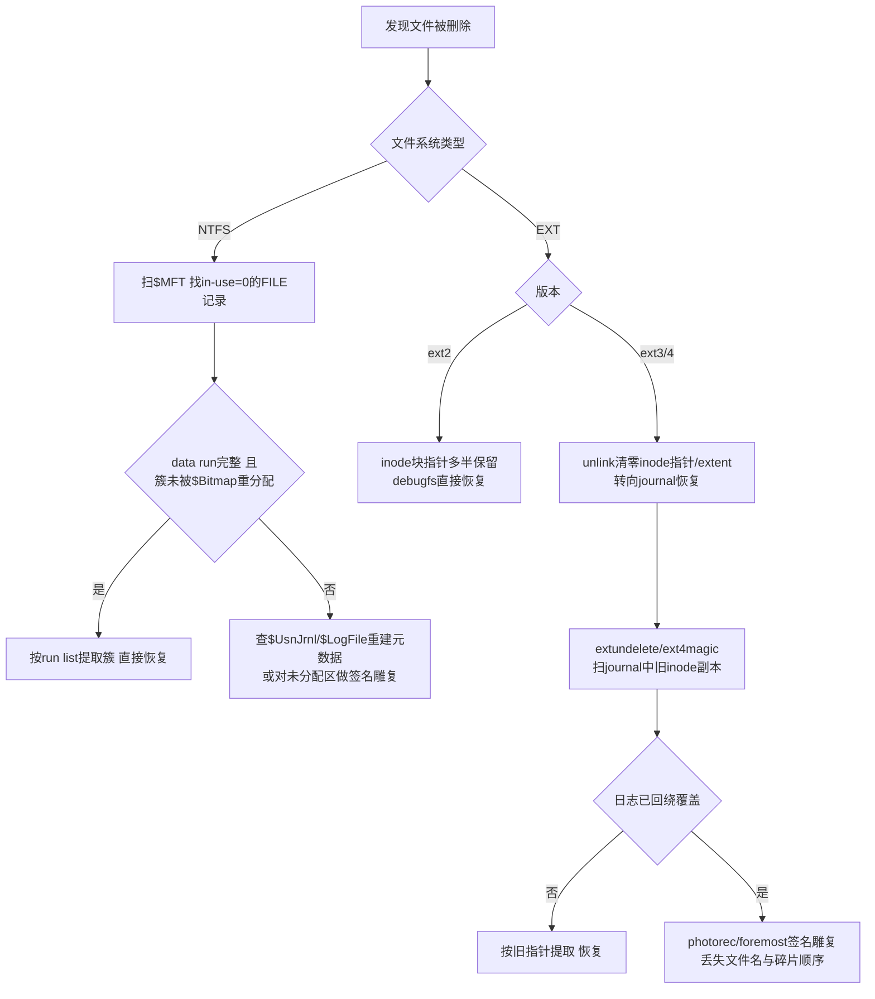
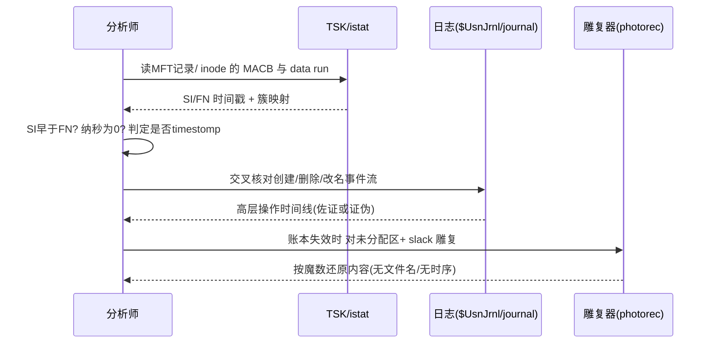

# 数字取证与事件响应（10）· 文件系统取证：NTFS与EXT
> [!abstract] TL;DR
> - 文件系统是元数据与内容的分离账本：NTFS 把一切抽象为 `$MFT` 中的「记录+属性」，EXT 沿袭 Unix 的「inode+块组」，取证的本质是绕过 OS API、直接读这两套账本与它们的「历史残渣」。
> - 时间戳是双份的：NTFS 有 `$STANDARD_INFORMATION`（SI，用户可改）与 `$FILE_NAME`（FN，内核维护）两组各 4 个 MACB；EXT4 有 atime/mtime/ctime/crtime/dtime。SI 与 FN、`$UsnJrnl` 的交叉比对是识别时间戳篡改（timestomping）的核心手法。
> - 删除恢复取决于版本与设计：NTFS 只清 in-use 标志、data run 常留存故易恢复；EXT2 保留块指针可直接恢复，EXT3/4 删除时清零 inode 指针/extent，只能靠 journal 旧副本或签名雕复。
> - slack 空间（RAM slack / 文件 slack / MFT slack / INDX slack / 卷 slack）是簇分配粒度与「不清零」策略共同制造的历史数据坟场，既是取证富矿，也是反取证藏匿点。
> - The Sleuth Kit（fls/istat/icat/blkls）提供文件系统无关的统一视角，MFTECmd/analyzeMFT、debugfs/extundelete/ext4magic 各司其职，photorec 则在账本失效后做最后的签名雕复。

## 概述与定位

文件系统取证处在磁盘取证栈的中间层：下面是[[02.证据保全与取证镜像|扇区级的镜像]]，上面是操作系统与应用留下的[[05.Windows磁盘取证痕迹|各类痕迹]]。它回答的核心问题只有一句——**磁盘上真实发生过什么，而不是操作系统愿意告诉你什么**。文件浏览器、`dir`、`ls` 看到的是文件系统驱动愿意呈现的「当前一致视图」；而取证要的是被删除的、被改时间的、藏在簇尾巴里的、以及日志里尚未被覆盖的那部分真相。因此本篇不谈「如何用系统 API 读文件」，而是把 NTFS 与 EXT 的**盘上结构**拆开，直接在字节层解释三件事：时间戳到底存在哪、怎么被信任或被欺骗；文件删除后残骸落在何处、能否重建；以及分配粒度制造的 slack 空间藏了什么。

选 NTFS 与 EXT 是因为它们覆盖了绝大多数取证现场：Windows 端点、服务器几乎全是 NTFS；Linux 主机、容器宿主、大量嵌入式与安卓底层则是 EXT4。二者出身不同——NTFS 是 1993 年为 Windows NT 从零设计的「一切皆文件、一切皆属性」的统一模型；EXT 系（ext2/3/4）是 1990 年代 Linux 对传统 Unix FFS 的继承与渐进改良。这种设计哲学的差异，直接决定了它们时间戳的份数、删除后的可恢复性、以及日志的取证价值，构成本篇横向对比的主线。

本篇是[[11.时间线分析与超级时间线|下一篇超级时间线]]的原料供给者：只有先在文件系统层把每个 MACB 时间戳的语义、来源、可信度讲清楚，超级时间线里成千上万条事件才不会被误读。它也与[[09.Linux取证与痕迹分析|Linux 取证]]、[[05.Windows磁盘取证痕迹|Windows 磁盘痕迹]]互补：那两篇讲「痕迹在哪个文件里」，本篇讲「文件本身在盘上如何存在与消亡」。

## 原理与机制

### NTFS：以 $MFT 为中心的属性宇宙

NTFS 的第一性原理是「一切皆文件，一切皆记录，一切皆属性」。卷的元数据本身也是文件：卷从扇区 0 的 `$Boot`（VBR，内含 BPB）出发，BPB 给出每簇扇区数、`$MFT` 起始簇号等关键定位参数。`$MFT`（Master File Table，主文件表）是整个文件系统的心脏——**每一个文件、每一个目录，都是 `$MFT` 里的一条定长记录**（通常 1024 字节）。记录以 `FILE` 签名开头（损坏时为 `BAAD`），前 16 条（0–15）是元数据文件：

- `$MFT`（0）自描述、`$MFTMirr`（1）前几条的镜像备份、`$LogFile`（2）元数据事务日志、`$Volume`（3）、`$AttrDef`（4）、`.`（5，根目录）、`$Bitmap`（6，簇分配位图）、`$Boot`（7）、`$BadClus`（8）、`$Secure`（9，去重后的安全描述符 SDS/SDH/SII）、`$UpCase`（10，大小写映射）、`$Extend`（11，内含 `$UsnJrnl`/`$Quota`/`$ObjId`/`$Reparse`）。

一条 MFT 记录的主体是一串**属性**（attribute），每种属性有类型号：`$STANDARD_INFORMATION`(0x10)、`$ATTRIBUTE_LIST`(0x20)、`$FILE_NAME`(0x30)、`$DATA`(0x80)、`$INDEX_ROOT`(0x90)/`$INDEX_ALLOCATION`(0xA0)（目录 B+ 树，名为 `$I30`）等。这套统一模型的威力在于：文件内容不过是一个 `$DATA` 属性；一个文件可以有多个 `$DATA`——这就是**交换数据流（ADS）**，`file.txt:hidden` 的秘密数据在资源管理器里完全不可见，却是同一条 MFT 记录的另一个命名 `$DATA` 属性，属于经典藏匿手法。

属性分**常驻（resident）**与**非常驻（non-resident）**：小文件（约 700–900 字节以内）的 `$DATA` 直接躺在 1KB 的 MFT 记录内部；超出后转为非常驻，记录里只保留一串 **data run（簇运行）**，用极致紧凑的变长编码描述「逻辑簇 VCN → 物理簇 LCN」的映射。这条 run list 是 NTFS 恢复与雕复的关键，下一节会拆到字节。

还有一个逆向时必踩的坑——**fixup（更新序列数组，USA）**：为了检测坏扇区导致的记录撕裂，NTFS 把每个 512 字节扇区的最后 2 字节替换为一个序列号，原始 2 字节存到记录头的 USA。读取时工具必须把它们换回来，否则解析到扇区边界处的属性就会错位。手写 MFT 解析器如果不做 fixup，跨扇区的 data run 或文件名会莫名其妙断裂。

### EXT：inode 与块组的 Unix 血统

EXT 系没有「一切皆属性」的野心，它忠实继承 Unix：**inode 描述一个文件的全部元数据（除了文件名），目录只是「名字→inode 号」的映射表**。磁盘被切成若干**块组（block group）**，每组自带超级块副本、组描述符、块位图、inode 位图、inode 表与数据块。超级块位于偏移 1024 字节处，魔数 `0xEF53`，记录总块数、总 inode 数、每组块数等。inode 数量在 `mkfs` 时就固定，用完即使有空间也无法建新文件——这与 NTFS 的 `$MFT` 可动态增长形成鲜明对比。

inode 里存 mode（类型+权限）、UID/GID、大小、链接计数、时间戳与**数据块定位信息**。ext2/3 用经典的「12 个直接指针 + 一级间接 + 二级间接 + 三级间接」；ext4 引入 **extent（区段树）**，用「起始逻辑块 + 长度 + 起始物理块」描述连续段，对大文件与顺序存储效率碾压间接块，也顺带改变了删除后的恢复路径。inode 大小从 ext2/3 的 128 字节增到 ext4 默认 256 字节，多出的空间正是用来塞下纳秒时间戳、crtime 与内联扩展属性的。



## 时间戳、删除恢复与 slack 的结构算法详解

这一节把三个种子点拆到算法与字节层，它们恰好也是文件系统取证被问得最多、也最容易被误读的三件事。

### 时间戳：双份 MACB 与篡改识别

取证界用 **MACB** 描述四类时间：M=Modified（内容修改/写入）、A=Accessed（访问）、C=Changed（元数据变更）、B=Birth（创建）。但 NTFS 与 EXT 对「C」的定义不同，且份数不同，这是新手最大的混淆源。

**NTFS 存两组各 4 个 MACB**，分别在 `$STANDARD_INFORMATION`（SI）与 `$FILE_NAME`（FN）里，合计 8 个（若有 8.3 短名还会更多）。二者的区别是取证的关键分水岭：

- **SI 时间戳**由用户态可控——`SetFileTime` API 直接就能改，这正是**时间戳篡改（timestomping）**的靶子。
- **FN 时间戳**由内核在重命名、移动等操作时维护，普通用户态难以直接写；更妙的是，父目录的 `$I30` 索引里还**冗余存了一份 `$FN`**，与 MFT 记录内的 `$FN` 互为佐证。

底层格式上，NTFS 时间戳是 64 位 **FILETIME**：自 1601-01-01 UTC 起的 100 纳秒计数。而 EXT 用自 1970 Unix 纪元的秒数。二者换算关系是取证脚本的常识：

```text
Unix_seconds = (FILETIME - 116444736000000000) / 10^7
    116444736000000000 = 1601→1970 之间的 100ns 间隔数
FILETIME 精度 100ns，SI 理论上带亚秒"噪声"；
许多 timestomp 工具只设到秒 → 低位纳秒字段全 0，成为破绽。
```

**篡改识别的经典启发式**（删掉代码也要能讲清）：其一，SI 时间早于 FN 时间——因为攻击者往往只把 SI 往过去调（后门文件伪装成很老），而 FN 由内核在落地时写下真实时间，于是出现「文件内容改动时间比它被命名的时间还早」的悖论；其二，SI 的亚秒/纳秒字段恰好为 0 或过于整齐——真实文件操作几乎不可能落在整秒上；其三，SI 的创建时间晚于修改时间，逻辑不成立；其四，把 MFT 里的时间与 `$UsnJrnl`（USN 变更日志，记录创建/删除/改名/覆写的高层事件流）、`$LogFile` 的记录交叉对齐，任何时间线的断裂都会暴露。需要清醒的是，这是**军备竞赛**：SetMace 这类高级工具能同时伪造 SI、FN 乃至 `$I30` 索引副本，并补上逼真的纳秒噪声，所以任何单一启发式都不是铁证，必须多源交叉。

**EXT 只有一组时间戳，但语义更细**：atime（访问）、mtime（内容修改）、ctime（**inode 变更**，注意不是创建——权限、属主、链接数变化都会动它）、ext4 新增 crtime（创建/birth）与 dtime（删除时间）。ext2/3 是 32 位秒粒度，注定 2038 年溢出；ext4 在 256 字节 inode 里为每个时间加了 32 位 `_extra` 字段——低 2 位把秒扩展到 34 位（把大限推到 2446 年），高 30 位放纳秒，这种「向后兼容的位打包」是工程上的经典折中。要注意 crtime **传统 `stat()` 不返回**，得靠 `debugfs -R "stat <inode>"` 或 Linux 4.11+ 的 `statx()` 才能读到；dtime 在存活文件里恒为 0，非 0 即意味着该 inode 曾被删除，它同时兼作孤儿 inode 链表的指针。

一个跨平台陷阱：Windows Vista 起默认关闭 last-access 更新（`NtfsDisableLastAccessUpdate`）以省性能，Linux 挂载常用 `relatime`/`noatime`，所以 **atime 在现代系统上普遍不可信**，别拿它当「文件最后被看过」的证据。

### 删除恢复：三种命运

文件「删除」从来不是「擦除」，它只是解除账本引用。但不同文件系统解除得多彻底，决定了恢复难度天差地别。

**NTFS——最宽容**：删除只做两件事——把 MFT 记录头偏移 0x16 的 in-use 标志位清 0，并在 `$Bitmap` 把该文件占用的簇标记为空闲。**MFT 记录本身与其中的 data run 通常原封不动地留着**，直到该记录被新文件复用、或那些簇被重新分配写入。因此恢复算法是：扫描 `$MFT` 找 in-use=0 但仍带完整 `$FILE_NAME` 与 `$DATA` run 的记录，只要目标簇尚未被 `$Bitmap` 重分配覆盖，就照 run list 把簇拼回来。回收站另有玄机：`$Recycle.Bin` 下 `$I` 文件存元数据（原路径、删除时间、大小），`$R` 文件存内容。

**EXT2 vs EXT3/4——分水岭在于"清不清指针"**：ext2 删除时把目录项解链、inode 链接数减到 0、置 dtime、在位图标记空闲，但**inode 里的块指针历史上不清零**，于是 debugfs、e2undel 能顺着旧指针直接把数据捞回。ext3 为了日志一致性，在 unlink 时对文件做截断（truncate to 0），**把 inode 的块指针写成 0**——恢复的「地图」被撕毁了；ext4 同理清空 extent 树。这一改动让「从 inode 恢复」在 ext3/4 上几乎失效，恢复战场被迫转移到 **journal**：`$journal`（inode 8）是循环日志，其中可能残留删除前**已提交的旧 inode 表块副本**，extundelete、ext4magic 正是去扫这些旧副本、抢在日志回绕覆盖之前把块指针/extent 找回来。

还有一条常被忽视的线索——**目录项的"缝隙"**：EXT 删除文件时并不抹掉目录项，而是把**前一条目录项的 `rec_len` 拉长以跳过它**，被删项的文件名与 inode 号往往仍完整躺在缝隙里。解析目录块的原始字节，就能捞回「谁曾经在这个目录里、它的 inode 是几号」——即便 inode 已被复用，文件名这条元数据仍有巨大情报价值。



当账本彻底失效（记录复用、指针清零、日志回绕），最后的手段是**文件雕复（carving）**：不依赖任何文件系统结构，扫描未分配区与 slack，靠文件头/尾魔数（如 JPEG 的 `FF D8…FF D9`、PDF 的 `%PDF…%%EOF`）把内容切出来。代价是丢失文件名、时间戳，且对**碎片化文件**（非连续存储）束手无策——雕复默认假设文件是连续簇，一旦碎片就会拼错。

### slack 空间：分配粒度制造的历史坟场

slack 的根源是**分配粒度**：文件系统按「簇」（NTFS，默认 4KB=8 扇区）或「块」（EXT）分配，而文件大小极少恰好是簇的整数倍，于是最后一个簇总有尾巴用不满。这条尾巴不被清零，就成了历史数据的坟场。按位置细分：

```text
一个簇 = 若干扇区(512B)。文件末尾落在最后一个扇区中间：
[....文件真实内容....][RAM slack][........文件/驱动 slack........]
                       扇区内剩余      从下一扇区起到簇尾
- RAM slack：文件结尾到"当前扇区"末尾。DOS/Win9x 时代用内存内容填充
  (可能泄露内存明文)，现代 NTFS/Windows 已零填充。
- 文件slack(drive slack)：从下一个未用扇区到簇尾。OS不清零，
  保留着这些扇区上"上一个被删文件"的残骸 —— 取证富矿 / 反取证藏匿点。
```

除了文件 slack，NTFS 还有几处独特的 slack：**MFT slack**——一条 1KB 记录被复用、或大的常驻属性被换成小属性时，记录尾部会残留旧文件的常驻内容或旧文件名，即便原文件早已「消失」；**INDX slack**——目录的 `$I30` 是 B+ 树，节点（INDX 记录，通常 4KB）删除条目后**不做压缩收缩**，被删的目录项连同其 `$FN` 四时间戳仍留在节点未用区，`INDXParse` 这类工具能在 MFT 记录都被复用后，仍从父目录的 INDX slack 里恢复出「某文件确实存在过及其精确时间戳」。此外还有**卷 slack**（文件系统末尾到分区末尾）与**分区 slack**（未分区空间），是整卷擦除不彻底时的漏网之鱼。

slack 的双面性正是本篇要强调的：对取证，它是**未被账本索引、却物理留存**的数据；对反取证，它是**绕过文件系统可见性**的藏身处。理解它，等于理解了「删除」与「不可见」都不等于「不存在」。

## 工具视角与实战

工具链分两派：**文件系统无关的统一层**与**各系统专用的深挖工具**。

**The Sleuth Kit（TSK）** 是无关层的基石，一套命令跨 NTFS/EXT/FAT 通用，其分层命名（媒体 mm* / 文件系统 fs* / inode i* / 块 blk*）本身就是一张认知地图：

```bash
mmls disk.dd                     # 列分区表, 拿到各分区起始扇区偏移
fsstat -o 2048 disk.dd           # 文件系统概况: 簇大小/inode范围/卷序列号
fls -r -o 2048 disk.dd           # 递归列文件, 前缀 * 标记已删除条目
fls -m / -o 2048 disk.dd > bodyfile  # 输出body格式, 供mactime生成时序(见第11篇)
istat -o 2048 disk.dd 12345      # 某inode/MFT记录详情: 全部MACB时间戳与data run
icat -o 2048 disk.dd 12345 > out # 按inode/记录号抽取内容(可恢复已删)
ils -o 2048 disk.dd              # 只列inode(含已删), 找dtime非0的孤儿
blkls -o 2048 disk.dd > unalloc  # 抽出全部未分配块(含slack), 喂给雕复器
blkcalc / blkstat                # 在镜像偏移与块号间换算, 定位一个坏块归属谁
```

**Windows/NTFS 专用**：Eric Zimmerman 的 `MFTECmd` 直接解析 `$MFT`、`$Boot`、`$J`（USN 日志）、`$LogFile`，输出结构化 CSV，配 `MFTExplorer` 可视化；`analyzeMFT`、`INDXParse` 分别擅长 MFT 批处理与 INDX slack 里的已删目录项复原。做时间戳篡改核查时，标准动作是让 `MFTECmd` 同时导出 SI 与 FN 四时间戳并列比对，再叠加 `$UsnJrnl` 的事件流。

**Linux/EXT 专用**：`debugfs -R "stat <inode>"` 读 crtime/dtime 与块布局，`debugfs` 的 `ls -d`、`ncheck`、`logdump` 分别看已删目录项、inode→路径、转储 journal；`extundelete --restore-all` 与 `ext4magic -a <时间> -f <路径>` 依赖 journal 做「近期删除」恢复；跨文件系统的 `photorec`（首选，理解上百种格式）、`foremost`、`scalpel` 做签名雕复。整套恢复工作流是**分层退让**：先试账本（MFT/inode 直取）→ 再试日志（`$LogFile`/`$UsnJrnl`/journal 重建）→ 最后对 `blkls` 抽出的未分配区做雕复，越往后损失的元数据越多。



## 安全性与正确使用

文件系统取证既是防御能力，也天然贴着反取证的边界，正确使用有几条硬规矩。

**第一，只读地作业于镜像，绝不动原盘。** 所有解析都应在[[02.证据保全与取证镜像|位对位镜像]]上进行，采集时用硬件写阻断器，全程哈希校验。原因很实在：仅仅「挂载」一个 EXT 卷，内核就可能回放 journal、改写 atime；打开一个 NTFS 卷，`$LogFile` 就可能被推进——任何写入都在破坏 slack 与未分配区里那些尚未被覆盖的证据，也污染了证据链（chain of custody）。

**第二，警惕反取证对这三个机制的针对性攻击。** 时间戳篡改（timestomp/SetMace）直接攻击 SI/FN，应对是多源交叉（SI vs FN vs `$UsnJrnl` vs `$I30`）而非单点采信；安全删除（`sdelete`、`shred`、`wipe`）用多遍覆写摧毁 data run 指向的簇与 slack，一旦执行，账本恢复与雕复同时失效——但覆写动作本身会在 `$UsnJrnl`、shell 历史、日志里留痕，「擦除的证据」也是证据；slack 藏匿（如 slacker 类工具、ADS）则要求分析必须显式抽取 slack 与命名流，不能只看可见文件。

**第三，别过度解读，避免假阳性。** atime 在 `noatime`/`relatime`/Vista 默认关闭下不可信；MFT 记录号、inode 号会被复用，「同号」不等于「同文件」；雕复出的文件因假设连续存储，碎片文件可能被拼接成错误内容——把雕复产物当铁证是常见事故。任何单一时间戳启发式都可能被逼真伪造绕过，结论必须建立在多证据相互印证之上。

**第四，从加固与防御视角。** 蓝队应主动为未来的取证「保鲜」：**开启并加大 `$UsnJrnl`**（它是删除/改名事件的黄金记录）、EXT 侧保留合理 journal 模式（`ordered` 默认已够，`data=journal` 更全但费性能）、集中转发文件系统级审计、对关键主机定期镜像。要理解一个张力：关闭 last-access 提升性能却削弱了「谁访问过」的证据，`data=writeback` 提速却让 journal 恢复能力下降——这些性能取舍在事发后都会变成取证盲区，需按资产重要性权衡。

## 小结

NTFS 与 EXT 是两套记账哲学的产物：NTFS 把万物收进 `$MFT` 的「记录+属性」，EXT 沿用「inode+块组」的 Unix 血统。但取证的三个支点在两者身上同构地成立——**时间戳**是双份或单份的 MACB，其可信度取决于「谁能写它」（SI 可篡改、FN 由内核维护、EXT 的 ctime 常被误当创建时间），识别篡改靠多源交叉；**删除**从不擦除，只解除引用，恢复难度由「指针是否被清零、日志是否回绕、簇是否被复用」三道闸门决定，从账本直取到日志重建到签名雕复层层退让；**slack** 则是分配粒度与不清零策略共同制造的历史坟场，让「删除」与「不可见」都不等于「不存在」。掌握了盘上结构，你才能在[[11.时间线分析与超级时间线|下一篇的超级时间线]]里，给每一条 MACB 事件标注它真正的可信度。

## 相关阅读

- 同系列上下游：[[05.Windows磁盘取证痕迹]]、[[08.执行痕迹：Prefetch与Amcache与ShimCache]]、[[09.Linux取证与痕迹分析]]、[[11.时间线分析与超级时间线]]
- 恶意上游（这些文件系统痕迹常由持久化/注入行为产生）：[[50.恶意代码分析与免杀对抗/08.持久化技术大全]]、[[50.恶意代码分析与免杀对抗/06.进程注入技术全谱]]
- 网络与硬件呼应：[[72.抓包与协议分析实战/19.网络取证与流重组]]、[[39.固件与IoT嵌入式逆向/22.eMMC与NAND芯片级取证]]、[[38.Windows内核与驱动逆向/11.Rootkit原理与检测]]
- 权威书目与文档：Brian Carrier《File System Forensic Analysis》（NTFS/EXT/FAT 盘上结构的取证圣经）；The Sleuth Kit 官方 Wiki 与 man 手册（fls/istat/icat/blkls）；Microsoft `[MS-FSCC]` 文件系统控制码与属性规范、NTFS on-disk 结构文档；Linux 内核 `Documentation/filesystems/ext4/` 与 `debugfs(8)`/`extundelete` 手册；SANS FOR500/FOR508 取证参考卡（MFT 属性与 MACB 语义速查）。

[[00.数字取证与事件响应总览|⬆ 系列总览]] | [[09.Linux取证与痕迹分析|← 上一章]] | [[11.时间线分析与超级时间线|→ 下一章]]
