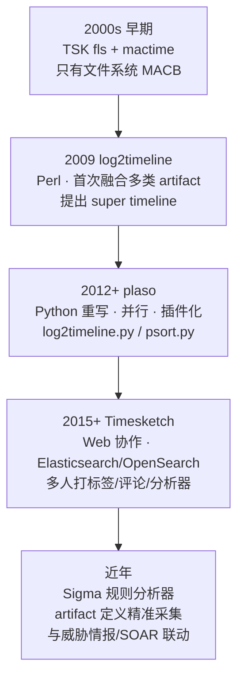
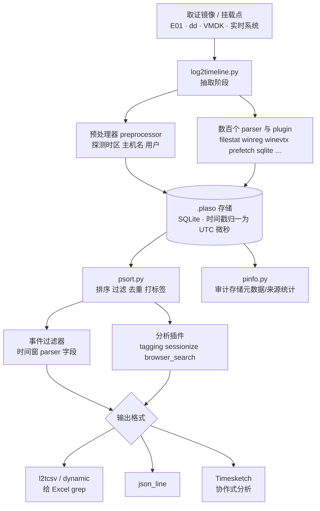
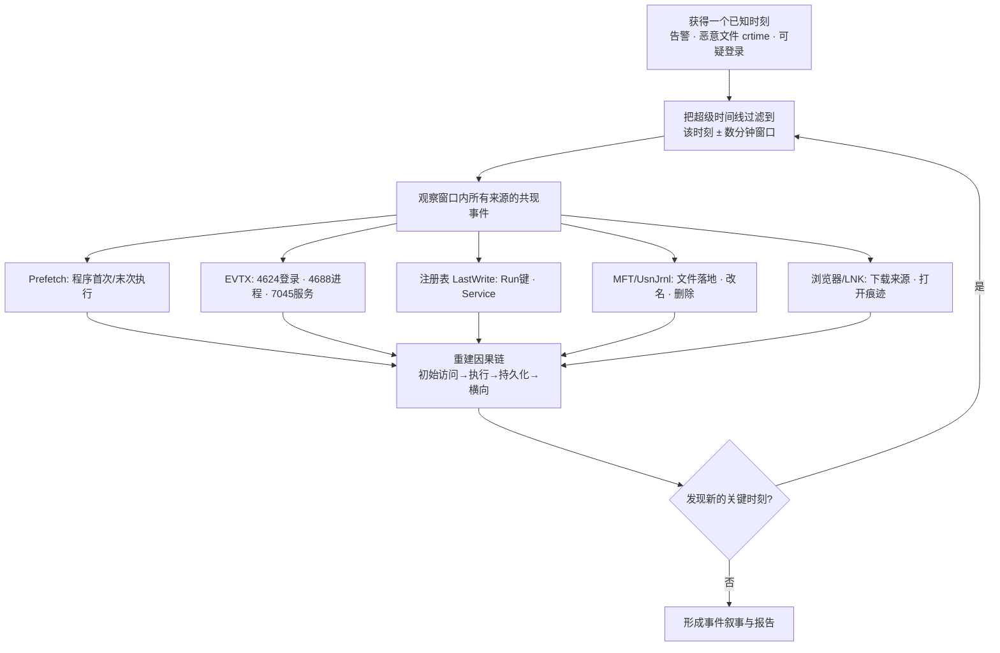

# 数字取证与事件响应（11）· 时间线分析与超级时间线
> [!abstract] TL;DR
> - 时间线分析把散落在文件系统、注册表、日志、执行痕迹里的"带时间戳的事实"抽取成统一的 `(时间戳, 来源, 描述)` 三元组，按时间排序后让分析师沿一条轴看清攻击的完整叙事；"超级时间线"(super timeline) 就是把几十类 artifact 融进同一条轴而非只看文件系统 MACB。
> - 一个文件最多贡献 MACB 四个时间戳（Modified/Accessed/Changed/Born），但一台机器的时间线来源远不止此：`$MFT`、`$UsnJrnl`、注册表键 LastWrite、EVTX、Prefetch、Amcache、浏览器历史、LNK、`$I` 回收站……每类 artifact 的时间戳语义都不同，误读语义是最大的分析陷阱。
> - plaso（log2timeline 的 Python 重写）是事实标准：`log2timeline.py` 用数百个 parser/plugin 把镜像里的时间戳抽进 `.plaso` 存储并全部归一为 UTC；`psort.py` 负责排序、过滤、去重、打标签并输出成 CSV/JSON/Timesketch。
> - 两大死穴是时区（存储用 UTC 还是本地时间、显示按哪个时区）与时钟可信度（系统时钟被改、NTP 漂移、时间戳被 timestomp 伪造）——不校准时区与时钟，整条时间线的结论都可能是错的。
> - 事件关联的核心方法论是"支点分析"(pivot analysis)：锚定一个已知时刻（告警、恶意文件落地时间），把时间线过滤到其前后窗口，观察窗口内所有来源的共现事件，重建"初始访问→执行→持久化→横向"的因果链。

## 概述与定位

在应急响应的现场，调查员面对的从来不是"一个证据"，而是一台机器上成百上千种彼此独立、各说各话的痕迹：文件系统记录着某个 DLL 的创建时间，Prefetch 记录着某个可执行文件被运行过几次，注册表的 Run 键留下一个最后写入时刻，事件日志里躺着一条 4624 登录记录，浏览器历史里有一次可疑下载。单看任何一条，都只是孤立的点；只有把它们全部按**时间**这唯一的公共维度排到一条轴上，攻击者"什么时候进来、跑了什么、怎么驻留、往哪横向移动"的完整故事才会浮现。这就是时间线分析（timeline analysis）的定位：它不是又一种 artifact 解析器，而是把前面各章（[[07.Windows事件日志分析]]、[[08.执行痕迹：Prefetch与Amcache与ShimCache]]、[[06.Windows注册表取证]]、[[10.文件系统取证：NTFS与EXT]]）解析出来的碎片**关联与叙事化**的方法论层。

要区分两个层次的时间线。**文件系统时间线**（filesystem timeline）只从 `$MFT`（或 ext 的 inode 表）里抽取每个文件的 MACB 时间戳，产出的是"某时刻某文件被创建/修改/访问"这类事实——这是最古老、最快、也最容易做的一种，TSK 的 `fls` + `mactime` 十几年前就能做。**超级时间线**（super timeline）则把文件系统之外的几十类带时间戳的 artifact 也统统抽进来，融进同一条轴：一个"2026-07-03 14:22:07"的时刻，可能同时有"`evil.exe` 被创建（`$MFT`）"、"`evil.exe` 首次执行（Prefetch）"、"服务 `WinHelp32` 被创建（EVTX 7045）"、"Run 键被写入（注册表 LastWrite）"五条来自五个不同来源的事件同时出现——这种**跨来源共现**正是超级时间线相对单 artifact 分析的杀伤力所在。本篇聚焦的就是"如何构建、排序、过滤、关联这条超级时间线"，而非各 artifact 本身的内部结构（那些在相邻各章里）。

时间线之所以在 DFIR 里居于核心，本质原因是：**攻击是一个时序过程**，而防御方拿到的却是一个"事后的静态快照"。时间线是把静态快照还原回时序过程的唯一通用手段。它同时服务两个目标：**范围界定**（scoping，攻击者动过哪些资产、影响多大）与**根因/叙事重建**（root cause，从哪进来的、TTP 链条是什么）。没有时间线，调查往往退化成"逐个 artifact 各看各的、靠脑子记时间对不对得上"，在真实的、动辄涉及几十台主机的入侵里，这种人肉关联几乎必然遗漏。

## 原理与机制

时间线分析的底层数据模型极其简单，简单到可以用一句话概括：**把一切能读出时间戳的地方，都转换成 `(UTC 时间戳, 来源, 时间戳语义, 人类可读描述)` 的四元组，然后按时间戳排序。** 复杂性不在模型，而在两端——上游"从几百种格式里把时间戳正确抽出来并理解其语义"，下游"在千万条事件里过滤出有意义的关联"。

最原始也最基础的时间来源是文件系统的 **MACB 时间戳**。MACB 是四个语义的助记：

- **M（Modified）**：内容最后修改时间（Unix 的 `mtime`）。文件内容变了才更新。
- **A（Accessed）**：最后访问时间（`atime`）。理论上被读一次就更新——但**现代 Windows 默认关闭了 NTFS 的末次访问更新**（`NtfsDisableLastAccessUpdate`，Vista 起默认开启该"禁用"），所以在多数 Windows 证物上 atime 极不可靠，不能当"这文件被读过"的证据。
- **C（Changed）**：**元数据**最后变更时间。在 Unix 上是 inode 的 `ctime`（权限、链接数、大小等变化）；在 NTFS 上对应 `$STANDARD_INFORMATION` 里的"MFT Entry Modified"时间。注意 C 不是"Created"，混淆 C 与 B 是初学者最常犯的错。
- **B（Born / Birth）**：创建时间（`crtime`、`btime`）。文件诞生的时刻。

这四个语义映射到磁盘上的具体字段，各文件系统不同：NTFS 每个文件在 `$STANDARD_INFORMATION` 与 `$FILE_NAME` 两个属性里**各存一份**四时间戳（共 8 个），精度是自 1601-01-01 起的 100 纳秒（FILETIME）；FAT 的修改时间只有 2 秒精度、访问时间只精确到日、创建时间 10ms；ext3 只有秒级、ext4 才有纳秒并且多出 `crtime`。这些差异直接决定了时间线上事件的时间分辨率与可比性。

时间线的经典中间格式是 TSK 的 **bodyfile**（也叫 mactime 格式），它把每个文件的四时间戳摊平成一行，用竖线分隔：

```
MD5|name|inode|mode_as_string|UID|GID|size|atime|mtime|ctime|crtime
0|/Windows/Temp/evil.exe|54321-128-1|r/rrwxrwxrwx|0|0|73802|1751545327|1751545320|1751545327|1751545320
```

`mactime` 工具读入 bodyfile，把每个文件的四个时间戳**拆成四条独立事件**（同一时刻的多个语义会合并成 `MACB` 标志位，比如某时刻既是 crtime 又是 mtime 就标 `MA.B` 之类），再按时间排序输出。这个"一个文件的四个时间戳裂变成四条时间轴事件"的动作，正是时间线的原子操作。超级时间线不过是把这个动作从"文件系统的 4 个时间戳"推广到"每一类 artifact 的每一个时间戳字段"。

从文件系统时间线到超级时间线的跨越，是 Kristinn Guðjónsson 在 2009 年用 Perl 写的 **log2timeline** 完成的，它第一次系统性地把注册表、事件日志、浏览器、LNK 等几十类来源的时间戳统一抽进一条轴，并正式提出了"super timeline"这个术语。后来它被完全用 Python 重写为 **plaso**（名字取自冰岛语 "Plaso Langar Að Safna Öllu"，意为"plaso 想把一切都收集起来"），成为今天的事实标准。演进脉络如下：



plaso 的整条流水线可以拆成"抽取—存储—后处理—输出"四段，由两个主命令承担，中间以 `.plaso` 存储文件为界：



这里最关键的机制是**时间归一化**：无论某个 artifact 在磁盘上把时间存成本地时间、UTC、Unix epoch、FILETIME、还是 WebKit/Chrome 的"自 1601 起的微秒"，plaso 在抽取时都会依据探测到的（或你 `--zone` 指定的）时区把它**统一换算成 UTC 内部表示**（微秒），存进 `.plaso`。到了 `psort.py` 输出时再按你指定的展示时区（`-z`）换算回去。理解这条"入库一律 UTC、出库按需换算"的原则，是避免时区灾难的前提。

## 时间戳语义与 plaso 事件模型详解

这一节是本篇的技术核心。时间线之所以"容易做、难做对"，全在于**每一个时间戳的语义都不一样**，而分析的正确性完全依赖于对语义的精确理解。把两个语义不同的时间戳当成同一回事排在一起，得出的因果结论就是错的。

### NTFS 的双份时间戳：`$STANDARD_INFORMATION` 与 `$FILE_NAME`

前面提过 NTFS 每个文件存两份四时间戳。这不是冗余，而是取证上极为关键的一对"交叉验证"：

- **`$STANDARD_INFORMATION`（SI）**：这是 Windows 资源管理器、`dir`、绝大多数工具显示的时间戳。要命的是，SI 的四个时间戳可以被**用户态 API**（`SetFileTime`）随意修改——这正是攻击者"时间戳伪造"(timestomping) 的靶子，把恶意文件的时间改成和 `kernel32.dll` 一样，混进系统文件堆里。
- **`$FILE_NAME`（FN）**：这是文件名属性里附带的另一份时间戳，由内核在文件创建/改名时写入，**用户态没有直接 API 去改**。因此当你看到某文件的 SI 时间远早于 FN 时间（比如 SI 显示 2009 年而 FN 显示上周），几乎可以断定发生了 timestomping。

```
NTFS 每文件 8 个时间戳（4 SI + 4 FN）
  SI:  Created | Modified | MFT-Modified(=C) | Accessed   <- 用户态可改, timestomp 目标
  FN:  Created | Modified | MFT-Modified     | Accessed   <- 内核写入, 抗篡改, 交叉验证锚点
判据: SI.Created << FN.Created  或 SI 时间为整秒(纳秒位全 0) => 疑似 timestomp
```

一个额外的取证细节：很多 timestomp 工具（含早年的 Timestomp、以及某些恶意软件）只能把时间改到**秒**精度，会把 100ns 精度的低位全部清零。于是"时间戳的亚秒部分恰好为 0"本身就是可疑信号。这类判据是单看某一个 artifact 得不到的，只有在时间线里把 SI、FN、以及 `$UsnJrnl`/`$LogFile` 里记录的文件操作放到一起比对才显形——这就是超级时间线的价值。

### 每类 artifact 的时间戳语义天差地别

超级时间线的真正难点，是它把几十类来源混在一起，而每一类的"这个时间戳到底意味着什么"都不同。下面是几组极易误读的例子：

- **Prefetch**：文件本身的 crtime ≈ 程序**首次**执行时间；文件内嵌的"最后运行时间"数组（Win8+ 存最近 8 次）是**末次执行**；而 Prefetch 的存在本身证明"这程序运行过"。三者语义完全不同，排到时间线上要标清 `[Prefetch] evil.exe 首次执行` 还是 `末次执行`。
- **注册表键 LastWrite**：只精确到"这个**键**（不是值）最后被写"的时刻，你无法从它知道是键下哪个值变了。把 Run 键的 LastWrite 当成"持久化被植入的精确时刻"通常成立，但要意识到它可能被后续无关写入刷新。
- **EVTX 事件**：`TimeCreated` 是事件**生成**时刻，通常可信度高（除非日志被篡改或时钟被改），是时间线里少数"事件性"（而非"状态性"）的强锚点。
- **`$UsnJrnl`（USN 变更日志）**：记录了文件的创建、删除、改名、数据覆写等**动作**及其时刻，是重建"文件何时落地、何时被改名成正常样子、何时被删"的黄金来源，能抓到已被删除、`$MFT` 里已看不到的文件的生命周期。
- **浏览器历史 / LNK / Jump List / `$I` 回收站**：分别对应"访问网页时刻"、"打开某文件时刻"、"删除文件时刻"，语义各异。

正因语义如此发散，**plaso 为每个时间戳都附带一个 `timestamp_desc` 字段**（比如 `Creation Time`、`Last Access Time`、`Content Modification Time`、`Metadata Modification Time`、`Last Login Time`、`Program Execution` 等）。这是 plaso 事件模型相对老式 mactime "只有 MACB 四态"的根本进步：mactime 硬把一切塞进 M/A/C/B 四个格子，而现实中的时间语义有几十种，plaso 用自由文本的 `timestamp_desc` 精确保留了每个时间戳的真实含义。

### plaso 的事件数据模型：为什么把 Event 和 EventData 拆开

早期 plaso 每个"事件"是一个大对象，同时装着时间戳和所有属性。但很快发现一个文件的多个时间戳（crtime、mtime、atime……）会导致**同一批属性被重复存好几遍**，`.plaso` 存储爆炸。现代 plaso 把模型拆成三层：

- **EventData**：承载"这是什么"——文件名、inode、用户、来源解析器、以及该 artifact 特有的一堆属性字段。同一个文件/记录的多个时间戳**共享同一份 EventData**。
- **EventObject**：只承载"什么时候 + 哪种语义"——一个 UTC 时间戳 + 一个 `timestamp_desc`，并指向对应的 EventData。
- **EventTag**：分析阶段附加的标签（如 `[tag] logon`、`[tag] execution`），用于事件关联，与原始数据分离以便可重复分析。

这个拆分不仅省存储，更重要的是它在数据结构上表达了一个取证真理：**"一件事"可以在时间轴上留下多个不同语义的时刻**（一个文件既有诞生时刻也有修改时刻），它们指向同一实体但各自是时间轴上独立的一点。理解这层模型，才能看懂 `psort` 输出里为什么同一个文件会出现好几行、每行的 `MACB`/`type` 列不同。

### 抽取与解析：parser、plugin 与预处理

plaso 的抽取能力来自**分层的解析器体系**。`parser` 对应一种容器/格式（如 `winreg` 解析注册表 hive、`sqlite` 解析 SQLite 库、`olecf` 解析 OLE 复合文档、`winevtx` 解析 EVTX、`filestat` 直接读文件系统元数据）；`plugin` 挂在 parser 之下处理该容器里的**具体内容**（如 `winreg` 下有 `userassist`、`run`、`bam`、`shimcache` 等几十个 plugin，`sqlite` 下有 `chrome_history`、`firefox_history`、`skype` 等）。文本日志（syslog、IIS、Apache 等）则用基于 `pyparsing` 的语法解析器逐行匹配。这种"容器 parser + 内容 plugin"的两级结构，让 plaso 可以在不改核心的情况下，通过加插件持续吞掉新格式——这正是它取名"想收集一切"的工程实现。

抽取前有一个**预处理**（preprocessing）阶段，它先扫过镜像确定几个全局上下文：操作系统版本、主机名、时区（读 `TimeZoneInformation` 注册表键）、用户列表与其 SID→用户名映射。这些上下文对时间线正确性至关重要——尤其**时区**，它决定了那些以本地时间存储的 artifact 该怎么换算成 UTC。如果预处理猜错时区，或者镜像来自一台时区被手工改过的机器，就必须用 `--zone` 显式覆盖。

## 工具视角与实战

### 三个核心命令与最短工作流

plaso 的实战几乎只围绕三个命令：`log2timeline.py`（抽取）、`psort.py`（排序输出）、`pinfo.py`（审计存储）。最小闭环如下：

```bash
# 1) 抽取：把整个镜像的所有时间戳抽进 case.plaso（--partitions all 处理多分区）
log2timeline.py --storage-file case.plaso --partitions all disk.E01

# 2) 审计：看抽了多少事件、来自哪些 parser、覆盖什么时间范围、有无错误
pinfo.py case.plaso

# 3) 输出：按 UTC 排序导出 l2tcsv，供 Excel / grep / 时间线工具消费
psort.py -z UTC -o l2tcsv -w timeline.csv case.plaso
```

`log2timeline.py` 的抽取是整个流程里最慢、最重的一步（一块盘可能跑几十分钟到几小时），因此**先抽全、存成 `.plaso`，之后所有过滤/输出都在 `psort` 阶段反复做**——这是 plaso 两段式设计的精髓：抽取一次，分析多次，不必为换个时间窗就重跑几小时。

### 针对性采集：对抗"超级时间线太大"

超级时间线最现实的痛点是**体量**：单台工作站的全量 `.plaso` 轻松上千万条事件，直接看等于大海捞针。对策是在抽取端就做**针对性采集**，而不是无脑全抽：

```bash
# 只跑与入侵分析强相关的 parser，砍掉体量大而价值低的来源
log2timeline.py --parsers 'winevtx,winreg,prefetch,filestat,mft,usnjrnl,lnk' \
    --storage-file targeted.plaso disk.E01

# 或用 ForensicArtifacts 工件定义做精准采集（只取"Windows 取证核心工件"集合）
log2timeline.py --artifact-filters 'WindowsEventLogs,WindowsPrefetchFiles,WindowsRegistryFiles' \
    --storage-file targeted.plaso disk.E01
```

`--parsers` 用列表（前缀 `!` 可排除）选解析器；`--artifact-filters` 则复用 ForensicArtifacts 项目那套声明式工件定义，按"我要哪些取证工件"而非"我要哪些解析器"来表达意图，语义更贴近调查目标。二者是控制体量的第一道闸。

### psort 阶段：过滤、去重、打标签

真正的关联分析发生在 `psort`。它的**事件过滤器**用一套类 SQL 的表达式语言，可按时间窗、解析器、任意字段裁剪：

```bash
# 只要 2026-07-03 这一天、且来自 winevtx 或 prefetch 的事件，输出成 dynamic 格式并自选列
psort.py -z 'Asia/Shanghai' -o dynamic \
  --fields datetime,timestamp_desc,source,parser,message \
  -w window.csv case.plaso \
  "date > '2026-07-03 00:00:00' AND date < '2026-07-04 00:00:00' AND \
   (parser is 'winevtx' OR parser is 'prefetch')"
```

`psort` 还会**自动去重**（同一时刻、同一来源、同一内容的重复事件合并），并可在输出前运行**分析插件**：`tagging`（按规则文件给事件贴 `logon`/`execution`/`persistence` 等标签，直接把 TTP 语义叠到时间线上）、`sessionize`（按时间间隔把事件切成会话）、`browser_search`（还原搜索关键词）、`unique_domains_visited`（去重访问域名）等。`tagging` 分析器配一份规则文件后，能把成千上万条原始事件自动标注成少数几类"有取证意义的动作"，是把超级时间线从"数据"变成"情报"的关键一步。

### 经典 l2tcsv 十七列与快速文件系统时间线

`psort -o l2tcsv` 输出的是历史悠久的 17 列 CSV，字段固定，方便 grep 与老工具消费：

```
date,time,timezone,MACB,source,sourcetype,type,user,host,short,desc,version,filename,inode,notes,format,extra
```

如果只需要文件系统时间线、不想跑重量级 plaso，TSK 的老组合依然最快：

```bash
fls -r -m / -o 2048 disk.dd > bodyfile          # 递归导出所有文件的 MACB 到 bodyfile
mactime -b bodyfile -d -z UTC 2026-07-03 > fs_timeline.csv   # 排序成人类可读时间线
```

`-z` 指定展示时区；末尾日期参数把输出限定到某天之后。这套组合适合"我只想快速看某目录下文件的创建/修改顺序"的轻量场景，或作为 plaso 全量时间线的交叉验证。

### Timesketch：从单机 CSV 到多人协作

当时间线大到需要团队协作、需要反复筛选与可视化时，`.plaso` 或 CSV 会被导入 **Timesketch**——一个基于 OpenSearch/Elasticsearch 的 Web 协作时间线平台。核心概念是 `Sketch`（一个调查）下挂多条 `Timeline`（每台主机/每个来源一条），团队成员在同一 Sketch 里用查询 DSL 筛选、给关键事件加**星标/评论/标签**、存成 `View`、串成叙事 `Story`。它内置一批 `analyzer`（含 **Sigma 规则分析器**，把检测工程社区的 Sigma 规则直接跑在时间线上自动打标），并支持聚合出柱状/热力视图。典型查询就是一条 OpenSearch 语句：

```
tag:"execution" AND timestamp:[1751500000000 TO 1751600000000]
```

Timesketch 把"过滤—标注—协作—可视化"闭环搬到浏览器里，是大型事件里超级时间线落地的主流终点。

### 支点分析：事件关联的核心方法论

有了排好序的超级时间线，怎么"看"才不淹死？答案是**支点分析**（pivot analysis）而非从头顺读。流程是：先从别处（EDR 告警、一个已知恶意文件的 crtime、一条可疑登录）拿到**一个已知时刻**作为支点，把整条时间线**过滤到该时刻前后几分钟到几十分钟的窗口**，然后审视这个窗口里**所有来源**的共现事件——因为攻击动作在时间上高度聚集，一次"落地→执行→持久化"往往挤在同一分钟内，跨来源的共现会自动把因果链拼出来。每发现一个新的关键时刻（比如发现了一个此前不知道的可疑登录），就以它为新支点再来一轮，滚雪球式扩展。



这套方法把"读千万行"化简为"围绕若干支点各读几十行"，是超级时间线在实战里唯一可行的消费方式。它天然与 ATT&CK 的战术阶段对齐：窗口里若同时出现"新服务创建 + Run 键写入"，就是持久化（[[50.恶意代码分析与免杀对抗/08.持久化技术大全]]）；若出现"4624 类型 3 登录 + 远程服务创建"，则是横向移动的信号。

## 安全性与正确使用

时间线分析本身是防御性、取证性的技术，但它的**结论会直接支撑归因、处置乃至法律程序**，因此"正确使用"的门槛很高，用错比不用更危险——一条时区错了的时间线会让整个事件叙事的因果颠倒。

**时区是头号杀手。** 必须在三个环节都盯死时区：抽取端（artifact 存的是本地时间还是 UTC、预处理探测的时区对不对）、存储端（plaso 内部一律 UTC，这点是安全的）、展示端（`psort -z` 你选了哪个时区看）。规范做法是**全流程以 UTC 为准绳，只在最终报告里换算成当地时间并显式标注时区**。跨多台不同时区主机做联合时间线时，若不统一到 UTC，事件的先后关系会彻底错乱。

**时钟可信度是第二道坎。** 时间线默认相信证物上的时间戳，但系统时钟可能被管理员改过、可能有 NTP 漂移、更可能被攻击者故意 timestomp。正确姿势是**先给时钟建立基准**：找一个可信外部时间锚点（如带可信时间戳的服务器日志、EDR 云端记录、NTP 服务端记录）与本机事件比对，估算时钟偏移；对关键结论，尽量用**多来源交叉验证**（前述 SI/FN 对比、`$UsnJrnl` 与 `$MFT` 对比、本机 EVTX 与域控/SIEM 侧记录对比），不把单一时间戳当铁证。攻击者的反取证正是针对这一点（详见 [[14.反取证技术与对抗]]），时间线分析师必须默认"时间戳可能被伪造"，把 timestomp 检测本身作为分析的一部分。

**语义误读是隐蔽的错误源。** 前面反复强调每类 artifact 时间戳语义不同——把 atime 当"文件被运行"、把注册表 LastWrite 当"某个值被改"、把 Prefetch 文件创建时间当"末次执行"，都会导出错误叙事。安全的做法是始终盯着 plaso 的 `timestamp_desc` 字段、对任何用作结论的时间戳都能一句话说清"它到底记录了什么动作"。

**证据完整性与可重复性。** 全流程应在**只读挂载**或对镜像副本操作，绝不在原始证物上跑抽取；`.plaso` 与最终 CSV 应纳入哈希与保管链（[[02.证据保全与取证镜像]]）。plaso 把"原始抽取（log2timeline）"与"分析标注（psort/tagging/Timesketch tag）"在数据结构上分离，正是为了**可重复性**：任何人拿同一份 `.plaso` 重跑同样的过滤都应得到同样结果，标注则可独立审计。这对法庭可采性至关重要——你要能证明"时间线是从证物机械地、可重复地导出的，人为判断只发生在有据可查的标注层"。

**体量与遗漏的平衡。** 针对性采集（`--parsers`/`--artifact-filters`）能治体量，但用力过猛会**漏采**关键来源，让时间线出现盲区。稳妥策略是"全量抽取存档、针对性输出分析"：抽取端尽量全（磁盘便宜、可回溯），把裁剪放到随时可重来的 `psort` 端，这样既控制了每次分析的信息量，又不至于因早期决策失误而永久丢失证据。

## 小结

时间线分析的思想内核朴素得惊人——把一切带时间戳的事实归一到 UTC、按时间排序、按语义标注、围绕支点关联；但它的工程实现与正确使用却门槛极高，因为难点全在两端：上游要正确理解几十类 artifact 各不相同的时间戳语义并抗住 timestomp 伪造，下游要在千万条事件里用支点分析与自动打标提炼出因果链。plaso 用"两段式（log2timeline 抽取 / psort 输出）+ 三层事件模型（EventData/EventObject/EventTag）+ 容器 parser 挂内容 plugin"的架构把这套方法论落成了事实标准，Timesketch 又把它推向多人协作与自动化检测。掌握时间线，本质上是掌握了把前面各章零散的 artifact 知识**编织成攻击叙事**的能力——它是 DFIR 从"看痕迹"升级到"讲清楚到底发生了什么"的那道关键工序。真正决定分析成败的，往往不是会不会敲 `log2timeline.py`，而是有没有时刻校准时区与时钟、有没有对每个时间戳追问它的真实语义。

## 相关阅读

- 官方与工具文档：plaso / log2timeline 官方文档（plaso.readthedocs.io）、Timesketch 官方文档（timesketch.org）、The Sleuth Kit 的 `fls`/`mactime` 手册、ForensicArtifacts 工件定义项目。
- 书目与课程：SANS FOR508《Advanced Incident Response, Threat Hunting, and Digital Forensics》中的 super timeline 章节；Kristinn Guðjónsson 关于 log2timeline/plaso 的原始论文与演讲。
- 同库时间线来源各章：[[07.Windows事件日志分析]]、[[08.执行痕迹：Prefetch与Amcache与ShimCache]]、[[06.Windows注册表取证]]、[[05.Windows磁盘取证痕迹]]、[[10.文件系统取证：NTFS与EXT]]（MACB 与 NTFS SI/FN 时间戳的磁盘级细节）。
- 证据与流程：[[02.证据保全与取证镜像]]、[[01.DFIR全景与事件响应流程]]、[[14.反取证技术与对抗]]（timestomp 与时间线对抗）。
- 上下游呼应：恶意上游 [[50.恶意代码分析与免杀对抗/08.持久化技术大全]]、[[50.恶意代码分析与免杀对抗/06.进程注入技术全谱]]；内核痕迹 [[38.Windows内核与驱动逆向/11.Rootkit原理与检测]]；网络侧关联 [[72.抓包与协议分析实战/19.网络取证与流重组]]、[[12.网络取证与流重组]]；芯片级时间源 [[39.固件与IoT嵌入式逆向/22.eMMC与NAND芯片级取证]]。

[[00.数字取证与事件响应总览|⬆ 系列总览]] | [[10.文件系统取证：NTFS与EXT|← 上一章]] | [[12.网络取证与流重组|→ 下一章]]