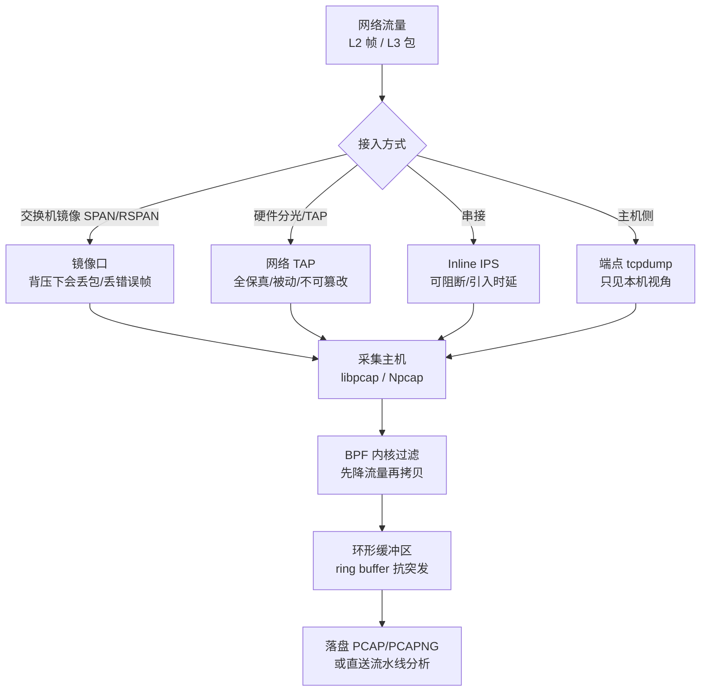
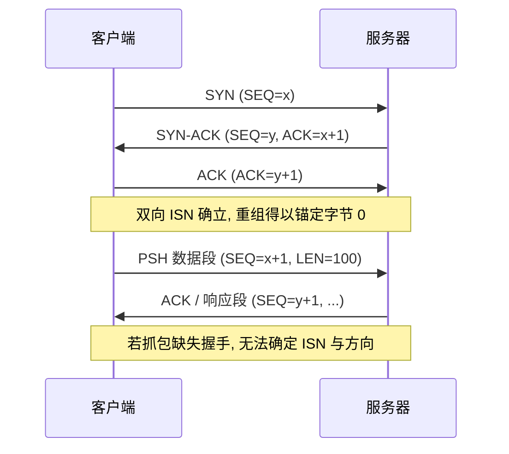
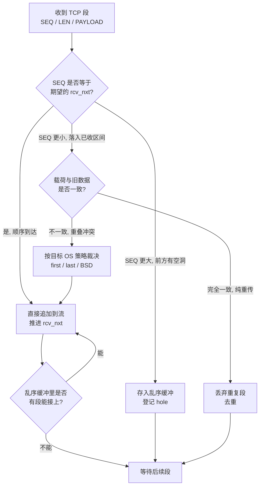

# 数字取证与事件响应（12）· 网络取证与流重组
> [!abstract] TL;DR
> - 网络取证以「线缆上的字节」为独立证据源：主机可被清痕、内存会挥发，但旁路镜像出的 PCAP 是攻击者难以事后篡改的第三方真相，对无文件攻击、C2 回连与数据外泄尤为不可替代。
> - 证据分层是核心取舍：全包捕获（FPC/PCAP）保真度最高但存储爆炸，流数据（NetFlow/IPFIX/sFlow）只留五元组元数据、可长期留存，二者对应「catch-it-as-you-can」与「stop-look-listen」两条路线。
> - 流重组的本质是把 TCP 的「分段字节流」按序列号重排为连续字节流，难点全在重传去重、乱序缓冲、空洞处理，尤其是重叠段的歧义——它既是还原会话的关键，也是 IDS 逃逸的温床。
> - 重叠段与重叠分片的解析随「目标操作系统」而异（first/last/BSD/Linux/Windows…），取证与检测必须做「基于目标」的重组，否则重建出的会话可能与受害主机实际接收到的内容不一致。
> - 加密（TLS 1.3、前向保密）让载荷不可见，取证重心转向元数据：SNI、证书、JA3/JA3S/JA4 指纹、包长与时序；SSLKEYLOGFILE 或 RSA 私钥仅在特定条件下能解密。
> - 工具链分工清晰：tcpdump/libpcap 采集、Wireshark/tshark 深挖、Zeek 产结构化日志、Suricata 告警加抽文件、NetworkMiner/tcpflow 还原对象、Arkime 做海量全包索引。

## 概述与定位

网络取证（Network Forensics）研究的是「在网络上传输、且被捕获下来的数据」这一类证据。它与本系列此前的主机侧取证形成互补：磁盘取证面对的是掉电仍在的静止数据，内存取证面对的是一次性、易挥发的运行时状态，而网络取证面对的是「一旦流过、不留副本就永远消失」的瞬态数据。这条时间轴上的差异，决定了网络取证有一个先天的悖论——**你必须在事件发生之前就已经在捕获**，否则事后无论多努力也无法凭空产生流量记录。因此网络证据的可得性，本质上取决于机构在平时就部署好的镜像与留存基础设施。

它在 DFIR 全景中的定位有三重独特价值。其一是**独立性**：攻击者能在被控主机上删日志、清 Prefetch、抹注册表键，却难以回到旁路的采集设备上篡改早已落盘的 PCAP，网络证据因此常常是「攻击者够不到的第三方真相」。其二是**不可替代性**：面对无文件攻击（fileless）、内存马、把痕迹全放在 RAM 里的 rootkit，主机上可能几乎没有落地物，而 C2 心跳、载荷下载、数据外传却必然要经过网络，留下唯一可查的印记。其三是**时间锚点**：抓包自带高精度时间戳，可为主机侧那些时间戳可被伪造的痕迹提供交叉校验的基准（呼应第 11 章的时间线分析）。

历史上，网络取证的方法论有两条对立的路线，理解它们能想清楚「该抓什么、留多久」。一条叫 **catch-it-as-you-can（能抓尽抓）**：把所有流量原封不动地写盘，事后再慢慢分析；优点是不遗漏任何细节，缺点是存储成本随带宽线性爆炸，10Gbps 满负荷一天就是上百 TB。另一条叫 **stop-look-listen（边看边决定）**：实时分析、只在命中特征时才把相关流量落盘，或者只保留摘要；优点是省存储、可长期回溯，缺点是「没预料到的东西」当时没留下就再也找不回。现实中的成熟做法是分层：短周期全包（几天到几周的滚动 FPC）+ 长周期流数据（数月到数年的 NetFlow/IPFIX 元数据），配合 IDS 告警与各类日志（防火墙、代理、DNS、DHCP）。这套「全包—会话—流—告警—日志」的证据金字塔，越往上越细但越贵、越往下越粗但越省，取证时通常从便宜的流数据里定位可疑会话，再回到昂贵的全包里还原细节。

指导整个调查过程的经典框架是 **OSCAR**：Obtain（获取背景信息，弄清网络拓扑、采集点在哪、时钟是否同步）、Strategize（制定策略，按证据易失性和获取成本排优先级）、Collect（合规地采集与保全，做哈希、记链）、Analyze（关联分析、重组、提取 IOC）、Report（形成可复现、可呈堂的报告）。本篇聚焦其中 Collect 与 Analyze 的技术内核，尤其是「流重组」这一把原始比特还原成人类可读会话的关键环节。需要界定的边界是：与之呼应的 [[72.抓包与协议分析实战/19.网络取证与流重组]] 更偏工具操作与协议解读的实战演练，本篇则站在 DFIR 视角，深入采集架构、重组算法的内部机理、基于目标操作系统的歧义裁决，以及证据完整性与合规使用。

## 原理与机制

### 证据从哪来：采集点与保真度

网络证据的质量，首先由「在哪个位置、用什么方式接入」决定。工程上有四种典型接入方式，保真度与代价各异，取证时必须知道自己拿到的 PCAP 是哪种来源，因为它直接决定了能信到什么程度。



**SPAN（交换机镜像口）** 最常见、最省钱，但它有取证上的软肋：镜像是交换机的「best effort」功能，在流量超过背板或镜像口带宽时会静默丢包，且通常不复制物理层错误帧（CRC 错、runt 帧），因此镜像口看到的是「交换机认为正常的、且它顾得上复制的」流量，可能与线缆真相有偏差。**网络 TAP（分光/分接器）** 是取证首选：被动 TAP 用光分路或电阻分压，物理上把信号复制一份给采集口，对被监控链路完全透明、不引入丢包、无法被在线篡改，证据可信度最高。**Inline（串接式）** 多见于 IPS，能阻断也能采集，但引入时延且自身故障会中断业务。**主机侧 tcpdump** 只能看到本机的收发，视角受限，但在没有旁路条件时是唯一选择，且能看到解密前/后（取决于挂载点）的数据。

无论哪种接入，采集软件栈的原理是相通的。以 libpcap（Windows 上是 Npcap，早期是 WinPcap）为例：网卡收到帧后，驱动把它交给内核的捕获钩子，此处会先跑一段 **BPF（Berkeley Packet Filter）** 过滤程序——BPF 是内核里的一个小型虚拟机，把用户写的 `tcp port 443` 之类过滤表达式编译成字节码，在内核态就把不关心的包丢弃，避免无谓地拷到用户态，这是高速抓包的关键优化。通过过滤的包被写入一段**环形缓冲区**以吸收突发，再由用户态进程读走落盘。要抓到本机之外的单播流量，网卡需开**混杂模式（promiscuous）**；无线场景要抓到管理帧则需**监听模式（monitor）**。

### PCAP 与 PCAPNG：证据的容器格式

落盘的容器格式直接关系到能保留多少元数据。经典 libpcap 格式简单而紧凑，一个 24 字节全局头后跟着一连串「16 字节记录头 + 包数据」：

```
libpcap 全局文件头 (24 字节)
+0   magic_number   4  0xA1B2C3D4=微秒精度 / 0xA1B23C4D=纳秒精度；字节序由读出是否被翻转判定
+4   version_major  2  当前为 2
+6   version_minor  2  当前为 4
+8   thiszone       4  与 GMT 的时差，实践中恒为 0（时间戳按 UTC 存）
+12  sigfigs        4  时间戳精度声明，几乎总是 0
+16  snaplen        4  单包最大捕获长度（截断阈值，见后文陷阱）
+20  network        4  链路层类型 LINKTYPE_*（1=以太网, 101=RAW, 113=Linux SLL）

每包记录头 (16 字节) + 载荷
+0   ts_sec         4  时间戳秒
+4   ts_usec        4  微秒（magic 为纳秒变体时此处是纳秒）
+8   incl_len       4  实际写入文件的字节数（captured length）
+12  orig_len       4  该包在线缆上的原始长度；orig_len > incl_len 即说明被 snaplen 截断
```

这里有几个取证上必须盯住的字段。`magic_number` 同时编码了字节序和时间精度：读出来若被翻转，说明生成机与分析机字节序相反，解析器需相应调整。`snaplen` 与每包的 `orig_len`/`incl_len` 一起，能立刻告诉你「这份包是否被截断」——如果采集时 snaplen 设成了 96（只抓包头以省空间），那么应用层载荷根本没落盘，再高明的重组也变不出内容。`thiszone` 名义上是时区偏移，但事实标准是时间戳一律存 UTC、此字段填 0，跨机器分析才不至于错位。

经典格式的短板是元数据太少：只能有一个链路层类型、没有接口信息、不能加注释、纳秒支持是后期打补丁的。**PCAPNG（PCAP Next Generation）** 因此被设计成「块（block）」结构，也是现代 Wireshark 的默认格式：

```
PCAPNG 通用块结构
+0   Block Type            4  0x0A0D0D0A=段头块SHB, 1=接口描述IDB, 6=增强包块EPB, 3=简单包块SPB, 4=名称解析NRB, 5=接口统计ISB
+4   Block Total Length    4  整块长度（含首尾两个长度字段，按 4 字节对齐）
+8   Block Body            可变（不同块类型语义不同）
...  Block Total Length    4  块尾再次重复长度，用于从后向前回溯遍历
```

PCAPNG 的价值在取证语境下很实在：**段头块（SHB）** 用 0x1A2B3C4D 的字节序魔数并可记录采集主机的 OS/应用信息；**接口描述块（IDB）** 允许一个文件里混装多张网卡的抓包并各带链路类型与精度；**增强包块（EPB）** 原生带高精度时间戳并可挂 `epb_hash`（对包内容的哈希）等选项；**名称解析块（NRB）** 能把当时的 DNS 解析结果固化进文件；块尾重复长度让工具能从任意位置双向遍历、对损坏文件更鲁棒。对证据完整性而言，能在容器内记录接口、注释、逐包哈希，是比裸 PCAP 更强的自描述能力。

### 分层还原：从帧到会话

拿到 PCAP 后，分析的本质是**沿协议栈自底向上重新组装**。链路层（L2）给出以太帧、可能夹着 VLAN 标签或 MPLS 标签；网络层（L3）需要先做 **IP 分片重组**（见下一节），把被 MTU 切碎的 IP 包拼回完整数据报，并用「源 IP + 目的 IP + 协议 + 五元组」把包归入会话；传输层（L4）对 TCP 要做**流重组**，把乱序、重传的段按序列号重排成连续字节流；应用层（L7）再在字节流上跑协议解析器（dissector），识别 HTTP/DNS/SMB/TLS 等并抽取对象。这条「帧→包→段→会话→对象」的链路，正是把一堆离散的抓包变回「人能读的一次通信」的全过程，而其中最微妙、最容易出错、也最具攻防含义的一环，就是 TCP 流重组。

## 流重组与协议还原详解

### 为什么 TCP 需要重组：字节流抽象与序列号

TCP 对上层提供的是「有序、可靠、无边界的字节流」，但它在网络上实际发送的是一个个 **段（segment）**。每个段头里的**序列号（SEQ）**并非「第几个包」，而是「本段第一个字节，在整条流里的字节偏移量」。连接建立时的三次握手交换了双方各自的**初始序列号（ISN）**，为了防重放和劫持，现代实现的 ISN 是随机化的，因此重组器不能假设从 0 开始，而必须从握手里学到「这条流的字节 0 对应哪个 SEQ 值」。



这解释了一个高频取证陷阱：**中途开始的抓包（缺失 SYN/SYN-ACK）**难以可靠重组。没有握手，重组器就不知道 ISN，只能猜测、以看到的第一个段为基准，一旦真实起点更早，方向判定和偏移都会错位。因此「握手是否完整」是评估一份 PCAP 可重组性的第一个体检项。

### 重组算法：空洞表与四种到达情形

重组器的核心数据结构，思想上等同于 David Clark 在 RFC 815 为 IP 分片重组提出的**空洞描述符表（hole list）**：维护一段「已知边界、但尚未填满」的缓冲区，用一组「空洞（起始, 结束）」记录还缺哪些字节，新数据到来时切割或填补空洞。落到 TCP，重组器为每个方向维护一个「期望的下一字节 `rcv_nxt`」和一个乱序缓冲，对每个到达的段判断它落在哪种情形：



四种情形对应四类处理。**顺序到达**（SEQ 恰好等于 `rcv_nxt`）最简单，直接追加并推进指针，然后回头看乱序缓冲里有没有段能顺势接上、形成连锁填补。**乱序到达**（SEQ 大于 `rcv_nxt`，前面还缺一块）则把段暂存进缓冲、登记一个空洞，等缺失的段补齐再拼接——真实网络里乱序很常见，多路径、并行队列都会造成后发先至。**纯重传**（SEQ 落在已收区间、且数据与旧的完全一致）是 TCP 丢包恢复的正常现象，重组器必须**去重**，否则会把内容写两遍、污染还原结果。最棘手的是第四种——**重叠冲突**。

### 重叠段的歧义：一份抓包，多种真相

理论上 TCP 不该出现「同一段偏移、数据却不同」的重叠，但协议并不禁止，攻击者可以故意构造：先发一段「善意」内容骗过 IDS，再用重叠的重传段把真实「恶意」内容送达终端主机。问题的核心在于——**当重叠字节的新旧内容冲突时，到底该采信哪份？** 不同操作系统的 TCP 栈答案不同：有的「保留先到的旧数据」（first / favor-old，典型如 Windows、部分实现），有的「用后到的新数据覆盖」（last / favor-new），BSD 系还有依据段起始偏移的更细规则（BSD、BSD-right）。这意味着**同一份 PCAP，用不同重组策略会还原出不同的字节流**，而只有一种与受害主机真正收到的内容一致。

这正是 1998 年 Ptacek 与 Newsham 那篇著名论文《Insertion, Evasion, and Denial of Service》揭示的 IDS 逃逸原理：如果 IDS 的重组策略和终端主机不一致，攻击者就能让 IDS「看到」一份无害流、终端「执行」另一份恶意流，从而绕过检测。对策是 Vern Paxson 的 Bro/Zeek 与 Snort/Suricata 采用的 **基于目标的重组（target-based reassembly）**：给每个受保护主机配置其真实 OS 的重叠策略（Snort 的 stream 预处理器支持 first/last/bsd/linux/windows/solaris 等一长串 policy），按目标 IP 选择裁决方式，使重组结果与该主机实际接收保持一致。对取证而言，这条经验同样成立：**若怀疑存在对抗性重叠，必须按受害主机的操作系统来重组，而非用工具默认策略**，否则可能得出与事实相反的结论。

### IP 分片重组：另一层歧义

在 TCP 之下，IP 层的分片重组也有完全平行的歧义问题。IP 分片由 `Identification`、`Flags` 中的 MF（More Fragments）位和 `Fragment Offset` 描述，接收端按「源 IP + 目的 IP + 协议 + Identification」归组、按偏移拼接。同样地，**重叠分片**该如何取舍也依赖操作系统策略（first/last/BSD/Linux 等）。历史上臭名昭著的 **teardrop 攻击**就是构造偏移错乱、相互重叠的分片，让当年脆弱的协议栈在计算拷贝长度时整数下溢而崩溃；**Ping of Death** 则用分片拼出超过 65535 字节的超大 IP 包压垮旧栈。取证时对含大量分片、尤其是重叠或异常偏移分片的流量要格外警惕，它既可能是攻击载荷，也可能是逃逸手段。

### 从字节流到对象：应用层还原

重组出连续字节流只是半程，取证真正想要的是**对象**——传输的文件、凭据、命令。以 HTTP 为例，还原一个响应体要串起好几层解码：先按 `Content-Length` 或 **分块传输编码（chunked Transfer-Encoding）** 确定消息边界，再按 `Content-Encoding`（gzip/deflate/br）**解压**，multipart 还要拆分 part。Wireshark 的「导出对象 > HTTP」正是把这些步骤自动化，从流里把每个响应体还原成文件。其他协议各有门道：SMB 要跟踪文件读写偏移把分散的读操作拼回完整文件；FTP 是双通道，控制通道里的 `PASV`/`PORT` 指令决定了数据通道的端口，必须**关联**两条流才能定位真正传输文件的那条；SMTP/POP3/IMAP 要还原邮件与附件（附件常是 Base64）；DNS 则要留意超长、超频的查询——那可能是 **DNS 隧道**外传数据。当协议不可识别或文件被拆散在流中时，还可退而求其次做**文件雕复（carving）**：在字节流里按文件魔数（如 PNG 的 `89 50 4E 47`、ZIP 的 `50 4B 03 04`）搜索头尾、把疑似文件切出来，这与磁盘取证的雕复思想一脉相承。

## 工具视角与实战

网络取证的工具链按「采集—深挖—结构化—还原—海量索引」分工，理解每件工具的擅长面比记命令更重要。

**tcpdump / libpcap** 是采集与快速筛查的基石。它的 BPF 表达式直接决定抓什么，取证采集时常写成滚动切片以便长期留存与快速定位：

```bash
# 按大小滚动切片、限量保留，长期无人值守采集（-C 单位 MB，-W 保留个数）
tcpdump -i eth0 -s 0 -w /cap/net_%Y%m%d_%H%M%S.pcap -G 3600 -C 200 -W 240 -Z root \
        'not (host 10.0.0.5 and port 22)'      # -s 0 关闭截断，务必抓全载荷
```
这里 `-s 0` 关闭 snaplen 截断是取证铁律：省那点空间换来的截断，会让事后重组彻底失去应用层数据。

**Wireshark / tshark** 是深挖利器，取证时最常用的是它的统计与还原能力，而非逐包硬看：

```bash
tshark -r case.pcap -q -z conv,tcp                 # 会话排行，先看谁在大量收发
tshark -r case.pcap -q -z io,phs                   # 协议分层统计，一眼看流量构成
tshark -r case.pcap -Y 'http.request' -T fields -e frame.time -e ip.dst -e http.host -e http.request.uri
tshark -r case.pcap --export-objects http,./out/   # 批量导出 HTTP 传输的文件
tshark -r case.pcap -z follow,tcp,ascii,42         # 跟踪第 42 条 TCP 流的重组结果
```
要点是分清**捕获过滤器（BPF 语法，抓之前生效、不可逆）**与**显示过滤器（Wireshark 语法，抓之后随意筛）**：取证分析阶段几乎只用显示过滤器，以免二次丢数据。「追踪 TCP 流（Follow TCP Stream）」「专家信息（Expert Info，提示重传/乱序/校验错）」「统计 > 会话/端点/协议分层」是四把最常用的钥匙。

**Zeek（原 Bro）** 走的是完全不同的路线：它不让你逐包看，而是把流量事件化，产出一批**结构化日志**——`conn.log`（每条连接的五元组、字节数、时长、状态）、`http.log`、`dns.log`、`ssl.log`、`x509.log`（证书详情）、`files.log`（经手的文件及其哈希）、`weird.log`（协议异常）、`notice.log`。这套日志把「几十 GB 的 PCAP」压成「可 grep、可入库、可跨时间关联」的表格，是大规模取证与威胁狩猎的主力；配合 Zeek 脚本还能算 JA3 指纹、自定义检测逻辑。呼应 [[72.抓包与协议分析实战/11.Zeek协议分析框架]] 的实操细节。

**Suricata** 兼具 IDS/IPS 与取证输出：它按规则告警的同时，能吐出 **EVE JSON**（alert/flow/http/dns/tls 各类事件的结构化流），并能按规则**抽取传输的文件**（filestore）落盘、按需保存触发告警的 PCAP。在事件响应里，它常作为「既报警又留证」的一环。

**NetworkMiner** 与 **tcpflow** 专注「把流还原成对象」。NetworkMiner 是主机中心视角，离线吃 PCAP，自动重组并把文件、图片、凭据、主机清单、会话、DNS 记录分门别类列出，对快速取证极友好；tcpflow 则把每条 TCP 流按 `源IP-源端口-目的IP-目的端口` 命名写成独立文件，便于用文本工具进一步处理。**Scapy** 提供可编程能力，`rdpcap()` 读包、`sessions()` 分流、再自定义解析，适合应对私有协议或批量自动化。

**editcap / mergecap / capinfos / reordercap** 是常被忽视却关键的 PCAP 手术刀：`capinfos` 一把给出包数、时间跨度、字节数与**丢包统计**（评估证据完整性的第一步）；`editcap` 去重（`-d`）、按时间/数量切片、转换格式、删改包；`mergecap` 合并多源抓包；`reordercap` 修复乱序落盘；`text2pcap` 把十六进制转回 PCAP。**Arkime（原 Moloch）** 则解决「海量全包」的可检索问题：它把 FPC 索引进 Elasticsearch，提供会话浏览器，让 PB 级抓包也能按五元组、时间、协议秒级检索并回看原始包，是大型机构做长期全包留存的典型方案。

## 安全性与正确使用

网络取证的「安全性」是双向的：既指它对被监控者隐私与合规的冲击，也指证据本身要经得起对抗与质证。二者都必须在动手抓包前就想清楚。

**合法性与授权是前置门槛。** 抓包等同于监听通信，多数司法辖区受窃听/通信保护法约束（如美国 Wiretap Act、欧盟 GDPR、各国等保与网络安全法）。在企业内网做取证通常依赖「事先明示的监控告知与同意」（登录横幅、员工协议、内部制度），且应遵循**最小化原则**——只在必要范围、必要时长内采集，能用 BPF 在内核就过滤掉无关的员工私人流量就不要全抓。跨越到公网、第三方或个人设备时，授权边界更严，越权抓包本身可能构成违法，反而让证据不可用。**这是使用该技术的正确边界：技术能力不等于法律授权，采集范围与目的必须有据可依。**

**证据完整性决定它能否呈堂。** 网络证据是易失、易被质疑「是否被篡改」的，因此必须建立**证据链（chain of custody）**：采集后立即对 PCAP 做哈希（SHA-256）并记录，之后一切分析都在**只读副本**上进行、原始文件写保护留存；每一次转手、每一步处理都留痕，确保「同一份输入、任何人重跑都得同一结论」的可复现性。用 TAP 而非可被在线篡改的镜像、用带逐包哈希的 PCAPNG、把采集主机自身加固并限权，都是提升可信度的加固手段。同时要如实记录**丢包与截断**（`capinfos` 的丢包计数、snaplen 截断）——隐瞒证据的不完整本身就会摧毁其可信度。

**加密改变了可取证的边界，须诚实对待。** TLS 让载荷不可见，且不能靠事后拿到私钥就万能解密：只有在使用 RSA 密钥交换（无前向保密）时，服务器私钥才能解出会话；一旦是 ECDHE 等**前向保密（PFS）**套件，或到了 **TLS 1.3**（强制 PFS），就只能靠采集期间导出的 **SSLKEYLOGFILE（会话密钥日志）** 才能解密——而这要求你在事发时就在端点上启用了密钥导出，事后无从补救。因此对加密流量，取证重心正确地转向**元数据**：SNI、证书主体与签发链（`x509.log`）、**JA3/JA3S/JA4** 客户端与服务端 TLS 指纹、包长与时序节奏（可据此识别信标化的 C2 心跳）。这既是能力边界的诚实承认，也提示了合规红线——**大规模解密用户加密流量涉及严重隐私风险，必须有明确授权与严格的数据访问控制**。

**敏感数据要被当作危险品处置。** 全包 PCAP 里可能沉淀明文口令、Cookie、令牌、个人隐私与业务机密，取证产物本身就是高价值攻击目标。正确做法是：存储加密、访问最小授权与审计、按保留期限到点销毁、在报告与共享时脱敏；提取到的凭据要视同已泄露而推动重置。**误用风险**同样真实：同一套重组与解密能力若被滥用，就是内部窃听工具；把默认重组策略当唯一真相、忽视基于目标 OS 的歧义，则可能在对抗性场景下得出错误甚至冤枉的结论。技术中立，约束它的是授权、流程与对不确定性的诚实。

## 小结

网络取证的独特价值，在于它提供了一个攻击者难以事后触及的、带精确时间锚点的第三方证据源，尤其在主机侧痕迹稀薄的无文件攻击与数据外泄场景中不可替代。它的先天约束是「必须事前就在捕获」，于是催生了全包与流数据分层留存的工程取舍。技术内核则集中在流重组：把 TCP 的分段字节流按序列号重排为连续字节流，处理重传去重、乱序缓冲与空洞填补，而其中最深的一层是重叠段/重叠分片的**歧义裁决**——它随目标操作系统而异，既是 IDS 逃逸的根源，也要求取证必须做「基于目标」的重组才能还原出与受害主机一致的真相。再往上，应用层还原要串起分块、解压、多通道关联乃至文件雕复，才能把比特变回对象。工具链上，tcpdump 采集、Wireshark/tshark 深挖、Zeek 结构化、Suricata 告警取证、NetworkMiner/tcpflow 还原、Arkime 海量索引各司其职。而贯穿始终的，是合法授权、证据链完整、对加密边界与不确定性的诚实，以及对敏感数据的危险品级处置——这些不是附加项，而是让技术结论真正「站得住」的前提。

## 相关阅读

- 同系列上下文：[[00.数字取证与事件响应总览|系列总览]]、[[11.时间线分析与超级时间线]]（为网络时间戳提供交叉校验基准）、[[04.内存取证实战：进程与网络与注入检测]]（主机侧网络连接与流量的印证）
- 抓包与协议实战呼应：[[72.抓包与协议分析实战/19.网络取证与流重组]]（工具操作与协议解读的实战篇）、[[72.抓包与协议分析实战/11.Zeek协议分析框架]]、[[72.抓包与协议分析实战/05.TLS握手与解密分析]]、[[72.抓包与协议分析实战/16.TLS指纹进阶JA4与JARM与HASSH]]、[[72.抓包与协议分析实战/08.DNS协议分析与操纵]]
- 恶意上游关联：[[50.恶意代码分析与免杀对抗/08.持久化技术大全]]、[[50.恶意代码分析与免杀对抗/06.进程注入技术全谱]]（C2 与外传行为的主机侧成因）
- 硬件取证呼应：[[39.固件与IoT嵌入式逆向/22.eMMC与NAND芯片级取证]]
- 内核痕迹：[[38.Windows内核与驱动逆向/11.Rootkit原理与检测]]
- 规范与经典：RFC 9293 / RFC 793（TCP，序列号与重传语义）、RFC 815（IP 数据报重组算法，空洞表思想）、RFC 791（IP 分片）、RFC 7011（IPFIX）、RFC 3954（NetFlow v9）、PCAP/PCAPNG 文件格式规范（IETF opsawg 草案）；论文 Ptacek & Newsham《Insertion, Evasion, and Denial of Service: Eluding Network Intrusion Detection》（1998）；书目 Davidoff & Ham《Network Forensics: Tracking Hackers through Cyberspace》、Chris Sanders《Practical Packet Analysis》

[[00.数字取证与事件响应总览|⬆ 系列总览]] | [[11.时间线分析与超级时间线|← 上一章]] | [[13.恶意持久化与Rootkit取证|→ 下一章]]
