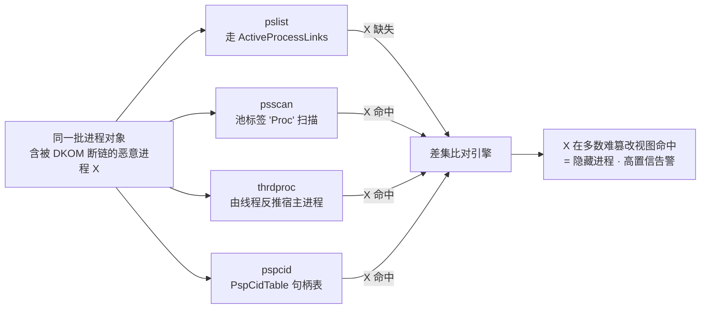
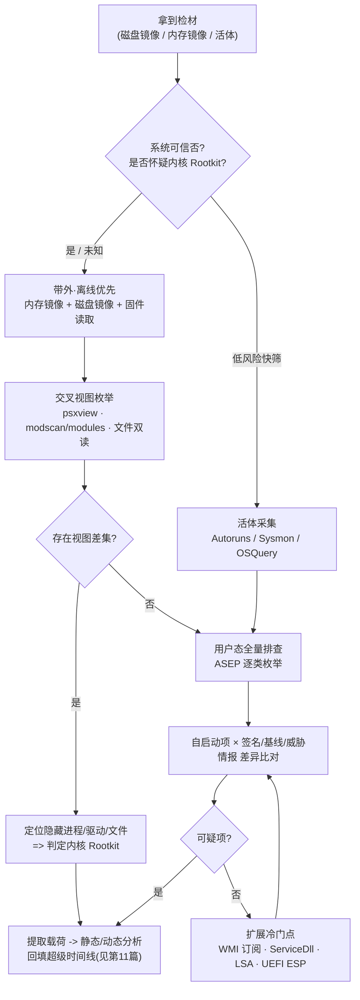

# 数字取证与事件响应（13）· 恶意持久化与Rootkit取证
> [!abstract] TL;DR
> - 持久化取证的本质不是"背下上百个自启动点"，而是理解操作系统**在什么时机、以什么身份、读哪张表来决定加载什么**——排查就是枚举这些"加载决策表"（ASEP，自动启动扩展点）并逐项与签名、基线、威胁情报做差异比对。
> - Rootkit 的核心能力是**制造视图不一致**：它篡改某一条枚举路径（API/SSDT/内核链表）让自己在该路径下消失。因此检测的黄金法则是**交叉视图（cross-view）**——用它没来得及篡改的第二条路径重新枚举同一批对象，差集即隐藏物。
> - 活体系统上"你能看到的，都是 Rootkit 允许你看到的"；内核级隐藏的可靠检测要么走**内存取证**（psscan 池标签扫描绕过 `ActiveProcessLinks` 断链），要么走**带外采集**（DMA/冷启动/离线镜像），不能只信系统自报。
> - x64 时代 PatchGuard 与 DSE 把经典 SSDT/IDT inline hook 逼入历史，现代内核 Rootkit 转向 **DKOM、内核回调摘除、BYOVD（自带签名漏洞驱动）与 UEFI Bootkit**；取证重心随之从"扫 SSDT"迁到"查 EPROCESS 断链、比对回调数组、清点已加载驱动、验证固件度量"。
> - 持久化与 Rootkit 常成对出现：Rootkit 让持久化点隐身，持久化保证 Rootkit 重启存活。发现任一异常自启动项，都应假设配套隐藏组件存在；反之亦然。

## 概述与定位

本篇处理攻击者留在受害主机上的两类"赖着不走"的能力：**持久化（persistence）**——让恶意代码在重启、注销、崩溃后仍能自动重新运行；以及 **Rootkit**——让恶意代码、文件、网络连接、注册表项在系统自身的观测接口下"隐身"。二者一个负责"活下来"，一个负责"看不见"，在真实入侵中几乎总是配套出现，因此放在同一章从取证视角统一处理。

必须先划清与相邻篇目的边界。本系列第 06 篇讲注册表取证的通用方法（hive 结构、`RegRipper`、时间戳），第 08 篇讲执行痕迹（Prefetch/Amcache/ShimCache），第 03、04 篇讲内存采集与进程/注入检测的通用框架——这些是**地基**，本篇不重复，而是站在它们之上，聚焦"如何把这些痕迹用于发现持久化与内核隐藏"。攻击侧"怎么造一个持久化/怎么写 Rootkit"属于恶意代码分析系列（见文末相关阅读的 50 系列链接），本篇一律**防御/取证视角**：目标是**发现、确认、归因、清点影响范围**，不是复现武器。

定位上要抓住一条认识论主线：**被入侵的系统不可信任来报告自身状态**。`tasklist`、`netstat`、资源管理器、注册表编辑器都通过操作系统 API 拿数据，而 Rootkit 恰恰坐在这些 API 的下方做过滤。于是取证工作被迫分层：能离线就离线（磁盘镜像 + 内存镜像），能带外就带外（DMA、冷启动、硬件写阻断读取），实在要活体分析也要**同时用多条互相独立的观测路径**、拿差异说话。这条主线贯穿全篇——它解释了为什么持久化排查偏爱"离线解析 hive/任务 XML"而非"活体点开注册表看看"，也解释了 Rootkit 检测为什么把"交叉视图"奉为第一原理。

## 原理与机制

### 持久化：一个统一的"触发器 + 载荷引用"模型

上百个持久化点看似杂乱，但都能套进同一个模型：**某个系统组件在某个触发时机，去读某处配置，拿到一个载荷引用（路径/CLSID/脚本），然后加载执行**。取证只需回答三问：谁在触发？读的是哪张表？表里指向了什么？把这三问对准每一类触发器，排查就系统化了。

Windows 侧的主力"决策表"按触发时机分层：

- **开机/登录级**：`HKLM|HKCU\...\CurrentVersion\Run`、`RunOnce`、`RunOnceEx`；`Winlogon` 的 `Userinit`、`Shell`、`Notify`；启动文件夹（`%AppData%\Microsoft\Windows\Start Menu\Programs\Startup`）；`Session Manager` 的 `BootExecute`（在 Win32 子系统起来之前就跑，取证价值极高）。
- **服务级**：`HKLM\SYSTEM\CurrentControlSet\Services\<name>`，关键是 `Start` 值（0=boot、1=system、2=auto、3=manual、4=disabled）、`ImagePath`，以及 svchost 托管服务的 `Parameters\ServiceDll`——很多后门是一个"寄生在合法 svchost 组里的 DLL"，只看进程名是 `svchost.exe` 会漏掉。
- **计划任务**：`C:\Windows\System32\Tasks\` 下的 XML（含 `Author`、`Command`、触发器定义、隐藏标志）与注册表 `...\Schedule\TaskCache\Tree|Tasks`（GUID 索引、`Actions` 二进制 blob、时间戳）。二者需交叉核对——只改注册表不落 XML、或反之，都是异常信号。
- **代码注入型自启动**：`AppInit_DLLs`（凡链接 `user32.dll` 的进程都被注入，Secure Boot 下默认失效但老机器仍有效）、`AppCertDLLs`、IFEO（Image File Execution Options）的 `Debugger` 与 `SilentProcessExit\MonitorProcess`、COM 劫持（`HKCU\Software\Classes\CLSID\...\InprocServer32` 抢在 HKLM 之前被解析）、DLL 搜索顺序劫持与"幽灵 DLL"（进程尝试加载一个本不存在的 DLL，攻击者补上）。
- **安全子系统型**：LSA 的 SSP/AP（`Security Packages`）、密码过滤器（`Notification Packages`）、Winsock LSP、Netsh helper、打印监视器、时间提供程序——这些冷门点正因少被检查而被高级威胁偏爱。
- **无文件/对象型**：WMI 事件订阅（`__EventFilter` + `CommandLineEventConsumer`/`ActiveScriptEventConsumer` + `__FilterToConsumerBinding`，存在 `%SystemRoot%\System32\wbem\Repository\OBJECTS.DATA` 的 CIM 库里），这是 APT 最爱的"藏在数据库里、无独立文件、随系统事件触发"的持久化，必须离线解析 `OBJECTS.DATA` 才看得全。

Linux 侧同理分层：`cron`（`/etc/crontab`、`/etc/cron.d/`、`/var/spool/cron/`、`cron.{hourly,daily,...}`）、systemd（`/etc/systemd/system`、`/lib/systemd/system`、user unit、**timer** 单元）、`/etc/rc.local` 与 `init.d`、shell 配置（`~/.bashrc`、`/etc/profile.d/`、`~/.bash_logout`）、SSH（`authorized_keys`、`~/.ssh/rc`）、**PAM 模块后门**、`udev` 规则、`systemd` generator，以及两类"半 Rootkit"手段——`/etc/ld.so.preload`（全局 `LD_PRELOAD`，用户态库劫持）和内核模块自启动（`/etc/modules`、`modprobe.d`）。

### Rootkit：按驻留层级的隐藏谱系

Rootkit 按其代码运行的特权层级分级，层级越低、隐藏越彻底、检测越难：

- **用户态 Rootkit**：在进程内做 IAT/EAT hook、inline hook（如 Detours 风格改函数头几个字节为 `jmp`），或 Linux 上用 `LD_PRELOAD` 覆写 `readdir/open/access` 来隐藏文件、覆写 `/proc` 读取隐藏进程。特权低、易被内核视角戳穿，但部署简单、免签名。
- **内核态 Rootkit**：这是经典战场。手段包括 **DKOM**（直接改内核对象，如把 `EPROCESS` 从 `ActiveProcessLinks` 双链表摘除以隐藏进程）、**SSDT hook**（改系统服务表指针，过滤 `NtQuerySystemInformation`/`NtQueryDirectoryFile` 结果）、Shadow SSDT（win32k 的 GUI 系统调用）、**IRP hook**（改驱动的 `MajorFunction` 派发表）、IDT hook、以及**内核回调滥用/摘除**（`PsSetCreateProcessNotifyRoutine`、`ObRegisterCallbacks`——一边给自己装监控，一边把 EDR 的回调从数组里摘掉致盲）。
- **引导级 Bootkit**：抢在 OS 之前控制启动链。历史上是 MBR/VBR bootkit（TDL4、Mebroot），现代是 **UEFI Rootkit**——把恶意 DXE/PEI 模块植入 SPI 闪存或 ESP 分区（LoJax、MoonBounce、ESPecter、CosmicStrand、BlackLotus）。它比内核 Rootkit 更顽固：重装系统、换硬盘都杀不掉写进主板闪存的植入。
- **虚拟化/SMM Rootkit**：把 OS 整体降为 guest（Blue Pill 概念），或藏进系统管理模式（SMM，Ring -2）。工程门槛极高、在野罕见，但一旦存在，OS 内几乎所有软件检测都失效，只能靠时序侧信道或固件度量。

x64 时代有两道系统性防线重塑了这张谱系：**PatchGuard（KPP）**周期性校验 SSDT/IDT/GDT 等关键结构，令经典 hook 型 Rootkit 触发 BSOD；**DSE（驱动签名强制）**要求内核驱动带有效签名。二者叠加，使得"直接改 SSDT"这类教科书技术在现代 64 位系统上基本绝迹，攻击者被迫转向三条新路：**DKOM**（改数据不改代码，PatchGuard 未必覆盖到每个链表）、**BYOVD**（带一个自己签名的、有漏洞的合法驱动进来，借它的漏洞在内核里执行任意代码，绕过 DSE）、以及**上迁到 UEFI/固件**。取证重心因此从"扫代码 hook"转向"查数据结构一致性、清点驱动来源、验证固件度量链"。

## 内核隐藏与交叉视图检测详解

这一段把"为什么 Rootkit 能藏、取证凭什么把它揪出来"讲透。核心就一句话：**Rootkit 只能篡改有限条观测路径，取证用它没篡改的另一条路径去对同一批对象重新点名，对不上的就是隐藏物**。

### DKOM 隐藏进程：断链为何有效、为何仍能被抓

Windows 用一条双向链表 `ActiveProcessLinks` 把所有 `EPROCESS` 串起来，表头是 `PsActiveProcessHead`。`tasklist`、`Process Explorer` 最终都走这条链枚举进程。DKOM 隐藏的做法是把目标进程节点从链表摘除——让它前驱的 `Flink` 直接指向它的后继、后继的 `Blink` 指回它的前驱，目标节点游离在外：

```
// x64 _EPROCESS 中与进程枚举相关的关键字段（偏移随内核版本变化，此处示意）
_EPROCESS
  +xxx  UniqueProcessId    : Ptr64            // PID
  +xxx  ActiveProcessLinks : _LIST_ENTRY      // PsActiveProcessHead 串起的双向链表节点
          +0x000 Flink : Ptr64  -> 下一个进程的 ActiveProcessLinks
          +0x008 Blink : Ptr64  -> 上一个进程的 ActiveProcessLinks
  +xxx  ImageFileName      : [15] UChar       // 短名（仅前 15 字节）
  +xxx  ThreadListHead     : _LIST_ENTRY      // 本进程的线程链
  ...
// DKOM 断链：prev.Flink = self.Flink ; next.Blink = self.Blink
//   进程从"名单"消失，但它的 KTHREAD 仍挂在调度器就绪队列 -> 照常获得时间片运行
```

关键洞察在于**Windows 的调度单位是线程而非进程**。调度器根据 `KTHREAD` 的就绪队列派发时间片，与 `ActiveProcessLinks` 无关。所以断链后的进程"名单上没有、CPU 上照跑"——这既是它隐蔽的原因，也埋下了它的死穴：只要还想运行，它的线程、它的 `EPROCESS` 池内存、它在 `PspCidTable`（PID/句柄→对象 的句柄表）里的登记，就都还在。取证只要换这些"没被摘"的路径点名即可。

`psscan` 走的就是**池标签扫描**：内核对象分配在池（pool）里，每块前面有 `_POOL_HEADER`，进程对象带 `Proc` 标签。工具不走任何链表，直接在物理内存里按 `Proc` 标签 + `_EPROCESS` 的结构特征（如 `DISPATCHER_HEADER` 的合法类型值、合理的时间戳与句柄表指针）做特征扫描，把内存里所有"长得像进程对象"的块捞出来：

```
_POOL_HEADER（示意）
  +0x000 PreviousSize / PoolIndex / BlockSize / PoolType  (位域打包)
  +0x004 PoolTag : 4 bytes    // 'Proc'=进程对象  'Thre'=线程  'File'=文件对象 ...
// psscan：物理内存里按 'Proc' 标签 + _EPROCESS 特征做签名扫描
//         断链不改池分配 -> 隐藏进程照样被扫出 -> 与 pslist 结果求差集
```

于是 `pslist`（走链表，隐藏进程缺失）与 `psscan`（扫池，隐藏进程命中）一比对，差集就暴露了。Volatility 的 `psxview` 把这条思路推到极致——同时用 **7 条独立视图**（`pslist`/`psscan`/`thrdproc`（由线程反推宿主）/`pspcid`（句柄表）/`csrview`/`session`/`deskthrd`）交叉点名，某进程只要在任一"难篡改"视图里出现却在"常规"视图里缺席，就高置信度判为隐藏。这就是**交叉视图检测**的完整形态：把 Rootkit 逼到"必须同时篡改所有视图且保持逻辑自洽"才能不露馅，而这在工程上几乎做不到。



### 代码 hook 的检测：把指针拉回"合法地界"

对付 SSDT/inline hook，检测思路是**验证控制流指针是否落在合法模块的代码段内**。系统服务表 `KiServiceTable` 每一项本应指向 `ntoskrnl.exe`（win32k 的 shadow 表指向 `win32k.sys`）的 `.text` 区间：

```
KeServiceDescriptorTable -> KiServiceTable[i]  // 系统调用号 i -> 内核函数入口
// 正常：KiServiceTable[i] ∈ [ntoskrnl.text_start, ntoskrnl.text_end]
// 被 hook：KiServiceTable[i] = &HookedNtQuery（落在某未知驱动/未分配区）
// 检测（Volatility ssdt / apihooks）：
//   凡表项指针不落在已知模块 .text 范围 => 疑似 SSDT hook
//   inline hook：反汇编函数头，若前几字节是 jmp/push-ret 跳到模块外 => 疑似内联挂钩
```

`ssdt` 插件枚举全表、标红越界项；`apihooks` 进一步反汇编函数序言，识别 `jmp`、`push+ret`、`mov reg;jmp reg` 等跳板落到非模块内存的内联挂钩；`driverirp` 检查驱动 `MajorFunction` 表是否被改指向别的模块（IRP hook）；`callbacks`/`idt`/`timers` 分别清点进程/线程/镜像加载回调、中断门、定时器 DPC，看有没有指向可疑驱动的登记项。现代 x64 上，"SSDT 全绿"往往不代表干净，反而要重点看 `callbacks`（回调被摘或被加）、`modscan` 对比 `modules`（隐藏驱动，与 psxview 同理：`PsLoadedModuleList` 断链 vs 池扫描）、`ldrmodules`（进程内三条 DLL 加载链——`InLoad`/`InInit`/`InMemory`——的交叉视图，用于抓反射式注入/DLL 隐藏）。

### 文件与注册表的隐藏：最高层 vs 最低层对撞

Rootkit 隐藏文件/注册表项的通用检测由 `RootkitRevealer` 首创、`GMER` 发扬：**用最高层接口扫一遍，再用最底层解析扫一遍，两份清单求差**。最高层是 Win32 API（`FindFirstFile`、`RegEnumValue`），最底层是绕过内核过滤直接解析 NTFS 的 `$MFT`、直接解析注册表 hive 的二进制结构。API 视图里缺、原始解析里有的条目，就是被 Rootkit 从 API 路径上抹掉的隐藏物。这套"高低对撞"是离线取证的天然优势——离线解析 `$MFT`、离线解析 hive，本就不经过任何活体 Rootkit 的过滤层，因此**离线镜像取证对用户态乃至多数内核态文件/注册表隐藏天然免疫**。这也再次印证开篇主线：能离线就离线。

### 一张排查/检测决策图



## 工具视角与实战

**Windows 活体快筛**首选 Sysinternals **Autoruns**：它一次性覆盖数十类 ASEP（Logon、Services、Scheduled Tasks、WMI、Winlogon、LSA、Codecs、Print Monitors、Boot Execute……），并内置签名校验与 VirusTotal 查询。取证用法要点：勾选 `Hide Microsoft/Windows Entries` 收窄噪声、按 `Options` 显示未签名与未验证项、对每个可疑项看**发布者签名状态 + 落地路径 + 时间戳**三要素。但务必记住——Autoruns 走 API，若已有内核 Rootkit 拦截注册表枚举，它也会被骗；因此它是快筛，不是终审。终审交给离线镜像。

**离线注册表/任务/WMI 解析**：`RegRipper`/`RECmd` 批量抽取 Run 键、Services、TaskCache 并带 hive 的 `LastWrite` 时间戳（回填时间线，见第 11 篇）；计划任务交叉核对 `System32\Tasks\*.xml` 与 `TaskCache`；WMI 持久化用 `python-cim`/`WMI_Forensics` 解析 `OBJECTS.DATA`，把 `__FilterToConsumerBinding` 还原成"什么事件触发了什么脚本"。这些解析不经过活体系统，能看穿活体 Rootkit 的过滤。

**内存取证**（承第 03/04 篇的采集与框架，此处聚焦 Rootkit 专用插件）：Volatility 2/3 的 `psxview`（进程交叉视图）、`ssdt`/`apihooks`（代码 hook）、`callbacks`/`timers`/`idt`（回调与门表）、`modules` vs `modscan`（隐藏驱动）、`driverirp`（IRP hook）、`ldrmodules`（DLL 三链交叉，抓注入/反射加载）、`svcscan`（服务）、`malfind`（可执行私有内存页，抓无文件载荷）。方法学上永远是"两条视图求差"而非"信某一条"。

**内核视角对撞工具**：`GMER`、`RootkitRevealer`（原理级经典）在活体上做"高层 API vs 底层解析"对撞，适合快速确认"有没有东西在藏文件/注册表/进程"，但因其自身运行在被感染系统上，对更底层的 Rootkit 也可能失效——阳性可信、阴性存疑。

**Linux 侧**：`chkrootkit`、`rkhunter`、`Unhide`（对撞 `/proc`、`ps`、系统调用枚举，抓隐藏 PID/端口）、`Volatility`+`LiME` 采集内存；重点核对 `/etc/ld.so.preload`、加载的 LKM（`lsmod` vs `/sys/module` vs 内核 `modules` 链）、`systemd` 全量单元与 timer、cron 全路径、PAM 模块完整性。用户态 `LD_PRELOAD` 型 Rootkit 的经典破法是**静态编译的干净工具**或直接读 `/proc/<pid>/maps`，绕开被劫持的 libc。

**持续监控与规模化**：`Sysmon`（Event ID 12/13/14 注册表、11 文件创建、1 进程创建、19/20/21 WMI 订阅）+ `OSQuery`（`autoexec`、`services`、`scheduled_tasks`、`kernel_modules`、`startup_items` 等虚拟表 SQL 化查询）把"逐台点开看"变成"全网一条查询",是把本章方法工程化落地的关键。**固件层**用 `CHIPSEC` 校验 SPI 保护位、比对 UEFI 模块、检查 ESP 上的异常 `.efi`，配合 TPM 的度量启动日志（PCR）验证引导链完整性——这是应对 UEFI Bootkit 的唯一软件侧抓手。

## 安全性与正确使用

> [!caution] 合规与伦理边界
> 本篇仅面向**自有设备、获得书面授权的环境、CTF 靶场与安全研究**，且**全程为防御、检测、取证与教育目的**。文中对持久化机制与 Rootkit 隐藏原理的讲解，用于让防守方"看懂痕迹、找到它、清除它、评估影响面"，**不提供**针对真实生产系统或他人系统的武器化步骤，**不给**任何"打某个真实目标"的成品配方，也**不为**绕过商业软件授权/正版校验提供可操作方案。攻击侧的构造细节请回到恶意代码分析系列在**授权隔离环境**中学习。在他人系统上部署持久化或 Rootkit、或未经授权访问计算机系统，在几乎所有司法辖区都构成犯罪。

除法律边界外，取证操作本身有几条"正确使用"的硬约束，违反会毁掉证据或误判：其一，**次序即证据完整性**——遵循易失性顺序（先内存、CPU 状态、网络连接，后磁盘），内存采集要用经过验证、内存足迹小的工具，并全程记录哈希与操作链（chain of custody），否则法庭上不可采信。其二，**活体阴性不等于干净**：任何在被感染系统上运行的检测工具，其结果都可能已被更底层的 Rootkit 过滤，报"未发现"只能作为参考，最终结论要靠离线/带外证据。其三，**清除需评估触发反制**：部分恶意持久化带"看门狗"或删除即自毁逻辑，贸然删注册表项/杀进程可能触发数据破坏或告警攻击者，正确流程是先完整取证固证、再断网隔离、最后按预案清除并验证。其四，**注意误报**：合法软件（EDR、虚拟机、DRM、备份代理）也大量使用回调、过滤驱动、甚至 hook，判定"恶意"必须结合签名、来源、行为与情报，而非"用了 Rootkit 技术就是恶意"。

## 小结

本篇把"赖着不走"和"看不见"两类能力统一到取证视角下讲透。持久化排查的方法学内核是**把上百个自启动点抽象成"触发器→决策表→载荷引用"的统一模型**，逐类枚举 ASEP 并与签名、基线、时间线、威胁情报做差异比对，重点覆盖服务 `ServiceDll`、计划任务 XML 与 TaskCache 交叉、以及无文件的 WMI 事件订阅。Rootkit 检测的第一原理是**交叉视图**——它源于一个朴素而强大的事实：Rootkit 只能篡改有限条观测路径，用它没篡改的路径（池标签扫描、句柄表、线程反推、`$MFT`/hive 原始解析）重新点名，差集即隐藏物。贯穿全篇的认识论主线是"被入侵系统不可自证清白"，由此推出**能离线就离线、能带外就带外、活体必须多路径对撞**的操作准则。最后要记住时代变迁：PatchGuard 与 DSE 让经典 hook 退场，DKOM、回调摘除、BYOVD 与 UEFI Bootkit 成为现代战场，取证的抓手也随之从"扫代码 hook"迁到"查数据一致性、清点驱动来源、验证固件度量"。掌握这套"以差异为证据、以底层为终审"的思维，比背熟任何一份自启动点清单都更耐用。

## 相关阅读

- 攻击侧机理（授权环境学习）：[[50.恶意代码分析与免杀对抗/08.持久化技术大全]]、[[50.恶意代码分析与免杀对抗/06.进程注入技术全谱]]
- 内核痕迹与检测细节：[[38.Windows内核与驱动逆向/11.Rootkit原理与检测]]
- 本系列地基：[[03.内存取证：采集与Volatility框架]]、[[04.内存取证实战：进程与网络与注入检测]]、[[06.Windows注册表取证]]、[[08.执行痕迹：Prefetch与Amcache与ShimCache]]、[[11.时间线分析与超级时间线]]
- 网络与硬件呼应：[[72.抓包与协议分析实战/19.网络取证与流重组]]、[[39.固件与IoT嵌入式逆向/22.eMMC与NAND芯片级取证]]
- 外部权威：Microsoft《Windows Internals》(进程/服务/SSDT/内核对象一章)、Sysinternals Autoruns 官方文档、The Volatility Foundation 官方插件文档、MITRE ATT&CK 战术 TA0003 Persistence 与 T1014 Rootkit、NIST SP 800-86《Guide to Integrating Forensic Techniques into Incident Response》

[[00.数字取证与事件响应总览|⬆ 系列总览]] | [[12.网络取证与流重组|← 上一章]] | [[14.反取证技术与对抗|→ 下一章]]
