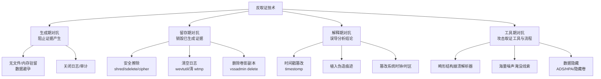
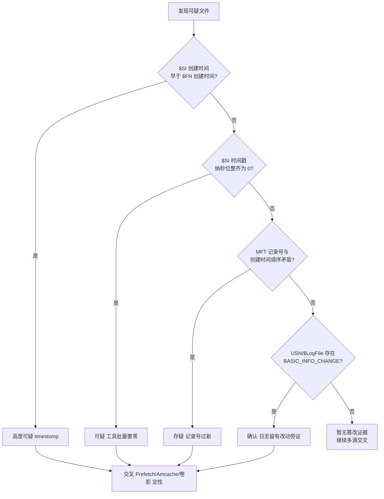
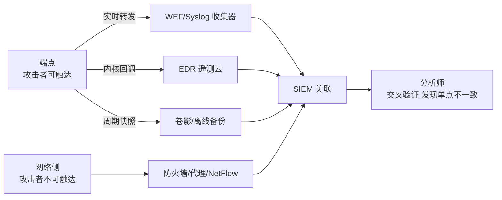

# 数字取证与事件响应（14）· 反取证技术与对抗
> [!abstract] TL;DR
> - 反取证的本质，是攻击"证据的**生成—留存—解释—分析**"四个环节；防御的胜负手是**多源冗余**——攻击者要抹平所有痕迹才算成功，分析者只需找到一处不一致就能定性。
> - NTFS 把时间戳同时记在 `$STANDARD_INFORMATION`（$SI）与 `$FILE_NAME`（$FN）两处，前者可被 `SetFileTime` 改、后者普通 API 改不到——`$SI` 创建时间早于 `$FN`、纳秒位整齐置零、MFT 记录号与创建时间矛盾，是 timestomp 的三大破绽。
> - 清日志本身就是最大的痕迹：EVTX 会留下 1102/104 清空事件、EventRecordID 断号、chunk 的 CRC32 与记录数不符；Linux 侧靠难以伪造的 ctime、journald 的 FSS 封印与外发日志兜底。
> - 安全擦除在 SSD 上因 FTL 磨损均衡而不可靠——既让攻击者的销毁不彻底，也给芯片级取证留了机会；HPA/DCO/ADS/隐藏卷属于"藏"而非"删"，各有对应的枚举与旁路手段。
> - 检测总纲 = 不变量校验 + 带外证据（WEF/EDR/网络侧/卷影）+ 元痕迹（擦除工具的执行记录、`vssadmin delete` 动作），核心是用未被污染的旁证把被篡改的单一源顶出破绽。
> - 本章一律采取防御与教育视角，只讲"如何识破"，不提供针对真实生产或他人系统、亦不为绕过商业授权的武器化配方。

## 概述与定位

反取证（Anti-Forensics）不是某一件工具，而是一整套**与取证方法针锋相对**的思想体系：取证方相信"系统运行会不可避免地留下可解释的痕迹"，反取证方则处心积虑地在痕迹的**产生、保存、解读**各个环节上做手脚，让这条"痕迹链"断裂、失真或指向错误的结论。学术上常引用 Marcus Rogers 的四分法——**销毁（destruction）、隐藏（hiding）、来源消除（source elimination）、伪造（counterfeiting）**；工程上我更喜欢按"证据生命周期"划分为四个对抗面，本章即以此为骨架。

把本章放进整个系列来看，前面十三章都是在"**建证据**"：第 02 章保全镜像、03/04 章内存取证、05–08 章啃 Windows 的磁盘/注册表/日志/执行痕迹、09/10 章 Linux 与文件系统、11 章把一切汇成时间线、12 章网络取证、13 章持久化与 Rootkit。反取证正是这一切的**对偶命题**——攻击者读过同样的取证教材，知道你会去看 `$MFT`、看事件日志、看 Prefetch，于是逐个下手。因此本章的定位是"**元章节**"：它不再教你分析某一类新痕迹，而是教你在**已知这些痕迹可能被动过手脚**的前提下，如何保持怀疑、如何用交叉验证守住底线。

历史脉络值得一提。反取证作为公开研究方向，可追溯到 2000 年代初 the Grugq 在 Phrack 上的《Defeating Forensic Analysis on Unix》与"数据避孕（data contraception）"理念，以及 Metasploit 阵营的 MAFIA 工具集（timestomp、slacker、transmogrify、sam juicer）。彼时的假想敌是 EnCase 这类"死盘取证"工具，对策集中在磁盘层面。而今天，战场已经上移到**内存与遥测**：EDR 的内核回调在事件发生的**同一刻**就把它送出主机，攻击者再擦本地磁盘也追不回已外发的记录；于是现代反取证更强调"无文件（fileless）""就地取材（LOLBins）""在内存里自毁"。理解这条演进线，才能明白为什么"带外证据"是本章反复强调的题眼。

边界声明：本章**不重复**讲卷影副本、注册表、Prefetch/Amcache 的解析细节（见 05–08 章），**不重复**Rootkit 的内核隐藏机制（见 13 章与 `[[38.Windows内核与驱动逆向/11.Rootkit原理与检测]]`），也不涉及移动端（见 15 章）。本章聚焦题面给定的三条主线——**时间戳篡改、痕迹清除、检测思路**——并把数据隐藏、日志对抗、安全擦除作为一并穷尽的邻接议题。

## 原理与机制

一切取证的哲学前提是洛卡德交换原理：**凡接触必留痕**。可数字世界的"痕"并非物理必然，而是**软件设计的副产品**——文件系统愿意记时间戳、内核愿意写日志、应用愿意留历史，痕迹才存在。反取证正是钻这个空子：既然痕迹是软件"自愿"产生并保存的可变数据，那它就**可以被阻止产生、可以被销毁、可以被改写**。据此，四个对抗面清晰浮现。

**生成期对抗**——不让证据诞生。手法包括无文件执行（payload 只在内存/注册表值里）、关闭审计与日志、以合法进程"就地取材"避免落盘可执行文件。the Grugq 的"数据避孕"是其纯粹形态：**根本不往磁盘写东西**，取证方自然无从恢复。对策不在磁盘而在内存与实时遥测。

**留存期对抗**——证据已生成，赶在取证前销毁。安全擦除（覆写而非仅解除链接）、清空/截断日志、删除卷影副本、格式化。它的软肋是**"销毁"这个动作本身会生成新证据**：擦除工具会在 Prefetch/Amcache 留下执行记录，清日志会触发"日志已清空"事件，`vssadmin delete shadows` 会被记录。

**解释期对抗**——不销毁证据，而是**污染它的可信度**，让分析者读出错误结论。时间戳篡改（timestomp）是典型：文件还在，但它自称的时间在骗你，从而毒化整条时间线。还有伪造/植入假痕迹、回拨系统时钟与时区。对策是**寻找不变量矛盾**。

**工具期对抗**——攻击取证流程与解析器本身。喂给解析器畸形的文件系统结构使其崩溃或误读、用海量噪声日志淹没真正的针、构造"在 OS 里和在取证工具里行为不同"的文件。对策是使用多个独立实现互校、并对解析异常保持警觉。

防御侧的**反-反取证**原理与之精确对偶，可归纳为四条工程铁律，后文所有检测手段都是它们的实例：

- **冗余与交叉验证**：同一事实往往被系统在多个互不知情的地方各记一份（NTFS 的 $SI 与 $FN、USN 日志、$LogFile、注册表、Prefetch、LNK、事件日志、卷影）。攻击者难以做到"改一处即改全部"。
- **不变量校验**：许多结构存在数学/逻辑约束——记录号单调递增、校验和自洽、$SI≥$FN、子秒精度非零。篡改往往打破某条不变量。
- **带外证据**：把痕迹尽快送到攻击者**够不着**的地方（远端 SIEM、EDR 云、网络侧设备、WORM 存储、离线备份）。
- **元痕迹**：反取证操作本身是一次系统活动，会留下"擦除/清空/删卷影/停服务"的次生痕迹；且**"该有的痕迹却没有"本身就是最大的异常**——一台用了三个月的机器却空空如也的日志与浏览历史，比任何单条记录都更响亮。



## 结构与算法详解

本节把三条主线落到**具体的数据结构与检测算法**上——只有看清字节布局，才能理解为什么某种篡改"改得了这里、改不了那里"。

### NTFS 时间戳：$SI 与 $FN 的双重记录

NTFS 的每个文件在主文件表 `$MFT` 中占一条记录，记录由若干"属性"拼成。时间戳被冗余地写在两个属性里：`$STANDARD_INFORMATION`（类型 0x10，简称 $SI）与 `$FILE_NAME`（类型 0x30，简称 $FN）。二者都存四个 64 位 FILETIME，取证界按 **MACB** 记忆：M=内容修改、A=访问、C=MFT 记录项修改、B=创建（born）。

```
$STANDARD_INFORMATION (属性类型 0x10) 头部字节布局：
  偏移 0x00  8B  Creation Time     (B / 创建)
  偏移 0x08  8B  Altered Time      (M / 内容最后修改)
  偏移 0x10  8B  MFT Changed Time   (C / 记录项最后修改)
  偏移 0x18  8B  Access Time       (A / 最后访问)
FILETIME = 自 1601-01-01 UTC 起的 100 纳秒计数，64 位小端

$FILE_NAME (属性类型 0x30) 头部字节布局：
  偏移 0x00  8B  父目录 MFT 引用
  偏移 0x08  8B  Creation Time     (B)
  偏移 0x10  8B  Altered Time      (M)
  偏移 0x18  8B  MFT Changed Time   (C)
  偏移 0x20  8B  Access Time       (A)
  偏移 0x28  8B  分配大小 / 0x30 8B 实际大小 / 0x38 4B 标志
  ...        文件名 (UTF-16LE)
```

关键的机制差异在于**谁能改哪个**。Win32 的 `SetFileTime()` 只能设 $SI 的创建、访问、写入三项；原生的 `NtSetInformationFile(FileBasicInformation)` 多暴露一个 ChangeTime，可把 $SI 的四项一并改到任意值。**但这两条 API 都碰不到 $FN**——$FN 只由内核在**创建、改名、移动**时改写，改写时它会把当时的 $SI 值复制进新的 $FN。这就给了取证方一个近乎"信物"的旁证。

由此推出三条 timestomp 检测算法，按可靠度从高到低：

1. **$SI 与 $FN 比对**。正常情形下 $FN 冻结在创建/改名那一刻，而 $SI 随后可能被普通操作推向未来，所以恒有"$SI 时间 ≥ $FN 时间"。timestomp 把 $SI **回拨到过去**，于是出现"$SI 创建时间 < $FN 创建时间"——文件自称比"它落到这个目录里的时刻"还老，逻辑上不可能，是最硬的破绽。
2. **子秒精度校验**。真实时间戳的纳秒位几乎不可能整齐为零；早期 timestomp（Metasploit 版）只接受秒级输入，写出的时间纳秒位全 0，一眼可辨。**但要注意版本差异**：SetMACE 等新工具能从别的文件"借"一个逼真的纳秒值，此指标遂退化为弱信号，不能单独定案。
3. **MFT 记录号与创建时间的顺序矛盾**。$MFT 记录大体按分配顺序递增编号，一个自称 2019 年创建的文件却占着被 2026 年文件包围的高记录号，值得怀疑；但记录号会随文件删除而被复用（靠序列号区分），故此指标也需与前两条合参。

必须强调**避免误报**：$SI 内部"M 早于 B"（修改早于创建）在正常世界里司空见惯——复制文件、从压缩包解压、从备份还原，都会把内容修改时间还原到过去而创建时间置为当下。所以"M<B"**不是** timestomp，真正的判据是跨属性的 $SI 与 $FN 矛盾，以及下面的日志旁证。

### USN Journal 与 $LogFile：改动的第三方旁证

即便攻击者用 SetMACE 把 $SI 与 $FN 都改得天衣无缝，NTFS 还有两本"流水账"没被顾及。

**USN 变更日志**（`$Extend\$UsnJrnl:$J`，稀疏流）为卷上每一次文件变更追加一条 USN_RECORD，含该次变更的**由系统盖章的时间戳**与"原因标志"。时间戳改动会置位 `USN_REASON_BASIC_INFO_CHANGE`（0x00008000）。这意味着：文件的 $SI 也许自称 2019 年，但 USN 会诚实记录"在真实时刻 T，此文件的基本信息被改过一次"——真实的作案时间就此暴露。攻击者若用 `fsutil usn deletejournal` 停掉日志，这个"关日志"动作本身又是一条 IOC。局限是 USN 是环形的，久远记录会被覆盖老化。

**$LogFile**（NTFS 事务日志，环形，用于崩溃恢复）记录元数据操作的 redo/undo。若时间戳改动发生不久、尚未被覆盖，其 undo 记录里可能保存着**被改前的原始时间戳前像**，从而直接把原值恢复出来。Joakim Schicht 的 LogFileParser 专做此事。

### EVTX 结构与选择性删除的破绽

Windows 事件日志（.evtx）的对抗分两档。低档是**整本清空**：`wevtutil cl <log>` 或 `Clear-EventLog`。它简单粗暴，且会在安全日志留下 **1102**、在系统日志留下 **104** 的"日志已清空"事件——清空这个动作被清空前的最后一笔忠实记下。高档是**外科手术式删单条**，要动 EVTX 内部结构，难度陡增。理解它需先看布局：

```
EVTX 文件结构：
  文件头 "ElfFile\0" (魔数) + 校验/计数字段
  └─ Chunk（每块 64KB）头 "ElfChnk\0"
       ├─ 本块首 EventRecordID、末 EventRecordID、记录数
       ├─ 头部 CRC32 + 事件数据区 CRC32
       └─ 事件记录：魔数 0x2a2a("**") | Size | EventRecordID
                    | 写入时间(FILETIME) | Binary XML | SizeCopy
  说明：EventRecordID 全局单调递增；记录头尾各存一个 Size 且必须相等
```

`EventRecordID` **全局单调递增**、块内连续，且每条记录首尾各写一份 Size。DanderSpritz 的 `eventlogedit` 之流删单条的办法，是把**前一条记录的 Size 撑大**去"吞并"目标记录，再重算 CRC32。它能骗过校验和，却难同时抹平所有不变量，于是留下可检特征：

- **EventRecordID 断号**：块内本应连续的 ID 出现缺口，说明有记录被吞。
- **尺寸账目不平**：把块内各记录 Size 累加，与块内容实际长度对不上；或块头声明的记录数、末号与实测解析结果矛盾。
- **结构残影**：被吞并区域内部仍残留原记录的 BinXML 片段或对不齐的边界。

因此对 EVTX，取证方不能只用图形查看器"看有没有"，而要用能做**结构级校验**的解析器逐块核对 CRC、记录数、ID 连续性。另有一类工具（如 Invoke-Phant0m）根本不删记录，而是**掐死事件日志服务的工作线程**：服务进程还在、看着正常，却不再写任何新事件、也不产生停止事件。这类只能靠"服务在跑却在某时刻后再无事件"的时间空洞、内存里的线程分析、以及 Sysmon/EDR 的带外遥测来识破。



### Linux 与 ext4：ctime 的不可伪造性

ext4 的 inode 存四个时间：atime、mtime、ctime，以及 ext4 新增的 crtime（创建），每个都带一个"extra"字段容纳纳秒（并借高位把纪元延展过 2038）。对抗与 NTFS 有本质不同：Linux 没有 $FN 这样的第二副本，但它有一个"改不动"的 ctime。`touch -t/-d/-r` 走 `utimensat` 只能设 atime 与 mtime；**ctime 在任何 inode 变更时都会被内核刷新，且没有公开 API 能把它设成任意值**。要伪造 ctime/crtime，只能在**卸载后**用 `debugfs set_inode_field` 直接改磁盘 inode，或把系统时钟整体回拨（副作用波及全盘、且回拨本身留痕）。因此 Linux 时间戳取证更倚重 ctime 与 mtime 的矛盾（比如 mtime 在远古而 ctime 是昨天），以及 jbd2 文件系统日志与外部日志。

日志与历史的清除同样是重点。`wtmp/utmp/btmp` 是定长 `struct utmp` 记录的二进制账本，外科式删除某条登录会留下全零块或明显缺口；`lastlog` 亦然。Shell 历史的规避五花八门——`unset HISTFILE`、`HISTSIZE=0`、`history -c`、`set +o history`、把 `~/.bash_history` 软链到 `/dev/null`、或干脆 `kill -9` 让 shell 来不及在正常退出时回写历史。对策是别指望单一来源：用 `auditd` 的 execve 审计、进程记账（`pacct`/`lastcomm`）、sudo 日志互相印证。

尤其值得记住的是 **systemd-journald 的前向安全封印（FSS）**：`journalctl --setup-keys` 生成一对随时间**演化**的密封密钥，journald 周期性用当前密钥封印日志段；密钥一旦演化，旧密钥即被销毁。攻击者事后即便拿到 root，也无法用早已消失的旧密钥去篡改过去的日志段而不被 `journalctl --verify` 发现——这是操作系统内建的、货真价实的"反-反取证"利器。

## 工具视角与实战

先从**攻击者会用什么、各自留下什么痕**的角度扫一遍（教育目的，仅为让防御者知道该去哪找破绽），再落到取证方的核对流程。

- **时间戳**：`timestomp`（MAFIA，仅改 $SI，留纳秒置零与 $FN 矛盾）、`SetMACE`（Joakim Schicht，能改 $SI+$FN 甚至借真实纳秒，最隐蔽，但改不动 USN/$LogFile 旁证）；Linux 侧 `touch`（碰不到 ctime）、`debugfs`（需卸载/离线）。
- **清痕迹**：`wevtutil cl`/`Clear-EventLog`（留 1102/104）、`Invoke-Phant0m`（停日志线程，留时间空洞）、`DanderSpritz eventlogedit`（删单条，留断号与尺寸不平）、Linux 清 `wtmp`/`bash_history`。
- **安全擦除**：`sdelete`、`cipher /w`、`shred`、`wipe`、`Eraser`、`BleachBit`——都会在执行痕迹里留下自己的名字；且见下文 SSD 局限。
- **数据隐藏**：NTFS 交替数据流 ADS（`file.txt:hidden`）、`$BadClus` 假坏块、HPA/DCO 隐藏尾部扇区、VeraCrypt/LUKS 全盘加密与**隐藏卷**（合理否认）。
- **反工具**：解压炸弹、畸形 MFT/日志使解析器崩溃、海量噪声日志。

取证方的工具与核对流程，围绕"多实现互校 + 不变量校验"展开：

- **MFT 与时间戳**：`MFTECmd`/`AnalyzeMFT` 同时导出 $SI 与 $FN 四时间，一列对齐即见 timestomp；`UsnJrnl2Csv`、`LogFileParser`（均 Joakim Schicht 系）补上 USN 与 $LogFile 旁证与原始前像。
- **事件日志**：`EvtxECmd`、`python-evtx`、`evtx_dump` 做结构级解析；`chainsaw`、`hayabusa` 批量狩猎并能报告 ID 断号；重点核对 1102/104 与 EventRecordID 连续性。
- **ADS 枚举**：`dir /r`、PowerShell `Get-Item -Stream *`、Sysinternals `streams.exe`，把非 `Zone.Identifier` 的可疑流、尤其含可执行内容的流揪出来。
- **隐藏扇区**：成像时用能读原生最大地址的写阻断器/取证桥，比对"报告容量 vs 原生容量"发现 HPA/DCO；`hdparm` 可读可解，但取证一律先只读镜像。芯片级恢复见 `[[39.固件与IoT嵌入式逆向/22.eMMC与NAND芯片级取证]]`。
- **汇总定性**：`Plaso`（超级时间线框架）与 `mactime` 把多源痕迹拉进同一条中文时间线（详见 `[[11.时间线分析与超级时间线]]`），一处被篡改的源会在旁证密布的时间线里凸显为孤立异常；`Velociraptor`/EDR 提供带外遥测；内存侧用 Volatility（见第 03、04 章）抓住那些"只在内存里"的对抗。

一个贴合实战的微型推演：某可执行文件 $SI 自称 2019 年、看似人畜无害。取证方用 MFTECmd 一看，$FN 创建时间却是 2026-06 且纳秒位过于整齐 → 初判 timestomp；转 UsnJrnl2Csv，果然有一条 2026-06 的 `BASIC_INFO_CHANGE` → 坐实改动时刻；再交叉 Prefetch/Amcache，发现该程序**首次执行**恰在 2026-06，与被回拨的"创建时间"自相矛盾；最后卷影副本里躺着篡改前的目录状态。至此单一被污染的时间戳，被四路独立旁证合围定性。这正是"攻击者需完美、防御者只需一处不一致"的现场写照。



## 安全性与正确使用

> [!caution] 合规边界与使用立场
> 本章讲解的时间戳篡改、日志删改、安全擦除、数据隐藏等技术，**仅用于**你**自有或已获书面授权**的环境、CTF 靶场与防御性安全研究，且**一律采取防御/教育视角**——目的是让你学会**识破**这些手法、建设抗篡改的取证体系。
> 严禁将其用于销毁、伪造真实案件证据（在多数法域构成妨害司法/毁灭证据）、对抗合法调查、破坏他人或生产系统，亦**不得**用于绕过商业软件授权或版权保护。本文只讲"原理与如何检测"，**不提供**针对任何真实目标的成品化武器化步骤。若你的工作涉及正式调查，请遵循所在组织与法律规定的证据链与合规流程。

从取证方自身的"正确使用"看，最重要的纪律是**别让自己成为反取证的帮凶**：分析必须在**只读**镜像上进行，采集用写阻断器、全程哈希（获取即算、每步复核）以保全证据链——你若在原盘上不慎写入，等于亲手制造了 timestomp 与元数据污染。第 02 章的镜像与保全规程是本章一切检测的前提。

工程上真正让反取证失效的，是**在被入侵之前就把防线建好**，其价值远高于事后侦破：

- **带外与防篡改日志**：Windows 事件转发（WEF）到独立收集器、Linux 远端 syslog、开启 journald 的 FSS 封印、关键日志落到 **WORM/一次写多次读**存储。证据一旦离开端点，攻击者的本地擦除便追不回。
- **EDR 与 Sysmon**：内核级遥测在事件发生的同刻外发，天然抵御事后删日志；合理的 Sysmon 配置能补上原生日志的盲区。
- **快照与备份**：卷影、定期离线备份留存篡改前状态；同时监控 `vssadmin delete shadows` 这类"删卷影"元痕迹。
- **网络侧留证**：防火墙、代理、NetFlow 记录攻击者在主机上够不着，是最可靠的旁证之一（详见 `[[72.抓包与协议分析实战/19.网络取证与流重组]]`）。

也要**诚实面对检测的极限**。SSD 的 FTL 磨损均衡使"覆写逻辑块"并不覆盖物理 NAND 单元——这把双刃剑一面让攻击者的安全擦除并不彻底（旧数据可能残留在未映射页，给芯片级取证留机会），另一面也让取证方对"目标扇区"的恢复变得不确定（TRIM/ATA Secure Erase/加密擦除会真的抹掉）。面对拥有内核/引导前权限的高级对手、密钥未知的全盘加密、或已做物理销毁的介质，取证方应实事求是地报告"无法恢复"，而非强行给出不可靠结论——过度自信的误判，比承认盲区更危险。

## 小结

反取证与取证是同一枚硬币的两面：取证相信痕迹，反取证攻击痕迹的**生成、留存、解释、分析**。本章把三条主线讲透——**时间戳篡改**赢在污染时间线，却输在 NTFS 的 $SI/$FN 双记账与 USN/$LogFile 旁证、以及 Linux 难伪造的 ctime；**痕迹清除**能删记录，却删不掉"删除"这个动作留下的 1102/104、EventRecordID 断号、擦除工具的执行痕迹与 `vssadmin delete` 记录；**数据隐藏与安全擦除**在 ADS/HPA/隐藏卷与 SSD FTL 面前各有旁路与局限。

贯穿始终的检测心法只有一句：**攻击者要抹平所有源才算成功，分析者只要找到一处不一致就能定性**。把它拆成可操作的四条——不变量校验、多源交叉、带外证据、元痕迹——你就拥有了一套稳健的反-反取证方法论。真正的胜负手不在事后神探，而在事前就把日志外发、把遥测上云、把备份做好，让反取证从一开始就无处施展。

## 相关阅读

- 本系列上下文：`[[11.时间线分析与超级时间线]]`（多源时间线如何令单点篡改凸显）、`[[07.Windows事件日志分析]]`（EVTX 结构与事件语义）、`[[05.Windows磁盘取证痕迹]]`（$MFT 与 NTFS 元数据）、`[[13.恶意持久化与Rootkit取证]]`（对抗的上游动机）、`[[00.数字取证与事件响应总览]]`。
- 攻击上游动机：`[[50.恶意代码分析与免杀对抗/08.持久化技术大全]]`、`[[50.恶意代码分析与免杀对抗/06.进程注入技术全谱]]`（无文件与内存驻留即"生成期对抗"的实现）。
- 带外与硬件旁证：`[[72.抓包与协议分析实战/19.网络取证与流重组]]`（网络侧不可篡改证据）、`[[39.固件与IoT嵌入式逆向/22.eMMC与NAND芯片级取证]]`（SSD/闪存的芯片级恢复）、`[[38.Windows内核与驱动逆向/11.Rootkit原理与检测]]`（内核层隐藏与检测）。
- 权威文献与文档：Brian Carrier《File System Forensic Analysis》（NTFS/$MFT 权威剖析）；the Grugq《Defeating Forensic Analysis on Unix》（Phrack 第 59 期，反取证思想源头）；Microsoft 关于 NTFS 属性、USN Change Journal 与 Windows Event Log（EVTX）二进制格式的官方文档；SANS FOR500/FOR508 的取证参考海报；Mandiant 关于事件日志单条删除（eventlogedit）取证识别的公开研究。

[[00.数字取证与事件响应总览|⬆ 系列总览]] | [[13.恶意持久化与Rootkit取证|← 上一章]] | [[15.移动设备取证：Android与iOS|→ 下一章]]
