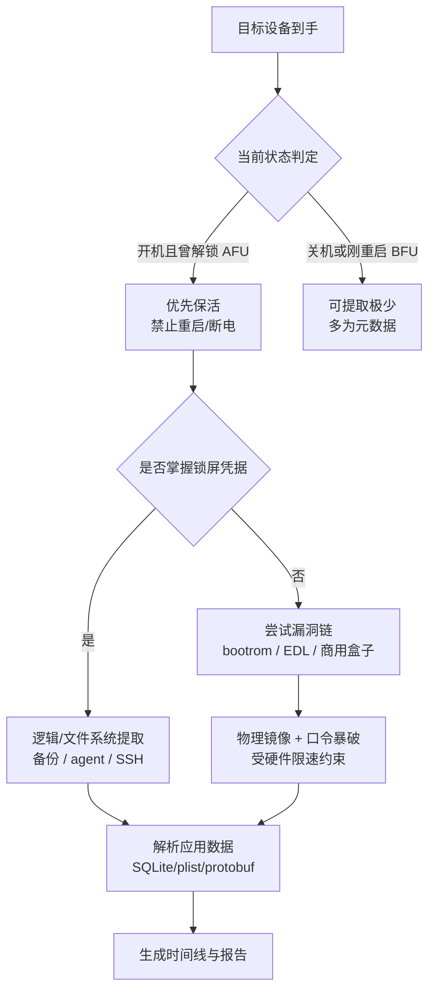
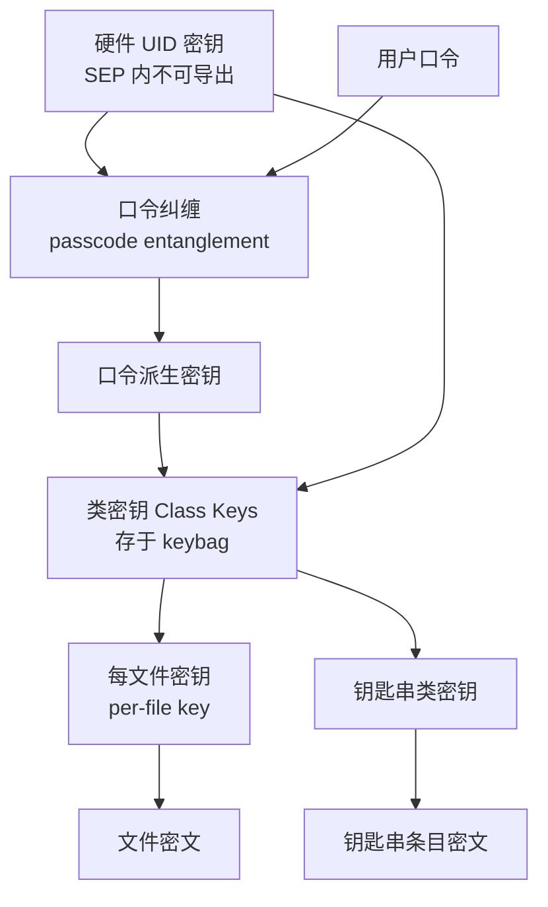
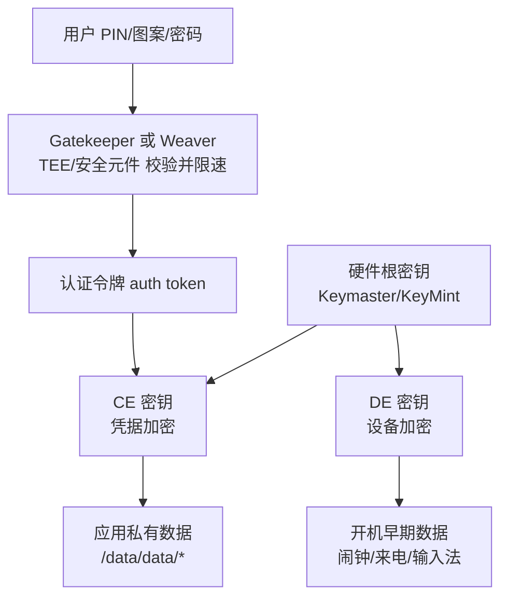
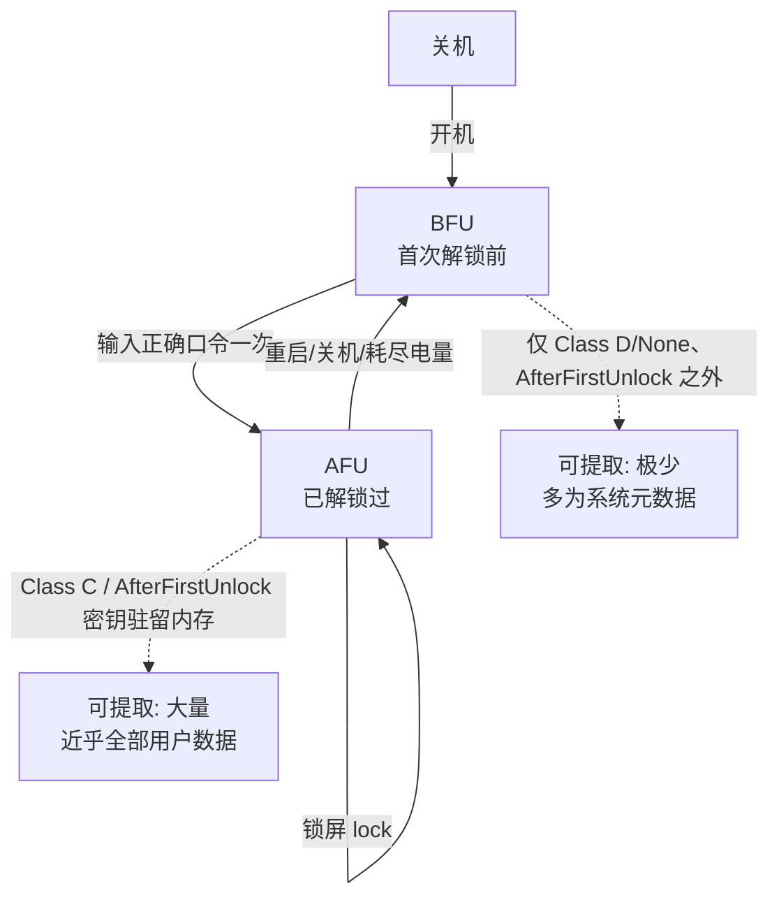

# 数字取证与事件响应（15）· 移动设备取证：Android与iOS
> [!abstract] TL;DR
> - 移动取证的中心矛盾是"全盘强加密 + 封闭硬件"：与传统磁盘取证不同，把闪存原始比特读出来往往只得到一堆密文，能否落地取决于**密钥而非能否读比特**。
> - 提取按能力分四级——手工、逻辑、文件系统、物理，级别越高数据越全、越依赖漏洞链与锁屏凭据；实战里**设备当前状态**比工具更决定成败。
> - iOS 用 Data Protection 分类密钥 + Secure Enclave 口令纠缠 + Effaceable Storage 组成密钥树，钥匙串按 `kSecAttrAccessible` 分级加密；Android 从 FDE（dm-crypt 全盘）演进到 FBE（fscrypt 文件级），分 CE/DE 两类密钥并由 TEE/Weaver 硬件限速。
> - BFU（首次解锁前）绝大多数类密钥不在内存，几乎取不到用户数据；AFU（已解锁过至少一次）大量密钥驻留内存——现场铁律是**不要关机、不要重启、保持供电、立即隔离射频**。
> - 应用数据的战场在 SQLite（WAL/journal/freelist 残留可恢复已删记录）、二进制 plist（`bplist00` 与 `NSKeyedArchiver`）、protobuf、LevelDB；`knowledgeC.db`、`Cache.sqlite`、`sms.db` 等是行为时间线的富矿。
> - checkm8 等 bootrom 漏洞、EDL/Firehose、GrayKey/Cellebrite 与开源 iLEAPP/ALEAPP/MVT 共同构成工具链；口令暴破的天花板由 SEP/安全元件的**硬件限速**而非算力决定。

## 概述与定位

移动设备取证在整个 DFIR 版图里是一块自成体系、且逐年"越来越难"的领域。前面章节讨论的磁盘取证（第 05、10 篇）、内存取证（第 03、04 篇）、Windows/Linux 主机痕迹（第 05–09 篇），其共同前提是"介质基本可读、数据基本明文或弱保护"：我们能挂载只读镜像、能碳拷贝扇区、能用写保护器保证证据不被污染。移动设备把这三个前提几乎全部推翻——存储芯片焊死在主板上、系统分区只读且被验证启动锁定、用户数据默认被硬件绑定的强加密保护、设备始终在线且随时可能被远程擦除。因此本篇的定位不是"把手机当成一块小硬盘来做磁盘取证"，而是**围绕"如何在加密与封闭硬件的约束下，把尽可能多的数据以可法庭采信的方式取出并解释"这一核心问题展开**。

这个领域的另一个特征是**双寡头生态**：Android 与 iOS 在存储、加密、启动链、应用沙箱上的设计哲学差异巨大，取证路径几乎完全不同，所以本篇必须并行讲两条线，并在关键处横向对比。Android 是开放但碎片化的——芯片平台（高通、联发科、三星 Exynos、麒麟）、厂商定制、Android 版本、加密方案（FDE/FBE）交叉组合，取证方法高度依赖具体机型；iOS 是封闭但统一的——同一套 Data Protection 架构贯穿全系，取证方法更"标准化"，但每一代 SoC 的 Secure Enclave 都在收紧攻击面。

需要划清与相邻篇目的边界。本篇讲的是**芯片之上的逻辑取证**：通过接口、备份、漏洞链拿到（可能加密的）文件系统与应用数据并解析。而当设备物理损毁、接口全死、必须把 NAND/eMMC 芯片拆下来用编程器直读裸颗粒（chip-off）、或用 ISP/JTAG 焊点旁路时，那属于[[39.固件与IoT嵌入式逆向/22.eMMC与NAND芯片级取证]]的范畴——那一篇解决"如何把比特读出来"，本篇解决"读出来（或不用拆芯片）之后如何解密与解释"。二者是接力关系。反取证与对抗（第 14 篇）里的擦除、隐藏、时间戳篡改，同样会出现在移动端（例如应用层的"阅后即焚"、系统的加密擦除），本篇会在相应处呼应而不重复。

## 原理与机制

要理解移动取证，必须先理解移动设备的**存储—加密—启动**三位一体。

**存储介质**。现代 Android 用 UFS（早期 eMMC），iOS 用定制的 NVMe/NAND 控制器。它们都是带 FTL（Flash Translation Layer）的托管闪存：主机看到的是逻辑块，真实的物理页由控制器映射，磨损均衡、坏块管理、TRIM/擦除都在控制器内部完成。这带来一个取证上的关键后果——**你无法像机械硬盘那样假设"逻辑地址 ↔ 物理位置"稳定不变**，删除的数据可能被 FTL 的垃圾回收真正抹掉，也可能残留在未映射的物理页里（只有 chip-off 才碰得到）。

**加密演进**。这是移动取证最核心的一条线。

- iOS 从 iPhone 3GS/iOS 4 起就引入**硬件级文件加密**：每个文件用独立的"每文件密钥"加密，该密钥再被"类密钥"包裹，类密钥又与硬件 UID 密钥（及口令）绑定。这套 Data Protection 体系是后文深度详解的重点。
- Android 早期（4.4–6）用 **FDE（Full Disk Encryption）**：dm-crypt 对整个 `userdata` 分区做块级加密（AES-CBC-ESSIV → 后期 AES-XTS），主密钥被"用户凭据派生密钥 + 硬件绑定密钥"包裹，存于分区尾部的 crypto footer。FDE 的痛点是"全有或全无"——开机必须先解密才能启动，于是催生了"默认密码解密再要求二次输入"的别扭体验。
- Android 7 引入、10 起强制的 **FBE（File-Based Encryption）**：基于内核 `fscrypt`（ext4/f2fs 原生加密），每个文件/目录用独立密钥加密，并区分 **CE（Credential Encrypted，凭据加密）** 与 **DE（Device Encrypted，设备加密）** 两类密钥。这使得"直接启动"（Direct Boot）成为可能——闹钟、来电界面等用 DE 数据在解锁前就能工作，而绝大多数应用私有数据用 CE 数据、必须解锁后才可访问。

**启动链与信任根**。iOS 是 BootROM → LLB/iBoot → 内核的逐级签名验证链，信任根固化在只读的 SecureROM 里；Android 是 AVB（Android Verified Boot）+ dm-verity 保证系统分区完整性，bootloader 锁定状态决定能否刷入自定义镜像。这条链的存在意味着：**你不能随便刷个取证系统进去读数据**，任何"物理提取"要么需要合法解锁 bootloader（通常会触发数据擦除），要么需要一个绕过验证的漏洞（如 iOS 的 checkm8、联发科的 kamakiri）。

**可信执行环境**。iOS 有 **Secure Enclave（SEP）**——独立协处理器，保管 UID、执行口令校验与限速；Android 有 **TEE（ARM TrustZone）** 承载 Keymaster/KeyMint 与 Gatekeeper，高端机还有独立**安全元件**（Google Titan M、三星 eSE）承载 Weaver/StrongBox。这些硬件是暴破口令的最终天花板：即使你拿到全部密文，口令尝试的速率也被硬件强制拖慢。

**提取层级**。业界把移动取证能力分为四级，级别越高、数据越全、门槛越高：



- **手工取证（Manual）**：直接操作屏幕、逐屏拍照录像。零门槛，但主观、易漏、可能改变状态，仅作补充。
- **逻辑取证（Logical）**：通过官方接口（iTunes/Finder 备份、adb backup、MTP、AFC）拿到"设备愿意给你的"数据。合规、稳定，但受沙箱限制，很多应用数据拿不到完整。
- **文件系统取证（File System）**：拿到文件系统层面的完整拷贝（含未被备份接口暴露的私有目录），通常需要 root/越狱或 agent。数据远比逻辑级全。
- **物理取证（Physical）**：拿到存储的原始镜像（bit-for-bit）。理论最全，但在强加密时代，"物理镜像 = 一堆密文"，真正价值在于配合口令暴破解密。

## 加密体系、密钥层级与 BFU/AFU 状态详解

这一节是本篇的技术核心：不理解密钥层级与设备状态，一切"提取"都只是拿到无法解读的密文。

### iOS Data Protection：分类密钥与 keybag

iOS 的每个文件在创建时被赋予一个 **Data Protection 类**（保护等级），决定其密钥何时可用：

```text
Class A  NSFileProtectionComplete                    锁屏约 10 秒后密钥被清出内存，最强
Class B  NSFileProtectionCompleteUnlessOpen          用非对称(Curve25519)封装，锁屏时仍可写入新文件
Class C  NSFileProtectionCompleteUntilFirstUserAuthentication  首次解锁后密钥常驻至重启（应用数据默认类）
Class D  NSFileProtectionNone                         仅受 UID 密钥保护，开机即可用（无口令保护）
```

其密钥树是分层包裹的：



**为什么要这样设计（why）**：把"每文件密钥—类密钥—UID/口令"三层解耦，带来三个好处。其一，**加密擦除**极快——只要销毁类密钥（存在一小块可快速擦写的 **Effaceable Storage** 里），海量文件瞬间不可解，"抹掉 iPhone"本质就是擦这几个密钥而非逐字节覆盖。其二，**分级可用性**——Class A/B/C 让系统能在"锁屏但运行中"精细控制哪些数据可读（比如锁屏仍能收邮件写入 Class B，但读历史邮件需解锁）。其三，**硬件绑定**——UID 密钥烧录在 SEP 内、永不出芯片，使密文脱离本机后无法解密，这正是"把 NAND 拆下来直读也没用"的根本原因。

**keybag** 是承载类密钥的容器，有多种：系统 keybag（`/private/var/keybags/systembag.kb`）、备份 keybag、托管（escrow）keybag、iCloud keybag。备份 keybag 的存在解释了一个反直觉现象——**加密的 iTunes 备份反而比不加密备份含更多数据**：只有加密备份才会把钥匙串条目一并导出（用备份口令保护），不加密备份出于安全考虑不含钥匙串。

**SEP 与口令纠缠、暴破经济学**。用户口令不是直接拿去 PBKDF2，而是与 SEP 内的 UID 做"纠缠"（entangle）：每次尝试都必须过一遍 SEP，SEP 通过标定使单次尝试约 80ms，并**强制递增延迟**（连续失败后延迟指数增长，可选"10 次失败擦除"）。这意味着 4 位数字口令理论 1 万种、6 位 100 万种，但**受硬件限速，暴破时间从"秒级"被拉到"天到月级"**——GrayKey、Cellebrite Premium 的价值正在于用漏洞链在一定程度上绕过或加速这一过程，而非拥有更强算力。A11 及以前的 SoC 存在 checkm8 这类**不可修补的 BootROM 漏洞**（因为漏洞在只读 ROM 里），可加载自定义 ramdisk 提取 Class D/首次解锁前可用数据、并在设备上尝试口令；但 SEP 的限速仍在，A12+ 进一步收紧。

### 钥匙串（Keychain）内部结构

钥匙串是 iOS/macOS 存放密码、令牌、私钥、证书的系统级安全库，物理上是 `/private/var/Keychains/keychain-2.db`（较新为 `keychain.db`）这个 SQLite 库。核心表按条目类型分：`genp`（通用密码）、`inet`（网络密码）、`cert`（证书）、`keys`（密钥）。每条目有一个 **可访问性等级** `kSecAttrAccessible`，与文件的 Data Protection 类一一对应：

```text
kSecAttrAccessibleWhenUnlocked                 仅解锁时可读（对应 Class A）
kSecAttrAccessibleAfterFirstUnlock             首次解锁后至重启可读（对应 Class C，最常见）
kSecAttrAccessibleAlways(已弃用)               始终可读（对应 Class D，BFU 也能取）
...WhenPasscodeSetThisDeviceOnly / ThisDeviceOnly   不随备份迁移，绑定本机
```

**取证含义**：条目是否可导出，取决于它的可访问性等级与当前设备状态。`ThisDeviceOnly` 后缀的条目被 UID 强绑定、不进备份，只能在原机解密——这是很多"为什么加密备份里没有那条 Wi-Fi 密码/某 App token"的答案。理解这张对应表，就能在拿到钥匙串数据库后**预判哪些条目能解、哪些注定是密文**。

### Android FBE：CE/DE 双密钥与硬件限速



Android FBE 把每个应用的数据目录分成 CE 与 DE 两套存储：`/data/data/<pkg>`（CE，解锁后可用）与 `/data/user_de/<uid>/<pkg>`（DE，开机即用）。**CE 密钥的解封需要用户凭据**：PIN/图案/密码先经 **Gatekeeper**（普通 TEE 方案）或 **Weaver**（Pixel Titan M 等安全元件方案）校验。二者的关键区别在**限速位置**——Gatekeeper 在 TEE 内维护失败计数与延迟；Weaver 把"尝试次数 ↔ 派生密钥分片"绑进独立安全元件，且限速不可被主系统绕过，安全性更高、暴破更难。校验通过后产出认证令牌，交给 **Keymaster/KeyMint** 用硬件根密钥解封 CE 密钥。高端机还支持 **StrongBox**（把密钥操作放进独立安全元件）。此外 Android 10+ 引入**元数据加密**：连"哪些文件、目录结构、文件名"这类元数据也整体加密，避免 FBE 下未加密的目录布局泄露信息。

**横向对比与深层原因**：iOS 的密钥树更"细"（每文件密钥 + 四类分级 + SEP 限速），Android FBE 相对"粗"（CE/DE 两档 + TEE/SE 限速），但工程目标一致——**让密文脱离本机不可解、让口令暴破被硬件卡死、让加密擦除瞬时完成**。差异根源在生态：Apple 掌控软硬全栈可做到极致统一；Android 要兼容众多芯片厂商，只能把加密下沉到内核 `fscrypt` 通用层，再由各家 TEE/SE 兜底信任根，于是**取证难度在 Android 上高度依赖具体芯片与厂商实现**。

### BFU 与 AFU：决定成败的设备状态

这是移动取证最需要刻进肌肉记忆的概念。



- **BFU（Before First Unlock，首次解锁前）**：设备刚开机、用户还没输入过一次口令。此时口令派生密钥不存在于内存，绝大多数类密钥（iOS Class A/B/C、Android CE）都处于封装态。**能取到的极少**——只有 iOS Class D / `AccessibleAlways` 之外的少量数据、Android DE 数据。
- **AFU（After First Unlock，已解锁过至少一次）**：用户解锁过，`AfterFirstUnlock`/Class C/CE 密钥已被解封并**常驻内存**，此后即使再次锁屏，这些密钥仍在。**能取到的接近全部用户数据**。

由此得出现场第一铁律：**拿到一台正在运行（AFU）的设备，绝不要关机、绝不要重启、保持供电**——一旦断电重启跌回 BFU，就等于把已经解封的密钥重新锁进保险箱，很多数据将永久取不到（除非掌握口令）。这也是为什么执法现场会带充电宝、用 Faraday 袋隔离射频（防远程擦除/锁定）却坚持通电。

## 工具视角与实战

### Android 采集路径

从"合规低门槛"到"高数据高门槛"依次是：

```bash
# 逻辑级：adb 拉取可访问数据（需已授权 USB 调试）
adb devices
adb shell dumpsys package com.target.app          # 应用元信息
adb pull /sdcard/ ./sdcard_dump/                  # 公共存储
adb backup -apk -shared -all -f full.ab           # 老式全量备份(Android 12 起废弃)

# 文件系统级：已 root 时直取应用私有目录
adb shell su -c 'tar -cf - /data/data' > data_data.tar

# 物理级：高通 EDL（Emergency Download）用签名 Firehose programmer 读裸块
#   进入 EDL(9008) 后经 Sahara→Firehose 协议读分区(得到的是 FBE 密文)
edl.py --loader=prog_firehose_ddr.elf rl --genxml --memory=ufs
```

要点与陷阱：`adb backup` 在新版被废弃、且很多应用设置 `allowBackup=false` 直接拒绝，逻辑级越来越"贫瘠"。root 通常经 **Magisk**（无系统分区修改）或临时 boot 镜像获得，但解锁 bootloader 一般会触发 **恢复出厂**（AVB 保护），因此"为了取证去解锁 BL"往往等于毁证据，必须评估。**EDL/Firehose** 与联发科 **BROM（SP Flash Tool + kamakiri）** 能在不改动用户数据的前提下读原始分区，但 FBE 时代读到的是密文，价值取决于能否另行拿到 CE 密钥（依赖口令 + TEE 漏洞）。三星有 `dump` 类漏洞、部分机型有厂商下载模式，均高度机型相关。

### iOS 采集路径

```bash
# 逻辑级：加密备份(含钥匙串) —— 优先，数据比不加密更全
idevicebackup2 encryption on <备份口令>
idevicebackup2 backup ./ios_backup/
#   产物: Manifest.db(域-路径→文件哈希映射)、Manifest.plist、Info.plist、状态

# 提取配对记录(lockdown)以复用信任，避免反复解锁
ideviceinfo; ls /var/db/lockdown/*.plist   # 主机侧 pairing record

# 文件系统级：checkm8 设备经 checkra1n 越狱后 SSH 落地
ssh root@localhost -p 2222 'tar -cf - /private/var/mobile' > mobile.tar
```

商用方案：**Cellebrite UFED / Physical Analyzer**、**Magnet AXIOM**、**MSAB XRY**、**Oxygen Forensic**、**Elcomsoft iOS Forensic Toolkit** 覆盖采集到解析全流程；**GrayKey（Grayshift）** 与 **Cellebrite Premium** 专攻口令暴破与深度提取。开源侧：**libimobiledevice**（`idevice*` 系列走 lockdown/AFC 协议）、**iLEAPP/ALEAPP**（iOS/Android 痕迹解析器）、**MVT（Mobile Verification Toolkit，Amnesty）** 专门比对已知 IOC 检测 Pegasus 类雇佣间谍软件——这条线与[[50.恶意代码分析与免杀对抗/08.持久化技术大全]]直接呼应。

### 应用数据解析：真正的战场

拿到文件系统后，绝大部分时间花在解析结构化数据上。

- **SQLite** 是重中之重。除主库外，必须一并采集 **`-wal`（Write-Ahead Log）** 与 **`-shm`**、以及旧式 **`-journal`**：WAL 里可能保存着尚未合并进主库的**最新**记录，甚至已在主库"消失"的**历史**版本。已删除记录常残留在 **freelist 页** 与页内**未分配单元（unallocated cell）** 中，可用记录雕刻（record carving）恢复。忽略 WAL/journal 是新手最常见、也最致命的漏证。

```bash
# 合并 WAL 后再解析，避免漏掉未落盘记录
sqlite3 sms.db "PRAGMA wal_checkpoint(TRUNCATE);"
sqlite3 sms.db "SELECT datetime(date/1000000000+978307200,'unixepoch'), text FROM message;"
#   注: iOS 时间戳基准是 2001-01-01(Mac 绝对时间)，需 +978307200 换算 Unix 纪元
```

- **二进制 plist**（`bplist00`）：iOS 无处不在的配置/状态格式，常内嵌 **`NSKeyedArchiver`** 序列化的对象图，需反归档还原真实结构（`plistutil`、`ccl_bplist`）。
- **protobuf / LevelDB / Realm**：现代 App（尤其 IM）越来越多用这些格式，protobuf 无 schema 时需靠 `protoc --decode_raw` 盲解，LevelDB 常见于浏览器与部分应用缓存。

**高价值痕迹目录**（构建时间线的富矿）：

```text
iOS   sms.db / chat.db(iMessage)、CallHistory.storedata、AddressBook.sqlitedb
      knowledgeC.db(应用使用/设备事件/CoreDuet)、interactionC.db、Cache.sqlite(定位)
      Photos.sqlite、Safari History.db、Notes NoteStore.sqlite、健康 healthdb、Powerlog
Android /data/data/com.android.providers.*(联系人 contacts2.db、短信 mmssms.db、通话)
      /data/system/usagestats(应用使用)、Wi-Fi 配置、账户、各 App 的 databases/ 目录
```

其中 iOS 的 `knowledgeC.db`（由 CoreDuet/"biome"记录）几乎是"设备行为黑匣子"——应用前台时长、锁屏解屏、插拔充电、蓝牙连接等以带纳秒时间戳的方式沉淀，配合 `Cache.sqlite` 的定位缓存，能高保真还原机主活动，是移动取证近年最被倚重的证据源之一。

## 安全性与正确使用

移动取证的"正确使用"边界，既是法律的也是技术的，两者缺一都会让证据作废或造成不可逆破坏。

**合法性与授权是前提**。移动设备承载的隐私密度远超普通电脑（位置轨迹、健康、私密通信）。任何提取都必须在明确法律授权（搜查令、当事人同意、企业设备的合规策略）范围内进行，并遵守**最小化原则**——只提取与案件相关的数据，避免无差别全量导出后的隐私外溢。

**证据保全与状态保护**。移动端**几乎不存在真正的写保护器**：任何逻辑/文件系统采集都可能在设备上留下痕迹（新建备份、生成日志、更新"最近使用"）。正确做法是**如实记录**每一步操作（谁、何时、用什么工具、什么命令、产生什么改变），用**哈希（SHA-256）**固定采集产物，形成完整的证据链（第 02 篇）。基于前述 BFU/AFU 原理，现场处置遵循：立即**射频隔离**（Faraday 袋/飞行模式）防远程擦除与锁定、**保持供电**、**不重启不关机**、对已解锁设备想办法维持解锁态（调长自动锁屏、避免误触）。

**加密带来的能力边界要如实说明**。取证报告不能夸大能力：BFU 的强加密设备、启用了 StrongBox/Weaver 的高端 Android、A12+ 的 iOS，在无口令时**可能就是取不到用户数据**，这是硬件设计使然而非工具无能。把"物理镜像成功"误报为"数据已获取"，或对暴破可行性做不切实际承诺，都是专业性事故。

**误用风险与加固视角**。同一套技术，防守方要反过来用：企业应假设"丢失的设备可能被 AFU 状态提取或被商用盒子攻击"，据此推行**强口令（拉长而非 4 位）、开机即需口令、启用硬件安全元件、及时更新修补漏洞链、MDM 远程擦除、敏感应用用 `ThisDeviceOnly` 且不进 iCloud/备份**等策略。个人层面，关机使设备回到 BFU 是对抗物理提取最简单有效的一招。此外，越狱/root 会**整体削弱** Data Protection/FBE 的保护面，是重大安全降级，不应为便利而常态化。

**对抗与反取证意识**。应用层的"阅后即焚"、系统的加密擦除、恶意软件的自清理，都会制造"数据本就不该存在"的假象；取证者需结合多数据源交叉验证（如 `knowledgeC.db` 与应用库比对），并对间谍软件保持警觉（用 MVT 比对 IOC）——这与[[38.Windows内核与驱动逆向/11.Rootkit原理与检测]]和第 14 篇的思路一脉相承。最后，**双工具验证**是铁律：关键结论应由两套独立工具/方法相互印证，避免单一解析器的 bug 或格式误读把错误当结论。

## 小结

移动取证的本质，是在"强加密 + 封闭硬件 + 始终在线"的三重约束下，最大化地、可采信地获取并解释数据。与传统磁盘取证"读出比特即胜利"不同，这里**密钥决定一切**：iOS 用每文件密钥 + 四类分级密钥 + SEP 口令纠缠 + Effaceable Storage 组成密钥树，钥匙串按 `kSecAttrAccessible` 分级；Android 从 dm-crypt 全盘 FDE 演进到 fscrypt 文件级 FBE，用 CE/DE 双密钥并由 Gatekeeper/Weaver/StrongBox 硬件限速。提取分手工、逻辑、文件系统、物理四级，级别越高越依赖漏洞链（checkm8、EDL/Firehose）与凭据；而真正决定成败的，往往不是工具而是**设备状态**——AFU 下密钥驻留内存、数据近乎全可取，BFU 下密钥深锁、几近颗粒无收，故现场"不重启、不断电、先隔离射频"是压倒一切的铁律。拿到数据后，战场转到 SQLite（务必带上 WAL/journal 与 freelist 残留）、二进制 plist、protobuf 的解析，`knowledgeC.db`、`Cache.sqlite`、`sms.db` 等构成行为时间线的富矿。工具链由商用盒子（Cellebrite、Magnet、GrayKey）与开源利器（libimobiledevice、iLEAPP/ALEAPP、MVT）共同支撑。始终牢记：能力有硬件天花板，报告须如实、证据须固化、隐私须最小化。

## 相关阅读

- [[39.固件与IoT嵌入式逆向/22.eMMC与NAND芯片级取证]]（接力篇：接口全死时的芯片级 chip-off / ISP 直读）
- [[50.恶意代码分析与免杀对抗/08.持久化技术大全]]（移动端间谍软件持久化与 MVT 检测的上游）
- [[50.恶意代码分析与免杀对抗/06.进程注入技术全谱]]（内存驻留与 hook 的原理呼应）
- [[72.抓包与协议分析实战/19.网络取证与流重组]]（移动流量侧取证的补充视角）
- [[38.Windows内核与驱动逆向/11.Rootkit原理与检测]]（内核级隐藏与反取证的思路互通）
- 官方与权威资料：Apple《Platform Security Guide》（Data Protection / Secure Enclave / Keychain 章节）、Android 源码站《File-Based Encryption / Metadata Encryption / Keystore》文档、`libimobiledevice`、`iLEAPP` / `ALEAPP`、Amnesty `MVT` 项目文档、SQLite 官方《Write-Ahead Logging》与文件格式规范、SANS FOR585《Smartphone Forensic Analysis In-Depth》、checkm8 / checkra1n 技术资料。

[[00.数字取证与事件响应总览|⬆ 系列总览]] | [[14.反取证技术与对抗|← 上一章]]
