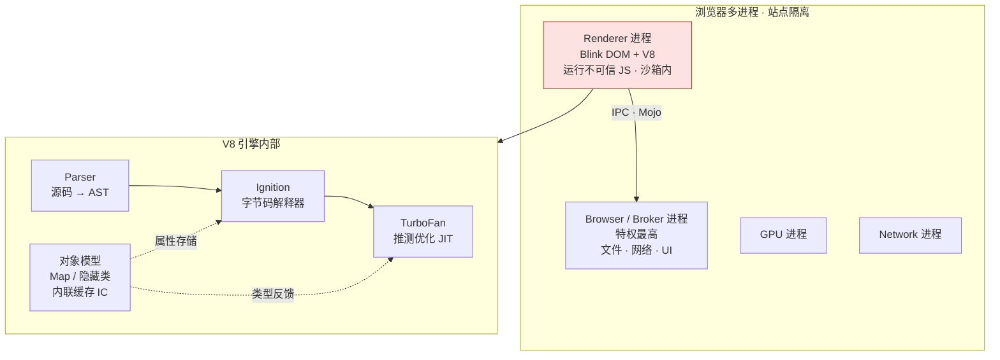
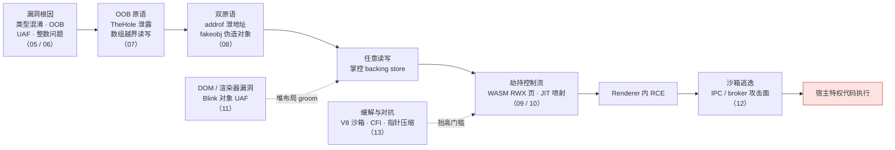

# 浏览器与JS引擎漏洞 · 系列总览

> 高端 pwn 方向：从一个 JavaScript 层面的类型混淆或越界，一路打到渲染进程内任意代码执行，再穿透沙箱拿到宿主特权——被视为二进制利用的「皇冠明珠」。本系列串起浏览器多进程架构、V8 对象模型与 JIT、JS 引擎漏洞类型、addrof/fakeobj 原语到 RCE，以及沙箱逃逸，形成从根因到完整利用链的闭环。承接 [[41.Compiler|编译器（JIT）]] 与 [[33.二进制漏洞与利用基础/00.二进制漏洞与利用基础总览|利用基础]]。

## 系列全景

一张图看清「不可信 JS 在哪里跑、V8 内部如何把它编译执行、原语从哪一层长出来」：渲染进程被沙箱关住，只能靠 IPC 向 broker 请求特权操作；而 V8 的推测优化（TurboFan）与对象模型（Map/隐藏类）既是性能来源，也是类型混淆与 OOB 的温床。

## 篇目导航

| # | 章节 | 说明 |
| --- | --- | --- |
| 01 | [[01.浏览器架构与攻击面]] | 渲染/网络/GPU 进程、IPC、攻击面地图 |
| 02 | [[02.多进程与沙箱模型]] | 站点隔离、broker、能力最小化 |
| 03 | [[03.V8架构：解析到字节码到JIT]] | Ignition、TurboFan、优化管线 |
| 04 | [[04.V8对象模型：Map与隐藏类]] | Map/Shape、内联缓存、属性存储 |
| 05 | [[05.JavaScript引擎漏洞类型]] | 类型混淆、越界、UAF、整数问题 |
| 06 | [[06.类型混淆与JIT优化漏洞]] | 推测优化、去优化、边界消除缺陷 |
| 07 | [[07.TheHole与OOB原语构造]] | 哨兵泄露、数组 OOB 读写 |
| 08 | [[08.addrof与fakeobj原语]] | 地址泄露与伪造对象双原语 |
| 09 | [[09.从任意读写到RCE]] | WASM RWX、JIT 喷射、控制流劫持 |
| 10 | [[10.WebAssembly与RWX利用]] | wasm 可执行页、跳板 |
| 11 | [[11.渲染器漏洞与DOM引擎]] | DOM UAF、Blink/WebKit 对象生命周期 |
| 12 | [[12.沙箱逃逸原理]] | IPC 攻击面、broker 漏洞、逃逸链 |
| 13 | [[13.浏览器漏洞缓解：V8沙箱与CFI]] | 指针压缩沙箱、CFI、缓解与绕过 |

> [!warning] 合规红线与学习建议
> - **仅限授权环境**：本系列全部技术只用于**自有设备、获得书面授权的目标、CTF 靶场（pwn.college、Google CTF、picoCTF、*CTF 等）**与防御性安全研究；对他人浏览器、线上服务或未授权系统实施漏洞利用属违法行为，后果自负。
> - **防御视角优先**：钻研 addrof/fakeobj、JIT 类型混淆与沙箱逃逸，目的是读懂补丁 diff、评估缓解（V8 沙箱 / CFI / 指针压缩）、驱动 Fuzzing 与应急响应，而非制造武器。
> - **学习路径建议**：① 先补 [[41.Compiler|JIT/编译原理]] 与 [[33.二进制漏洞与利用基础/00.二进制漏洞与利用基础总览|利用基础]]（ASLR 绕过、任意读写心智模型）；② 自行编译 debug 版 V8，用 `d8 --allow-natives-syntax` 配合 `%DebugPrint` / `--print-opt-code` 边读边验证对象内存布局；③ 从历史 n-day（CVE + 公开 writeup）复现起步，理解补丁语义后再看新漏洞，切忌直接照抄 exploit。

## 利用链纵览 · 学习路径

从一个根因漏洞打到宿主特权的标准链路，同时对应本系列 05 → 13 的推进顺序：先在 JS 引擎内把 bug 磨成内存原语，得到任意读写后借 WASM/JIT 落地 RCE，最后穿透沙箱；而第 13 章的缓解（V8 沙箱、CFI）会抬高每一环的门槛。

## 与知识库既有体系的衔接

- 利用承接：[[33.二进制漏洞与利用基础/15.ASLR与PIE绕过技术]]、任意读写原语构造
- JIT 前置：[[41.Compiler|编译器与 JIT 优化]]（推测优化引入的漏洞）
- Fuzzing 呼应：[[49.Fuzzing与漏洞挖掘/15.浏览器与JS引擎Fuzzing]]
- WASM 呼应：[[40.WASM与虚拟化壳逆向/06.WASM内存模型与线性内存安全]]
