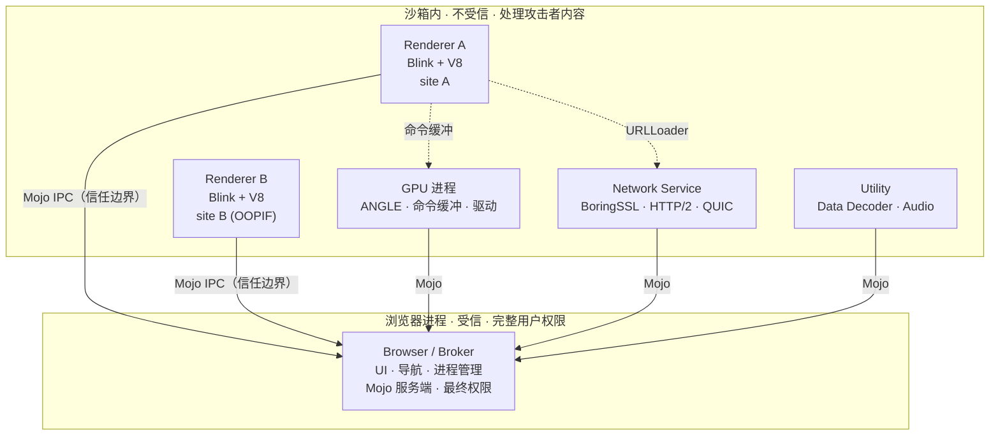
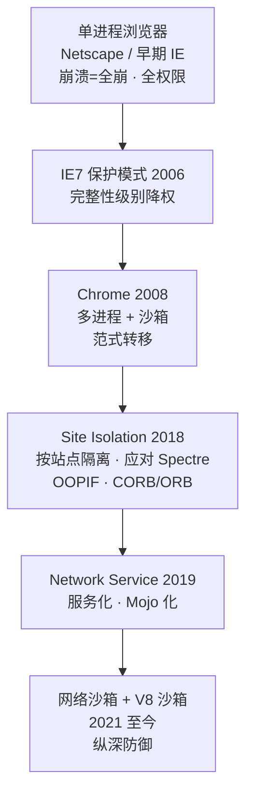
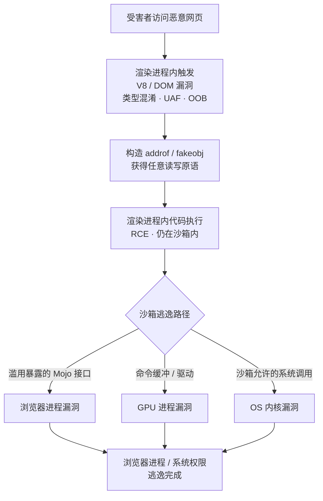

# 浏览器与JS引擎漏洞（1）· 浏览器架构与攻击面
> [!abstract] TL;DR
> - 现代浏览器本质是一台「运行不可信代码的操作系统」：它必须在用户完整权限的机器上解析并执行来自任何陌生人的 HTML/JS/字体/协议流，攻击面就是这条「敌意输入↔受信代码」信任边界上被暴露的一切解析器与 IPC 端点。
> - Chromium 的进程分工——浏览器进程（受信、broker）、渲染进程（Blink+V8、直面网页）、GPU 进程、网络服务、各类 Utility 服务——把敌意内容关进沙箱；**渲染进程是网页可直达的最大攻击面**，也是漏洞链的第一跳。
> - 进程间通信从 legacy `IPC::Message` 演进到 **Mojo**：能力式（持有 message pipe 句柄 = 拥有调用权）、`.mojom` 强类型接口；浏览器进程必须奉行「永不信任渲染进程」，每个暴露给渲染进程的 Mojo 端点都是潜在的沙箱逃逸入口。
> - 一次完整的浏览器 0-day 通常是「**渲染器 RCE + 沙箱逃逸**」的漏洞链：先在沙箱内拿执行权，再打 Mojo 端点 / GPU 进程 / OS 内核跨过信任边界，最少 1+1，往往更多。
> - **Site Isolation**（2018，为应对 Spectre）把每个站点关进独立进程，OOPIF + CORB/ORB 把跨源数据挡在渲染进程之外，从根上重塑了侧信道、UXSS 与数据窃取的攻击面版图。

## 概述与定位

浏览器是当代最复杂、暴露面最广、也最有价值的攻击目标。它的处境非常特殊：必须把「来自任何陌生人的、完全不可信的数据与代码」（一个 URL 背后的 HTML、CSS、JavaScript、WebAssembly、字体、图片、音视频以及底层网络协议流）在用户拥有完整权限的机器上解析、编译、执行、渲染出来；与此同时还得保证这段敌意内容既碰不到用户的文件与凭据，也窥探不到其他源（origin）的数据。换句话说，浏览器实际上就是一个「运行不可信代码的操作系统」，而它那套多进程加沙箱的架构，正是对「如何在本机安全地运行敌意代码」这一问题给出的工程答案。理解攻击面，本质上就是理解这个答案在哪些接缝处会漏。

本篇是《浏览器与JS引擎漏洞》系列的第 1 篇，定位是全系列的「地图」：先不钻进任何单点漏洞，而是把浏览器拆成进程、把进程之间的信任边界画出来、把每个进程暴露给攻击者的解析器与 IPC 接口标注清楚，形成一张「攻击面地图」。有了这张地图，后续各篇的深挖才有坐标——沙箱实现细节（第 2 篇）、V8 内部与对象模型（第 3、4 篇）、JS 引擎漏洞类型与 JIT 类型混淆（第 5、6 篇）、TheHole/OOB/addrof/fakeobj 原语到任意读写再到 RCE（第 7~9 篇）、WASM 利用（第 10 篇）、渲染器与 DOM（第 11 篇）、沙箱逃逸（第 12 篇）、缓解措施（第 13 篇）——都是在这张地图上某一块区域的放大。为避免与相邻篇重复，**沙箱的具体机制（seccomp-bpf、win32k lockdown、完整性级别、受限令牌、策略）本篇只交代「在哪、为什么在、挡住了什么」，实现留给第 2 篇**；V8 内部与漏洞成因留给第 3 篇之后。

「攻击面」（attack surface）在这里有精确含义：它是**攻击者可控输入能够触达的全部代码路径之并集**，尤其是那些跨越信任边界的路径。一个解析器只要吃攻击者的字节，它就在攻击面上；一个 IPC 端点只要能被沙箱内进程调用，它就在攻击面上。度量攻击面的关键不是代码总行数，而是「敌意输入到达受信代码」的最短路径有多少条、每条路径上暴露了多少可被诱导进入异常状态（越界、类型混淆、释放后使用、整数溢出、逻辑绕过）的逻辑。攻防双方对这张地图的读法恰好相反：防御者想让每条路径都尽量短、尽量少、尽量被沙箱与检查夹住；攻击者则在找那条「没人加检查」的接缝。

## 原理与机制

**单进程的原罪。** 早期浏览器（Netscape、早期 IE）是单进程：解析、脚本、网络、UI、插件全挤在一个地址空间里，并以用户完整权限运行。后果有两层。其一是稳定性——任意一个标签页的解析器崩溃，会拖垮整个浏览器。其二也是致命的一层，是安全性——网页里任何一个内存破坏漏洞一旦被利用，攻击者直接拿到的就是「用户权限下的任意代码执行」，中间没有任何缓冲。2006 年 IE7 的保护模式（Protected Mode）借 Vista 的完整性级别（Integrity Level）第一次把渲染部分降权运行，是方向性的一步，但仍是单进程内的降权，粒度粗、隔离弱。

**Chrome 在 2008 年带来了范式转移**：它从设计之初就是多进程加沙箱。核心洞察是——既然网页内容不可信，就把处理它的那部分代码关进一个「几乎什么都干不了」的沙箱进程里；即便这段代码被攻破，攻击者也只被困在沙箱内，拿不到文件、注册表、其他进程或网络栈的直接访问权；要造成真实危害，还必须再攻破一层（沙箱逃逸）。这把「一个漏洞就完蛋」变成了「必须凑齐一条漏洞链才完蛋」，从经济学上抬高了攻击成本，也是今天一个浏览器 full-chain 0-day 在军火市场上标价数十上百万美元的结构性原因。

**为什么要拆成多进程（why）**，有三重收益，彼此叠加：

- **稳定性**：一个渲染进程崩溃只丢一个页面，浏览器主体存活。
- **安全性**：沙箱把敌意代码围起来，配合最小权限原则（least privilege），让「被攻破」不等于「有危害」。这是本系列关心的主线。
- **性能**：多核并行渲染、可通过直接杀进程快速回收内存、把不同站点的堆碎片相互隔离。

**进程角色分工**（Chromium 术语）：

- **浏览器进程（Browser process）**：唯一的「大脑」，也叫 broker。运行 UI、管理标签页与导航、协调其他进程、掌握磁盘/网络/用户配置的最终权限。它是**受信**的，跑在用户完整权限下。攻破它 ≈ 攻破用户。
- **渲染进程（Renderer process）**：跑 Blink（排版渲染引擎）与 V8（JS 引擎），直接吃并执行网页内容。**沙箱内、不受信**，大体上一个站点实例一个进程。它是网页可直达的最大攻击面，也是漏洞链第一跳的落点。
- **GPU 进程（GPU process）**：负责合成、光栅化、WebGL/WebGPU。全局共享一个。沙箱较弱（因为它必须触碰厂商 GPU 驱动），因而常被当作逃逸跳板。
- **网络服务（Network Service）**：约 2019 年从浏览器进程里拆出的独立服务，处理 HTTP/1.1、HTTP/2、HTTP/3(QUIC)、WebSocket、TLS(BoringSSL)、Cookie、缓存、DNS、内容编码等。
- **各类 Utility 服务**：Data Decoder（把 JSON/XML/图片等不可信解析挪出进程）、Audio Service、Storage Service、CDM（DRM 解密）等，均沙箱化。

**信任边界**是这张架构图的灵魂。它落在「沙箱内进程」与「浏览器进程」之间。所有跨越它的通信都走 IPC，而浏览器进程必须把来自渲染进程的每一条 IPC 都当作「可能来自一个已被完全控制的恶意渲染进程」来对待——这就是著名的 **"compromised renderer" 威胁模型**：不假设渲染进程会守规矩，只假设它可能撒谎、越权、构造畸形参数。

**Site Isolation** 是 2018 年（Chrome 67，为应对 Spectre/Meltdown 这类跨源侧信道）落地的重大加固：**按站点（eTLD+1）划分渲染进程**，让「一个进程的地址空间里绝不同时驻留本不该互相访问的两个源的数据」，从而即使 Spectre 能在进程内任意读，也读不到别的源的秘密。它带来两个结构性变化：跨站 iframe 变成独立进程里的 **OOPIF**（Out-of-Process Iframe）；以及 **CORB/ORB**（Cross-Origin Read Blocking / Opaque Response Blocking）在网络层就把不该进入某渲染进程的跨源响应体挡掉。这几乎重画了「数据窃取类」攻击面。





## 进程模型与攻击面地图详解

这一段是本篇的重心：把「进程如何划分」与「每个进程各暴露了什么」摊开讲透，并交代把它们串起来的 IPC。

### 进程模型：谁和谁共享地址空间

Chromium 的默认策略是 **process-per-site-instance**：同一个站点实例复用一个渲染进程，跨站导航或跨站子框架则分配新进程。历史上还存在 process-per-tab、process-per-site、single-process（仅调试）等模型，但在开启 Site Isolation 后，桌面端默认走**严格站点隔离**（strict site isolation），跨站一定分进程。这里的「站点」是 eTLD+1（如 `example.co.uk`），比「源」（scheme+host+port）粗——同站不同子域仍可能同进程，这是性能与隔离的折衷。设备内存不足时会触发**进程数软上限**，超限后可能把多个站点合并进一个进程（低端安卓常见），此时隔离强度下降，这是评估目标环境时要留意的变量。

理解进程模型对攻击面分析的意义在于：**攻击者能与哪些代码「同处一个地址空间」**，直接决定了一次渲染器 RCE 的「战果半径」。严格隔离下，拿下一个渲染进程只等于拿下一个站点的上下文；要触达别的源或宿主，必须再走 IPC 或逃逸。

### 渲染进程攻击面：网页可直达的最大面

渲染进程直接消费攻击者字节，是从「一个 URL」出发无需任何额外交互就能触达的攻击面，因而是漏洞链的第一跳。它内部至少包含以下几块热点（各自的深挖散落在后续篇目）：

- **V8**（JS 引擎）：JIT（TurboFan/Maglev）的推测优化类型混淆、Ignition 解释器、内建函数、正则引擎（Irregexp）、WebAssembly。这是历史上产出高质量渲染器 RCE 最多的区域——见第 3~10 篇。
- **Blink DOM**：庞大的 C++ 对象图与复杂的生命周期，释放后使用（UAF）高发；DOM 变更、事件、编辑、Range/Selection 等接口是重灾区——见第 11 篇。
- **HTML/CSS 解析器与布局**：状态机复杂、容错宽松，易有边界问题。
- **图像/字体解码**：`libwebp`、`libjpeg-turbo`、`FreeType`、HarfBuzz 等第三方库长期是内存破坏温床。典型如 **CVE-2023-4863**（libwebp 堆溢出，可从渲染器解码路径触达，且因该库被无数应用内嵌而波及极广）——这类第三方依赖是「别人写的攻击面」，防御上尤其棘手。
- **Web API 表面**：WebRTC、WebAudio、WebGL/WebGPU、WebCodecs、WebUSB/WebBluetooth 等，每加一个 API 就多一块面；WebGL/WebGPU 还把攻击者输入以命令缓冲的形式转发进 GPU 进程。

一个反复出现的规律：**攻击面随功能单调增长**。浏览器每上一个新特性，就多一段吃不可信输入的代码；这也是为什么「减面」（把 Site Isolation、`--disable-features` 等纳入加固）与「把解析挪出进程」成为长期防御方向。

### GPU 进程与网络服务：两块特殊的面

**GPU 进程**接收渲染进程送来的命令缓冲（command buffer），经 **ANGLE** 把 WebGL/GLSL 翻译到平台图形 API（D3D/Metal/Vulkan），并最终调用厂商驱动。它的特殊性在于：为了触碰驱动，它的沙箱必须比渲染进程松，且驱动本身质量参差——因此 GPU 进程既是渲染器可达的「近邻」，又是通往内核的常见跳板，在逃逸链里出镜率很高。

**网络服务**处理的全是协议字节：HTTP/2 的 HPACK、HTTP/3(QUIC) 的帧与流控、WebSocket 帧、TLS 握手（BoringSSL）、Brotli/gzip/zstd 解压、DNS 报文。它的攻击面有两个来源：一是**远程**（恶意服务器发来的畸形响应，甚至无需受害者主动交互的中间人场景）；二是**本地**（被攻破的渲染进程通过 URLLoader 接口驱动它）。协议解析器的状态机越复杂，越容易藏边界问题。

### 浏览器进程：皇冠明珠，几乎只能靠逃逸触达

浏览器进程是最终目标。网页无法直接把字节喂给它，唯一的通路是**渲染进程通过 IPC 调用它暴露的接口**。因此它的攻击面 ≈ **它暴露给渲染进程的全部 Mojo 端点** + URL 解析（GURL）+ 导航状态机 + 权限/源判定逻辑。这里最危险的不是内存破坏，而是**逻辑信任错误**：浏览器进程若轻信渲染进程自报的源、索引、句柄或文件路径，就等于把权限拱手让出。Chromium 为此有一系列强制校验，如 `CanCommitURL`、`CanAccessDataForOrigin`——它们的存在本身就说明「渲染进程会撒谎」是默认假设。

### 把它们串起来：IPC 从 legacy 到 Mojo

早期 Chromium 用 **legacy IPC**：`IPC::Channel` 承载 `IPC_MESSAGE_*` 宏定义的消息，底层是命名管道（Windows）/ socketpair（POSIX），靠路由 ID 分发。它是「一根大管子跑所有消息」，类型弱、演进难。

现代 Chromium 的地基是 **Mojo**，分三层理解：

- **Mojo Core（原语层）**：提供 **message pipe**（双向消息管道）、**data pipe**（大块数据流式传输）、**shared buffer**（共享内存）、以及跨进程传递 OS **handle** 的能力；底层用 node/port 模型做跨进程路由。
- **Bindings（绑定层）**：用 `.mojom` IDL 定义强类型接口，代码生成出 C++/JS/Java 的 proxy（调用方）与 stub（实现方）。接口带**版本号**，可平滑演进。
- **Services（服务层）**：即「服务化」，把网络、音频、存储等拆成独立服务进程，彼此用 Mojo 通话。

legacy IPC 如今是**跑在一条 Mojo 管道之上**的（IPC channel 由 Mojo 引导），新代码则直接用 Mojo 接口。从安全视角看，Mojo 的两个性质最关键：

1. **能力式模型**：**持有某个 message pipe 的句柄，就等于拥有调用其对端接口的能力**。接口不是靠全局命名随便可达，而是靠句柄传递。渲染进程通过 `BrowserInterfaceBroker` 向浏览器进程「请求」某个接口，浏览器进程根据该框架的上下文（是否安全上下文、是否具备某权限）决定要不要给这个能力。若因 bug 把不该给的能力给了渲染进程，即是越权。
2. **强类型 + 必须校验**：参数虽有类型，但**语义正确性仍需实现方自己检查**。经典漏洞模式就是浏览器进程侧对渲染进程传入的索引、长度、源、句柄不做或漏做校验。

一条 Mojo 接口调用在线路上的大致布局（字节视角，教学近似，便于逆向时对号入座）：

```
Mojo 消息（一次接口方法调用）大致结构：
+---------------------------------------------+
| MessageHeader                               |
|   num_bytes : u32   头部字节数               |
|   version   : u32   头部版本(0/1/2)          |
|   name      : u32   方法序号 ordinal         |
|   flags     : u32   是否期望响应 / 是否为响应 |
|  [request_id: u64]  仅当需要配对响应时存在    |
+---------------------------------------------+
| Payload（按 .mojom 结构体序列化）            |
|   StructHeader(num_bytes, version)          |
|   定长字段区 + 指针（编码为相对偏移）         |
|   变长区：数组 / 字符串 / 嵌套结构           |
+---------------------------------------------+
| 附带句柄表：message pipe / data pipe /       |
|            shared buffer / 平台 handle       |
+---------------------------------------------+
```

用文字把它讲清楚，即便不看上面的图也能懂：每条消息先有一个**头**，头里最关键的是 `name`（方法序号，决定调哪个方法）和 `flags`（这条是请求还是响应、要不要回包）；紧接是**载荷**，按 `.mojom` 里声明的结构体布局序列化——定长字段紧凑排在前面，字符串、数组这类变长数据放在后面，前面用「相对偏移」指过去（用偏移而非绝对指针，是为了跨进程可搬运）；最后可能挂一张**句柄表**，把 OS 级句柄（比如一段共享内存、另一条管道）随消息移交给对端。逆向一个 release 版浏览器的 IPC，本质就是还原「ordinal → 方法」与「结构体布局」这两张表。

### 共享内存与 TOCTOU：一类跨进程的隐蔽面

Mojo 的 shared buffer 会把同一段物理内存映射进两个进程。这带来一类隐蔽攻击面：**double-fetch / TOCTOU**。浏览器进程若「先读共享内存里的长度做校验，再读一次实际用它」，而恶意渲染进程在两次读之间篡改了那个值，校验就被架空——检查时是安全值，使用时是越界值。防御上要求「读一次、拷进本地、只信本地副本」，但历史上这类模式屡有疏漏。凡是跨信任边界共享的可写内存，都要按这个模型审视。

### 漏洞链：为什么总是 1 + 1（或更多）

把上面的面连起来，就得到浏览器 0-day 的标准形态：**渲染器 RCE + 沙箱逃逸**。



之所以「总要两步」，正是多进程沙箱的设计目的：第一步在沙箱内拿到执行权（第 7~10 篇讲怎么从一个内存 bug 磨成任意读写再落地 RCE），第二步跨越信任边界（第 12 篇讲逃逸）。逃逸有三条主干：打浏览器进程暴露的 Mojo 端点（逻辑/内存破坏皆可）、打 GPU 进程（借其较松沙箱与驱动）、或直接打沙箱**放行**的那部分系统调用背后的内核代码。哪条最短，取决于目标平台此刻的缓解与放行策略——这也是为什么攻击面分析必须落到「具体版本 + 具体平台」。

### 横向对比：Firefox 与 Safari 怎么切这块蛋糕

多进程与信任边界是所有现代浏览器的共识，但切法不同，理解差异有助于把握「架构决定攻击面」这一深层规律：

- **Firefox**：长期单进程，直到 Electrolysis（e10s，约 2017）才多进程化，站点隔离项目 **Fission** 约 2021 才成熟——起步晚于 Chrome 数年。IPC 用 **IPDL**（自有 IDL）而非 Mojo。它有一个独特招法 **RLBox**：把 `libGraphite`、`Expat` 等高风险第三方解析库编译成 WebAssembly，用 wasm 的线性内存边界把「库内的内存破坏」软隔离在库内，而非另起一个进程。这是「进程级隔离」之外的「库级隔离」思路，成本更低、粒度更细，与本库 [[40.WASM与虚拟化壳逆向/06.WASM内存模型与线性内存安全]] 讲的线性内存边界一脉相承。
- **Safari/WebKit**：拆成 WebContent（渲染）、Networking、GPU 等进程，macOS 上 IPC 走 **XPC**，沙箱靠 Seatbelt（App Sandbox）。生态封闭、审计面不同，但「渲染进程不受信 + broker 受信」的骨架一致。

对比之下能看清一个深层原因：**攻击面的大小与形状，是「隔离粒度」这个架构选择的直接函数**。Chrome 选进程级严格站点隔离，换来强隔离但吃内存；Firefox 补以库级 wasm 隔离，试图在内存成本与隔离强度间找新点；三者都在同一张「信任边界」地图上，只是把线画在了不同位置。

## 工具视角与实战

把上面的地图落到可操作的观测与枚举上。以下命令/入口用于**理解自有浏览器的架构、建立攻击面清单、做防御与研究**，不涉及针对他人系统的利用。

**在自有浏览器里直接观测进程模型**：

```
chrome://process-internals/   # 进程/框架/站点隔离状态，OOPIF 可视化
任务管理器 (Shift+Esc)         # 各进程类型、PID、所属站点、内存
chrome://gpu                   # GPU 进程能力、驱动、被禁用特性
chrome://histograms            # 运行期指标，可侧面看 Mojo/IPC 活动
```

**启动开关（仅用于本机调试，切勿用于日常上网）**：

```
--single-process            # 全塞一个进程（调试用，等于关掉隔离，危险）
--no-sandbox                # 关沙箱（仅调试，绝不可日常使用）
--site-per-process          # 强制严格站点隔离
--disable-site-isolation-trials  # 反向：关隔离（用于对照实验）
--renderer-startup-dialog   # 渲染器启动即暂停，便于挂调试器
--enable-logging --v=1      # 详细日志
```

**逆向与源码视角**。要建攻击面清单，最高效的是读 Chromium 源码的模块边界：`//content/browser` 与 `//content/renderer` 分列信任边界两侧；`//services/network`、`//gpu`、`//third_party/blink` 是三大热点面；`.mojom` 文件就是「浏览器进程对渲染进程承诺了哪些接口」的权威清单，逐个数它们、看每个方法对参数做了什么校验，就是在手工绘制攻击面地图。对 release 版二进制，则要靠还原 Mojo 的「ordinal→方法」与结构体布局（前文的线路格式即对号入座的依据），再定位那些从渲染进程可达、校验薄弱的端点。

**与本库其他方法论衔接**：把这张攻击面地图交给模糊测试，是最现实的漏洞挖掘路径——语法感知的 JS/DOM/IPC fuzzer（Domato、Fuzzilli 等）如何针对这些面产出崩溃，见 [[49.Fuzzing与漏洞挖掘/15.浏览器与JS引擎Fuzzing]]；而拿到崩溃后如何在 ASLR/PIE 下把它磨成可用原语，前置心智模型见 [[33.二进制漏洞与利用基础/15.ASLR与PIE绕过技术]]；JIT 这块面为何天生多 bug，则要回到 [[41.Compiler|编译器与 JIT 优化]] 里的推测优化原理。

**实战顺序建议**：① 先在 `chrome://process-internals` 里把「一个页面到底开了几个进程、哪个 iframe 落在哪个进程」看明白，建立进程↔站点的直觉；② 再对着一个 `.mojom` 接口，跟踪它从渲染进程 `BrowserInterfaceBroker` 请求、到浏览器进程实现、到参数校验的完整链路，体会「永不信任渲染进程」是怎么落地成一行行 `Can*` 检查的；③ 最后从历史 n-day（CVE + 公开 writeup）复现起步，把地图上的抽象区域对应到具体补丁 diff。

## 安全性与正确使用

> [!caution] 合规红线与使用边界
> - **仅限授权环境**：本文所有内容仅用于**自有设备、获得书面授权的目标、CTF 靶场（pwn.college、Google CTF、picoCTF 等）与防御性安全研究**。对他人浏览器、线上服务或任何未授权系统实施漏洞利用/攻击面探测均属违法，后果自负。
> - **防御与教育视角优先**：绘制攻击面地图、理解进程与 IPC，目的是读懂补丁、评估缓解（Site Isolation、V8 沙箱、CFI）、驱动 Fuzzing 与应急响应，而非制造武器。本文**不提供针对真实生产系统或他人系统的武器化步骤，也不为绕过任何商业授权/DRM 提供成品配方**——原理讲透，但不给「打某真实目标」的配方。
> - **不削弱自身防护**：`--no-sandbox`、`--single-process`、关闭站点隔离等仅可用于本机隔离环境的调试对照，**绝不可用于日常上网**；这些开关会直接拆掉本文所述的信任边界。

从防御方读这张地图，能得到几条可直接落地的加固原则。其一，**保持严格站点隔离开启**并及时更新——绝大多数「减面」红利来自架构本身，前提是它没被降级（低内存设备、企业策略误配都可能降级）。其二，**及时打补丁**尤其针对第三方解析库：libwebp、FreeType、BoringSSL 这类「别人写的攻击面」一处出洞会波及整条产品线，CVE-2023-4863 就是活教材。其三，**理解「渲染器不可信」这一前提**：任何自研的浏览器扩展、Native Messaging host、或基于 CEF/Electron 的应用，只要在浏览器进程侧接收渲染进程数据，就必须像 Chromium 那样把它当敌意输入来校验，否则等于在信任边界上自凿一个洞。其四，把攻击面清单接入**Fuzzing 与威胁建模**流程，用 Chromium 的「Rule of 2」自省：处理不可信输入、用不安全语言、且不在沙箱里——三者不可同时满足，任占其二就该重新设计。

需要再次强调边界：本系列后续会讲到把内存 bug 磨成任意读写、再落地 RCE、再逃逸的完整链路，那些内容的正当用途是**理解与防御**（补丁分析、缓解评估、CTF、授权测试），而非攻击真实目标。技术中立，但使用者不中立——请始终站在防御与研究一侧。

## 小结

本篇把浏览器当作「运行不可信代码的操作系统」来解剖，画出了这张攻击面地图的骨架：**多进程把敌意的网页内容关进沙箱，信任边界落在「沙箱内进程」与「受信的浏览器进程」之间，Mojo IPC 是跨越这条边界的唯一合法通道，也是最凶险的一段面**。我们逐块标注了渲染进程（V8/DOM/解析器/解码库/Web API，网页可直达的最大面）、GPU 进程（近邻兼逃逸跳板）、网络服务（远程与本地双向的协议面）、浏览器进程（几乎只能靠逃逸触达的皇冠明珠），并交代了 Mojo 的能力式模型、线路格式、以及共享内存 TOCTOU 这类隐蔽面。贯穿全篇的结论是：**攻击面的大小与形状是「隔离粒度」这一架构选择的直接函数**——Chrome 的进程级站点隔离、Firefox 的库级 wasm 隔离、Safari 的 XPC/Seatbelt，都是在同一张信任边界地图上把线画在了不同位置。

带着这张地图，就能理解为什么浏览器 0-day 总是「渲染器 RCE + 沙箱逃逸」的漏洞链，以及后续每一篇在地图上放大的是哪一块：下一篇 [[02.多进程与沙箱模型]] 会钻进那条被本篇刻意留白的信任边界，讲清沙箱究竟用什么机制（受限令牌、seccomp-bpf、win32k lockdown、broker 能力最小化）把渲染进程摁住；再往后，第 3 篇起潜入渲染进程内部最肥的那块面——V8。

## 相关阅读

- 下一篇（信任边界的实现）：[[02.多进程与沙箱模型]] —— 站点隔离、broker、能力最小化、沙箱机制
- 本系列纵深：[[03.V8架构：解析到字节码到JIT]]、[[11.渲染器漏洞与DOM引擎]]、[[12.沙箱逃逸原理]]、[[13.浏览器漏洞缓解：V8沙箱与CFI]]
- 利用承接：[[33.二进制漏洞与利用基础/15.ASLR与PIE绕过技术]]、任意读写原语构造
- JIT 前置：[[41.Compiler|编译器与 JIT 优化]]（推测优化引入的漏洞）
- Fuzzing 呼应：[[49.Fuzzing与漏洞挖掘/15.浏览器与JS引擎Fuzzing]]
- WASM 呼应：[[40.WASM与虚拟化壳逆向/06.WASM内存模型与线性内存安全]]（库级隔离与线性内存边界）
- 官方一手资料（primary source，非搬运）：Chromium 设计文档《Multi-process Architecture》《Sandbox》《Site Isolation》《Mojo & Services》《Inter-process Communication (IPC)》；Chromium 安全文档《The Rule Of 2》《Threat Model》；developer.chrome.com 的《Inside look at modern web browser》系列。

[[00.浏览器与JS引擎漏洞总览|⬆ 系列总览]] | [[02.多进程与沙箱模型|→ 下一章]]
