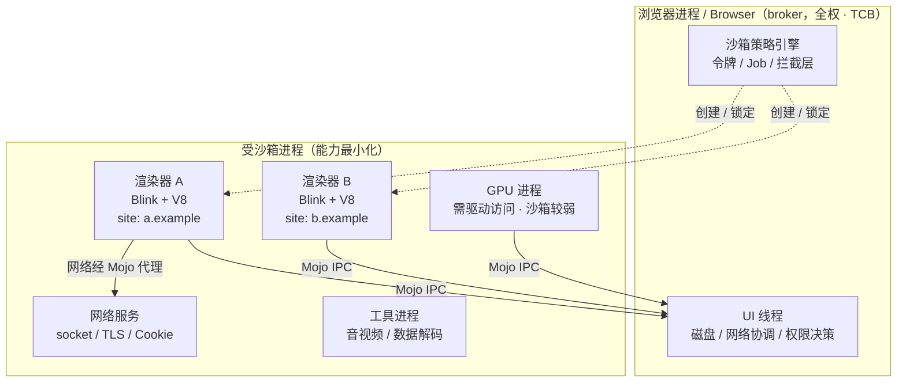
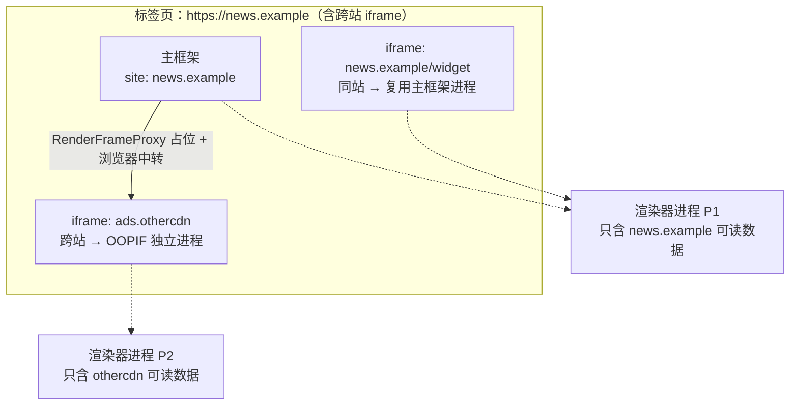
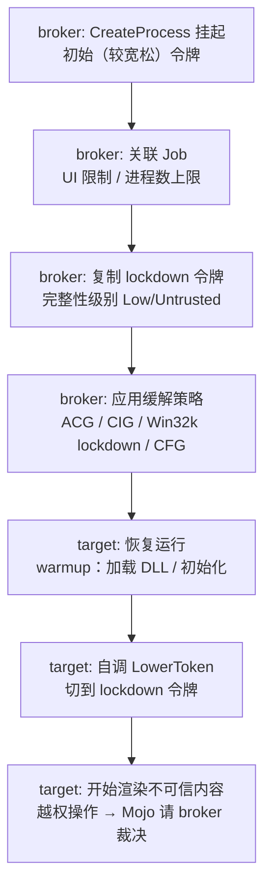
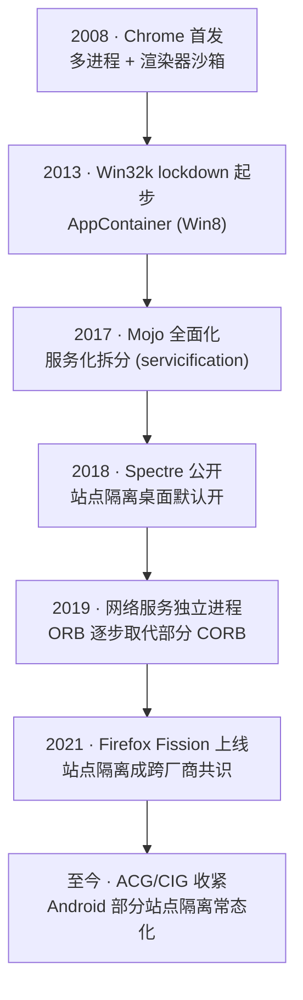

# 浏览器与JS引擎漏洞（2）· 多进程与沙箱模型
> [!abstract] TL;DR
> - 现代浏览器把「渲染不可信内容」与「访问系统资源」拆到不同进程：渲染器进程被剥夺几乎一切 OS 能力，只能通过 IPC 向作为 broker 的浏览器进程请求服务——这就是 broker/target 模型，也是「能力最小化」原则的落地。
> - 沙箱不是一个开关，而是操作系统原语的叠加：Windows 用受限令牌 + 完整性级别 + Job 对象 + Win32k lockdown + AppContainer，Linux 用命名空间 + seccomp-bpf + zygote，macOS 用 Seatbelt profile。
> - 站点隔离（Site Isolation）把「进程边界」提升为「安全边界」：以 `scheme + eTLD+1` 为「站点」粒度分配进程，跨站 iframe 走 OOPIF 独立进程，直接回应了 Spectre「同进程即可读全地址空间」的威胁。
> - CORB/ORB、COOP/COEP/CORP 是站点隔离的数据层配套：在敏感跨源数据进入渲染器地址空间之前就拦掉，让推测执行侧信道「无米可炊」。
> - Mojo 把 IPC 建模为「能力」：一个消息管道端点就是一张能力券，浏览器进程决定渲染器能拿到哪些接口——这既是最小权限的实现，也是沙箱逃逸的主战场。
> - 沙箱是纵深防御的「第二道墙」：渲染器内存破坏只换来「沙箱内 RCE」，要落地到系统还需第二个 bug（沙箱逃逸）。本篇讲这道墙怎么砌，逃逸留给第 12 篇。

## 概述与定位

上一篇《浏览器架构与攻击面》把浏览器当成一台「解析引擎的联合体」，枚举了从 URL 解析、HTML/CSS、图像编解码到 JavaScript 引擎的输入面。本篇转向防御侧的骨架问题：**当这些解析器不可避免地会有内存安全漏洞时，浏览器靠什么架构把「一个渲染 bug」挡在「一台被控机器」之外？** 答案是多进程模型 + 操作系统沙箱 + 站点隔离三件套。理解它，是理解后续第 5～11 篇「怎么在渲染器里拿到任意读写」为何「还不够」、以及第 12 篇「沙箱逃逸」为何是独立难题的前提。

驱动这套架构的是 Chrome 安全团队著名的「Rule of 2」：处理**不可信输入**、使用**不安全语言（C/C++）**、**不加沙箱**——三者你最多同时占两个。浏览器的渲染器天然要处理来自任意网站的不可信输入，又用 C++ 写 Blink/V8 图性能，于是第三项「不加沙箱」就必须放弃。整个多进程设计本质上是把「不可信输入 + 不安全语言」这对组合，强制关进一个「几乎没有 OS 能力」的盒子里。

Chrome 的进程谱系大致如下（Firefox 的 e10s/Fission、Edge 因同源 Chromium 而高度一致）：

- **浏览器进程（Browser Process）**：唯一的高权进程，同时扮演 UI、磁盘/网络协调者、权限决策者、以及所有沙箱进程的 **broker**。它是可信计算基（TCB）的核心。
- **渲染器进程（Renderer Process）**：跑 Blink 排版引擎与 V8。它承载不可信网页，被施加最强沙箱。启用站点隔离后，**一个站点一个进程**。
- **GPU 进程**：把光栅化、合成、WebGL/WebGPU 指令转成 GPU 驱动调用。因为必须接触图形驱动，它的沙箱天然弱于渲染器，是常见的逃逸跳板。
- **网络服务进程（Network Service）**：集中处理 socket、TLS、HTTP 缓存、Cookie。有了它，渲染器彻底不需要网络能力。
- **工具进程（Utility Process）**：音视频解码、数据解码器（如 JSON/图像的安全解析）、存储服务等。每类高风险解析各自成进程、各自上沙箱。



这里要划清与相邻篇的边界：**第 1 篇讲「哪里能被打」，本篇讲「打进来之后墙长什么样、怎么砌」，第 12 篇讲「墙怎么被翻」。** 本篇一律站在设计者/防御者视角讲原理，不给针对真实目标的逃逸配方。

## 原理与机制

### broker/target：一切沙箱的骨架

无论哪个平台，Chrome 沙箱都是 **broker/target 两方模型**。target（受限进程，如渲染器）在设计上「什么系统调用都做不了、什么内核对象都拿不到」；一旦它需要某个受控能力（打开某文件、建某个共享内存、访问某设备），它不会直接 syscall，而是把请求经 IPC 发给 broker（浏览器进程），由 broker 依据策略**代为执行**再把结果句柄传回。于是安全策略被收敛到一个可审计的中心，而不是散落在每个 syscall 站点。

这与传统 Unix 权限模型的差别在于粒度与默认值：传统进程默认「以用户身份能做的都能做」，靠 DAC 逐点收紧；沙箱 target 默认「几乎什么都不能做」，靠 broker 逐点放行。**默认拒绝**是最小权限原则的工程化。

### 操作系统原语：沙箱不是一层，是叠罗汉

沙箱强度来自多种 OS 机制的叠加，任何单一机制被绕过时其余仍在。三大平台各有一套：

- **Windows**：受限令牌（restricted token）、完整性级别（Integrity Level）、Job 对象、独立桌面/窗口站、Win32k lockdown（关掉 `win32k.sys` 这一巨大内核面）、AppContainer（Win8+ 的能力型 lowbox 令牌），再叠加 ACG/CIG/CFG/DEP/ASLR 等缓解策略。
- **Linux**：用户命名空间 + PID/网络/挂载命名空间做「语义隔离层」，seccomp-bpf 做「系统调用过滤层」，zygote 进程负责高效派生与入命名空间。
- **macOS**：Seatbelt（`sandbox_init` + SBPL profile），用一段类 Scheme 的策略脚本白名单化允许的操作。

### IPC 即能力：Mojo

进程被隔开后，唯一的合法通道是 IPC。Chrome 现代 IPC 是 **Mojo**：接口在 `.mojom` 里声明，实现分布在浏览器/渲染器两侧，底层是「消息管道（message pipe）」。关键在于它的**能力语义**——持有某接口的管道端点，等价于持有调用该接口的权力；渲染器能调什么，取决于浏览器给了它哪些端点。这把「渲染器能对系统做什么」显式化、可枚举化，也让沙箱逃逸的攻击面被精确定位到「浏览器侧暴露给渲染器的那批 Mojo 接口实现」。

### 站点隔离：把进程边界升级为安全边界

早期（2008）多进程主要为**稳定性**（一个标签崩溃不拖垮全局）和一定的安全隔离，但跨站 iframe 仍与主框架同进程。2018 年 Spectre 公开后，「同进程 = 攻击者代码可经推测执行侧信道读取本进程全部地址空间」成为硬约束——只要敏感的跨站数据和攻击者脚本在同一进程，就可能被读走。**站点隔离**因此把「不同站点的内容绝不共享渲染器进程」变成默认策略，让进程边界同时成为安全边界。下一段深入其账本与配套。

## 隔离模型与沙箱实现详解

### 站点隔离的「站点」为何是 eTLD+1 而非「源」

Web 的同源策略以**源（origin）** = `scheme + host + port` 为单位。但站点隔离的进程分配单位是**站点（site）** = `scheme + eTLD+1`（可注册域）。也就是说 `https://a.example.com` 与 `https://b.example.com` 属于**同一站点** `https://example.com`，会分到同一进程；而 `https://example.com` 与 `https://evil.org` 是不同站点，分到不同进程。

为什么放宽到站点而非严格按源？根源是历史遗留的 `document.domain`：两个同站点子域可以各自把 `document.domain` 设成父域，从而在运行时「变成同源」并互相脚本化。若按源分进程，这种运行时同源化就会要求「跨进程同步脚本访问」，实现上不可行。于是选择 eTLD+1 作为「可能同步互访的最大集合」作为进程粒度——这是安全性与 Web 兼容性的折衷。`eTLD` 由 Public Suffix List 定义，故 `foo.github.io` 与 `bar.github.io` 因 `github.io` 是公共后缀而被视为**不同站点**，能各自隔离。

```text
# 站点计算（概念）
site(url) = scheme(url) + "://" + eTLD_plus_1(host(url))

https://a.example.com:443/x  →  https://example.com     （站点）
https://b.example.com/y      →  https://example.com     （同站点，进程复用）
http://example.com/z         →  http://example.com      （scheme 不同 → 不同站点）
https://user.github.io       →  https://user.github.io  （github.io 是公共后缀）
```

### SiteInstance / BrowsingInstance 与进程账本

Chrome 内部用两级抽象管理进程分配：

- **BrowsingInstance**：一组能通过脚本引用互相找到的页面/框架集合（如 `window.open` 打开、或 `<iframe>` 内嵌，彼此能拿到 `window` 引用）。它们必须处于同一「浏览上下文组」。
- **SiteInstance**：BrowsingInstance 内**同一站点**的框架集合，它们能同步脚本互访，共享一个渲染器进程。

进程分配规则近似为：**每个 SiteInstance 一个渲染器进程**，并受进程数上限约束；触顶后按策略复用同站点的既有进程。桌面端默认 `--site-per-process`（严格每站点一进程）；Android 因内存受限，历史上只对「需要隔离的站点」（用户在其上输入过密码、或带特定响应头 `Cross-Origin-Opener-Policy` 等）做部分隔离。

### OOPIF：跨进程的框架树

站点隔离最精巧之处是 **Out-of-Process iframe（OOPIF）**：当页面内嵌一个跨站 iframe，该 iframe 在**另一个进程**里渲染。逻辑上的 DOM 框架树因此横跨多个进程——父框架进程里，跨站子框架只留一个 `RenderFrameProxy`（占位代理），真正的 DOM 与脚本在子框架自己的进程里。父子之间所有交互（尺寸、焦点、`postMessage`）都要经浏览器进程中转。这保证了：**攻击者控制的子框架进程里，永远不含父站点的可读数据。**



### 数据层配套：CORB/ORB 与跨源策略头

进程隔离只解决「攻击者脚本不与敏感数据同进程」的一半问题；另一半是「别让敏感数据被诱导进入攻击者进程」。渲染器会因 ``、`<script>`、`<link>` 等发起大量「no-cors」子资源请求，其响应本不该被脚本读取，却会落进发起进程的内存。**CORB（Cross-Origin Read Blocking）** 及其后继 **ORB（Opaque Response Blocking）** 的职责就是：识别出「本不该被这样跨源读取」的敏感响应（HTML、XML、JSON，结合 `Content-Type` 与嗅探），在响应体进入渲染器地址空间**之前**就把它拦在网络服务侧，只放行合法用途（如图片、脚本执行本身不回读的场景）。这样即便渲染器被 Spectre 化，能读的也只是它「本就有权读」的数据。

更进一步，站点可用一组响应头**主动**升级隔离等级：

- `Cross-Origin-Resource-Policy (CORP)`：声明「本资源只允许同源/同站点嵌入」。
- `Cross-Origin-Opener-Policy (COOP)`：切断与跨源打开者的 `window` 引用，破坏 BrowsingInstance 关系。
- `Cross-Origin-Embedder-Policy (COEP)`：要求所有子资源显式授权（CORP 或 CORS）。

当 COOP + COEP 同时满足，页面进入 **crossOriginIsolated** 状态，浏览器确信其进程内无未授权跨源数据，才重新解锁 `SharedArrayBuffer` 与高精度计时器（`performance.now()` 微秒级）——这些正是 Spectre 后被普遍下调精度/禁用的「计时侧信道弹药」。

### Windows 沙箱内部：令牌、完整性、Job、Win32k

Windows 渲染器的锁定是多把锁叠加，逆向/取证时可用 Process Hacker 逐项核对：

- **受限令牌**：把进程令牌里的组 SID 大多改成「仅拒绝（deny-only）」，并加一组极小的**限制性 SID**（restricting SIDs，常只留 NULL SID / logon SID）。访问检查时，token 的「常规 SID 集」与「限制性 SID 集」都要通过，任一不过即拒——等于把可达对象压到近乎空集。同时剥离几乎所有特权（privileges）。
- **完整性级别（IL）**：进程贴 Low 甚至 Untrusted 标签。Windows 强制完整性控制默认「禁止向上写（no-write-up）」，低 IL 进程无法改动更高 IL 的对象（文件、注册表、其他进程）。
- **Job 对象**：施加「不许创建子进程、不许访问剪贴板、UI 操作受限、活动进程数上限」等约束，堵住「fork 出个高权后代」的逃逸路径。
- **独立窗口站/桌面**：把 target 放到隔离桌面，防经典的 Shatter（窗口消息注入）攻击。
- **Win32k lockdown**：`win32k.sys` 承载 GDI/USER，是内核里历史 CVE 密度最高的一块。渲染器通过进程缓解策略 `ProcessSystemCallDisablePolicy` 直接**禁掉整类 win32k 系统调用**，改走无 GDI 的渲染路径，一举削掉巨量内核攻击面。
- **AppContainer**：Win8 引入的能力型沙箱，用 lowbox 令牌按「能力（capability）」授权，并天然限制网络等。现代 Chrome 渲染器叠加 AppContainer 进一步收紧。
- **缓解策略**：ACG（Arbitrary Code Guard，禁止运行时生成/改可执行页，堵 JIT 喷洒后的代码注入——但 V8 的 JIT 需要豁免，见下节陷阱）、CIG（Code Integrity Guard，只许加载微软签名/已知 DLL，防第三方 DLL 注入）、CFG、DEP、高熵 ASLR。

### 目标进程的锁定时序：warmup 与 LowerToken

一个反直觉但关键的实现点：进程**不能一出生就满级锁死**，否则连初始化（加载依赖 DLL、建线程池、初始化 CRT）都做不了。于是采用「渐进锁定」：broker 先用**较宽松的初始令牌**创建挂起的 target，关联 Job、复制好「最终 lockdown 令牌」；target 恢复后在一段 **warmup** 里完成必须的初始化；随后 target **自己调用 `LowerToken`** 切换到 lockdown 令牌，从这一刻起才开始接触不可信内容。这段「上锁前的窗口」是设计上必须存在的软肋——凡在 warmup 里预加载的东西，都要额外审计。



### Linux 沙箱：命名空间 + zygote + seccomp-bpf 双层

Linux 侧是两层结构。**第一层（语义/命名空间层）**：借用户命名空间（历史上用 setuid 帮助程序）创建新的 PID、网络、挂载命名空间，并 `chroot` 到空目录，让 target 看不到真实文件系统、无网络、无其他进程——即使逃出内核视角，眼前也是一片空。**zygote** 是一个预热好的模板进程：所有渲染器由它 `fork` 而来，既省去重复初始化，又统一在此入命名空间。**第二层（seccomp-bpf）**：装载一段 BPF 程序过滤系统调用，基线策略白名单化少量必需 syscall，危险的（如 `ptrace`、多数 `clone` 组合、`mount`）直接拒或杀进程；部分 syscall 还按**参数**放行。被拒的文件打开则回落到 broker 代理。

```text
# seccomp-bpf 策略（概念示意，非真实字节码）
若 syscall == read/write/mmap(仅匿名/只读)/futex/…   → ALLOW
若 syscall == openat                                  → TRAP → 交 broker 按策略裁决
若 syscall == ptrace/process_vm_readv/mount/…         → KILL 进程
其余                                                  → ERRNO(EPERM)  # 默认拒绝
```

### macOS 沙箱：Seatbelt profile

macOS 用 Seatbelt：进程启动、完成必要初始化后调用 `sandbox_init` 加载一份 **SBPL** profile，把自身封进策略里。profile 是白名单式的 S 表达式，形如「默认 deny，显式 allow 读取某些系统库、allow 与特定 mach 服务通信」。思路与 seccomp 一致——默认拒绝、按需放行——只是过滤发生在更高的「操作」抽象层而非裸 syscall。

### Mojo：把 IPC 建成能力系统

回到能力视角。一个 `.mojom` 接口大致长这样：

```text
// 概念示意
interface FileChooser {
  OpenFile(FilePathList allowed) => (File? handle);
};
```

浏览器侧实现 `FileChooser`，渲染器侧只持有它的**客户端端点**。渲染器要读文件，不能自己 `open`，只能调 `OpenFile`，由浏览器决定给不给、给哪个句柄。**「持有端点 = 拥有能力」** 使最小权限可编程：给渲染器绑定接口时，就等于精确授予其能对系统做的事。反过来，这也把逃逸面锁死为「浏览器进程里那些暴露给渲染器的 Mojo 接口实现的内存/逻辑正确性」——第 12 篇会从这里展开，本篇只指出攻击面在哪，不给利用步骤。

### 演进脉络（发展史用箭头表达）



## 工具视角与实战

以下均为在**自有机器**上观测浏览器自身安全架构的手段，属于防御研究与逆向学习，不涉及攻击他人系统。

**看进程与隔离账本**。地址栏输入 `chrome://process-internals` 可查看每个框架的 SiteInstance、进程分配、是否 OOPIF；`chrome://process-internals/#web-contents` 展示框架树与进程映射，是验证站点隔离是否按预期工作的第一手工具。任务管理器（Shift+Esc）能把「哪个标签/框架在哪个进程」列出来。命令行 `--site-per-process`（强制）与 `--disable-site-isolation-trials`（关闭，仅用于对照实验）可切换隔离策略，肉眼对比进程数变化。

**看 Windows 锁定强度**。用 Process Hacker / Process Explorer 打开渲染器进程属性：Token 页可见组 SID 多为 Deny-only、限制性 SID 极少、特权几乎清空；General 页可见 Integrity 为 Low/AppContainer；Job 页可见活动进程上限与 UI 限制；Mitigation 页可核对 ACG/CIG/CFG/Win32k lockdown 是否开启。这是把「上一节讲的锁」逐把落到实物的最佳练习。

**看 Linux 过滤层**。`cat /proc/<pid>/status` 里 `Seccomp:` 字段为 2 表示已装 filter 模式；`NoNewPrivs: 1` 表示已置位（seccomp 生效前提）。用 strace 观察被拒 syscall 会看到 `EPERM`/信号；命名空间可从 `/proc/<pid>/ns/` 与 `unshare`/`lsns` 侧面印证。

**理解 broker 攻击面（防御视角）**。想系统学习「渲染器能碰到哪些 Mojo 接口」，可读 Chromium 源码里的 `.mojom` 定义与 `browser_interface_binders`，理解每个绑定的授权条件；这类审计正是安全团队与 fuzzing 的入口。基于覆盖引导的接口 fuzzing 会呼应 [[49.Fuzzing与漏洞挖掘/15.浏览器与JS引擎Fuzzing]]。

**与 JIT 的现实妥协**。ACG 禁止运行时改可执行内存，但 V8 的 JIT 恰恰要写可执行页。工程上要么给 V8 所在进程豁免 ACG，要么走「双映射 / write-then-flip」等受控方案——这条缝隙是理解「为何 V8 需要自己的 V8 Sandbox（第 13 篇）作为进程沙箱之内的第二层」的关键伏笔。JIT 侧的推测优化漏洞见 [[41.Compiler|编译器与 JIT 优化]]。

## 安全性与正确使用

> [!caution] 合规边界
> 本文所有内容仅用于**自有或获授权的环境、CTF 靶场与安全研究**，一律采取**防御 / 教育视角**。文中对令牌、seccomp、站点隔离、Mojo 攻击面的说明，目的是帮助读者理解浏览器如何自我保护、如何做安全审计与加固，**不构成**针对真实生产系统或他人设备的武器化步骤，也**不为**绕过任何商业授权或访问控制提供成品配方。研究沙箱逃逸原理请在隔离靶场进行，并遵守当地法律与漏洞披露规范（负责任披露 / CVD）。真实漏洞应通过官方漏洞奖励计划（如 Chrome VRP）上报，而非公开利用。

从防御工程角度，有几条「正确心智」需要立住。**其一，沙箱是纵深防御的第二道墙，不是万能墙。** 它假定第一道墙（内存安全、类型安全）会被攻破，因此把「渲染器 RCE」的收益压到「沙箱内 RCE」——攻击者还需一个独立的沙箱逃逸 bug 才能触及系统。单个渲染器漏洞不再等于「机器沦陷」，这就是多进程架构的核心价值。**其二，能力最小化要贯彻到每个进程。** GPU 进程因需驱动访问而沙箱较弱，历来是逃逸跳板；应对之道是继续把可下放的工作（如部分解码）挪进更严格的工具进程，压缩 GPU 进程的信任。**其三，站点隔离依赖数据层配套才闭环。** 只隔进程不拦数据（缺 CORB/ORB）等于给攻击者进程留了「把敏感数据请进来再侧信道读」的后门；反之开启 COOP+COEP 的站点才配得上 `SharedArrayBuffer` 这类高危能力。

失败模式也要诚实列出：warmup 窗口期的预加载、broker 侧 Mojo 接口的逻辑/内存 bug、Win32k lockdown 未覆盖的其余内核 syscall、GPU/驱动面、以及站点隔离在移动端因内存预算而打的折扣——这些都是真实存在的残余风险，也正是缓解措施持续演进（V8 Sandbox、CFI、`MiraclePtr`、`*Scan` 等，见第 13 篇）的原因。把这些讲透，恰是为了在自有系统上做出正确的加固取舍，而非提供越界的攻击路径。

## 小结

多进程与沙箱模型是浏览器安全的地基。它以 Rule of 2 为纲，用 **broker/target** 把「不可信输入 + 不安全语言」关进「默认拒绝、按需放行」的盒子；用平台各异的 OS 原语（Windows 令牌/IL/Job/Win32k lockdown/AppContainer、Linux 命名空间/zygote/seccomp-bpf、macOS Seatbelt）把盒子焊死；用 **站点隔离 + OOPIF + CORB/ORB + COOP/COEP** 把进程边界升级为回应 Spectre 的安全边界；再用 **Mojo 能力模型** 把「渲染器能对系统做什么」显式化、可审计化。这套架构的结论是：一个渲染器漏洞只买到「沙箱内 RCE」，真正的系统沦陷需要第二把钥匙——沙箱逃逸。理解了墙怎么砌，才能理解后续篇章里「拿到任意读写」为何只是半程，以及第 12 篇「翻墙」为何是独立的硬仗。

## 相关阅读

- 同系列：[[01.浏览器架构与攻击面|← 攻击面枚举]]、[[12.沙箱逃逸原理|→ 沙箱如何被翻越]]、[[13.浏览器漏洞缓解：V8沙箱与CFI|进程沙箱之内的第二层防御]]
- 利用承接：[[33.二进制漏洞与利用基础/15.ASLR与PIE绕过技术]]（逃逸后仍要面对的地址随机化）、任意读写原语构造
- JIT 前置：[[41.Compiler|编译器与 JIT 优化]]（推测优化引入的漏洞、ACG 与 JIT 的张力）
- Fuzzing 呼应：[[49.Fuzzing与漏洞挖掘/15.浏览器与JS引擎Fuzzing]]（Mojo 接口与渲染器的覆盖引导 fuzzing）
- WASM 呼应：[[40.WASM与虚拟化壳逆向/06.WASM内存模型与线性内存安全]]（线性内存的越界与隔离思路对照）
- 官方文档：Chromium「Sandbox」设计文档（`docs/design/sandbox.md`）、「Windows Sandbox architecture」、「Site Isolation」设计文档（chromium.org/Home/chromium-security/site-isolation）、「Mojo & Services」与 `docs/security/mojo.md`、「The Rule of Two」（`docs/security/rule-of-2.md`）、Firefox「Fission / Project Fission」与 seccomp 沙箱说明

[[00.浏览器与JS引擎漏洞总览|⬆ 系列总览]] | [[01.浏览器架构与攻击面|← 上一章]] | [[03.V8架构：解析到字节码到JIT|→ 下一章]]
