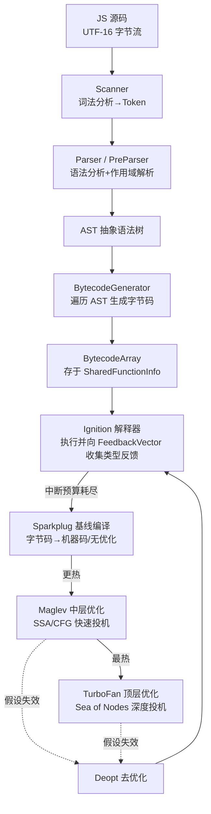
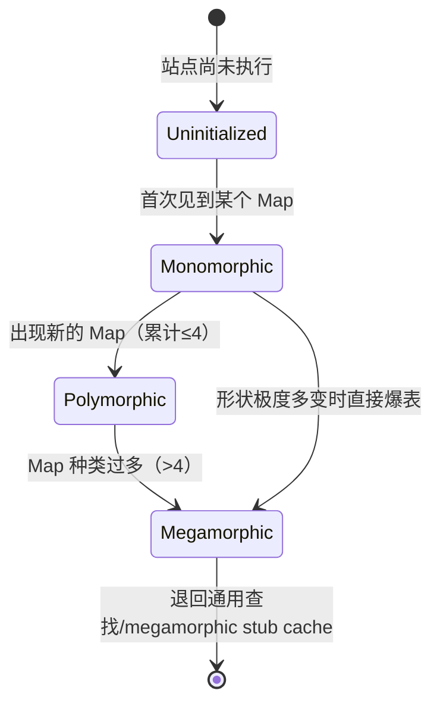
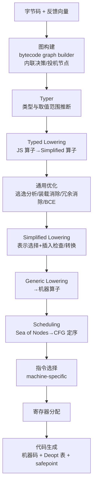

# 浏览器与JS引擎漏洞（3）· V8架构：解析到字节码到JIT
> [!abstract] TL;DR
> - V8 把一份 JS 源码依次送过「Scanner → Parser → AST → BytecodeGenerator → Ignition 字节码」的前端，再按运行热度逐级 tier-up 到 Sparkplug / Maglev / TurboFan，用**编译时间换执行速度**，这条多层管线是理解一切 JIT 漏洞的地基。
> - Ignition 是**寄存器式**字节码解释器：累加器 + 寄存器文件、字节码平台无关且比机器码紧凑，handler 用 Torque/CSA 预生成进快照，边执行边把类型反馈写进 `FeedbackVector`。
> - 反馈向量的 uninitialized→monomorphic→polymorphic→megamorphic 状态与内联缓存(IC)决定优化器能看到什么类型信息，是**投机优化的唯一燃料**。
> - TurboFan 用 **Sea of Nodes** IR，经 Graph building → Typer → Typed lowering → Simplified lowering(表示选择) → 调度 → 指令选择 → 寄存器分配 → codegen 多相，基于反馈做投机，并用 `CheckMaps`/`CheckBounds` 等守卫保证安全。
> - 投机假设一旦失效就触发 **Deopt**（eager/lazy），凭 translation 元数据把优化帧重建成解释器帧回退；Typer 范围/类型推断一旦不健全就会漏删检查——这正是后续 JIT 类型混淆与 OOB 漏洞的温床。
> - 这套机制既是性能引擎也是攻击面：本篇立骨架、给观测手法，第 5/6/7 篇在其上讲漏洞类型、类型混淆与 addrof/fakeobj 原语构造。

## 概述与定位

V8 是 Chrome、Edge、Node.js、Deno、Electron 等一大批产品共用的 JavaScript（与 WebAssembly）引擎。从攻击者的视角看，它是渲染器进程里**最大、最复杂、且直接吃攻击者可控输入**的一块 C++ 代码：一段网页 JS 就是喂给它的数据，而它内部要把这段数据一路加工成本机机器码去执行。凡是"把不可信输入编译成可执行代码"的系统，其正确性边界就是安全边界——这也是为什么浏览器 0day 里 V8 长期占最大比重。本系列第 1、2 篇分别讲了浏览器整体攻击面与多进程/沙箱模型，明确了渲染器进程是"低信任、被沙箱关押"的一方；本篇把镜头推进到渲染器内部的 V8，讲清楚**一份 JS 源码是怎样被解析、编译、优化、执行的**，为后面几篇（对象模型、漏洞类型、类型混淆、原语构造）铺好共同的术语与心智模型。

要一句话定位 V8 的架构哲学：**分层即时编译（tiered JIT）+ 投机优化（speculative optimization）**。它没有走"一次性把 JS 编成最优机器码"的路线，因为 JS 是动态类型、动态形状、还能 `eval`/改原型的语言，编译期几乎什么都不能确定；也没有走"永远解释执行"的路线，因为那样热点代码太慢。V8 的折中是：**先用解释器快速起跑并顺便侦察运行时类型，再把跑得热的函数逐级交给越来越激进的编译器**。越靠上层的编译器编译越慢、生成的码越快，但都建立在"运行时观察到的类型会继续成立"这个**赌注**之上；赌错了就去优化（deopt）退回解释器。理解"侦察—投机—守卫—去优化"这条主线，胜过记住任何单个组件的名字。

本篇的边界：我讲**管线与执行机制本身**（解析、字节码、Ignition、TurboFan、Maglev、Sparkplug、反馈、去优化、观测工具）。对象内存布局（Map/隐藏类/属性存储）留给第 4 篇；具体的漏洞成因与利用（类型混淆、TheHole、OOB、addrof/fakeobj）留给第 5～9 篇。本篇只在"安全性"一节点出**漏洞藏在管线的哪一环、为什么藏在那里**，把钩子挂好、不越界。

## 原理与机制

先建立端到端的全景。一段 JS 进入 V8 后大致经历如下阶段，每一级都可能因为"这个函数不够热"而止步、也可能因为"太热了"而继续向上：



**第一步：扫描与解析（前端）。** Scanner 逐个读取 UTF-16 code unit，把字符流切成 Token（标识符、关键字、数字、字符串、运算符等），带一枚 Token 的前瞻。Parser 是递归下降式的，把 Token 流组织成 AST，同时做**作用域解析**：建立作用域链、把每个变量引用绑定到声明、判定哪些变量被闭包捕获从而必须分配到堆上的 Context 里、哪些可以留在栈上。这里有个关键设计——**惰性解析（lazy parsing）**。网页里绝大多数函数在加载时并不会立刻执行，若把每个函数体都完整解析成 AST，既费时又占内存（移动端尤其敏感）。于是 V8 对内层函数只用 **PreParser** 走一遍：不生成完整 AST，只做两件必须提前做的事——**发现语法错误**（规范要求早报错）和**确定变量的作用域归属**（决定闭包捕获与 Context 分配）；等函数真正被调用时才做完整（eager）解析。这就是为什么"把逻辑塞进一个立即执行的箭头函数里"有时会改变启动性能：你改变了 V8 的 eager/lazy 判定。解析的产物——字节码——还会被**编译缓存**（in-memory code cache，以及经由 Chrome 落盘的 code cache）复用，避免重复解析同一份脚本。

**第二步：生成字节码。** `BytecodeGenerator` 遍历 AST，产出一段 `BytecodeArray`，挂在该函数字面量对应的 **SharedFunctionInfo（SFI）** 上。SFI 是"同一处函数定义的所有闭包共享"的元信息载体；每个真正的闭包对象（`JSFunction`）指向一个 SFI 加一个 `FeedbackCell`。注意 V8 早年用的是 **full-codegen**（AST 直接生成机器码）+ **Crankshaft**（优化编译器）这套老管线，2017 年（V8 5.9 / Chrome 59）被 **Ignition + TurboFan** 完全取代——换掉的核心动机是**内存**：字节码比机器码小 50%～75%，对移动端意义重大。

**第三步：Ignition 解释执行 + 收集反馈。** 字节码由 Ignition 解释器执行。它不是简单地"跑代码"，而是边跑边**记类型账**：在属性读写、函数调用、二元运算等站点，把观察到的对象形状（Map）、调用目标、操作数类型等写进该函数的 `FeedbackVector`。这些反馈就是后续优化器做投机的依据。函数每被调用一次、每跨一次循环回边，都会消耗它的**中断预算（interrupt budget）**；预算见底就是"这个函数够热了"的信号，触发向上一层编译（tier-up）。

**第四步：分层 tier-up。** 现代 V8（2023 年后）有四层执行体：Ignition（解释器）→ Sparkplug（基线编译器，2021 年 V8 9.1 引入）→ Maglev（中层优化编译器，2023 年引入）→ TurboFan（顶层优化编译器）。它们是一条**编译时间 vs 执行速度**的光谱：Ignition 零编译、即刻起跑、执行最慢；Sparkplug 单遍线性扫描字节码直出机器码、**不做任何优化也不 deopt**、只为省掉解释开销；Maglev 用 SSA/CFG 做**快速的**投机优化；TurboFan 做**最深**的投机优化但编译最慢。只有反复变热的代码才值得往上送，把宝贵的编译时间花在刀刃上。

**第五步：投机、守卫与去优化。** Maglev/TurboFan 依据反馈生成的机器码里充满了**假设**（如"这个对象一直是这个 Map""这个数组元素一直是 SMI""这个加法两边一直是数字"），每个假设都配一道**守卫检查**（`CheckMaps`、`CheckBounds`、`CheckSmi`……）。假设成立时走极快的专用路径；一旦某次运行守卫失败，就触发**去优化（deoptimization）**：丢弃优化码、依据编译时保存的 translation 元数据把当前优化栈帧**重建**成一个等价的解释器栈帧，回退到 Ignition 从断点继续跑。这一"投机 + 守卫 + 回退"三件套，是 JIT 又快又（理应）正确的秘密，也是几乎所有 JIT 漏洞的发生地。

## 指令、IR 与优化管线详解

这一节把上面每个环节拆到"不看代码也讲得清"的粒度，并标出各处的设计取舍与陷阱。

### Ignition 字节码：为什么是寄存器式

Ignition 是**寄存器机**而非栈机。它有一枚隐式的**累加器（accumulator）**充当大多数指令的默认输入/输出，外加一组**寄存器文件** r0、r1…（就是解释器栈帧里的槽位），参数则记作 a0、a1…。为什么选寄存器式而不是像 JVM/CPython 那样的栈式？因为栈式为了传递中间值要频繁 push/pop，指令条数多、分派次数多；寄存器式让一条指令直接指名操作数，**指令更少、分派更少、也更贴近真实 CPU 与 TurboFan 的需求**。累加器的设计进一步减少了"把结果显式写回寄存器"的指令——大量运算的结果自然留在累加器里给下一条用。

看一个最小例子直观感受。对于：

```js
function add(a, b) { return a + b; }
```

用 `d8 --print-bytecode` 打印，核心大致是：

```
Ldar a1          ; 累加器 <- 参数 b
Add  a0, [0]     ; 累加器 <- a0(即 a) + 累加器(b)；[0] 是反馈向量槽位号
Return           ; 返回累加器
```

三条指令读起来就是自然语言：把 b 装进累加器、把 a 加上去、返回。`Add` 后面的 `[0]` 不是操作数而是**反馈槽索引**——这条加法的类型账记在反馈向量第 0 槽。这就是"边执行边侦察"的物理体现。字节码是**平台无关**的（同一份字节码在 x64/arm64 上都一样），这既省内存又便于缓存复用，代价是执行时要靠解释器逐条分派——而这正是 Sparkplug 要消除的开销。

关于字节码的编码与存储还有几点值得记住：操作码是单字节，操作数默认窄编码，遇到寄存器/常量索引超过一字节范围时用 `Wide`/`ExtraWide` 前缀扩宽；大的常量（字符串、堆数字等）不内联在指令流里，而是放进 `BytecodeArray` 附带的**常量池**，指令里只存索引（如 `LdaConstant [n]`）。`BytecodeArray` 本身是一个堆对象，除字节码主体外还带常量池、异常处理表（handler table）和源码位置表（供调试/栈回溯）。字节码 handler（每个操作码"怎么执行"的那段实现）不是运行时解释器现算的，而是用 **Torque**（V8 的 DSL，编译到 CodeStubAssembler）或直接 CSA 写好、在**构建期编译进快照（snapshot）**的——启动时直接从内嵌 builtins 里拿现成的机器码 handler，这也是 V8 冷启动快的原因之一。分派采用"每个 handler 执行完自己的活儿，再尾调用/计算跳转到下一条字节码的 handler"的链式方式，避免了集中式 `switch` 的分支预测惩罚。

### 反馈向量与内联缓存：投机的燃料

没有类型信息，JS 的属性访问在通用情况下就是一次字典查找，慢得没法编出好机器码。但现实是：同一个访问站点看到的对象形状往往高度稳定（一个 `for` 循环里遍历的对象大多是同一个 Map）。V8 用**内联缓存（Inline Cache, IC）** 把这种稳定性变现：站点第一次执行时记下对象的 Map 与对应的取值 handler，之后同 Map 直接走缓存的快路径。IC 的状态记在反馈向量里，按见过的 Map 数量演进：



**单态（monomorphic）** 是优化器最爱的状态——只有一种形状，可以放心地把访问内联成"直接按固定偏移取字段"。**多态（polymorphic）** 保留最多 4 种 Map，仍能编出"几选一"的快路径。一旦超过阈值变成 **megamorphic**，站点就退化为通用查找，优化器基本无从投机。这里能看出一条对性能敏感的写法准则：让流经同一站点的对象**保持形状一致**。而 IC 以 Map 作为键——Map（隐藏类）到底是什么、怎么随属性增删而**转移（transition）**，是第 4 篇的主题，这里只需记住：**反馈向量里装的是"优化器将据以下注的类型情报"**，Sparkplug/Maglev/TurboFan 都读同一份反馈向量。反馈向量还是**惰性分配**的——函数被调用几次后才创建，避免为只执行一次的函数白占内存。

### 从 Sparkplug 到 Maglev：中间两层的取舍

**Sparkplug** 是"零 IR 的基线编译器"。它对字节码做**单遍线性扫描**，一条字节码对应一小段预制的机器码模板，直接拼出来，不构造任何中间表示、不做数据流分析、不做投机——因此它**永不 deopt**，也几乎不增加内存以外的风险面。它刻意让编译出来的机器帧与 Ignition 的解释器帧**保持同构**（相同的栈布局），这样在 Sparkplug 码与解释器之间来回切换、以及后续 deopt 重建帧都很廉价。它的唯一目的就是把"逐条字节码分派"的解释开销换成直线机器码，用极小的编译成本拿一份稳妥的加速。

**Maglev** 填补 Sparkplug 与 TurboFan 之间的巨大鸿沟。TurboFan 虽快但编译代价高，让"温热但没烫"的函数直接上 TurboFan 并不划算。Maglev 基于 SSA、用相对简单的 CFG（而非 Sea of Nodes）做**快速的投机优化**：它同样读反馈、同样插守卫、同样会 deopt，但编译流程比 TurboFan 短得多，用中等的编译成本拿到接近优化码的速度。分层的本质就是**在编译投入与执行收益之间做多点采样**，让每个函数落在性价比最高的那一档。

### TurboFan 与 Sea of Nodes：顶层优化管线

TurboFan 是这条链的终点，也是攻击面最集中处。它的 IR 叫 **Sea of Nodes（节点之海）**：程序被表示成一张图，节点是计算，边分三类——**value（数据依赖）、effect（副作用顺序）、control（控制流）**。之所以叫"海"，是因为节点在调度之前并不固定绑在某个基本块里，而是"漂浮"着，只受依赖边约束。这样做的好处是优化器可以**跨基本块自由地重排、合并、消除**计算，做全局优化；代价是这套 IR 复杂、难以直觉推理，尤其"什么时候一个节点会被调度到哪里"很微妙——历史上不少 TurboFan bug 就源于对 effect/control 链的错误处理。近年 V8 正用 **Turboshaft**（基于块+操作的 CFG 式后端）逐步替换 Sea of Nodes 的部分，以改善编译时间与可维护性，Maglev 也一开始就选了 CFG 而非节点之海——可见"节点之海虽强但难驾驭"已成共识。

TurboFan 的相位管线大致如下：



逐相解释其"为什么"：**图构建**阶段把字节码翻成节点之海，并在此做**内联**决策——把小的、热的被调函数体直接展开进调用者，这是优化收益的大头，但也让"被内联函数的假设"混进调用者，扩大了投机面。**Typer** 给每个节点推断类型与**取值范围**（例如"这个值是 [0, 15] 的整数"）。**Typed lowering** 利用这些类型把泛化的 JS 算子降级成具体算子——比如确知两侧都是数字，`JSAdd` 就降成 `NumberAdd`，省掉一切装箱/类型判定。**通用优化**里，**逃逸分析**会把"没有逃出本函数"的对象**标量替换**掉、免去堆分配（性能收益巨大，也是历史 bug 源）；**冗余消除**会删掉可证明多余的检查——**边界检查消除（BCE）** 就是其中最敏感的一项：若 Typer 断定索引一定落在数组长度内，`CheckBounds` 就被删掉。**Simplified lowering（表示选择）** 决定每个值用什么机器表示（tagged/untagged、int32/float64），并在需要处插入转换与检查——很多安全相关的守卫在此定型。随后 **generic lowering** 降到机器算子，**调度**把漂浮的节点之海拍平成有固定顺序的 CFG，**指令选择**挑机器指令，**寄存器分配**分配物理寄存器，最后 **codegen** 吐出机器码，并附带 **deopt 表（translation）** 和 **safepoint**（供 GC 精确识别栈上的对象指针）。

### 去优化：让激进投机得以安全

投机之所以敢激进，全靠 deopt 兜底。它分两种：**eager deopt** 是优化码里的守卫（如 `CheckMaps`）当场失败，立即回退；**lazy deopt** 是外部世界发生了让优化码前提失效的变化（典型如某个对象的原型被改、某个 Map 被废弃），运行时把相关优化码**标记为待去优化**，等它下次返回/进入时再退。回退的关键是那张 translation 表：它记录了"优化帧里各个值分别对应解释器帧的哪个寄存器/累加器/局部槽"，据此把一个高度优化（值散落在物理寄存器、甚至被标量替换掉的）栈帧**逆向重建**成一个规规矩矩的解释器帧，让 Ignition 能从正确的字节码偏移无缝续跑。

deopt 不是免费的：它有固定开销，频繁 deopt 会拖垮性能。V8 因此有**自愈**机制——deopt 后会更新反馈（例如把站点从单态改成多态），再优化时用新反馈避免重蹈覆辙；但若某函数 deopt 次数超过阈值，V8 会**干脆放弃优化它**，让它老老实实解释/基线执行。此外，长时间运行的循环没法等"函数下次被调用"才 tier-up，V8 用**栈上替换（OSR, On-Stack Replacement）** 在循环执行到一半时就把当前帧替换成优化码继续跑。理解 deopt 的存在，你就理解了 JIT 漏洞的机理入口：**投机的正确性 = 守卫的完备性 + Typer 推断的健全性**，任何一环出偏差，都可能让本该被守卫拦住的非法状态直接落进那条"极快专用路径"。

## 工具视角与实战

要真正吃透这套管线，最好的办法是用 V8 自带的独立 shell **d8**（或 Node 的 `--v8-options`）把每一层的产物打出来看。以下命令都是**只读观测**，用于研究引擎自身行为：

```bash
# 看某函数生成的字节码（可配 --print-bytecode-filter=函数名 只看目标）
d8 --print-bytecode foo.js

# 追踪 tier-up 与 deopt：谁被优化了、为什么被去优化
d8 --trace-opt --trace-deopt foo.js

# 打印最终优化机器码（含注释），观察守卫检查与内联结果
d8 --print-opt-code --code-comments foo.js

# 追踪内联缓存/Map 演化，观察单态→多态→megamorphic
d8 --trace-ic --trace-maps foo.js

# 导出 TurboFan 各相位 IR，配合 turbolizer 图形化查看 Sea of Nodes
d8 --trace-turbo foo.js   # 生成 turbo-*.json，用 V8 的 turbolizer 打开
```

更精细的控制要开 `--allow-natives-syntax`，它启用 `%` 前缀的**内部函数**，让你手动驱动 tier-up 而不必真的把代码跑热。现代 V8 里标准的"强制优化并对比"套路是：

```js
// d8 --allow-natives-syntax --trace-opt --trace-deopt demo.js
function foo(o) { return o.x + o.y; }

%PrepareFunctionForOptimization(foo);   // 新版 V8 需先"准备"
foo({x: 1, y: 2});                       // 至少跑一次，喂反馈
%OptimizeFunctionOnNextCall(foo);        // 请求下次调用即优化
foo({x: 1, y: 2});                       // 触发 TurboFan 编译
%DebugPrint(foo);                        // 打印内部结构：SFI/反馈向量/优化码
print(%GetOptimizationStatus(foo));      // 返回位掩码：是否已优化/被去优化等
```

实战里怎么读这些输出？看 `--trace-opt` 确认目标函数确实被送上了 TurboFan（而非停在 Sparkplug）；随后故意用一个**不同形状的对象**再调它，`--trace-deopt` 会打出一行去优化记录，写明在哪个字节码偏移、因什么原因（如 `wrong map`）回退——这一步能直观看到"投机—守卫—回退"的闭环。看 `--print-opt-code` 能在机器码里找到 `CheckMaps`/`CheckBounds` 这类守卫指令，从而判断某个检查**是否被优化器消除了**；用 turbolizer 打开 `--trace-turbo` 的产物，能逐相看到某个 `CheckBounds` 节点是在哪一相被删掉、Typer 给相关节点标了什么范围。对逆向/研究者而言，这套观测流程就是把"引擎内部的赌注与守卫"变得可见——**先能看见，才谈得上分析其正确性**。在 Node 侧，`node --v8-options | grep -i deopt` 可以列出当前版本支持的全部相关开关，不同版本增删频繁，以本机实测为准。

## 安全性与正确使用

把管线讲完，就能精确回答"漏洞藏在哪一环"。**解析前端**相对朴素，历史上偶有作用域/惰性解析的正确性问题，但产出是字节码、不直接产机器码，危害有限。**真正高危的是投机优化链**：TurboFan/Maglev 的每一次"删检查"都建立在 Typer 与各优化相位的推断之上，而这些推断本身是一堆手写的 C++ 规则——**只要某条规则给出的类型或取值范围比实际更宽/更窄，就可能消除本不该消除的守卫**。最经典的一类就是**范围分析出错导致 `CheckBounds` 被误删**：优化器"确信"索引在界内于是省掉边界检查，但该确信是错的，运行时就得到一个**越界读写（OOB）** 原语。另一类是**类型混淆**：优化器认定某处是数组/某种元素类型并按此生成直接内存访问，实际却是另一种对象，于是按错误的内存布局解释了它。逃逸分析、装载消除、内联带进来的跨函数假设，也都各自贡献过此类 bug。这些正是本系列第 5 篇（漏洞类型总览）、第 6 篇（类型混淆与 JIT 优化漏洞）、第 7 篇（OOB 原语构造）要展开的核心，本篇只把因果链交代清楚：**投机 JIT 的攻击面 = 编译期的每一个"我确信"**。

防御侧同样按管线布局。V8 有专门的 **JIT 加固**与新一代 **V8 sandbox**（把引擎堆内的指针改成受限的偏移/句柄、约束越界访问的可达范围），配合渲染器进程外层的操作系统沙箱（第 2 篇）与控制流完整性（CFI）——这些缓解如何抬高利用门槛，是第 13 篇的主题。工程实践中，`--no-opt` 可临时关掉优化编译器用于**三角定位**（若关掉优化后 crash 消失，高度指向 JIT bug）；`--jitless` 则完全禁用 JIT、只跑解释器，以性能换取大幅缩小攻击面，适合高敏感场景。V8 团队也大量依赖差分/结构化 fuzzing（Fuzzilli 等）主动挖掘这类优化 bug，这与第 49 篇《浏览器与JS引擎Fuzzing》相呼应。

> [!caution] 合规边界
> 本篇及全系列对 V8 内部机制的剖析，仅用于**自有或已获授权的环境、CTF 靶场与安全研究**，一律采取**防御与教育视角**。文中的 d8 开关、`%`-natives 语法、字节码/IR 观测手法都是**理解与研究引擎行为**的工具，不构成针对任何真实生产系统或他人系统的武器化步骤；本文不提供、也不应被用于绕过商业授权、攻击你不拥有或未获明确许可的目标。研究投机优化的正确性属于正当的安全工作，但**把原语拼成打真实目标的成品利用链**不在本系列提供之列——原理讲透，配方止步。请始终遵守当地法律与漏洞披露规范，走负责任披露流程。

## 小结

V8 的架构可以压缩成一句话：**用解释器快速起跑并侦察类型，把热点代码逐级交给越来越激进的投机编译器，再用守卫检查与去优化兜住投机的赌注。** 前端把源码解析成平台无关、可缓存的字节码；Ignition 这台寄存器机边执行边把类型反馈写进反馈向量；Sparkplug/Maglev/TurboFan 沿着"编译成本 vs 执行收益"的光谱分层接手；TurboFan 在 Sea of Nodes 上跑完整的类型推断—降级—优化—调度—codegen 管线，靠 `CheckMaps`/`CheckBounds` 守卫与 translation 驱动的 deopt 保证（本应保证）正确。安全上，最高危的环节是**投机链里每一处"删检查"所依赖的类型/范围推断**——它一旦不健全，就把越界与类型混淆原语直接送到攻击者手里。这套心智模型是后续所有章节的公共底座：第 4 篇进入 Map 与隐藏类的内存布局，第 5、6 篇讲漏洞类型与 JIT 类型混淆的具体成因，第 7～9 篇把原语拼成任意读写乃至 RCE 的教育性推演。

## 相关阅读

- [[04.V8对象模型：Map与隐藏类]]：本篇多次提到的 Map/隐藏类、IC 以 Map 为键、形状转移的完整机制。
- [[05.JavaScript引擎漏洞类型]]、[[06.类型混淆与JIT优化漏洞]]：本篇"安全性"一节埋下的因果链在此展开。
- [[07.TheHole与OOB原语构造]]、[[08.addrof与fakeobj原语]]、[[09.从任意读写到RCE]]：从优化 bug 到可利用原语的教育性推演。
- [[13.浏览器漏洞缓解：V8沙箱与CFI]]：JIT 加固、V8 sandbox、CFI 如何抬高利用门槛。
- [[41.Compiler|编译器与 JIT 优化]]：投机优化、SSA、Sea of Nodes 等编译原理的通用视角与其引入的漏洞面。
- [[49.Fuzzing与漏洞挖掘/15.浏览器与JS引擎Fuzzing]]：Fuzzilli 等如何主动挖掘本篇所述优化 bug。
- [[40.WASM与虚拟化壳逆向/06.WASM内存模型与线性内存安全]]：V8 同时承载 WebAssembly，其线性内存模型与第 10 篇的 RWX 利用相关。
- [[33.二进制漏洞与利用基础/15.ASLR与PIE绕过技术]]：原语构造之后的通用绕过技术承接。
- 官方资料：V8 官方博客（v8.dev/blog，Ignition/Sparkplug/Maglev/Turboshaft 各有专文）、V8 文档站 v8.dev/docs、TurboFan 设计文档与 Franziska Hinkelmann 等人的引擎系列文章；IR 背景可读 Cliff Click 的经典论文《A Simple Graph-Based Intermediate Representation》（Sea of Nodes 出处）。

[[00.浏览器与JS引擎漏洞总览|⬆ 系列总览]] | [[02.多进程与沙箱模型|← 上一章]] | [[04.V8对象模型：Map与隐藏类|→ 下一章]]
