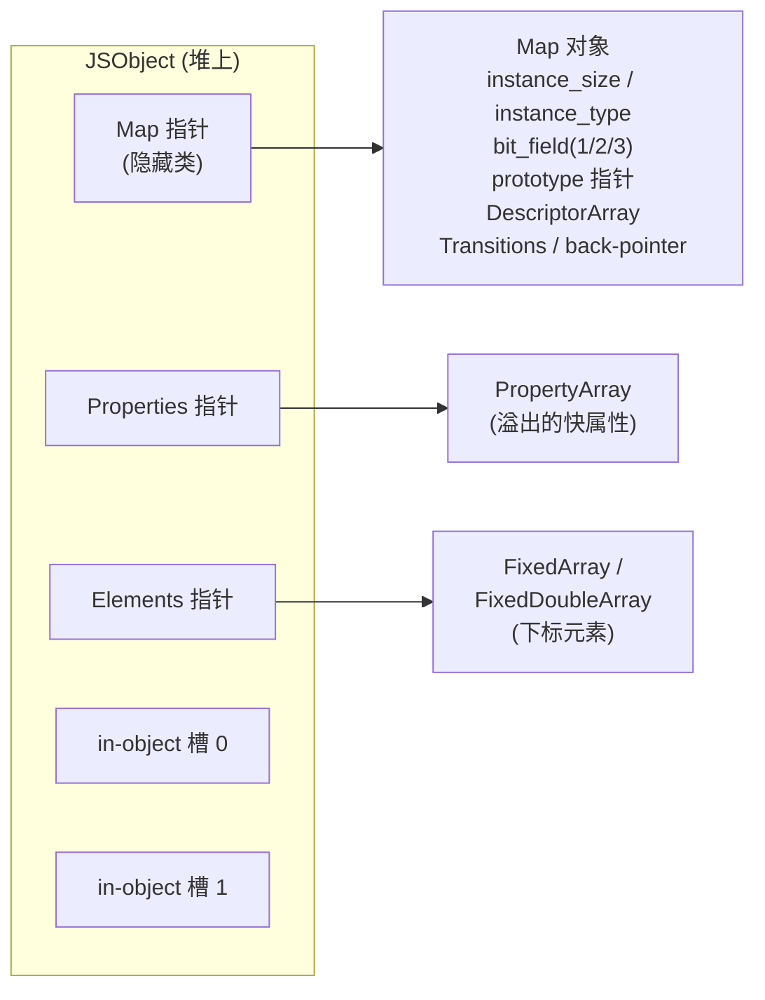
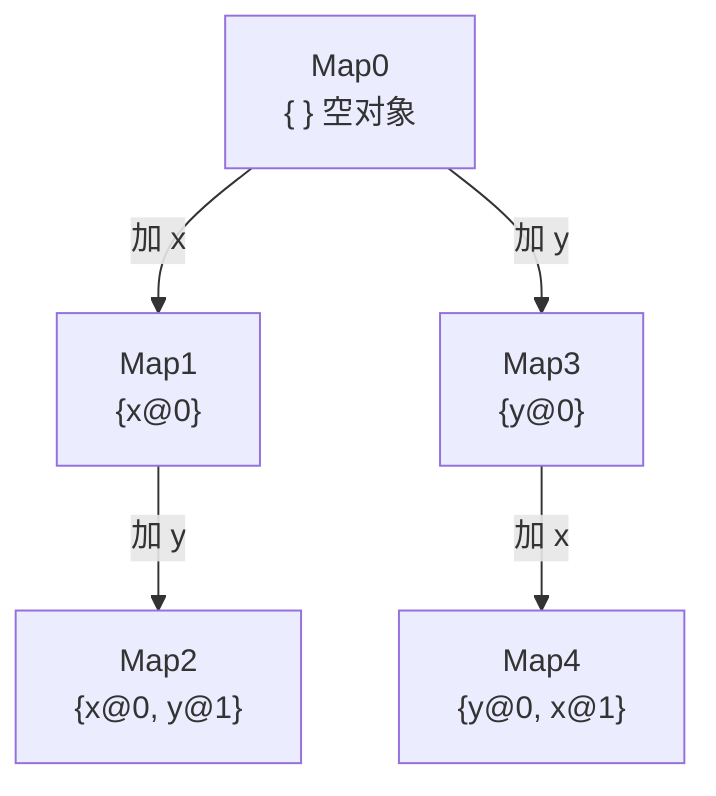
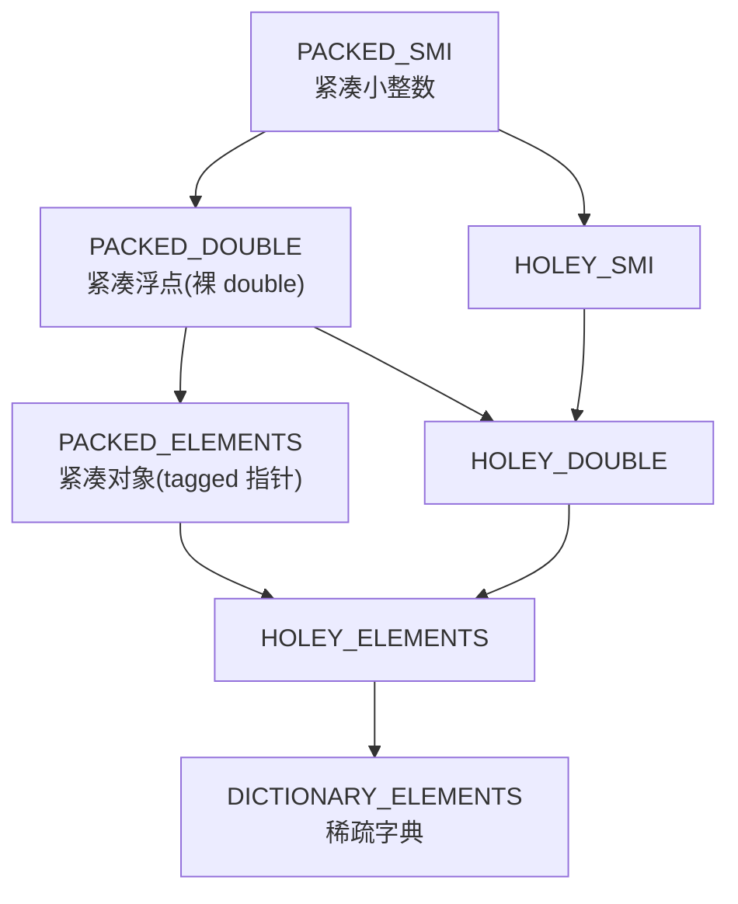
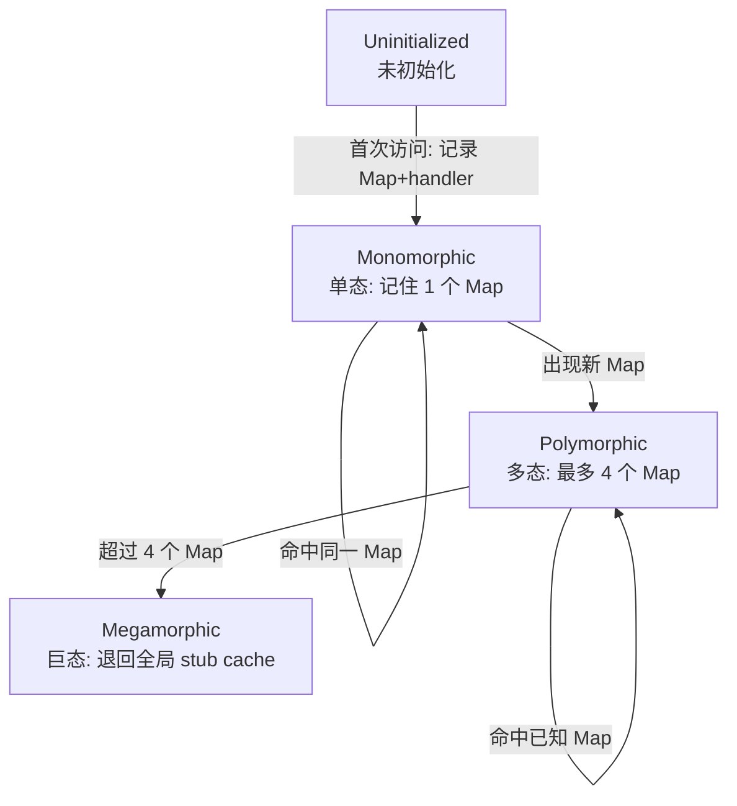

# 浏览器与JS引擎漏洞（4）· V8对象模型：Map与隐藏类
> [!abstract] TL;DR
> - V8 用**隐藏类（内部叫 Map/Shape）**把「动态对象」变成「静态结构 + 共享形状」：同一形状的对象共享同一个 Map，属性访问从哈希查找退化成**固定偏移读写**，这是引擎快的根。
> - 一个对象内存里就三根指针加内联槽：`Map | Properties | Elements | in-object 槽…`；**具名属性走 Map+偏移，下标属性走 Elements**，两条路彻底分家。
> - **转移树（transition tree）**让「按相同顺序加相同属性」的对象自动收敛到同一 Map；顺序不同则分叉出不同 Map——这解释了为什么属性顺序、`delete`、字典模式都会砸掉性能。
> - **Elements Kind 格（SMI→DOUBLE→ELEMENTS，PACKED→HOLEY，单向泛化）**是理解利用的钥匙：`double` 数组存**裸 IEEE-754**、`object` 数组存**tagged 指针**，一旦把两者混淆，就是 addrof/fakeobj 的物理基础。
> - **内联缓存（IC）+ FeedbackVector** 记录每个访问点见过的 Map 与 handler，喂给 TurboFan/Maglev 做投机优化——Map 是投机的「类型契约」，契约被破坏（漏检 CheckMaps、Map 损坏）即类型混淆。
> - 本篇是原理层地基：把 Map/IC/Elements 讲透，后续 05~09 章的漏洞类型、OOB 原语、addrof/fakeobj、任意读写才有落脚点。

## 概述与定位

JavaScript 是动态语言：对象可以随时增删属性、同一个「类」的两个实例结构可以完全不同、一个数组里可以混放整数浮点和对象。若照教科书方式，把每个对象实现成一张「属性名→值」的哈希表，那么每次 `obj.x` 都要算哈希、比字符串、处理冲突——在热点循环里这是灾难。V8 之所以能把 JS 跑到接近静态语言的速度，核心手法之一就是本篇的主角：**隐藏类（Hidden Class）**，在 V8 源码里叫 **Map**（这个术语借自 Self 语言，和 JS 的 `Map` 对象毫无关系，务必区分），学术上也称 **Shape**（SpiderMonkey 用这个词）、**Structure**（JavaScriptCore 用这个词）。

隐藏类的思想一句话：**把「结构」从「数据」里剥离出来，让结构可共享**。对象本身只存值和三根指针；「有哪些属性、各在什么偏移、什么特性」这些**形状信息**抽到一个独立的、可被大量对象共享的 Map 对象里。于是同一形状的一百万个对象，共享一个 Map；访问某属性时，引擎不再查哈希，而是「看这个对象的 Map 是不是我认识的那个，是就直接读固定偏移」。

在本系列里，本篇承上启下。上一篇 [[03.V8架构：解析到字节码到JIT|← V8架构]] 讲了源码怎样一路变成字节码再被 TurboFan/Maglev 编译成机器码；但**编译器凭什么敢把 `obj.x` 优化成一条 `mov`**？凭的就是隐藏类给出的「类型契约」和内联缓存记录的反馈。因此不懂 Map，就无法真正理解下一篇 [[05.JavaScript引擎漏洞类型|→ 下一章]] 里的类型混淆，也无法理解第 07/08 章为什么一个 `double` 数组和一个 `object` 数组的混淆就能造出 addrof/fakeobj。可以说，**V8 利用学的一切物理原语，都建立在对象模型这层地基上**。

## 原理与机制

### 一个对象在内存里长什么样

在启用**指针压缩**（V8 8.0 起 x64 默认开启）的 64 位构建下，一个普通 `JSObject` 的堆内布局如下（每个 tagged 字段 4 字节）：

```
JSObject 内存布局（指针压缩，64 位）
偏移    大小   字段
+0      4B     Map 指针（压缩）——指向隐藏类，决定「这是什么形状」
+4      4B     Properties 指针（压缩）——指向溢出的快属性数组，或字典，或 empty
+8      4B     Elements 指针（压缩）——指向下标元素后备（FixedArray/FixedDoubleArray）
+12     4B     in-object 属性槽 #0（内联在对象里的快属性）
+16     4B     in-object 属性槽 #1
...            （in-object 槽数量由 Map 决定，slack tracking 结束后定型）
```

不开指针压缩时每个 tagged 字段 8 字节，结构不变。**第 0 个字（map word）永远是隐藏类指针**，V8 里任何堆对象（字符串、数组、函数、乃至 Map 自己）第 0 字都是它的 Map——Map 自己的 Map 是自指的「元 Map（MetaMap）」，整个类型系统自举于此。



### 指针与 Smi 的标记（tagging）

V8 用一个字同时表达「小整数」和「堆指针」，靠最低位区分，这决定了后续所有内存视角的读法：

```
Tagged 值最低位（HeapObjectTag）:
  ...xxx0  -> Smi（小整数，值直接内联）
  ...xxx1  -> 强指针（HeapObject，真正解引用要 -1 去掉 tag）

Smi 编码:
  无指针压缩(64位): 值放高 32 位  [ int32 值 : 32 ][ 0 : 32 ]
  有指针压缩:        31 位有符号   [ int31 值 : 31 ][ 0 : 1 ]
```

理解 tag 是逆向 V8 内存的前提：在调试器里看到某字段是奇数，它多半是个指针（`-1` 后落到堆对象头，其第 0 字又是 Map）；看到偶数且形如 `0xNNNN00000000`，那是个 Smi。

### Map 里究竟装了什么

Map 本身也是堆对象，关键字段（`src/objects/map.h`）：

- **instance_size**：该形状实例占多少字节（含所有 in-object 槽），GC 分配时直接用。
- **instance_type**：16 位枚举，区分 `JS_OBJECT_TYPE`、`JS_ARRAY_TYPE`、`STRING_TYPE` 等——**类型判断的第一手依据**。
- **bit_field / bit_field2 / bit_field3**：一堆标志位。`bit_field2` 里塞着 **elements_kind**（见下）；`bit_field3` 里有 `number_of_own_descriptors`、`is_dictionary_map`、`is_deprecated`、`enum_length` 等。
- **prototype**：该形状的原型对象指针。原型也有自己的 Map。
- **constructor_or_back_pointer**：要么指向构造器，要么在转移树里指向「上一个 Map」（回边指针）。
- **instance_descriptors → DescriptorArray**：**描述每个具名快属性**（名字、偏移、表示、特性）。同一转移链上的 Map 可共享一份 DescriptorArray 的前缀。
- **transitions**：指向 TransitionArray（或单条转移，或原型信息），记录「再加某属性会去到哪个 Map」。
- **prototype_validity_cell / dependent_code**：原型链有效性哨兵、依赖此 Map 的已优化代码列表（Map 一变就去优化它们）。

### DescriptorArray：属性到偏移的账本

每个具名快属性在 DescriptorArray 里占一项：**key（字符串/Symbol）+ details（一个 Smi 位域）+ value/field-type**。details 里编码了：

- **kind**：数据属性还是访问器（getter/setter）。
- **location**：值在对象字段里（field），还是常量直接存描述符里（descriptor）。
- **representation**：字段的物理表示——`Smi` / `Double` / `HeapObject` / `Tagged`（最泛）/ `None`。
- **attributes**：writable / enumerable / configurable，即 `Object.defineProperty` 那三个开关。
- **field index**：字段在 in-object 槽或 PropertyArray 里的第几格。

于是「读 `obj.x`」在快路径上就是：`obj.Map == 已知Map ? load [obj + 偏移] : 慢查找`。偏移从哪来？从 Map 的 DescriptorArray 查一次、然后被内联缓存记住。

### 快属性 vs 字典（慢）属性

- **in-object 快属性**：内联在对象体里，`instance_size` 预留。构造器首次运行时 V8 会**乐观超配** in-object 槽（slack tracking），跑若干实例后「定型」并回收多余槽——这是为「后面还会加属性」留余量却不永久浪费。
- **溢出快属性（out-of-object）**：in-object 槽用完后，新属性进 `Properties` 指向的 **PropertyArray**，可扩容。仍是「快属性」，仍走 Map+偏移。
- **字典（慢）属性**：当对象被当哈希表用（属性太多、频繁增删、或 `delete` 了某属性），V8 把它降级为 **NameDictionary**，Map 变成「字典 Map」，**放弃结构共享与内联缓存**，退回真正的哈希查找。这就是为什么 `delete obj.x` 往往让这一整类对象变慢——它不是删一格，而是可能把对象踢出快路径。

### 具名属性与下标元素为何分家

`obj.foo` 与 `obj[0]` 在 V8 里走**完全不同的存储**：具名属性归 Map+Properties，**整数下标属性归 Elements**。原因是数组下标通常密集、可用连续数组直存，没必要为每个下标在 DescriptorArray 里立项；而具名属性稀疏、需要名字，适合 Map 描述。这种分家也解释了后面 Elements Kind 为什么能独立演化、独立成为利用面。

## 转移树、Elements Kind 与内联缓存详解

这一段是全篇的「深水区」，把三件事讲透：形状怎么演化（转移树）、数组元素怎么泛化（Elements Kind 格）、访问点怎么记忆类型（内联缓存）。它们共同定义了 V8 的「类型契约」，也正是后续章节漏洞的着力点。

### 转移树：形状的演化不是复制而是接龙

给一个空对象逐个加属性，V8 不是每次都新造一张孤立的 Map，而是维护一棵**转移树**：从 `Map0`（空）出发，加属性 `x` 就沿一条标着 `x` 的边走到 `Map1`，再加 `y` 走到 `Map2`。边由**（属性名, 特性）**作 key。妙处在于：**另一个对象若也按 `x`、`y` 的顺序加同样属性，会沿同一条边走到同一个 `Map2`**——两个对象自动共享形状，无需协商。



这张图也暴露了一个经典陷阱：`{x,y}` 与 `{y,x}` 顺序不同，终点是**不同的 Map**（`Map2` vs `Map4`），偏移布局也不同。后果是：若你的代码路径同时喂进两种顺序的对象给同一个访问点，内联缓存会从「单态」被逼成「多态」甚至「巨态」，热点直接掉出快路径。**「构造对象时保持属性顺序一致」是 V8 性能第一军规**，根子就在转移树。回边指针（back-pointer）让引擎能从任一 Map 反向走回根，用于 Map 迁移与去优化。

### 表示泛化与 Map 弃用（deprecation）

字段的 representation 不是一成不变。设想某字段先存 `Smi`，Map 记它是 `Smi` 表示；某天你写进一个浮点，`Smi` 装不下——这时 V8 不能就地改这张被无数对象共享的 Map，而是走**泛化**：沿表示格 `None → Smi → Double → HeapObject → Tagged`（越往右越泛）造一张字段更泛的新 Map，把旧 Map 标记为 **deprecated（弃用）**。老对象不会立刻被改，而是在**下次访问时惰性迁移**——由 `MapUpdater` 把对象搬到新 Map、必要时把字段就地扩箱（如把内联的 double 装箱）。字段若是 `HeapObject`，其 field type 还能进一步从「只能装某个特定 Map 的对象」泛化到「Any」。理解这套「弃用—迁移」机制，是读懂某些 UAF/类型混淆的前提：**Map 迁移是一个「悄悄改变对象物理布局」的时机**，历史上多个漏洞与迁移竞态、迁移期状态不一致有关。

### Elements Kind：数组元素的单向泛化格

下标元素的「种类」由 Map 的 elements_kind 决定，它构成一个**只能变泛、不能收窄的格**：



三条主线要记牢：

1. **SMI → DOUBLE → ELEMENTS（tagged）**：`[1,2,3]` 是 `PACKED_SMI_ELEMENTS`，后备是存 Smi 的 `FixedArray`；一旦写入 `1.5`，整个数组泛化成 `PACKED_DOUBLE_ELEMENTS`，后备换成 `FixedDoubleArray`，**每格是 8 字节裸 IEEE-754 浮点，没有 tag**；再写入一个对象，泛化成 `PACKED_ELEMENTS`，后备回到存 tagged 指针的 `FixedArray`。
2. **PACKED → HOLEY**：只要出现「洞」（`a[0]=1; a[2]=1` 跳过了下标 1，或 `delete a[0]`，或 `new Array(100)`），就从 packed 泛化成 holey。holey 数组的空槽存的是特殊哨兵 **the_hole**（这正是第 07 章 [[07.TheHole与OOB原语构造]] 的主角：the_hole 泄漏/伪造能撬动越界）。holey 变体读取时要多一次「是不是洞」的检查，慢于 packed。
3. **退化到 DICTIONARY_ELEMENTS**：数组太稀疏（如 `a[100000]=1`）时后备变哈希字典，彻底离开快路径。

**为什么 Elements Kind 是利用的钥匙？** 因为 `PACKED_DOUBLE_ELEMENTS` 存的是**未装箱的原始 8 字节 double**，而 `PACKED_ELEMENTS` 存的是**tagged 指针**。二者物理宽度都在同一后备数组格里，语义却天差地别。若攻击者能让引擎「以为」一个数组是 double 数组、实则底层是对象数组（或反之）——即**Elements Kind 混淆**——那么：把一个对象指针当 double 读出来，就得到了它的地址（**addrof**）；把一个受控 double 当指针写进去、再当对象用，就伪造了一个对象（**fakeobj**）。这两条正是第 08 章 [[08.addrof与fakeobj原语]] 的地基。本篇只讲清物理原理，不给成品配方。Elements Kind 的**单向性**（只泛不收）也是漏洞常客：优化后的代码常假设「这里一直是 double 数组」，若能在优化代码持有旧假设期间偷偷改变 elements kind，就是一处类型混淆窗口。

### 内联缓存（IC）与 FeedbackVector：访问点的记忆

字节码里每个属性访问（如 `LdaNamedProperty`）都带一个**反馈槽**索引，指向该函数的 **FeedbackVector** 里的一格。IC 就活在这些槽里，状态机如下：



- **单态（Monomorphic）**：反馈槽里存「一个弱引用的 Map + 一个 handler」。handler 若是简单字段读，就是个编码了「in-object 偏移 24」的 Smi；复杂情形（原型链读、访问器、字典）则是个 `DataHandler`。命中即「查 Map 相等→按 handler 直读」，飞快。
- **多态（Polymorphic）**：见过 2~4 个 Map，槽里存一张小表，逐个比对。
- **巨态（Megamorphic）**：Map 太杂，放弃私有记忆，退回一张全局 **stub cache**（按 `(map, name)` 哈希）。这是 IC 的「投降」状态，也是性能悬崖。

IC 的意义远不止「省一次哈希」。**它记录的类型反馈是投机式 JIT 的输入**：TurboFan/Maglev 读 FeedbackVector，看到「这个点历史上只见过 `Map2`」，就大胆生成「假定是 `Map2`、直接读偏移」的机器码，并在入口插一条 **CheckMaps** 守卫；运行时 Map 不符就**去优化（deopt）**退回字节码。于是链条闭合：**Map 是类型契约，IC 是契约的历史记录，JIT 依据契约投机，CheckMaps 是契约的运行时校验**。第 06 章 [[06.类型混淆与JIT优化漏洞]] 的一大类漏洞，本质就是「投机时漏插/错误消除了 CheckMaps，或副作用建模不当让契约在校验后被偷偷违反」——不懂本篇的契约，就看不懂那类 bug。原型链的稳定性则由 **prototype validity cell** 守护：改动某原型会作废对应的有效性哨兵，令所有依赖「原型链不变」的 IC 一起失效重来。

## 工具视角与实战

要真正「看见」隐藏类，最直接的是用带调试特性的 `d8`（V8 的独立 shell）。以下命令仅用于自有构建/靶场的观察实验。

**开启内部函数，直接打印对象结构**：

```bash
# 需要 debug 或带 --allow-natives-syntax 的构建
d8 --allow-natives-syntax
```

```js
function Point(x, y) { this.x = x; this.y = y; }
const a = new Point(1, 2);
const b = new Point(3, 4);

%DebugPrint(a);          // 打印 a 的 Map 地址、instance_type、各字段
console.log(%HaveSameMap(a, b));   // true —— 同顺序同属性，共享 Map

const c = {}; c.y = 1; c.x = 2;    // 顺序反了
console.log(%HaveSameMap(a, c));   // false —— 不同 Map

const arr = [1, 2, 3];
console.log(%HasSmiElements(arr));    // true
arr.push(1.5);
console.log(%HasDoubleElements(arr)); // true —— 泛化到 double
arr.push({});
console.log(%HasObjectElements(arr));  // true —— 再泛化到 tagged
```

常用内部（native）函数：`%DebugPrint` / `%DebugPrintPtr`、`%HaveSameMap`、`%HasFastProperties`、`%HasDictionaryElements`、`%HasSmiElements` / `%HasDoubleElements` / `%HasObjectElements`、`%HasHoleyElements`、`%CollectGarbage`。

**追踪演化过程**的 flag：

```bash
d8 --trace-maps script.js               # 打印每一次 Map 创建/转移
d8 --trace-ic script.js                 # 打印每个 IC 点的状态迁移(0->.->1->P->N)
d8 --trace-elements-transitions x.js     # 打印 elements kind 每次泛化
d8 --print-opt-code --code-comments x.js # 看优化代码里插入的 CheckMaps
```

`--trace-maps` 的输出能让你亲眼看到「加属性→新建 Map、连回边」；`--trace-ic` 里 `0`(未初始化)`.`(premono)`1`(单态)`P`(多态)`N`(巨态)的状态迁移，是判断「热点是否掉出快路径」的第一手证据。

**在 gdb 里下潜**：V8 源码自带 `tools/gdbinit`，提供 `job`（打印一个 JS 堆对象，自动解 tag、跟 Map）、`jco`（按地址找所属对象）等宏。逆向一个崩溃现场时，典型流程是：拿到疑似对象地址→`job` 出它的 Map→再 `job` 那个 Map 看 instance_type 和 DescriptorArray→比对「引擎以为的类型」和「实际布局」是否一致，一旦不一致就是类型混淆的物证。研究 JIT 代码时配合 **Turbolizer**（可视化 TurboFan 的 sea-of-nodes IR），能看到 `CheckMaps`、`LoadField`、`LoadElement` 节点，直观定位「哪个 map 检查被优化掉了」。

**实验设计建议**：想验证「属性顺序影响 Map」，就构造两组顺序不同的对象用 `%HaveSameMap` 对比；想验证「delete 触发字典模式」，`delete` 前后各查一次 `%HasFastProperties`；想复现 elements kind 泛化的性能悬崖，用 `--trace-elements-transitions` 观察一个热点数组何时从 double 掉进 dictionary。这些小实验是把本篇原理「跑起来看」的最短路径，也是 [[49.Fuzzing与漏洞挖掘/15.浏览器与JS引擎Fuzzing|浏览器与JS引擎 Fuzzing]] 里「结构感知变异」的直觉来源——好的 JS fuzzer 会刻意在属性顺序、elements kind、map 迁移这些维度上制造压力。

## 安全性与正确使用

隐藏类模型既是性能基石，也是**攻击面的坐标系**。把本篇的原理与利用的关系点透，但只停在「为什么可利用」，不落到「怎么打某个真实目标」：

- **Elements Kind 混淆 → addrof/fakeobj**：如前所述，`double` 数组存裸浮点、`object` 数组存 tagged 指针，二者混淆即得地址泄漏与对象伪造原语。这是最经典的一类 V8 利用地基（详见 [[08.addrof与fakeobj原语]]），常由 JIT 投机错误、`Array.prototype` 方法的边界疏漏、或长度/elements 不同步触发。
- **Map 损坏 / 伪造 Map**：拿到任意读写后，篡改一个对象的 map word，让引擎按错误形状解释它，可把「受控字节」变成「受控对象」，或把一个 `TypedArray` 的 backing store/length 改成任意值，升级为**任意读写**（承接 [[33.二进制漏洞与利用基础/15.ASLR与PIE绕过技术|任意读写原语]]）。
- **CheckMaps 与投机契约被破坏**：TurboFan/Maglev 依据 IC 反馈投机，若副作用建模不当（某回调偷偷改了 elements kind 或触发 Map 迁移）而守卫被消除，就是类型混淆（详见 [[06.类型混淆与JIT优化漏洞]]，前置阅读 [[41.Compiler|编译器与 JIT 优化]]）。
- **the_hole 泄漏**：holey 数组的空槽哨兵一旦被读出/伪造，可撬动越界与更强原语（[[07.TheHole与OOB原语构造]]）。

防御方视角同样落在这层：现代 V8 用 **map 校验**（CheckMaps）、**字段表示与 field type 收紧**、以及 **V8 沙箱（把堆内指针改为受限的间接引用/偏移，令「堆内任意写」难以直接转成任意机器地址写）** 来抬高利用门槛——这些缓解与 CFI 是第 13 章 [[13.浏览器漏洞缓解：V8沙箱与CFI]] 的主题。指针压缩（把堆内指针压成 4GB cage 内偏移）既是省内存的工程，也顺势收窄了「堆内损坏」能直接触及的地址空间，是沙箱设计的前身。

> [!caution] 合规边界
> 本文对 Map、Elements Kind、内联缓存与投机契约的剖析，**仅用于自有/授权环境、CTF 靶场与安全研究**，一律为**防御与教育视角**。文中不提供、也不暗示针对真实生产系统或他人系统的武器化步骤，不为绕过任何浏览器/商业软件的授权或防护提供成品利用链。原理讲透，是为了让防御者、审计者与引擎工程师看懂根因、写出正确的守卫与缓解；请勿将其用于未授权测试或攻击真实目标——那既违反法律，也背离本系列的初衷。

## 小结

V8 把「动态对象」这个性能噩梦，用**隐藏类（Map/Shape）**这一层「结构与数据分离、结构可共享」的抽象化解掉：对象只剩三根指针加内联槽，形状信息集中到可共享的 Map；属性访问从哈希查找退化成 Map 检查加固定偏移。围绕它，V8 长出了一整套机制——**转移树**让同构对象自动收敛形状（也让属性顺序、`delete`、字典模式成为性能命门）；**表示泛化与 Map 弃用**允许字段类型在运行中安全变宽；**Elements Kind 单向泛化格**把数组元素的物理表示与语义解耦（也埋下 double/object 混淆这一利用根源）；**内联缓存 + FeedbackVector** 记录每个访问点的类型历史，成为投机式 JIT 的输入，而 **CheckMaps** 是投机契约的运行时校验。把这套「Map 是契约、IC 是记忆、JIT 是投机、CheckMaps 是校验」的闭环理解到位，就握住了后续所有 V8 利用的物理地基：类型混淆为何发生、OOB 从何而来、addrof/fakeobj 凭什么成立、任意读写如何升级——都在这层地基上生根。下一篇进入 [[05.JavaScript引擎漏洞类型|→ JavaScript 引擎漏洞类型]]，把这些「可利用性」归类展开。

## 相关阅读

- 本系列上一篇：[[03.V8架构：解析到字节码到JIT|← V8架构：解析到字节码到JIT]]
- 本系列下一篇：[[05.JavaScript引擎漏洞类型|→ JavaScript引擎漏洞类型]]
- 承接利用：[[06.类型混淆与JIT优化漏洞]]、[[07.TheHole与OOB原语构造]]、[[08.addrof与fakeobj原语]]
- JIT 前置：[[41.Compiler|编译器与 JIT 优化]]（推测优化如何引入漏洞）
- 原语与绕过：[[33.二进制漏洞与利用基础/15.ASLR与PIE绕过技术]]（任意读写与地址泄漏承接）
- 缓解与沙箱：[[13.浏览器漏洞缓解：V8沙箱与CFI]]
- Fuzzing 呼应：[[49.Fuzzing与漏洞挖掘/15.浏览器与JS引擎Fuzzing]]
- WASM 呼应：[[40.WASM与虚拟化壳逆向/06.WASM内存模型与线性内存安全]]
- 官方文档：V8 官方博客 “Fast properties in V8”、“Elements kinds in V8”、“Pointer Compression in V8”，以及 V8 源码 `src/objects/map.h`、`src/objects/descriptor-array.h`、`src/ic/`（IC 实现）与 `tools/gdbinit`（`job` 等调试宏）。

[[00.浏览器与JS引擎漏洞总览|⬆ 系列总览]] | [[03.V8架构：解析到字节码到JIT|← 上一章]] | [[05.JavaScript引擎漏洞类型|→ 下一章]]
