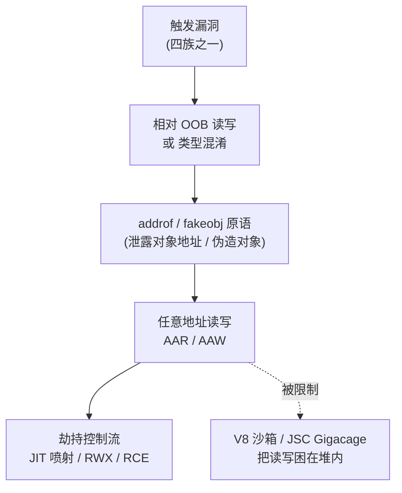
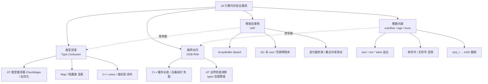
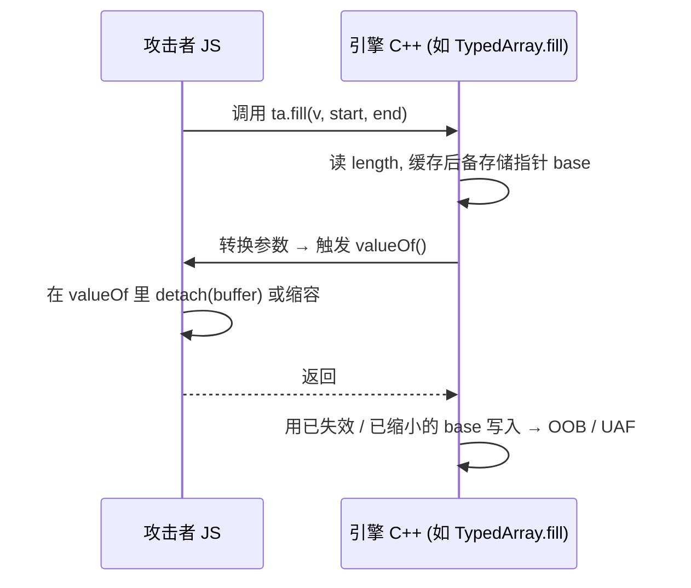

# 浏览器与JS引擎漏洞（5）· JavaScript引擎漏洞类型
> [!abstract] TL;DR
> - JS 引擎的内存安全缺陷可归为四族：**类型混淆（Type Confusion）**、**越界读写（OOB）**、**释放后使用（UAF）**、**整数问题**；四者互为因果——整数溢出常收敛为 OOB，UAF 常收敛为类型混淆。
> - 贯穿四族的统一根因是"**不变量在回调重入中被打破**"：属性访问、类型转换、数组回调、迭代、`Proxy` 陷阱、`Symbol.species` 都能让攻击者 JS 在引擎 C++ 缓存了指针/长度**之后**突然执行——这是 JS 引擎独有的、发生在单个 C 函数内部的 TOCTOU。
> - **类型混淆是"漏洞之王"**：JIT 对 Map/隐藏类的类型推测一旦漏掉 `CheckMaps` 或去优化点，就把 A 对象当 B 对象用，直接产出 `addrof`/`fakeobj` 或受控 OOB。
> - **OOB 的两大来源**：引擎 C++ 里长度与后备存储指针失配；JIT 边界检查消除（`CheckBounds` 因 typer 范围分析算错而被删）。二者最终都落到 `TypedArray`/butterfly 的相对读写。
> - 从 bug 到 RCE 有固定"**原语阶梯**"：漏洞 → 相对 OOB/类型混淆 → `addrof`+`fakeobj` → 任意读写 → 劫持控制流。本篇给**分类与机理**，第 6–10 篇逐级武器化。
> - 引擎差异决定利用与缓解形态：V8 的 Map+指针压缩+沙箱、JSC 的 Structure+NaN-boxing+Gigacage+PAC，同一 bug 族在不同引擎的门槛与原语并不相同。

## 概述与定位

本篇是《浏览器与JS引擎漏洞》系列的**漏洞分类学**一章。前四篇铺完了地基——攻击面（01）、多进程沙箱（02）、V8 从解析到 JIT 的流水线（03）、以及对象模型里 Map 与隐藏类的核心（04）。从本篇开始进入"缺陷"本身：一个现代 JS 引擎（V8、JavaScriptCore、SpiderMonkey）到底会以哪几种形态**违反内存安全**，每种形态的根因、触发条件、边界与变体是什么。本篇只做**分类与机理**，把"某一族如何一步步武器化"留给后续：类型混淆与 JIT 优化漏洞的深挖在第 6 篇，`TheHole` 与 OOB 原语构造在第 7 篇，`addrof`/`fakeobj` 在第 8 篇，任意读写到 RCE 在第 9 篇，WebAssembly 与 RWX 在第 10 篇。读完本篇，你应当能拿到任意一个 JS 引擎漏洞公告，快速判断它属于哪一族、大致给出什么原语、在哪一层（解释器 / builtin C++ / JIT / GC）触发。

为什么 JS 引擎是如此肥沃的攻击面？三点叠加：其一，**攻击者掌握的是高级语言**——他能写任意合法 JS，而这门语言的语义极其动态（原型链、类型强转、`Proxy`、`Symbol`），几乎每个操作背后都可能回调用户代码；其二，**引擎本体是几十万行手写 C++**，还带一个把 JS 编成本机码的多层 JIT（TurboFan/Maglev、DFG/FTL、WarpMonkey），优化器要在"不破坏语义"的前提下省掉检查，稍有偏差就是内存安全洞；其三，**渲染器进程内没有更强的语言边界**——一旦在 renderer 里拿到任意读写，配合沙箱逃逸（第 12 篇）即可威胁整机。正因如此，JS 引擎漏洞是 Pwn2Own、野外 0day 的常客，也是 Fuzzing（第 49 篇《浏览器与JS引擎Fuzzing》）投入最密集的靶子之一。

需要先厘清一个定位：本篇讲的"漏洞类型"是**按内存不安全的表现形态**划分（confusion / OOB / UAF / integer），而不是按 CWE 编号或按触发子系统（parser / regexp / GC / JIT）划分。后者是正交维度——同一个 UAF 可以在 GC 里发生，也可以在 `ArrayBuffer` detach 里发生；同一个类型混淆可以来自 JIT 推测，也可以来自 C++ 里的 `union` 误判。理解这两个维度的正交，是读懂漏洞公告的关键。

## 原理与机制

四族看似各异，其真正的**统一根因只有一条：引擎维护的某个不变量（invariant）被攻击者打破**。引擎为了性能，在无数地方隐式假设了某些事实——"这个指针指向的对象类型是 X""这个数组的长度是 N""这块后备存储此刻仍然存活且大小不变""这个索引小于长度"。这些假设一旦为真，快速路径就能省掉检查、直接按固定偏移访存。漏洞的本质，就是让某个假设在被使用的瞬间**恰好不成立**。

而 JS 引擎之所以格外容易打破不变量，源于一个它独有的性质：**攻击者的代码可以在几乎任何时刻被引擎自己回调执行**。这是理解全部四族的总钥匙。请记住这张"重入触发点"清单——它们是 JS 引擎版的 TOCTOU（检查时/使用时）缝隙：

- 属性读写 → getter/setter、`Proxy` 的 `get`/`set`/`has`/`deleteProperty` 陷阱；
- 类型强转 → `valueOf()`、`toString()`、`Symbol.toPrimitive`（当 C++ 把一个对象当数字/字符串用时）；
- 数组/集合操作 → 比较器回调（`sort`）、`Symbol.species` 决定返回对象类型、`Symbol.iterator` 自定义迭代；
- 原型链遍历、`with`、`Reflect`、`Function.prototype.apply`（`arguments` 展开）；
- 甚至 GC——它不是用户代码，却会**移动或回收**对象，等效地改变内存布局与指针有效性。

archetype（原型病灶）由此而来：**引擎 C++ 在回调之前缓存了长度或后备存储指针，回调里攻击者改变了数组大小 / detach 了 buffer / 变更了对象的 Map，回调返回后 C++ 仍用那份陈旧的缓存去访存**。`TypedArray.prototype.fill`、`Array.prototype.slice/sort/copyWithin/concat` 的历史 CVE，绝大多数是这个模式的不同外衣。把这个模式刻进脑子，你就掌握了 JS 引擎漏洞挖掘与审计的一半。

另一条主线在 **JIT**：优化器基于**类型反馈（type feedback）**做**推测优化（speculative optimization）**——它假设"过去这里总是 double 数组""这个索引总在界内"，据此删掉 `CheckMaps`/`CheckBounds`，并在假设不成立时通过**去优化（deopt）**退回解释器。漏洞出在两处：要么该插的去优化点漏了/被后续 pass 错误消除，要么 typer 的**范围分析（range analysis）**把某个索引的取值范围算窄了，让 `CheckBounds` 被"证明多余"而删除。前者产出类型混淆，后者产出 OOB。第 6 篇会把 TurboFan 的 Sea-of-Nodes、typer、simplified-lowering 拆开细讲；这里只需记住"**推测的代价是：一旦推测错误而无去优化兜底，就是内存破坏**"。

最后是所有四族共享的终点——**原语阶梯（primitive ladder）**。单个 bug 很少直接等于"控制 RIP"；利用是把弱原语逐级升格为强原语的过程：



本篇是这张图最左侧两格的"物种图鉴"；越往右越是后续章节的主题。

## 四大漏洞族的机理、变体与实例详解

先给一张按根因展开的谱系图，再逐族剖开。注意图中虚线——**整数问题常导致 OOB，UAF 常导致类型混淆**，四族并非互斥，而是一张会互相坍缩的网。



### 类型混淆（Type Confusion）：把 A 当 B 用

**机理**：引擎在某个访存点持有一个对象指针，并**误以为它的类型/布局是 T1，实际却是 T2**。于是它按 T1 的字段偏移去读写 T2 的内存——把 T2 里恰好落在那个偏移的字段（可能是一个指针、一个长度、一个内联的 double）当作 T1 的字段解释。若被混淆的两类对象一个把某字段当"内联 double 数据"、另一个把同偏移当"对象指针"，攻击者就同时得到了**把可控 double 写进去当指针用（fakeobj 的雏形）**与**把指针读出来当 double 看（addrof 的雏形）**——这正是类型混淆被称为"漏洞之王"的原因：它一步跨到原语阶梯的第三格。

**why 它在 JS 引擎里如此高发**：因为 JIT 的整个存在意义就是"基于推测省掉类型检查"。看这段最小示意（概念，非可用利用）：

```js
function f(o) { return o.x; }        // JIT 会假定 o 的 Map 固定, x 在某固定偏移
for (let i = 0; i < 100000; i++)     // 预热：同一"形状"喂满类型反馈
  f({ x: 1.1 });
// 若某去优化点缺失, 或 CheckMaps 被后续优化 pass 错误消除,
// 传入布局不同的对象时, f 仍按固定偏移直读 → 把别的字段当 x → 类型混淆
```

优化后的 `f` 是一条"load [o + 0x18]"，其正确性完全依赖前面那条 `CheckMaps(o, expectedMap)` 的存在。只要这条守卫在某个优化组合下被删或被绕过，混淆即成。**变体**有三支：

- **JIT 推测型**（最主流）：漏 `CheckMaps`、去优化点建模错误（把有副作用的节点当无副作用，导致 map 变更未触发重查）。第 6 篇主角。
- **Map/隐藏类混淆**：利用对象模型的过渡系统（04 篇）——例如让两个本应有不同 Structure 的对象共享一段代码路径，或利用 `StructureID` 复用/回收的时序。JSC 早期 `StructureID` 是小整数索引，一度可被伪造（后加了随机化熵）。
- **C++ 层 `union`/值标签误判**：引擎把 `JSValue` 编码成一个 64 位机器字（下节详解 NaN-boxing / Smi tagging），若某处 tag 检查缺失，就把整数当指针、或把指针当 double。这类往往藏在 builtin 或 DOM 绑定的手写 C++ 里。

**边界与陷阱**：类型混淆不一定立刻崩溃——若被混淆两类对象大小相近、字段语义"半兼容"，程序会继续跑，直到攻击者精心挑选那个"一边是 double 一边是指针"的偏移才引爆。这也是它难 fuzz 出稳定崩溃、却极适合人工审计的原因。

### 越界读写（OOB）：越过后备存储的边界

**机理**：以一个合法对象为锚，读写落到它**分配边界之外**。在 JS 引擎里，"越界"几乎总是发生在两种连续内存上——`Array` 的 **butterfly/elements**（存放稠密元素的后备存储）与 `ArrayBuffer` 的**线性字节缓冲**（`TypedArray`/`DataView` 的视图之下）。它们正是利用最爱的载体：一旦拿到对 elements 或 buffer 的相对越界，就能去改**相邻对象的 length 字段**，把一个普通数组的长度撑到巨大，从而升格为近乎任意的堆内读写（第 7 篇主题）。

**两大来源**，对应谱系图的 O1/O2：

其一，**C++ 里长度与后备指针失配**——就是"原理与机制"那节的 archetype。示意其形状（概念，非成品）：

```js
let arr = [1.1, 2.2, 3.3];
arr.someBuiltinTakingCallback({
  valueOf() { arr.length = 1; return 0; }   // 回调里把数组缩容
});
// 若该 builtin 在回调前缓存了 elements 指针与旧长度 3,
// 回调后仍按旧长度遍历/写入 → 越过已缩小的后备存储 → OOB。
```

下面这张时序图把这个"单函数内 TOCTOU"画清楚——它是本系列出现频率最高的病灶：



其二，**JIT 边界检查消除**——优化器的 typer 为索引变量算一个取值范围，若范围偏窄地"证明"了 `index < length` 恒真，就删掉 `CheckBounds`。经典教训是 typer 对特殊数值的建模疏漏：`Math.expm1(-0)` 会返回 `-0`、某些运算会引入 `NaN`，若 typer 的类型格（lattice）未把 `-0`/`NaN` 纳入某运算的输出集合，下游的范围推导就会算错，进而误删边界检查。历史上 V8 一度**完全信任** typer 来做边界检查消除，被 saelo 在 Phrack《Circumventing Chrome's hardening of typer bugs》系统性攻破后，才转向"即便 typer 说安全也保留一层硬化（索引掩码 / 不纯基于 typer 消除）"。这段拉锯是 JIT 漏洞史的缩影，细节在第 6 篇。

**边界与陷阱**：`Array` 有"快元素（packed/holey 的 SMI/double/object）"与"字典元素"之别，二者布局迥异，很多 OOB 藏在两种表示的**过渡边界**上；`length` 是 `uint32` 而元素容量另计，逻辑长度与物理容量的缝隙也是常客。此外，**可变长 `ArrayBuffer`（Resizable ArrayBuffer）**是近年（约 2021 起）新增的语言特性，`resize()` 让"缓冲大小在生命周期内可变"成为新常态，直接给这一族开了新的攻击面。

### 释放后使用（UAF）：对象已死，指针尚存

**机理**：某对象/缓冲被释放（GC 回收、`ArrayBuffer` detach、显式移交），但引擎别处仍握有指向它的**悬垂指针**并继续解引用。若攻击者能在释放与使用之间把那块内存**重新分配**为自己可控的对象，UAF 就坍缩成**类型混淆**（旧指针的静态类型 T1，新占位的实际类型 T2）——这就是谱系图里 `UAF -.常导致.-> TC` 那条虚线。

**变体**：

- **`ArrayBuffer` detach**：`postMessage` 转移、`transfer()`、或某些内部路径会把 buffer 置为 detached、释放其后备存储。规范要求此后对视图的访问抛异常或视为长度 0；bug 出在某条快速路径**缓存了后备指针**、未重查 detach 标志，于是写入已释放内存。它常与上一节的回调重入合流（在 `valueOf` 里 detach）。
- **GC 相关**：对象未被正确 **root**（handle 作用域没兜住），一次分配触发 GC 把它回收，随后被使用；或**写屏障（write barrier）缺失**——分代/增量 GC 依赖写屏障记录"老代指向新代"的引用，漏一处屏障，GC 就可能提前回收仍被引用的对象，或在移动式 GC 里漏更新一个指针。这类极难 fuzz、极依赖压力测试与代码审计。
- **迭代器失效 / 集合并发改动**：迭代 `Map`/`Set`/数组时在回调里增删元素，导致底层存储 realloc 而迭代游标悬垂。

**why 移动式 GC 让 UAF 更隐蔽**：V8/JSC 的新生代是**半空间复制式**，存活对象会被搬到新地址，所有引用需经写屏障/handle 更新。这意味着"悬垂"不止是"指向已释放"，还可能是"指向了对象搬走后的旧址"。因此纯裸指针在引擎里几乎处处是雷，必须走 `Handle`/`JSValue` 抽象；哪段手写 C++ 图省事持了裸指针跨越一次可能触发 GC 的分配，哪段就是 UAF 候选。

### 整数问题：一切越界的上游

**机理**：在计算长度、容量、偏移、字节数时发生**溢出、有符号/无符号混用、或宽度截断**，得到一个错误的小值，据此**欠分配**或**错误绕过边界比较**，随后按逻辑值访存 → OOB。整数问题很少是"终点"，它几乎总是 OOB（偶尔 UAF）的上游，故单列一族以便审计时上溯根因。

**三支变体**：

- **乘法/加法溢出**：`size = length * elementSize` 或 `newLen = oldLen + added`，若在 32 位（或未检上限的 64 位）里回绕成小值，分配就比逻辑需要的小。示意：

```js
// 概念示意：长度计算若在某路径用 int32 且漏检上限
// (oldLen + delta) 回绕为小值 → 后备存储欠分配 → 按逻辑长度写入 → OOB 写
```

- **有符号/无符号混用**：一个本应无符号的索引被当有符号读，负数在 `< length`（无符号比较）下"看起来很大"或"看起来合法"，绕过守卫。反之亦然。数组下标、`TypedArray` 的 `offset`/`length` 参数是重灾区。
- **`size_t → int32` 截断**：引擎内部很多长度字段是 32 位（如 JSC 数组长度 `uint32`，V8 `String::kMaxLength`、`FixedArray` 上限各有约束），当一个 64 位大小被赋给 32 位字段时高位丢弃，得到小值。`String.prototype.repeat`/`padStart`、字符串拼接的长度上限历史上都出过此类。

**边界与陷阱**：引擎其实到处设了 `kMaxLength` 之类的上限来防这些，漏洞恰恰出在"**某一条不常走的路径忘了检查上限**"，或"**检查用的类型与实际使用的类型宽度不一致**"。审计整数问题的核心动作，是盯住每一处 length/size 运算，追问"这里的类型宽度、符号、上限检查三者是否自洽"。

### 一张对照表：四族速查

| 漏洞族 | 典型触发层 | 直接根因 | 常见收敛原语 | 代表模式 / 案例 |
|---|---|---|---|---|
| 类型混淆 | JIT / builtin C++ | 类型/布局假设被破坏 | addrof + fakeobj | 漏 `CheckMaps`；`Structure` 混淆 |
| OOB | builtin C++ / JIT | 长度-指针失配；边检消除 | 相对堆读写 → 撑 length | fill/slice 回调重入；typer 范围错 |
| UAF | GC / detach / 迭代 | 悬垂指针再解引用 | 坍缩为类型混淆 | detach-in-`valueOf`；写屏障缺失 |
| 整数问题 | 分配 / 索引 | 溢出/符号/截断 | 欠分配 → OOB | `len*elem` 溢出；`uint32` 截断 |

## 工具视角与实战

**如何发现**这四族缺陷，路径有四条，彼此互补：

- **Fuzzing（第 49 篇详展）**：现代 JS 引擎 fuzz 的旗舰是 **Fuzzilli**（saelo）——它不直接生成 JS 文本，而是用一门中间语言 **FuzzIL** 生成**语义有效、类型感知**的程序，再翻译成 JS，配合覆盖率反馈演化。之所以要 IL 而非纯文本变异，是因为随机字符串几乎全是语法/类型错误，触不到深层优化路径；IL 保证了程序结构合法，才能把 JIT 的推测路径喂满。DOM 侧则有 **Domato** 等语法生成器（渲染器/DOM 是第 11 篇）。
- **差分测试（differential testing）**：同一段 JS 在不同引擎、或同一引擎不同优化层级（关/开 JIT、`--no-opt` vs 强制优化）下跑，比对结果或崩溃。JIT 的正确性漏洞（会导致类型混淆的语义偏差）常被此法逮到。
- **补丁差分 / n-day 分析**：厂商修复常附带**回归测试**（V8 的 `test/mjsunit/regress/`、WebKit 的 `LayoutTests`），这些测试往往就是**触发器本身**。逆向一个安全补丁 → 定位被加/被改的检查 → 读随附回归用例 → 复现 → 判定原语，是 n-day 研究与打靶的标准流程。
- **人工代码审计**：盯"重入触发点清单"——搜每一处在读长度/持后备指针之后可能回调用户代码的 builtin；盯每一处 length/size 的整数运算；盯每一处裸指针跨越可能触发 GC 的分配。类型混淆与 GC-UAF 尤其吃审计，因为它们难产出稳定崩溃。

**调试与实勘**离不开引擎的调试壳：

- **d8**（V8 shell）：`--allow-natives-syntax` 打开内部函数——`%DebugPrint(obj)` 打印对象的 Map/elements/属性布局，`%OptimizeFunctionOnNextCall(f)` 强制优化，`%DebugPrintPtr`、`--trace-opt`/`--trace-deopt` 看优化与去优化、`--trace-turbo` 导出 TurboFan 各阶段 IR（配 Turbolizer 可视化 Sea-of-Nodes）、`--trace-gc` 看回收。
- **jsc**（JavaScriptCore shell）：`--dumpDFGDisassembly`、`--useConcurrentJIT=false`、`describe()`/`$vm` 系列内省。
- **js**（SpiderMonkey shell）：`objectAddress()`、`--ion-*` 系列开关。

**逆向视角**的关键动作是"**从检查反推原语**"：拿到一个类型混淆，先问被混淆的两类对象在目标偏移处一边是内联 double、一边是指针吗——是，则 addrof/fakeobj 就位；拿到一个 OOB，先问锚对象相邻的是不是可控的 `length` 或 `TypedArray` 的 backing 指针——是，则相对读写可升格为任意读写。这套"看 bug → 判原语"的直觉，是第 6–9 篇武器化的前提，本篇的分类学就是为它服务。

## 安全性与正确使用

> [!caution] 合规边界（务必先读）
> 本篇及全系列均为**防御与教育视角**的原理剖析。文中所有代码均为**说明漏洞形态的概念示意（bug shape）**，非可运行的武器化利用，且刻意省略了升格为任意读写与劫持执行的成品链条。相关技术仅可用于：**你自有或已获明确书面授权的环境**、**CTF 靶场**、以及**面向厂商负责任披露的安全研究**。严禁将其用于攻击任何未授权的真实系统、他人浏览器或生产服务，严禁用于绕过任何商业软件的授权保护。请遵循 responsible disclosure：发现真实漏洞应报告给引擎厂商（V8/WebKit/Mozilla 的安全通道或 Chrome VRP 等），而非公开或利用。原理讲透是为了**理解与加固**，不是为了给出"打某真实目标"的成品配方。

从**防御工程**看，理解四族分类的直接价值在于对症的缓解设计（第 13 篇深展，此处仅点位）：

- **针对类型混淆/OOB 的读写困局** → **V8 沙箱**：把所有堆内 `HeapObject` 指针改为相对沙箱基址的偏移，配合**外部指针表（ExternalPointerTable，带类型标签）**与**受信指针**分区，使得"沙箱内任意读写"不再直接等于"进程任意读写"——攻击者被迫再破一层。JSC 侧对应的是 **Gigacage**（把 `TypedArray`/butterfly 分配约束进一大块保留区、访问时掩码）、**`StructureID` 随机化熵**（防伪造）、以及 ARM64 上的 **PAC 指针认证**。
- **针对边界检查消除** → TurboFan 的**硬化**：不再纯粹信任 typer 来删 `CheckBounds`，引入索引掩码等手段，即使推测被绕过也把访问夹在界内。
- **针对 UAF** → 更严格的 handle 规范、GC 校验（debug 版的 verify heap）、以及把裸指针跨分配点的模式在评审中拦下。
- **针对整数问题** → 统一的 `CheckedInt`/上限常量、宽度与符号自洽的类型约定。

**历史演进与平台差异**也是安全判断的一部分：ChakraCore 随 2020 年 Edge 转投 Chromium 而退场，如今主战场是 V8 与 JSC；V8 的**指针压缩**（约 2020 起默认）把标签字变 32 位、改变了 Smi/指针编码，既影响腐蚀布局也影响缓解；可变长 `ArrayBuffer`、`Maglev` 新中间层 JIT 等新特性持续开辟新面。同一 bug 族，在带沙箱的 V8 与带 Gigacage+PAC 的 JSC 上，武器化门槛可能相差一个数量级——这正是"分类"之外还要看"引擎与版本"的原因。

## 小结

- JS 引擎内存安全缺陷收敛为**四族**：类型混淆、OOB、UAF、整数问题；它们不互斥，会互相坍缩（整数→OOB，UAF→类型混淆）。
- **统一根因**是"不变量在回调重入中被打破"——JS 独有的、单函数内的 TOCTOU；archetype 是"缓存长度/指针 → 回调改状态 → 用陈旧缓存访存"。
- **类型混淆**是漏洞之王（直达 addrof/fakeobj），**OOB** 有 C++ 失配与 JIT 边检消除两大来源，**UAF** 常因悬垂指针再分配而变成类型混淆，**整数问题**是多数 OOB 的上游。
- 利用是**原语阶梯**：bug → 相对 OOB/类型混淆 → addrof+fakeobj → 任意读写 → RCE；本篇给图鉴，第 6–10 篇逐级武器化。
- 找 bug 靠 Fuzzilli/差分/补丁差分/审计，判 bug 靠"从检查反推原语"；缓解看 V8 沙箱、JSC Gigacage/PAC、TurboFan 边检硬化。

## 相关阅读

- 系列前后篇：[[04.V8对象模型：Map与隐藏类|← 上一章：Map 与隐藏类]] 是理解类型混淆/Map 混淆的前置；[[06.类型混淆与JIT优化漏洞|→ 下一章：类型混淆与 JIT 优化漏洞]] 深挖 TurboFan typer 与去优化；[[07.TheHole与OOB原语构造]]、[[08.addrof与fakeobj原语]]、[[09.从任意读写到RCE]] 沿原语阶梯逐级展开；[[13.浏览器漏洞缓解：V8沙箱与CFI]] 讲缓解全貌。
- 同库交叉：[[41.Compiler|编译器与 JIT 优化]]（推测优化如何引入漏洞的编译原理）、[[49.Fuzzing与漏洞挖掘/15.浏览器与JS引擎Fuzzing]]（Fuzzilli/FuzzIL 挖掘四族缺陷）、[[33.二进制漏洞与利用基础/15.ASLR与PIE绕过技术]]（任意读写后如何绕过地址随机化）、[[40.WASM与虚拟化壳逆向/06.WASM内存模型与线性内存安全]]（WASM 线性内存与本族 OOB 的呼应）。
- 书目/论文（按名索引，无外链）：saelo,《Attacking JavaScript Engines: A case study of JavaScriptCore and CVE-2016-4622》(Phrack)；saelo,《Circumventing Chrome's hardening of typer bugs》(Phrack)；V8 官方博客关于 Sandbox / Pointer Compression / TurboFan 的技术文；WebKit 源码 `Source/JavaScriptCore`；《The Art of Software Security Assessment》整数/内存章节。

[[00.浏览器与JS引擎漏洞总览|⬆ 系列总览]] | [[04.V8对象模型：Map与隐藏类|← 上一章]] | [[06.类型混淆与JIT优化漏洞|→ 下一章]]
