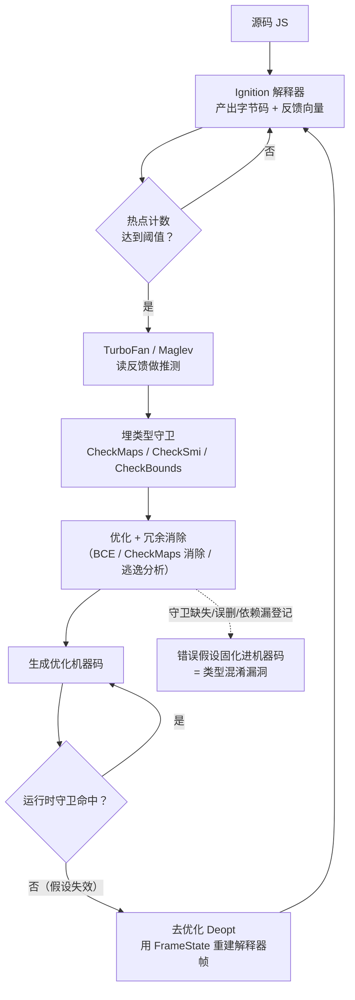
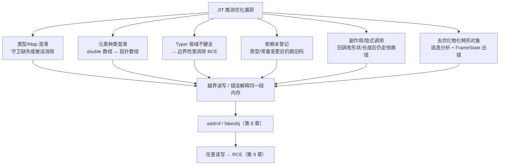
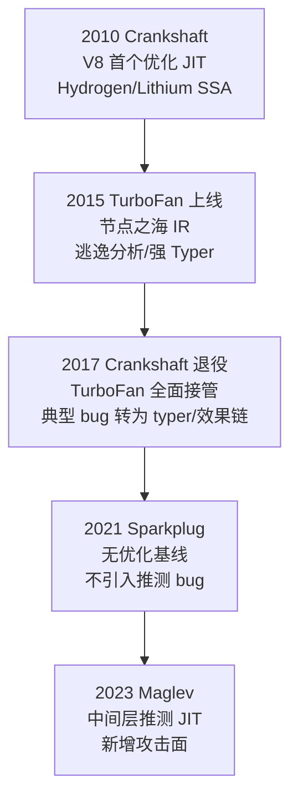

# 浏览器与JS引擎漏洞（6）· 类型混淆与JIT优化漏洞

> [!abstract] TL;DR
> - JIT 漏洞本质是**逻辑漏洞**：优化编译器在一个**错误假设**下生成了"看似正确"的机器码，内存破坏只是下游后果，而不是传统意义上的缓冲区溢出——这决定了它极难被通用内存缓解措施拦住。
> - 推测优化以解释器的**反馈向量**为输入做类型/对象形状猜测，再用 `CheckMaps`/`CheckSmi`/`CheckBounds` 等**守卫**兜底；守卫**缺失、被冗余消除误删、或依赖未登记**，就地变成类型混淆。
> - Typer（类型推断）计算出的值域必须是**可靠的过近似**；一条不健全的推断规则（漏掉 `-0`/`NaN`、范围算术溢出、`String.length` 上界错配）就能让**边界检查消除 BCE** 抹掉一个本必需的检查 → 稳定越界读写。
> - **元素种类混淆**（`double` 数组 ↔ 指针数组）让可控浮点位模式被当指针解引用、对象指针被当浮点数读出，直接喂给第 8 章的 `addrof`/`fakeobj` 原语。
> - 去优化（eager/lazy/soft）与**逃逸对象物化**本身也是攻击面；Sparkplug/Maglev 分层引入新的中间优化层，也带来新的 bug 面。
> - 缓解走 **V8 沙箱 + CFI + JIT 加固**（第 13 章）；高危场景可用 `--jitless`/关闭优化器，以性能换取整块推测攻击面的收缩。

## 概述与定位

本篇在系列中承上启下。前面第 3 章讲了 V8 从解析、字节码到 JIT 的整条流水线，第 4 章讲了对象模型里的 `Map`（隐藏类）与元素种类，第 5 章把 JS 引擎漏洞做了分类总览。本章聚焦其中回报率最高、也是近十年浏览器 `Pwn2Own` 与在野 0day 主战场的一类：**类型混淆（type confusion）与 JIT 优化漏洞**。它的下游——如何把一次越界/伪造对象升级为 `addrof`/`fakeobj`、再到任意读写与 RCE——留给第 7、8、9 章。因此本章的边界很清晰：**只讲"漏洞如何在优化器里被制造出来"，即错误假设是怎么进入编译结果的**；不展开利用链的后半程。

要抓住这类漏洞的本质，先要理解一个反直觉的事实：**JIT 漏洞几乎都不是"写代码写错了缓冲区大小"这种内存 bug，而是"编译器的推理错了"这种逻辑 bug**。优化编译器为了让动态类型的 JavaScript 跑得像静态语言一样快，会对"这个变量一定是小整数""这个对象一定是这个形状""这个下标一定在数组长度内"做出**假设**，并据此删掉冗余的类型判断和边界检查、把属性访问编译成裸偏移读写。只要有一个假设在某种精心构造的输入下被打破、而编译器又没能察觉，生成的机器码就会拿着错误的类型视角去读写内存——攻击者由此获得的往往不是一次随机崩溃，而是**语义清晰、可精确控制、可反复触发**的越界或类型混淆原语。这也是为什么 JIT bug 的利用通常异常稳定：它不依赖堆布局的运气，而是编译器"确定性地"帮你算错了地址。

定位上，本章覆盖三条主线，对应任务给定的种子要点：**推测优化**（编译器为什么、以及基于什么去猜类型）、**去优化**（猜错了如何安全回退，以及回退机制本身的坑）、**边界消除缺陷**（值域推断不健全如何让边界检查被错误删除）。三者合起来构成"推测—守卫—去优化"这一闭环，而漏洞正是这个闭环上任一环节失效的产物。

## 原理与机制

### 为什么必须推测：动态类型的性能税

JavaScript 是动态类型语言，`a + b` 在语言层面可能是整数相加、浮点相加、字符串拼接，甚至触发 `valueOf`/`toString` 回调。若老实按语义编译，每个运算点都要先做一大坨类型分派，热点循环会被这些分支和间接调用拖垮。历史上 Self 语言与 Hölzle、Ungar 的**多态内联缓存（PIC）** 与**自适应优化**给出了答案：既然实测中绝大多数运算点是**单态**的（只见过一种类型），那就**赌它保持单态**——按观测到的类型编译一条极快的直路，前面加一个廉价的守卫；一旦守卫失败就退回慢路。这样就同时拿到了静态类型的速度和动态类型的灵活，代价是"守卫必须永远正确"。V8、JavaScriptCore、SpiderMonkey 走的都是这条路。

### 推测的输入：反馈向量与内联缓存

推测不是凭空猜，而是读**运行期证据**。Ignition 解释器执行带反馈槽的字节码（如属性加载）时，内联缓存（IC）会把见过的 `Map` 记进反馈向量，状态在 `未初始化 → 单态 → 多态 → 巨态` 之间迁移。当函数变热、进入 TurboFan/Maglev，优化器**读取这份反馈**来决定推测什么：若某加载点一直是某个 `Map`，就假设它永远是这个 `Map`，把属性读编译成"直接按偏移取字段"，并在前面插一个 `CheckMaps`。反馈的类型（`Map`、元素种类、是否见过 `undefined`/`hole`、调用目标等）直接决定了生成代码里埋了哪些假设——**反馈是推测的燃料，也是错误假设的源头**。

### 守卫与去优化：安全网怎么织

推测的兜底是**守卫 + 去优化**。常见守卫有 `CheckMaps`（形状对不对）、`CheckSmi`/`CheckNumber`（是不是小整数/数字）、`CheckBounds`（下标越界没）、`CheckHeapObject`（是不是堆对象而非 Smi）等。守卫命中就继续跑快路；守卫失败就**去优化（deoptimize）**——丢弃或跳出优化码，用编译期记录的元数据把当前优化帧"翻译"回解释器帧，回到 Ignition 继续执行。去优化分三种：

- **急切去优化（eager）**：守卫在运行时当场失败，立即跳去优化处理器。
- **惰性去优化（lazy）**：某个被假设不变的东西被改了（如原型被替换、某函数被重定义），所有依赖该假设的优化码需失效；不当场炸，而是等执行流回到受影响的帧时再退。
- **软去优化（soft）**：为了收集更多反馈而主动退，不立刻丢码。

这里已经能看出三类漏洞的雏形：**守卫本该在却没在**（缺失）、**守卫在但被后续优化当成冗余删了**（误消除）、**该登记的"假设变更→去优化"依赖没登记**（旧码继续跑在过期假设上）。

### 类型混淆的五个入口

把上面串起来，JIT 层面制造类型混淆有五条典型路径，后文深度板块逐一展开：

1. **类型/`Map` 混淆**：`CheckMaps` 缺失或被冗余消除，对象被按错误形状读写。
2. **元素种类混淆**：`double` 数组与指针数组的后备存储表示不同，混淆读写即得 `addrof`/`fakeobj`。
3. **Typer 值域错误 → BCE**：类型推断给出了过窄（不健全）的值域，`CheckBounds` 被据此错误删除。
4. **依赖未登记**：优化时做了"原型无元素""字段是常量"等假设却没登记依赖，假设被破坏后仍跑旧码。
5. **副作用/隐式调用**：编译器认定某操作无副作用，但攻击者用带 `valueOf`/getter 的对象在其间触发回调改了形状/长度，快路径继续按旧视角执行。



## 推测优化失效链路详解：Typer、边界消除与去优化

这一段把"错误假设怎么进机器码"拆到指令与算法级别。以 V8 的 TurboFan 为主线（它是"节点之海/sea-of-nodes"IR），并横向对比 JavaScriptCore 的 DFG/FTL 与 SpiderMonkey 的 Ion/Warp。

### TurboFan 流水线与"效果链"

TurboFan 的图里每个节点有三类输入边：**值输入**（数据）、**效果输入**（`effect`，给有副作用的操作排序）、**控制输入**（`control`，管分支/循环）。流水线大致是：由字节码加反馈**建图** → **Typer** 给每个节点标类型（含数值范围）→ **类型化下降（typed lowering）** 把泛化操作替换成专用操作 → **加载消除/逃逸分析** → **简化下降与表示选择（simplified lowering / representation selection）**（在这里决定用 tagged 还是裸整数/浮点表示，`CheckBounds` 的最终存废也常在此定）→ **调度与代码生成**。

**效果链是很多漏洞的枢纽**。假设 `CheckMaps(o)` 之后有一次属性读 `o.x`，TurboFan 已知 `o` 的 `Map`，就把读编译成裸偏移取字段。如果这两者之间夹了一个"可能改 `o` 形状"的操作（比如一次可能触发 getter 的调用、或一次可能引发 `Map` 迁移的存储），只有当这个操作被正确挂在**效果链**上、并被标注为"可能写堆（`kNoWrite` 为假）"时，冗余消除才知道"这里不能把 `CheckMaps` 当成对后面仍然有效"。**一旦某内建被错误标注为无副作用（`kNoWrite`/`kEliminatable`），效果排序就断了，冗余消除会跨过它删掉本必需的重检查**——这正是 CVE-2020-6418 一类 TurboFan side-effect 混淆的根。

### Typer 与边界检查消除（BCE）：一条不健全规则毁掉全局

`CheckBounds(index, length)` 保证 `0 ≤ index < length`。TurboFan 的 Typer 给 `index` 算一个类型（对数值就是一个范围 `[min, max]`）。若能证明 `Type(index) ⊆ [0, length)`，简化下降阶段就把 `CheckBounds` **降为无操作**或直接把 `index` 重标成"已知在界内"，随后按裸偏移访问后备存储。

关键在于**健全性（soundness）**：Typer 的类型必须是运行期取值集合的**过近似（superset）**。BCE 安全的前提是范围推断永远"只多不少"。**只要有一条规则算出了过窄的范围（欠近似，unsound），那次被删的检查其实是需要的**——攻击者构造出落在真实取值、但被 Typer 误判为界内的下标，就得到越界。历史上不健全的范围来源包括：

- 忘记 `-0`：`Math.expm1(-0) === -0`，但曾经 Typer 把 `Math.expm1` 的输出类型标成"不含 `-0` 的普通数"。于是 `Object.is(Math.expm1(x), -0)` 被折叠成"恒为假"，一个"不可能进入"的分支被优化删除；而运行时该分支其实会进入，从而推翻后续所有基于"没进这个分支"的推断，最终把一个 `CheckBounds` 变得可删。这就是著名的"`-0` typer 家族"。
- 范围算术溢出：两个范围相加/相乘时，内部表示自身溢出，得出比真实小的上界。
- 上界错配：`String.length`/`arguments.length` 的真实上界是 `2^30 - 1`，若某处按 `kMaxInt`（`2^31-1`）或反之处理，边界推断就错位。
- 归纳变量分析出错：循环里递增/递减的归纳变量，其范围由专门分析给出；一旦推错，循环内的数组访问集体失去正确的边界依据。

一句话：**BCE 漏洞几乎都是"Typer 撒了一个善意的谎"**——它以为自己在收窄一个安全的范围，其实抹掉了一个必要的检查。V8 后来加了 Typer 自校验类思路、并对"可信长度"做更保守的重新推导来加固。

### 元素种类混淆：从越界到 addrof/fakeobj 的桥

第 4 章讲过，V8 数组按内容有不同的**元素种类**，且只能沿格单向"变泛"、不可回退：

```
元素种类格（只能单向变泛，不可回退）：

  PACKED_SMI  ──►  PACKED_DOUBLE  ──►  PACKED_ELEMENTS(指针)
      │                 │                     │
      ▼                 ▼                     ▼
  HOLEY_SMI   ──►  HOLEY_DOUBLE   ──►  HOLEY_ELEMENTS(指针) ──► DICTIONARY
```

不同种类的**后备存储表示不同**，这正是混淆能拿到强原语的物理原因：

```
PACKED_DOUBLE_ELEMENTS 的后备存储（FixedDoubleArray）：
  [ map | length | d0(8B) | d1(8B) | d2(8B) | ... ]   // 每槽 = 裸 IEEE-754 double

PACKED_ELEMENTS 的后备存储（FixedArray）：
  [ map | length | p0(tagged) | p1(tagged) | ... ]    // 每槽 = 带标签指针
```

若某 JIT bug 让你**把 `double` 数组当指针数组读**：一个对象指针会被当作 IEEE-754 位模式读成浮点数 → 你就"读出了对象地址"，这是 `addrof`。反过来，若能**把指针数组当 `double` 数组写**：你写入的可控浮点位模式会被当作带标签指针存进去，之后被当对象解引用 → 这是 `fakeobj`（伪造对象）。因此**元素种类混淆是 JIT 越界通往任意读写的标准接口**，具体构造见第 8 章。这里要强调的机制点是：混淆之所以致命，不是"越了几个字节的界"，而是"同一段内存被赋予了两种不兼容的解释"——指针 vs 浮点。

### CheckMaps 消除与隐式调用：回调把地毯从脚下抽走

第二类高频入口是"守卫在、但被绕过"。快路径常缓存"数组长度""对象形状"这类不变量。经典模式：`Array.prototype.map/filter/forEach` 等把 `length` 或元素种类**在调用回调前读一次并缓存**，回调里攻击者却把数组 `length` 改小、或触发元素种类/`Map` 迁移（如往里塞一个对象把 `double` 数组变成指针数组，或把快数组变成字典模式）。若快路径回调返回后仍拿旧的长度/旧的种类去访问后备存储，就越界或错解释。SpiderMonkey/ChakraCore 里对应的是**隐式调用（implicit call）** bug 类：JIT 认为某操作纯粹无副作用，但传入一个带 `valueOf`/`toString`/getter 的对象，会在"不该执行用户代码"的地方执行用户代码，趁机改状态。防御端的对策是这些操作要么禁止隐式调用、要么在回调后**重新检查**长度与种类——少一次重检查就是一个洞。

### 依赖未登记：旧码跑在过期世界上

TurboFan 优化时会对"当前世界"做很多假设并向 `CompilationDependencies` **登记依赖**：如"这个 `Map` 稳定（stable）""这个原型链上没有索引元素，所以数组迭代可走极速路径""这个字段是常量值""这个函数是某个具体的可内联目标"。一旦假设被破坏（改原型、给原型加下标属性、改常量字段），依赖机制会**惰性去优化**掉相关代码。漏洞出在两处：**该登记依赖却漏登记**（假设被破坏后没人通知，旧码继续跑，直接类型混淆）；或**依赖登记到了错误的对象上**（张冠李戴，改了 A 却只让依赖 B 的码失效）。"原型无元素"这个假设的漏登记，历史上多次被用来让极速数组迭代读出本不该存在的洞或越界。

### 去优化本身的坑：逃逸对象物化

去优化不是"简单跳回去"。逃逸分析可以证明某对象不逃逸，从而**不真的分配它**（标量替换，scalar replacement）。可一旦发生去优化，解释器却指望这个对象存在，于是 Deoptimizer 要按 `FrameState`/`ObjectState` 里记录的字段值**当场物化（materialize）**出这个对象。如果记录的形状不对（错的 `Map`、错的字段数、错的元素种类），物化出来的就是个畸形对象，去优化之后立刻类型混淆。`arguments` 对象、`rest` 参数、被逃逸分析拆解的字面量对象，都出现过物化相关 bug。这提醒我们：**去优化是安全网，但网本身也是复杂代码，也是攻击面**。



### 分层 JIT 与横向对比

V8 的执行分层近年从"Ignition → TurboFan"两级演进为多级：**Ignition（解释器）→ Sparkplug（无优化基线编译器，只求快速产出机器码、不做推测）→ Maglev（2023 引入的中间层优化 JIT，SSA 而非节点之海，做较轻量的推测）→ TurboFan（顶级优化）**，热循环还可通过 **OSR（栈上替换）** 直接从循环中途切进优化码。Sparkplug 不推测，基本不产生本章这类 bug；**Maglev 的加入意味着又多了一个会做类型推测、却比 TurboFan 年轻、审计更少的攻击面**——新层往往就是新 bug 面。

横向看：**JavaScriptCore（WebKit）** 用 DFG 与 FTL（后端为 B3），去优化叫 **OSR exit**，隐藏类叫 **Structure**，"Structure 混淆"是其经典问题。**SpiderMonkey（Firefox）** 的优化 JIT 是 IonMonkey，前端从旧的 Type Inference 换成了基于 CacheIR 的 **Warp**，隐藏类叫 **Shape**。三家机制同构：反馈驱动推测、守卫兜底、去优化回退，因此**本章的思维模型跨引擎通用**，差异只在术语与实现细节。也正因如此，一种 bug 模式（如 `-0` typer、隐式调用、`length` 缓存越界）常在多引擎重复出现。

### 历史演进（用箭头表达时间线）



一句史观：**Crankshaft 时代 bug 多在边界消除与类型反馈的直接误用；TurboFan 时代 bug 上移到 Typer 健全性、效果链标注、依赖登记这些"编译器推理正确性"层面**，更隐蔽、也更强大。

## 工具视角与实战

理解机制之后，落到"如何在自有环境里观察与复现"。核心工具是 V8 的 `d8` 壳与它的调试内建。

**必备开关**：`--allow-natives-syntax` 打开 `%` 前缀的内建（下面几个是主力）；`--trace-opt`/`--trace-deopt` 打印优化与去优化事件及原因；`--trace-turbo` 把 TurboFan 各阶段的图导出给 **Turbolizer**（官方的节点之海可视化 web 工具）逐相查看；`--print-opt-code` 打印生成的机器码；`--jitless` 则彻底关掉 JIT。

**关键内建**：`%PrepareFunctionForOptimization(f)`（现代 V8 里，强制优化前需先"备优化"）、`%OptimizeFunctionOnNextCall(f)`（下次调用即编译优化）、`%DebugPrint(obj)`（打印对象的 `Map` 地址、元素种类、属性/元素后备存储——确认元素种类混淆的最直接手段）、`%GetOptimizationStatus(f)`、`%CollectGarbage()`、`%SystemBreak()`。

**标准复现配方**：预热→备优化→触发。逻辑上就是"先让反馈向量收集到期望的类型，再强制优化，最后喂进触发值"：

```js
// 仅用于自有环境 / d8 靶场的原理演示，非武器化利用
function f(a, i) { return a[i]; }        // 一个会被 BCE 影响的访问点
%PrepareFunctionForOptimization(f);
let arr = [1.1, 2.2, 3.3];               // PACKED_DOUBLE_ELEMENTS
f(arr, 0); f(arr, 1);                    // 预热：喂正常下标，攒反馈
%OptimizeFunctionOnNextCall(f);
f(arr, 0);                               // 触发优化编译
%DebugPrint(arr);                        // 确认元素种类与后备存储
```

运行：`d8 --allow-natives-syntax --trace-opt --trace-deopt poc.js`。`%DebugPrint` 的输出大致长这样，据此可确认"这真是个裸 double 后备存储"：

```
DebugPrint: 0x...: [JSArray]
 - map: 0x...  [FastProperties]
 - elements: 0x...  [PACKED_DOUBLE_ELEMENTS]
 - length: 3
 0x... [PACKED_DOUBLE_ELEMENTS] {
   0: 1.1
   1: 2.2
   2: 3.3
 }
```

**分析真实 typer/BCE bug 的姿势**：把 `--trace-turbo` 导出的图丢进 Turbolizer，在 `SimplifiedLowering`/`LoadElimination` 等相位前后对比，看那个 `CheckBounds` 节点是在哪一相被删掉的、`index` 在哪被 Typer 标成了过窄的范围——**"检查在哪一相消失"往往就是 bug 的现场**。`--trace-deopt` 的输出会带去优化原因（`wrong map`、`Insufficient type feedback`、`out of bounds` 等），是判断"守卫是否如预期触发"的照妖镜；如果一个你以为会去优化的点**没有**去优化，多半就是守卫被误删了。

**挖掘与研究视角**。这类 bug 是**覆盖引导模糊测试**的重灾区：Fuzzilli 用中间语言 FuzzIL 生成"语义大体合法"的 JS，配合覆盖反馈去撞 V8/JSC/SpiderMonkey 的众多优化相位，历史战绩惊人（呼应 [[49.Fuzzing与漏洞挖掘/15.浏览器与JS引擎Fuzzing]]）。**差分测试**尤其对口 JIT 正确性：同一段代码在"纯解释执行"与"强制优化后"应产生**相同结果**，一旦不一致，往往就是优化器算错了——这类"解释器与 JIT 不一致"的 correctness bug 极大概率就是可利用的安全 bug。对逆向/复现方向，另一条路是 **n-day 补丁比对**：读 V8 仓库的 `regress-*.js` 回归用例与提交，能反推出被修 bug 的触发形状；把优化器前置知识（推测、Typer、效果链）当作阅读补丁的字典，见 [[41.Compiler|编译器与 JIT 优化]]。

**一个术语澄清（避免混淆）**：本章的"推测优化"指的是 **JIT/软件层的类型推测**；它和 CPU 的**硬件推测执行**（Spectre）是两码事。Spectre v1 让 CPU 在边界检查解析完成前就"抢跑"越界访问、经缓存侧信道泄露——V8 为此在 JIT 里加了**下标掩码（index masking / poisoning）** 等缓解。二者都叫"speculation"，但机理不同：一个是编译器对类型的猜测，一个是流水线对分支的抢跑。别把两者的缓解混为一谈。

## 安全性与正确使用

> [!caution] 合规边界（务必先读）
> 本文所有原理、`d8` 内建用法与复现配方，**仅供在你自有或获得明确书面授权的环境、CTF 靶场与安全研究中使用**，且**一律以防御与教育为目的**。文中不提供、也不要向任何**真实生产系统、他人系统或未授权目标**实施利用的成品配方，不为**绕过商业授权/DRM**提供武器化步骤。演示止步于在本地靶场触发越界或崩溃这一"原理可见"层面；把它升级为完整利用链、或指向真实目标，均超出本文用途且可能违法。发现真实漏洞请走**负责任披露**（厂商/官方安全通道），不要公开可直接打击在野目标的 exploit。

从防御视角，这类漏洞难缠正是因为它是逻辑 bug：传统的栈金丝雀、ASLR、DEP 对"编译器算错地址"几乎无感（ASLR 绕过本身还有专门讨论，见 [[33.二进制漏洞与利用基础/15.ASLR与PIE绕过技术]]）。真正对口的缓解是把**破坏面**关小、把**利用面**加固，主要有几层：

- **V8 沙箱（heap sandbox）**：把 V8 堆放进一块受限区域，对象间用**受限指针/偏移**而非裸机器指针互引，外部指针走**外部指针表**间接化。这样即便拿到堆内越界读写，也难以直接伪造出指向任意进程地址的裸指针——把"堆内任意读写"与"进程任意读写"之间硬生生插了一道墙。细节见第 13 章 [[13.浏览器漏洞缓解：V8沙箱与CFI]] 与本系列后续。
- **CFI（控制流完整性）**：前向边用 Intel CET/ARM PAC 等约束间接调用/跳转目标，压制"劫持到任意 gadget"。
- **JIT 代码区加固**：`W^X`（写与执行互斥）、macOS 上的 `MAP_JIT`/APRR、代码区写保护，抬高"直接改写 JIT 出的机器码"的门槛；配合常量致盲对抗 JIT 喷射。
- **渲染器沙箱 + 站点隔离**：即便 JS 引擎被攻破，还要再过一道进程沙箱与站点隔离，才谈得上拿到用户数据或系统权限，见 [[02.多进程与沙箱模型]]、[[12.沙箱逃逸原理]]。

对**高危个人/企业**，还有一个"钝但有效"的旋钮：**关闭优化 JIT**。`d8 --jitless`、Chrome 的"禁用 V8 优化器"实验/企业策略（`DefaultJavaScriptJitSetting` 一类）、Edge 曾经的"超级安全模式（Super Duper Secure Mode）"，本质都是**把整块推测攻击面直接切掉**——没有 TurboFan/Maglev 的推测，就没有本章这一整类 bug。代价是失去 JIT 带来的性能，适合威胁模型高、性能不敏感的场景权衡使用。

对**引擎开发者**，防线在源头：把"Typer 不得有不健全规则"当铁律，为数值范围推断做**自校验**；对每一个内建**精确标注副作用**（`kNoWrite` 用错就是效果链断裂）；对每一处优化假设**确保登记了对应依赖**；把**差分模糊测试**（解释 vs 优化结果一致性）纳入常态 CI，把"解释器与 JIT 不一致"一律当安全 bug 对待。这些工程纪律，才是让"推测—守卫—去优化"闭环真正闭合的东西。

## 小结

本章把"类型混淆与 JIT 优化漏洞"拆成了一个闭环来看：**推测优化**为了消除动态类型的性能税，基于反馈向量对类型、形状、下标做假设，并把假设固化成删检查、裸偏移的快路径；**守卫 + 去优化**是这套赌局的安全网。漏洞就诞生在闭环失效处——守卫缺失、被冗余消除误删、依赖漏登记、内建副作用误标、Typer 值域不健全导致**边界检查消除（BCE）** 抹掉必要检查、乃至**去优化物化**出畸形对象。它们的共同本质是**逻辑 bug**：编译器在错误假设下生成了看似正确的机器码，越界与类型混淆只是下游后果，因而稳定、可控、难被通用内存缓解拦截。其中**元素种类混淆**（`double` 数组 ↔ 指针数组）是通往强原语的标准接口，把可控浮点当指针、把指针当浮点，直接对接第 8 章的 `addrof`/`fakeobj`。跨引擎（V8/JSC/SpiderMonkey）机制同构，分层 JIT（Sparkplug/Maglev）的演进则不断带来新攻击面。缓解落在 V8 沙箱、CFI、JIT 加固与"必要时关优化器"，而根治仍要靠引擎侧的健全性纪律与差分模糊测试。下一章进入 `TheHole` 与 OOB 原语构造，把本章制造出的越界，锻造成可复用的读写原语。

## 相关阅读

- 上一章：[[05.JavaScript引擎漏洞类型|← JavaScript 引擎漏洞类型]]——本章是其中"类型混淆/JIT"分支的深挖。
- 下一章：[[07.TheHole与OOB原语构造|→ TheHole 与 OOB 原语构造]]——把本章的越界/混淆锻造成稳定读写原语。
- 前置对象模型：[[04.V8对象模型：Map与隐藏类]]、流水线：[[03.V8架构：解析到字节码到JIT]]。
- 原语承接：[[08.addrof与fakeobj原语]]、[[09.从任意读写到RCE]]。
- 编译器/JIT 前置：[[41.Compiler|编译器与 JIT 优化]]（推测优化引入的漏洞视角）。
- 挖掘呼应：[[49.Fuzzing与漏洞挖掘/15.浏览器与JS引擎Fuzzing]]（Fuzzilli 与差分测试）。
- 利用与绕过：[[33.二进制漏洞与利用基础/15.ASLR与PIE绕过技术]]。
- 缓解：[[13.浏览器漏洞缓解：V8沙箱与CFI]]、[[02.多进程与沙箱模型]]、[[12.沙箱逃逸原理]]。
- WASM 视角：[[40.WASM与虚拟化壳逆向/06.WASM内存模型与线性内存安全]]。
- 官方/权威参考：V8 开发者博客与设计文档（TurboFan、Sparkplug、Maglev、V8 Sandbox 系列）、Turbolizer 使用文档、V8 源码中的 `test/mjsunit/regress` 回归用例；Phrack "Attacking JavaScript Engines"（Saelo）；Google Project Zero 关于 V8/JSC 的历次分析。

[[00.浏览器与JS引擎漏洞总览|⬆ 系列总览]] | [[05.JavaScript引擎漏洞类型|← 上一章]] | [[07.TheHole与OOB原语构造|→ 下一章]]
