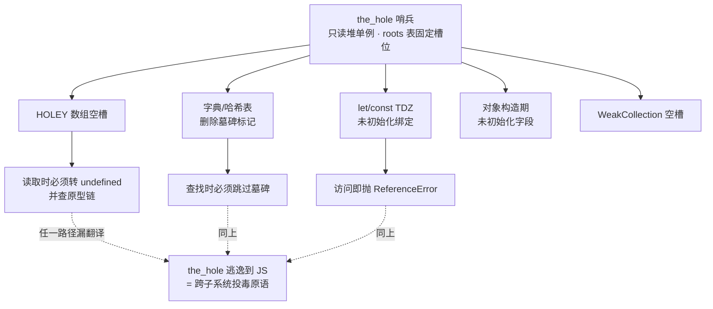
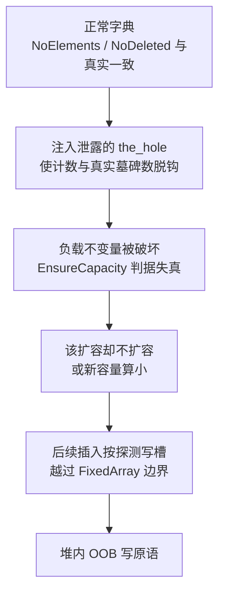
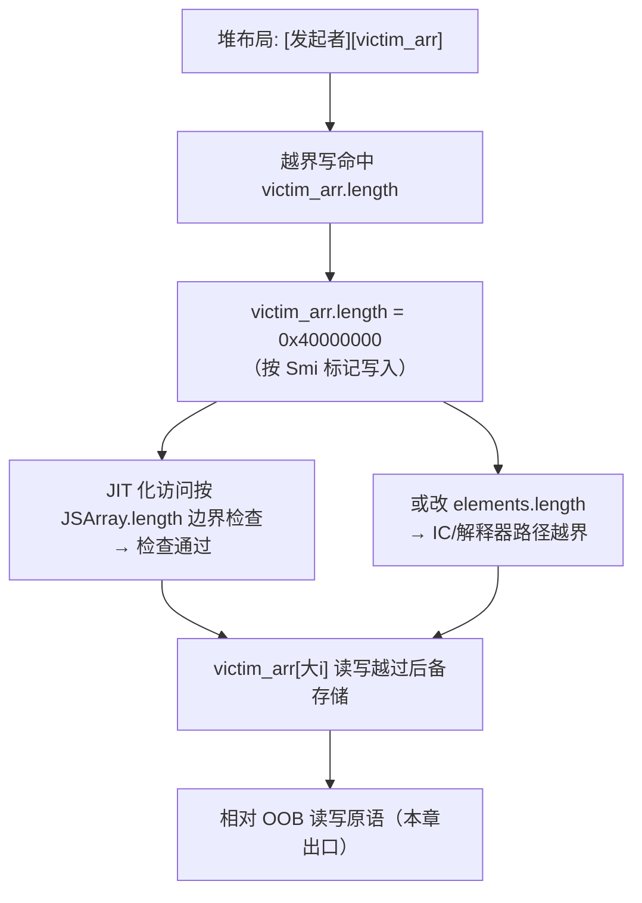

# 浏览器与JS引擎漏洞（7）· TheHole与OOB原语构造
> [!abstract] TL;DR
> - `the_hole` 是 V8 内部的哨兵单例：HOLEY 数组空槽、字典的删除位、`let`/`const` 的 TDZ 未初始化绑定都靠它标记，它**绝不允许被 JS 观察到**；一旦泄露即可跨子系统"投毒"，把一个逻辑漏洞放大成堆破坏。
> - OOB（越界读写）原语的本质是**长度失配**：JSArray 的 `length` 与 `elements` 后备存储的容量是两个独立字段，谁被写坏、在哪条代码路径上被信任，决定了越界发生在解释器 IC 还是 JIT 代码里。
> - 关键分水岭：TurboFan 对 JSArray 元素访问的边界检查绑定 `JSArray::length`，而 IC/解释器快路径绑定 `elements->length`——这条差异直接决定你该破坏哪个字段、从哪条路径触发。
> - `FixedDoubleArray` 的未装箱 8 字节槽是最佳 OOB 工具：能承载任意 64 位位型，又能把相邻对象数组里的压缩指针当 double 读出来，是通往 addrof/fakeobj 的天然桥梁。
> - CVE-2021-38003 是 `the_hole` 泄露的教科书案例（野外在用）；V8 随后把单一 `the_hole` 拆成多种 `Hole` 实例（`hash_table_hole` 等）做隔离硬化，正面削弱了这类"一次泄露、处处可用"的原语。

## 概述与定位

在利用链的语汇里，"原语（primitive）"指一段可被稳定重复调用、语义明确的能力单元。一个刚被触发的内存漏洞往往只是一次性的、脆弱的、副作用不可控的"错误现象"；把它打磨成"我随时能越界读第 N 个 8 字节"或"我能把某对象地址当数字读出来"这种稳定能力，才叫构造出了原语。**本章正处在利用链的"承上启下"位置**：上一章（第 6 章）讲的是漏洞的来源——类型混淆与 JIT 推测优化如何产出一次内存写/读的错位；下一章（第 8 章）讲的是 addrof/fakeobj 这两个把"内存能力"翻译成"对象能力"的高级原语；再下一章（第 9 章）把它们抬升为任意地址读写乃至代码执行。本章要回答的，是中间那段最关键的工程问题：**拿到一次错位之后，如何把它稳定成 OOB 读写原语；以及一个看似无害的内部哨兵值 `the_hole`，为什么一旦泄露就等价于半个 OOB。**

因此本章有两条主线，它们最终会汇合到同一个"相对越界读写"的出口：

- **哨兵泄露线**：`the_hole` 是 V8 用来在内部表达"这里没有值/这里被删了/这里还没初始化"的特殊单例对象。整套引擎的正确性都建立在一个隐含契约上——**JS 代码永远拿不到它**。任何让 `the_hole` 逃逸到脚本可见层的 bug，都能被用来欺骗那些"用 `== the_hole` 判空"的内部快路径，进而把哈希表、字典、数组的长度/计数不变量搅乱，落地为堆内越界。
- **长度破坏线**：数组的"逻辑长度"和"后备存储容量"是分开存放的两个字段，且引擎在不同路径上信任的是不同那个。只要能把其中一个改大，超出真实分配范围的索引访问就会通过边界检查，直接读写相邻堆对象——这就是最经典、最好用的 OOB。

把两条线并置来讲不是凑数：`the_hole` 泄露的典型收益，恰恰就是去破坏某个长度/容量字段（第一条线的产物喂给第二条线）；而 OOB 写一旦到手，又能反过来去伪造/篡改 `the_hole` 相关结构。理解它们的耦合，是理解现代 V8 利用"为什么长这样"的钥匙。

## 原理与机制

### 哨兵与 Oddball：V8 里那些"不是值的值"

V8 的堆里有一小撮特殊单例对象，历史上统称 **Oddball**：`undefined`、`null`、`true`、`false`，以及一批只对引擎内部可见的哨兵——`the_hole`、`uninitialized`、`arguments_marker`、`termination_exception`、`optimized_out` 等。它们都活在**只读堆（read-only heap）**里，是不可变、跨 Isolate 共享的单例，且在 **Isolate 的 roots 表**中占据固定槽位，可通过 `ReadOnlyRoots(isolate).the_hole_value()` 取得。"固定槽位"这一点在利用里很关键：一旦你有了任何一个 root 的地址，就能按已知偏移推算出其它 root，包括 `the_hole` 自身。

`the_hole`（源码常写作 `TheHole`/`the_hole_value`）承担的是"占位/否定"语义。它的核心用途至少有五处：

- **HOLEY 数组的空槽**。`[1, , 3]` 中间那个洞，在后备存储里就是一个 `the_hole` 元素（对象数组）或一个 hole NaN（double 数组）。
- **字典/哈希表的删除标记**。开放寻址哈希表删除条目时，槽位不能置空（会截断探测链），于是标记为 `the_hole` 表示"墓碑（tombstone）"。
- **`let`/`const` 的暂时性死区（TDZ）**。进入作用域时绑定被初始化为 `the_hole`，在声明语句真正执行前任何读取都会命中"是不是 hole"的检查并抛 `ReferenceError`——TDZ 不是语法魔法，就是一次 hole 比较。
- **对象构造过程中的未初始化字段**、`super` 调用前的 `this`、生成器的中间状态等。
- **`WeakMap`/`WeakSet` 等弱集合的空槽**。

所有这些用途共享同一条铁律：**读到 `the_hole` 的地方必须就地把它翻译成外部语义**——数组读洞返回 `undefined`（并沿原型链查找），字典查找跳过墓碑，TDZ 访问抛异常。**只要有任何一条内部快路径忘了做这层翻译、或在错误的前提下跳过了它，`the_hole` 这个裸对象就漏进了 JS。** 而 JS 层没有任何合法方式产生它，于是"我手里有个 `the_hole`"本身就是一个能力：我能把它塞进任何一个用 `== the_hole` 做语义判断的引擎内部结构里，制造与设计者假设相悖的状态。



### 数组对象模型：两个 length 的故事

要讲 OOB，必须先把 V8 的数组内存模型摆清楚。一个 `JSArray` 对象本体很小，它**不直接存放元素**，而是持有一个指向独立后备存储（`elements`）的指针。在开启**指针压缩**（V8 自 2020 年前后、Chrome 80+ 默认开启）的构建里，堆内每个标记字段被压缩成 4 字节（一个相对 4GB "cage" 基址的 32 位偏移）：

```
JSArray 本体（指针压缩，每字段 4 字节）:
  +0x00  Map              指向 map（隐藏类）
  +0x04  properties       命名属性后备（通常是 empty_fixed_array）
  +0x08  elements   ────► 指向 FixedArray / FixedDoubleArray
  +0x0c  length           Smi，"逻辑长度"（与 elements 容量相互独立！）

FixedDoubleArray（double 数组的 elements 后备）:
  +0x00  Map              fixed_double_array_map
  +0x04  length           Smi，后备存储的"真实容量"
  +0x08  element[0]       8 字节裸 double（未装箱）
  +0x10  element[1]       8 字节裸 double
  ...
  空槽以 hole NaN = 0xFFF7FFFFFFFFFFFF 表示
```

注意这里有**两个独立的 length**：`JSArray::length`（逻辑长度）与 `elements->length`（后备存储容量）。它们为什么要分开？因为 `push` 会摊还式地**超额分配**后备存储——你 `push` 一个元素，容量可能一次涨到 1.5 倍，于是"容量 > 逻辑长度"是常态。这个设计上的必要冗余，正是 OOB 的温床：**破坏哪个 length、从哪条路径触发，结果截然不同。**

- **IC / 解释器快路径**（`KeyedLoadIC`、`ElementsAccessor`）访问 `arr[i]` 时，边界基准是 `elements->GetCapacity()`，即 `elements->length`。所以若你能改写**后备存储的 length**，裸的 `arr[i]` 就能越界。
- **TurboFan JIT** 为 `JSArray` 生成的元素访问，通常把边界基准取成 `LoadField[JSArray::length]` 再 `CheckBounds`——因为容量可能大于逻辑长度，只有按逻辑长度检查才对用户语义正确。所以若你在 JIT 化的函数里，把 **JSArray 本体的 length** 改大，`arr[bigIndex]` 就能越界。

这条"两个 length、两条路径"的分野，是本章最该记牢的机制，也是无数 CTF V8 题的题眼。

### 元素种类（Elements Kinds）与 hole 的两种表示

V8 为数组元素维护一套"种类"格子（lattice），常见有 `PACKED_SMI` → `PACKED_DOUBLE` → `PACKED`（对象），以及各自的 `HOLEY_*` 变体；种类只能沿格子**单向泛化**，不能回退。这套设计是为性能：`PACKED_SMI` 数组的元素保证是小整数、连续无洞，可以走最激进的无 hole 检查快路径。

对本章至关重要的是 **hole 的两种物理表示**：

- **对象/Smi 数组（`FixedArray` 后备）**：洞就是一个真正的 `the_hole` 指针。读 HOLEY 数组时，引擎加载该槽、比较 `value == the_hole`，命中则返回 `undefined` 并查原型链。
- **double 数组（`FixedDoubleArray` 后备）**：元素是未装箱的 8 字节裸 double，没有指针可比，于是洞用一个特殊位型 **hole NaN = `0xFFF7FFFFFFFFFFFF`**（`kHoleNanInt64`）表示。读 HOLEY double 数组时比较的是这个位型。

这带来一个漂亮又危险的性质：`FixedDoubleArray` 的槽能承载**任意 64 位位型**。如果你的 OOB 读落在一个 double 数组上、越界读到了相邻**对象数组**的元素区，那些区域里存的是 4 字节压缩指针——它们会被当作 double 的低/高 32 位一并读出，**一次 double 读就泄露两个压缩指针**。反过来，OOB 写一个精心构造的 double，就能覆盖相邻对象的指针字段。这正是从 OOB 走向 addrof/fakeobj（第 8 章）的物理基础。

一个必须知道的陷阱：V8 在把用户 double 写入 `FixedDoubleArray` 的路径上会做 **NaN 规范化**，凡是与 hole NaN 同位型的写入会被改写成一个标准 quiet NaN，**阻止你用普通赋值"伪造"出一个空槽**。所以想直接用 `arr[i] = i2f(0xFFF7FFFFFFFFFFFF)` 制造受控 hole 通常不成立，得另辟蹊径。

## 从哨兵泄露到 OOB 原语的构造详解

这一段把两条主线拧成一股，逐步展开"泄露 → 破坏不变量 → 落地 OOB → 稳定化"的完整机理。为避免提供可直接复用的武器，下面所有代码都是**教学用的骨架示意**，刻意省略触发某个真实 0day 所需的精确条件；重点在讲清"为什么这样就能越界"。

### 阶段零：一个哨兵是如何漏出来的（机理，非配方）

`the_hole` 泄露的本质，是某条**假定输入必为"真实值"的快路径，实际收到了洞却没做翻译**。概念上的失误形态有几类：

- **PACKED 假设被违背**：某个内建函数的 fast path 假定数组是 PACKED（无洞），于是省略 hole 检查、直接把裸元素返回或搬运；但在特定构造下数组其实是 HOLEY，于是 `the_hole` 被原样交还给 JS。历史上多个 `Array.prototype` 方法（`concat`、`fill`、`includes` 与 `indexOf` 对洞的语义差异等）都出过这类问题。
- **解析器/序列化器的中间态泄露**：CVE-2021-38003 就出在 JSON 解析的快路径上，中间对象的某个槽还处于 `the_hole` 状态时被交给了脚本可见的回调/结果，`the_hole` 直接逃逸。
- **推测优化的错位**：JIT 假定某数组元素种类不变，实际被回调偷偷改成 HOLEY，去优化不及时，读出裸洞（与第 6 章的机理接壤）。

判定"是否真的拿到了 `the_hole`"有个经典土办法——它几乎在所有正常运算里都会抛异常或表现诡异，且 `%DebugPrint(x)` 会显示 `<the_hole>`。

### 阶段一：用 the_hole 破坏哈希表不变量（CVE-2021-38003 式）

拿到 `the_hole` 后最经典的放大手法，是去攻击**字典（开放寻址哈希表）**。V8 的 `NameDictionary`/`NumberDictionary` 用一个 `FixedArray` 存：一个头部（容量 capacity、元素数 `NumberOfElements`、删除数 `NumberOfDeletedElements`）后跟若干三元组 `(key, value, details)`。查找时从哈希桶开始线性探测：遇到目标 key 命中；遇到 `undefined`（空槽）判定"不存在"、停止；遇到 `the_hole`（墓碑）则**跳过并继续探测**。

它维护一条负载不变量：`NumberOfElements + NumberOfDeletedElements` 不得超过 `capacity` 的约 3/4，越线则 `EnsureCapacity` 触发扩容/重哈希。正常删除会**同时**把 key 改成墓碑、`NumberOfElements--`、`NumberOfDeletedElements++`，计数与真实状态严格同步。

攻击点在于：**如果你能绕过正常删除路径，直接把一个泄露的 `the_hole` 塞成某个槽的 key（或让计数与真实墓碑数脱钩）**，计数不变量就被破坏了。后果是 `EnsureCapacity` 的判断依据失真——它可能认为"还没到扩容阈值"而拒绝扩容，或把新容量算小；而后续插入仍按探测逻辑写入槽位，于是**写入点越过了这个 `FixedArray` 的真实边界**，落地为堆内 OOB 写。CVE-2021-38003 正是沿这条链，把一个 `the_hole` 泄露最终抬成了可控的越界写。



### 阶段二：把 OOB 写落地成"长度破坏"

无论上游是哈希表 OOB、JIT 边界消除、还是元素种类混淆，最通用的落地姿势都是**堆布局（heap grooming）+ 长度覆盖**：精心排布内存，让"可被越界写命中的位置"恰好落在**受害数组的 length 字段**上。

```
groom 后的相邻布局（示意）:
  [ 越界写发起者 ]  [ victim: JSArray, length=0x10 ]  ...
                     ^^^^^^^^^^^^^^^^^^^^^^^^^^^^
  一次 8/4 字节越界写命中 victim.length
  → 把 length 从 0x10 改成 0x40000000
```

改 length 时要遵守 **Smi 标记规则**（写进去的不是裸整数，是被标记的 Smi）：

```
64 位、无指针压缩:  Smi(v) = v << 32              低 32 位是 0（含 tag=0）
64 位、指针压缩:    Smi(v) = (v << 1) & 0xFFFFFFFF  最低位 tag=0
例：要把 length 设成 0x1000
   压缩模式  → 写 32 位值 0x2000
   非压缩模式 → 写 64 位值 0x0000_1000_0000_0000
```

覆盖完成后，`victim` 就成了一个"逻辑长度远超真实后备容量"的数组。此时回到"两个 length"的分野选择触发路径：



### 阶段三：把 OOB 打磨成稳定的相对读写原语

单纯"能越界"还不够稳。工程上通常再走一步**双数组（two-array）夹逼**，把一次性越界升级成可反复调用、可精确定位的相对读写：

1. 连续分配两个数组：一个 `FixedDoubleArray`（做"读写窗口"），紧邻一个"标记数组"或第二个受害数组。
2. 用初步越界把**读写窗口数组的 length** 改大，使其能覆盖到紧邻数组的头部（Map、elements、length）。
3. 之后所有操作都通过读写窗口数组完成：读窗口数组的越界槽 = 读相邻对象的字段；写越界槽 = 改相邻对象的字段。由于 `FixedDoubleArray` 槽是 8 字节裸位型，读出来直接是内存原值，写进去也不经过指针检查。

这样就得到了一个语义清晰、可脚本化的**相对读写原语**：`oob_read(i)`/`oob_write(i, v)`，索引以 8 字节为步长、相对读写窗口后备存储起点。它的两个即时收益直接通往下一章：

- 越界读相邻**对象数组**的元素区，把 4 字节压缩指针拼成 double 读出 → 这是 addrof 的雏形；
- 越界写相邻对象数组元素区的某个"看似 double 实为指针"的槽 → fakeobj 的雏形。

配套的位型转换是标准工具（用同一段内存做 double↔u64 视图）：

```js
const _buf = new ArrayBuffer(8);
const _f = new Float64Array(_buf);
const _u = new BigUint64Array(_buf);
const f2i = f => (_f[0] = f, _u[0]);   // double → 64位整数
const i2f = i => (_u[0] = i, _f[0]);   // 64位整数 → double
```

**边界与陷阱（务必内化）**：
- **GC 会移动对象**。分配窗口数组与触发越界之间，一次 minor GC 就可能打乱你精心 groom 的相邻关系；实战里要么控制分配节奏、要么用"读到已知标记值才算 groom 成功"的自校验来重试。
- **指针压缩把"相对 OOB"关进了 4GB cage**。好处是越界几乎总落在 V8 堆内、不易直接崩；坏处是你读到的地址是 32 位压缩指针，还原绝对地址要额外拿到 cage 基址（第 8/9 章展开）。
- **hole NaN 碰撞**。若越界读到的 8 字节恰好等于 `0xFFF7FFFFFFFFFFFF`，在 HOLEY double 数组语义下会被当成洞返回 `undefined`；因此读窗口尽量用 **PACKED_DOUBLE** 数组，减少误判。
- **别越界太狠**。length 改成 `0xFFFFFFFF` 之类会让某些遍历型内建（`fill`/`copyWithin`/`join`）一路扫到进程崩溃；够用就好，改成能覆盖到目标邻居的最小值最稳。

## 工具视角与实战

调试与验证这类原语，`d8`（V8 独立 shell）是主战场。常用开关与内建：

- `d8 --allow-natives-syntax`：解锁 `%`-前缀运行时内建，这是观测利器。
  - `%DebugPrint(obj)`：打印对象的 Map、elements 指针、elements kind、length——确认数组是 PACKED 还是 HOLEY、后备是 `FixedArray` 还是 `FixedDoubleArray`，全靠它。若某变量打印出 `<the_hole>`，说明你确实把哨兵抓到了手。
  - `%DebugPrintPtr(0x...)`、`%HaveSameMap(a,b)`、`%HasFastElements(a)`、`%HasDictionaryElements(a)`：定位对象、比对隐藏类、判断元素种类是否已退化成字典模式。
  - `%CollectGarbage(null)` 或 `--expose-gc` 下的 `gc()`：主动触发 GC，复现"groom 被 GC 打乱"的时序问题。
- `--trace-elements-transitions`：打印元素种类每一次跃迁（如 `PACKED_SMI → HOLEY_DOUBLE`），排查"我以为它是 double 数组、其实早退化了"的错觉。
- `--trace-opt` / `--trace-deopt` / `--print-opt-code`：观察某函数何时被 JIT、何时去优化，验证"边界检查是否真的被消除/是否绑定 JSArray.length"。
- `--trace-turbo` 配合 **Turbolizer** 可视化 TurboFan 的 sea-of-nodes 图，直接看到 `CheckBounds` 节点的 length 输入到底连到 `JSArray::length` 还是 `elements::length`——这是验证"该破坏哪个字段"的最硬证据。

低层观察用 **gdb + V8 自带 gdbinit**：`job <tagged_ptr>`（`_v8_internal_Print_Object`）在原生调试器里美化打印堆对象；`x/8gx` 直接看数组本体与后备存储的相邻布局，确认 groom 结果。构建目标时优先用 **debug/`v8_enable_object_print` 且 `symbol_level=2`** 的版本，并留意目标构建**是否开启指针压缩、是否开启 V8 sandbox**——这两个编译期选项彻底改变字段宽度与越界可达范围（V8 sandbox 会把 `ArrayBuffer` 后备指针等换成 cage 内偏移，很多老式 OOB→任意读写套路因此失效，详见第 13 章）。

**发现哨兵泄露/OOB 的挖掘视角**：这类 bug 极适合**差分与结构化 fuzzing**——对 `Array.prototype`/`TypedArray`/JSON/正则等富含快路径的内建做覆盖引导变异，用"是否观察到 `the_hole`""长度与容量是否失配""`%DebugPrint` 结构是否畸形"作为 oracle。生成器（Fuzzilli 一类）以语义感知的方式产出会触发元素种类跃迁、去优化、罕见内建组合的样本，比纯字节变异高效得多；本库有专文呼应，见"相关阅读"。

一条实战判据：**先在 `d8` 里把原语脚本跑到"稳定命中率 > 95%"，再谈上真实浏览器渲染进程**。渲染进程里 GC 更活跃、堆更嘈杂、还叠加站点隔离与多进程，`d8` 里不稳的原语搬过去必然更碎。

## 安全性与正确使用

> [!caution] 合规边界
> 本文所述 `the_hole` 哨兵机理、数组内存模型与 OOB 原语构造，**仅用于自有/授权环境、CTF 靶场与安全研究**，全程以**防御与教育视角**展开。文中所有代码均为**教学骨架**，刻意不含触发任一真实 CVE 所需的精确条件，也**不提供**针对真实生产系统、他人系统或商业软件授权的武器化步骤与成品利用。请勿将其用于未授权目标；对浏览器/引擎的漏洞研究应遵循厂商漏洞披露政策（如 Chrome VRP）走**负责任披露**。原理讲透是为了让防御者与审计者看懂攻击面，不是为了给任何真实目标配"打法配方"。

从防御工程的角度，这两条主线各自催生了实实在在的硬化，理解它们能反过来加深对原语的认识：

- **哨兵隔离（把一个 hole 拆成多个 hole）**。既然 `the_hole` 泄露之所以致命，是因为"数组的洞"和"哈希表的墓碑"共用同一个单例、可以互相冒充；V8 在 2023 年前后引入了**独立的 `Hole` 类型**并分化出多种实例——`hash_table_hole`、`property_cell_hole`、`promise_hole`、`uninitialized` 等各自独立。这样即便你泄露了"数组的 `the_hole`"，把它塞进哈希表也不再等于哈希表的墓碑，CVE-2021-38003 那种"一次泄露、跨子系统投毒"的通用性被直接削弱。这是"最小权限"思想在哨兵值上的落地。
- **长度/容量的完整性**。针对"改一个 length 就能越界"，缓解方向包括对关键长度字段做校验、把 `ArrayBuffer` 后备存储与长度纳入 **V8 sandbox** 的受限指针体系（越界写不再能直接伪造出指向 cage 外的指针），以及编译期的 CFI 收敛间接调用面。这些不消灭 bug，但把"从 OOB 到任意读写"的每一跳都变贵。
- **深度防御的其余层**：站点隔离让单个渲染进程内的读写不能直接跨站取数据、多进程沙箱把 RCE 关进受限进程、指针压缩缩小了越界的物理可达范围。它们叠加起来，才是"一个 OOB 不等于一次完整攻陷"的现实原因。

这些缓解的系统性展开在第 12、13 章；此处要记住的是：**每一条缓解都精确对应本章某个原语步骤的假设，读懂原语就读懂了缓解的靶点，反之亦然。**

## 小结

本章把"一次错位如何长成稳定原语"讲透，落点是两条最终交汇的主线。第一条是**哨兵泄露**：`the_hole` 是 V8 用于表达"空/删/未初始化"的只读堆单例，全引擎的正确性押注于"JS 永不可见它"；任何漏做 hole→外部语义翻译的快路径都会让它逃逸，进而被用来搅乱哈希表的负载不变量、放大成堆内越界写（CVE-2021-38003 是范本）。第二条是**长度破坏**：`JSArray::length`（逻辑长度）与 `elements->length`（后备容量）是两个独立字段，且 **TurboFan 按前者、IC/解释器按后者**做边界检查——这条分野决定你该破坏哪个、从哪触发。落地手法是堆 groom + 长度覆盖（按 Smi 标记写入），再用**双数组夹逼**把一次性越界打磨成可反复调用的相对读写原语；`FixedDoubleArray` 的 8 字节裸槽因能承载任意位型、能把相邻压缩指针当 double 读出，成为通往 addrof/fakeobj 的天然桥。同时要内化几个陷阱：GC 会打乱 groom、指针压缩把越界关进 4GB cage、hole NaN 的规范化与碰撞、别把 length 改得过猛。下一章将接过这个相对读写原语，正式构造 addrof 与 fakeobj——把"内存能力"翻译成"对象能力"的那一跃。

## 相关阅读

- 同系列上下文：[[00.浏览器与JS引擎漏洞总览|系列总览]]、[[04.V8对象模型：Map与隐藏类]]（Map/隐藏类与元素种类的前置）、[[05.JavaScript引擎漏洞类型]]、[[06.类型混淆与JIT优化漏洞|← 上一章：漏洞来源]]、[[08.addrof与fakeobj原语|→ 下一章：把 OOB 翻译成对象能力]]、[[09.从任意读写到RCE]]、[[13.浏览器漏洞缓解：V8沙箱与CFI]]（缓解侧）。
- 利用承接：[[33.二进制漏洞与利用基础/15.ASLR与PIE绕过技术]]（把相对读写抬成绝对地址的通用前置）。
- JIT 前置：[[41.Compiler|编译器与 JIT 优化]]（推测优化、边界检查消除如何引入错位）。
- Fuzzing 呼应：[[49.Fuzzing与漏洞挖掘/15.浏览器与JS引擎Fuzzing]]（如何自动发现哨兵泄露与长度失配）。
- WASM 呼应：[[40.WASM与虚拟化壳逆向/06.WASM内存模型与线性内存安全]]（线性内存越界与本章堆内 OOB 的对照）。
- 官方一手资料：V8 官方博客 "Elements kinds in V8"（元素种类格子）、"Pointer Compression in V8"（指针压缩与 cage）、"The V8 Sandbox"（沙箱与受限指针）；V8 源码 `src/objects/`（`js-array`、`fixed-array`、`oddball`/`hole`、`hash-table`、`dictionary`）与 `src/roots/roots.h`（roots 表布局）为准。

[[00.浏览器与JS引擎漏洞总览|⬆ 系列总览]] | [[06.类型混淆与JIT优化漏洞|← 上一章]] | [[08.addrof与fakeobj原语|→ 下一章]]
