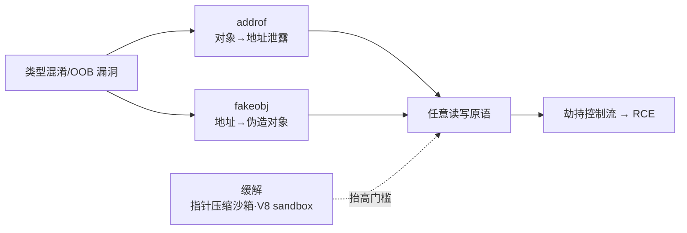

# 浏览器与JS引擎漏洞（8）· addrof与fakeobj原语

> [!abstract] TL;DR
> - **addrof 与 fakeobj** 是地址泄露与对象伪造的双原语，通过类型混淆将指针与数值相互转换，绕过 V8 的指针隐藏机制。
> - V8 采用 **指针 tagging**、**浮点数编码**（IEEE 754 NaN-boxing）等技术隐藏内存地址，而漏洞利用恰恰在这些编码边界实现突破。
> - **addrof 的本质**是将对象堆指针强行输出为数值类型（双精度浮点或整数），fakeobj 是逆向操作，从任意数值伪造有效的 JavaScript 对象。
> - 这对原语是 OOB/类型混淆 → 任意读写的关键桥梁，也是现代浏览器漏洞链的必经之路。
> - 防御侧从 **V8 Sandbox**、**指针加密**、**隔离堆结构**、**类型强化** 多维度应对，但底层对象模型的内在矛盾决定了这场攻防的持久性。

## 概述与定位

在浏览器漏洞利用的演进中，从发现 OOB 或类型混淆漏洞，到最终实现任意内存读写，中间往往隔着一道难题：**如何从相对"有界"的越界访问，跳跃到"无约束"的任意地址操作**。这正是 addrof 与 fakeobj 的使命。

**addrof**（address-of）原语的目标是将一个 JavaScript 对象的堆内存地址**泄露**出来，转化为可操纵的数值。在正常情况下，V8 引擎隐藏对象指针，开发者无法直接访问；但当类型混淆、数组越界、或浮点数编码漏洞出现时，指针就会"裸露"在运算结果里。

**fakeobj**（fake object）原语反向操作：给定一个任意数值（通常来自泄露的地址），它将这个数值**冒充**为有效的 JavaScript 对象。这样，攻击者就能向任意内存地址读写，就像操纵一个真实对象的属性一样。

这两个原语的组合威力巨大：有了地址泄露，就能精确定位堆上的目标对象或数据结构；有了对象伪造，就能把这个地址变成可以随意操纵的对象。因此，addrof + fakeobj 成为了现代浏览器漏洞链的标准套路，从 2016 年的早期 V8 漏洞到近年的 0day，几乎都逃不出这个模式。

本章将深入剖析这两个原语的实现原理、V8 防御机制的演进，以及攻防双方在这个战场上的具体手段。

## 原理与机制




### 地址泄露的根本原因

在 JavaScript 中，对象是引用类型。从语言设计的角度，开发者永远不应该看到对象的"真实地址"——这个地址是引擎内部的实现细节。然而，V8 内部却必须用指针来存储和操纵这些对象。

**指针的存储问题**来自于一个矛盾：
- JavaScript 原生只有一种数值类型：Number（64 位双精度浮点）和 BigInt（任意精度）
- V8 需要在内存中用指针表示对象、数组、闭包等复杂值
- 在 32 位系统中，一个指针是 4 字节；在 64 位系统中是 8 字节
- 如果 V8 在堆上直接存储裸指针，它需要某种机制"隐藏"这些指针，使得 JavaScript 代码无法意外或恶意地将它们读出来

V8 采用了几层防线：

1. **隐藏类（Hidden Class）与 Map**：对象的形状信息不是存储在对象本身，而是通过 Map 指针指向一个全局的 Map 表。当你访问 `obj.x` 时，V8 先根据 Map 查找属性在对象内存中的偏移，而不是直接遍历。

2. **指针 tagging**：在某些场景中，V8 会在指针的低位存储额外信息（tag），以区分不同的值类型。比如在某些内部结构中，指针的最后 1-2 位可能用于标记这是否是一个 SMI（Small Integer）或其他类型。

3. **压缩指针（Pointer compression）**：64 位 V8 默认采用 4 字节压缩指针（相对于一个 base 指针的偏移），而不是完整的 8 字节绝对地址。这样既减少内存占用，也增加了地址"模糊性"。

4. **浮点数 NaN-boxing**：JavaScript 的 Number 类型是 IEEE 754 双精度浮点数。在 NaN 状态（Exponent 全 1，Mantissa 非零）下有很多"可用"的比特位。V8 可以把对象指针（经过压缩或 tagging）编码进 NaN 的 Mantissa 部分，使得它在表面上看是一个合法的 NaN，但内部却隐藏着指针信息。

### 类型混淆如何破坏隐藏

当发生类型混淆时，V8 对某个值的类型判断出错。比如：
- 引擎认为某块内存是一个数组（因此按 Array 的内存布局访问）
- 但实际上它被当作一个 Object（或反过来）

这会导致：
- **属性访问错位**：本应访问对象属性的代码，实际上读取了数组的元素指针
- **指针直接泄露**：当这个"误读"的指针被返回给 JavaScript 代码时，如果它没有经过正确的 de-boxing 过程，就会以某种数值形式出现

例如，假设一个漏洞导致数组 `arr` 被错误地当作对象，而其内部存储的指针被直接读出：

```javascript
// 伪代码：类型混淆导致的指针泄露
let arr = [obj];  // arr 的 elements 指针指向 [obj 的堆地址]
let confused = /* 通过混淆，让引擎读取 arr 的内部指针 */;
// confused 现在可能包含未 de-boxed 的指针数据
```

### addrof 的多种实现路径

**路径 1：浮点数编码漏洞**

V8 在优化浮点数运算时，有时会假设某个值已经被 unboxed（即从对象表示转换为原始数值）。如果类型推测出错，引擎可能把一个对象指针当作浮点数传给数学运算，反之亦然。

```javascript
function addrof_via_float(obj) {
  // 假设存在一个类型混淆漏洞在某个数学运算中
  let arr = [obj];
  let num = arr[0] + 0.5;  // 如果类型混淆，obj 指针可能被当作浮点数相加
  return /* 从 num 中提取指针 */;
}
```

**路径 2：数组越界 + 属性访问**

通过 OOB 漏洞，攻击者可以在堆上越界读取，直到找到指向目标对象的指针。结合 [[07.TheHole与OOB原语构造|TheHole 与 OOB 原语]]，可以跳过 bounds checking，读到隐藏在数组后面的堆结构。

**路径 3：对象属性中的压缩指针**

如果一个对象的某个属性是另一个对象，那么在对象的内存布局中，该属性存储的就是压缩指针。通过读取这个属性（可能需要绕过类型系统），就能获得指针值。然后通过反演压缩公式，还原出完整的 64 位地址。

### fakeobj 的逆向构造

一旦有了地址（通常是压缩指针形式或完整指针），fakeobj 就是反向操作：

```javascript
function fakeobj(addr) {
  // 假设 addr 是一个可以代表堆地址的数值
  // 需要把它转换回一个有效的 JavaScript 对象指针
  let fake = /* 将 addr 编码为对象表示 */;
  return fake;
}
```

实现的关键是理解 V8 如何验证一个对象指针的合法性：
1. **堆范围检查**：指针必须落在已分配的堆内存范围内
2. **对齐检查**：对象通常是以 8 字节或 16 字节对齐，最低位可能被清零
3. **Map 指针检查**：V8 会读取对象的第一个字段（Map 指针），检查它是否指向一个合法的 Map 对象

fakeobj 的危险在于：如果攻击者能够伪造或控制目标地址处的内存内容（包括 Map 指针），就可以使 V8 接受这个伪造的对象，并将其当作真实对象来操纵。

## 对象表示与地址编码机制详解

### V8 中的值表示体系

V8 内部用 `v8::Value` 和 `v8::Object` 等类型来表示 JavaScript 值。在编译和执行时，有几种常见的表示方式：

**SMI（Small Integer）表示**：
- 在 64 位 V8 中，整数通常存储在 Smi 形式
- Smi 的最低位设置为 0，值本身存储在高 31 位
- 这样，Smi 本身就是一个"合法"的指针形式，但因为最低位为 0，V8 能区分它是一个整数，而不是真实指针

```
Smi 表示（64 位）：
[31 位值][33 位高位补零][最低位 = 0]
```

**堆对象指针**：
- 堆对象的指针通常最低位是 1（或其他非零 pattern）
- 在启用压缩指针的情况下，存储的是一个 4 字节的"相对"偏移
- 实际访问时，V8 通过 base + offset 计算真实地址

**浮点数与 NaN-boxing**：
- JavaScript Number 是双精度浮点（IEEE 754）
- 在 NaN 状态下，Exponent = 2047（全 1），Mantissa ≠ 0
- V8 利用 NaN 的 52 位 Mantissa，编码对象指针或其他数据
- 这样，一个"正常"的浮点 NaN 实际上可能隐藏了一个指针

```
IEEE 754 双精度浮点：
[符号 1][指数 11][尾数 52] = 64 位
NaN 时指数全 1，V8 利用尾数存储指针信息
```

### 压缩指针与地址空间

64 位 V8（从 v5.9+ 开始）默认启用压缩指针（Pointer Compression）：

- 堆被分成多个 1GB（或更大）的区域
- 在一个区域内的对象指针，存储为 4 字节的"偏移"（相对于该区域的 base）
- 访问时，V8 重建完整指针：`real_addr = base + (offset << 1)`

**优势**：
- 内存占用减半（每个指针 4 字节而非 8 字节）
- 缓存友好性提升

**攻击者视角的危险性**：
- addrof 只能获得压缩形式的指针
- 需要知道或推测 base 值，才能还原完整地址
- 但如果 base 不变（同一进程、同一堆区），那么一旦泄露一个完整地址，就能反推 base，从而解码其他所有压缩指针

### 浮点数编码漏洞的深层原因

浮点数编码漏洞通常源于 JIT 优化的类型假设错误。考虑这个例子：

```javascript
function process(x) {
  // JIT 推测 x 总是一个浮点数
  return x + 1.5;
}
// 如果实际上 x 被传入一个对象指针（通过某个漏洞），
// 那么这个加法操作会把指针当作 64 位整数进行浮点运算，
// 结果就是一个混合了原始指针信息的数值
```

V8 的 Turbofan JIT 编译器在生成 WebAssembly 或机器码时，会根据类型反馈进行激进优化。如果：
1. 最初的调用中 `x` 确实是浮点数（类型反馈是 "Float64"）
2. 之后忽然传入一个对象（类型反馈未更新）
3. JIT 代码已经生成，假设 `x` 在浮点寄存器中

那么，这个对象的指针比特会被直接作为浮点数处理，导致指针泄露。

更危险的是，某些数学运算（如位移、按位与等）会改变指针的形式，但保留其本质信息，攻击者可以通过一系列运算反推出原始地址。

## 攻防实战与变体

### 实战 addrof 构造示例

一个经典的 addrof 构造（基于类型混淆漏洞的假设）：

```javascript
// 假设存在以下漏洞：
// 在某个特定条件下，JavaScript 数组的内部元素指针会被错误处理

let target = {};
let arr = [target];

// 通过特殊的访问模式触发类型混淆
function addrof(obj) {
  let arr = [obj];
  // 创建一个"混淆"的情形：让 V8 错误地解读 arr 的内部指针
  // （这里是伪代码，实际漏洞取决于具体 V8 版本）
  let confused = obj + 0;  // 如果obj被错误unbox，指针泄露
  return confused;
}

let objAddr = addrof(target);
console.log("Object at:", objAddr);
```

### 实战 fakeobj 构造示例

给定一个地址，构造伪对象：

```javascript
function fakeobj(addr) {
  // 关键问题：V8 如何验证一个值是否是合法对象？
  // 如果我们能向 addr 处的内存写入一个有效的 Map 指针，
  // 那么 V8 就会接受这个伪造对象
  
  // 假设我们已经有任意写能力（通过之前的原语）
  // 步骤：
  // 1. 在 addr 处写入一个指向有效 Map 的指针
  // 2. 构造一个"壳"对象，使其指向 addr
  
  let fake = /* 某个方式让 fake 的内部指针等于 addr */;
  return fake;
}
```

在实战中，fakeobj 通常与任意写结合：
1. 用 addrof 泄露某个关键对象（如数组或 ArrayBuffer）的地址
2. 用任意写（通过 OOB 或其他原语）修改 addr 处的内存，伪造一个 Map 指针
3. 构造 fakeobj 指向 addr，V8 读取 Map 指针后，接受这个伪对象
4. 通过这个伪对象的属性访问，实现任意内存读写

### 版本差异与防御适应

不同 V8 版本的防御策略有显著差异：

**V8 8.0-9.0（2020-2022）**：
- 压缩指针已成为标准
- 但 Map 验证相对简陋
- addrof/fakeobj 仍是主流利用手段

**V8 10.0+（2022 年以后）**：
- 引入了 **V8 Sandbox** 的初步形式
- MiraclePtr 等防御机制出现
- 指针加密（Pointer signing）在某些平台上启用
- addrof 仍可行，但 fakeobj 的难度大幅提升

**当前（2024+）**：
- V8 Sandbox 更加完善，隔离堆结构变复杂
- ARM64 上的指针签名几乎是标配
- 传统 addrof/fakeobj 在最新版本上可能失效
- 但在旧版本上仍然有效（长尾效应）

## 工具视角与实战要点

### 漏洞挖掘视角

addrof/fakeobj 原语通常不是单独发现的，而是在以下场景中被认出：

1. **类型混淆漏洞排查**：当 Fuzzer 或静态分析发现类型推测失败时，评估是否能导致指针泄露
2. **浮点数运算异常**：当计算结果包含异常大的数值（可能是指针）时，尝试解码
3. **对象属性越界**：OOB 漏洞产生后，分析是否能读到邻近堆对象的指针

### 利用链视角

在完整利用链中，addrof/fakeobj 通常处于这个位置：

```
OOB/类型混淆漏洞 
  → addrof（泄露关键对象地址，如数组/ArrayBuffer）
  → 任意写（通过 OOB 修改内存）
  → fakeobj（伪造对象指向任意地址）
  → 通过伪对象的属性访问，实现任意读写
  → 逃逸至 JIT/shellcode → RCE
```

### 调试与验证

在开发漏洞时，常用工具包括：

**V8 Inspector**：
- 可以观察对象的内存布局
- 通过 DevTools Protocol 检查指针值

**Heapshot/GC Log**：
- 追踪堆对象的生命周期
- 验证地址泄露是否确实指向目标对象

**符号执行与约束求解**：
- 对于复杂的 JIT 优化漏洞，可以用 Symbolic Execution 追踪指针的变换过程
- 确保解码公式正确

### 跨平台与架构差异

**32 位 vs 64 位**：
- 32 位下，指针直接是 4 字节，压缩指针不适用
- 64 位下，压缩指针引入了额外的解码步骤

**ARM vs x86**：
- ARM64 对指针签名（Pointer Authentication Code，PAC）支持较好，防御更强
- x86-64 上的防御相对较弱（除了 Intel CET 等较新机制）

**Linux vs Windows vs macOS**：
- 不同操作系统的内存布局、ASLR 机制有差异
- V8 Sandbox 在不同平台上的启用状态也不同

## 安全性与正确使用

> [!caution]
> 本章节仅为安全研究、CTF 竞赛和自有/授权系统的测试而写。addrof/fakeobj 原语的利用涉及内存安全漏洞，**仅限于：**
> 1. 自有的开发、测试环境
> 2. 获得明确授权的漏洞赏金或渗透测试项目
> 3. CTF 竞赛与学术安全研究
> 
> **严禁**将本知识用于：
> - 攻击他人的生产系统或商业网站
> - 绕过浏览器沙箱以窃取用户数据
> - 对商业软件的未授权逆向与破解
> - 任何违反当地法律的用途
> 
> 违法者需自行承担全部法律责任。

### 防御机制演进

**指针加密（Pointer Encryption/Signing）**：
- 最新 V8 在特定平台（如 ARM64）上对指针进行加密，使得泄露的指针无法直接使用
- 防御原理：每个指针加密后存储，访问时动态解密，密钥存储在 CPU 寄存器中，无法从 JavaScript 代码中读取

**V8 Sandbox**：
- 将堆分成隔离的区域，不同类型的对象（Array、Map、String 等）存储在不同的子堆中
- 即使获得一个对象的地址，也难以伪造另一类型的对象（因为跨区域指针很难构造）

**MiraclePtr 与隐藏类强化**：
- MiraclePtr 机制让某些指针变成"半指针"，只在特定线程下有效
- 隐藏类（Map）的验证更加严格，不仅检查指针范围，还检查 Map 的内部完整性

**类型系统强化**：
- Turbofan JIT 编译器的类型追踪更加保守，减少激进优化导致的类型假设错误
- 引入 "Guard node" 等机制，确保类型转换时有显式检查

### 利用者的对抗策略

在防御机制升级的情况下，攻击者采取的对抗策略包括：

1. **多级地址泄露**：先泄露 V8 内部某个关键对象的地址，进而推断 V8 Sandbox 的 base 或加密密钥的线索
2. **利用 GC 时窗口**：在垃圾回收期间，某些防御机制可能暂时松动
3. **堆喷与堆布局**：通过大量分配特定类型的对象，控制堆的布局，增加伪造对象的成功率
4. **链式利用多个小漏洞**：单个漏洞可能不足以完整实现 addrof/fakeobj，但多个边界漏洞组合起来可能达成

### 正确的防守实践

对于浏览器开发者和系统管理员：

1. **及时更新 V8**：最新版本包含了最新的防御机制
2. **启用 V8 Sandbox**（当可用时）：通过编译选项或运行时标志启用
3. **禁用 JIT（如果安全性优先于性能）**：虽然会严重降低性能，但能消除 JIT 相关的类型混淆漏洞
4. **内存保护工具**：使用 ASAN、MSan 等编译时或运行时检测工具，在开发阶段发现漏洞
5. **代码审计**：定期审计 V8 和相关库的关键代码路径，特别是类型检查和指针操纵

### 研究者的合规边界

在公开研究 addrof/fakeobj 时：

1. **责任披露**：发现新漏洞时，先向 V8 安全团队报告，给予合理的修复时间（通常 90 天）
2. **学术发表**：发表论文时，避免提供"一键利用"脚本，而是阐述原理，让防御者能够应对
3. **POC 共享**：在 CTF 比赛或学术环境中，可以分享 POC，但要明确标注为教学用途
4. **版本限制**：如果发现的漏洞只影响特定版本，明确指出，避免影响其他用户

## 小结

addrof 与 fakeobj 两个原语从根本上戳破了 V8 引擎对内存地址的"隐藏"：前者把不可见的指针泄露为可操纵的数值，后者把这个数值变回一个有效对象。它们的存在反映了 JavaScript 引擎设计中的深层矛盾——在提供高性能动态执行的同时，很难完全隐藏底层的内存操纵。

从 OOB 和类型混淆漏洞，到最终的 RCE，addrof/fakeobj 是中间的关键一环。每一次 V8 版本升级，防御机制都在演进（压缩指针、Sandbox、指针加密），但攻击手段也在适应（堆布局控制、链式漏洞、多级泄露）。这种攻防对话的持续性，决定了浏览器安全研究的持久生命力。

对于安全研究者而言，理解 addrof/fakeobj 不仅是学习漏洞利用的必修课，更是理解现代处理器与操作系统安全设计（如 ASLR、隔离堆、隐藏类等）如何在编程语言层面体现的窗口。而对于防御方，这两个原语也是评估新漏洞严重性的关键指标——一旦漏洞足以实现 addrof/fakeobj，往往意味着整个内存安全已经沦陷。

## 相关阅读

- [[07.TheHole与OOB原语构造|TheHole 与 OOB 原语构造]] — 前置漏洞的构造与利用
- [[09.从任意读写到RCE|从任意读写到 RCE]] — addrof/fakeobj 之后的利用链延伸
- [[33.二进制漏洞与利用基础/15.ASLR与PIE绕过技术|ASLR 与 PIE 绕过技术]] — 地址泄露在二进制层面的对标
- [[41.Compiler|编译器与 JIT 优化]] — V8 JIT 中类型混淆的根源
- [[49.Fuzzing与漏洞挖掘/15.浏览器与JS引擎Fuzzing|浏览器与 JS 引擎 Fuzzing]] — 发现 addrof/fakeobj 漏洞的方法论
- [[40.WASM与虚拟化壳逆向/06.WASM内存模型与线性内存安全|WASM 内存模型与线性内存安全]] — 绕过 V8 Sandbox 的另一条路

---

[[00.浏览器与JS引擎漏洞总览|⬆ 系列总览]] | [[07.TheHole与OOB原语构造|← 上一章]] | [[09.从任意读写到RCE|→ 下一章]]
