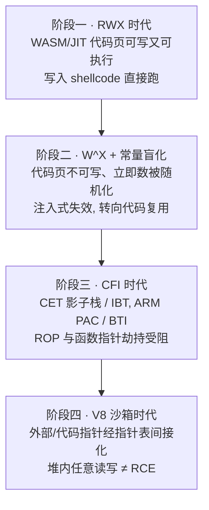
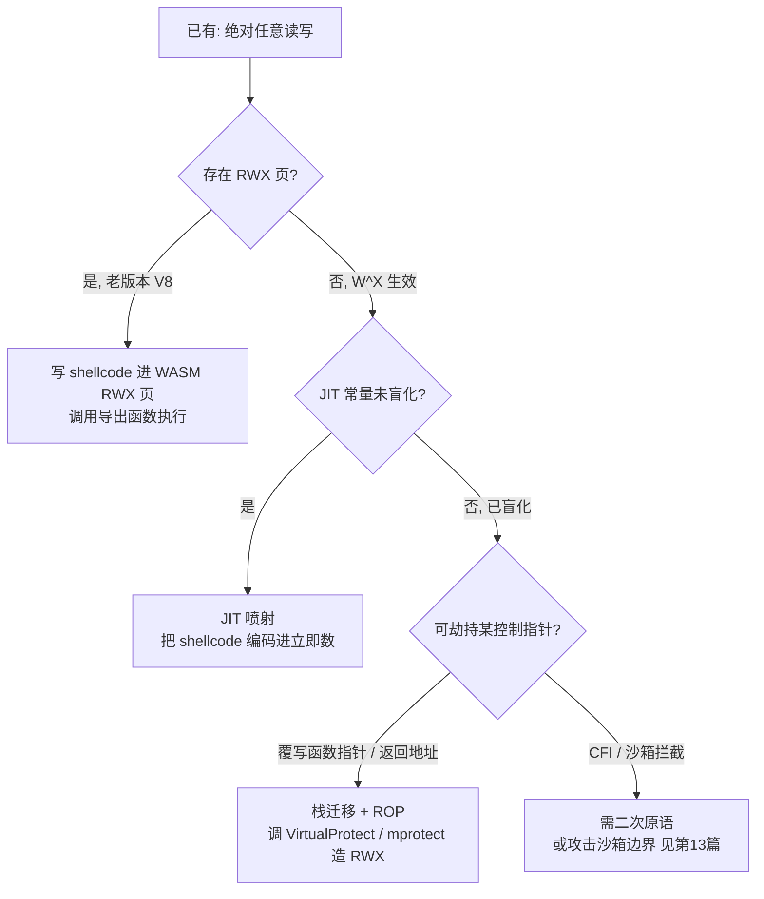
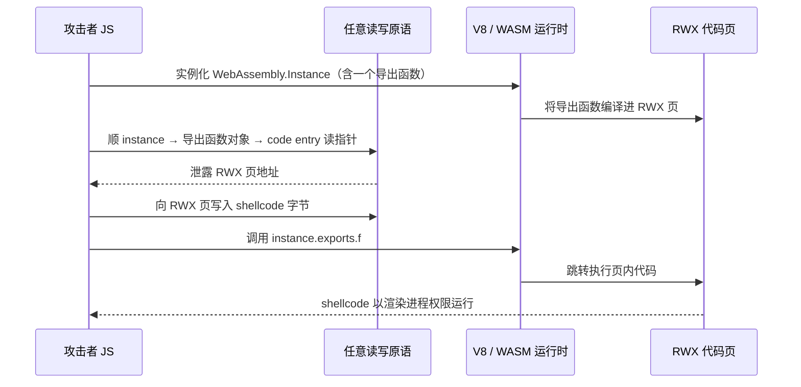

# 浏览器与JS引擎漏洞（9）· 从任意读写到RCE
> [!abstract] TL;DR
> - 任意读写只是"半成品"：它给了你渲染进程整个地址空间的读写权，但 DEP/W^X 让数据页不可执行，真正的 RCE 还差最后一步——一次**控制流劫持**，把 RIP 引到"你能执行的代码"上。
> - 三条经典落地路径分属三个时代：**WASM RWX 页**（直接把 shellcode 写进已可执行的页）对应 W^X 之前；**JIT 喷射**（把 shellcode 编码进 JIT 立即数）对应常量盲化之前；**控制流劫持 + 代码复用**（覆写函数指针/返回地址 → ROP 调 `VirtualProtect`）是现代通用兜底。
> - **fake TypedArray** 是把 addrof/fakeobj 升级成"绝对任意读写"的标准跳板：伪造 `external_pointer` 即可读写任意地址；它同时也是 V8 沙箱第一个要斩断的环节。
> - 现代缓解逐个封死原语：W^X 杀 WASM-RWX 与 JIT 注入、常量盲化杀 JIT 喷射、CET 影子栈/ARM PAC/BTI 杀 ROP 与函数指针劫持、V8 沙箱让"堆内任意读写 ≠ RCE"。
> - 结论性转变：在开启 V8 沙箱的现代 Chrome 里，一个纯粹的堆内任意读写已**不再等价于** RCE；攻击者要么再叠一个沙箱外的原语，要么转向攻击沙箱边界（见第 13 篇）。

## 概述与定位

本篇处在整条利用链的"最后一公里"。回顾前八篇搭起来的脚手架：一个内存破坏漏洞（类型混淆或越界，见第 5、6 篇）先被整理成**越界读写原语**（第 7 篇），再抬升为 **addrof/fakeobj**（第 8 篇）——前者把任意 JS 对象泄露成地址、后者把任意地址伪造成 JS 对象。这两把钥匙组合，可以进一步锻造出**绝对任意读写**（arbitrary read/write，简称 AAR/AAW）：在整个渲染进程 4GB～数十 GB 的地址空间里，读写任意一个字节。本篇要回答的唯一问题是：**手握任意读写，如何执行一段自己的原生代码？**


很多人有一个直觉误区：以为"能任意读写内存"就等于"赢了"。并非如此。任意读写让你能改内存里的**数据**，但现代处理器与操作系统普遍开启 **DEP/NX**（数据执行保护）与 **W^X**（写与执行互斥）：一个内存页要么可写、要么可执行，不能同时既可写又可执行。这意味着你即使把 shellcode 字节写进某个可写的数据页，CPU 也拒绝在那里取指执行。于是"从任意读写到 RCE"的本质，是要么**找到一块已经可执行、又恰好能被你写入的内存**，要么**复用进程里已有的可执行代码**拼出你想要的效果，要么**诱导 JIT 编译器替你把 shellcode 生成到它自己的可执行页里**。这三条思路，正好对应本篇的三个种子要点：WASM RWX、控制流劫持（含 ROP）、JIT 喷射。

按历史演进划分，"任意读写 → RCE"可分为四个阶段，缓解措施逐层加码、把每条捷径依次封死：



需要划清与相邻篇的边界：第 10 篇专讲 WebAssembly 与 RWX 的**内部机制**，本篇只把 WASM RWX 当作"最简单的一条历史捷径"来讲清原理与消亡原因；第 13 篇专讲 V8 沙箱与 CFI 的**缓解设计**，本篇只从攻击者视角说明这些缓解如何逐条改写规则。本篇的主线始终是攻击者手里的动作序列——**如何把读写权转成执行权**。

## 原理与机制

### 为什么"读写内存"不等于"执行代码"

冯·诺依曼体系里指令与数据同处内存，早期漏洞利用因此可以把 shellcode 塞进栈缓冲区、再把返回地址改到栈上直接执行。DEP/NX 位（x86-64 页表项的第 63 位 NX、ARM 的 XN）终结了这种玩法：栈、堆、TypedArray 的 backing store 这些**数据页**统统被标记为不可执行。W^X 则更进一步，把它作为一条不变量贯穿到 JIT 引擎——即便是引擎自己动态生成机器码的可执行页，也不允许在"可执行"的同时保持"可写"。

于是攻击者面临一个组合难题：**能写的地方不能执行，能执行的地方不能写。**破局只有三种范式：

1. **打破 W^X**：找到（或制造）一块既可写又可执行的 RWX 页。历史上 V8 的 WASM 代码页恰好是 RWX——这是最省事的一条路。
2. **代码复用**：不注入新指令，而是把控制流劫持到进程里**已有的**可执行代码片段（gadget），用 ROP/JOP 拼出"调用 `VirtualProtect`/`mprotect` 把某数据页改成 RWX 再跳过去"或直接完成目的。
3. **借 JIT 之手生成**：JIT 编译器天然会把 JS 源码翻译成机器码写进可执行页。若能让你控制的字节以"立即数常量"的形式原样进入这段机器码，再错位跳入，就等于让 JIT 替你把 shellcode 写进了它自己的可执行页——这就是 JIT 喷射。

### 控制流劫持：所有路径的公共咽喉

无论走哪条范式，都绕不开一次**控制流劫持**：让 CPU 的指令指针（RIP/PC）跳到攻击者选定的地址。有了任意写，问题化简为"找一个引擎将来会**解引用并 call/jmp** 的指针，把它改掉"。可被劫持的控制指针大致三类：

- **后向边——返回地址**：函数栈帧里保存的返回地址。改它需要先知道栈地址（栈默认不在 addrof 能触及的堆里），再配合**栈迁移**（stack pivot）把 RSP 指向你布置好 ROP 链的可控缓冲区。
- **前向边——间接调用指针**：C++ 对象的 vtable 指针、JS 函数对象里的 code entry（代码入口）、WebAssembly 实例的导入函数指针与 `call_indirect` 间接调用表项。这些指针会在正常执行流里被解引用后 `call`，改掉它就等于改掉了下一跳。
- **数据即指针的边缘地带**：形如"某结构体里存了一个函数指针，某路径会调用它"的字段（回调、析构器、handler 等），本质仍是前向间接调用。

任意读在这里同样不可或缺：现代 ASLR 让模块基址、堆基址、栈基址都随机化，你必须先用任意读**泄露一个已知含义的指针**（例如某个函数对象的 code entry、某个 vtable 项、libc/`chrome.dll` 里的一个返回地址），据此反推模块基址，才能算出 gadget 与 RWX 页的真实位置。换句话说，任意读负责"定位"、任意写负责"劫持"，二者缺一不可。下面这张决策树概括了拿到任意读写后如何选路：



## 从读写到执行的路径详解

### 一、fake TypedArray：把 addrof/fakeobj 落地成绝对任意读写

第 8 篇给出的 addrof/fakeobj 通常只是"能读写某段可控堆"的相对能力，要升级成任意地址读写，最经典、最稳定的跳板是**伪造一个 TypedArray**，让它的数据指针由你说了算。原理在于 V8 里 `Uint8Array`/`Float64Array` 这类对象读写元素时，最终地址是从对象字段里取的一个裸指针加上偏移算出来的。其（随版本变化、此处示意）内存布局大致如下：

```
JSTypedArray（堆内对象，字段混合了压缩指针 / Smi / 裸指针）
  +0x00  Map               隐藏类指针（压缩）
  +0x08  Properties / Elements
  +0x10  ArrayBuffer       指向 JSArrayBuffer（压缩）
  +0x18  byte_offset
  +0x20  byte_length
  +0x28  base_pointer      堆内基址；off-heap 时为 Smi 0
  +0x30  external_pointer  <-- 裸 64 位数据指针
  +0x38  length            元素个数
  数据有效地址 = base_pointer + external_pointer
```

关键就是 `external_pointer` 与 `base_pointer` 这一对。对于数据放在堆外（off-heap）的 TypedArray，`base_pointer = Smi(0)`，`external_pointer` 就是 backing store 的真实地址。**利用手法**：用 fakeobj 在一片你能完全控制内容的内存（例如一个 `Float64Array` 的 backing store，或另一个数组的元素区）上"伪造"出一个 JSTypedArray 的字节镜像，令其 `base_pointer=0`、`external_pointer=X`、`length` 设得足够大；再让引擎把这片字节当作真正的 TypedArray 对象来用。之后对这个伪造 TA 的第 `i` 个元素读写，就精确命中地址 `X+i*elem_size`——把 `X` 改成任意值，就得到了对任意地址的绝对读写。工程上常见"双 TA"变体：让"受害 TA"与"攻击 TA"在堆上相邻，先用越界改掉受害 TA 的 `length`/`external_pointer`，再通过它读写攻击 TA 的元字段，从而在**不制造悬空伪对象**的前提下反复重定向读写目标，稳定性更好。

这一步有几个必须踩准的**边界与陷阱**，它们也是初学者利用失败的高发区：

- **指针压缩（pointer compression）**：64 位 V8 默认开启指针压缩，堆内对象指针是相对于隔离区 cage base 的 32 位偏移。这意味着 addrof 泄露出来的是 32 位压缩值，你要用任意读先泄露 cage base（isolate root），才能把压缩指针还原成完整 64 位地址来作为读写目标。忽略这点会导致"读到的地址差了个高 32 位"。
- **Smi 与 HeapObject 标记**：V8 用**标记指针**，最低位区分 Smi（小整数，末位 0）与堆对象（末位 1 的弱标记/带偏移）。伪造字段时若把 `base_pointer` 写成带标记的值而非纯 0，地址计算会整体偏一个字节。这与 JavaScriptCore 的 **NaN-boxing** 编码截然不同——JSC 把指针塞进 double 的 NaN 空间，addrof 值的构造方式随之不同；这是把 V8 手法照搬到 WebKit 时最容易翻车的地方之一。
- **GC 崩溃**：伪对象一旦被 GC 扫描器遍历（它会顺着 Map、Elements 等字段递归），字段里那些"看着像指针实则是攻击者数值"的字段会让扫描器解引用非法地址而崩。缓解办法是尽量缩短"伪造→使用→复原"的窗口，用完立即把被破坏字段恢复成合法值，并在关键区间避免触发 GC。这也是为什么很多稳定 exploit 宁可用"双 TA 元字段改写"而非"长期存活的整只伪对象"。

### 二、WASM RWX 页：最省事的历史捷径

在 2018 年前后的 V8 里，WebAssembly 模块编译出的机器码被放进 **RWX**（可读可写可执行）内存页。这给了攻击者一条几乎不需要 ROP 的捷径：



**为什么有效**：页面本身就是可执行的，攻击者无需打破 DEP、无需 ROP，甚至无需精确对齐——把整只函数体覆盖成 shellcode，再触发这个导出函数的 JS 包装器（`WebAssembly.Instance.exports.f` 是个普通 JSFunction，其 code entry 指向 RWX 页），CPU 就在你写好的字节上取指。这也是为什么直到今天，在使用**旧版本 V8 或显式关闭沙箱**的 CTF pwn 题里，"实例化一个最小 WASM 模块拿到 RWX 页 → 任意写覆盖 → 调用"仍是最短最稳的收尾套路。

**为什么消亡**：V8 后来把 WASM（以及 JIT）代码空间改为 **W^X**——代码页常态为 RX（可读可执行、不可写），只有在引擎需要写入新代码的短暂窗口才切换权限。早期实现用 `mprotect` 在 RW 与 RX 之间来回切换（有性能与竞态代价），后来改用 **内存保护键（PKU/PKEY，Memory Protection Keys）** 实现近乎零开销的线程本地权限翻转。结果是：攻击者的任意写落在一个**只读**的代码页上会直接触发写保护异常，"覆盖 WASM 函数体"这条路被封死。至于 W^X 的具体切换机制、跳转表（jump table）与懒编译带来的新攻击面，属于第 10 篇的深水区，此处不展开。要点是：**RWX 捷径已随 W^X 一同退场**，但 WASM 实例内部的数据（线性内存基址、导入函数指针、间接调用表）依旧是现代利用偏爱的劫持目标——这与"代码页是否可写"无关。

### 三、JIT 喷射：让编译器替你写 shellcode

当 RWX 不复存在、又不想立刻上 ROP 时，**JIT 喷射**（JIT spraying，Dion Blazakis 于 2010 年 Black Hat DC 系统化提出）曾是优雅之选。核心洞察是：JIT 会把 JS 源码里的**大整数常量**原封不动地作为**立即数**发射进它生成的机器码，而 x86/x64 是**变长、非对齐**指令集——从一条指令的中间跳进去，同一段字节会被 CPU 重新解码成另一串完全不同的指令。于是攻击者用一长串精心挑选的常量做异或/加法，把 shellcode 藏进这些立即数里，再让控制流错位跳入常量流：

```
源码:  var y = (0x3c909090 ^ 0x3c909090 ^ 0x3c909090 ^ ... );

JIT 逐个常量发射为 XOR EAX, imm32：
  机器码:  35 90 90 90 3C   35 90 90 90 3C   35 90 90 90 3C ...
           └┬┘└───┬────┘└┬┘
          opcode  imm32(小端)  下一条 opcode

若从 opcode(35) 之后一字节错位跳入:
  90 90 90      三个 NOP  ← 可替换为 3 字节真实 shellcode
  3C 35         cmp al, 0x35  ← 用 3C 吞掉下一条的 35 opcode, 无害滑过
  90 90 90 ...  继续下一段, 如此串成"自对齐滑板 + shellcode"
```

这里的巧思在于常量高字节 `0x3c`：它是 `cmp al, imm8` 的 opcode，会"吃掉"紧随其后的一字节（也就是下一条 `XOR` 的 opcode `0x35`），从而把每段常量之间的接缝抹平，形成一条能干净滑过的伪 NOP 滑板；每个常量里空出的 3 字节则塞入实际 payload。配合**堆喷**（把这个 JIT 函数复制喷洒无数份使其地址可预测），或在有任意读时**直接泄露 JIT 代码页地址**（连喷都省了，精确定位落点），即可稳定命中。

**现代如何被封**：主流引擎引入**常量盲化**（constant blinding）——发射一个大常量 `imm` 时，不再直接写入，而是先生成一个随机 cookie `C`，emit `mov reg, (imm ^ C)` 再 `xor reg, C`，于是内存里出现的是无法预测的 `imm ^ C`，攻击者精心构造的字节不再原样落地。代价是每个被盲化的常量多一条指令、多占一个寄存器，因此引擎通常只对**超过某位宽阈值**的常量盲化（小常量既难藏 shellcode、盲化又不划算）。叠加 JIT 代码页 W^X 与代码布局随机化，经典 JIT 喷射基本失效。其**变体**转向"不注入、只复用"：不再往 JIT 代码里塞新指令，而是用任意写覆盖某个已 JIT 函数对象的 code entry，令其指向一段现成 gadget，或直接把 JIT 产物本身当 gadget 源来用——这就自然过渡到了下面的控制流劫持载体。

### 四、控制流劫持的具体载体

拿到任意读写后，"改哪个指针"往往决定了 exploit 的稳定性。常见载体按现代可用性排序：

- **WebAssembly 导入函数 / `call_indirect` 间接表**：这是现代最受青睐的前向劫持点。WASM 实例为其导入函数和间接调用维护一张存**裸代码指针**的表，历史上对这些指针缺乏强类型校验。用任意写把某个导入函数或间接表项改成目标地址，再从 WASM 内部触发该调用，RIP 即被接管。它比覆盖 JS 函数 code entry 更隐蔽，也常绕开一部分前向 CFI 检查。
- **JS 函数对象 code entry**：直接覆写某个 JSFunction 缓存的代码入口指针，下次调用它即跳到目标。简单直接，但现代 V8 已把这类可信入口迁入受保护空间（见第 13 篇），可写性下降。
- **C++ 对象 vtable**：fakeobj 伪造一个带可控 vtable 的 C++ 对象，触发其某个虚方法，即得到可控 RIP。这是把"堆内伪造"直接兑现成"前向间接调用劫持"的通用套路，也是 CFI 重点防御对象。
- **返回地址 + 栈迁移**：若能定位栈（例如任意读泄露某个保存的 RBP 或指向栈槽的指针），可覆写返回地址；更常见的是**栈迁移**——找一个 `xchg rsp, rax; ret` 或 `mov rsp, [rax]; ...; ret` 的 gadget，把 RSP 指向你在某个 ArrayBuffer/数组里布好的 ROP 链，从而在数据可控的缓冲区上"重建栈"。

### 五、ROP/JOP：DEP 时代的代码复用收尾

当既拿不到 RWX、又被常量盲化挡住 JIT 喷射时，通用兜底是**代码复用**：用任意读泄露一个模块内代码指针 → 反推 `chrome.dll`/libc 基址（ASLR 绕过的细节见 [[33.二进制漏洞与利用基础/15.ASLR与PIE绕过技术]]）→ 在模块里搜集以 `ret` 结尾的 gadget → 通过栈迁移把执行流交给一条 **ROP 链**。链子的典型目标是调用 `VirtualProtect`（Windows）或 `mprotect`（Linux/macOS）把一块已写好 shellcode 的数据页改成 RWX，再跳过去；或者干脆用 ROP 直接把系统调用参数摆好、完成"起进程/读文件"等目的而完全不落 shellcode。面对只做**前向** CFI 的环境，可退化为 **JOP**（面向跳转编程，以间接 `jmp`/`call` 串联 dispatcher gadget）以规避对 `ret` 的检查。ROP/JOP 的门槛在于 gadget 供给与栈控制，而任意读写恰好同时满足"泄露基址"与"写栈/写迁移目标"两项前提，因此在无沙箱的现代目标上，"任意读写 → 栈迁移 → ROP 造 RWX → shellcode"是最稳的通用收尾。

### 六、现代缓解如何改写规则（概览，深入见第 13 篇）

把上述路径逐条对照当代缓解，能清楚看到攻防的层层加码：**W^X** 抹掉 WASM-RWX 与 JIT 注入；**常量盲化**抹掉经典 JIT 喷射；**Intel CET**（影子栈守后向边、检测 ROP；IBT 守前向边、要求间接跳转落在 `endbr64` 上）与 **ARM PAC/BTI**（对含返回地址在内的指针签名、并要求跳转目标带 BTI 落点）一起卡住返回地址覆写与任意函数指针劫持；**Clang/LLVM CFI** 则对虚调用做基于类型的前向校验。最具颠覆性的是 **V8 沙箱**：它把堆内指针压成 32 位、令其无法表达沙箱外地址，把 backing store 等**外部指针**改为经**外部指针表（EPT）**按下标+类型标签间接寻址，把代码入口等改为经**代码指针表（CPT）/受信任空间（trusted space）**间接化。后果是——即便你在 V8 堆内拥有绝对任意读写，也**无法伪造一个裸 `external_pointer`**（fake TypedArray 的地基被抽走），**无法直接改一个裸 code entry**（它成了你够不着的表下标）。于是那句老话"任意读写即 RCE"在开启沙箱的现代 Chrome 里**不再成立**：堆内读写只等价于"沙箱内读写"，要变现成 RCE，得再叠一个沙箱外的内存破坏，或专门攻击沙箱边界。作为横向对照，WebKit/JavaScriptCore 走的是另一套：用 **Gigacage** 把 TypedArray/butterfly 的 backing store 关进受限区（"caged"指针），并在 ARM64 上用 **PAC** 给代码指针签名——思路不同，但同样在瓦解"读写即执行"的等价关系。

## 工具视角与实战

调试与开发阶段，`d8`（V8 的独立 shell）是主力。常用组合：`--allow-natives-syntax` 打开内建语法后，用 `%DebugPrint(obj)` 打印对象地址与 Map、`%DebugPrintPtr` 查看指针、`%SystemBreak()` 触发断点，配合 gdb 的 **gef/pwndbg** 与 V8 自带的 gdb 宏（`job`/`jco`/`jst` 分别打印对象、code、栈）观察堆布局。研究前沙箱技术时用 `--no-sandbox` 关闭 V8 沙箱、`--jitless`/`--no-opt` 控制是否走 JIT、`--print-opt-code` 与 `--trace-turbo` 观察 TurboFan 发射的机器码（验证 JIT 喷射/常量盲化行为）。定位 RWX 页可读 `/proc/<pid>/maps` 找 `rwxp` 段，或直接顺着函数对象的 code entry 读出代码区地址。

有几条实战注意事项值得强调。其一是**版本漂移**：上文所有对象字段偏移都随 V8 版本变化，任何抄来的偏移都可能过期——正确做法是针对目标版本用 `%DebugPrint` 现场测量各字段位置，或直接对照该版本源码，这也是浏览器 exploit 天然"版本锁定"的根因。其二是 **JIT 预热**：要观察或利用优化后的机器码，必须先把目标函数循环调用足够多次触发 tier-up（从解释器/Sparkplug 抬到 TurboFan），否则你看到的是未优化代码。其三是 **shellcode 约束**：JIT 喷射要求 payload 无空字节且能被立即数编码承载，ROP 造 RWX 则要注意页对齐与参数寄存器约定。逆向视角下，快速摸清一个陌生版本 V8 的字段布局、以及判断某条 JIT 路径是否可被"错位反汇编"利用，是这类工作的核心手艺；对推测优化如何引入可利用漏洞的背景，可回看 [[41.Compiler|编译器与 JIT 优化]]。想系统地把这些原语从真实 bug 里挖出来，则见 [[49.Fuzzing与漏洞挖掘/15.浏览器与JS引擎Fuzzing]]。

## 安全性与正确使用

> [!caution] 合规边界
> 本文所述的 fake TypedArray、WASM RWX、JIT 喷射、控制流劫持与 ROP，均为**防御与教育视角**的原理讲解，仅可用于**你自有或获得明确书面授权的环境、CTF 靶场与安全研究**。严禁将其用于攻击真实生产系统或他人系统，不提供针对任何真实目标的武器化步骤，也不为绕过任何商业授权提供成品配方。请遵循**负责任披露**：发现漏洞应通过官方渠道（如 Chrome VRP）上报，给予厂商修复窗口，切勿公开或滥用可直接打真实目标的利用代码。

站在防御一侧，本篇恰好是一张"缓解为何有效"的清单，可直接指导加固决策。要点有四：**其一，坚持 W^X**——绝不让任何页同时可写可执行，这一条就抹掉了 WASM-RWX 与 JIT 注入两条最短捷径；**其二，开启常量盲化并配合代码布局随机化**，使 JIT 立即数不可被攻击者预测，封死经典 JIT 喷射；**其三，启用硬件级 CFI**（Intel CET 的影子栈与 IBT、ARM 的 PAC 与 BTI），让返回地址覆写与任意函数指针劫持在跳转那一刻就被拦截；**其四，最关键的一层——启用 V8 沙箱**，通过指针压缩、外部指针表、代码指针表与受信任空间把"堆内任意读写"与"伪造裸指针/劫持裸代码入口"彻底解耦，使 R/W 不再等价于 RCE。这些缓解并非彼此替代而是**纵深叠加**：即便攻击者攻破其中一层，仍要连续攻破其余各层才能收尾，从而把利用成本抬到需要"漏洞链"而非"单一 bug"的量级。对使用者而言，最实际的防护就是**及时更新浏览器**——绝大多数在野利用打的都是已修复的旧版本。

## 小结

本篇讲清了利用链的"最后一公里"：**任意读写只是读写数据的能力，RCE 需要一次控制流劫持把它兑现成执行能力**，而 DEP/W^X 决定了这一步只能走"已有可执行页 / 代码复用 / 诱导 JIT 生成"三条范式。落地上，fake TypedArray 是把 addrof/fakeobj 抬成绝对任意读写的标准跳板；WASM RWX 是 W^X 之前最省事的历史捷径；JIT 喷射是常量盲化之前把 shellcode 藏进立即数的巧技；覆写 WASM 间接表/函数指针/返回地址再配栈迁移与 ROP，则是现代通用兜底。而真正改写整个博弈的，是层层加码的缓解：W^X、常量盲化、CET/PAC/BTI 与 V8 沙箱依次封死每条捷径，最终把"任意读写即 RCE"这条二十年的经验法则，在现代 Chrome 上改写为"堆内任意读写仅等于沙箱内读写"。要跨过这道新墙，攻击者要么再叠一个沙箱外原语、要么转向沙箱边界本身——这正是第 10、12、13 篇要继续展开的故事。

## 相关阅读

- 上一环：[[08.addrof与fakeobj原语|addrof 与 fakeobj 原语]]、[[07.TheHole与OOB原语构造|TheHole 与 OOB 原语构造]]——本篇任意读写的直接前置。
- 下一环：[[10.WebAssembly与RWX利用|WebAssembly 与 RWX 利用]]（W^X 机制、WASM 内部攻击面）、[[12.沙箱逃逸原理|沙箱逃逸原理]]、[[13.浏览器漏洞缓解：V8沙箱与CFI|浏览器漏洞缓解：V8 沙箱与 CFI]]。
- 漏洞源头：[[06.类型混淆与JIT优化漏洞|类型混淆与 JIT 优化漏洞]]、[[41.Compiler|编译器与 JIT 优化]]。
- 承接与呼应：[[33.二进制漏洞与利用基础/15.ASLR与PIE绕过技术|ASLR 与 PIE 绕过技术]]（ROP 定位基址）、[[49.Fuzzing与漏洞挖掘/15.浏览器与JS引擎Fuzzing|浏览器与 JS 引擎 Fuzzing]]、[[40.WASM与虚拟化壳逆向/06.WASM内存模型与线性内存安全|WASM 内存模型与线性内存安全]]。
- 权威文献（官方/学术，非搬运）：Dion Blazakis《Interpreter Exploitation: Pointer Inference and JIT Spraying》(Black Hat DC 2010)；saelo《Attacking JavaScript Engines》(Phrack 70)；V8 官方博客《The V8 Sandbox》与《Pointer Compression in V8》(v8.dev/blog)；Intel《Control-flow Enforcement Technology (CET) Specification》；Google Project Zero 的浏览器利用系列分析。

[[00.浏览器与JS引擎漏洞总览|⬆ 系列总览]] | [[08.addrof与fakeobj原语|← 上一章]] | [[10.WebAssembly与RWX利用|→ 下一章]]
