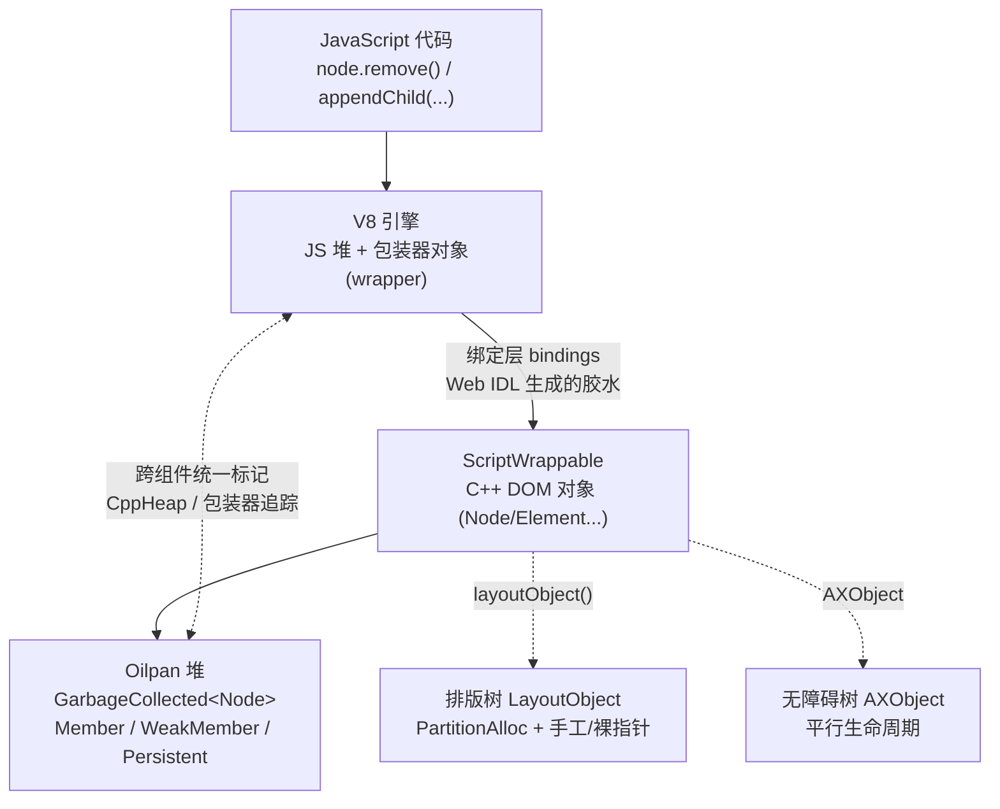
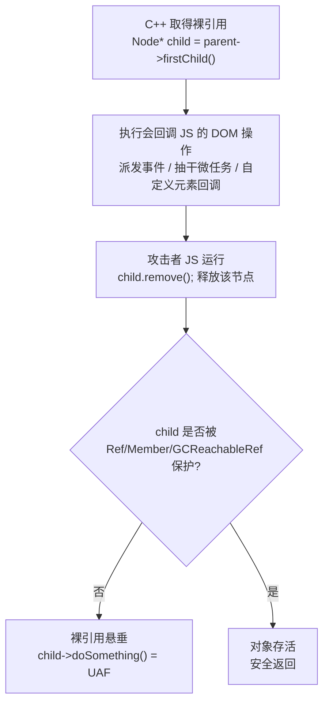
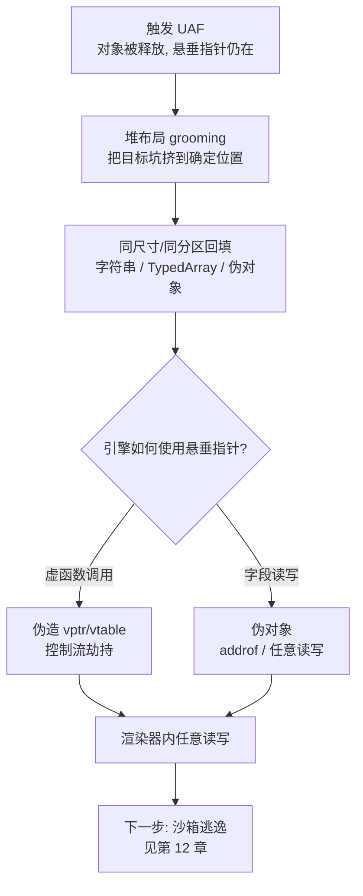

# 浏览器与JS引擎漏洞（11）· 渲染器漏洞与DOM引擎
> [!abstract] TL;DR
> - 渲染器（renderer）里除了 V8，还有一整套用 **C++ 实现的 DOM/排版引擎**（Blink/WebKit）；这层的头号漏洞不是类型混淆，而是 **DOM UAF（use-after-free）**——根因是「C++ 对象生命周期」与「JS 垃圾回收」两套内存管理拼在一起，再叠加**可重入（reentrancy）**。
> - 经典触发式：C++ 在 DOM 操作中途拿着**裸指针**，操作过程**派发了事件/跑了微任务/回调**，JS 回调把那个节点删了并释放，C++ 回来接着用悬垂指针——一条 `Ref<Node> protectedThis(*this)` 或 `Member<Node>` 就是修复。
> - Blink 用 **Oilpan（追踪式 GC）+ `Member/Persistent`** 管 DOM 节点；WebKit 用 **引用计数 `Ref/RefPtr` + 不透明根（opaque roots）**；Gecko 用 **引用计数 + 循环收集器**——三家「防 UAF」的机制不同，但「JS 在 DOM 变更中途运行」这个触发面是共享的。
> - DOM 对象是**上好的利用目标**：带 **vtable**（伪造即控制流劫持）、尺寸可预测（好回填）、可批量分配（好做堆布局 grooming）；UAF→回填→伪对象→ addrof/任意读写，物理原语与 V8 侧殊途同归。
> - 但**排版树 `LayoutObject`、无障碍树 `AXObject` 等平行树不归 Oilpan 管**，仍是手工/裸指针生命周期，是 UAF 长期高发区；「已从文档摘除的 detached 节点」也是经典雷区。
> - 缓解把利用越推越难：Oilpan 迁移、PartitionAlloc **按类型分区**、**MiraclePtr/BackupRefPtr 把悬垂指针的内存隔离进隔离区**——这把渲染器利用重心推向了 V8；而 WebKit 因仍是引用计数，DOM UAF 在 Pwn2Own Safari 链里依旧多产。

## 概述与定位

前面第 03~10 章几乎都在 V8 里打转：隐藏类、JIT 投机、类型混淆、OOB、addrof/fakeobj、任意读写、WebAssembly。但**渲染器进程远不止一个 JS 引擎**。当浏览器加载一个页面，真正把 HTML 解析成树、把 CSS 算成样式、把节点排成一页像素的，是一套独立的、用 **C++** 写的庞大代码——在 Chrome 里叫 **Blink**，在 Safari 里叫 **WebKit（WebCore）**。这套代码实现了 DOM（文档对象模型）、CSSOM、排版（layout）、绘制（paint）、合成（compositing），还有 SVG、`<canvas>`、WebAudio、编辑（contenteditable）、动画等一大堆 Web 平台特性。**它才是渲染器里代码量最大、攻击面最宽的部分**，而 JS 引擎只是嵌在其中、通过「绑定层（bindings）」被 DOM 调用与回调的一个组件。

本篇的主题就是这层 C++ 引擎的漏洞。它与 V8 侧漏洞有本质区别：V8 漏洞多是**逻辑/投机错误**导致的类型混淆（编译器错误地相信了某个类型契约）；而 DOM 引擎漏洞的绝对主力是**内存生命周期错误**——最典型的就是 **use-after-free（释放后使用，UAF）**，其次是野指针、二次释放、类型混淆（较少）与整数溢出。为什么是 UAF 一家独大？因为 DOM 是一张**巨大、可变、彼此交叉引用、还随时被 JS 回调打断的 C++ 对象图**，管理这张图的生命周期极其困难。理解这层的漏洞，本质上是理解 **Blink/WebKit 如何管理对象的生死**，以及这套管理在哪些缝隙里会失效。

在系列里，本篇是「离开 V8、进入渲染器 C++ 引擎」的转折点。它与前面 addrof/任意读写（[[08.addrof与fakeobj原语]]、[[09.从任意读写到RCE]]）在**利用后半程会师**：无论漏洞源头是 V8 类型混淆还是 DOM UAF，最终都要走到「渲染器内任意读写」这一步。但**拿到渲染器内的任意读写，你仍在沙箱里**——怎么从渲染器逃到浏览器进程、再到系统，是下一篇 [[12.沙箱逃逸原理|→ 沙箱逃逸原理]] 的事。防这类漏洞的 Oilpan、PartitionAlloc、MiraclePtr 等缓解，则与第 13 章 [[13.浏览器漏洞缓解：V8沙箱与CFI]] 呼应。所以本篇的定位很清晰：**讲透 DOM 引擎的对象生命周期模型，讲透 DOM UAF 这一主导漏洞类的成因、变体、触发与利用，并停在「渲染器内任意读写」这条与 V8 侧汇合的线上。**

## 原理与机制

### DOM 是一张 C++ 对象图，不是一棵简单的树

初学者眼里 DOM 是「一棵节点树」：`document` 是根，元素是内部节点，文本是叶子。但在 Blink/WebKit 的实现里，它是一张**远比树复杂的有向图**。`Node` 是所有节点的基类，`ContainerNode`（能有子节点者，如 `Element`、`Document`）、`Element`、`CharacterData`（文本/注释）、`Document`、`DocumentFragment`、`ShadowRoot` 层层派生。除了「父—子—兄弟」这些树边，节点之间还有海量**非树引用**：

- 一个 `Element` 关联着它的 `ComputedStyle`、`Attr` 属性、事件监听器列表、`ElementRareData`（惰性分配的稀有数据）。
- `Range`、`Selection`、`NodeIterator`、`TreeWalker`、`MutationObserver` 都各自持有指向节点的引用，它们是**独立于树、却随树变化的观察者**。
- `HTMLCollection`、`NodeList` 等**活集合（live collection）**动态反映树的当前状态。
- 表单、`<label>`↔控件、`<use>`↔被引用元素、`id`↔`getElementById` 缓存……处处是交叉指针。
- 每个 DOM 节点还可能挂着一个**排版对象** `LayoutObject`（render 树），以及**无障碍对象** `AXObject`（accessibility 树）——这是两棵**与 DOM 树平行、生命周期又相互纠缠**的树。

这张图的复杂正是漏洞的温床：**任何一处「A 持有指向 B 的指针，而 B 可能先于 A 被销毁」的关系，都是潜在的 UAF**。而 DOM 里这样的关系成百上千。

### 绑定层与两套内存管理的「阻抗失配」

JS 要操作 DOM，靠的是**绑定层（bindings）**：Web IDL 定义每个接口（`Node`、`Element`、`HTMLDivElement`…），代码生成器据此产出把 JS 调用转发到 C++ 方法的胶水代码。每个暴露给 JS 的 C++ DOM 对象，都有一个对应的 **JS 包装器对象（wrapper）**——`node.firstChild` 在 JS 里拿到的是那个 C++ `Node` 的 JS 包装器。

关键的麻烦在这里：**C++ 对象和 JS 包装器，分属两套完全不同的内存管理体系**。JS 侧是 V8 的**追踪式垃圾回收**（可达就活，不可达就回收，回收时机不确定）；C++ DOM 侧历史上是**引用计数或手工管理**（后来 Blink 引入了自己的追踪式 GC——Oilpan）。这两套体系的「阻抗失配（impedance mismatch）」是一切的根：

- 包装器要**keep alive** C++ 对象（JS 还拿着 `node`，C++ 的 `Node` 就不能死）。
- C++ 对象反过来可能引用 JS 状态（一个事件监听器就是个 JS 函数，一个 `MutationObserver` 回调也是）。
- 于是形成**跨两个堆的引用环**，两套 GC 必须协同，否则要么过早释放（UAF），要么永久泄漏。

### 可重入：DOM 变更中途，JS 会「杀回来」

即便生命周期规则本身正确，还有一个更阴险的维度：**可重入（reentrancy）**。DOM 的很多操作会在中途**同步地把控制权交回 JavaScript**——而 JS 是攻击者写的，它可以在这个「中途」任意改动 DOM。触发回调的时机比想象的多：

- **事件派发**：插入/删除节点、聚焦、失焦、`load`/`error` 都可能同步派发事件，事件处理器是 JS。
- **历史遗留的变更事件（Mutation Events）**：`DOMNodeInserted`、`DOMNodeRemoved`、`DOMSubtreeModified` 会在 DOM 变更**正中间**同步回调 JS——这是 UAF 的古典金矿，也正因如此该特性被废弃。
- **自定义元素回调**：`connectedCallback`、`disconnectedCallback`、`attributeChangedCallback`、`adoptedCallback` 在节点接入/摘除/改属性时同步跑 JS。
- **`MutationObserver`**：虽改成微任务异步，但微任务会在很多「看似原子」的操作边界被抽干（drain），仍能插入攻击者代码。
- **`getter/setter`、`toString`、`Symbol.toPrimitive`、代理（Proxy）**：把一个对象传进 DOM API，引擎在取值/转型时会调到 JS。
- **垃圾回收本身、`resize`/`scroll`、`requestAnimationFrame`、编辑与拼写检查**等。

一句话概括机制层的核心矛盾：**DOM 引擎的 C++ 代码经常在一个多步操作的中途，持有对某节点的裸引用，同时这段操作又可能同步回调攻击者的 JS，而攻击者只要在回调里把那个节点释放掉，C++ 回来就用在了已释放内存上**。下一节把这套机制的每一层——以及三大引擎各自的「防线」与其失效方式——彻底展开。



## 对象生命周期与DOM UAF深度详解

这是全篇的深水区。要看懂 DOM UAF，必须先看懂三家引擎**各自如何管理对象生死**，再看**这些机制在哪些缝隙里漏水**，最后看**一个 UAF 如何被抬成利用原语**。

### Blink：Oilpan——给 C++ DOM 装一个追踪式 GC

Blink 早年和 WebKit 一样用**引用计数**（`RefPtr`/`PassRefPtr`）管 DOM 节点，加上到处是**为性能而留的裸指针**，结果是 UAF 层出不穷。2014 年前后 Blink 引入 **Oilpan**——一个专为 Blink C++ 对象设计的**追踪式（tracing）垃圾回收器**，逐步把 DOM 迁进去。它的设计目标就一句话：**让「引用计数漏加一次 / 裸指针悬垂」这类 UAF 从「内存破坏」降级为「顶多泄漏」**。核心概念：

- **`GarbageCollected<T>`**：继承它的类由 Oilpan 管理，分配在 Oilpan 堆上，**不再手动 `delete`**。
- **`Member<T>`**：**被追踪的强引用**（堆上字段）。GC 标记阶段会经由它到达被引用对象，从而 keep alive。
- **`WeakMember<T>`**：**弱引用**，对象死时自动清零，不 keep alive——用于「我想指向它但不该延长它命的」关系。
- **`Persistent<T>`**：**堆外的强根**（栈上/全局持有 GC 对象时用），把一个 Oilpan 对象「钉」为根。
- **`UntracedMember<T>` / 裸 `T*`**：**不追踪**的引用——这是**危险区**，Oilpan 帮不了你，若指向的对象被回收就是 UAF。
- **`trace(Visitor*)` 方法**：每个 GC 类必须实现，**在里面把自己所有 `Member` 字段 `visitor->Trace(...)` 一遍**。GC 靠它遍历对象图。
- **`USING_PRE_FINALIZER` 预终结器**：在对象被清扫**之前**、其它对象还有效时跑清理逻辑（因为析构顺序在 GC 里不确定）。

Oilpan 是 **mark-sweep**，后来加了**增量标记、并发标记、压缩（compaction）**。对**栈**用**保守扫描**（栈上可能有没被 `trace` 的裸指针，只能保守地把「看起来像指针的值」都当根），对**堆**用**精确标记**（靠 `trace` 方法）。

**Oilpan 消灭了大量 UAF，但它自己引入了新的失效模式**：

1. **`trace` 漏标（missing trace）**：某个类新增了一个 `Member` 字段却忘了在 `trace()` 里 `Trace` 它——GC 就认为该对象不可达而**过早回收**，留下悬垂 `Member`。这是 Oilpan 时代的经典 bug：**结构上完全正确的强引用，因为漏写一行 trace 而变成事实上的 UAF**。
2. **该用 `Member` 却用了 `WeakMember`/裸指针**：关系语义搞错，对象在你还需要它时被回收。
3. **非 Oilpan 对象持有 Oilpan 对象的裸指针**：跨越 GC 边界的裸引用不被追踪。
4. **预终结器里访问已被清扫的对象**、保守栈扫描的边角情形等。

### 被 Oilpan 遗忘的平行树：LayoutObject 与 AXObject

一个极其重要、又常被忽视的事实：**DOM 节点树（`Node`）进了 Oilpan，但排版树（`LayoutObject`）没有**。`LayoutObject`（渲染树/render tree 的节点）走 **PartitionAlloc**、**手工管理生命周期、内部大量裸指针与 `parent()/nextSibling()` 链**。为什么不一起进 Oilpan？性能与历史：排版是最热的路径之一，且 render 树的生命周期与 DOM 树**不完全同步**——一个节点被 `display:none` 或从文档摘除时，它的 `LayoutObject` 会被销毁（detach），但 DOM 节点还在。

这条「DOM 树 Oilpan 化、render 树没有」的**边界**是 UAF 的长期高发区：排版、绘制、命中测试（hit-testing）、滚动、选区等代码在 `LayoutObject` 之间用裸指针穿梭，而一次样式重算或 DOM 变更（可能由 JS 回调触发）会**在中途销毁某个 `LayoutObject`**，导致后续代码用了悬垂的 render 对象。**无障碍树 `AXObject`** 同理——它是又一棵平行树，缓存着指向 DOM/render 对象的引用，生命周期同步同样脆弱，历史上 AX 相关 UAF 屡见不鲜。

### 包装器生命周期：两个堆如何协同不「过早火化」

暴露给 JS 的 DOM 对象继承 **`ScriptWrappable`**，持有到其 V8 包装器的引用。协同的难点前面说过——**JS→C++ 与 C++→JS 形成跨堆引用环**。Blink 的解法经历了演进：早期用**包装器追踪（wrapper tracing）**，由 `ScriptWrappableVisitor` 在 V8 GC 时顺着 DOM 图把「还该活着的包装器」标记出来；现代做法是 **统一堆 / 跨组件追踪（unified heap）**——V8 的 GC 与 Oilpan 在**同一个标记阶段**协作（`v8::EmbedderHeapTracer`→后来的 `CppHeap`），把两个堆当一个图一起标记，从根本上正确处理环。

这里的经典雷点是 **detached 节点（已摘除节点）**：一个从文档树里 `remove()` 掉、但 JS 还拿着引用的节点，其**包装器**让它继续活着，但它的**排版/资源已被拆除**。大量代码假设「节点在文档里」，对 detached 节点操作时就踩空。**「keep alive 的粒度」**也微妙：一个节点在文档里时，整棵子树都应被 keep alive（哪怕 JS 只引用了根）——WebKit 用「不透明根」实现这点，Blink 用图可达性实现。

### WebKit：引用计数 + 不透明根 + 「保护自己」范式

WebKit（WebCore）**没有走 Oilpan 路线，至今以引用计数为主**：`Ref<T>`（非空强引用）、`RefPtr<T>`（可空）管 DOM 对象；JS 对象由 JavaScriptCore 的 GC（Riptide，并发分代 mark-sweep）管。二者协同靠**不透明根（opaque roots）**：JSC 标记某 DOM 包装器时，会问「这个节点的根是否可达」（`isReachableFromOpaqueRoots`）——若节点在某个还活着的文档/子树里，整棵被一起 keep alive。`GCReachableRef` 则在一段操作期间把某节点**临时钉为 GC 可达**。

WebKit 对付可重入 UAF 的招牌范式是**「保护自己」**：在可能回调 JS 的方法开头写一句

```cpp
Ref<Node> protectedThis(*this);   // 或 Ref protectedNode = node;
```

用一个栈上强引用把「操作期间必须活着的对象」的引用计数 +1，操作结束析构时 -1。**忘写这一句，就是一个 UAF**。因为引用计数是**手工**的，WebKit 的 DOM UAF 面比 Blink 更宽——这也是**为什么近年 Pwn2Own 的 Safari 利用链里 DOM UAF 仍然多产，而 Chrome 侧攻击者更多转向 V8**。WebKit 后来补了 **`CheckedPtr`/`CanMakeCheckedPtr`**（带校验的指针，悬垂即崩而非静默利用）和 **IsoHeap（bmalloc 隔离堆，按类型隔离分配，抬高回填难度）** 等缓解。

### Gecko 的第三条路：引用计数 + 循环收集器

作为横向对比：Firefox 的 Gecko 用**引用计数（`nsCOMPtr`/`RefPtr`）** 加一个**循环收集器（cycle collector）**。为什么需要后者？因为 DOM 天然有**引用环**（父↔子、节点↔监听器），纯引用计数无法回收环形垃圾（会泄漏）。循环收集器周期性地遍历「可疑」子图，找出并打破**垃圾环**。类（如各种 DOM 节点）用 `NS_IMPL_CYCLE_COLLECTION` 宏声明「我有哪些字段参与环」。三家一对照就清楚了：

- **Blink**：追踪式 GC（Oilpan）——最省心，但 `trace` 漏标 = 过早回收，且平行树没进 GC。
- **WebKit**：纯引用计数 + 不透明根——最需手工「protect」，忘加即 UAF，故 UAF 面最宽。
- **Gecko**：引用计数 + 循环收集器——环靠 CC 收，CC 的遍历正确性与时机本身也是 bug 面。

三者的**触发面却是同一个**：可重入。无论哪套内存管理，只要「C++ 在操作中途持裸引用 + 中途回调攻击者 JS + JS 释放该对象」三者凑齐，就是 UAF。

### DOM UAF 的触发范式（防御视角，讲成因不讲配方）

把「哪儿会回调 JS」× 「哪儿有裸引用」相乘，就得到经典触发模式：



高发的具体子系统（历史经验）：

- **变更事件**：`DOMNodeRemoved` 等在变更正中回调，古典 UAF 之源，已废弃。
- **编辑（contenteditable / execCommand）**：编辑算法极其复杂，反复在节点间移动、合并、拆分，中途触发布局与事件，是**长年 bug 重灾区**。
- **SVG `<use>` 与实例树**：`SVGUseElement` 克隆被引用内容成「影子实例树」，其生命周期与被引用元素、克隆时机纠缠，历史多发。
- **`Range` / 选区 / 迭代器**：`Range` 持有起止节点引用，树一变就可能悬垂；`NodeIterator`/`TreeWalker` 同理。
- **动画、WebAudio、IndexedDB、`<canvas>`、表单**：都是「C++ 状态机 + JS 可在中途插手」的组合。

### 从 DOM UAF 到利用原语

拿到一个 DOM UAF，抬成可利用原语的通用套路（**仅原理，不给成品链**）：

1. **释放**：触发漏洞让目标 C++ 对象被释放，悬垂指针仍握在引擎手里。
2. **堆布局（grooming）+ 回填（reclaim）**：用**同尺寸、同分配器/同分区**的可控分配把刚释放的坑填上——DOM 里可用的「填充料」很多：字符串、`ArrayBuffer`/`TypedArray` 后备、`Uint8Array`、又一批同型 DOM 对象、`ImageData` 等。目标是让**攻击者可控的字节**落在悬垂指针指向的内存上。
3. **触发对悬垂指针的使用**：
   - 若引擎接着做**虚函数调用**（DOM 对象几乎都有 vtable）——伪造对象头部的 **vptr** 指向可控 vtable，即得**控制流劫持**（或至少一个受控间接调用）。
   - 若引擎接着**读写对象字段**——把字段布局伪造成一个「假对象」，可造出 **addrof/fakeobj 式**的地址泄漏与伪造，进而升级为**任意读写**。

DOM 对象之所以是「好用的受害者」：**普遍带 vtable**（利用 vptr 直接进控制流劫持）；**尺寸离散且可预测**（`sizeof(HTMLxxxElement)` 固定，好找同尺寸填充料）；**能批量、精准地分配与释放**（`document.createElement` 一造一大批，利于把目标坑挤到确定位置）。这一步之后，无论源头是 DOM 还是 V8，都汇入同一条「渲染器内任意读写」的河——再往下是 [[09.从任意读写到RCE]] 与 [[12.沙箱逃逸原理|沙箱逃逸]]。



## 工具视角与实战

### 挖掘：语法感知的 DOM Fuzzing

DOM 攻击面太宽、状态太多，人工审计只能覆盖一角，**Fuzzing 是主力**。但随机字节喂不进 DOM——必须生成**语法合法**的 HTML+CSS+JS，才能深入到「解析成功、正在操作 DOM」的代码里。代表工具：

- **Domato**（Google Project Zero，Ivan Fratric）：**基于语法**生成随机但合法的 HTML/CSS/JS，密集调用 DOM API、制造可重入与生命周期压力，曾在各大浏览器批量收割 bug。
- **Dharma**（Mozilla）：通用的**语法驱动**生成器，可为 DOM/WebRTC 等写语法。
- **FreeDom / 变异式 DOM fuzzer**：在生成之外引入覆盖率反馈与结构变异。

Fuzzing 的关键搭档是 **AddressSanitizer（ASAN）**：把 UAF、堆溢出等**内存错误在第一现场变成可诊断的崩溃**，报告里同时给出**分配栈、释放栈、使用栈**三段调用链——这正是定位 DOM UAF 的黄金证据。相关方法论见 [[49.Fuzzing与漏洞挖掘/15.浏览器与JS引擎Fuzzing|浏览器与JS引擎 Fuzzing]]。

### 复现、最小化与定根因

拿到一个 ASAN 崩溃后，实战流程：

1. **稳定复现**：DOM UAF 常与 GC 时机、堆布局相关，未必每次触发。手段：反复触发漏洞路径；强制 GC（Blink 有内部触发方式，或制造内存压力）；`--enable-features` / 相关 flag 让 Oilpan 更激进地回收，使「过早释放」更快暴露。
2. **最小化**：把 fuzzer 生成的几百行噪声削到「删任何一行就不再崩」的最小 PoC——这是理解根因的前提。
3. **读三段栈**：ASAN 报告的 **freed by**（谁释放的）与 **used by**（谁用的）两段栈，直接指向「哪个操作在中途释放、哪个操作回来使用」。
4. **定根因**：几乎总是收敛到一句**缺失的保护**——WebKit 里是「某方法开头没写 `Ref protectedThis(*this)`」，Blink 里是「某个 `Member` 没在 `trace()` 里被 trace」或「某处该用 `Member` 却用了裸指针/`UntracedMember`」。**修复往往就是加一行 `Ref`/`Member`/`trace`**，但**找到该加在哪**才是全部难度。

### 调试与分析

- **`gdb`/`lldb` + ASAN**：在 `__asan::ReportGenericError` 或对象使用处断下，回看寄存器里悬垂对象的头部（vptr 是否已被回填污染，是判定「是否已被利用式回填」的直接证据）。
- **对象生命周期观测**：给目标类的构造/析构（Blink 里是回收/预终结器）下断点或打日志，画出「谁在何时释放、谁在何时使用」的时间线。
- **堆分析**：确认释放坑的**尺寸与分区**，据此判断可用的回填料——这也是理解 **PartitionAlloc 按类型分区**为何能挡掉一部分回填的实操入口。
- **历史样本**：Chrome/WebKit 的**回归测试与已修 bug**（Chromium issue、WebKit Bugzilla、Project Zero issue tracker）是最好的教材，能看到「补丁就是加一句 `Ref`/`trace`」的真实形态。**Pwn2Own** 的 Safari 链常年包含 DOM UAF，是研究「引用计数 DOM 为何更脆」的活案例。

> 说明：以上命令与流程仅用于**自有构建、公开靶场与已授权研究环境**下观察与理解漏洞机制，不针对任何真实在线服务。

## 安全性与正确使用

### 缓解：把 UAF 从「可利用」压到「顶多崩溃」

DOM UAF 长期高发，倒逼出一整套**深度防御**，理解它们能看清攻防的现状与走向：

- **Oilpan（Blink）**：用追踪式 GC 从**成因侧**消灭「引用计数漏加/裸指针悬垂」这一大类——对象只要还可达就不会被释放，「忘记 protect」不再直接等于 UAF。代价是引入 `trace` 漏标这类新 bug，且平行树（LayoutObject/AXObject）仍在 GC 之外。
- **PartitionAlloc（按类型/用途分区）**：把不同种类的分配放进**不同分区**（如 `ArrayBuffer` 分区、DOM/布局分区、后备缓冲分区……），**不同分区的内存不复用**。这直接掐掉「用一个攻击者可控缓冲精准回填某受害对象」的常见路径——尺寸对得上，分区对不上也白搭。配合守卫页、freelist 加固等。
- **MiraclePtr / BackupRefPtr（`raw_ptr<T>`，Chrome）**：**专打 UAF 利用**的杀手锏。把 C++ 里的裸指针换成 `raw_ptr<T>`，由 PartitionAlloc 为对象维护一个「有多少个 `raw_ptr` 指着我」的计数；**释放时若还有 `raw_ptr` 指着，就不真正归还内存，而是把它「隔离/毒化（quarantine/poison）」**——于是悬垂指针指向的仍是那块**不会被攻击者回填**的内存，UAF 从「可控内存破坏」退化为「访问毒化内存→崩溃」的**不可利用**故障。这是近年渲染器（非 Oilpan 堆）UAF 利用难度陡增的主因之一。
- **WebKit 侧**：`CheckedPtr`/`CanMakeCheckedPtr`（悬垂即崩）、**IsoHeap（按类型隔离堆）**——思路与 PartitionAlloc/MiraclePtr 一脉相承，但 WebKit 仍以引用计数为骨架，**整体 DOM UAF 面仍宽于 Chrome**。

这套缓解的**净效果**是：Chrome 渲染器里「纯 DOM UAF 打成 RCE」越来越难，攻击重心被推向 **V8**（JIT 类型混淆，见第 06 章）与**逻辑漏洞**；而 Safari/WebKit 因架构差异，DOM UAF 仍是**主力入口**。更深的堆内指针收窄（V8 沙箱、指针压缩 cage、CFI）是第 13 章 [[13.浏览器漏洞缓解：V8沙箱与CFI]] 的主题。

### 给引擎开发者的正确姿势

- **WebKit**：任何可能回调 JS（派发事件、跑脚本、布局、编辑）的方法，开头就 `Ref protectedThis(*this)`，并对操作期间要用的其它节点同样 protect；跨回调后**重新校验**节点仍在预期的树/文档里（别信旧假设）。
- **Blink**：新增指向 GC 对象的字段一律用 `Member<T>`（弱关系才 `WeakMember`），并**务必在 `trace()` 里 trace 它**；**避免裸指针/`UntracedMember` 指向 Oilpan 对象**；跨越 Oilpan 边界（LayoutObject 等）的引用要格外小心生命周期。
- **通用**：警惕一切「在多步操作中途把控制权交回 JS」的点；对 detached 节点的操作做防御；用 ASAN/回归测试覆盖可重入路径。

> [!caution] 合规边界
> 本文对 DOM 对象生命周期、Oilpan/引用计数/循环收集器、DOM UAF 成因与利用原语的剖析，**仅用于自有/授权环境、CTF 靶场与安全研究**，一律为**防御与教育视角**。文中刻意**只讲「为什么会 UAF、为什么可利用、如何修」，不提供针对真实浏览器版本或他人系统的武器化利用链、稳定化配方或 grooming 成品脚本**，也不为绕过任何商业软件的授权/防护提供成品。原理讲透，是为了让引擎工程师写对 `Ref`/`Member`/`trace`、让审计者与防御者看懂根因与缓解、让研究者在合法边界内复现与报告（负责任披露）；请勿将其用于未授权测试或攻击真实目标——那既违法，也背离本系列初衷。

## 小结

渲染器进程里，**用 C++ 写的 DOM/排版引擎（Blink/WebKit）才是最大的攻击面**，而它的头号漏洞是 **DOM UAF**。根因是一条清晰的因果链：DOM 是一张庞大、交叉引用、可变的 **C++ 对象图**；它与 JS 引擎分属**两套内存管理**，形成跨堆引用环（**阻抗失配**）；更致命的是 DOM 操作**可重入**——很多多步操作会在中途同步回调攻击者的 JS。三者叠加，就得到经典触发式：**C++ 中途持裸引用 → 回调 JS → JS 释放该对象 → C++ 用悬垂指针**。三大引擎的防线各异——Blink 的 **Oilpan 追踪式 GC**（漏在 `trace` 漏标与平行树）、WebKit 的**引用计数 + 不透明根 + `Ref` 保护**（漏在忘写 protect，故 UAF 面最宽）、Gecko 的**引用计数 + 循环收集器**——但触发面共享。拿到 UAF，靠**同尺寸/同分区回填 + 伪造 vtable/字段**即可抬成控制流劫持或 addrof/任意读写，与 V8 侧在「渲染器内任意读写」会师。缓解层层加码——Oilpan 迁移、PartitionAlloc 分区、**MiraclePtr 把悬垂内存隔离**、WebKit 的 IsoHeap/CheckedPtr——把纯 DOM UAF 的利用越推越难，也把 Chrome 的攻击重心推向 V8，而 WebKit 仍是 DOM UAF 的沃土。但这一切都还在**渲染器沙箱之内**：手握渲染器任意读写之后，如何越狱到浏览器进程乃至系统，是下一篇 [[12.沙箱逃逸原理|→ 沙箱逃逸原理]] 的主题。

## 相关阅读

- 本系列上一篇：[[10.WebAssembly与RWX利用|← WebAssembly与RWX利用]]
- 本系列下一篇：[[12.沙箱逃逸原理|→ 沙箱逃逸原理]]
- 利用后半程会师：[[08.addrof与fakeobj原语]]、[[09.从任意读写到RCE]]
- 原语与绕过承接：[[33.二进制漏洞与利用基础/15.ASLR与PIE绕过技术]]（任意读写与地址泄漏承接）
- JIT 前置对照：[[41.Compiler|编译器与 JIT 优化]]（推测优化引入的漏洞，与 DOM 逻辑漏洞对照）
- 缓解与沙箱：[[13.浏览器漏洞缓解：V8沙箱与CFI]]（PartitionAlloc/MiraclePtr 之外的堆内指针收窄与 CFI）
- Fuzzing 呼应：[[49.Fuzzing与漏洞挖掘/15.浏览器与JS引擎Fuzzing]]（Domato/语法感知 DOM fuzzing 与 ASAN）
- WASM 呼应：[[40.WASM与虚拟化壳逆向/06.WASM内存模型与线性内存安全]]
- 官方文档与源码：Chromium 的 “Oilpan: Blink GC” 设计文档、`third_party/blink/renderer/platform/heap/`（Oilpan 实现）、PartitionAlloc 与 MiraclePtr/`raw_ptr` 文档；WebKit 的 `Ref`/`RefPtr`/`GCReachableRef` 与不透明根实现（`WebCore/dom/`、`bindings/`）；Google Project Zero 的 Domato 与相关 DOM UAF 分析文章。

[[00.浏览器与JS引擎漏洞总览|⬆ 系列总览]] | [[10.WebAssembly与RWX利用|← 上一章]] | [[12.沙箱逃逸原理|→ 下一章]]
