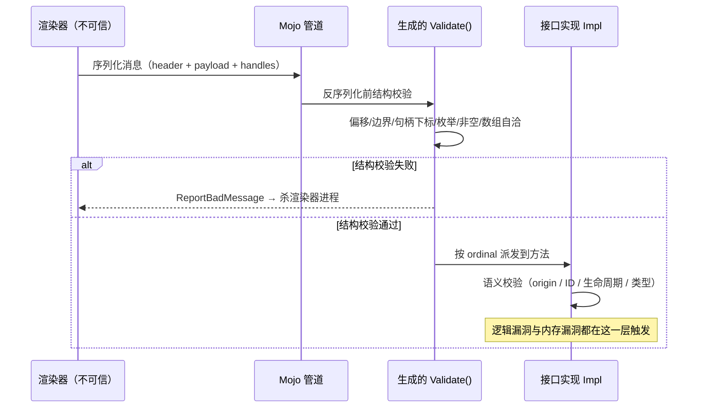
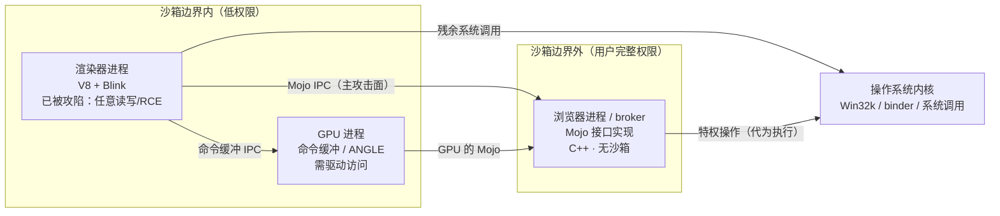
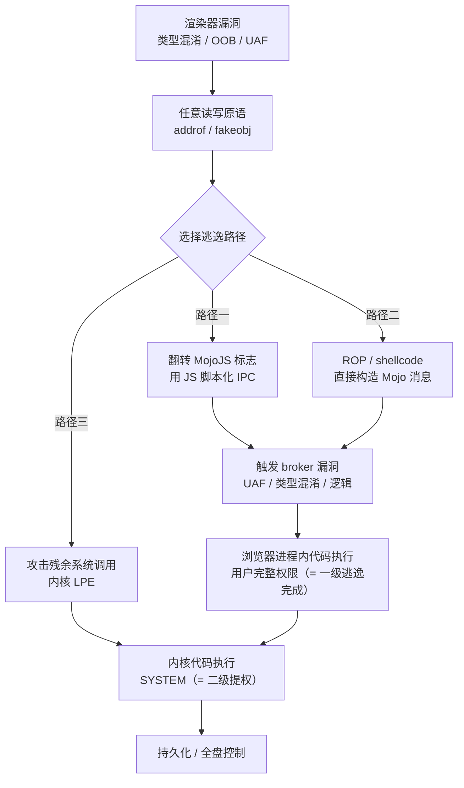

# 浏览器与JS引擎漏洞（12）· 沙箱逃逸原理
> [!abstract] TL;DR
> - 沙箱逃逸是完整利用链的“下半场”：拿到渲染器里的任意读写/RCE 只是把攻击者关进了沙箱，逃逸才是从低权限渲染器**跨到无沙箱的浏览器进程（broker）乃至内核 SYSTEM** 的那一跳；两半可独立替换，因此漏洞市场按“渲染器漏洞 + 逃逸漏洞”分开计价。
> - 现代主攻击面是 **Mojo IPC**：浏览器进程用 C++ 处理来自“应假定已被攻陷”的渲染器的消息，正好踩中 Chromium 自己的 **Rule of 2** 禁区，于是**每一个 mojom 接口方法都是攻击面**。
> - broker 漏洞分三大类——反序列化/核心 Mojo 层的内存破坏、接口实现里的 **UAF/类型混淆**（常经渲染器可控的对象 ID 触发）、以及信任渲染器**自报 origin/权限**的逻辑型“混淆代理”。
> - 工程化逃逸常先**翻转 MojoJS 绑定标志**，把逃逸逻辑从 ROP 降维成 JavaScript，直接在 JS 里脚本化调用浏览器进程接口。
> - 防御重心在浏览器进程本身：**Site Isolation 的 origin 校验、MiraclePtr/BackupRefPtr 抑制 UAF、服务化（service-ification）把危险解析挪进沙箱化 utility 进程、以及用 MojoLPM 对 IPC 调用序列做模糊测试**。

## 概述与定位

前十一篇把镜头对准了渲染器内部：从 V8 的解析、字节码、JIT，到类型混淆、`TheHole`、OOB、`addrof`/`fakeobj`，直到把任意读写升格为渲染器内的代码执行（第 09 篇），再到 DOM 引擎与 WebAssembly 提供的原语（第 10、11 篇）。这一整套的**终点，只是拿下了一个被沙箱牢牢关住的进程**。渲染器进程在 Windows 上跑在受限令牌 + 低完整性 + Job 限制 + Win32k 锁定（乃至 AppContainer）之下，在 Linux 上被 seccomp-bpf 与 namespace 双层封住，在 macOS 上被 Seatbelt 配置文件约束，在 Android 上被 SELinux 的 `isolated_app` 域收得极紧。它读不了任意文件、连不了任意网络、发不出大多数系统调用、看不见别的站点的数据。

**沙箱逃逸（sandbox escape）就是打破这层边界的技术**：让攻击者的代码从沙箱内的低权限进程，跃迁到沙箱外的高权限上下文。这里要先厘清“逃逸”的两级目标，很多讨论把它们混为一谈：

- **一级逃逸——到达浏览器进程（broker）**：浏览器进程不受沙箱约束，以当前登录用户的**完整权限**运行。拿到它的代码执行，就能读写用户所有文件、窃取全部 Cookie 与登录态、跨越 Site Isolation 读任意源、落地持久化。对绝大多数攻击目的，这已经是“逃逸成功”。
- **二级提权——到达内核 SYSTEM**：浏览器进程仍只是用户态用户权限。要拿到 SYSTEM/root，还需一枚内核本地提权（LPE）。它可以从渲染器直接打（利用沙箱放行的残余系统调用面，如 Win32k、binder），也可以先到浏览器进程再打内核。

本篇聚焦**逃逸这一跳的原理**，种子三点——**IPC 攻击面、broker 漏洞、逃逸链**——正是它的三根支柱。边界上要与相邻篇明确切割：第 02 篇《多进程与沙箱模型》讲的是沙箱**怎么建**（令牌、seccomp、AppContainer 的构造），本篇讲的是沙箱**怎么被绕**；第 11 篇讲**渲染器/DOM 侧**的漏洞（逃逸的“上半场”入口），本篇假定上半场已完成、手里已有渲染器内的任意读写；第 13 篇《V8 沙箱与 CFI》讲**缓解**，本篇只在“逃逸的障碍”这个角度点到浏览器进程侧的专属防御（MiraclePtr、服务化），把 CFI/ACG/V8 堆沙箱的深挖留给第 13 篇。一句话定位：**本篇是把“渲染器内的神”变成“机器上的神”的那道工序。**

## 原理与机制

要理解逃逸，先要理解沙箱把渲染器逼到了什么处境，以及它**没能**堵死什么。

**broker/target 模型。** Chromium 的沙箱是“代理—目标”结构：目标（target，即渲染器/GPU/utility 等）被剥夺权限，凡是需要触碰操作系统资源（开文件、建 socket、创建共享内存、拿窗口句柄）的操作，都不能自己做，而要**把请求发给代理（broker，即浏览器进程）**，由 broker 校验策略后代为执行。这天然决定了：**沙箱边界 = 一条 IPC 边界**。渲染器唯一能“伸出手”的地方，就是它与更高权限进程之间的通信通道。于是逃逸的本质，就是**在这条通道上找一个能让高权限进程做出它本不该做的事的缺陷**。

**三条逃逸路线。** 从渲染器出发，能打的高权限面只有三类：

1. **IPC 到浏览器进程（Mojo）**——今天的绝对主力。浏览器进程实现了成百上千个 Mojo 接口供渲染器调用（文件系统访问、剪贴板、USB/串口/蓝牙、通知、支付、下载……），每个方法都在解析渲染器发来的、**必须假定为敌意**的数据。
2. **经 GPU 进程中转**——GPU 进程为了操作显卡驱动，沙箱天生比渲染器松，且暴露命令缓冲、ANGLE、WebGL/WebGPU 这类复杂解析面。经典链：渲染器 →（命令缓冲 IPC）→ 打穿 GPU 进程 →（GPU 的 Mojo）→ 浏览器进程。GPU 进程常被当作“跳板”。
3. **残余系统调用打内核**——沙箱是白名单，不是真空。放行的那部分系统调用（Windows 的 Win32k 图形栈、Linux `ioctl`/`futex` 等、Android binder）后面就是内核，内核漏洞可直接把渲染器提到 SYSTEM，一步到位跳过浏览器进程。

**为什么 IPC 面成了主力？** 因为内核面被系统性收窄了：Windows 上 **Win32k 锁定（Win32k lockdown）** 把渲染器对图形子系统的巨量系统调用几乎全部禁掉，历史上最肥的内核逃逸面被砍；Linux 的 seccomp-bpf 基线策略把系统调用集压到很小。内核面变窄，逼得攻击者转向 IPC——而 IPC 面却随着 Web 平台能力膨胀而**越来越大**：每加一个 Web API（WebUSB、File System Access、WebHID……），就多一组浏览器进程侧的 Mojo 接口暴露给不可信渲染器。这是一对结构性矛盾：**Web 平台越强大，broker 攻击面越宽。**

**统摄一切的设计原则：Rule of 2。** Chromium 安全团队的“二之法则”是理解逃逸攻防的钥匙：当一段代码同时满足（a）处理不可信输入、（b）用不安全语言（C++）写、（c）不在沙箱里运行——这三条最多只能占两条。浏览器进程恰恰**不在沙箱里且是 C++**，所以它**绝不该直接解析不可信输入**。可现实是它必须接收渲染器的 IPC，于是每一处“浏览器进程亲手解析渲染器数据”的地方，都是对 Rule of 2 的违反、都是攻击面。整个防御方向（把解析挪进沙箱化 utility、改用 Rust、用安全抽象）都是在还这笔债。

**威胁模型：渲染器即敌人。** 这是浏览器进程侧代码必须刻进 DNA 的假定——**任何一个渲染器都可能已被完全攻陷**，它发来的每个字段、每个 ID、每个 origin 声明、每个句柄都可能是精心构造的谎言。Site Isolation 之后这条尤为关键：一个渲染器只被允许“代表”特定站点，它自报 `https://bank.com` 时，浏览器进程**必须**用 `ChildProcessSecurityPolicy` 独立核验“这个进程真的有权代表这个源吗”。凡是省了这道核验、直接信了渲染器自报值的地方，就是逻辑型逃逸/越权的温床。

**Mojo 的能力模型。** Mojo 句柄是**能力（capability）**：持有一个指向某接口的管道端点，就等于拥有调用该接口的权力。渲染器不能凭空创建 OS 句柄，句柄由浏览器进程按策略颁发并通过管道传递。这把“逃逸”进一步精确化为两件事：要么**滥用你已被授予的能力**（在允许调用的接口里找 bug），要么**骗浏览器进程多给你一个能力**（句柄混淆、越权绑定接口）。

## Mojo IPC 序列化与 broker 攻击面详解

这一段是本篇的核心：把逃逸主战场——Mojo——从线格式、反序列化校验，一路拆到漏洞到底藏在哪。

### Mojo 是什么

Mojo 是 Chromium 的现代 IPC 框架，取代了古早的 Chrome IPC（`IPC::Message` + `ParamTraits`）。它提供三种原语：**消息管道（message pipe，双向、传结构化消息与句柄）**、**数据管道（data pipe，单向、传字节流）**、**共享缓冲（shared buffer，跨进程共享内存）**。接口用 `.mojom` IDL 描述，经 mojom 编译器生成 C++ 绑定（还有 `-blink` 变体与 JS 变体）。调用侧持有 `Remote<T>`，实现侧持有 `Receiver<T>`，两端由一对管道端点连接。一个 mojom 方法调用会被序列化成一条 `mojo::Message`，其 `name` 字段是**方法序号（ordinal）**，接收端据此派发到对应实现函数。

```
// 一个（示意的）暴露给渲染器的浏览器进程接口
interface FileHelper {
  // 逻辑漏洞高发点：path 由渲染器提供，broker 必须独立校验其读权限
  ReadFile(string path) => (bool ok, array<uint8> data);
  // 内存漏洞高发点：id 是渲染器可控的对象键，误用即 UAF/类型混淆
  Release(uint64 id);
};
```

### 线格式：反序列化面朝渲染器敞开

一条 Mojo 消息在管道里是一段扁平字节缓冲 + 一组带外句柄。理解它的编码，才能理解校验要挡什么、漏在哪。

```
// Mojo 消息头（随版本增长，前缀兼容）
StructHeader    { uint32 num_bytes; uint32 version; }
MessageHeader   { StructHeader; uint32 name;  uint32 flags; }             // V0
MessageHeaderV1 { ...; uint64 request_id; }                              // 需要响应时
MessageHeaderV2 { ...; GenericPointer payload; Pointer<uint32[]> ids; }  // 关联接口

// 指针：相对偏移编码。字段里存的不是绝对地址，而是“从本字段位置向后跳多少字节”
真实地址 = &指针字段 + 偏移值        // 偏移 0 约定为 null

// 句柄：不落在缓冲区内。缓冲区里存的是“句柄表下标”
handle_field = index → message.handles[]     // 0xFFFFFFFF 表示 null/无效

// 结构体：StructHeader 之后紧跟各字段；数组 = 头(元素数,字节数)+元素；
// 字符串 = uint8 数组；联合体带类型标签；map = 两个等长并行数组
```

这里每一处编码选择都是**校验必须覆盖的攻击点**。相对偏移指针意味着：一个恶意偏移可能指向缓冲区外，或指回自身造成环、或让两个字段重叠。数组的“声明元素数”与“声明字节数”可能自相矛盾，`元素数 × 元素大小` 可能整数溢出。句柄下标可能越界访问句柄表。联合体的类型标签可能与实际负载不符，诱发类型混淆。这些正是历史上核心 Mojo 层内存漏洞的来源。

### 反序列化校验：挡住了什么，没挡什么

mojom 编译器为每个结构体生成 `Validate()`，在真正反序列化前先做一遍结构性体检，失败即产生 `ValidationError`（如 `ILLEGAL_POINTER`、`ILLEGAL_MEMORY_RANGE`、`UNEXPECTED_NULL_POINTER`、`ILLEGAL_HANDLE`、`UNKNOWN_ENUM_VALUE`、`DIFFERENT_SIZED_ARRAYS_IN_MAP` 等），随后调用 `ReportBadMessage`——**直接杀掉这个行为不端的渲染器**。校验覆盖的是**结构层**：偏移是否落在缓冲区内、`num_bytes` 是否自洽、句柄下标是否有效、非空字段是否真的非空、枚举取值是否已知、数组元素数与字节数是否匹配、`map` 的键值数组是否等长。

关键在于它**挡不住语义层**。`Validate()` 保证“这段字节是一个结构良好的 `ReadFile(path)` 请求”，但它**无法知道**这个渲染器是否有权读这个 `path`、这个 `id` 是否指向一个仍然存活且类型正确的对象、这个 origin 是否是该进程可以代表的。**语义校验是接口实现（Impl）自己的责任**——而漏洞就密集地藏在“实现忘了校验”或“校验有误”的缝隙里。这也解释了为何结构性反序列化 bug 稀有而实现层 bug 泛滥：编译器把结构校验自动化了，语义校验却只能靠人写、靠人记得写。



### broker 漏洞的五大类

**（1）核心 Mojo 与反序列化的内存破坏。** 藏在框架层而非某个业务接口里，因此**任意渲染器、几乎零前提**即可触发，威力最大也最稀有。典型形态：数组 `元素数 × 元素大小` 的整数溢出导致校验算出的边界偏小、随后 OOB 读写；关联接口 ID（`MessageHeaderV2` 里的 `payload_interface_ids`）处理不当；node/port 模型里端口合并（`MergePorts`）、端口状态机的错误处理造成的 UAF。Mojo 底层近年从旧的 “EDK” 换成了 **ipcz**（portal/parcel/driver 模型），逆向发布版 Chrome 时要知道你面对的是 ipcz。

**（2）接口实现里的 UAF / 类型混淆（经渲染器可控 ID）。** 这是数量最多的一类。浏览器进程常按渲染器提供的 ID（frame id、request id、某对象句柄值）在一张表里查对象。若“释放”与“使用”的时序可由渲染器编排、或 ID 校验错位，就是 UAF。经典模式：方法 A 存下一个裸指针 → 方法 B 触发该对象析构 → 方法 C 再用那个裸指针。类型混淆则常来自：用同一个 ID 命名空间承载多种对象类型，取用时未核实类型标签。

```
// broker 端 UAF 的抽象骨架（渲染器全程编排时序）
void Impl::Open(uint64 id)  { table_[id] = new Object();            } // 建
void Impl::Close(uint64 id) { delete table_[id]; /* 忘了擦表项 */   } // 释放但留悬垂
void Impl::Use(uint64 id)   { table_[id]->DoWork();                } // Close 后再 Use → UAF
```

**（3）逻辑型“混淆代理”（信了渲染器自报的 origin/权限）。** 内存安全但危害同样致命，且常能绕过所有内存缓解。浏览器进程被诱导替渲染器做一件它本无权做的事：把文件下载到任意路径、读取别的源的 Cookie、授予某项权限、提交一个它无权提交的 URL。**Site Isolation 把 origin 校验推到了生死线**：实现必须调用 `CanAccessDataForOrigin` / `CanCommitOriginAndUrl` / `CanReadFile` 之类核验渲染器进程的真实权限，凡是省了这道核验直接信 `params.origin` 的，就是通用越权读乃至逃逸。

**（4）句柄 / 能力混淆。** 渲染器把一个数据管道句柄塞到期望消息管道句柄的位置，若实现只按“是不是句柄”而非“是不是正确类型的句柄”取用，就可能类型混淆；或诱导浏览器进程颁发一个比预期更强的句柄，直接扩权。

**（5）竞态：Sync 重入与共享内存 double-fetch。** mojom 的 `[Sync]` 方法会阻塞调用方等响应，处理期间若嵌套派发别的消息，可导致重入型状态破坏。共享缓冲更阴险：浏览器进程若把渲染器共享来的内存里某字段**读两次**（一次校验、一次使用），渲染器可在两次读之间用另一线程改写它——经典 **double-fetch（TOCTOU）**，让“已校验”的值在使用时已非法。共享内存里的一切都在渲染器持续掌控之下，所以浏览器进程从共享缓冲取值的正确姿势是**读一次到本地栈变量、校验它、之后只用这份副本**。



### 从任意读写到脚本化逃逸：MojoJS 降维

拿到渲染器任意读写后，直接用 ROP 手搓一条 Mojo 消息（构造缓冲、编码偏移、挂句柄、写管道）非常繁琐且脆弱。工程上更漂亮的做法是**翻转 MojoJS 绑定标志**，把逃逸逻辑降维成 JavaScript。

原理：Blink 里每个 frame 有一个绑定策略位掩码（`RenderFrameImpl::enabled_bindings_`，含 `kMojoWebUI` 等位）。当 Mojo 绑定位被置上时，该 frame 的 JS 上下文会通过 `MojoBindingsController` 暴露出全局 `Mojo` 对象，从而能用生成的 `*.mojom.js`（lite 绑定）**直接在 JS 里创建 `Remote`、绑管道、调用浏览器进程接口**。研究/测试构建可用启动开关（如 `--enable-blink-features=MojoJS,MojoJSTest`）显式打开；而利用场景里，攻击者用已有的渲染器读写原语**定位该 frame 对象并把绑定位改上**，随后整套逃逸就变成可读可调的脚本。这就是为什么现代逃逸 PoC 常见到“先 enable MojoJS，再几行 JS 调接口打 broker”的形态——它把不稳定的内存手术，换成了稳定的接口调用。

```
// 概念示意：仅限研究/测试构建（--enable-blink-features=MojoJS）或已获授权环境
let helper = new blink.mojom.FileHelperRemote();
helper.$.bindNewPipeAndPassReceiver();     // 取得指向 broker 实现的管道端点
let { ok, data } = await helper.readFile("/etc/hostname");
// 有了脚本化的接口调用，触发上文五类 broker 漏洞就从“手搓字节”变成“调 API”
```

从防御角度看，这也解释了为什么“不可信 frame 绝不应能置上 Mojo 绑定位”是一条硬红线，以及为什么把该位的存储纳入 V8 堆沙箱/额外完整性校验（第 13 篇主题）如此重要。

### 组装逃逸链

把上半场与下半场拼起来，一条典型的完整链如下。注意它的**模块化**：渲染器漏洞与逃逸漏洞相互解耦，可各自替换——这正是漏洞经济学里“两半分开计价、n-day 拼链”的根源。



### 平台与版本差异

逃逸的“下半场”高度依赖操作系统，逆向时务必分清：

- **Windows**：目标是浏览器进程（中完整性、用户权限）。渲染器侧还叠了 ACG（禁新建 RWX，逼 ROP）、CIG（只加载签名镜像）、CET 影子栈。Chromium 自己的**沙箱策略 IPC**（区别于 Mojo，是拦截目标进程 API 调用转交 broker 审批的那套）也是一处逃逸面——策略写宽了就放行了本不该放行的文件/注册表操作。
- **Linux**：seccomp-bpf 把系统调用压到极小，逃逸主要靠 Mojo broker 漏洞或内核在放行系统调用后的 bug。文件访问由 broker 中转。
- **macOS**：Seatbelt 配置文件 + Mach IPC/XPC。逃逸常经 Mach 消息 bug 或某个特权 XPC/窗口服务。
- **Android**：渲染器在 `isolated_app`（SELinux + seccomp，极紧）。浏览器进程本身只是**应用权限**，一级逃逸的收益远小于桌面；要真正提权需打 **binder/内核**或 `system_server`。
- **历史演进**：老攻击面（NPAPI 插件、PPAPI/Pepper Flash）早已移除；PDFium 已沙箱化；IPC 从 `IPC::Message` → Mojo → **ipcz**；WebGPU（2023+）是较新的复杂解析面。这些都决定了你在某个 Chrome 版本上看到的攻击面形态。

## 工具视角与实战

**枚举攻击面。** 逃逸研究的第一步是列清“这个渲染器能绑到哪些浏览器进程接口”。源码侧看 `.mojom` 定义与注册点：frame 作用域接口在 `BrowserInterfaceBroker`/`RenderFrameHostImpl` 一侧登记，进程作用域接口经 `RenderProcessHostImpl::BindReceiver`；`content/browser/browser_interface_binders.cc` 是集散地。要分清**哪些接口暴露给普通网页 frame、哪些仅限 WebUI/扩展**——普通 frame 能绑到的才是低门槛逃逸面。

**MojoJS 做原型。** 在研究/测试构建里用 `--enable-blink-features=MojoJS` 打开 JS 绑定，配合生成的 `*.mojom.js`，可以直接在控制台里驱动任意接口、快速试探参数校验边界、复现 UAF 时序。这是把“想法”变成“可跑 PoC”的最快通道，也是审计时快速摸接口行为的利器。

**模糊测试。** Mojo 的旗舰 fuzzer 是 **MojoLPM**（基于 libprotobuf-mutator）：它把“一串跨接口的 IPC 调用序列”编码成 protobuf，变异调用顺序与参数，专门猎杀浏览器进程里的 UAF、类型混淆与逻辑态错乱——因为很多 broker bug 需要**多次调用按特定顺序**才能触发，单消息 fuzzer 抓不到。配合 `mojo::MessageDumper` 录制真实会话作种子、`ReportBadMessage` 计数与 ASan/`ClusterFuzz` 流水线放大规模。方法论细节与 harness 写法见 [[49.Fuzzing与漏洞挖掘/15.浏览器与JS引擎Fuzzing]]。

**逆向闭源浏览器。** 面对发布版 Chrome/Edge 二进制，mojom 方法退化成 ordinal，要在生成的 `Accept`/`AcceptWithResponder` 派发表里认接口、认序号；底层是 ipcz，要熟悉 portal/parcel 结构。定位接口实现后，在 Impl 方法下断、观察管道流量，逐步还原语义。

**沙箱与进程自省。** Windows 用 `chrome://sandbox` 看沙箱状态，Process Explorer/Process Hacker 看目标进程的令牌、完整性级别、`ProcessMitigationPolicy`（ACG/CIG/CET 是否开启），WinDbg 里 `!token` 查受限令牌。Linux 用 `chrome://sandbox` + 检查 seccomp 策略、在沙箱下 `strace` 观察被拦系统调用。附内存原语一节可回看 [[33.二进制漏洞与利用基础/15.ASLR与PIE绕过技术]]，JIT/推测优化如何埋下上半场入口见 [[41.Compiler|编译器与 JIT 优化]]。

**调试浏览器进程。** 逃逸调试的对象是**浏览器进程**而非渲染器：在目标 Impl 方法、`ReportBadMessage`、对象析构处下断，用 `chrome://tracing` 观察 IPC 时序，是复现竞态/UAF 的常规手法。

## 安全性与正确使用

> [!caution] 合规边界
> 本文所有原理、代码骨架与工具用法，**仅面向**：你**拥有或已获得书面授权**的环境、CTF 靶场，以及以**防御与教育为目的**的安全研究。沙箱逃逸直达他人机器的完整用户数据乃至 SYSTEM，滥用即属严重犯罪。因此本文**一律采取防御/教育视角，只讲清原理与漏洞类别，不提供针对真实生产系统或他人设备的武器化步骤，不给出“打某个真实目标”的成品配方，也不为绕过任何商业软件授权提供可操作方案**。文中 MojoJS、UAF 骨架等均为原理示意，刻意省略可直接落地的偏移/gadget/稳定化细节。发现真实漏洞请走**负责任披露**（Chrome VRP 等官方渠道），而非利用或交易。

理解逃逸原理的正当价值，全在**把浏览器造得更难逃**。对防御者，本篇每一类漏洞都对应一条可执行的加固：

- **接口最小化**：新增 Mojo 接口须过 Chromium 的 **IPC 安全评审**，问清“这个能力真要暴露给不可信 frame 吗、frame 作用域够不够小”。能不暴露就不暴露，是压攻击面最有效的一招。
- **语义校验强制化**：凡涉及 origin 的方法，必须 `CanAccessDataForOrigin`/`CanCommitOriginAndUrl` 独立核验，绝不信渲染器自报；越权即 `ReportBadMessage` 杀进程。把“渲染器是敌人”写进每一个 Impl。
- **抑制 UAF——MiraclePtr/BackupRefPtr**：浏览器进程里用 `raw_ptr<T>` 替换裸指针，由 PartitionAlloc 引用计数把仍被引用的已释放块**隔离并投毒**，悬垂解引用变成崩溃而非可利用 UAF。它**优先部署在浏览器进程**，正因为那是逃逸落点。要清楚其覆盖边界（栈上指针、联合体等不完全覆盖）。
- **服务化（service-ification）**：把网络、存储、音频、图片/JSON 解析等危险解析从浏览器进程搬进**沙箱化 utility 进程**（Network Service、Data Decoder 等），偿还 Rule of 2 的债——一个解析 bug 从“直接 SYSTEM 级损失”降级为“又一个待逃逸的沙箱进程”。
- **持续模糊 + 内存安全语言**：MojoLPM/ClusterFuzz 常态化猎 broker bug；对新解析器优先选 Rust。这些与 double-fetch 的正确写法（读一次、校验、只用副本）一起，构成 broker 代码的基本卫生。

## 小结

沙箱逃逸是浏览器完整利用链的下半场，把渲染器内的任意读写兑现为对整台机器的控制。它的战场是**沙箱边界这条 IPC 通道**：内核面被 Win32k 锁定与 seccomp 收窄后，**Mojo IPC 成了主攻击面**，而浏览器进程用 C++ 解析不可信渲染器数据的处境正踩中 Rule of 2 的禁区，令每个 mojom 方法都成为攻击点。broker 漏洞归为核心反序列化内存破坏、实现层经可控 ID 的 UAF/类型混淆、以及信任渲染器自报 origin 的逻辑混淆代理三大类；工程上常先翻转 MojoJS 绑定把逃逸降维成脚本，再触发这些漏洞，最终落到浏览器进程（一级逃逸，用户权限）或经内核 LPE 到 SYSTEM（二级提权）。防御的重心与攻击对称地落在浏览器进程本身：Site Isolation 的 origin 硬校验、MiraclePtr 抑制 UAF、服务化削减解析面、MojoLPM 常态模糊。至于把这些缓解推向体系化——V8 堆沙箱、CFI、ACG 的深层机制——是下一篇的主题。

## 相关阅读

- 同系列：[[00.浏览器与JS引擎漏洞总览|系列总览]]、[[02.多进程与沙箱模型]]（沙箱怎么建，本篇的对偶）、[[09.从任意读写到RCE]]（逃逸的上半场终点）、[[11.渲染器漏洞与DOM引擎]]（上半场入口）、[[13.浏览器漏洞缓解：V8沙箱与CFI]]（缓解的体系化）
- 同库交叉：[[33.二进制漏洞与利用基础/15.ASLR与PIE绕过技术]]、[[41.Compiler|编译器与 JIT 优化]]、[[49.Fuzzing与漏洞挖掘/15.浏览器与JS引擎Fuzzing]]、[[40.WASM与虚拟化壳逆向/06.WASM内存模型与线性内存安全]]
- 官方文档（Chromium 源码树内一手资料，非搬运）：`docs/security/rule-of-2.md`（The Rule of Two）、`docs/security/compromised-renderers.md`（受损渲染器威胁模型）、`mojo/README.md` 与 `docs/mojo_and_services.md`（Mojo 与服务化）、`docs/design/sandbox.md`（Windows 沙箱）、`docs/linux/sandboxing.md`（Linux 沙箱）、Site Isolation 与 MiraclePtr/BackupRefPtr 设计文档
- 工具与背景：MojoLPM fuzzer 文档、Google Project Zero 关于 Mojo 与沙箱逃逸的公开分析文章、《The Art of Software Security Assessment》（审计方法论）

[[00.浏览器与JS引擎漏洞总览|⬆ 系列总览]] | [[11.渲染器漏洞与DOM引擎|← 上一章]] | [[13.浏览器漏洞缓解：V8沙箱与CFI|→ 下一章]]
