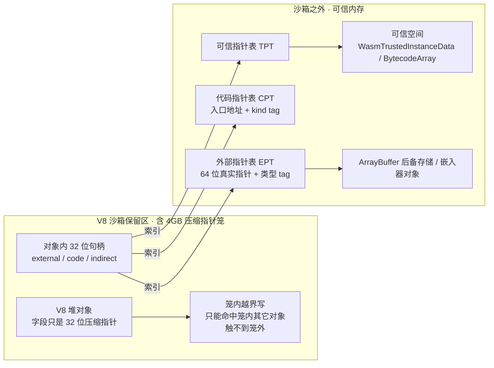
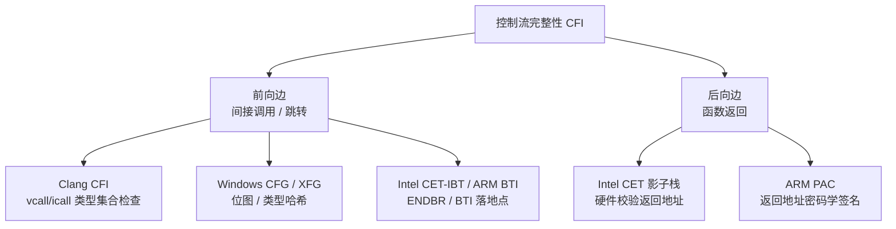
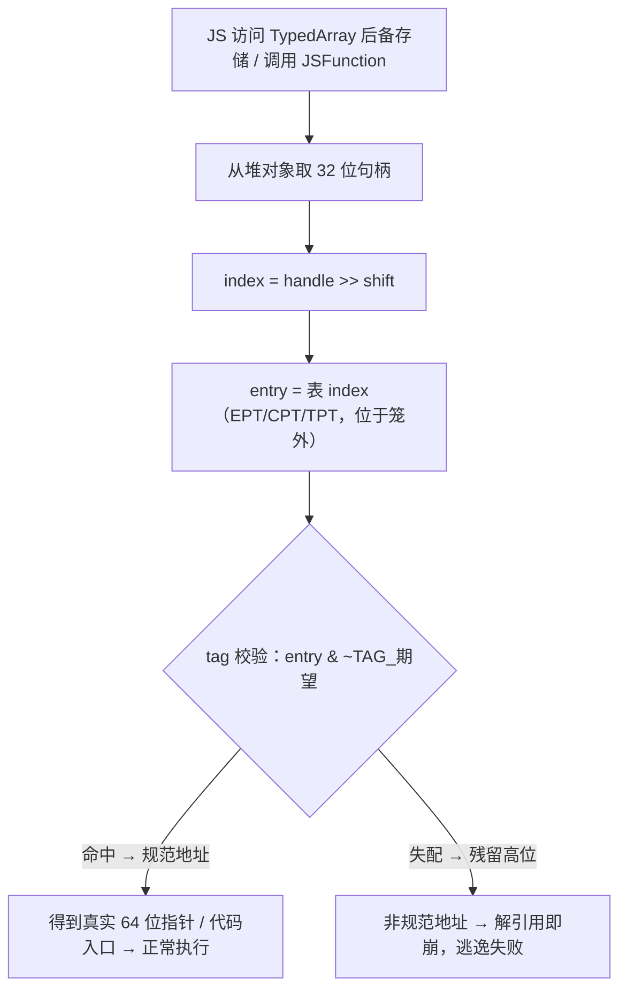
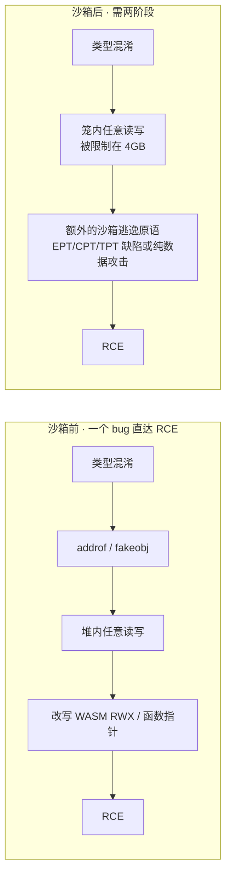

# 浏览器与JS引擎漏洞（13）· 浏览器漏洞缓解：V8沙箱与CFI

> [!abstract] TL;DR
> - **威胁模型被反转**：V8 沙箱不假设"攻击者还没拿到读写"，而是**假设攻击者已经在 V8 堆内拥有任意读写**（因为第 6~9 章的类型混淆几乎稳定给出这个原语），目标是阻止"**堆内**任意读写"升级成"**进程内**任意读写/RCE"。它是渲染器**内部的纵深防御层**，不是安全边界——真正的边界是第 2/12 章的进程/OS 沙箱。
> - **指针压缩把破坏面关进 4GB 笼**：堆内对象互引用只用 32 位压缩指针（cage base + 偏移），因此破坏一个堆指针最多打到笼内 4GB 的别的对象，**打不到笼外**。能指向笼外的裸指针（后备存储、代码入口、可信对象）才是逃逸口，于是被逐类搬到笼外的**间接表**。
> - **外部指针表 EPT + 类型 tag**：ArrayBuffer 后备存储等裸指针不再内联在堆里，而是存成 32 位句柄索引一张笼外的表；表项高位打**类型 tag**，用错类型读会残留高位 → 非规范地址 → 解引用即崩，堵死"改写后备存储指哪打哪"。
> - **代码指针表 CPT + 可信空间 TPT**：JIT 代码入口、WASM 实例、字节码这些"改一个就直接 RIP/RCE"的东西被移出笼、走句柄间接化——直接针对第 10 章的 WASM RWX 与函数指针改写。
> - **CFI 两条边**：前向边（Clang CFI / Windows CFG-XFG / Intel CET-IBT / ARM BTI）约束间接调用跳转目标；后向边（Intel CET 影子栈 / ARM PAC）保护返回地址。粗粒度 vs 细粒度、硬件 vs 软件各有取舍。
> - **绕过是常态、不是例外**：沙箱把门槛抬到"**要两个 bug**"，绕过来自未迁移的内联指针、纯堆内数据攻击、表逻辑缺陷；CFI 被整函数/循环 gadget、COOP、PAC 签名 oracle 削弱。纵深防御的价值是**让利用链更长更脆**、成本更高，而非不可破。

## 概述与定位

本章是整个系列的"守方总结"。第 6~10 章一步步搭出进攻流水线：JIT 类型混淆 → `addrof`/`fakeobj` → 堆内任意读写 → 改写 WASM 的 RWX 页或某个函数指针 → RCE。这条链条在 2015~2021 年间近乎"一个 bug 通吃"：拿到任意读写后，剩下的都是确定性的机械步骤。本章讲的正是**专门用来打断这条流水线后半程的缓解**——V8 沙箱与 CFI，以及围绕它们的绕过博弈。种子要点"指针压缩沙箱、CFI、缓解与绕过"三条主线，恰好对应"把破坏关进笼子（沙箱数据面）、把控制流钉死（CFI 控制面）、以及攻防如何继续（绕过）"。

**首先要厘清一个极易混淆的术语：这里有两个都叫"沙箱"的东西，它们是完全不同的层。** 一个是**进程/OS 沙箱**（seccomp-bpf、Windows AppContainer/Job、macOS Seatbelt，见第 2、12 章）：它是渲染器进程与操作系统之间的**真安全边界**，被攻破才谈得上"沙箱逃逸"、拿用户数据或提权。另一个是本章的 **V8 沙箱（V8 Sandbox，早期叫 heap sandbox / ubercage）**：它运行在**渲染器进程内部**，只管 V8 堆这一块内存，是一道**纵深防御（defense-in-depth）**，被绕过并不等于逃出进程沙箱。V8 官方长期强调"V8 沙箱现阶段还不是一条安全边界"——它的定位是**提高利用成本**，而不是提供不可逾越的保证。把这两个"沙箱"混为一谈，会导致对威胁模型的根本误读。

**其次是威胁模型的反转，这是理解 V8 沙箱一切设计的钥匙。** 传统内存缓解（栈金丝雀、ASLR、DEP/W^X）都建立在"**攻击者还没拿到任意读写**"的前提上，努力阻止"从一次溢出走到控制读写"。但 JIT 类型混淆是逻辑 bug，它**极其稳定地**直接给出堆内任意读写（第 6~9 章），上述传统缓解对"编译器算错地址"几乎无感。V8 团队于是做了一个务实但深刻的假设：**干脆认定攻击者已经拥有 V8 堆内的任意读写**，然后问——在这个前提下，怎样才能不让它变成进程级读写和代码执行？答案就是把 V8 堆本身"关进笼子"，让堆内破坏无法自然外溢。这是一种"**遏制（contain），而非阻止（prevent）**"的设计哲学，也是它和一切传统缓解在思路上的分水岭。

**CFI 则是与内存 bug 类别正交的一层。** 无论破坏来自 UAF、OOB 还是类型混淆，攻击者最终若想执行代码，多半要**劫持一次间接调用/跳转/返回**去落到自己想要的地方。CFI 直接约束"控制流能去哪儿"，从控制面而非数据面加固。它和 V8 沙箱互补：沙箱管"数据指针能指哪"，CFI 管"代码流能跳哪"。

边界上，本章**不**重复第 12 章的进程沙箱逃逸细节，**不**展开第 10 章 WASM 利用本身，而是聚焦"渲染器内、V8 层"的缓解机理与绕过博弈；WASM RWX 只在"CPT/可信空间如何专门拆解它"这一点上被提及。

## 原理与机制

### 指针压缩：先为省内存，后成安全基石

指针压缩（Pointer Compression，V8 8.0 起）最初的动机是**省内存**：64 位平台上一个裸指针 8 字节，而 V8 堆里全是互相指来指去的对象，指针能占到堆的一多半。V8 的做法是把**一个 isolate 的整个堆放进一块 4GB 对齐的"笼（cage）"**，堆内对象之间不再存 64 位裸指针，而只存 **32 位压缩值**——它是相对于**笼基址（cage base）** 的偏移。取用时 `全指针 = cage_base + 压缩值`，笼基址常驻一个专用寄存器（根寄存器）。指针体积减半，缓存命中率还顺带提高。

这个"省内存"的决定，事后成了沙箱的**物理地基**：既然堆内互引用只有 32 位，那么**无论怎么破坏一个堆内指针字段，解压后也只能落在 cage_base 起 4GB 的范围内**——你改不出一个指向笼外任意进程地址的堆指针。破坏面天然被 32 位地址空间"焊死"在 4GB 里。V8 沙箱正是把这个副作用**提升为显式的安全属性**：围绕 4GB 笼再保留一大片地址空间（约 1TB 量级）并在两侧放**守卫区（guard region）**，使得即便发生 32 位范围的越界，也无法触及保留区之外的内存——一切"堆内寻址"都被关在笼子里。

这里还要提标签（tagging）：V8 用指针最低位区分 **Smi**（小整数，tag=0）与 **HeapObject**（堆对象指针，tag=1）。压缩模式下 Smi 是 31 位整数（值 = 压缩值 >> 1），HeapObject 的压缩值带着 tag=1，字段访问时按 `对象地址 = cage_base + 压缩值 - 1` 取真正的对象头。这一位标签同时是 GC 与类型判定的基础。

### 逃逸口：三类"必须指向笼外"的指针

笼子把"堆内互引用"关住了，但 V8 堆对象不可避免地要引用**笼外**的东西，这些就是天然的逃逸口，必须逐类堵上：

1. **外部指针（external pointer）**：ArrayBuffer/TypedArray 的**后备存储**、嵌入器（Blink/Node）塞进对象的**内部字段**、各种 C++ 侧资源的地址。它们指向笼外，压不进 32 位。历史上这是最肥的靶子——改写一个 TypedArray 的后备存储指针，立刻得到"指哪读写哪"的进程级原语。
2. **代码指针（code pointer）**：`JSFunction`/`Code` 对象里的**机器码入口地址**。改写它 = 直接控制下一次调用的 RIP，是通往 RCE 最短的路。
3. **可信指针（trusted pointer）**：`WasmTrustedInstanceData`（含 WASM 内存基址、函数表、导入目标）、`BytecodeArray`（解释器直接按它执行）、以及各种"内容被当作代码或裸指针信任"的对象。伪造（fakeobj）出一个假的这类对象，等于直接伪造执行上下文。

V8 的统一思路是**间接化（indirection）**：堆内对象不再内联存这些危险指针，而只存一个 **32 位句柄（handle）**，句柄是**笼外某张表的索引**；真正的 64 位裸指针存在表项里，并打上**类型 tag**。攻击者在笼内改句柄，最多只能改成"指向表里另一个合法条目"，而**无法凭空构造出一个指向任意地址的表项**——因为表在笼外，他（按威胁模型）只有笼内读写。三类指针对应三张表：**外部指针表 EPT、代码指针表 CPT、可信指针表 TPT**。



### CFI：前向边与后向边

控制流完整性（Control-Flow Integrity）的经典二分：**前向边**管"间接调用/间接跳转"能去哪——函数指针调用、C++ 虚调用、跳转表；**后向边**管"函数返回"能回哪——`ret` 用的是栈上的返回地址，一旦栈溢出改了它就是 ROP。浏览器工程实践里两条边各有软硬件方案：

- 前向边：**Clang/LLVM CFI**（编译期+LTO，类型集合检查，Chrome 在 Linux/Android/CrOS 上启用）、**Windows CFG/XFG**（位图/类型哈希）、**Intel CET-IBT**（`ENDBR64` 落地点，硬件）、**ARM BTI**（`BTI` 落地点，硬件）。
- 后向边：**Intel CET 影子栈**（硬件双栈校验返回地址，Windows"硬件强制栈保护"）、**ARM PAC 指针认证**（对返回地址做密码学签名，Apple arm64e 大规模部署）。



## 结构与算法详解：沙箱与 CFI 的位级实现

这一段把上面的机制拆到字节、位、指令级别。先沙箱数据面，再 CFI 控制面。

### 压缩指针的位布局与解压

```
压缩值（32 位，存在堆对象字段里）：
  [31 .............................. 1][0]
                 偏移 / 载荷              tag
  tag=0 → Smi：      值 = 压缩值 >> 1（31 位有符号整数）
  tag=1 → HeapObject：全指针 = cage_base + 压缩值
                       对象头地址 = 全指针 - 1（减去 kHeapObjectTag）

解压（等价快写法，笼 4GB 对齐）：
  full = (cage_base & 0xFFFFFFFF_00000000) | 压缩值
  即"用笼基址的高 32 位拼上压缩值的低 32 位"，一条指令搞定。
```

关键在**为何 4GB 对齐**：笼首地址低 32 位全 0，解压就退化成"高低半拼接"，无需真正加法，且保证结果永远落在同一个 4GB 窗口。这既是性能优化，也是安全约束——**任何被篡改的压缩值，解压后都在 `[cage_base, cage_base+4GB)` 内**，越不出去。

### 外部指针表 EPT：类型 tag 即"指针投毒"

EPT 的核心巧思是把**类型混淆检查**做成**免分支**的：

```
EPT 表项（64 位，位于笼外）：
  [63][62][61 ........ 48][47 ..................... 0]
   —   M    类型 tag(15位)     真实指针（≤48 位规范地址）
  M = GC 标记位；x86-64 用户态规范地址要求 bit48~63 = 0

读取（期望类型 T，其 tag 常量记为 TAG_T，高位有特定置位）：
  index   = handle >> kExternalPointerIndexShift   // 低位留给 tag/标记
  entry   = EPT[index]
  pointer = entry & ~TAG_T                          // 一次 AND，无分支
  然后直接解引用 pointer

命中（存的就是 T）：  (真指针 | TAG_T) & ~TAG_T = 真指针        → 规范地址，正常
失配（存的是 TAG_S）：(真指针 | TAG_S) & ~TAG_T = 真指针 | (TAG_S & ~TAG_T)
                      → 残留高位被置起 → 非规范地址 → 解引用 #GP 崩溃
```

要让"失配即崩"成立，V8 精心挑选各类型的 tag，使**任意两个 tag 互不为子集**（对任意 `A≠B` 有 `A & ~B ≠ 0`）。这样用错类型读，必然残留至少一个高位，产生**非规范地址**（bit48~63 非零），CPU 一解引用就 `#GP`。于是"把 A 类外部指针当 B 类用"这种类型混淆，从"悄悄拿到错指针"变成"当场崩溃"。攻击者即便在笼内改了句柄，也只能选中表里**另一个已存在的合法条目**，无法伪造出指向任意地址的表项——因为表在笼外，他碰不到。这就是 EPT 把"改写后备存储指哪打哪"这一经典原语彻底拆解的原理。

### 代码指针表 CPT 与可信空间 TPT

**CPT** 是 EPT 的"代码版"。`JSFunction`/`Code` 不再内联存机器码入口，而存一个 CPT 句柄；调用时从 `CPT[index]` 取出**入口地址**并跳转。表项除入口外还带一个 **`CodeEntrypointTag`**（区分 JS 入口、WASM 入口、字节码处理器、正则等），用途和 EPT 的类型 tag 一样：**防止把 WASM 入口当 JS 入口调**这类跨类混淆。攻击者在笼内改 CPT 句柄，最多让函数调用跳到**另一个合法的代码入口**，而**无法把入口改成"堆里一段可控数据的地址"**——直接堵死"改写函数指针指向 shellcode"。

**可信空间（trusted space）+ TPT** 针对的是"内容被信任"的对象。像 `WasmTrustedInstanceData`、`BytecodeArray`，其字段本身就是裸指针或会被当代码/长度直接信任；若它们还待在笼内，攻击者用 `fakeobj` 伪造一个假实例就能直接控制 WASM 内存基址、函数表、导入目标（第 10 章的核心手法）。V8 的对策是把这些对象**搬到笼外的可信空间**，笼内对象通过 **间接指针句柄（indirect pointer handle）** 经 **TPT** 引用它们，表项带 `IndirectPointerTag` 校验类型。于是**在笼内无法伪造一个"看起来合法"的可信对象引用**：句柄只能指向 TPT 里真实存在的可信对象，`fakeobj` 对可信对象失效。这正是"WASM 一把梭"被专门拆解的地方——`WasmInstanceObject` 被拆成"笼内的壳"与"可信空间里的 `WasmTrustedInstanceData`"两半。



### 前向边 CFI 的实现细节

**Clang CFI（虚调用 cfi-vcall）**：对 `obj->foo()`，编译器给每个类在一段专门排布的 vtable 区里分配位置，使"某静态类型 T 的所有合法 vtable"构成一段**连续对齐**的地址区间。调用点先取 vptr，再做一个**范围+对齐**检查 `(vptr - 区间起点) 是否 < 区间大小 且 对齐`；不合法就 `ud2` 陷入。检查只需几条算术+一次比较，极廉价。**cfi-icall** 则给每种函数指针类型维护一个合法目标集合（跳转表/位集），间接调用前校验目标在集合内。Chrome 用 ThinLTO 全程序开启 `-fsanitize=cfi`，配合 `-fvisibility=hidden`。它是**细粒度**的（按类型/类层级判定），但**只覆盖编译期可见的静态代码**，管不到 JIT 运行时产出的机器码。

**Windows CFG（控制流防护）**：编译器在每个间接调用前插 `_guard_check_icall`；加载器建一张**位图**，地址空间每 16 字节一个 bit，是合法函数入口就置位；调用前校验目标 bit。它**粗粒度**——任何合法函数入口都放行。**XFG（扩展流防护）** 在此之上加**类型哈希**：函数体前存一个由其原型算出的哈希，间接调用点用"调用处函数指针类型的哈希"与目标比对，把粒度从"任意函数"收紧到"签名匹配的函数"。

**Intel CET-IBT / ARM BTI**：纯硬件、粗粒度。IBT 要求每个**合法间接跳转目标**处必须是一条 `ENDBR64`（32 位 `ENDBR32`）指令；`call rax`/`jmp rax` 若落到没有 `ENDBR64` 的地方，CPU 直接 `#CP` 异常。ARM BTI 同理，落地点是 `BTI` 指令。它们廉价且硬件强制，但**任何 `ENDBR64` 都算合法**，所以 gadget 必须从函数/跳转表入口起步——常与细粒度软件 CFI 叠用做纵深。

### 后向边 CFI：影子栈与 PAC

**Intel CET 影子栈（Shadow Stack）**：每条 `call` 除了把返回地址压普通栈，还**同时压一份到受保护的影子栈**；`ret` 时硬件比对两者，不一致就 `#CP`。影子栈页在页表里有特殊属性，普通 `mov` **写不进去**（只有 `call`/`ret` 和特权的 `WRSS` 能动），所以攻击者的任意写破坏不了它。这一招**釜底抽薪**地废掉"覆盖栈上返回地址做 ROP"。Windows 以"硬件强制栈保护"暴露，渲染器可按进程开启严格模式。局限：**只保护返回地址**，管不了前向边劫持（JOP/COOP），也管不了数据流攻击。

**ARM PAC（指针认证）**：给指针的**非规范高位**塞一段用 QARMA 类分组密码算出的**签名（PAC）**，密钥存在 EL0 不可读的特权寄存器里。函数入口 `PACIASP` 用（密钥 + 上下文修饰符，返回地址常用 SP 做修饰符）给 LR 签名，返回前 `AUTIASP` 验签；被改过则验签失败——旧行为是把指针改成保证触发崩溃的值，`FEAT_FPAC` 则**当场异常**。PAC 还能护**前向边**：对 C++ vptr、函数指针用**类型/用途相关的修饰符**签名（Apple arm64e 就对返回地址、vtable 指针、部分函数指针普遍签名）。它是目前 Apple 平台（含 JSC）部署最广的 CFI。

### JIT 与 CFI 的天然张力，以及 V8 的结构化答案

CFI 对 JIT 引擎特别棘手，原因有三：其一，**JIT 在运行时生成代码**，编译期的 CFI 元数据根本覆盖不到这些新机器码；其二，JIT 代码页**必须可执行**，历史上 WASM/JIT 的 **RWX 页**是头号靶子（第 10 章）；其三，JIT 的间接跳转（去优化入口、内联缓存跳转、WASM 间接调用）需要引擎**自己**保证目标合法。业界对策分两条：

- **代码区写执行互斥（W^X）+ 快速切换**：不让同一页同时可写可执行。切换用 `mprotect`/`VirtualProtect` 太慢，于是有**线程级内存保护**：Intel MPK/PKU（`WRPKRU` 改保护键，免 TLB 刷新，仅本线程短暂开写）、Apple arm64e 的 APRR/SPRR（JSC 用它让 JIT 区仅在 JIT 线程内短暂可写）。也有**双映射**（一个可写别名、一个可执行别名）——但双映射本身又是攻击面，需谨慎。
- **JIT 专属的运行时 CFI**：JSC 对 JIT 返回地址用 PAC 签名、校验跳转目标，并把 TypedArray 后备存储与 JIT 分配放进 **Gigacage**（笼化，OOB 够不到笼外，思路与 V8 沙箱同源）。V8 这边，**CPT + 可信空间就是它对"代码入口/WASM"的结构化 CFI**：代码入口只能经 CPT 句柄取、带 kind tag，WASM 实例移入可信空间——攻击者即便有笼内任意写，也无法把控制流导向"一段可控数据"。此外内建（builtins）放在只读空间、WASM 间接调用带签名校验，都是同一思路。

值得一提的对照层：Chrome **浏览器进程**的 C++ 堆（PartitionAlloc）用 **MiraclePtr / BackupRefPtr（BRP）** 缓解 UAF——这与 V8 堆沙箱是**不同的堆、不同的机制**，一个护 C++ 对象生命周期，一个护 JS 堆寻址，横向理解有助于不把两者张冠李戴。未来向硬件线还有 **ARM MTE（内存标签）**：给分配打 4 位标签、指针高位带标签，访问不匹配即概率性报错，probabilistic 地抓 UAF/OOB，Android/Chrome 正在探索。

### 两个 bug 的经济学：沙箱如何改写利用成本



这张对比图是本章的价值主张：沙箱前，一个内存破坏 bug 走完确定性步骤就是 RCE；沙箱后，**你还需要一个独立的"沙箱逃逸"能力**，把"笼内任意读写"变成"笼外任意读写/控制流劫持"。利用链从"一个 bug"变成"两个 bug（或一个 bug + 一个沙箱缺陷）"，每一环都可能失败，整体稳定性与开发成本大幅上升。这就是纵深防御的本质回报——**不是让攻击不可能，而是让它更贵、更长、更脆**。

## 工具视角与实战

理解机制后，落到"如何在**自有环境/靶场**里观察沙箱与 CFI 是否生效、以及研究者如何自查沙箱缺陷"。

**确认构建是否开启**。V8 的沙箱与指针压缩是 gn 编译期开关：`v8_enable_sandbox = true`、`v8_enable_pointer_compression = true`（仅 x64/arm64 等 64 位平台，32 位无地址空间开笼）。用 `d8` 时可用 `--trace-...` 系列观察，用 `%DebugPrint(obj)` 打印对象会看到压缩指针形态的字段与元素种类；一些构建下有 `%DebugPrintPtr` 直接解读一个地址。判断"某字段是外部指针句柄还是压缩指针"，就看它是否落在 EPT 语义下。

**沙箱自查的官方姿势：`--sandbox-testing`**。这是本章最贴合"防御/研究视角"的工具。V8 在沙箱测试构建里暴露一个全局 `Sandbox` 对象与内存视图 API，用来**模拟"攻击者已在笼内拥有任意读写"这个威胁模型假设**，从而在**不需要真实漏洞**的情况下，系统性地寻找"沙箱违规（sandbox violation）"——即哪个字段还是内联裸指针没迁移、哪张表的逻辑能被笼内写绕过。典型只读研究片段（仅用于自有靶场理解结构）：

```js
// 仅在 V8 sandbox-testing 构建/自有靶场用于防御研究，非武器化
// 目的：观察沙箱数据布局、验证"笼内写打不到笼外"这一属性
const base = Sandbox.base;                 // 沙箱笼基址
const mem  = new Sandbox.MemoryView(0, Sandbox.byteLength); // 笼内内存视图
const dv   = new DataView(mem);

let arr = [1.1, 2.2, 3.3];
let off = Sandbox.getAddressOf(arr);       // 对象相对笼基址的偏移（非进程绝对地址）
console.log("obj offset in cage:", off.toString(16));
// 读一读对象头/元素，确认字段是压缩指针；尝试把某字段写成越界偏移，
// 观察：解压后仍落在笼内 → 印证"堆内破坏被 4GB 关住"，无法自然外溢。
```

这套 API 的设计意图就是把"找沙箱逃逸"变成一件**可模糊测试**的事：给定"笼内任意读写"作公理，让 fuzzer 去撞出"哪里能把它升级成笼外读写"。这天然呼应 [[49.Fuzzing与漏洞挖掘/15.浏览器与JS引擎Fuzzing]]——沙箱缺陷挖掘本质是"在假设前提下的差分/覆盖引导 fuzzing"。

**在二进制里辨认 CFI**。想确认一个 Chrome/引擎构建启没启相应缓解：

- **CET-IBT / 影子栈（ELF）**：`readelf -n <bin>`（或 `llvm-readobj --notes`）看 `.note.gnu.property` 里的 `GNU_PROPERTY_X86_FEATURE_1_IBT` / `..._SHSTK` 标志；`objdump -d <bin> | grep -c endbr64` 数落地点密度。
- **Clang CFI**：开了 CFI 的构建里，虚调用/间接调用点前会有一小段范围检查与 `ud2` 陷阱序列，反汇编可见。
- **Windows CFG/XFG**：`dumpbin /loadconfig <bin>`（或 `link /dump /loadconfig`）看 Guard CF 表与 `IMAGE_GUARD_CF_INSTRUMENTED` 等标志位；有无 `__guard_check_icall_fptr`。
- **arm64e PAC**：反汇编看函数序言/尾声的 `paciasp`/`autiasp`、以及 `braa`/`blraa`（带认证的分支）。

**gdb 观察表结构（概念）**：在开沙箱的 `d8` 里，可从根寄存器/isolate 找到 EPT、CPT 的基址，`x/8gx <ept_base>` 逐条看表项——你会看到"高位是 tag、低 48 位是真实指针"的布局，直观印证类型 tag 机制。把一个后备存储句柄对应的表项 tag 改错，再触发一次访问，能亲眼看到"非规范地址 → `#GP`"，这就是 EPT 防线的现场。

**研究/复现流程小结**：开 `--sandbox-testing` 构建 → 用 `Sandbox` API 建立"笼内任意读写"假设 → 覆盖引导 fuzzing 撞沙箱违规 → 对命中的字段/表逻辑做根因分析（是否内联裸指针未迁移、tag 是否可绕、表边界是否可越）。全过程都在**自有靶场、以加固沙箱为目的**，产出应是"该字段需间接化"这类**防御结论**，而非打击真实目标的成品。

## 安全性与正确使用

> [!caution] 合规边界（务必先读）
> 本文所有原理、`d8`/`Sandbox` 自查用法与观察配方，**仅供在你自有或获明确书面授权的环境、CTF 靶场与安全研究中使用**，且**一律以防御与教育为目的**。文中对沙箱与 CFI 的绕过只做**类别层面的机理说明**，**不提供**针对真实生产系统、他人系统或未授权目标的武器化步骤，**不为**绕过商业授权/DRM 或攻击在野目标提供成品配方。演示止步于"在本地靶场观察防线生效/失效的原理"这一层；把沙箱逃逸原语组装成完整利用链、或指向真实目标，均超出本文用途且可能违法。发现真实漏洞请走**负责任披露**（V8/Chromium 官方安全通道），沙箱相关问题按其披露口径提交，不要公开可直接打击在野的 exploit。

**先要接受一个反直觉的事实：V8 沙箱现阶段"设计上就会被绕过"，这不是失败而是它的定位。** V8 官方明确表示 V8 沙箱"尚不是一条安全边界"，早期对"仅绕过 V8 沙箱、未逃出进程沙箱"的问题甚至不按最高危处理（近年随沙箱成熟，这一口径在收紧、逐步纳入奖励与严肃对待）。理由回到威胁模型：它把"攻击者已有笼内任意读写"当公理，在如此强的假设下还想做到"零逃逸"是不现实的，能做到的是**系统性抬高逃逸成本**。因此评估一个缓解不能用"能不能被绕"这种二元标准，而要看"**它让利用链多花了多少代价、多了几个必需的独立 bug**"。真正的进程安全边界，始终是第 2、12 章的 OS 沙箱与站点隔离——V8 沙箱是它前面的一道**减速带**，不是替代品。

从**绕过的类别**看（仅防御性归纳，不给配方）：**沙箱侧**，一是**未迁移的内联裸指针**——某个新加字段忘了走 EPT 还内联存裸指针，就是现成逃逸口，这是沙箱工程"逐字段迁移"过程中的历史欠账；二是**纯笼内数据攻击**——不出笼也能干坏事，比如篡改对象的**长度字段**造逻辑越界、改 `JSFunction` 字段让其调用**另一个合法但危险的内建**，这些不违反"指针不出笼"却仍有价值；三是**表逻辑缺陷**——EPT/CPT/TPT 的索引/tag/GC 交互若有 bug（如 tag 校验被绕、条目复用竞态），可能凭笼内写选中或伪造出危险表项。**CFI 侧**，粗粒度方案（CFG/IBT）放行任意合法入口，催生**整函数/循环 gadget** 与 **COOP（伪造面向对象编程，用合法 vtable/虚函数串起攻击）**；影子栈只护返回地址，**前向边的 JOP/COOP 与纯数据流攻击**照样能绕；PAC 面临**签名 oracle**（诱导程序帮你签一个指针）、**同上下文重用**（把一处的合法签名指针搬去另一处用）、以及推测执行侧的 **PACMAN** 类研究。**结论不是"缓解无用"，而是"任何单层都不完整，价值在叠加"**——沙箱堵数据逃逸、CFI 堵控制劫持、W^X 堵代码改写、进程沙箱堵最终提权，逐层都要独立攻破，链条才被拉长拉脆。

对**高危个人/企业**，还有一个"钝而有效"的旋钮：**关掉优化 JIT**。`d8 --jitless`、iOS **锁定模式（Lockdown Mode）** 禁用 JIT、Edge 曾经的"超级安全模式"，本质都是把**整块 JIT 推测攻击面直接切除**——没有 TurboFan/Maglev 的类型混淆源头，本系列第 6 章那一整类 bug 就凭空消失，配合纯解释执行还消灭了 RWX 代码页。代价是失去 JIT 性能，适合"威胁模型高、性能不敏感"的场景权衡。这也说明缓解的终极形态之一是**收缩攻击面本身**，而非只在被攻击后设卡。

对**引擎/浏览器开发者**，纪律在于把沙箱的"完备性"当持续工程：新增任何指向笼外的字段**必须**走 EPT/CPT/TPT，把"内联裸指针"纳入 CI 静态检查；用 `--sandbox-testing` + fuzzing 常态化寻找沙箱违规并当安全 bug 修；平台上尽量把 CET（影子栈/IBT）、arm64e PAC、Clang CFI、W^X 全开并叠用；把"V8 沙箱是纵深、不是边界"写进威胁模型文档，避免下游误把它当保证。相关的更宏观缓解（ASLR/PIE 的作用与绕过）见 [[33.二进制漏洞与利用基础/15.ASLR与PIE绕过技术]]，JIT 推测优化为何是漏洞源头见 [[41.Compiler|编译器与 JIT 优化]]，WASM 线性内存的安全模型见 [[40.WASM与虚拟化壳逆向/06.WASM内存模型与线性内存安全]]。

## 小结

本章把浏览器在 V8 层的两大缓解讲透。**V8 沙箱**的灵魂是**威胁模型反转**：不再假设攻击者"还没拿到读写"，而是干脆承认"堆内任意读写已在手"，转而**遏制**其外溢。物理地基是**指针压缩**——堆内互引用只用 32 位压缩指针，把破坏面天然关进 4GB 笼；而三类"必须指向笼外"的危险指针（外部指针、代码指针、可信指针）被逐类间接化到**笼外的 EPT/CPT/TPT**，用**类型 tag**（"用错类型即残留高位 → 非规范地址 → 崩溃"）与**可信空间**堵死"改写后备存储指哪打哪""改函数指针指向 shellcode""fakeobj 伪造 WASM 实例"这三条经典致命路径，直接拆解第 9、10 章的利用后半程。**CFI** 从控制面正交加固：前向边（Clang CFI/CFG-XFG/CET-IBT/BTI）钉死间接调用跳转的落点，后向边（CET 影子栈/ARM PAC）保护返回地址，JIT 的运行时代码则靠 W^X、线程级内存保护与 CPT/可信空间这类结构化 CFI 兜底。二者合力把利用从"一个 bug 直达 RCE"抬高到"需要一个内存 bug **加**一个独立的沙箱逃逸/CFI 绕过"，这就是纵深防御的核心回报——**不是不可破，而是更贵、更长、更脆**。同时要清醒：V8 沙箱是**渲染器内的纵深层、尚非安全边界**，绕过是常态；真正的边界仍是进程/OS 沙箱与站点隔离。缓解与绕过是持续的军备竞赛，读懂了这套"遏制而非阻止"的哲学与位级机理，才能既不高估单层缓解、也不低估纵深叠加把攻击成本推高的真实威力。

## 相关阅读

- 上一章：[[12.沙箱逃逸原理|← 沙箱逃逸原理]]——本章的 V8 沙箱是"渲染器内纵深"，与之互补的进程/OS 沙箱边界及其逃逸在此。
- 系列总览：[[00.浏览器与JS引擎漏洞总览|浏览器与JS引擎漏洞总览]]。
- 被本章缓解针对的进攻链：[[08.addrof与fakeobj原语]]、[[09.从任意读写到RCE]]、[[10.WebAssembly与RWX利用]]（CPT/可信空间正是拆解它们）、[[06.类型混淆与JIT优化漏洞]]（破坏面的源头）。
- 进程与架构：[[01.浏览器架构与攻击面]]、[[02.多进程与沙箱模型]]。
- 缓解前置：[[33.二进制漏洞与利用基础/15.ASLR与PIE绕过技术]]（ASLR/PIE 的作用与绕过）。
- JIT 与代码区加固前置：[[41.Compiler|编译器与 JIT 优化]]（推测优化为何是漏洞源头、W^X 与 JIT 代码保护）。
- 缺陷挖掘呼应：[[49.Fuzzing与漏洞挖掘/15.浏览器与JS引擎Fuzzing]]（`--sandbox-testing` 下对沙箱违规的模糊测试）。
- WASM 内存模型：[[40.WASM与虚拟化壳逆向/06.WASM内存模型与线性内存安全]]。
- 官方/权威参考：V8 开发者博客与设计文档"The V8 Sandbox""Pointer Compression in V8""Trusted Space / Code Pointer Sandboxing"系列、`src/sandbox/` 源码（`external-pointer-table.h`、`code-pointer-table.h`、`trusted-pointer-table.h`）；Intel CET 规范与 Windows"硬件强制栈保护"文档；Arm PAC/BTI/MTE 架构参考手册；Clang `-fsanitize=cfi` 文档；Google Project Zero 关于 V8 沙箱与 JSC Gigacage/PAC 的历次分析。

[[00.浏览器与JS引擎漏洞总览|⬆ 系列总览]] | [[12.沙箱逃逸原理|← 上一章]]
