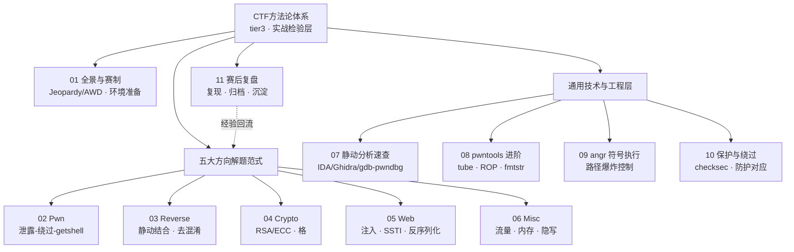
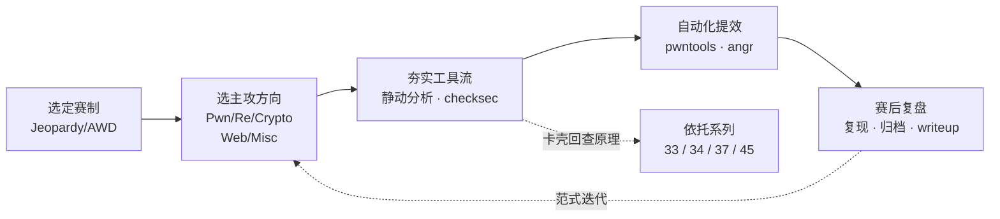

# CTF方法论体系 · 系列总览

> 把散落在各系列的解题技巧汇成方法论：Pwn / Reverse / Crypto / Web / Misc 的解题范式、工具流与复盘模板，作为二进制与安全知识的**实战检验层**。当"读懂原理"要转化为"限时拿到 flag"，靠的不是临场灵感，而是可复用的范式、脚本模板与肌肉记忆。

## 体系全景

本系列不重复讲漏洞原理（那是 33/34/37/45 等系列的职责），而是把原理**编排成限时可执行的解题流水线**：从赛制识别切入，按方向拆解范式，横向沉淀通用工具流，最终以复盘闭环反哺范式。

## 篇目导航

| # | 章节 | 说明 |
| --- | --- | --- |
| 01 | [[01.CTF全景与赛制与工具链]] | Jeopardy/AWD、方向分类、环境准备 |
| 02 | [[02.Pwn解题范式与模板]] | 泄露-绕过-getshell、pwntools 模板 |
| 03 | [[03.Reverse解题范式]] | 静动结合、去混淆、算法识别与爆破 |
| 04 | [[04.Crypto解题范式]] | 经典密码、RSA/ECC 攻击、格，呼应系列 37 |
| 05 | [[05.Web解题范式]] | 注入/SSTI/反序列化速查，呼应系列 57 |
| 06 | [[06.Misc与取证与隐写]] | 流量/内存/隐写，呼应系列 53 |
| 07 | [[07.静态与动态分析速查]] | IDA/Ghidra/gdb-pwndbg 常用流 |
| 08 | [[08.漏洞利用脚本工程：pwntools进阶]] | tube、ROP、fmtstr、shellcraft |
| 09 | [[09.符号执行辅助解题：angr实战]] | 路径爆炸控制、约束求解，呼应系列 45 |
| 10 | [[10.常见保护与绕过速查]] | checksec、各防护对应绕过，呼应系列 34 |
| 11 | [[11.赛后复盘与writeup方法]] | 复现、归档、知识沉淀模板 |

> [!warning] 合规边界与学习建议
> **合规**：本系列聚焦攻防对抗技术，**仅限自有/授权环境、CTF 靶场与合法安全研究**内使用；所有利用手法均以**防御视角**理解——研究攻击是为识别并加固对应弱点，严禁针对未授权系统实施，触碰《网络安全法》等法律红线后果自负。
> **学习建议**：先读 01 建立方向坐标系 → 择一主攻方向深挖范式（02–06）→ 横向补齐通用工具流（07–10）→ 每道题按 11 的模板复现归档。切忌只囤脚本不复盘：把"这次侥幸做出来"沉淀为"下次稳定拿分"，才是本系列的价值所在。

## 学习路径

## 与知识库既有体系的衔接

- Pwn 依托：[[33.二进制漏洞与利用基础/00.二进制漏洞与利用基础总览]]、[[34.现代二进制防护机制/12.加固工具与checksec]]
- Crypto 依托：[[37.密码学/53.密码学攻击概览]]
- 符号执行：[[45.反编译器与反汇编引擎原理/11.符号执行与angr框架]]
- 既有实战收编：[[40.WASM与虚拟化壳逆向/08.WASM CTF实战]]、[[72.抓包与协议分析实战/13.抓包实战CTF与漏洞分析]]
