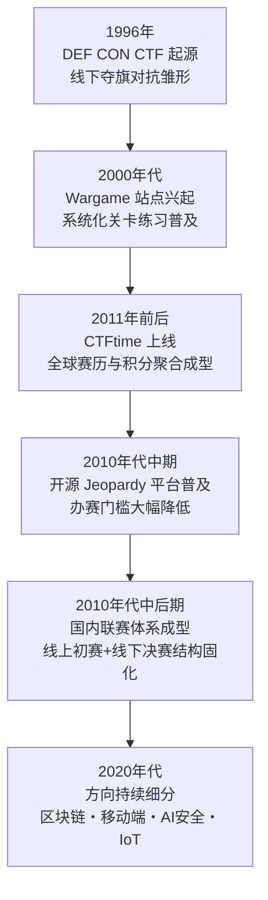
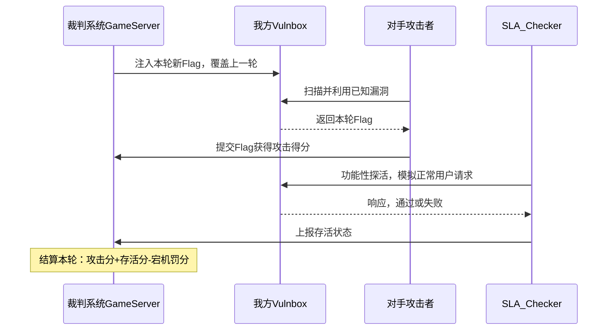
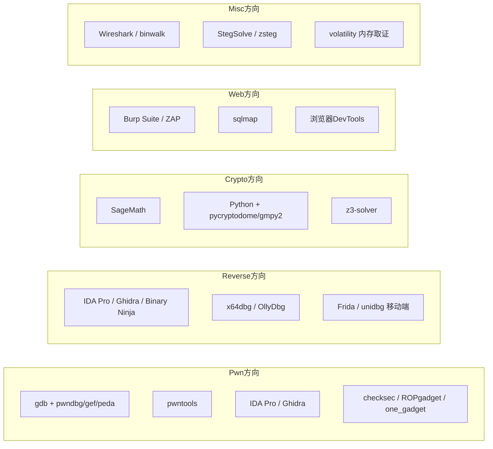
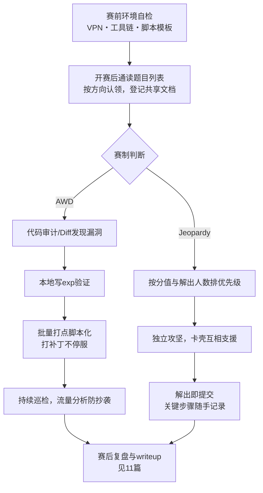

# CTF方法论体系（1）· CTF全景与赛制与工具链
> [!abstract] TL;DR
> - CTF 的赛制本质是两套不同的"稀缺性博弈"：Jeopardy 靠题目池并行铺开加动态计分，换来可无限扩展的线上体验；AWD 靠轮次制 flag 轮换加攻防双向结算，逼出真实世界里"漏洞会被人持续利用、补丁不能停服"的动态压力，二者对选手能力画像的要求接近正交。
> - 五大传统方向（Pwn/Reverse/Crypto/Web/Misc）不是学科分类目录，而是现实安全岗位的具象切片；区块链、移动端、AI安全、IoT 等新兴方向的题目占比变化，直接映射产业攻击面的迁移轨迹。
> - 动态计分把"稀缺性"直接定价——解出人数越多说明题目越简单，分值就该向下限衰减；AWD 计分把"每一轮"当成一次独立结算，攻击分、存活分、宕机罚分三项独立核算。理解显式公式，才能在比赛中做资源取舍而不是凭感觉。
> - AWD 的核心工程约束是"打补丁不能停服"：SLA/Checker 机器人会模拟正常用户行为持续探活，功能性被自己改坏和被对手打穿，在扣分效果上往往同样致命。
> - 本篇只交付全景地图与环境自检清单，不深入任何单一方向的解题范式、也不展开具体工具语法——那是 02–10 篇的内容；本篇的产出是一套能在拿到任意一道题或任意一场比赛时，快速判断"这属于哪个格子、该找系列哪一篇"的坐标系。
> - 所有赛制、评分、网络机制的讨论都以授权靶场与正规赛事为前提；AWD 网络与真实生产网络在信任模型上完全不同，比赛里练出的手法不能直接迁移到未授权目标上。

---

## 概述与定位

### CTF 是什么，解决什么问题

CTF（Capture The Flag，夺旗赛）把网络安全攻防能力封装成一种有明确规则、可量化计分、时间限定的竞赛形式：参赛者在题目或对抗环境中寻找一段特定格式的字符串（flag）作为"通关证明"提交给裁判系统换取分数。这个名字借用自真人户外游戏"夺旗"，但内核早已完全是数字世界的对抗——本质上，CTF 是把渗透测试、漏洞研究、逆向分析、密码分析这些原本需要数月甚至数年积累、且现实中往往不允许"随便练手"的能力，压缩进几个小时到两三天的沙盒里，用可复现、可量化、合法安全的方式反复演练。

它同时承担三个功能：**人才选拔**（企业与安全团队通过赛事成绩识别顶尖选手，很多安全从业者的第一份工作机会来自战队履历）、**能力训练**（比死记漏洞库更有效的学习方式是亲手打穿一个存在漏洞的系统）、**社区文化载体**（战队、writeup、赛后交流构成了安全圈重要的社交网络）。理解这三重功能，才能理解为什么 CTF 的规则设计会同时追求"公平可复现"与"贴近真实攻防"这两个有时互相冲突的目标——这也是本篇要讲清楚的第一层坐标：赛制。

### 简史：从线下对抗到全球化赛历



DEF CON CTF 公认是最早、也是至今最具含金量的 CTF 赛事，最初是 DEF CON 大会上的线下对抗游戏，规则原型就来自"攻入对方主机、拿到证明文件"。此后二十余年，赛制沿两条路径分化：一条把"攻防对抗"这个内核保留下来并常态化为轮次制，也就是今天的 AWD；另一条把题目做成互不依赖的静态关卡，脱离了物理场地和实时对抗的限制，可以在任何人任何时间通过互联网参与，也就是今天的 Jeopardy。开源 judge 平台的出现，让"办比赛"的门槛降低到任何一个安全社区都能承担的程度；与之呼应的是全球性积分聚合站点的出现，把分散在一年四季、遍布各大洲的赛事统一折算成队伍的年度积分与排名，第一次让"CTF 战队实力"有了公开、量化的参照系。国内的联赛体系在这条脉络上进一步固化出"线上 Jeopardy 初赛做大规模选拔、线下 AWD 或混合决赛做小范围强对抗"的两段式结构，这个结构本身就是对本篇要讲的赛制分类最直接的应用。

### 本篇在系列中的位置

本篇是《CTF方法论体系》全系列的坐标原点，只做三件事：给出赛制分类（拿到一场比赛，判断它按什么规则走）、给出方向分类（拿到一道题，判断它归哪个方向）、给出环境与工具全景地图（判断要用什么武器库，以及具体武器去系列哪一篇找）。后续 02–06 篇按方向纵向展开各自的解题范式与模板，07–10 篇横向沉淀通用工具流与保护对抗速查，11 篇收口赛后复盘方法论。本篇不重复讲二进制漏洞原理（那是系列 33/34 的职责）、不展开密码分析数学细节（系列 37 的职责）、不讲符号执行引擎内部实现（系列 45 的职责）——本篇只回答"这场比赛/这道题应该用什么姿势迎接"，原理性的深挖交给对应的依托系列。

---

## 原理与机制

### 赛制分类的设计逻辑：为什么是 Jeopardy 与 AWD 两条主线

**Jeopardy（解题式）**得名于同名益智电视节目"选类别选分值答题"的形式：题目按类别（Pwn/Reverse/Crypto/Web/Misc……）与分值铺成一个矩阵，选手自由选择作答顺序，解出即得分，整场比赛选手之间唯一的直接交互是抢首杀（first blood）和互相看榜。这种设计成立的原因有三层：其一，它天然可以并行扩展到任意数量的选手同时在线，不需要为每个人单独分配对抗算力或网络资源；其二，计分对"解题能力"是相对纯粹的信号，不掺杂运维和网络对抗带来的噪声，适合作为人才筛选与教学工具；其三，它允许选手完全按自己的长板深耕某一方向，不强制均衡分布精力。它的代价也很直接：不检验防守和运维能力，也不模拟真实世界里"漏洞会被人持续利用、系统要一直在线"这种动态压力。

**AWD（Attack With Defense，攻防对抗式）**的规则完全不同：每支队伍拿到一份完全相同的靶机（vulnbox，内含若干故意留有漏洞的服务），比赛按固定时长的轮次推进，裁判系统每轮向所有队伍的靶机写入新的 flag。选手必须同时做两件事——**攻**：利用漏洞从其他队伍的靶机偷取本轮 flag 并提交得分；**防**：审计并修补自己靶机上的同款漏洞，阻止对手得手，同时不能把服务修坏，否则功能性探活失败会倒扣分。这套机制之所以这样设计，是因为它想同时检验漏洞挖掘与利用速度（进攻）、代码审计与热补丁能力且补丁不能破坏业务（防守，直接对应真实运维/安全工程师的日常）、长时间连续作战下的体力分配与团队协作（轮次通常持续数小时到一两天）、以及基本的网络与系统运维素养（VPN 连通性、服务重启策略、流量监控）。它的代价是对新手不友好——必须先具备攻的能力，才谈得上有意义地防；而且高度依赖网络基础设施的稳定性，裁判平台本身的可用性直接决定比赛体验。

两种赛制的选择背后有更深一层的原因：Jeopardy 更接近"技能考试"，AWD 更接近"实战推演"。很多高规格决赛长期坚持攻防对抗形式，正是因为线上初赛阶段（往往是 Jeopardy）已经完成了人才筛选，决赛要考验的是完全不同的能力维度——真实世界里漏洞挖掘只是安全工作的一半，另一半是在漏洞被人利用之前把它修好、且不能让业务中断。国内很多顶级赛事采用"线上 Jeopardy 初赛 + 线下 AWD／混合决赛"的两阶段结构，本质是把两种赛制当成互补的筛选漏斗，而非相互替代的选项。

| 维度 | Jeopardy | AWD |
| --- | --- | --- |
| 时间结构 | 全程开放选题，无强制节奏 | 固定轮次循环，节奏由裁判系统强制 |
| 得分来源 | 解出题目、抢首杀 | 攻击对手得分 + 存活/防守得分 |
| 失分可能 | 通常不会（错误提交至多限速） | 会（被攻破、服务宕机、探活失败均扣分） |
| 团队交互 | 几乎零直接交互，仅看榜竞速 | 直接对抗，需实时监控对手与自身状态 |
| 能力画像 | 深度优先，允许方向偏科 | 广度优先，攻防运维缺一不可 |
| 新手友好度 | 高，可从任意方向任意难度切入 | 低，要求已有攻防基本功 |
| 代表场景 | 线上初赛、常青练习平台、教学赛 | 线下决赛、专业对抗演练 |

**其他/衍生赛制**同样值得纳入坐标系：King of the Hill（据点式，持续控制某个服务或权限点即可持续得分，弱化"轮次结算"而强调"持续对抗与反复争夺"）；纯防御/代码审计赛（只给出带漏洞的代码，只考核发现与修复能力，不涉及主动进攻，常见于强调"安全开发"能力的教学场景）；在标准 AWD 基础上叠加代码审计报告、渗透测试环节等额外评分维度的混合制（具体规则因主办方而异，选手拿到规则文档时要重点确认这些附加维度如何计分）。团队规模上，个人赛几乎只出现在入门教学场景，正规赛事绝大多数是数人到二十人不等的团队赛，团队规模直接决定了能同时覆盖的方向广度。

### 方向分类的设计逻辑：现实职业角色的具象切片

CTF 的方向分类不是学科目录，而是把现实安全岗位按技能切成可以独立训练的模块：

| 方向 | 核心考核能力 | 现实职业映射 | 系列内依托 |
| --- | --- | --- | --- |
| Pwn | 内存破坏漏洞发现与利用武器化 | 漏洞研究员 / Exploit 开发工程师 | 系列 33、34 |
| Reverse | 无源码理解程序逻辑、破解校验、去混淆 | 逆向工程师 / 恶意代码分析师 | 系列 45、50 |
| Crypto | 识别密码学误用与实现缺陷 | 密码分析师 / 密码工程师 | 系列 37 |
| Web | Web 常见漏洞类别挖掘与利用 | 渗透测试工程师 / 应用安全工程师 | 系列 57 |
| Misc | 取证、隐写、编码学、综合工具熟练度 | 数字取证分析师 / 应急响应工程师 | 系列 53 |
| 区块链/智能合约 | 合约漏洞审计、链上数据分析 | 智能合约审计工程师 | — |
| 移动端 | Android/iOS 逆向与漏洞利用 | 移动安全工程师 | 系列 35、36 |
| IoT/固件/工控 | 固件逆向、协议分析、硬件接口 | 嵌入式安全工程师 | 系列 39 |
| AI/大模型安全 | Prompt 注入、模型窃取、对抗样本 | AI 安全研究员 | 系列 56 |
| PPC（部分赛事保留） | 纯算法/协议实现能力 | 偏基础工程能力，非安全专项 | — |

分类的意义不是贴标签，而是帮选手明确长期投入方向——CTF 里的方向选择某种程度上就是安全职业方向选择的预演。新手最常见的误区是试图五个方向雨露均沾，结果任何一个方向都停留在皮毛；更有效的路径是选定一到两个主攻方向深挖范式（对应本系列 02–06 篇），再横向补齐通用工具流。新兴方向的出现节奏本身也是一个有用的信号：区块链方向随链上资产规模扩大而升温，AI 安全方向在大模型规模化落地后迅速铺开，这种题目分布的变化，直接反映了产业界真实攻击面的迁移。

### 评分机制设计原理

**静态计分**：每题固定分值，规则最简单，适合新手赛、内部培训赛，缺点是不能反映"题目难度的真实分布会随时间变化"——如果某题很快被大量队伍解出，说明它其实偏简单，固定的高分值会扭曲最终排名。

**动态（衰减）计分**是当前主流 Jeopardy 平台的标配做法：题目分值随解出人数增加向一个下限衰减，衰减速度由参数控制。理解衰减曲线的关键不在记住某个平台某个版本的精确系数，而在于理解它背后的定价逻辑：

```
value(solve_count) = max( minimum,
                           initial - (initial - minimum) * f(solve_count, decay) )
# initial : 题目初始分值，第一个解出者能拿到的分值上限附近
# minimum : 衰减后的下限分值，题目"烂大街"后依然保留的最低奖励
# decay   : 衰减速率参数，决定衰减到 minimum 大约需要多少次解出
# f       : 随 solve_count 单调递增的曲线，常见实现为二次或分段线性
```

这套机制把"稀缺性"直接定价：越少人解出，说明难度或信息量越大，单个 solve 换来的分值越高；首杀额外加分或颁发徽章，进一步奖励速度。这也解释了为什么高水平队伍会优先冲击刚开赛、还没人解出的题目——早解出不仅意味着分值更高，还意味着后续所有解出者的分值都会因为你的存在而被拉低，间接扩大了你和竞争对手的分差。

**AWD 轮次计分**把每一轮当成一次独立结算，典型形态（具体系数因赛事而异）：

```
本轮得分 = 成功偷取其他队伍本轮flag的次数 × 攻击单价
         + 本队flag未被偷或被偷次数低于阈值 → 存活/防守得分
         - SLA Checker 判定服务不可用或行为异常 → 宕机/功能性罚分
```

这套机制的关键设计意图是"防守不能靠拔网线"：直接关停服务虽然能避免被攻击得手，但会在 SLA 判定里被记为不可用，同样扣分，逼着选手在"打补丁"和"保持功能存活"之间做手术式的精确修改，而不是简单粗暴地砍掉功能——这一点第三段会展开讲 Checker 具体怎么工作。

---

## 赛制机制与平台架构详解

### Flag 的生命周期与格式

Flag 的格式通常约定为 `flag{...}` 或 `CTF{...}`，也有赛事使用自定义前缀，内容多为固定长度的十六进制或随机字符，便于选手用正则批量筛选候选字符串，也便于裁判系统做格式校验：

```
典型flag正则示意：flag\{[A-Za-z0-9_\-]{6,}\}
```

Jeopardy 场景里，flag 有两种常见分发方式：**每题一个共享 flag**，所有解出该题的队伍提交同一字符串；或**每队一个动态 flag**，通过按需实例化（Docker-per-team）给每支队伍分配独立容器与独立 flag。后者是较高质量赛事平台的标配，能从根本上杜绝"flag 在赛中群聊里被截图传播导致集体抄袭"的问题，因为不同队伍拿到的字符串本身就不一样。

AWD 场景里 flag 是强制动态的：裁判系统每轮通过预置的注入脚本（通常经 SSH 或专用 agent）向每支队伍的靶机写入新 flag，覆盖上一轮的值。选手必须在 flag 被下一轮覆盖之前，完成"发现漏洞→构造利用→取出 flag→提交"的完整链路，这正是 AWD 节奏紧张感的直接来源——拖得越久，能偷到的对手 flag 就越少。反作弊层面，flag 提交接口通常有速率限制和来源校验防止脚本暴力枚举；队伍间共享 exploit（collusion）在大多数赛事规则中被明令禁止，裁判组通常会通过提交时间序列的异常聚集来筛查合谋。

### AWD 平台架构详解



**Vulnbox**：所有队伍拿到的镜像或虚拟机完全一致，包含相同的漏洞与相同的初始配置，这是保证公平性的前提——任何队伍发现的漏洞，理论上所有队伍都存在，谁先发现谁先获利。**网络拓扑**：组织方搭建中心化的路由/VPN 网关，每支队伍通过 VPN 接入（常见 OpenVPN 或 WireGuard，赛前由组织方下发配置文件），网关做端口级别的访问控制——队伍能扫描和攻击其他队伍靶机上开放的业务端口，但通常不能访问其管理端口；裁判系统、网关、SLA 探测源等基础设施通常被规则明确列为禁止攻击目标。**SLA/Checker**：一个独立于选手的自动化脚本或服务，模拟正常用户对每支队伍靶机上的业务服务做功能性探活（例如注册、登录、下单一类的正常业务流程），探活失败（服务宕机、逻辑被破坏、响应超时）会被记为本轮不可用，直接影响存活得分甚至清零本轮的攻击收益。这个机制存在的意义就是逼着选手做精确打击式的补丁，而不是删库跑路式的防守——一个把漏洞接口直接注释掉的"补丁"，往往同时也砍掉了 Checker 依赖的正常功能，结果是防住了对手却也把自己的存活分弄丢了。

不同赛事使用的 AWD 赛事管理系统实现细节各不相同（有的基于开源 Jeopardy 平台插件扩展，有的使用专门的赛事管理系统），但选手层面不需要关心具体实现，只需要理解"round loop"这个抽象在几乎所有 AWD 赛事里都成立：注入 flag → 攻防窗口期 → Checker 探活 → 结算 → 进入下一轮。

### Jeopardy/CTFd 类平台架构详解

以 CTFd 为代表的开源 Jeopardy 平台，其挑战模型通常包含：分类（Category）、分值与动态计分参数、flag（静态字符串或自定义校验函数）、附件（题目文件）、提示（Hint，往往有分值代价），以及可选的按需实例化模板（用于需要独立运行环境的 Pwn 远程题或部分 Web 题）。选手提交候选 flag 后，后端做比较校验，命中则记录 solve 并触发该题动态分值的重新计算——这也是"越早解出分越高"这个体验的直接实现机制：你解出的瞬间，后来者能拿到的分值就已经因为你的存在而降低了。

大型正式赛事通常会在结束前的一段时间冻结计分板（Scoreboard Freeze），冻结期内提交仍然计分，但排名对外不再更新，目的是防止选手在最后时刻通过观察排名波动互相试探，直到颁奖时才解冻公布最终结果。针对 Pwn 等需要长连接或独立内存空间的题目，现代平台常用容器编排为每支队伍或每次连接按需拉起独立实例，题目结束或超时自动销毁，避免"一个队伍占着服务导致其他队伍无法调试"或"多队共享同一进程导致利用互相冲突"的问题。

### 生态与练习平台一览

| 平台类型 | 定位 | 典型用途 |
| --- | --- | --- |
| 全球积分聚合站（如 CTFtime） | 把全年各赛事按权重折算积分，汇总年度排名 | 衡量战队/选手活跃度与水平的公开参照系 |
| 常青练习平台（国内外均有） | 历史赛题长期开放，配排行榜与题解社区 | 新手系统化积累"手感" |
| Wargame 站点 | 循序渐进的关卡式训练，节奏慢于正式比赛 | 打某一方向的基本功（如逐层提权训练） |
| 官方赛事归档 | 赛后公开源码与附件供复现 | 深度复盘、二次练习 |

这些平台各自服务于比赛生命周期的不同阶段：赛历聚合站帮你规划"打哪些比赛"，练习平台和 Wargame 站点帮你在赛前打好基本功，赛事归档帮你在赛后按第 11 篇的方法论复盘沉淀。

---

## 工具视角与实战

本篇只给"武器库全景"，具体每件武器的握持姿势——命令语法、脚本模板、绕过技巧——留给系列后续章节：静态/动态分析速查见 07 篇，pwntools 进阶见 08 篇，angr 符号执行见 09 篇，保护绕过速查见 10 篇。这里要建立的是一张按方向索引的地图：



### 本地环境搭建：为什么这样选

**操作系统**：原生 Linux 发行版（或 WSL2）优于纯 Windows，原因很直接——绝大多数安全工具首发甚至只支持 Linux，pwntools 对 Windows 的支持长期不完整，而且本地调试环境的 ELF/动态链接生态要和远程题目环境保持一致，原生 Linux 是成本最低的选择。**Python 环境隔离**：用 `venv`/`pyenv` 把 CTF 用的 Python 环境和系统环境分开，原因是 pwntools 历史上对 Python 版本、32/64 位环境有过一些遗留兼容问题，隔离环境能避免"为了装一个 CTF 库把系统 Python 搞坏"。**静态分析**：IDA Pro 功能最全但是商业软件，Ghidra 免费开源、适合预算有限的队伍作为主力或备用，Binary Ninja 处于二者之间，个人版价格较友好且有云端协作特性，三者反汇编结果经常需要互相印证。**动态调试**：原生 gdb 对漏洞利用场景的调试体验较差，pwndbg/gef/peda 这类插件提供堆内存可视化、寄存器高亮、`vmmap`/`heap` 等增强命令，是 Pwn 方向事实上的标配，具体命令留给 07 篇展开。**容器化**：docker/docker-compose 是本地复现题目环境的核心工具，尤其是 Pwn 题——本地调试用的 libc 版本必须和远程完全一致，哪怕差一个小版本号，堆结构偏移和 one_gadget 地址都可能对不上，用容器或 `pwninit` 之类的工具拉取匹配版本的 libc 与动态链接器，是避免"本地能打通、远程死活不行"这类低级挫败感的关键一步。**Web 方向**：Burp Suite 社区版基本能覆盖大部分题目需求，配合浏览器 DevTools 和 sqlmap。**Crypto 方向**：SageMath 是处理大整数运算、椭圆曲线、格基规约（LLL）等运算的事实标准，Python 配合 `pycryptodome`/`gmpy2` 处理常规场景，`z3-solver` 用于约束求解。**Misc 方向**：Wireshark/binwalk 是流量与文件分析的基本盘，StegSolve/zsteg 覆盖常见隐写场景，volatility 用于内存取证。**AWD 专属**：VPN 客户端（组织方通常赛前下发 OpenVPN/WireGuard 配置文件）、内网路由与 hosts 配置，以及一套自己维护的自动化打点脚本框架（核心思路是维护一份对手 IP 列表，循环调用统一的攻击函数，失败自动重试并记日志）。

### 团队协作与比赛日工作流



团队分工通常按方向设岗（Pwn 手/Reverse 手/Crypto 手/Web 手/Misc 手），AWD 场景再叠加运维协调角色，负责盯服务状态、协调补丁上线时机、汇总打点脚本的成功率。认领机制至关重要——用共享文档或 IM 群组登记"谁在看哪道题"，能有效避免多人重复劳动；沟通节奏上，卡壳超过一定时间要主动呼叫支援而不是死磕，这一点在 Jeopardy 里尤其重要，因为题目之间没有依赖关系，卡在一道题上的时间本可以用来解另一道。计分板监控也值得脚本化——写一个轮询计分板 API 的小脚本，分数变化时自动播报到团队群，能让所有人第一时间感知到掉分或被反超，及时调整策略。exploit 代码建议统一放进团队的 git 仓库，既方便协作，也为赛后按 11 篇的方法论复盘归档打好基础。

| 检查项 | 说明 |
| --- | --- |
| Python 隔离环境 + pwntools | Pwn/自动化脚本的基础依赖 |
| gdb + pwndbg/gef/peda | Pwn 动态调试增强 |
| IDA/Ghidra/Binary Ninja | 静态反汇编与反编译，至少备好一个免费方案 |
| docker + pwninit/patchelf | 本地复现远程 libc/动态链接器环境 |
| Burp Suite/ZAP + sqlmap | Web 方向基础武器 |
| SageMath + z3-solver | Crypto 方向数学运算与约束求解 |
| Wireshark/binwalk/volatility | Misc/取证方向基础工具 |
| VPN 客户端与内网路由配置 | AWD 参赛前置条件 |
| 共享文档/IM 群 + git 仓库 | 团队认领机制与代码协作 |
| exploit/writeup 模板 | 减少赛中重复搭手脚架的时间 |

---

## 安全性与正确使用

CTF 之所以能够合法地讲授攻击技术，前提是整个博弈发生在组织方明确授权、与生产网络物理或逻辑隔离的沙盒里——vulnbox、题目容器、AWD 内网都是专门为这场比赛搭建的一次性环境。这个前提一旦被移除，同样的技术就从"参赛"变成了"未授权入侵"，二者在法律与职业伦理上是完全不同的两件事，不能因为动作相似就混为一谈。

赛内规则本身也划出了明确边界：绝大多数赛事禁止攻击比赛基础设施本身（裁判系统、网关、计分板等），因为这些设施的可用性关系到所有参赛队伍的公平体验；多数 AWD 规则只允许"以获取 flag 为目的"的攻击行为，纯粹以拖垮对手服务为目的的拒绝服务通常被判违规甚至取消成绩；队伍间共享 flag 或 exploit（collusion）在几乎所有正规赛事中都被明令禁止；赛中或赛后传播可能仍对其他在线系统有效的漏洞细节，同样超出了合理边界。题目附件——尤其是 Reverse/Misc 方向的可执行文件——不建议在日常工作机上直接运行，CTF 历史上不乏以"反打选手"为噱头的恶意样本类题目，统一在隔离虚拟机或容器中打开是稳妥的习惯。

> [!caution] 合规边界
> 本篇及本系列涉及的全部攻防技术，**仅限于自有环境、CTF 授权靶场与合法安全研究场景使用**：
> - 参赛行为必须限定在组织方划定的网络与目标范围内，不得把比赛中练出的利用手法用于未获授权的真实系统；
> - AWD 网络中不得攻击裁判系统/网关等基础设施，不得以纯粹瘫痪对手服务（而非获取 flag）为目的发起拒绝服务；
> - 全篇内容均以防御与教育视角组织：讲清楚漏洞为什么存在、如何被利用、又该如何被正确修补，不为绕过任何商业授权或攻击真实生产目标提供可直接武器化的成品配方；
> - 赛中与赛后都不传播仍对在线系统有效的漏洞细节，负责任地对待每一份"实战经验"，需要对外披露时走正规的漏洞报告渠道。

从 CTF 走向真实世界的技能迁移，只应该沿着授权路径进行：自有资产的安全自测、经授权的渗透测试与众测项目（如企业漏洞悬赏计划）、遵循负责任披露流程的独立安全研究。CTF 训练出的是能力，能力本身中性，用在哪里、经不经过授权，才是决定它是"安全研究"还是违法行为的分界线。

---

## 小结

- CTF 的两条赛制主线——Jeopardy 与 AWD——分别对应"技能考试"和"实战推演"两种不同的检验目标，选手和团队要先判断赛制再决定打法，而不是用同一套习惯应付所有比赛。
- 方向分类映射真实安全岗位，新手最容易犯的错误是五个方向平均分配精力而没有主攻方向；更有效的路径是选一到两个方向深挖范式，再横向补齐工具链。
- 动态计分与 AWD 轮次计分都可以写成显式公式，理解公式背后"稀缺性定价"与"每轮独立结算"的逻辑，才能在比赛中做出理性的时间与精力分配，而不是凭直觉抢题。
- AWD 的"打补丁不能停服"约束是整个赛制里工程含量最高的部分，直接对应真实运维/安全工程师日常面对的"修复漏洞不能中断业务"这个核心矛盾。
- 环境准备不是比赛当天才做的事——Python 隔离环境、调试器插件、IDA/Ghidra、docker 复现环境、VPN 配置，任何一项缺失都会在开赛后的黄金时间里变成隐性的时间税。
- 常见误区还包括：只囤脚本模板不理解原理，遇到变体题就卡死；AWD 里只顾进攻不设防，或者反过来因为过度保守直接停服导致大量掉分；团队内部没有认领登记机制，重复劳动浪费本就紧张的比赛时长。
- 本篇建立的坐标系是全系列的入口，具体的解题范式、工具语法、保护绕过技巧，分别在 02–10 篇展开；每一场比赛打完，都应该按 11 篇的方法论走一遍复盘闭环，把"这次侥幸做出来"沉淀成"下次稳定拿分"。

## 相关阅读

- [[00.CTF方法论体系总览]] — 系列总览与完整篇目导航
- [[02.Pwn解题范式与模板]] — 下一章，Pwn方向泄露-绕过-getshell范式
- [[07.静态与动态分析速查]] — 本篇工具地图的详细展开
- [[10.常见保护与绕过速查]] — checksec字段与对应绕过手法速查
- [[11.赛后复盘与writeup方法]] — 比赛结束后的复盘归档闭环
- [[33.二进制漏洞与利用基础/00.二进制漏洞与利用基础总览]] — Pwn方向原理依托
- [[34.现代二进制防护机制/12.加固工具与checksec]] — 环境自检工具的实现原理
- [[37.密码学/53.密码学攻击概览]] — Crypto方向攻击分类框架
- [[45.反编译器与反汇编引擎原理/11.符号执行与angr框架]] — 自动化解题引擎原理
- [[40.WASM与虚拟化壳逆向/08.WASM CTF实战]] — 已收编的WASM方向实战案例
- [[72.抓包与协议分析实战/13.抓包实战CTF与漏洞分析]] — 已收编的流量分析实战案例
- CTFtime — 全球CTF赛事日历与战队积分聚合站，ctftime.org
- CTFd 官方文档 — 主流开源Jeopardy平台的挑战模型与动态计分机制说明，docs.ctfd.io
- 《CTF特训营：技术详解、解题方法与竞赛技巧》— 中文CTF入门经典书目，覆盖五大方向基础

[[00.CTF方法论体系总览|⬆ 系列总览]] | [[02.Pwn解题范式与模板|→ 下一章]]
