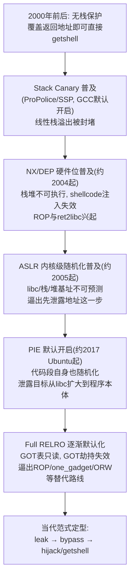
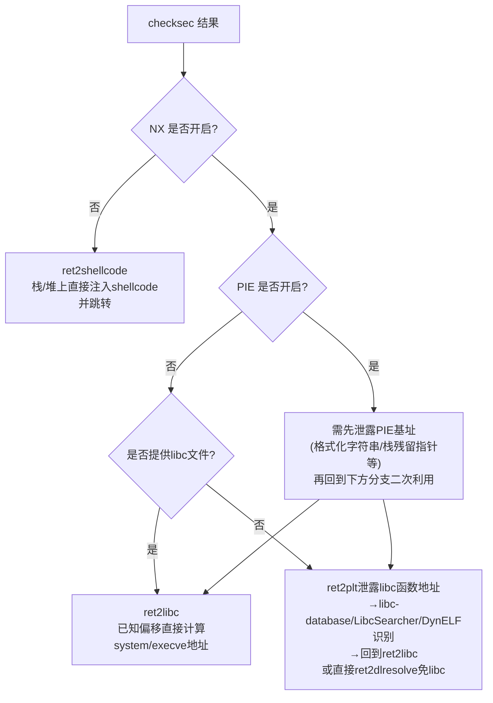
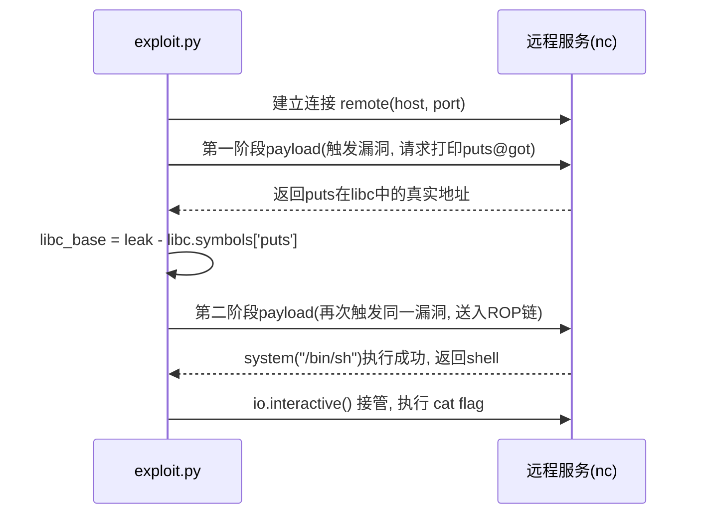

# CTF方法论体系（2）· Pwn解题范式与模板
> [!abstract] TL;DR
> - Pwn解题的核心是"泄露→绕过→getshell"三段范式：根本原因是NX、Canary、PIE、RELRO、ASLR五道保护把"控制流劫持"从单步操作拆成了"先摸清地址空间、再计算payload、再劫持"的多阶段博弈，范式作用在利用层而非漏洞层，对栈溢出/堆漏洞/格式化字符串等任意根因都通用。
> - checksec的输出本质是一张决策表：NX关则可直接shellcode，PIE/ASLR开则必须先leak，Full RELRO则GOT劫持失效、被迫转向ROP/one_gadget/ORW/ret2dlresolve等路线；读懂这张表就定好了整道题的主攻方向。
> - pwntools把范式固化成工程骨架：`process`/`remote`二态切换、`ELF`符号与GOT/PLT解析、`ROP`自动建链、`cyclic`偏移定位、`DynELF`免库名泄露解析、`fmtstr_payload`自动算格式化字符串偏移，构成几乎所有solve.py的共同底座。
> - 没有libc或libc未知时，范式有明确降级路径：libc-database/LibcSearcher指纹识别 → DynELF无数据库泄露解析 → ret2dlresolve伪造动态链接器解析记录免libc，三条路线按信息完备程度依次兜底。
> - 实战陷阱集中在"能跑但不稳"：栈对齐(movaps)导致的概率性崩溃、本地远程libc版本不一致、sendline/recvuntil时序竞争、one_gadget约束未核对，这些比漏洞本身更常拖垮比赛时间。
> - 本章只讲"怎么把任意一道Pwn题按流程跑通"；漏洞底层机制见[[33.二进制漏洞与利用基础/00.二进制漏洞与利用基础总览]]，保护绕过速查见本系列第10章，pwntools进阶见第8章，angr自动化见第9章。

## 概述与定位

本篇是《CTF方法论体系》系列第2篇，承接[[01.CTF全景与赛制与工具链|上一篇]]确立的赛制与工具链全景，聚焦到CTF四大传统方向里工程链条最长、失败模式最隐蔽的一支——**Pwn（二进制漏洞利用）**。"Pwn"一词源自游戏俚语"own"的键位误触变体，在CTF语境里特指：给定一个（通常是Linux ELF，有时是Windows PE或ARM/MIPS）网络服务二进制，选手需要找到其中的内存破坏类漏洞，编写利用脚本，通过网络与远程进程交互，最终让该进程执行选手指定的代码或系统调用，读出flag文件或弹出交互式shell。

与同系列第3篇要讲的Reverse相比，Pwn与Reverse共享静态反汇编、动态调试等分析工具链的前半段，但目标截然不同：Reverse的终点是"看懂"——把一段逻辑或加密算法还原成人类可读的答案；Pwn的终点是"控制"——让目标进程按选手的意志执行指令。这个差异决定了Pwn有一段Reverse没有的、独属于自己的后半程：找到漏洞之后，还要设计出一整套能在受限的内存破坏原语与层层运行时保护之间辗转腾挪的利用链，并把它封装成一个能稳定打穿远程服务的脚本。这条后半程正是本篇要系统化的"解题范式"。

需要明确本篇的边界。本系列把Pwn相关内容拆成了四块互不重复的篇章：漏洞本身"为什么存在、内存里发生了什么"，属于[[33.二进制漏洞与利用基础/00.二进制漏洞与利用基础总览]]与[[34.现代二进制防护机制/12.加固工具与checksec]]覆盖的原理层；具体每种保护机制的绕过细节速查表，留给本系列第10章；pwntools的高阶工程用法（自定义tube、多线程/异步交互、批量化模板生成），留给第8章；用符号执行自动求解偏移与约束，留给第9章。本篇夹在中间，要回答的是一个更接地气也更容易被低估的问题——**拿到一道从未见过的Pwn题，选手的脑子里应该按什么顺序走、手上应该按什么顺序敲命令**，即"解题范式"本身，以及承载这套范式的pwntools通用模板。

还要划定题材边界：本篇的范式默认针对CTF赛制里数量最大的一类目标——**运行在Linux上、通过TCP暴露交互接口的用户态ELF服务**。Windows平台的Pwn（SEH覆盖、mona.py辅助、WinDbg调试）在ROP/leak的底层逻辑上与Linux同源，但工具链与结构体布局全然不同，是结构相近、细节迥异的平行分支；内核态Pwn（提权、UAF在slab分配器里的表现）与浏览器/JS引擎Pwn（V8堆喷、类型混淆）则是保护模型完全不同的独立子领域，均不在本篇模板覆盖范围内，读者遇到时应把本篇范式当作"骨架"参考，而非直接套用。掌握本篇内容需要的前置技能包括：能读懂x86/x86-64汇编与C语言、理解进程虚拟内存布局（代码段/数据段/堆/栈的相对位置）与函数调用约定、对操作系统层面的"系统调用"概念有基本认识——这些前置知识本身分散在[[33.二进制漏洞与利用基础/00.二进制漏洞与利用基础总览]]等笔记中，本篇不重复讲授。

## 原理与机制

### 范式为什么是三段式：保护机制的层层加码

"泄露→绕过→getshell"这套范式不是选手拍脑袋发明的套路，而是操作系统与编译器几十年"打补丁式"防御演进倒逼出来的必然结果。把时间线拉开看：



这条演进链揭示了一个关键事实：**每一代保护封堵的都是上一代攻击的"默认动作"，而不是攻击者的"目标"**。攻击者的目标从始至终没变——让进程执行`system("/bin/sh")`或等价的系统调用；变的只是"从当前的内存破坏原语走到这个目标"之间要跨越的障碍数量。三段范式因此不是三种互相独立的技巧，而是同一条攻击链在障碍层层累加后被迫拉长出的三个必经阶段。

### 五道保护机制逐个拆解

| 保护 | 作用位置 | 防御机制 | 对解题范式的具体影响 |
|---|---|---|---|
| NX / DEP | 页表项(PTE)的不可执行位 | 标记栈、堆等数据页不可执行，CPU取指到这类页直接触发异常 | 禁绝"栈上注入shellcode直接跳过去"的最简单形态，逼出ROP/ret2libc等"复用已有可执行代码"的思路 |
| Stack Canary(SSP) | 栈帧内、返回地址之前的哨兵值 | 函数返回前比对哨兵值是否被覆写，不一致则终止进程 | 让"线性、顺序覆盖"式溢出无法直接越过canary碰到返回地址，除非先单独泄露canary或改用能跳过canary位置的写原语 |
| PIE | ELF自身代码段/数据段的加载基址 | 每次`execve`由内核为整个可执行文件随机分配基址 | 程序自身的gadget、后门函数、全局变量地址都不再固定，必须先泄露一个程序内指针才能定位任何自身代码 |
| ASLR(内核层) | 栈、堆、共享库(mmap区)的加载基址 | 内核在`execve`时读取熵源随机化各内存区域基址 | 与PIE共同构成"必须先泄露才能定位"的核心动机，libc、堆、栈的真实地址在每次连接中都不同 |
| RELRO(Full) | `.got.plt`只读属性 | 装载时提前完成全部符号解析("now"绑定)后对GOT做`mprotect`只读 | 阻断"覆盖GOT表项劫持函数指针"这一入门级技巧，逼出返回地址劫持、one_gadget、ret2dlresolve等不依赖GOT可写的路线 |

这张表的每一行都值得再讲一层"为什么这样设计"。Canary选择放在**栈帧内、返回地址之前**而不是别处，是因为它要拦截的正是"缓冲区从低地址向高地址线性溢出、最终踏过返回地址"这一种最常见的路径——它对"能跳过canary直接写返回地址"的非线性写入（比如堆上的任意地址写，或格式化字符串的`%n`）完全无效，这也是为什么堆漏洞和格式化字符串漏洞常常被认为"canary形同虚设"。canary最低字节固定为`0x00`这一设计，本意是让"以字符串函数（`strcpy`/`puts`等）为载体的溢出"在碰到canary的`0x00`字节时天然截断、无法把canary本身当作可打印字符串向外泄露，但代价是这个固定的`0x00`同时降低了canary的有效熵——在fork模型的服务里，canary在父进程fork出的所有子连接间保持不变（fork复制内存与TLS，canary本身在`execve`时一次性生成后不再改变），选手因此可以逐字节爆破（每次只覆盖canary的一个字节做尝试，正确性由子进程是否崩溃判断，单个字节只有256种可能且已知一位是`0x00`），这是"应该先leak canary"这条原则在特定条件下的例外分支。

PIE与ASLR的关系也值得厘清：两者是同一件事在不同对象上的应用——ASLR随机化的是内核负责映射的匿名区域（栈、堆、`mmap`得到的共享库），而PIE随机化的是ELF文件本身声明的加载基址；如果二进制没有编译成PIE（即传统的`Type: EXEC`而非`Type: DYN`），即便系统级ASLR开着，程序自身的代码段/数据段/GOT/PLT地址也是编译时就固定死的常量——这正是为什么checksec里"PIE: No"往往被选手当作好消息：代表所有基于原程序自身地址的ROP gadget、GOT表项、后门函数地址都不需要额外泄露，直接硬编码进payload即可。

RELRO进一步说明了"保护"的本质是**收窄攻击者可写、可控内存的范围**，而不是让漏洞消失。Partial RELRO（多数发行版的默认值）下GOT仍然可写，是因为GOT表项要支持"延迟绑定(lazy binding)"——函数第一次被调用时才由动态链接器`_dl_runtime_resolve`去符号表里查真实地址并回填GOT，这个回填动作本身就要求GOT在运行期可写；Full RELRO则牺牲这部分启动期的性能优化（改为装载时立即解析全部符号，即"now binding"），换取GOT区在此后全程只读。这种"性能与安全的直接权衡"在二进制保护机制里反复出现，理解了这层权衡，就能理解为什么很多生产环境二进制默认只开Partial RELRO——不是厂商不重视安全，而是启动性能与安全强度之间存在真实的、量化的取舍。

### 信息不对称：范式的统一数学模型

如果只用一句话概括三段范式为什么普适，那就是：**ASLR/PIE的防御力来自攻击者与防御者之间的信息不对称——防御者知道基址、攻击者不知道；只要攻击者能找到任意一个"读出某个已随机化区域内某个已知偏移处内容"的oracle，这种不对称就会在那个区域内被完全消除**。这是因为ASLR/PIE的随机化粒度是**整个区域一次随机化**，而不是"给区域内每个地址单独加密"，区域内部各符号相对于区域基址的偏移在编译/链接期就已固定不变——leak一个libc函数的绝对地址，减去它在libc文件里的已知偏移，就精确还原了libc基址，进而这个libc内的每一个函数、每一段字符串常量、每一个one_gadget的绝对地址都变得可计算。这正是"leak→bypass"这一步的数学本质：**用一次信息泄露，把整个地址空间从"完全不可预测"降维成"仅有一个未知常量(基址)的仿射变换"**，而这个常量在拿到一个样本点后就被唯一确定。

栈帧内存布局与x86-64函数调用寄存器约定，分别是理解"覆盖到哪、往哪几个寄存器塞参数"两类问题的基础坐标系：

```text
典型的栈帧内存布局(向高地址方向排列, 溢出从低地址向高地址推进):

高地址
+------------------------+
|    ... 调用者的栈帧 ...    |
+------------------------+
|    返回地址(ret addr)    |  <- 溢出要覆盖的最终目标, 决定ret后PC去哪
+------------------------+
|     保存的 RBP/EBP      |
+------------------------+
|  Canary (8字节x64/4字节x86, |
|     最低字节固定0x00)     |  <- 覆盖返回地址前必然先经过这里
+------------------------+
|   局部变量 / buf[] 数组   |  <- 溢出起点, 向高地址方向扩展
+------------------------+
低地址
```

```text
x86-64 System V ABI 函数调用寄存器传参顺序(前6个整数/指针参数):
  参数1 -> rdi     参数4 -> rcx
  参数2 -> rsi     参数5 -> r8
  参数3 -> rdx     参数6 -> r9
  (第7个及以后走栈传参; 函数返回值 -> rax)

对应到getshell最常用的两个目标函数:
  system("/bin/sh")             只需 rdi = "/bin/sh"字符串地址
  execve("/bin/sh", NULL, NULL) 需要 rdi = "/bin/sh"地址, rsi = 0, rdx = 0

x86(32位)下参数走栈传递(cdecl约定), 因此ret2libc只需在栈上依次摆放:
  [system地址][假的返回地址][/bin/sh地址]
不需要任何gadget去"设置寄存器"——这是32位ret2libc远比64位简单的根本原因。
```

这两段代码块合起来解释了为什么"ret2libc在64位上一定要找`pop rdi; ret`这类gadget，32位却不需要"：64位的调用约定把前几个参数放进寄存器，攻击者必须先用一小段能"弹栈进寄存器"的gadget把寄存器摆好，再跳去目标函数；32位的调用约定把参数直接摆在栈上，而攻击者原本就在栈上写入，因此"摆参数"和"覆盖返回地址"是同一个动作的自然延伸，不需要额外的gadget去搬运。这也是32位/64位Pwn题目难度体感差异的一个重要来源。

## 利用链与解题流程详解：从环境侦察到 getshell

### 九步流水线：范式的可执行版本

把上一节的"三段范式"展开成选手实际会敲的每一步，得到一条更细粒度的九步流水线：


这九步里，①-④是"侦察"，本质上是把一道题目从"完全未知"降到"漏洞类型与大致触发条件已明确"；⑤-⑦对应三段范式；⑧是范式的落地终点；⑨容易被忽视，但恰恰是CTF比赛里"能不能在有限时间内交出flag"的最后一道关卡——本地`process()`能跑通不代表远程`remote()`能跑通，网络延迟、远程libc版本、防御方加的限速都可能让最后一步比预想中更折腾。

逐步展开：①环境侦察阶段，`file ./chal`确认架构（x86/x86-64/ARM/MIPS）、是否为PIE（`DYN`还是`EXEC`）、是否静态链接；`checksec ./chal`一次性拿到NX/Canary/PIE/RELRO的完整组合；`strings ./chal`往往能直接挖到出题人故意留的后门函数名、flag路径提示，甚至格式化字符串本身。②静态分析阶段用IDA或Ghidra反编译出`main`与其调用的各功能函数，标注全局变量、堆块结构体定义、以及`gets`/`read`长度参数/`strcpy`/`sprintf`/不带格式串的`printf(buf)`/`memcpy`长度这类危险调用点；若二进制被剥符号(stripped)，可以先靠字符串交叉引用或PLT调用点反推函数边界与语义。③动态验证是把①②的"猜测"坐实——本地起一份进程，配合pwndbg/GEF/peda等gdb增强插件跑一遍正常流程，再喂入超长或畸形输入复现崩溃，观察`$rip`/`$pc`是否真的被覆盖、崩溃点的寄存器与栈内容是否符合静态分析的预期。④漏洞定性把崩溃现象归类到栈溢出、堆漏洞(UAF/double free/overflow/unlink)、格式化字符串、整数溢出、条件竞争等大类中的一种或几种组合——这一步的分类结果直接决定了后续leak手段的选择：栈溢出天然适合"先用一次溢出触发leak、再返回到漏洞点触发第二次溢出完成getshell"这类两阶段payload套路；格式化字符串可以用`%p`/`%s`直接任意读，效率远高于其他手段；堆漏洞常常要靠残留在unsorted bin里的`fd`/`bk`指针泄露libc地址（堆分配器内部机制见[[33.二进制漏洞与利用基础/00.二进制漏洞与利用基础总览]]）。

### 保护组合到利用路线的决策树

checksec的输出组合，本质上就是选手该走哪条利用路线的决策依据：



这张决策树省略了两种额外情况——RELRO与seccomp的介入。当Full RELRO生效导致GOT不可写时，树上"覆盖GOT"这类依赖GOT可写的辅助手段要整体替换为"直接返回到PLT桩（仍可读、可执行，只是不能被覆盖）"或纯粹基于返回地址劫持的ROP链，GOT只读并不妨碍**读取**GOT表项的值（用来做leak）、只妨碍**写入**它；而当`seccomp-tools dump ./chal`显示`execve`被过滤时，⑧getshell阶段要整体切换成ORW（open-read-write）链，这一分支在下面单独展开。

### 利用链清单：每一种"跳过去之后要做什么"

范式讲的是"走哪几步"，利用链讲的是"最后一步具体怎么跳"。CTF Pwn里的经典利用链按适用条件和依赖强度排列如下。

**ret2text**：把返回地址覆盖成程序自身已有的、执行后能直接产生shell效果的代码——最常见的是出题人故意留的后门函数，或者程序里恰好已经静态调用过`system`因而其PLT条目已被解析。这条路线几乎不需要任何leak，是拿到题目后最先该排查的选项：很多入门题的"陷阱"就是选手忙着构造复杂ROP链，却没注意到`strings`或IDA函数列表里已经摆着一个从未被正常流程调用、但确实存在的`win`/`backdoor`函数。

**ret2shellcode**：向一块可写可执行的内存（NX关闭时的栈/堆，或利用`mprotect`/`mmap(PROT_EXEC)`原语临时开出的可执行页）写入shellcode并跳转执行。pwntools的`shellcraft`模块可以直接生成常见shellcode，比如`shellcraft.sh()`生成一段调用`execve("/bin/sh", 0, 0)`的最小汇编，配合`asm()`编译成机器码。这条路线的硬性前提是NX必须关闭，现代默认编译选项下已经比较少见，更多出现在专门教学"栈溢出原理"的入门题里。

以leak阶段最经典的一种手法为例，可以把它拆成一次完整的网络交互时序：



**ret2plt / GOT leak**：利用漏洞点让程序返回到某个已经在PLT里、且会把参数打印出来的函数（最常用`puts@plt`），并把该函数在GOT里的地址作为参数传入，让程序把"某个libc函数在内存里的真实地址"当作数据打印出来。这正是上图展示的"用同一个漏洞点触发两次"套路——第一次触发是为了leak，第二次触发（通常是让程序流程重新回到有漏洞的函数）才是真正的getshell。它依赖PLT/GOT可读且目标函数已完成首次解析（或Full RELRO下反正全部预解析好了），不依赖GOT可写。

**ret2libc**：leak到libc基址后，直接计算并调用libc内的`system`/`execve`等函数。64位需要gadget把参数摆进`rdi`/`rsi`/`rdx`，32位可以直接在栈上顺序排列参数——上一节的寄存器约定图解释了这个差异的根源。这是覆盖面最广、最"标准"的一条路线，几乎所有ret2libc类题目的最终收敛点都是它。

**ret2csu**：当二进制里凑不齐`pop rdi; pop rsi; pop rdx; ret`这样精确的gadget组合时（尤其`rdx`很难有单独的pop gadget）的万能后备方案。几乎所有动态链接的x86-64 ELF在`__libc_csu_init`附近都存在一段用于遍历初始化函数数组的代码，天然带有连续`pop rbx, rbp, r12, r13, r14, r15; ret`和一段间接`call`两小段gadget，通过精心构造栈内容，可以间接把`r13, r14, r15`分别搬进`rdx, rsi, edi`（具体寄存器搬运关系依`__libc_csu_init`的实现而定），再触发`call`间接调用任意函数。这是"找不到直接gadget就用程序里几乎必然存在的通用结构"这一思路的典范。

**SROP(Sigreturn-Oriented Programming)**：利用`rt_sigreturn`系统调用的语义——内核处理完信号后，会从用户栈上一段特定格式的`sigcontext`结构里**恢复全部寄存器状态**（包括`rax`，也就是下一次系统调用号）。只要能让程序执行一次`sigreturn`（许多程序自身携带这个入口，静态链接二进制里也总能找到`syscall`指令），攻击者就获得了一次性设置**任意寄存器**、进而发起**任意系统调用**的超级原语，不再需要逐个凑gadget。pwntools的`SigreturnFrame`类专门用于构造这段伪造的寄存器上下文。SROP常见于gadget极度匮乏的静态链接题目，或者需要绕开libc封装、直接发起裸系统调用的场景。

**ret2dlresolve**：完全没有libc、甚至不知道libc版本时的终极手段。动态链接器的延迟绑定机制依赖`.dynsym`（符号名表）、`.dynstr`（字符串表）、`.rel.plt`（重定位表）三张表在运行期由`_dl_runtime_resolve`联合查找、解析出函数地址并回填GOT。ret2dlresolve的思路是**伪造这三张表的一条条目**——自己在可写内存里拼出一个看起来合法的、符号名恰好是`"system"`的重定位记录，再触发`_dl_runtime_resolve`按这条伪造记录去解析，链接器会"忠实地"把它解析成`system`函数的真实地址并调用。这本质上是"借用系统自己的符号解析机制作弊"，pwntools的`Ret2dlresolvePayload`类封装了这整套结构体拼接过程，免去手工计算每张表偏移的繁琐。

**ORW(open-read-write)链**：当`seccomp-tools dump ./chal`显示`execve`（有时连`execveat`一并）被过滤掉时，传统"拿一个shell"的思路整体失效，getshell阶段要切换成"直接发起系统调用读flag文件内容再写回stdout"：`open("flag", O_RDONLY)`→`read(fd, buf, size)`→`write(1, buf, size)`，三个系统调用依次拼接，通常配合ROP或SROP摆好每次调用的参数寄存器实现。这是CTF Pwn里"没有shell也能拿到flag"的标准应对，提醒选手getshell不是目的、读到flag内容才是——很多时候ORW比硬啃seccomp过滤规则本身要省事得多。

### 偏移定位与libc版本识别：两块地基

利用链清单解决的是"劫持之后跳去哪"，但在此之前还有两个几乎每道题都要过的地基工作。

**精确偏移定位**。手工数栈帧字节来确定"输入的第几个字节开始覆盖返回地址"效率低且容易出错，标准做法是用pwntools的`cyclic(n)`生成一段De Bruijn序列（任意连续4或8字节子串在整个序列里都是唯一的）去填充溢出，让程序崩溃在这段序列内部，再用`cyclic_find()`把崩溃时`$rip`（或读到的某个被覆盖指针）里的4/8字节值反查出它在原始序列里的位置，这个位置就是精确偏移，不需要任何试错性的二分查找。

**libc版本识别**。如果题目直接给了`libc.so.6`，直接加载即可，最省事；如果没给但已经leak出至少一到两个libc函数的绝对地址，可以用本地`libc-database`仓库或`LibcSearcher`库，把leak到的地址与已知函数在文件内的偏移做比对，唯一确定发行版本与build id，进而拿到`system`/`/bin/sh`等符号在这个具体libc里的精确偏移；如果连一个函数都识别不出（自编译或极冷门的libc），就要退回`DynELF`——只要有一个通用的"给一个地址、返回该地址处内存内容"的oracle函数，`DynELF`会在目标进程内存里自行游走libc自身携带的符号表结构，解析出任意符号的绝对地址，代价是需要多轮网络交互、速度慢，但完全不依赖任何离线数据库。这三种手段按"信息完备程度"依次降级，构成了libc未知时的完整应对阶梯。

## 工具视角与实战

### pwntools通用模板：范式的代码骨架

几乎所有Pwn选手的`solve.py`都收敛到同一套骨架，原因很简单——上一节九步流水线里的绝大部分动作都是重复性的工程活，没有必要每道题重写一遍。下面是一份带完整注释的通用模板：

```python
#!/usr/bin/env python3
# -*- coding: utf-8 -*-
from pwn import *

# ---------- 基础配置: 一次写好, 本地/远程/调试三态复用 ----------
context.binary = elf = ELF('./chal')       # 自动推断架构/字节序, 供后续p64/u64等函数使用
context.log_level = 'debug'                # 比赛时把每一次收发都打印出来, 定位偏移错误效率更高

import os
libc = ELF('./libc.so.6') if os.path.exists('./libc.so.6') else elf.libc

host, port = 'chal.example.com', 10001

gdbscript = '''
break *main
continue
'''

def start():
    if args.REMOTE:
        return remote(host, port)
    if args.GDB:
        return gdb.debug(elf.path, gdbscript=gdbscript)
    return process(elf.path)

io = start()   # 命令行 `python3 solve.py REMOTE` / `GDB` 一键切换三种运行模式

# ---------- 阶段一: leak ----------
io.sendlineafter(b'choice: ', b'1')
io.recvuntil(b'addr: ')
leak = u64(io.recvline().strip().ljust(8, b'\x00'))
libc.address = leak - libc.symbols['puts']
log.success(f'libc base = {hex(libc.address)}')

# ---------- 阶段二: bypass, 构造ROP链 ----------
rop = ROP(libc)
rop.call(libc.symbols['system'], [next(libc.search(b'/bin/sh\x00'))])
payload = flat({
    0x108: [b'B' * 8, rop.chain()],   # 0x108是预先用cyclic_find测出的精确偏移
})

# ---------- 阶段三: getshell ----------
io.sendlineafter(b'choice: ', b'2')
io.send(payload)

io.interactive()   # 交给选手接管, 手动执行 cat flag / ls
```

这份模板体现了几个刻意的工程选择，每一个都值得单独说明其"为什么"。`args.REMOTE`/`args.GDB`是pwntools内建的命令行参数机制——脚本本身不需要写任何`if len(sys.argv)`之类的样板代码，直接在命令行追加对应的大写单词即可切换行为，这让同一份脚本在"本地反复调试"和"打远程正式提交"之间零成本切换，避免选手手动注释/取消注释代码行导致的低级失误。`context.log_level = 'debug'`在正式提交时应当调回`'info'`甚至关闭，否则大量十六进制dump会拖慢交互速度，但在调试阶段这是最直接的"眼见为实"手段——很多"payload好像发出去了但没反应"的问题，靠打开debug日志一眼就能看出是发送内容本身就拼错了，还是接收端锚点（`recvuntil`的关键字）没对上。`libc.address = leak - libc.symbols['puts']`这一行是把上一节"leak一点、还原一片"的数学模型直接翻译成代码——赋值之后，`libc.symbols['system']`、`libc.search(b'/bin/sh')`等后续所有引用都会自动按这个新基址重新计算，不需要选手手工加减偏移。

### 关键API的设计意图

pwntools把范式各阶段的重复劳动都沉淀成了具体的类和函数，理解每一个背后对应哪一步范式动作，比死记API签名更重要。

`ELF`类不只是"读文件"——它在加载时就解析出符号表、GOT、PLT、重定位表，`elf.got['puts']`、`elf.plt['system']`、`elf.symbols['main']`这些属性把"翻ELF结构手动查表"这件事封装成了字典查找，`elf.search(b'/bin/sh')`则是在整个文件里搜索字节模式（常用来找可复用的字符串常量或现成gadget）。

`ROP`类自动在目标ELF（或libc）里搜索gadget并帮选手排布调用链——`rop.call(func_addr, [arg1, arg2, ...])`会自动决定需要哪些`pop`gadget去把参数摆进正确的寄存器（64位）或直接排栈（32位），`rop.chain()`吐出最终payload字节串，选手不需要手工用`ROPgadget`一条条翻找拼接，这是"绕过阶段"里最省时间的自动化环节。

`cyclic`/`cyclic_find`对应上一节的偏移定位方法论；`DynELF`对应libc未知时的leak-oracle解析路线，它需要选手提供一个形如`def leak(addr) -> bytes`的函数（内部去调用触发漏洞、解析出该地址处的内存内容并返回），`DynELF`会反复调用这个函数走查libc自身的ELF结构；`fmtstr_payload(offset, {addr: value})`则是格式化字符串漏洞专用的自动化工具——选手只需要告诉它"第几个格式化参数对应栈顶"以及"想把哪个地址改写成什么值"，它会自动算出用`%c`/`%hn`/`%n`组合出的最短写入payload，不需要手工推导每个`%N$`的具体编号。

`flat({offset: [chunk1, chunk2, ...]})`是构造payload时最常用的排布函数，支持用字典的键直接指定"这块内容从整个payload的第几个字节开始摆放"，省去手工拼接大量填充字节的`b'A' * N`样板代码；`p64`/`p32`/`u64`/`u32`是最基础的整数与字节串互转，几乎每一份exploit都会用到。

### 菜单式交互的封装范式

堆题、结构化输入题几乎都有一个"菜单"(add/delete/edit/show循环)，专业选手的通用做法是先把菜单封装成一组Python函数，再把利用逻辑写成这些函数的高层调用序列，而不是在利用逻辑里到处散落`sendlineafter`裸调用：

```python
def add(size, data=b''):
    io.sendlineafter(b'choice: ', b'1')
    io.sendlineafter(b'size: ', str(size).encode())
    if data:
        io.sendafter(b'data: ', data)

def free(idx):
    io.sendlineafter(b'choice: ', b'2')
    io.sendlineafter(b'index: ', str(idx).encode())

def show(idx):
    io.sendlineafter(b'choice: ', b'3')
    io.sendlineafter(b'index: ', str(idx).encode())
    return io.recvline()

# 利用逻辑此后读起来接近伪代码, 而不是一堆裸交互:
add(0x68, b'A' * 8)
free(0)
free(0)          # double free
add(0x68, p64(target_addr))
```

这种封装的价值不只是"代码好看"，而是把"程序交互协议"和"利用思路"彻底解耦——菜单结构变了（比如选项顺序调整）只需要改函数体内部几行，利用思路的主干逻辑完全不用动；反过来调试利用思路时，也不会被大量重复的`sendlineafter`噪声淹没关键的堆操作序列。

### 配套工具链

pwntools之外，几乎每道正式的Pwn题还要配合以下工具：

```bash
# 保护机制一览, 比自己读ELF头快得多
checksec ./chal

# 在目标二进制里搜索特定寄存器操作的gadget
ROPgadget --binary ./chal --only "pop|ret" | grep rdi

# 在给定libc里搜索"一条gadget直接调用即可拿shell"的magic候选
one_gadget ./libc.so.6
# 每个候选都带有形如 "[rsp+0x30] == NULL" 的约束条件,
# 直接选第一个而不检查约束是导致"一定崩"的常见原因,
# 应在gdb里核对当时栈内容/寄存器是否真的满足该约束再决定使用哪一个

# 查看seccomp-bpf过滤规则, 判断execve等系统调用是否被禁
seccomp-tools dump ./chal

# 已知部分libc函数地址时反查具体版本与build id
./find puts <leaked_offset_hex> printf <leaked_offset_hex>

# 把本地调试环境的动态链接器/libc换成与远程完全一致的版本, 避免"本地能跑远程必崩"
patchelf --set-interpreter ./ld-2.31.so --set-rpath . ./chal

# 用socat在本地模拟远程nc服务, 比反复手动起process()更接近真实网络交互
socat TCP-LISTEN:10001,reuseaddr,fork EXEC:./chal &
python3 solve.py REMOTE
```

其中`pwninit`（第三方工具）值得单独一提：它能自动识别题目目录下的二进制、libc、ld.so三个文件，自动调用`patchelf`完成解释器替换，并生成一份预填好`ELF`/`context`基础代码的`solve.py`骨架，省去选手手动敲上面模板前半段的时间——比赛节奏紧张时，这类"一次性配置自动化"工具带来的时间节省是实打实的。

最后一点实战提示与本机环境相关：pwntools重度依赖`ptrace`、进程fork等Linux特有机制，`gdb.attach`/`gdb.debug`这类调试联动在原生Windows上并不可用，实战中普遍在WSL2或Linux虚拟机/容器里跑pwntools与gdb这一套工具链，再通过`remote()`连接实际比赛服务器——这是Windows平台选手需要额外搭一层Linux环境的现实原因，而不是pwntools本身的缺陷。

## 安全性与正确使用

### 常见的"能跑但不稳"陷阱

Pwn选手真正损失比赛时间的地方，往往不是漏洞分析本身，而是exploit"本地能跑、远程必崩"或者"跑一次成、跑十次九次崩"这类不稳定表现。这类问题背后集中在几类可归纳的原因。

**栈对齐(stack alignment)陷阱**。现代glibc内部大量使用SSE指令（如`movaps`）访存，这类指令要求操作数地址16字节对齐，而x86-64的System V ABI约定"`call`指令执行那一刻栈指针`rsp`应满足`(rsp + 8) % 16 == 0`"——如果ROP链里`pop`/`ret`的总条数算错（多一个或少一个），会导致最终跳进`system`等libc函数时的栈没有对齐在这个约定上，`movaps`执行时直接触发段错误。这类崩溃的症状具有迷惑性：它不是必然崩，而是取决于libc内部具体走到的代码路径是否真的用到了SSE指令，于是常常表现为"这次payload在本地反复重试能碰运气成功一两次，换个环境又稳定崩"，极难与"漏洞本身没利用对"区分开。排查手段是在ROP链末尾多插入一个纯`ret`（单独`pop`一次凑齐16字节对齐）后重试。

**本地/远程libc版本不一致**。one_gadget算出的偏移、malloc对齐方式、tcache/fastbin的具体结构在glibc各版本间均有差异，选手在本地随手用系统自带的libc测试、却用题目给的另一版本libc计算地址，是"本地假成功、远程真失败"最常见的根源。规范做法是拿到题目libc后立即用`patchelf`或直接以`./ld.so ./chal`的方式让本地进程强制使用与远程完全一致的libc与动态链接器，不依赖本机系统自带版本做任何假设。

**交互时序竞争**。`send`与`sendline`不做区分地连续调用、且不在中间插入`recvuntil`同步接收端的输出，会导致payload被目标程序的部分缓冲区吞掉或与后续发送内容拼接错位。稳妥的写法始终是用`sendlineafter(anchor, payload)`——先等到某个已知锚点文本出现在接收缓冲区，再发送，而不是自己估算"程序这时候应该已经打印完提示了"就盲发。

**输出缓冲差异**。如果目标程序没有调用`setvbuf(stdout, NULL, _IONBF, 0)`关闭缓冲，本地tty环境与远程管道环境下的flush时机并不相同——某些"本地看得到菜单提示、远程卡住没反应"的情况，本质是远程管道下的输出缓冲区还没写满、程序还没退出因而不会主动flush，而不是网络连接出了问题。应对方式是依赖已知长度的`recvn`或已知的固定锚点做`recvuntil`，而不是假设某段提示文字"应该"已经到达。

**格式化字符串偏移算错**。`%n$p`里的参数编号与栈上局部变量的实际相对位置，受函数调用层数、寄存器传参与栈传参混合等因素影响，直接靠肉眼"猜数字"效率很低，应当优先使用`fmtstr_payload`自动计算，或者用固定模式（比如发送`b'AAAAAAAA' + b'%p' * 20`）人工比对回显里哪个`%p`输出了`0x4141414141414141`来精确定位偏移。

**one_gadget约束未核对**。`one_gadget`对每一个候选地址都会打印形如"某寄存器为NULL"或"某内存位置为NULL"的前提条件，不是任选一个都能用，必须在gdb里于跳转前实际核对当时的寄存器与栈内容是否满足该约束，选错候选是"exploit在本地某次巧合能跑通，但换个连接就失败"的另一个常见根源。

**canary误判为可跳过**。有canary保护的题目上，如果不做任何处理直接暴力覆盖到返回地址，会100%触发glibc的"stack smashing detected"直接终止进程，而不是像没开canary时那样进入攻击者控制的返回地址——选手必须先确认是否已经拿到canary的leak，或者所用的写入原语本身能够跳过canary所在的那几个字节而不必猜中它的值。

以上每一类陷阱单独看都不难理解，但比赛现场高压之下最容易被忽略——建议把它们整理成一份固定的自查清单，在exploit"逻辑上说得通却始终不成功"时按清单逐条排除，往往比重新怀疑漏洞分析本身更快定位问题。

> [!caution] 合规边界
> 本篇涉及的解题范式、利用链名称与pwntools模板代码，仅用于帮助读者理解CTF Pwn题目的通用解题方法论，前提是在**自己拥有或已获明确授权的环境**中使用——包括本地虚拟机/容器、CTF线上线下靶场、经授权的安全研究或渗透测试项目。文中出现的模板代码均为通用骨架示例，不针对任何真实生产系统、第三方在线服务或他人资产，不构成、也不提供可直接对现实目标"武器化"使用的完整利用步骤；商业软件的授权/许可保护机制不在本系列的讨论或规避范围内。请始终在法律与授权范围内实践本文内容，未经授权对他人系统进行渗透测试或漏洞利用属于违法行为，后果由行为人自行承担。

## 小结

本篇把Pwn解题从"经验直觉"整理成了一条可复用、可教学的显式范式：

- **三段范式的根源**：NX、Canary、PIE、ASLR、RELRO五道保护层层加码，把"覆盖返回地址即可getshell"的单步攻击拆解成了"leak→bypass→getshell"三段式，且这一范式作用在利用层，对栈溢出、堆漏洞、格式化字符串等任意漏洞根因都普遍适用。
- **决策依据**：checksec的保护组合本质上是一张利用路线决策表，NX、PIE、RELRO、是否提供libc这几个二值条件的排列组合，基本决定了整道题该走ret2shellcode、ret2libc、ret2dlresolve还是ORW哪一条主干路线。
- **利用链清单**：ret2text/ret2shellcode/ret2plt/ret2libc/ret2csu/SROP/ret2dlresolve/ORW各自对应不同的前置条件与依赖强度，按"信息完备程度"形成一条从简单到复杂的降级阶梯，遇到信息不全时应懂得往哪一级退。
- **pwntools是范式的工程实现**：`process`/`remote`二态切换、`ELF`符号解析、`ROP`自动建链、`cyclic`偏移定位、`DynELF`/`fmtstr_payload`自动化leak与写入，把重复性工程劳动压缩成几行代码，把比赛里稀缺的时间留给真正的漏洞分析与思路设计。
- **稳定性比"能跑一次"更重要**：栈对齐、libc版本一致性、交互时序、one_gadget约束核对这几类陷阱，是exploit从"本地演示能成功"到"远程稳定拿flag"之间最容易翻车的环节，值得养成固定的自查清单。

下一篇转向Reverse方向的解题范式——与Pwn共享分析工具链前半段，但目标从"控制"变为"理解"，读者可以对照本篇的九步流水线，体会两个方向在方法论层面的异同。

## 相关阅读

- [[33.二进制漏洞与利用基础/00.二进制漏洞与利用基础总览]] —— 栈/堆/格式化字符串等漏洞成因与内存机制的原理层参考
- [[34.现代二进制防护机制/12.加固工具与checksec]] —— NX/Canary/PIE/RELRO/ASLR等保护机制的实现细节与checksec深度解读
- [[37.密码学/53.密码学攻击概览]] —— Crypto方向攻击面总览，可与本篇对照理解不同CTF方向的方法论差异
- [[45.反编译器与反汇编引擎原理/11.符号执行与angr框架]] —— 自动化约束求解辅助漏洞挖掘与利用路径搜索
- [[40.WASM与虚拟化壳逆向/08.WASM CTF实战]] —— 非传统ELF目标上的Pwn/Reverse交叉实战案例
- [[72.抓包与协议分析实战/13.抓包实战CTF与漏洞分析]] —— 网络协议层面的CTF实战参考
- 本系列：[[00.CTF方法论体系总览|CTF方法论体系总览]]、[[03.Reverse解题范式]]、[[08.漏洞利用脚本工程：pwntools进阶]]、[[09.符号执行辅助解题：angr实战]]、[[10.常见保护与绕过速查]]
- pwntools官方文档(docs.pwntools.com) —— 本篇模板与全部API的权威参考
- CTF-wiki(ctf-wiki.org)Pwn分册 —— 系统性的漏洞利用技术百科，适合按漏洞类型深挖细节
- one_gadget、ROPgadget、libc-database(GitHub开源仓库) —— 本篇提及的核心配套工具及其源码

[[00.CTF方法论体系总览|⬆ 系列总览]] | [[01.CTF全景与赛制与工具链|← 上一章]] | [[03.Reverse解题范式|→ 下一章]]
