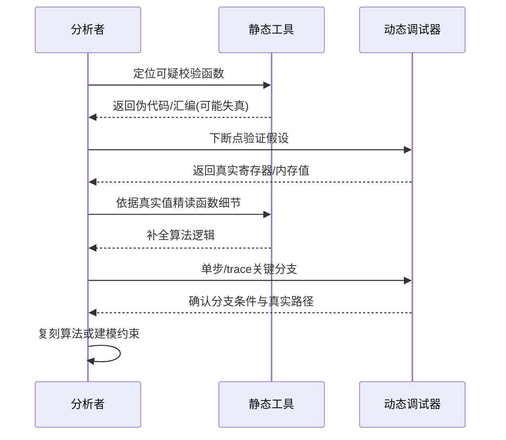
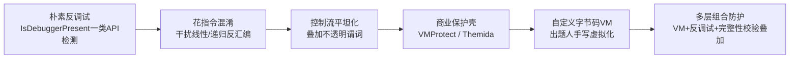
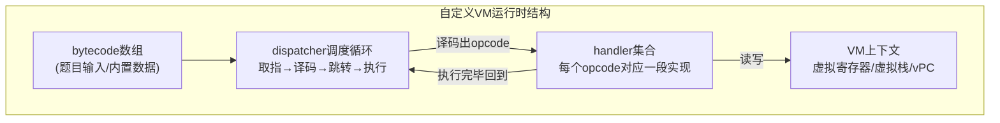
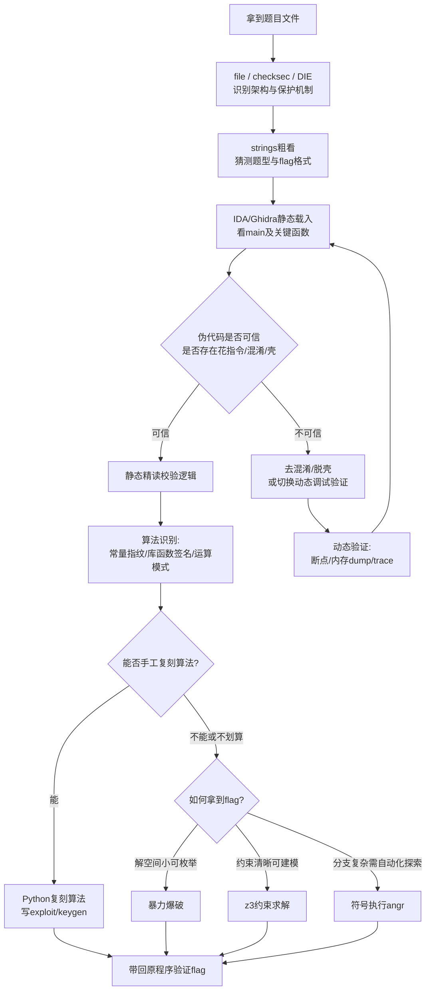

# CTF方法论体系（3）· Reverse解题范式

> [!abstract] TL;DR
> - Reverse解题的核心范式是"静动结合"：静态分析给出结构地图，动态调试给出运行时实况，二者应交替迭代而非线性先后，这是应对混淆、加壳、间接跳转的根本方法论，而不只是"两种工具都用一下"。
> - 反汇编器的递归下降与线性扫描之争，是花指令能够生效的根本原因；反编译伪代码是多轮化简后的产物，遇到失真时必须回落到汇编层核实，绝不能把伪代码当作绝对真理。
> - 去混淆按作用对象可分为控制流混淆（平坦化、不透明谓词、花指令）、数据混淆（字符串与常量加密）、API混淆、VM虚拟化四类，各自有可识别的特征与对应处理范式，不存在"一招吃遍天"的通用反混淆器。
> - 算法识别依赖密码学常量指纹、库函数签名（FLIRT/Function ID）、位运算模式三层递进的手段，识别出算法身份之后才谈得上"复刻算法、直接爆破还是转求解器"的路线选择。
> - 暴力枚举、SMT约束求解（z3）、符号执行（angr）是拿到flag的三条"不必完全读懂代码"的路径，选择依据是解空间大小、约束可建模程度与路径复杂度，三者是效率权衡关系而非替代关系。
> - 自定义字节码VM保护是近年CTF Reverse的重头戏，逆向范式相对固定：定位dispatcher → 提取opcode-handler映射 → 逐个还原语义 → 编写反汇编器/模拟器 → 模拟执行或转约束求解，模拟执行往往比逐条读懂handler更省力。

## 概述与定位

在CTF的四大传统方向里，Reverse（逆向工程）解决的问题可以概括为一句话：给定一份不带源码的可执行产物，在不运行完整业务系统的前提下，独立还原出它的判定逻辑或隐藏语义，最终给出一个能让程序判定"正确"的输入，或者从其静态/运行时状态里抠出被隐藏的信息。这份"可执行产物"的形态在不同题目里差异很大——可能是一个传统的Windows PE或Linux ELF，可能是一个Android APK里的smali/ART字节码配合JNI层的so动态库，可能是.NET的IL或Java的class字节码，可能是Python编译产物pyc、Lua编译产物luac、甚至是WebAssembly模块，也可能是出题人自己设计的一套字节码虚拟机。无论载体如何变化，Reverse的解题范式是稳定的：静态读结构、动态验实况、识别算法身份、选择最省力的方式拿到答案，这也是本篇标题"解题范式"的含义所在——本文关心的不是某一款工具的按键操作，而是面对一个陌生的二进制，应该按什么顺序、依据什么判断标准去推进分析。

Reverse与Pwn的工具链高度重叠：两者都要用反汇编器读汇编、用调试器观察运行时状态，很多队伍甚至是同一批人同时打这两个方向。但二者的目标本质不同——Pwn关心"如何劫持控制流"，分析的落脚点是寻找内存破坏点、构造ROP/堆利用链；Reverse关心"程序在计算什么"，分析的落脚点是完整还原一段算法或验证逻辑的语义。实战中两者会相互渗透：一道题可能需要先用逆向手段理清目标程序的输入格式和校验流程，再在校验函数内部找到一个可以溢出的缓冲区，从而把"解方程"式的正面硬解转化为"劫持控制流跳过校验"的捷径——这类题目通常归类为Pwn而非Reverse，因为得分点是完整的利用链而不是算法还原，但它提示一个重要的思维习惯：做纯Reverse题时也不应该忘记扫一眼是否存在比正面推导算法更省力的漏洞式捷径，这是两个方向思维方式相互借鉴的地方，具体的漏洞利用范式见 [[33.二进制漏洞与利用基础/00.二进制漏洞与利用基础总览]]。

Reverse与Crypto的边界则划在"识别"与"破解"之间：当Reverse题目的核心校验逻辑是一个标准或近似标准的密码学算法时，识别出这是哪个算法、参数是什么，属于Reverse的工作范畴；而识别之后如何利用该算法本身的数学弱点（已知明文攻击、小指数攻击、格基规约等）去破解，则是Crypto方向的知识体系，本篇只在"算法识别"一节讨论识别方法，具体攻击手法留给 [[04.Crypto解题范式]] 展开。

评分机制上，绝大多数Reverse题是二元判分——拿到能通过校验的flag才算，中间过程没有分数。这意味着"分析到80%但没摸到最后一个跳转条件"和"完全没有分析"在得分上是等价的，这与Web/Misc方向常见的分段式线索收集有明显区别。这个特点直接影响比赛节奏：既然过程不计分，就应该在分析陷入僵局时果断设置止损点——如果一道题啃了半小时仍摸不清校验函数的整体结构（既不符合任何常见算法特征，也定位不到能收敛的关键跳转），比起继续埋头单步调试，换题或呼叫队友支援往往是期望收益更高的选择。

按平台/载体维度，题型大致覆盖：传统PC二进制（Windows PE的x86/x64，Linux ELF）；移动端（Android的smali/Dalvik或ART字节码+JNI native so库，iOS较少见但会涉及Mach-O与越狱环境限制）；托管字节码（.NET IL、Java class/jar）；脚本编译产物（Python pyc、Lua bytecode）；WebAssembly（已有实战案例见 [[40.WASM与虚拟化壳逆向/08.WASM CTF实战]]）；出题人自制的字节码虚拟机；以及固件/嵌入式场景下的ARM、MIPS、RISC-V裸机程序。按考察点维度，则可以归纳为四类且经常叠加出现：算法还原型（逆向出自定义加密/编码算法后写脚本还原明文或生成keygen）、逻辑验证型（多层if判断或状态机式的输入校验，本质是寻找满足全部约束的输入）、隐藏信息型（flag直接躺在数据区、资源文件或运行时内存里，只需要正确的手段把它取出来）、保护对抗型（真正的难点在于绕过壳、反调试、VM混淆才能看到被保护的逻辑）。一道有分量的"重题"往往是保护对抗型叠加算法还原型或逻辑验证型——先要脱壳或者拆穿VM，才能谈得上后面的算法分析。

## 原理与机制

要理解为什么"静动结合"是必须的范式而不是可选项，需要先搞清楚静态分析和动态分析各自的能力边界从何而来，这直接由它们的底层原理决定。

静态分析的第一层原理是反汇编——把机器码字节流还原成汇编指令序列。这件事在精简指令集（如ARM定长32位指令）上相对简单，但在x86/x64这种变长CISC指令集上存在一个根本性的困难：代码和数据在文件里长得一样，都是字节，反汇编器必须自己判断"从哪个字节开始才是一条指令的起点"。解决这个问题历史上形成了两条路线。线性扫描（linear sweep）从代码段起始处顺序解码，遇到字节就当作指令处理，实现简单、速度快，但一旦中间混入了数据字节（比如跳转表、内联常量）或者精心构造的花指令，就会从错误的偏移开始解码，导致后续一长串指令全部错位——这是早期反汇编器（以及至今很多轻量工具）最大的软肋。递归下降（recursive descent）则反过来，从已知的代码入口点（如函数起始地址、被调用的目标地址）出发，严格沿着控制流（顺序执行、条件/无条件跳转、调用）去发现下一条指令，天然会跳过夹在代码中间的数据，因此准确得多。IDA Pro和Ghidra都以递归下降作为主策略，辅以线性扫描去补扫未被控制流覆盖到的空隙地址。这个实现细节直接解释了花指令为什么有效：只要能让递归下降反汇编器错误地把一段本不该被执行的字节当作控制流的一部分去解码（例如在无条件跳转指令后面插入几个会被跳过的垃圾字节，但反汇编器如果没有严格识别出"这条jmp之后不会顺序执行到下一条"就会继续往下解码这些垃圾字节），就能制造出大片错误的反汇编结果，这也是为什么会在IDA里看到某个函数从某处开始变成一堆无法理解的指令乱码。

静态分析的第二层原理是反编译——在反汇编基础上进一步恢复出接近高级语言的伪代码。这不是简单的指令到语句的字面翻译，而是一条完整的流水线：先构建控制流图（CFG），再把机器指令抬升为某种中间表示（IR），对IR反复做化简（常量传播、公共子表达式消除、变量合并）、类型推断、循环与分支结构识别，最后pretty-print成C风格的伪代码。以IDA的Hex-Rays反编译器为例，其内部会先把汇编抬升为一种被称为microcode的中间表示（形态上更接近SSA），再逐步做优化和化简，这也是为什么同一段汇编在不同优化阶段呈现出的伪代码结构可能天差地别。理解这条流水线的意义在于：伪代码是"化简后的产物"，当原始代码存在花指令、高强度的编译器优化、或者刻意构造的等价指令替换时，中间表示的化简步骤可能产生失真甚至完全错误的伪代码——常见症状是莫名其妙的强制类型转换、找不出规律的goto、或者反编译器直接报错拒绝生成。这意味着伪代码只能作为参考而非证据，任何看起来违反直觉的伪代码片段，都应该回落到汇编层面逐指令核实，这条原则贯穿整个Reverse分析过程。

静态分析的第三层原理是交叉引用与数据流。反汇编/反编译建立起指令和函数的骨架之后，分析师真正依赖的定位手段是交叉引用（xref）——"谁调用了这个函数""谁引用了这个字符串""这个全局变量在哪些地方被读写"。IDA/Ghidra在分析阶段会为每一个符号建立引用图，这让分析师可以从一个已知的锚点（往往是一条可读的字符串，比如错误提示或者flag格式提示）反向追溯到调用它的函数，进而定位到核心校验逻辑，这是比"从main函数顺着看下去"快得多的定位手段，也是静态分析里效率最高的技巧之一。

动态分析的原理建立在另一套机制上：调试器利用操作系统提供的调试接口（Windows的Debug API，Linux的ptrace系统调用）让目标进程在指定位置暂停，从而读写它的寄存器和内存。断点分为两种实现：软件断点是把目标地址的第一个字节替换成`0xCC`（int3中断指令），触发后再恢复原字节，代价是修改了代码段内容，容易被完整性校验发现；硬件断点利用CPU提供的调试寄存器（x86的DR0-DR3）在不修改内存的前提下监视执行/读写某地址，数量有限（通常4个）但更隐蔽。动态插桩（DBI，Dynamic Binary Instrumentation，代表工具如Intel Pin、DynamoRIO、Frida）走的是第三条路：不依赖传统断点暂停-恢复的交互模式，而是在目标运行前对其代码做即时重写，在基本块边界插入回调，从而能在不中断执行的前提下做大规模的行为记录（比如给每一次目标函数调用都记录参数和返回值，或者收集代码覆盖率），效率和自动化程度远高于人工单步调试，代价是需要修改内存页属性、插入跳板代码，本身也构成一定的可检测面。

无论走哪条动态分析路线，其能拿到的信息都是静态分析拿不到、或者只能靠推理拿到的三类东西：真实运行时值（比如一段解密循环执行完之后内存里到底是什么字符串，静态分析只能看到密文和算法但动态一步就能拿到明文）、真实执行路径（一个有几十个分支的函数，运行时到底走了哪几条，剩下的是不是死代码）、间接跳转的真实目标（虚函数表调用、函数指针数组，以及后面要详细讨论的VM dispatcher跳转，这些静态时目标地址往往无法直接确定，动态一步就能看到跳到哪里去了）。

最后，为后续"算法识别"一节做铺垫，程序里的校验逻辑虽然千变万化，但收敛到有限几种通用模式：直接比较型（输入和硬编码值逐字节比较，最简单，静态读常量即可）、变换后比较型（输入经过某种hash/encrypt变换后与目标值比较，需要识别出变换算法本身）、状态机型（每读入一个字符触发一次状态转移，最终停留在接受状态才算通过，本质是一个DFA，常见于伪装成"自定义算法"实则只是正则约束的题目）、方程型（输入的每个字节参与到一组线性或非线性方程里，最终判断方程组是否有解，这类题目是SMT求解器最理想的战场）、VM字节码型（输入被送入一个自定义虚拟机执行，虚拟机的最终执行结果决定flag正确与否）。识别出属于哪一种模式，是决定后续用哪种手段拿到答案的第一步判断。

静态和动态由此构成互补而非替代的关系：静态给出的是"地图"——整体结构、所有可能的代码路径、函数间的调用关系；动态给出的是"实况"——这条路径运行时到底走不走得通、某个值运行时到底是多少。纯静态分析在遇到密集的间接跳转、自修改代码、高强度混淆时会全面失效或者效率极低；纯动态分析在需要探索所有分支（比如寻找一个隐藏的后门分支）时同样效率低下，而且容易一头撞进反调试的陷阱。这正是下一节要展开的核心方法论。

## 静动结合、去混淆与算法识别详解

### 静动结合的方法论与切换时机

实战中最容易犯的错误是把静态分析和动态调试当成两个独立阶段——"先用IDA看一遍，看不懂了再上调试器"，这种线性思维在简单题目上够用，但在中等难度以上的题目里会严重拖慢速度。更有效的范式是把二者视为一个持续切换的迭代循环：静态定位关键点，动态验证或取值，回到静态精读细节，再回到动态确认分支，如此往复，直到校验逻辑被完全摸清。

判断"何时该从静态切到动态"有几个明确信号：反编译出的伪代码出现大量强制类型转换、看不出规律的goto、或者根本无法生成，说明反编译器的化简流水线在这段代码上失效了，继续瞪着伪代码不会有进展；出现了目标无法静态确定的间接跳转或间接调用（函数指针数组、虚函数表、VM dispatcher），这类地址只有运行时才能知道；数据段里存在高熵的乱码字节，怀疑是加密字符串或加密常量，但静态通读解密算法比较费时；怀疑存在反调试或自修改代码，导致静态视图和实际运行行为不一致。反过来，"何时该从动态切回静态"的信号是：已经通过动态调试验证了某个假设（比如确认某个函数确实是标准MD5），这时候继续单步已经没有信息增量，应该回到静态视图完整通读这个函数的边界和调用上下文，为后续写复刻脚本做准备；或者动态调试因为反调试直接被打断（进程退出、行为异常），这时候需要回静态定位反调试判断点，做静态patch之后再重新起调试。

一个能显著提升动态分析效率的具体技巧是条件断点与日志断点（logpoint）的组合使用：与其在一个循环体内一次次按F8/F7单步，不如设置一个不中断执行、只在命中时记录寄存器/内存快照的日志断点，让程序自然跑完，事后一次性查看所有记录——这本质上是用少量的交互动作换取大量的运行时数据，是动态分析里效率最高的操作方式，纯手工单步反而是效率最低的做法，只应该在需要精确观察单条指令副作用时才使用。x64dbg、IDA自带调试器、GDB配合pwndbg/gef都支持这类条件断点脚本化。

静动结合还有另一种更"重"的形态：静态patch影响动态执行路径。比如识别出一段反调试判断之后，与其在每次动态调试时都手动跳过它，不如直接用IDA的Patch Bytes、Keypatch插件或者IDAPython脚本把判断跳转永久改写（比如把条件跳转改成无条件跳转，或者直接nop掉整段检测），生成一个"干净"的二进制文件，后续所有动态调试都基于这个已经去除了反调试的版本进行。这样静态分析的产出（一次性patch）反过来定义了动态分析的输入，体现了静动结合不是简单的工具混用，而是分析结果在两种视角间的相互反哺。

### 去混淆的技术演进与处理范式

CTF里的混淆技术并非一成不变，理解其演进脉络有助于快速判断眼前的题目大致处于哪个"重量级"：

早期的"重题"往往只是简单的API级反调试加上少量花指令；进阶题目开始出现编译器级的控制流平坦化和不透明谓词，这类混淆通常借助OLLVM之类的编译期混淆框架批量生成，而不是出题人手写；再往上是直接套用商业保护壳，把整个程序用一个自定义VM指令集重新编译一遍；最新的趋势则是多种手段叠加，比如VM保护内部再嵌套反调试判断，或者VM的handler本身又被控制流平坦化处理过。这个演进脉络的实用价值在于：拿到题目先做一次强度判断（用DIE看是否有壳特征、反编译看是否有异常的巨大switch、粗略跑一下看是否有反调试导致的异常退出），大致就能预估这题的工作量级别，避免用简单题的心态一头扎进一道需要先脱壳再拆VM的重题。

具体到处理范式，控制流混淆内部还要再细分。控制流平坦化（Control Flow Flattening）把原本线性排列的基本块打散，用一个`while(1) { switch(state) { ... } }`结构的调度器（dispatcher）根据一个状态变量决定下一步执行哪个基本块，原来的顺序/分支关系被编码进了状态值的转移规律里。识别特征很明显：反编译后会看到一个异常庞大的switch，每个case分支执行完自己的逻辑后都会给同一个状态变量赋新值再continue回到循环头。处理思路有两条：工程化程度高的题目可以写脚本静态解析每个case里状态变量的赋值表达式，重建出状态转移图，再据此还原原始的基本块顺序；更复杂、状态转移依赖运行时数据的情况则需要借助符号执行遍历所有可能的状态转移路径。

不透明谓词（Opaque Predicate）是插入恒真或恒假、但形式上看起来依赖运行时输入的条件跳转（例如利用二次剩余的性质构造出类似`x*x % 4`恒不等于2这样的表达式），制造出大量实际不可达的死代码分支来迷惑分析和拖慢符号执行。识别特征是条件表达式本身与真正的业务输入无关、且可以脱离上下文单独静态求值。处理方法是把这类表达式喂给SMT求解器判断其可满足性——如果z3能在瞬间证明某分支条件恒真或恒假，就可以直接静态化简掉对应的死分支，这也是符号执行工具内部常常自带的一项优化（提前用求解器过滤不可达路径，缓解路径爆炸）。

指令替换/等价替换（比如把一次`mov`拆成语义等价但形式不同的`push`+`pop`，或者用两次减法表达一次加法）主要是为了对抗基于固定字节模式的签名检测，同时增加人工阅读的心理负担，本身不构成信息隐藏，识别和处理主要依赖分析者的模式经验积累，遇到"看起来毫无必要的复杂算术组合"时应保持怀疑，尝试用符号计算工具（如z3化简一个表达式，或者干脆手工代入几个值验证）确认其真实语义等价于某个更简单的运算。

花指令（Junk Instruction）是前面在"原理与机制"一节里提到的反汇编陷阱的具体武器化：在一条无条件跳转之后紧跟几个字节，这些字节从来不会被执行（因为上面那条跳转已经把控制流带走了），但如果反汇编器没有严格遵循控制流、而是习惯性地继续往下顺序解码，就会把这些"死字节"错误地当成指令解析，进而导致后续的字节边界全部错位。识别特征是反编译视图从某处开始变得完全不可读，或者IDA图形视图里出现大片红色未定义数据夹杂灰色未探索代码。处理方法是手工在花指令处按`D`强制转换成数据、在正确的指令起始地址按`C`强制转换成代码，把反汇编器的解码基准掰回正轨；批量出现的同类花指令可以写IDAPython脚本按固定字节pattern匹配后自动nop掉；也可以配合动态调试，直接观察EIP/RIP真实经过的字节序列来确认哪些字节属于死代码、哪些才是真正会执行的指令边界，这是"动态验证辅助静态修正"的典型场景。

字符串与常量加密几乎是现代题目的标配，目的很直接——防止`strings`一把梭直接扫出flag格式提示或者关键调试字符串。识别特征是数据段呈现高熵字节（不像可打印字符串），并且在使用点之前有一小段循环（异或、加减、查表置换）把这些字节转换成明文并写到栈上或者堆上的临时缓冲区。这里有一个效率上的重要判断：如果只是要拿到某几个具体字符串的明文，最快的手段几乎总是动态下断点在使用点（比如传给`strcmp`或者传给某个输出函数之前），直接从内存里dump出已经解密好的字符串，比静态通读解密算法再手工/写脚本复现要快得多；只有当需要批量还原大量字符串（比如整个VM里所有的字符串常量），或者字符串加密算法本身就是题目考察的算法还原对象时，才值得静态提取算法逻辑再用Python复刻批处理。

API/符号混淆则是把原本通过导入表（IAT）静态可见的系统API调用，改成运行时用`GetProcAddress`（或者Linux下的`dlsym`）配合对函数名做hash之后再比较的方式动态解析，这样IDA静态分析时看不到任何有意义的函数名，只能看到一堆间接调用`call [reg]`。处理方法通常是动态下断点在`GetProcAddress`的返回处，记录每一次传入的hash值和拿到的真实函数地址，反推出hash到API名称的映射表，再回到静态视图批量重命名调用点，一次动态调试即可把整个函数的可读性恢复到接近未混淆的水平。

### VM保护的逆向范式

自定义字节码虚拟机是近年CTF Reverse里分量最重的题型之一，因为它把"逆向"这件事从"读懂一段算法"升级成了"设计并逆向一整套指令集"，工作量和思维复杂度都显著更高，值得单独展开成一套固定范式。

自定义VM的运行时结构高度模式化，无论出题人怎么包装，拆开来看都逃不出四个组成部分：一段作为输入的opcode字节数组（bytecode）；一个承载运行状态的上下文结构（虚拟寄存器组、虚拟栈、虚拟程序计数器vPC，通常就是宿主进程里的一块内存或几个局部变量）；一个调度循环（dispatcher），本质是取指-译码-执行循环的具体实现，形态上通常是`while (vpc < len) { op = bytecode[vpc]; switch(op) {...} }`或者更隐蔽的跳转表索引形式；以及一组handler函数（或者内联在switch每个case里的代码块），每个handler对应一个opcode，负责完成该指令定义的具体语义。

逆向这类VM的标准范式分五步，每一步都建立在上一步的产出之上：第一步是定位dispatcher，做法是在反编译视图里寻找一个明显的循环，循环体内有一处基于某个变量（这个变量几乎必然就是vPC指向的当前opcode）做的多路分支（switch或者跳转表索引），这就是取指-译码-执行循环的核心，一旦找到它，整个VM的边界也就确定了；第二步是提取opcode到handler的映射，逐一枚举switch的每个case（或者跳转表的每个slot），记录下每个opcode数值对应哪一段代码；第三步是逐个还原handler语义，这一步最耗时也最考验经验，核心是观察每个handler对"虚拟寄存器/虚拟栈/虚拟内存"做了什么操作——是从栈顶弹出两个值做加法再压回去、是异或某个立即数、是根据栈顶值决定vPC的跳转目标、还是直接调用了宿主进程的某个函数（这种情况通常意味着该opcode是某种"系统调用"桥接，比如输出字符或者读取输入），并把这个操作映射成一条易读的假想指令（比如`VADD`、`VXOR`、`VJMP`、`VSYSCALL`）；第四步是编写反汇编器或者模拟器，用Python把整段bytecode批量解析成第三步定义的假想指令序列（得到一份可读的"VM汇编"），如果目标是完整还原算法语义就到这一步为止配合人工阅读，如果目标是直接拿到执行结果则进一步写一个能完整执行这份bytecode的模拟器；第五步是求解，如果VM最终会对某个内部状态做比较判断，可以选择直接用模拟器跑一遍观察结果（如果输入是固定的，比如题目本身自带了一段需要解密的数据），也可以选择把输入符号化（每个输入字节变成一个z3的BitVec符号变量）送进模拟器执行，让模拟器在执行VM指令的同时收集约束，最终对着"VM判定通过"这个目标状态调用求解器要出一组具体的输入值——这是"自定义VM+约束求解"结合的高阶技巧，效果上相当于对VM这一层单独做了一次符号执行，但因为是分析者自己手写的模拟器，比直接对整个宿主程序跑angr要可控得多，不会被VM之外的初始化代码或者宿主层的反调试拖累陷入路径爆炸。

这里有一个贯穿全篇的效率原则值得再次强调：第四步"编写模拟器"往往比第三步"完全读懂每个handler的语义"性价比更高——分析者不需要真正"理解"某条指令在做什么高层含义，只需要正确复现它对虚拟机状态的副作用，模拟执行自然会算出正确结果，这比试图从一堆`VADD`/`VXOR`里读出"这其实是在算MD5"要省力得多，只有当题目明确要求理解算法语义（比如要求写出等价的加密函数）时，才需要进一步做语义层面的归纳。

### 脱壳的标准流程

去混淆里还有单独成体系的一支——脱壳，处理对象是把整个原程序打包压缩或加密、运行时先解压/解密自身再跳转执行的保护壳。壳大致分三类：压缩壳（如UPX），目的主要是减小体积并附带轻度反分析效果，脱壳相对容易；加密/保护壳（如VMProtect、Themida、ASProtect），目的是强反分析，往往把VM虚拟化、反调试、完整性校验捆在一起，脱壳与后续分析的难度大幅上升；自制壳（出题人手写的简单加壳stub），通常只是一段自解密循环，处理起来更接近字符串解密而非成熟商业壳。

标准脱壳流程分五步：第一步用Detect It Easy（DIE）或者PEiD之类的工具识别壳的种类和编译器/语言特征，这一步决定了后面要投入多大精力；第二步寻找OEP（Original Entry Point，程序解壳后真正的入口点），最经典的手法是"ESP定律"——多数壳在入口处会用`pushad`把当前寄存器全部压栈保存，此时ESP指向的栈顶地址在整个脱壳过程中相对固定，对这个ESP地址下硬件访问断点，当壳完成解压/解密、执行对应的`popad`恢复寄存器现场时会命中该断点，紧随其后往往就是一条跳到OEP的指令；另一种通用性更强但对壳的行为要求更宽松的手法是内存访问断点法，对代码段设置内存断点，壳在解密/解压完成后必然要执行到那段被解密出来的代码，从而自然触发断点。第三步是在OEP处用工具（OllyDumpEx、Scylla、x64dbg的插件等）把内存中此刻已经完全还原的镜像dump到文件。第四步修复导入表（IAT）——壳运行期间经常会重建或者延迟解析IAT，直接dump下来的文件里IAT可能不完整，或者仍然指向壳自身的桥接跳板代码，需要用Scylla等工具重新搜索真实的API地址并重建一份干净的IAT，否则dump出来的文件无法独立运行。第五步修复PE头的入口点字段指向真实OEP、修正各节的virtual size等信息，使脱壳产物能被IDA/Ghidra正常静态加载分析。

一个值得强调的实战判断是：CTF语境下脱壳的目的通常不是"生成一个能双击运行的干净exe"，而是"生成一份更适合静态分析的镜像"，这两者的验收标准不同——即便IAT没有修复到完美、程序脱壳后不能独立运行，只要IDA/Ghidra能在dump出的文件上正确定位函数边界、看懂控制流，就已经达到了目的，不必像真实的商业软件破解那样苛求生成一份可分发的完整程序，这是应试效率和"完整的逆向工程产物"之间值得主动放弃的部分，在有限比赛时间里应该优先把精力投入到后续的算法分析而非追求脱壳产物的完美可执行性。

### 算法识别：密码学指纹与运算模式

一旦通过前几步拿到了一份可以正常阅读的静态视图（无论是天然没有混淆，还是经过前述处理去除了混淆），下一个关键判断是识别校验逻辑里用到的具体算法——这一步的意义在于，识别出算法身份之后，才谈得上是复刻算法本身、还是转而寻找该算法的数学弱点、还是干脆放弃理解直接暴力/求解。

密码学常量指纹是最快速的识别手段，原理是几乎所有标准密码学算法都带有若干硬编码的、独一无二的常量：MD5/SHA1/SHA256系列有各自固定的初始化向量和每轮常量表（比如MD5的`0x67452301, 0xEFCDAB89, 0x98BADCFE, 0x10325476`）；AES有以`0x63, 0x7C, 0x77, 0x7B...`开头的S-box代换表和对应的Rcon轮常量表；CRC32有对应多项式`0xEDB88320`生成的查找表；Base64有固定的64字符编码表；TEA/XTEA/XXTEA系列有来自黄金分割比的特征常量`0x9E3779B9`；即便是没有固定常量的流密码如RC4，也有典型的、可识别的结构模式（KSA阶段对256字节S盒做基于密钥的置换，PRGA阶段用双指针不断交换字节并输出）。IDA插件FindCrypt/FindCrypt2、独立工具Signsrch、以及社区维护的YARA密码学常量规则库，做的都是同一件事——拿一个已知常量数据库去扫描目标文件或者运行时内存，命中就报告"这里可能是某算法"。这类工具本质上是签名匹配，速度快、误报率低，但对变形过的常量完全失效——如果出题人对标准S-box做了移位、异或掩码或者字节重排后再嵌入代码，任何基于原始字节匹配的工具都会失手，此时只能退回到观察运算结构本身：是否存在典型的分组处理（每次处理固定字节数，比如AES的16字节分组）、字节代换（查表）、行/列级别的混淆变换，这几个特征叠加出现就足以怀疑是某个SPN结构分组密码的变体，即便具体是哪一款也可以先假设为AES变体去验证。

库函数识别处理的是另一类情况——目标程序静态链接了标准库（libc的内存/字符串函数、静态链接的zlib/openssl等），这些函数的机器码原封不动地被编译进了二进制，可以通过特征匹配找回函数名。IDA的FLIRT（Fast Library Identification and Recognition Technology）签名和Ghidra的Function ID Service都是做这件事：对函数机器码计算一种忽略了重定位地址、栈帧偏移等可变部分的特征哈希，去和已知的签名库比对，命中后自动恢复函数名和参数信息，能大幅降低分析成本（不再需要把`memcpy`/`malloc`这类函数当成黑盒一条条手工分析）。局限性也很明显：签名是针对特定编译器版本和优化选项生成的，题目如果用了少见的工具链或者激进的优化选项，机器码层面的细微差异就会导致签名不命中，此时要么自己动手基于目标程序生成一份专属签名库，要么放弃工具辅助纯靠人工识别标准库函数的调用模式（比如观察到"复制内存"这种朴素行为特征就足够判断是memcpy语义，不必执着于恢复函数名）。

当密码学常量、库函数签名两层手段都不命中时，最后的手段是纯粹依靠对运算模式的经验性判断，这也是最考验分析者积累的部分：出现大量异或、循环移位、无进位加法组成的位运算循环，应当怀疑是流密码或者自定义hash；出现固定长度的分组处理（比如每次处理8字节或16字节）加上多轮结构相同的循环，应当怀疑是分组密码，进一步观察是Feistel结构（每轮只处理一半数据、和另一半做异或后交换）还是SPN结构（每轮对全部数据同时做代换和置换）；出现固定长度查找表加上索引变换，应当怀疑是S-box代换或者置换密码；出现用数组表示、支持加减乘和取模运算的"大数运算"逻辑，应当怀疑是RSA或者其他公钥算法，此时分析的重点应该转向寻找模数、指数等参数的具体数值，而不是纠结于大数乘法本身是怎么用循环实现的——这类题目一旦确认是公钥算法，接下来该做什么已经超出Reverse范畴，需要交给Crypto方向的分析流程（比如判断指数是否过小、模数是否被复用、是否存在已知的分解弱点），详见 [[04.Crypto解题范式]] 与 [[37.密码学/53.密码学攻击概览]]。

识别算法身份本身不是终点，而是一个岔路口——确认之后要立刻决策接下来走哪条路，这正是下一小节要展开的内容。

### 爆破、SMT求解与符号执行的取舍

有三条路径可以在不完全读懂算法内部细节的前提下拿到最终答案，这是Reverse区别于单纯"读代码"的重要范式，实战中该如何选用需要一套清晰的判断标准。

暴力枚举是最朴素的一条路，适用的前提有两个：解空间足够小（比如已知flag只有几位是变量、或者是一个4-6位的数字PIN），以及验证函数可以被快速地反复独立调用。第二个前提往往比第一个更重要——如果校验逻辑可以脱离原程序单独抽取出来，用C或者用CPU模拟器（如Unicorn Engine）直接复现，脱离原进程逐次fork/重启的开销后，单次验证的耗时可以从毫秒级降到微秒级，配合多进程/多线程并行，原本"理论上可行但要跑几天"的枚举可能被压缩到几分钟。用Unicorn这类模拟器的额外好处是分析者甚至不需要完全理解校验逻辑的语义，只要能正确抠出这段汇编代码的地址范围、正确初始化好调用前的寄存器和内存状态，就能让模拟器把这段代码当成黑盒跑起来，反复喂不同输入观察输出，这本身也是一种"绕过完全理解直接拿结果"的思路。

SMT约束求解（以z3为代表）适用的场景是校验逻辑能够表达成一组关于输入比特/字节的约束——比如"每个字符要满足某个数值方程"、"输入异或某个常量后必须等于目标值"，并且这些约束落在求解器支持的理论范围内（位向量、线性或非线性整数算术等z3支持得比较成熟的理论）。这条路径的核心工作量在"手工建模"：分析者需要把汇编或伪代码里的每一步运算，逐条翻译成z3的符号表达式——寄存器和内存里的值换成z3的符号变量，`mov`/`xor`/`add`/`shl`等指令换成对应的符号运算API调用，翻译完整段校验逻辑之后再调用求解器的`solve()`/`check()`，让它给出一组满足全部约束的具体输入。这个方法相比暴力枚举的本质区别在于：z3处理的是约束满足问题而不是遍历——它内部基于DPLL/CDCL（冲突驱动子句学习）之类的算法，能够利用约束之间的相互关联做剪枝，因此哪怕表面上的解空间是指数级的（比如32字节输入、每字节都参与一个独立方程），只要约束足够"稠密"能相互制约，往往可以在秒级出解，这是纯遍历式暴力枚举完全做不到的规模。

符号执行（以angr为代表，具体建模技巧留给专门的 [[45.反编译器与反汇编引擎原理/11.符号执行与angr框架]] 与 [[09.符号执行辅助解题：angr实战]] 展开，这里只讨论"什么时候该选它"）适用的场景是连手工翻译约束都显得过于繁琐——校验逻辑里有大量条件分支、循环次数依赖输入不固定、或者调用了难以手工建模的库函数，分析者希望有一套工具能自动化地"跑一遍程序"但把具体数值换成符号变量，每经过一次分支判断就自动记录下走这条分支需要满足的约束，最终把"能否到达某个目标地址"这个问题转化成一次约束求解直接丢给z3求解。符号执行最大的痛点是路径爆炸——每多一个分支，潜在的路径数量可能翻倍，函数调用、循环、甚至每一次内存访问都可能触发对齐问题带来的路径分裂，因此实战中几乎不会对一整个程序无脑跑符号执行，而是要先靠静态分析定位好精确的起始地址、目标地址和需要主动规避的地址（对应angr里的start/find/avoid概念），把符号执行的探索范围收窄到真正需要求解的那一小段校验逻辑上，避开无关的初始化代码、错误处理分支、已知的反调试判断分支——这本身正是"静态定位+动态/符号化验证"范式在自动化工具链上的延伸体现，而不是一个可以脱离前面所有分析独立使用的黑盒魔法。

三条路径的选择本质上是一次效率权衡，而非孰优孰劣的替代关系：暴力枚举要求"执行速度快、解空间小"，对分析者的建模能力要求最低但对工程实现（如何让校验函数跑得快）要求较高；z3要求"约束能被清晰地手工建模"，对分析者翻译约束的耐心和准确性要求高，但求解本身的速度优势明显；符号执行要求"愿意投入时间调优避免路径爆炸"，省去了手工翻译约束的枯燥工作，但对大型或结构复杂的程序而言调试和调优成本可能反超前两者。一条实用的经验法则是按顺序尝试：先判断能不能直接暴力（最省脑力），不行再看校验逻辑的方程结构是否清晰到可以手工喂给z3（中等脑力，但求解快），都不行再上符号执行（前期调优最费时间，但换来最高的自动化程度）。

## 工具视角与实战

工具的选择本质上是在"分析质量"和"自动化/成本"之间做取舍，理解每款工具的定位比记住它的快捷键更重要。

反编译器三强各有取舍：IDA Pro凭借Hex-Rays反编译器的成熟度、FLIRT签名库的覆盖广度、以及最庞大的插件生态，长期是分析质量的标杆，代价是商业授权费用；Ghidra是NSA开源的免费替代品，反编译质量已经非常接近IDA，自带Python/Java双语言脚本接口，还有内建的版本对比（Version Tracking）功能，适合团队协作或者需要反复比对补丁差异的场景（比如比较去混淆前后的两份代码）；Binary Ninja走的是另一条路线，它的多层中间表示（BNIL，从贴近汇编的LLIL到贴近源码的HLIL逐级抬升）设计得比IDA的microcode更开放，更适合写自动化分析脚本，中端定价定位介于免费和IDA之间。三者不是互斥关系，实战中常见的搭配是主力用IDA或Ghidra做人工分析，遇到需要写复杂脚本批量处理（比如前面提到的花指令批量patch、VM handler批量提取）时用Binary Ninja的API或者IDAPython实现。

动态调试/插桩工具的选择则取决于目标平台和分析粒度：Windows用户态调试首选x64dbg（开源、活跃、插件生态成熟，尤其是ScyllaHide这个反反调试插件几乎是脱壳/反调试对抗的标配）；Linux下GDB配合pwndbg/peda/gef之类的增强插件是事实标准，能和pwntools无缝衔接形成脚本化调试链；当分析目标是Android/iOS或者需要hook用户态任意函数、不方便用传统调试器暂停执行时（比如反调试特别敏感、暂停会导致业务逻辑判定超时失败），Frida是几乎无可替代的选择——它用JS/Python编写hook脚本，注入目标进程后可以在不重启、不暂停的前提下动态修改函数行为、替换返回值、绕过校验，这也是移动端逆向的核心工具。

具体到细分场景，Android逆向实战有一套相对固定的流程：先把APK解压，用jadx反编译Java层代码，定位到JNI调用点（通常是一个`System.loadLibrary`加上若干`native`方法声明）；对应的so库丢进IDA/Ghidra按传统ELF分析流程处理；需要观察运行时行为时用Frida hook Java层方法记录参数/返回值，或者hook native层导出函数，同时用现成的Frida脚本绕过常见的SSL Pinning、Root检测、模拟器检测等防护。这里还有一个CTF语境下特别高效但"不那么优雅"的技巧：如果只是要让某个校验方法返回true而不关心它内部到底怎么算的，直接反编译smali、把关键的条件跳转指令改掉（比如让`if-eqz`恒定跳转到成功分支）、重新打包签名安装，这种"静态patch走捷径"在真实的软件安全评估中并不提倡（因为不解决根本问题），但在CTF里只要能拿到flag就是完全合法且高效的手段，提示了一个更普遍的原则：解题效率优先于逆向工程的"完整性"。

反调试对抗需要按检测原理分层拆解而不是逐个死记：用户态API级检测（`PEB.BeingDebugged`、`NtQueryInformationProcess`、`IsDebuggerPresent`、`CheckRemoteDebuggerPresent`）可以用ScyllaHide或者TitanHide这类插件一键批量隐藏，原理是hook这些检测点让它们总是返回"未被调试"；时间类检测（利用`rdtsc`/`GetTickCount`前后测量一段代码的执行耗时，单步调试会显著拖慢导致耗时异常从而被识破）比较棘手，通常需要静态定位到时间比较的判断逻辑直接patch掉，而不是指望调试器隐藏时间差异；异常类反调试（故意触发一个异常，再在异常处理流程里做检测或者干脆依赖异常处理本身来实现关键逻辑跳转，这类手法在有的题目里甚至把异常处理机制本身当作控制流平坦化的载体）需要熟悉调试器"是否把异常转发给被调试进程自身处理"这个选项的含义和影响；Linux下常见的`ptrace(PTRACE_TRACEME)`自我附加（利用ptrace同一时刻只能被一个跟踪者附加的特性，让程序自己先把自己attach一遍，导致真正的调试器再尝试attach时失败）可以通过`LD_PRELOAD`劫持`ptrace`调用让它对预设的`PTRACE_TRACEME`请求恒返回成功来绕过。

跨架构题目（尤其是ARM/MIPS固件类）还需要额外注意两个容易踩坑的细节：字节序问题——同一份数据在大端（如部分MIPS默认配置）和小端（ARM默认、x86）下的十六进制表示是镜像的，静态读取多字节常量时如果不确认目标架构的字节序，极易把一个字面上看起来正确的值读反；调用约定差异——ARM的前4个整型参数走r0-r3、MIPS走a0-a3、x86_64 System V走rdi/rsi/rdx/rcx/r8/r9，这些差异如果不熟悉，静态阅读函数参数传递逻辑时会完全对不上号，IDA/Ghidra虽然会自动按目标架构生成正确的调用约定标注，但分析者仍需要对这些差异有基本认知，才能在伪代码和汇编不一致或者反编译失败时手工纠正。

## 安全性与正确使用

逆向工程技术本身是中性的分析能力，但它的应用场景存在清晰的合规边界，这个边界在CTF语境下反而是最清楚的——比赛主办方明确提供题目文件用于分析，参赛者对这些文件执行逆向工程天然获得授权，这与"在野外对一个不属于自己、也未获得授权的商业软件做逆向"存在本质区别。

在多数司法辖区，对商业软件的逆向工程会受到软件许可协议（EULA）、著作权法、以及类似DMCA反规避条款这样的法律条文约束——即便技术上完全可行，未经授权对他人享有著作权的软件做逆向分析、绕过其授权校验或者复制其受保护的表达，都可能构成违约或者违法。本文讨论的去混淆、脱壳、反调试绕过等技术，在CTF竞赛、自有软件分析、以及获得明确书面授权的安全研究/渗透测试场景下使用是正当且被鼓励的；把同样的技术用于破解商业软件的授权保护、绕过付费机制、或者未经授权分析他人产品，则超出了本文讨论的范畴，也不是本文的写作目的。

> [!caution]
> 本文所述的静态/动态分析、去混淆、VM逆向、脱壳、反调试绕过、约束求解等技术，仅适用于CTF竞赛题目、自有软件、以及经过明确书面授权的安全研究/渗透测试环境。对不拥有版权或未获授权的商业软件、他人系统执行逆向工程与保护绕过，在多数司法辖区可能违反软件许可协议、著作权法乃至计算机安全相关法律。本文不提供、也不应被用于针对真实生产系统、他人商业软件或第三方授权机制的绕过/破解武器化方案；所有原理性讨论均以"理解机制本身、服务于CTF与授权环境下的安全研究"为唯一目的，涉及具体保护对抗的技术细节均止于原理层面，不给出可直接对真实目标使用的成品配方。

反调试和反混淆技术还有值得一提的另一面——防御视角。理解了分析者（攻击方）的完整思路之后，反过来看软件保护该怎么设计会更有说服力：单一的、检测到就直接退出的浅层防护（比如一次性调用`IsDebuggerPresent`然后`exit`）几乎总是能被一次静态patch干净利落地绕过，因为检测逻辑和业务逻辑是分离的、可以被单独摘除；更有效的防护思路是把检测结果深度耦合进业务逻辑本身，比如让反调试检测的结果参与到关键数据的解密运算里（检测到被调试就用错误的密钥去解密，而不是直接退出），这样即便攻击者跳过了检测判断，业务逻辑也会因为缺少正确的"未被调试"这个前提条件而产生错误结果，不能通过简单patch一个跳转来绕过；再往上是多层检测手段互相交叉验证、以及用代码虚拟化大幅提高静态分析的时间成本，让攻击者即便理论上能够绕过也需要付出与收益不成比例的工作量。这提示一个更普遍的认知：出题（设计保护）和解题（分析绕过）是同一套知识体系的两个方向，深入理解其中一个方向自然会加深另一个方向的判断力，企业安全团队在评估自有产品的保护强度、或者分析可疑样本（恶意软件）时，同样需要在公司合规流程和授权范围内运用这套方法论，不应把CTF中习得的技巧不加区分地应用到未获授权的目标上。

## 小结

Reverse解题范式可以归纳为一条主线加三个支撑点。主线是静动结合——静态分析给出整体结构和所有可能路径这张"地图"，动态调试给出运行时真实取值和真实路径这份"实况"，二者应该在分析过程中反复交替、相互反哺，而不是简单的"先静后动"两阶段流水线，这是应对任何超出"一眼看懂"难度的题目都必须具备的基本工作方式。三个支撑点分别是：去混淆——识别控制流混淆、数据混淆、API混淆、VM虚拟化各自的特征并采用针对性的处理手段，理解反汇编器递归下降与线性扫描的本质差异是看懂花指令为何有效的钥匙；算法识别——通过密码学常量指纹、库函数签名、运算模式三层递进的手段判断校验逻辑用的是哪个算法，这是决定后续走复刻、爆破还是求解路线的先决判断；爆破与约束求解——在暴力枚举、SMT求解、符号执行三条"不必完全读懂代码"的路径之间，根据解空间大小、约束可建模程度、路径复杂度做效率权衡式的选择，而不是无脑上最"高级"的工具。归根结底，Reverse的核心能力不是记住多少工具的操作细节，而是在有限的比赛时间里，针对眼前这个具体的二进制，判断出用什么样的组合手段能最省力地还原出程序语义或者绕过验证逻辑——这正是"范式"二字所指向的、可以迁移到任何一道新题目上的思维框架。

## 相关阅读

- [[00.CTF方法论体系总览]]
- [[02.Pwn解题范式与模板]]
- [[04.Crypto解题范式]]
- [[07.静态与动态分析速查]]
- [[09.符号执行辅助解题：angr实战]]
- [[10.常见保护与绕过速查]]
- [[33.二进制漏洞与利用基础/00.二进制漏洞与利用基础总览]]
- [[34.现代二进制防护机制/12.加固工具与checksec]]
- [[37.密码学/53.密码学攻击概览]]
- [[45.反编译器与反汇编引擎原理/11.符号执行与angr框架]]
- [[40.WASM与虚拟化壳逆向/08.WASM CTF实战]]
- [[72.抓包与协议分析实战/13.抓包实战CTF与漏洞分析]]

[[00.CTF方法论体系总览|⬆ 系列总览]] | [[02.Pwn解题范式与模板|← 上一章]] | [[04.Crypto解题范式|→ 下一章]]
