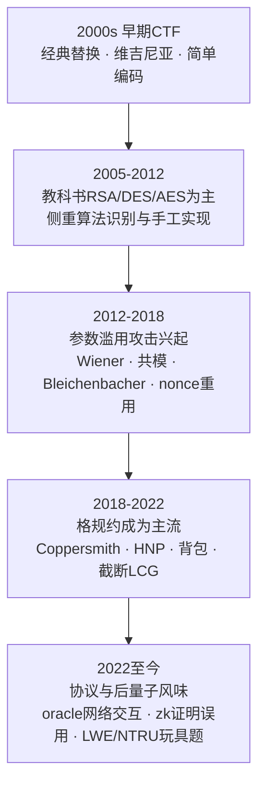
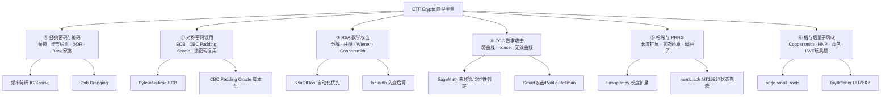
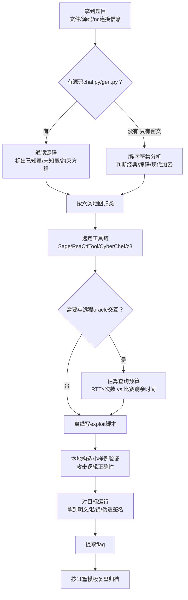
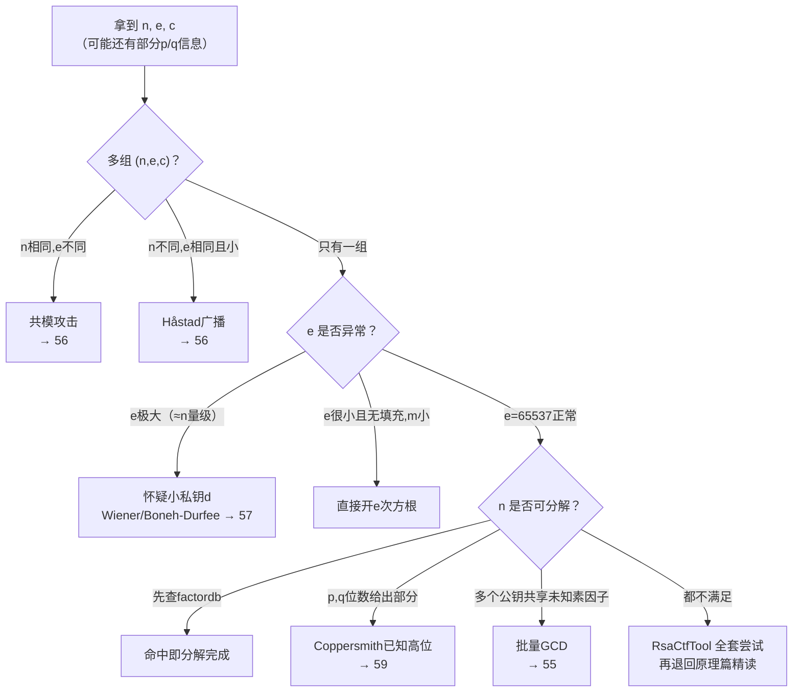
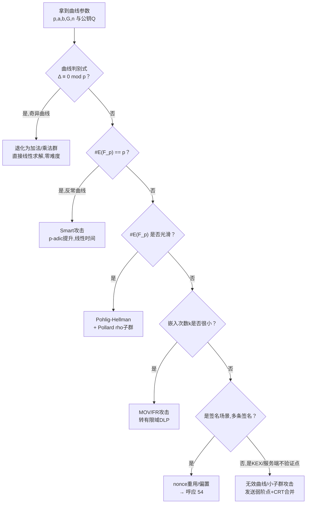
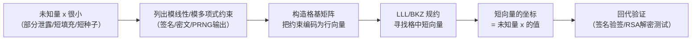
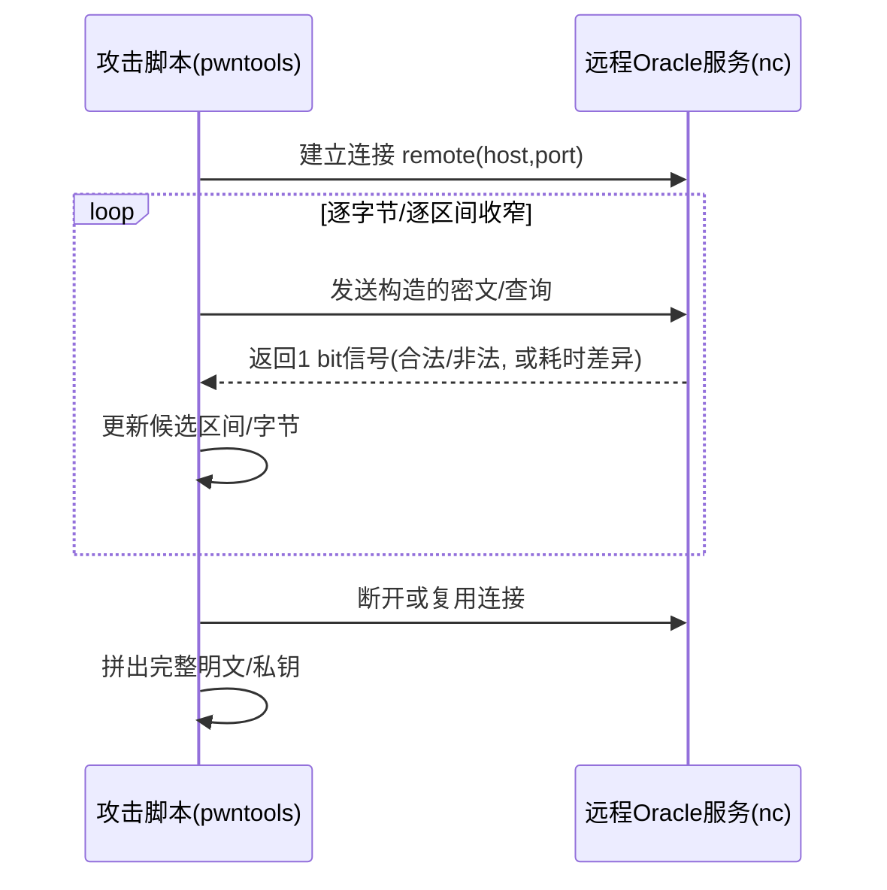

# CTF方法论体系（4）· Crypto解题范式

> [!abstract] TL;DR
> - CTF Crypto 的本质是"白盒解谜"而非"破译"：题目几乎总是连生成脚本（`gen.py`/`chal.py`）一起给出，选手要做的是在"已知量-未知量-约束关系"里找到能在比赛时限内求解的数学捷径，而不是从零做密码分析。
> - 六类题型地图覆盖全部常见考点：经典密码与编码、对称密码误用、RSA 数学攻击、ECC 数学攻击、哈希与 PRNG、格与后量子风味——每类都有一套可操作的识别信号（熵值、`e` 的大小、签名 `r` 是否重复、曲线判别式是否为 0……）和对应的第一梯队工具。
> - 格规约（LLL/BKZ，经 SageMath `small_roots`／`fpylll`／`flatter` 落地）是现代 CTF Crypto 的"万能扳手"：只要能把问题写成"未知量小 + 一堆模线性/模多项式约束"，几乎都能规约为在格中找一条短向量。
> - 自动化优先于手推：RsaCtfTool、SageMath 内置的椭圆曲线阶与离散对数、randcrack、hashpumpy 这类现成工具往往比手写整套数学推导更快拿分，手推留给自动化工具打不动的边缘场景。
> - 需要和远程 oracle 交互的题目本质是一道时间预算题：先算清楚"往返时延 × 所需查询次数"是否能在比赛剩余时间内跑完，再决定脚本怎么写、要不要并发连接。
> - 每类攻击背后的数学推导（Wiener、Coppersmith、Bleichenbacher、ECDSA nonce 格攻击……）已在 [[37.密码学/53.密码学攻击概览]] 系列逐篇展开，本篇只给识别信号、决策路径与脚本化落地，不重复证明过程。

## 概述与定位

《CTF方法论体系》第 4 篇聚焦 Crypto 方向的解题范式，是"五大方向解题范式"（02–06）中的第三篇，对应 [[00.CTF方法论体系总览]] 分类树里的 C3 节点。上承 01 篇建立的赛制与方向坐标系，下接 05 Web；同时本篇也是全系列中与"依托系列"耦合最紧密的一篇——因为 Crypto 题目的正确解法几乎总能落到 [[37.密码学/53.密码学攻击概览]] 系列某一具体攻击篇的数学结论上。本篇的职责不是重新证明这些结论（那是 37 系列的工作），而是提供"拿到一道题该怎么在几分钟内判断它对应 37 系列哪一篇、该调哪个工具"的检索能力与决策路径。

与相邻方向的边界值得先说清楚：Pwn 攻击的是内存与控制流，Reverse 还原的是被编译器/混淆器隐藏起来的算法逻辑，而 Crypto 攻击的是数学关系与协议使用方式本身——算法逻辑通常公开、正确、可直接调库复现，破绽不在"代码怎么执行"而在"参数怎么选"。三者也存在灰色地带：题目给一个反编译出来的自定义分组密码，需要先做 [[03.Reverse解题范式]] 的静态分析把算法还原成可执行代码，再回到本篇判断这个自定义算法本身是否存在密码学破绽——这类题目标签常写 crypto，但解题第一步其实是 reverse。与 06 Misc 的边界则是：隐写、流量分析中如果只是"找到并解码"一段 Base64/AES，算 06；如果编码/加密方案本身构成需要破解的谜题核心，回归本篇。

典型题目形态分两大类：静态文件类（`output.txt`/`cipher.txt`/`pubkey.pem`/`chal.py`/`gen.py` 打包发布，本地随便跑）与远程交互类（`nc host port` 给一个 oracle 服务，可能是签名机、解密机，或允许多次查询的加密预言机）。第一步永远是列清单：有没有源码？有没有可连接的服务？给出的是密文/明文/密钥的哪一部分？这直接决定后续走"静态分析路径"还是"oracle 交互路径"。本篇余下内容围绕一条主线展开——先在"原理与机制"中建立"已知-未知-约束"三元分析法这套通用识别框架，再按六大题型逐一展开识别信号与工具落地，最后给出与远程服务交互的工程实践与安全边界。

不同年代的 CTF Crypto 考点重心明显不同，了解这条演进线有助于判断"这题大概率想考什么"：



这条演进线不是"新题型淘汰旧题型"，而是不断叠加：现代比赛中经典密码常作签到题、教科书 RSA/AES 仍是中档题主力，格攻击和协议误用则构成压轴题，选手需要六类题型全部具备基础手感，不能只押注某一类。

## 原理与机制

### "已知-未知-约束"三元分析法

剥离故事背景后，几乎所有 Crypto CTF 题目都能整理成三元组：**已知量**（公开的密文、公钥、若干次签名、oracle 的历史问答）、**未知量**（私钥、明文、随机种子、格局中的隐藏参数）、以及**约束关系**（连接已知与未知的一个或多个方程/同余式/群运算）。解题的核心动作，是判断这组约束关系是否"过约束"或存在结构性弱化——出题人为了让题目在比赛时限内可解，必然在生成参数时留下某种人为的"松弛"：可能是指数选得太小、可能是同一个随机数用了两次、可能只泄露了未知量的一部分比特、也可能是模数/曲线点没有被正确验证。找到这个松弛点、判断它对应哪一个已被命名的攻击（Wiener？共模？nonce 重用？Coppersmith？），题目就从"不可能"降级为"代数题"。

反过来，如果一道题的已知-未知-约束关系找不到任何结构性松弛——例如真的是标准参数生成的 RSA-2048、真的是无重复 nonce 的 ECDSA——那么这道题大概率不是在考数学攻击，而是在考别的东西：源码里藏着后门、随机数生成器本身不是密码学安全的、或者根本是一道伪装成 Crypto 的 Reverse/Misc 题。分析陷入僵局时，回到三元组重新审视——往往是漏看了某个"看似无关"的已知量（比如题目额外给了一个看似调试用的中间输出），才是真正的松弛点所在。

### CTF Crypto 的白盒特性：Kerckhoffs 原则的极致版本

[[37.密码学/53.密码学攻击概览]] 指出现代密码学假设攻击者已知算法（Kerckhoffs 原则），秘密只在密钥。CTF 把这一原则推向了极致：出题人几乎总会随题目一并公开生成脚本 `gen.py`/`chal.py`——这不是疏忽，而是公平竞赛的必要条件（选手需要能在本地复现同一套算法调试，出题人也需要保证"确实有解"）。这意味着 CTF Crypto 的"未知"严格限定为**这一次运行时随机选取的参数**（私钥、nonce、种子），算法本身、填充方式、甚至攻击者可利用的交互接口全部透明。

这一特性直接决定了解题第一步永远是通读源码，而不是急于把密文丢进某个在线工具。读源码时要标出三件事：随机数从哪里来（`random`/`os.urandom`/`secrets`，还是自定义 PRNG？）、参数生成有没有做课本要求的检查（`e` 是否固定为 65537？`p, q` 是否检查了接近程度？曲线点是否验证在曲线上？）、以及交互协议允许查询几次、返回什么粒度的信息（完整明文，还是仅一个 bit 的合法性）。这三项决定了后续该套用六大题型地图中的哪一支。

### 六大题型攻击面地图

在"已知-未知-约束"框架下，CTF Crypto 的常见考点可以收敛成六个大类，每一类都对应一组典型识别信号与首选工具：



| 类别 | 典型识别信号 | 第一梯队工具/技法 | 呼应 37 系列 |
|---|---|---|---|
| ① 经典密码与编码 | 密文可打印、字符集有限、熵明显低于随机基线 | CyberChef、IC/Kasiski 脚本、crib dragging | — |
| ② 对称密码误用 | 有 oracle 接口、ECB 重复块、CBC + 可辨错误响应 | 手写 pwntools 脚本、padding-oracle 库 | [[37.密码学/60.对称密码攻击]] |
| ③ RSA 数学攻击 | 给出 `n,e,c` 或 PEM 公钥，`e`/`d`/`p,q` 存在异常 | RsaCtfTool、factordb、SageMath | [[37.密码学/55.RSA攻击概览]] 及 56–59 |
| ④ ECC 数学攻击 | 给出 `p,a,b,G,n,Q` 或非标准曲线名 | SageMath 椭圆曲线库、Pohlig-Hellman | [[37.密码学/54.ECDSA-nonce攻击]] |
| ⑤ 哈希与 PRNG | 裸哈希做 MAC、`random` 模块输出片段 | hashpumpy、randcrack | [[37.密码学/43.随机数与熵]] |
| ⑥ 格与后量子风味 | 一批同余方程/矩阵向量、LWE/NTRU 字样 | SageMath `small_roots`、fpylll、flatter | [[37.密码学/50.格密码基础]]、[[37.密码学/59.RSA-Coppersmith攻击]] |

### 通用解题总流程

六类地图解决"归到哪一支"，下面这条流程解决"归类之后具体怎么走"：



"本地小样例验证"这一步尤其容易被跳过，却是格/RSA/ECC 攻击脚本最容易出问题的环节——数学上成立不代表脚本没有 bug。如果直接对着远程唯一目标调试，一旦服务端有查询次数限制或速率限制，就会把仅有的机会浪费在调试脚本本身，因此几乎所有格/RSA/ECC 攻击脚本都应该先用自己生成的、已知答案的小实例验证一遍逻辑，确认能稳定复现出预设答案后，才对着真正的远程目标或题目文件跑。

## 六大题型与攻击手法详解

本节按六大类逐一展开可操作的识别信号、代表性脚本模式与常见陷阱；每类的数学证明均指向 37 系列对应篇目，此处只保留"怎么判断该用哪招、怎么落地成脚本"的部分。

### 经典密码与编码：识别与破解

经典密码题在现代比赛中多作签到题或热身题，但判断"这是不是经典密码"本身需要一点信号意识：如果密文只由可打印 ASCII 字符组成、字符分布明显偏离均匀（不像现代加密/压缩输出），就该优先怀疑编码或古典替换，而不是直接假设是 AES。粗略的信息熵估算是最快的分诊工具——英文明文的信息熵约 4.0–4.5 bit/字符，Base64 编码文本约 6 bit/字符，而真正的密文（AES-CBC/GCM 输出）在字节层面的熵会非常接近 8 bit/字节的随机基线；一段材料如果熵明显低于 6，几乎可以排除"现代分组加密"这个分支。

编码类（Base16/32/58/62/64/85/91、URL 编码、摩斯电码……）的难点通常不在单层解码，而在于"套娃"——多层编码嵌套且顺序不透露。CyberChef 的 "Magic" 自动识别是应对套娃编码效率最高的工具，本地场景可以写一个"尝试所有已知解码器、只保留输出可打印比例足够高的结果"的暴力探测脚本达到类似效果。

古典替换/移位类（Caesar、Vigenère、简单单表替换）的核心技法是**频率分析**：单表替换直接对密文做字母频率统计，与英语字母频率表（`e` 约 12.7%、`t` 约 9.1%……）做卡方拟合，逐字母替换收敛；多表替换（Vigenère 或退化为重复密钥异或）则要先用 **Kasiski 测试**（在密文中寻找重复的三字母及以上子串，统计重复间距的最大公约数，收敛出可能的密钥长度）或**重合指数**（IC，Index of Coincidence：真实英文文本的 IC 约 0.065–0.070，随机文本约为 1/26 ≈ 0.038；把密文按候选密钥长度分组后再算每组 IC，越接近英文基线说明密钥长度猜得越准）确定密钥长度，再对每一列独立做单表频率分析。这套 IC/Kasiski 组合拳同样适用于**重复密钥异或**（repeating-key XOR）——因为异或本质上也是一种"移位"操作，密钥周期性同样会在密文统计特征里留下痕迹。

如果明文的大致格式已知（比如确定密文含 `flag{...}` 或固定 HTTP 头），**crib dragging**（已知明文拖拽法）往往比频率分析更快：把猜测的明文片段与密文在各个偏移位置做异或，凡是结果像可读文本的位置，就极可能命中了密钥的对应片段，再把已恢复的密钥片段"拖"到其他位置继续验证扩展，收敛速度通常远快于统计方法，尤其是密钥远短于密文时。

> [!tip] 陷阱
> 多层编码题最容易在解码顺序上卡住——不少人先猜"看起来像"的那层（比如一串十六进制），却漏掉外层其实是 URL 编码；建议写自动化探测脚本而非纯靠肉眼判断。另外，若 flag 本身含有中文或 emoji，标准英文字母频率表会失真，需要针对题目语言重新统计基线，否则频率分析会收敛到错误密钥。

### 对称密码误用：从原理到可执行脚本

[[37.密码学/60.对称密码攻击]] 系统讲过 Padding Oracle、IV 重用、ECB 泄露、长度扩展的原理与真实协议事故，本节只补 CTF 语境下真正要写的攻击脚本模式。

**ECB byte-at-a-time（逐字节选择明文解密）**：这是 CTF 里最常见的 ECB 模式泄露落地考法——oracle 允许在一段未知的、固定拼接在输入之后的秘密数据前面插入任意前缀，再用 ECB 整体加密并返回密文。因为 ECB 每个对齐块完全由明文块内容决定，攻击者可以精心控制前缀长度，让"目标未知字节"恰好落在某个块的最后一个位置，再穷举这一位置的 256 种取值，比对密文块是否与用短一字节前缀构造的"参照块"相同，即可逐字节还原秘密数据，完全不需要知道密钥：

```text
已知：oracle(prefix) = AES-ECB(key, prefix || secret)
思路：
  1. 用长度为 (block_size - 1 - len(known)) 的填充前缀，使 secret 的下一个未知字节
     落在某个块的最后一个字节位置。
  2. 遍历 guess in 0..255，构造 padding + known + guess，加密后取该块密文。
  3. 与 padding 单独加密得到的"参照块"比较，命中即该字节确定，known += guess。
  4. 重复直到整个 secret 被逐字节还原。
```

**CBC Padding Oracle 脚本化**：核心数学已在 60 篇给出，CTF 中真正要解决的是工程问题——查询预算与假阳性排除。单个 16 字节块最坏情况需要 `16 × 256 = 4096` 次 oracle 查询，一条较长的密文可能有几十个块，若每次查询走一次完整 TCP 往返，总耗时可能超出比赛可接受范围，因此实战中几乎都会：复用同一条 TCP 连接减少握手开销、对 `pad_byte=1` 的边界情况做二次验证排除假阳（末字节恰好构成合法的 `0x02 0x02` 等情况）、以及在题目允许时开多连接并行跑不同块。开源库如 `padding-oracle-attack`（PyPI）或经典的 PadBuster 已经把这套流程封装好，多数情况下直接调库比手写更划算，只有 oracle 返回的信号比较"非标准"（例如藏在响应时间而不是错误码里，类似 Lucky Thirteen 的时序变体）时才需要手写并加入统计去噪（多次采样取中位数、剔除网络抖动导致的离群值）。

> [!tip] 陷阱
> 部分 CTF 的 Padding Oracle 服务端会对短时间内的大量请求限流甚至封连接，脚本必须做好重连与限速退避；另外一定要确认 oracle 判断"合法"的具体标准——有的实现只检查最后一字节，有的完整校验整个 PKCS#7，标准不同会导致假阳排除逻辑完全不同。

### RSA 数学攻击：识别信号与决策路径

拿到 RSA 题目后，第一步永远是把已知量列全——是否只有一组 `(n, e, c)`？还有没有额外的 `p`/`q`/`d` 的部分比特、多组公钥、或一个可查询的解密/签名 oracle？下面的决策路径直接对应 [[37.密码学/55.RSA攻击概览]] 给出的四类攻击地图，只是把"数学结论"换成"CTF 里怎么一步步试出来"：



**先查 factordb**：任何拿到的 `n` 都应该先丢进 factordb.com 查一遍——不少练习平台和教学材料重复使用了历史上被分解过的模数，或者出题人测试时不慎复用了示例参数，查库命中直接省掉所有数学步骤。

**RsaCtfTool 优先**：`python3 RsaCtfTool.py --publickey key.pub --uncipher c.txt` 一条命令内置了近二十种攻击（Wiener、Håstad 广播、共模、Pollard p−1/rho、Fermat、ROCA、已知部分素数……），CTF 中遇到"看起来是标准 RSA 但哪里有点怪"的题目，第一动作永远应该是先扔给它跑一遍，跑不出来再回到 55–59 篇精读对应数学原理、手工定制攻击脚本。

**`e` 异常时的分支**：`e` 很小（3、5、7）且明文没有随机化填充、`m^e < n` 时，直接对密文整数开 `e` 次方根（`gmpy2.iroot` 返回 `(root, is_exact)` 两元组，要检查 `is_exact` 而不是只取整数部分，这是最常见的手滑点）；`e` 大得反常（数量级接近 `n`）则提示私钥 `d` 可能被人为选小，优先尝试 Wiener/Boneh-Durfee（[[37.密码学/57.RSA-Wiener与小私钥攻击]]）。

**LSB/奇偶预言机**：这是 CTF 里一种 55–59 篇未单独展开、但极其常见的"实现攻击"变体——如果 oracle 只告诉你解密结果的最低位（奇偶性），由于 RSA 模乘的可预测性，`(c · 2^e) mod n` 对应明文 `2m mod n`，通过判断这个新密文解密后的奇偶性，可以推断 `2m` 是否发生了模 `n` 回绕，从而把明文可能落在的区间砍掉一半；反复用 `2^k · c` 查询并结合每次奇偶性收窄区间，`log2(n)` 次查询后即可让区间收敛到唯一值——这本质是对实数区间做二分查找，而不是代数解方程，属于 Padding Oracle 家族的近亲。

> [!tip] 陷阱
> Python 与 SageMath 的大整数类型混用容易报错（`Integer` 与内建 `int` 运算部分库函数不认）；`gcd(e, φ(n)) ≠ 1` 时标准 `pow(e, -1, phi)` 会抛异常，很多人误判为"这条路走不通"，其实只是需要退回扩展欧几里得求解一般同余方程，而非只处理互质情形。

### ECC 数学攻击：曲线体检清单

椭圆曲线题目几乎总是显式给出全部曲线参数（有限域 `p`、曲线系数 `a,b`、基点 `G`、阶 `n`、公钥 `Q`），这本身就是明确信号——真实世界几乎不会有人自定义曲线参数，CTF 里"非标准参数"这件事本身就是最大的提示，拿到参数后应该先给曲线做一次体检，而不是假设它安全：



用 SageMath 建模只需两行：`E = EllipticCurve(GF(p), [a, b])`、`E.order()`，后续体检项全部基于这两个对象展开。**判别式**（`Δ = -16(4a³+27b²) mod p`）若为 0，说明曲线在这个域上退化（存在重根，不再是光滑椭圆曲线），标量乘法运算会坍缩为域上普通的加法群或乘法群运算，离散对数问题直接变成初等的除法/对数运算，零难度求解。**曲线阶等于 `p` 本身**（反常曲线，anomalous curve）时可用 Smart 攻击——把问题提升到 `p`-adic 数域上做一次线性映射，直接线性时间解出私钥，网上流传的 "SmartAttack" 脚本（几十行 Sage 代码）已是 CTF 社区标配。**阶 `n` 光滑**（能分解成一堆小素数乘积）时用 Pohlig-Hellman 把大群上的离散对数问题拆成若干小子群上的子问题，再各自跑 Pollard rho 或 Baby-step Giant-step，最后 CRT 合并——SageMath 的 `.discrete_log()` 在阶光滑时可以直接调用。**嵌入次数 `k` 很小**时（曲线意外具有配对友好结构）可用 MOV/FR 攻击，借助 Weil/Tate 配对把椭圆曲线上的离散对数问题映射到某个有限域 `F_{p^k}` 上的离散对数问题，后者可以用指数积分法（index calculus）等亚指数算法求解，SageMath 提供 `weil_pairing` 接口。

如果以上体检都过关（曲线本身健康），破绽通常转移到协议使用方式上：多次签名场景下检查 nonce 是否重复或存在比特偏置，直接复用 [[37.密码学/54.ECDSA-nonce攻击]] 给出的两行代数公式或格攻击模板；密钥交换场景下，如果服务端没有校验对方发来的点确实在约定曲线上（**无效曲线攻击**），攻击者可以发送位于另一条弱曲线（甚至阶为小数的曲线）上的伪造点，得到的"共享密钥"会泄露己方私钥模某个小数的信息，反复用多条不同弱曲线的点做同样的事，再用中国剩余定理合并各次泄露，即可拼出完整私钥；类似地，**小子群限制攻击**是往协议里塞一个已知的小阶点，观察返回结果直接确定私钥模这个小阶数的余数。

> [!tip] 陷阱
> 很多题目在 Edwards 曲线（Curve25519 系）上出偏门坑：协议若未做 cofactor 清除，小子群成分会残留在最终共享密钥里，直接影响后续判断；另外 `discrete_log()` 一类通用接口在阶包含大素数因子时会直接卡死，必须先确认阶是否光滑，否则应该老老实实转向 Pohlig-Hellman 只对光滑部分求解，对不光滑的大素数因子部分承认"此路不通，另找破绽"。

### 哈希与 PRNG 向题目

这一类题目考的通常不是哈希算法本身被碰撞攻破（[[37.密码学/29.哈希函数原理]] 中 MD5/SHA-1 的碰撞代价对 CTF 时限而言仍然不低），而是"哈希/随机数被怎么用"。

**长度扩展攻击落地**：判断信号是"服务端用裸哈希拼接 `secret` 和消息做认证"（`token = SHA256(secret || data)`），一旦确认这个结构，直接上 `hashpumpy`（HashPump 的 Python 封装）：给定已知的哈希值、原始消息长度猜测（通常题目会提示或给出 secret 长度的范围）、目标追加内容，一行调用即可算出新哈希与新消息，无需知道 `secret`。

**PRNG 状态还原**：Python 内建 `random` 模块（以及 PHP、Ruby 等语言的默认实现）大多基于 MT19937 梅森旋转算法，其内部状态是 624 个 32 位整数——只要能收集到 624 个连续的、未经处理的 32 位输出（例如 `random.getrandbits(32)`），就可以用 `randcrack` 一类工具完整克隆内部状态，进而预测该 PRNG 之后（甚至逆推之前）产生的所有输出——这对"用随机数生成 flag/token/密钥"的题目是致命打击。**弱种子爆破**是更朴素的路径：如果种子来自 `time.time()` 或某个可推测范围的整数，直接爆破种子空间比状态还原更快。

> [!tip] 陷阱
> `random.random()` 每次调用消耗的内部状态字节数与 `getrandbits(32)` 不同（浮点数由多个 32 位输出拼接而成），拿错输出粒度去喂状态克隆工具会直接失败；`numpy.random` 默认算法虽然也叫 MT19937，但内部实现与标准库 `random` 不是同一套状态编码，两者的克隆脚本不能混用。

### 格与后量子风味：通用建模模板

如果说本篇只能留给读者一个可以套用在任何新题目上的思维模板，那应该是这一节的格建模范式——它是过去十年 CTF Crypto 压轴题最常见的最终落点：



这套模板之所以普适，是因为大量看起来完全不同的题目，剥掉包装后都长成同一个数学结构：一个（或几个）体量远小于模数的未知量，被一堆"模某个数之后近似相等"的关系约束着。RSA 已知 `p` 高位、只差几十比特的低位未知——对应"未知量小 + 一个模多项式方程"，直接套 [[37.密码学/59.RSA-Coppersmith攻击]] 里的 Coppersmith 方法；ECDSA nonce 若干位恒为 0——对应"未知量（私钥）小 + 多条模线性关系"，就是隐藏数问题（HNP），对应 [[37.密码学/54.ECDSA-nonce攻击]]；背包加密的子集和问题——对应"选中的子集下标是 0/1 小整数 + 一个线性求和约束"；截断线性同余生成器（LCG）已知部分输出高位、要恢复种子或乘法常数——对应"种子小 + 一串模线性递推关系"。这些题目表面上分属 RSA、ECC、PRNG 不同章节，但求解手段完全相同：把每个约束编码成格基矩阵的一行，用 LLL（或规约质量要求更高时用 BKZ）在格里找一条足够短的向量，短向量的坐标就直接读出未知量。

**工具选择**：SageMath 内置 `f.small_roots(X=bound, beta=1.0)`（`f` 定义在 `PolynomialRing(Zmod(n))` 上）是 Coppersmith 类问题的现成实现，多数情况下不需要自己搭格基矩阵；更一般的"自己搭好了格基矩阵，只要跑 LLL"场景，可以用 SageMath 的 `Matrix(ZZ, rows).LLL()`，或者在比赛机器没装 Sage、又要追求速度时改用纯 Python 绑定的 `fpylll`；2023 年后 CTF 社区开始流行的 `flatter` 是一个比经典 LLL 实现快出数量级的规约后端，可以和 fpylll 配合，在维度较高（几十到上百维）的格上把原本几十分钟的规约压缩到秒级，是应对比赛时限压力的关键提速手段。

格攻击最反直觉的一点是：它不是"代入公式就出解"的确定性算法，而是一个概率性、需要调参的过程——`small_roots` 的 `beta`、`epsilon` 等参数，手搭格基矩阵时的维度和缩放系数，都会直接影响 LLL/BKZ 能否规约出"真正对应答案"的短向量。理论上有解不代表默认参数就能跑出来，遇到规约失败或跑出的解验证不通过时，第一反应应该是调整格的维度（通常增加辅助行/列，让约束更"冗余"，可以提高格自身找到目标短向量的概率）或换用规约强度更高的 BKZ 而非死磕默认 LLL。

> [!tip] 陷阱
> SageMath 不同版本间 `small_roots` 的参数名和默认容差发生过变化，网上抄来的模板脚本报参数不存在的错误时，先查当前版本文档而不是怀疑数学本身有问题；另外格维度选得越大规约时间涨得越快，构造格基矩阵时应先用一个已知答案的小实例把维度和缩放系数调对，再套到真实题目参数上。

## 工具视角与实战

前一节按题型给了识别信号和技法，本节收敛成一张工具总表，并补上两类贯穿所有题型的工程能力——与远程 oracle 交互的脚本模式，以及查询预算的估算方法——最后给四个精简的实战叙事帮助建立"从识别到出 flag"的完整手感。

### 工具总表

| 工具 | 定位 | 典型场景 |
|---|---|---|
| SageMath | 格规约、椭圆曲线运算与阶/离散对数、Coppersmith `small_roots`、多项式与有限域运算 | CTF Crypto 第一工具，覆盖 RSA/ECC/格三大类 |
| RsaCtfTool | 自动化 RSA 攻击集合（约 20 种） | 拿到 `n,e,c` 后的第一梯队尝试 |
| pwntools | 与远程 oracle 交互（`remote`/`tube`）、编解码辅助 | 需要连接 `nc` 服务的题目 |
| gmpy2 | 高性能大数运算（`mpz`、`iroot`、`invert`、`gcd`、`is_prime`） | 脱离 Sage 单独写脚本时的大数运算底座 |
| PyCryptodome / cryptography | 标准算法的 Python 实现 | 本地复现加解密逻辑、验证攻击脚本正确性 |
| z3 / z3-solver | 约束求解（SMT） | 自定义位运算密码、多方程求单一未知量 |
| fpylll / flatter | 格规约底层库 | 无 Sage 环境或追求规约速度的场景 |
| hashpumpy | 长度扩展攻击自动化 | 裸哈希做 MAC 的认证绕过 |
| randcrack | MT19937 状态克隆与预测 | `random` 模块生成 token/密钥的题目 |
| CyberChef | 网页版编码/古典密码"瑞士军刀" | 快速试错、多层编码探测 |
| factordb.com | 大数分解结果数据库 | 任何拿到 `n` 后的第一步查询 |
| yafu | 本地强力分解（集成 ECM/QS/GNFS 流程） | factordb 未命中、需要本地分解中大型 `n` |
| openssl 命令行 | 查看/转换 PEM、DER 密钥结构 | 解析题目给的证书/密钥文件格式 |

### 与远程 oracle 交互：从查询预算到脚本骨架

任何需要多轮查询远程服务才能收敛的攻击（Padding Oracle、LSB 预言机、Bleichenbacher、需要采集大量签名的 nonce 偏置格攻击）本质上都是一道时间预算题——写代码之前先做一次粗算：单次查询的往返时延（RTT，可用 `time` 简单测量）乘以理论所需查询次数，看是否在比赛剩余时间内可行。举例：Padding Oracle 单块最坏 4096 次查询，若 RTT 50ms 且服务端不限流，单块约 205 秒，一条密文有 10 个块也不过半小时，可接受；但若 RTT 涨到 2 秒或服务端限流到每秒 1 次请求，同样的攻击会膨胀到数小时，此时必须换思路——要么争取多开并发连接分摊查询，要么找有没有能一次查询收敛更多信息的变体（比如同时对多个块并行做 Padding Oracle，或者利用协议允许的批量接口）。



脚本骨架上，pwntools 的 `remote(host, port)` 建立一次性长连接、复用同一 socket 做多轮查询是标准写法，具体的 `tube` 收发、超时处理、日志级别调节等工程细节属于 [[08.漏洞利用脚本工程：pwntools进阶]] 的职责范围，此处不再重复；Crypto 场景下与 Pwn 场景的主要区别在于：Pwn 通常追求"一次打通"，而 Crypto oracle 攻击是"成百上千次结构相同的小交互"，脚本要格外注意状态管理（当前恢复到第几字节/第几个区间端点）与断线重连后能否从中断点继续，而不必推倒重来。

### 自定义密码算法：与 Reverse/符号执行的边界

部分题目会给一个反编译或混淆过的自定义加密函数，标签写着 crypto，但真正的第一步其实是 [[03.Reverse解题范式]] 的静态分析——把算法从汇编/字节码还原成可读的等价实现。还原之后再判断走哪条路：如果算法是纯粹的可逆位运算组合（XOR/循环移位/模加），且加密/解密方向都能表示成布尔约束，往往直接上 z3 之类的 SMT 求解器比手推逆函数更快——把"密文已知、明文未知、加密过程是一串位运算"整体丢给约束求解器，让它反向解出满足条件的明文，这一思路与 [[09.符号执行辅助解题：angr实战]] 中"用求解器替代手工逆向"的哲学一致，只是 Crypto 题目通常规模小、状态空间干净，直接用 z3 而不需要上完整的符号执行框架（angr 更适合有复杂控制流、需要探索路径的场景）。如果自定义算法带有明显的分组密码结构（S 盒、轮函数、密钥编排），则要回到密码分析视角检查轮数是否太少、S 盒是否线性、密钥编排周期是否过短——这类"玩具分组密码"题目的破绽往往就是差分或线性性质过于明显，用少量选择明文对就能验证。

### 实战叙事（教学示例，非真实系统）

以下四个场景均为 CTF 训练场景的典型抽象，用于建立"识别信号 → 攻击选择 → 出 flag"的完整链条，不针对任何真实生产系统。

**共模攻击**：题目给了 `pubkey1.pem`、`pubkey2.pem` 和对应密文 `c1.txt`、`c2.txt`。用 openssl 解析两把公钥，发现 `n` 完全相同、`e` 不同且互质——命中共模攻击信号（[[37.密码学/56.RSA共模与小公钥指数攻击]]），无需分解 `n`，扩展欧几里得求出 `a·e1+b·e2=1` 后用 `c1^a · c2^b mod n` 直接还原明文。

**ECDSA nonce 重用**：交互式题目允许对任意消息请求签名，多次请求后比对返回的 `(r, s)` 对，发现两条签名的 `r` 值相同——直接确认 nonce 重用（[[37.密码学/54.ECDSA-nonce攻击]]），代入两行代数公式解出私钥，再用私钥为伪造的管理员消息签名，提交给验证接口拿 flag。

**Coppersmith 已知高位分解**：题目在生成日志里"意外"打印了素数 `p` 的高 64 位（常见伪装成调试信息泄露），构造 `p = p_known + x`，在 `PolynomialRing(Zmod(n))` 上写出以 `x` 为未知数、以 `n` 为模的多项式，调用 `small_roots` 直接解出剩余的低位比特，拼出完整 `p` 后对 `n` 做一次除法验证分解成功（[[37.密码学/59.RSA-Coppersmith攻击]]）。

**截断 LCG 格攻击**：题目自称提供"安全随机数"，实际输出是线性同余生成器每次只截断给出高 24 位（低 8 位被丢弃以"增加安全性"），收集若干组输出后，把丢失的低位当作未知量，为每一组输出列出一个模线性同余关系，按本节格建模模板搭出格基矩阵、跑 LLL，恢复出完整的种子与递推参数后，直接预测生成器接下来会吐出的"随机" flag token。

## 安全性与正确使用

> [!caution] 合规边界
> 本篇涉及的所有攻击手法（共模、Wiener、Coppersmith、ECDSA nonce 格攻击、Padding Oracle、PRNG 状态还原等）**仅限于自有环境、CTF 靶场与经授权的安全研究场景使用**，全篇以防御与教育视角组织——理解"为什么这个参数选择是致命的"，目的是学会在自己设计或审计系统时避免同样的错误。本篇不针对任何真实生产系统给出可直接复制粘贴的武器化利用步骤，涉及远程交互的脚本骨架均为通用工程模式说明，不包含特定目标的连接信息，也不为绕过任何商业授权机制提供武器化配方；对真实系统的任何安全测试都必须事先取得明确授权。

理解这条边界不只是合规要求，也是正确认知能力边界的前提——[[37.密码学/53.密码学攻击概览]] 的核心结论是"现代算法在标准参数下数学攻不破，真实破口几乎全在实现与协议误用"，CTF 里能在几分钟到几小时内跑通的 Wiener、共模、nonce 重用、Coppersmith 攻击，无一例外都依赖出题人**故意选择**的弱参数——正规生成的 RSA 私钥不可能小到满足 Wiener 界，正规实现的 ECDSA 签名库（RFC 6979）不可能出现 nonce 重复。练熟这些攻击的价值在于：拿到任何一个真实系统时，能第一时间识别出"它是不是也犯了 CTF 训练过的同一类错误"（比如审计代码时发现自定义生成了小指数私钥、发现签名库没有走标准的确定性 nonce），从而把攻击者视角转化为审计能力，而不是误以为"我会 Wiener 攻击 = 我能破解任意 RSA-2048"。

解题脚本本身也有一套需要长期踩坑才能内化的经验清单：

| 踩坑点 | 现象 | 应对 |
|---|---|---|
| 大小端与整数/字节转换 | `bytes_to_long`/`long_to_bytes` 处理前导零字节时结果少一字节或多一字节 | 显式指定输出长度，转换后立刻打印十六进制核对位数 |
| Python 2/3 脚本迁移 | 抄来的老脚本在 py3 下字符串/字节类型报错 | 统一用 `bytes`/`int` 显式转换，不依赖隐式类型转换 |
| `gmpy2.iroot` 精度 | 直接取整数部分当作精确 e 次方根，结果其实不精确 | 检查返回的 `is_exact` 标志位 |
| 填充方案混淆 | 把 PKCS#1 v1.5 的攻击脚本套到 OAEP/PSS 上，逻辑完全不通 | 解题前先确认题目用的具体填充方案，不能想当然 |
| SageMath 版本差异 | `small_roots` 等函数参数名/默认值跨版本变化 | 遇到参数报错先查当前版本文档，而非怀疑数学错误 |
| 哈希算法用错 | 用 SHA-256 的长度扩展模板打 SHA-1/MD5 的题，或反之 | 长度扩展攻击要严格匹配哈希算法的分块大小与状态字长度 |
| PRNG 输出粒度搞混 | 用 `random()` 的浮点输出直接喂 32 位状态克隆工具 | 确认题目暴露的是 `getrandbits(32)` 式整数还是拼接后的浮点数 |
| 查询预算低估 | 直接对远程写暴力遍历脚本，长时间无响应还以为程序卡死 | 写脚本前先估算 RTT × 查询次数，加进度日志 |
| 曲线点未验域内合法性 | 直接用离线求出的候选点代入验证，未检查是否真的在曲线上 | 每一步中间结果都做曲线方程合法性检查 |

理解攻击链条最终服务于两类人——CTF 选手需要它来更快定位破绽拿分；系统设计者/审计者需要它来在评审代码时一眼识别"这里是不是也犯了同款错误"。把本篇六大类识别信号当成一份审计 checklist 使用同样成立：审计一段自研加密代码时，检查有没有小指数私钥、有没有可能重复的 nonce、有没有裸哈希做 MAC、有没有用非 CSPRNG 的随机源、曲线/格相关参数是否标准——这与 CTF 解题时问的问题完全相同，只是站在了攻防的两侧。

## 小结

| 题型 | 核心识别信号 | 首选工具 | 深入原理 |
|---|---|---|---|
| 经典密码/编码 | 密文可打印、熵低于随机基线 | CyberChef、IC/Kasiski | — |
| 对称密码误用 | oracle 接口、ECB 重复块 | pwntools 手写、padding-oracle 库 | [[37.密码学/60.对称密码攻击]] |
| RSA 数学攻击 | `n,e,c` 参数存在异常 | RsaCtfTool、factordb、SageMath | [[37.密码学/55.RSA攻击概览]] |
| ECC 数学攻击 | 非标准曲线参数 | SageMath 椭圆曲线库 | [[37.密码学/54.ECDSA-nonce攻击]] |
| 哈希/PRNG | 裸哈希 MAC、`random` 输出片段 | hashpumpy、randcrack | [[37.密码学/43.随机数与熵]] |
| 格/后量子风味 | 一批模线性/模多项式约束 | SageMath `small_roots`、fpylll/flatter | [[37.密码学/50.格密码基础]] |

CTF Crypto 的解题能力，本质上是"识别信号的密度"与"工具肌肉记忆"的乘积——数学证明本身留给 37 系列去啃透，而本篇沉淀的是拿到一道新题时，如何在几分钟内把它归入六大类地图中的某一支、调出对应的第一梯队工具、并在查询预算允许的范围内把攻击脚本落地。这套范式和 02 篇的"泄露-绕过-getshell"、03 篇的"静动结合识别算法"是同构的方法论——把散点的数学/漏洞知识，编排成可以在限时压力下稳定复用的检索表与决策树。拿到 flag 之后，别忘了按 [[11.赛后复盘与writeup方法]] 的模板把这道题在"三元组"框架下的已知-未知-约束、松弛点和最终攻击链记录下来，才能把这次的运气变成下次的手感。

## 相关阅读

- [[00.CTF方法论体系总览]] — 系列总览与六大分类地图
- [[02.Pwn解题范式与模板]] — 与 Crypto 的方向边界对照
- [[03.Reverse解题范式]] — 自定义加密算法题目的前置还原步骤
- [[08.漏洞利用脚本工程：pwntools进阶]] — 与远程 oracle 交互的脚本工程细节
- [[09.符号执行辅助解题：angr实战]] — z3/SMT 与符号执行在自定义算法题上的边界
- [[11.赛后复盘与writeup方法]] — 拿到 flag 后的归档与复盘模板
- [[37.密码学/53.密码学攻击概览]] — 密码攻击四轴分类总纲，本篇的直接依托
- [[37.密码学/55.RSA攻击概览]] — RSA 攻击总地图
- [[37.密码学/56.RSA共模与小公钥指数攻击]] — 共模攻击、Håstad 广播攻击数学细节
- [[37.密码学/57.RSA-Wiener与小私钥攻击]] — 连分数与 Boneh-Durfee 格攻击
- [[37.密码学/58.RSA-Bleichenbacher与padding-oracle]] — RSA Padding Oracle 完整数学
- [[37.密码学/59.RSA-Coppersmith攻击]] — 格方法求小根的完整推导
- [[37.密码学/54.ECDSA-nonce攻击]] — nonce 重用/偏置格攻击的完整数学
- [[37.密码学/50.格密码基础]] — LLL/BKZ 与格困难问题基础
- [[37.密码学/60.对称密码攻击]] — Padding Oracle/ECB/长度扩展原理详解
- [[37.密码学/43.随机数与熵]] — CSPRNG 与弱随机数根因

[[00.CTF方法论体系总览|⬆ 系列总览]] | [[03.Reverse解题范式|← 上一章]] | [[05.Web解题范式|→ 下一章]]
