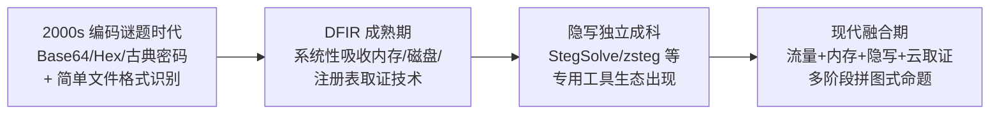
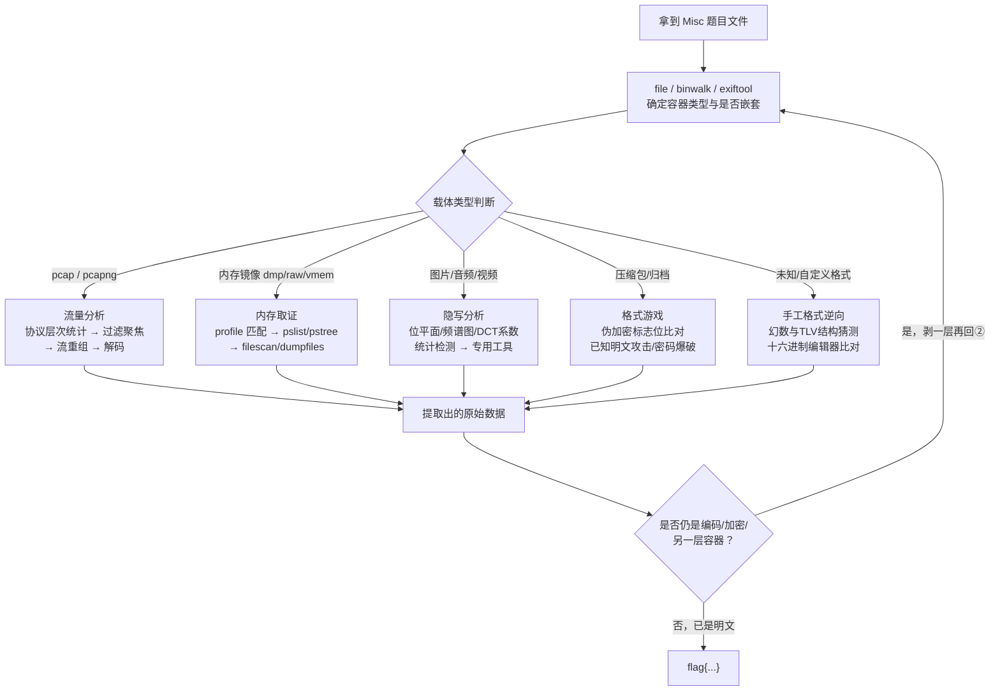
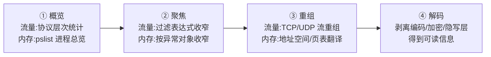
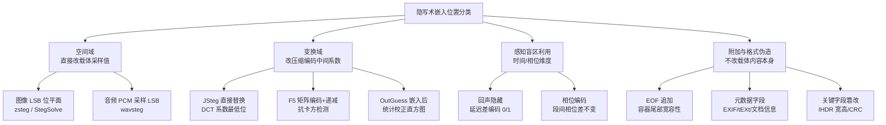

# CTF方法论体系（6）· Misc与取证与隐写

> [!abstract] TL;DR
> - Misc 无固定学科边界，本质是"用其他学科的工具解一道被出题人裁剪过的谜题"：先用 file/binwalk/exiftool 确定载体遵循的格式规范，再定位规范允许但通常空置的边界地带（文件尾部、元数据、位平面、变换域系数、协议选项区）。
> - 编码、加密、隐写三者语义完全不同——可逆变换、密钥保护、存在性隐藏——多层套娃题目必须由外向内逐层识别再剥离，判断错一层就会全盘走偏。
> - 隐写按嵌入位置分四大类：空间域 LSB（位平面/调色板陷阱）、变换域 DCT（JSteg/F5/OutGuess 的统计对抗博弈）、音频感知盲区（回声隐藏/相位编码）、附加数据与格式伪造（EOF 追加、ZIP 伪加密、IHDR 篡改）。
> - 流量与内存分析在 Misc 语境下遵循"概览→聚焦→重组→解码"的共同节奏，深度机制呼应系列 53（数字取证与事件响应）与系列 72（抓包实战），本篇聚焦 CTF 特有的简化与反向陷阱。
> - ZIP 伪加密（本地文件头与中央目录标志位不一致）、USB HID 流量还原键盘/鼠标轨迹、二维码纠错容限内的残缺可直接扫描通过，是三个辨识度极高的 CTF 专属技巧。
> - 专用工具链（StegSolve/zsteg/steghide/stegseek/CyberChef）能解决八成标准题型，但手写脚本把隐写的嵌入自由度转成可枚举搜索空间，才是应对自定义变体的终极兜底。

## 概述与定位

Misc（Miscellaneous，安全杂项）是 CTF 五大方向（Pwn/Reverse/Crypto/Web/Misc）里最难用一句话定义的一个：Pwn 的边界是"进程内存与控制流"，Reverse 的边界是"给定二进制、还原其逻辑"，Crypto 的边界是"密码算法与协议"，Web 的边界是"HTTP 应用层"——而 Misc 从诞生起就是一个"收纳筐"：凡是不方便塞进前四个筐子的题目，一律塞进 Misc。这种"负定义"（不是什么）而非"正定义"（是什么）的特点，决定了 Misc 无法像其他方向那样总结出一套统一的解题范式，只能总结"侦察-识别-分诊-验证"的元方法论，再逐类展开工具链。

历史上 Misc 题目经历过三次内容漂移：早期（DEF CON 前身赛事年代）Misc 几乎等价于"编码谜题＋简单文件识别"，考的是选手对各种冷门编码/压缩格式的熟悉程度；随着数字取证与应急响应（DFIR）行业成熟，Misc 开始系统性吸收真实取证技术（内存取证、磁盘取证、注册表分析），衍生出题目命名惯例 "Forensics"/"For1"/"For2"；与此同时，隐写术（Steganography）因其"艺术性"与"猜谜感"独立发展成自己的子类，题目命名惯例 "Stego"，并催生了 StegSolve、zsteg 等专用工具生态。今天大型赛事（DEF CON CTF、强网杯、DASCTF、CISCN 等）的 Misc 分类往往同时容纳这三条线，外加一条"流量分析"支线——流量既可能是取证的输入，也可能独立命题。



本篇在系列中的定位，呼应 [[53.数字取证与事件响应/00.数字取证与事件响应总览]]（下称"系列 53"）。系列 53 讲的是**真实企业入侵事件**里内存/磁盘/注册表/日志怎么固定、怎么分析、怎么串成时间线，服务对象是需要经得起审查的调查报告；本篇讲的是**同一套技术手段**如何被"降维"用于解一道限时的人为构造谜题——目标从"复原一起真实入侵的完整叙事"简化为"在一份被出题人精心裁剪过的镜像/流量/文件里找到一串 flag"。二者共享方法论骨架（识别→定位→提取→解读），但**证据链要求、数据规模、干扰噪声**完全不同：真实取证要面对 TB 级磁盘、大量无意义的正常流量背景噪声，且必须保证每一步操作可复现可举证；CTF 的镜像通常经过出题人"瘦身"（内存 dump 只有几百 MB、pcap 只有几千个包），故意在其中埋入少量强特征信息，解题时可以放心地做破坏性操作，没有 chain of custody 负担。因此，本篇不重复系列 53（内存/磁盘/注册表取证算法细节）与 [[72.抓包与协议分析实战/13.抓包实战CTF与漏洞分析]]（流量分析实战）已经讲透的机制，而是把它们编排进 Misc 特有的"识别-分诊"流水线，并把系列里尚未覆盖的**隐写术**作为本篇独占的深挖对象。

Misc 与其他方向的接壤地带也值得提前说明：题目的最后一步经常是一段简单密码（异或、维吉尼亚、RSA 小指数），[[37.密码学/53.密码学攻击概览]] 的攻击分类框架同样适用于 Misc 里的"夹带私货"环节；当载体是一段非常规字节码或虚拟机（如 WASM）时，Misc 也会与 Reverse 深度重叠，可参考 [[40.WASM与虚拟化壳逆向/08.WASM CTF实战]] 里对这类"格式即谜题"场景的处理套路。理解这些接壤关系，能帮助选手在拿到一道陌生 Misc 题时快速判断"这题的核心难点到底在哪个学科"，从而调用正确的知识储备，而不是无目的地把所有工具都试一遍。

## 原理与机制

### Misc 的第一性原理：载体规范与实际内容之间的偏差

几乎所有 Misc 题目，无论表现形式是流量包、内存镜像、图片还是压缩包，都可以归结为同一个母问题：**载体格式有一份公开的"设计规范"，规定了哪些字节该出现在哪个位置、代表什么含义；出题人则利用"规范之外的自由度"埋入信息**。任何格式规范都不可能把每一个字节的取值锁死——图片的调色板顺序、压缩包的注释字段、TCP 报文的选项区、内存页里未被写过的填充区，这些"规范允许但通常不使用"的空间，正是 Misc 题目的天然产房。解题因此变成了一次"格式指纹比对"：先确定载体遵循哪种规范（文件类型/协议/内核结构），再定位规范之外或规范边界处的异常，最后按异常所在层的语义解码出信息。这也是为什么"file 一下、binwalk 一下、exiftool 一下"是几乎所有 writeup 的第一句话——不是因为这些工具多智能，而是因为**先确定规范，才能定义什么叫异常**。

多数二进制格式的规范遵循同一套朴素设计模式，理解它能极大加速"读懂一个从未见过的格式"：**头部签名（magic bytes）定身份**，让解析器无需读取全部内容即可判断类型；**长度/偏移字段（TLV，Type-Length-Value）定边界**，让容器格式可以拼接、嵌套、跳读；**结束标记或校验字段（footer/CRC）定完整性**。PNG 的 `IHDR→IDAT→IEND` chunk 链、ZIP 的本地文件头→数据→中央目录→End Of Central Directory、PCAP 的 global header→若干 packet header+data，本质都是同一套"头+体+尾"套路的具体实例。一旦建立起这套元认知，遇到题目自定义的私有二进制格式时也能照猫画虎：先找重复出现的固定字节（大概率是签名或分隔符），再找单调递增或与数据块大小相关的字段（大概率是长度/偏移），最后靠"能否被正常打开"验证猜测。

### 编码、加密、隐写：三个经常被混淆但语义完全不同的概念

Misc 入门阶段最常见的认知混乱，是把"编码""加密""隐写"当同义词使用。三者的区别不是强度高低，而是**目标本身完全不同**，讲清楚这一点比记住任何工具都重要：

- **编码（Encoding）**追求的是"用另一套字符集/字节序列无损表示同一信息"，变换规则完全公开、算法本身不设防（Base64/Base32/URL 编码/Hex），任何人拿到编码结果都能立即看出"这是编码过的"，解码是确定性的一步到位。
- **加密（Encryption）**追求"在不知道密钥的前提下从密文推不出明文"，存在性是公开的——攻击者知道这里有一段密文，只是打不开。这正是 Kerckhoffs 原则的适用范围，攻防的关键在密钥而非算法本身（详见 [[37.密码学/53.密码学攻击概览]]）。
- **隐写（Steganography）**追求的是更本源的目标：**让人根本意识不到"这里有秘密信息"**，即"存在性不可知"。一张嵌入了 LSB 隐写的图片，肉眼、直方图统计、甚至大部分自动化工具都应当认为它是一张"正常的图片"——这与加密截然不同：加密从不追求隐藏密文的存在，只追求密文不可解读。

三者在 Misc 题目中经常叠加使用，形成"多层套娃"结构：一段秘密先被压缩、再被异或加密、再用 LSB 隐写进图片的像素、图片本身又被拼接到一个 ZIP 包末尾——解题者需要**由外向内逐层剥离**，每层用对应学科的方法论识别和处理，任意一层判断错误（比如把隐写误判为加密去暴力破解密码）都会导致解题方向整体走偏。这也是为什么 Misc 高手往往强调"先不要动手，把所有层都识别出来再决定从哪层入手"。

### 总体解题分诊流程

把上面两条原理落成可执行的操作流程，就是下图这套"识别→分诊→提取→再判断是否还有下一层"的循环：



### 流量、内存两条主线的方法论共性（机制精要，深度详见系列 53/72）

流量分析与内存取证虽然操作对象截然不同（一个是网络报文的时间序列，一个是物理内存的空间快照），但在 Misc 解题的方法论层面高度同构，都遵循"概览→聚焦→重组→解码"的四段流程：



流量分析的报文重组算法（TCP 序号排序、去重叠、去重传）与内存取证的地址空间翻译（物理地址→虚拟地址、内核对象定位如 `EPROCESS` 双向链表遍历/池标签扫描）属于相对独立且已经很成熟的技术领域，[[53.数字取证与事件响应/03.内存取证：采集与Volatility框架]]、[[53.数字取证与事件响应/04.内存取证实战：进程与网络与注入检测]]、[[53.数字取证与事件响应/12.网络取证与流重组]]、[[72.抓包与协议分析实战/13.抓包实战CTF与漏洞分析]] 已经把 profile/符号匹配机制、`psxview`/`malfind`/`ldrmodules` 等插件原理、PCAP/PCAPNG 格式与 TCP 重组算法讲得非常完整，本篇不再重复推导，只强调 **Misc 语境下的简化与陷阱**：CTF 出的内存镜像通常只需要 `pslist`/`pstree`/`cmdline`/`filescan`/`dumpfiles` 这几个最基础插件就能拿到 flag，极少需要对抗真实 rootkit 级别的 DKOM 隐藏；但反过来，出题人偶尔会**反其道而行**——专门构造一个隐藏进程/摘链进程作为解题关卡，此时才需要 `psxview`/`psscan` 这类"交叉验证"手法，这与真实应急响应中排查 rootkit 的场景高度一致，值得回读系列 53 对应章节。

## 文件格式与隐写算法详解

### 常见文件签名速查与容器嵌套的识别原理

判断"这堆字节到底是什么"是所有 Misc 题目的起手式。绝大多数二进制格式在最开头几个字节写死一段**幻数（magic bytes）**，操作系统与工具靠它而非扩展名判断类型（这也是为什么 Misc 题目常故意抹去或篡改扩展名——扩展名从来不是真相，头部字节才是）：

```
PNG   89 50 4E 47 0D 0A 1A 0A        尾部 IEND chunk: 00 00 00 00 49 45 4E 44 AE 42 60 82
JPEG  FF D8 FF (E0/E1/EE...)         尾部标记: FF D9
GIF   47 49 46 38 37 61 / 39 61      (GIF87a / GIF89a)
BMP   42 4D
ZIP   50 4B 03 04 (本地文件头)        50 4B 01 02 (中央目录) / 50 4B 05 06 (EOCD)
RAR   52 61 72 21 1A 07 00 (v4)      52 61 72 21 1A 07 01 00 (v5)
7z    37 7A BC AF 27 1C
gzip  1F 8B 08
PDF   25 50 44 46 2D                 (%PDF-)
ELF   7F 45 4C 46
PE    4D 5A                          (MZ，NT 头再往后找 50 45 00 00)
WAV   52 49 46 46 .... 57 41 56 45   (RIFF....WAVE，RIFF 是容器，WAVE 是子类型)
```

这套设计模式背后的工程动机值得展开：为什么几乎所有格式都用"头几个字节＋若干 TLV 块"这种结构？因为解析器需要在**读取尽量少的数据**的前提下尽早决定"要不要继续读、按什么规则读"，头部签名把这个判断压缩到常数时间；而 TLV 让格式具备**可扩展性与可跳读性**——不认识的块类型可以凭长度字段直接跳过而不影响整体解析，这正是 PNG 允许自定义辅助 chunk、ZIP 允许附加 Extra Field 的原因，也正是 Misc 出题人偏爱在这些"允许但通常忽略"的字段里塞 flag 的原因。

**容器嵌套/文件雕复（file carving）**的自动化原理，本质是把上面的幻数表做成一个签名数据库，对整个二进制文件做**滑动窗口扫描**：从偏移 0 开始，每前进一字节就比对当前窗口是否匹配某个已知头部签名，命中后再找对应的尾部标记或按格式自身的长度字段计算出该文件的结束偏移，把这一段字节整体切出。`binwalk`、`foremost`、`scalpel` 都是这个原理的具体实现，区别只在于签名库丰富度与是否理解某些格式的内部长度字段（理解的话切割更精确，不理解只能扫到下一个签名为止，容易切出冗余字节）。这也解释了 Misc 里最常见的一种命题手法——"图片套压缩包"：把一个 ZIP 文件直接拼接在 JPEG 的 `FF D9` 结束标记之后。绝大多数看图软件读到 `FF D9` 就认为文件结束，后面无论跟着什么都不影响正常显示；而 `binwalk -e` 或 `foremost` 扫描时会继续往前走，撞见 `50 4B 03 04` 就会把后半段单独提取成一个 ZIP 文件。这不是任何"漏洞"，而是容器格式设计上**对尾部垃圾数据天然宽容**的副作用——JPEG/PNG/GIF 的解码器只关心"从头部到结束标记"这一段，从未规定文件必须恰好在此结束。

### 空间域隐写：位平面、可感知阈值与调色板陷阱

**LSB（Least Significant Bit，最低有效位）隐写**是 Misc 里最基础也最高频的手法，原理建立在一个朴素的视觉心理学事实上：一个 8 位色彩通道可以拆成 8 个"位平面"（bit plane），每个位平面单独看都是一张二值图，其中最高位（bit 7）平面基本还原出原图轮廓，而最低位（bit 0）平面在正常自然图像里近似于纯随机噪声——因为传感器噪声、压缩量化误差本身就会在最低位上体现为近乎随机的抖动。这意味着**修改最低 1～2 位引起的像素值偏差远低于人眼的恰可察觉差（JND，Just Noticeable Difference）阈值**，嵌入信息前后两张图肉眼几乎无法区分，用峰值信噪比（PSNR）衡量往往仍在较高水平。嵌入过程就是把秘密比特流按某种顺序（顺序遍历、伪随机置乱、或由密钥控制的选择性嵌入）逐一写入像素通道的最低位，提取时按同样顺序把最低位取出来拼回比特流——这也是为什么大多数 LSB 隐写工具要求"提取顺序/密钥"必须与"嵌入顺序/密钥"一致，蛮力提取全部像素最低位往往能拿到数据但顺序错乱，需要再做一次比特重排。

一个经典陷阱是**调色板（indexed/palette）图片的 LSB 隐写风险**：GIF 与 8 位色深的 PNG 不直接存储 RGB 值，而是存一个"调色板索引"，真正的颜色由索引查一张色表得到。如果直接对索引值做 LSB 翻转，索引 5 变成索引 4 或 6 后，对应的 RGB 颜色可能与原色相差极大（调色板里相邻索引的颜色排列并不保证渐变），导致修改后的图片出现肉眼可见的雪花噪点——这既是隐写设计者要规避的坑（正确做法是先把调色板本身按亮度重排，或直接对调色板表项做隐写而非索引），也是 Misc 解题者**反过来利用的信号**：一张 GIF/8 位 PNG 打开后若有异常的彩色噪点，几乎可以断定用了简单粗暴的调色板索引 LSB 隐写，直接上 `zsteg` 或手工按位平面提取即可。

### 变换域隐写：JPEG 压缩流程与 JSteg / F5 / OutGuess 的设计取舍

空间域 LSB 隐写有一个致命弱点：**JPEG 有损压缩会直接把它冲掉**。JPEG 的压缩流水线是"色彩空间转换（RGB→YCbCr）→ 色度子采样 → 8×8 分块 → 二维离散余弦变换（DCT）→ 按量化表做除法取整（这一步是有损的核心，人眼不敏感的高频系数被大幅压缩甚至归零）→ 之字形扫描 → 熵编码"，空间域像素值在编码时会被整体推倒重来，直接嵌入原始像素最低位的信息在重新压缩后必然丢失。因此**所有 JPEG 隐写算法都把嵌入点挪到了量化后的 DCT 系数上**——这一步之后系数已经是整数，且正是编码器最终落盘的对象，改动它们才能在保存后的文件里持久存在。

三代经典工具的设计取舍很能说明隐写术"容量-不可感知性-鲁棒性"三者互相牵制的本质（三者不可兼得，是信息隐藏领域的一种直觉性共识，类比 CAP 定理但并非同等严格的数学定理）：

- **JSteg**：直接把秘密比特替换进量化后 DCT 系数的最低位（跳过取值 0 和 1 的系数以维持基本可用性），实现最简单、容量最大，但代价是 DCT 系数值的统计直方图会出现明显的"锯齿状"偏移——相邻的偶数/奇数系数值出现频率被信息位强行拉平，这一异常可以被**卡方检测（chi-square attack）**以很高的置信度识别出来，几乎是隐写分析里的"教科书反例"。
- **F5**：由 Andreas Westfeld 设计，核心创新有两点。其一是**矩阵编码（matrix encoding）**：不是每个系数都嵌一位，而是用一组系数联合编码更少的信息位，通过修改尽量少的系数达到嵌入目的，同时**用绝对值递减代替直接翻转最低位**（LSB 翻转会让统计分布产生"收缩效应"，递减操作对分布的破坏更接近自然的量化噪声）；其二是**置乱嵌入位置（permutative straddling）**，避免嵌入信息集中在图像局部。这些设计都是针对性地堵住 JSteg 留下的统计漏洞。
- **OutGuess**：采取"先嵌入、后校正"的策略，在完成信息嵌入后，专门调整那些**未被使用的冗余系数**，把因嵌入产生的直方图偏移修正回接近原始分布，专门对抗卡方检测这类基于全局统计特征的分析手段。

对解题者而言，这段机制的实用结论是：**看到 JPEG 图片却在空间域位平面里翻不出规律时，应当立刻切换到 DCT 域工具**（`jsteg`/`stegdetect`/`jphide` 系列专用检测与提取工具，或用 `stegoveritas` 之类自动化脚本批量试探多种算法），而不是执着于对像素值本身做位操作。

### 音频与视频隐写：利用听觉/视觉感知系统的"盲区"而非单纯的位操作

音频隐写沿用了与图像相同的哲学，但利用的是听觉心理声学（psychoacoustics）而非视觉的盲区：

- **PCM 采样点 LSB**：未压缩 WAV 的每个采样点直接对应一个整数振幅值，做法与图像 LSB 完全同构，是最简单也最脆弱（一次有损转码即可破坏）的方式。
- **回声隐藏（Echo Hiding）**：在原始信号上叠加一个人耳无法单独分辨的极短延迟回声（量级在 1 毫秒上下），通过控制回声延迟时长的两种取值来编码比特——人耳对这种量级的回声延迟不敏感，但延迟本身在信号处理上是可测的周期性特征。解码时常用**倒谱分析（cepstrum analysis）**：对信号取对数功率谱后再做一次逆变换，能把"周期性叠加成分"（回声）从原始信号中分离出一个峰值，峰值位置直接对应回声延迟，从而反推出编码的比特。
- **相位编码（Phase Coding）**：人耳对声音的绝对相位并不敏感，但对相邻频段之间的相对相位差敏感；于是把秘密信息编码进音频第一段的相位谱，后续各段的相位做相应调整以维持段间相位差不变，避免引入可察觉的失真。

音频隐写题在 Misc 里还有一类**不需要任何专用工具、纯靠人眼识图**的经典变体——把文字/摩斯电码/图案直接调制进音频的**频谱图（spectrogram）**中，用 Audacity 或 `sonic-visualiser` 切换到频谱视图即可直接"看见"信息，这类题目本质上不是严格的隐写学算法，而是利用了频谱图作为时频二维图像的可视化特性，值得作为独立的排查手段优先尝试，成本极低、几秒钟出结果。

除了直接对采样值或相位做隐写编码，音频 Misc 还有两类**借用通信编码协议**的经典变体，考的不是隐写算法本身而是对特定协议规范的识别与解码能力。**SSTV（慢扫描电视，Slow-Scan Television）**是业余无线电爱好者传输静态图像的传统协议：编码时把图像逐行按亮度/色度映射成特定频率范围内的音调，扫描一行对应一段固定时长的音频，行与行之间插入同步脉冲标记起始，不同 SSTV 子协议（Martin、Scottie、Robot 等）仅在帧头的频率序列与逐行时长上有差异；CTF 题目把一段图像用 SSTV 编码成音频文件当作"隐写"载体，解码不需要理解任何隐写算法，只需要用 `MMSSTV`/`QSSTV`/`RX-SSTV` 一类现成解码软件识别出具体子协议后逐行重建图像。**DTMF（双音多频，Dual-Tone Multi-Frequency）**则是电话拨号音编码，每个按键对应固定的一对高低频组合（例如按键"5"是 770Hz 与 1336Hz 的叠加），音频里出现一串这样的音调即代表一串数字或符号序列，用现成 DTMF 解码工具或自行实现 Goertzel 算法（一种比完整 FFT 更节省计算量、专门用于检测特定频率能量的算法）都能逐段识别。这两类题目提醒一个更普遍的道理：**Misc 音频方向的"隐写"不只包括信息隐藏学意义上的算法，也包括对通信/广播行业既有编码协议的挪用**，遇到规整的音调序列或结构化频率跳变时，先想想"这像不像某种已有的通信协议"，往往比直接冲上去做频谱隐写分析更快。

视频隐写在 CTF 里最常见的处理方式是**退化为逐帧图像隐写**：用 `ffmpeg` 把视频拆成逐帧图片序列后按图像隐写流程处理；更贴近视频编码本身特性的做法则是利用帧间预测编码（如 H.264）里**运动矢量（motion vector）的最低位**或选定 I 帧的 DCT 系数做文章，但这类题目在 CTF 中出现频率远低于图像/音频。

### 附加数据、格式伪造与 ZIP 伪加密：利用"宽容的解析器"

除了严格意义上的隐写算法，Misc 还有一大类"格式游戏"题目，本质是利用解析器对规范之外内容的宽容度或对规范的选择性检查：

- **尾部追加（EOF trailing data）**：如前所述，只要不破坏头部到结束标记之间的合法结构，容器格式几乎都能容忍尾部追加任意数据，这是文件雕复类题目的根源。
- **元数据字段藏码**：EXIF（相机型号、GPS、拍摄时间等自由文本字段）、PNG 的 `tEXt`/`zTXt` 辅助块、PDF 的文档信息字典，都是常规查看器不会展示但用 `exiftool`/`pngcheck` 一眼可见的位置。
- **关键字段被故意改坏**：PNG 的 `IHDR` chunk 记录了宽高、位深、颜色类型，且整个文件带 CRC32 校验；如果出题人把宽高字段改小（图片显示不全）或直接让 CRC 校验失败，用 010 Editor/`tweakpng` 手工修正 `IHDR` 里的宽高字段并重算 CRC 即可复原完整图像——这类题目考的其实是对 PNG chunk 结构（每个 chunk = 长度 4 字节 + 类型 4 字节 + 数据 + CRC32 4 字节）的理解，而非任何隐写算法。
- **ZIP 伪加密**：这是 Misc 里辨识度极高的经典技巧，值得展开其结构原理。ZIP 文件对每个成员实际存有两份头部描述：**本地文件头（Local File Header，紧邻数据本身，签名 `50 4B 03 04`）与中央目录项（Central Directory File Header，集中存放在文件末尾，签名 `50 4B 01 02`）**，二者都各自携带一份"通用位标志（General Purpose Bit Flag）"，其第 0 位标记该成员是否加密——本地文件头的标志位紧跟在 4 字节签名与 2 字节版本号之后，中央目录项因为多了一个 2 字节的"制作版本"字段，标志位相应后移 2 字节。正常加密的 ZIP 两处标志位应当一致；"伪加密"题目故意让两处不一致（例如本地头标志位清 0、中央目录标志位置 1，或反过来），不同解压软件各自只信任其中一处，于是出现"命令行 `unzip` 能直接解开，但双击资源管理器却提示要密码"这类看似矛盾的现象。解法就是用 010 Editor/HxD 定位到两处标志位，把它们改成一致（通常改成不加密的 0），压缩包立即可以正常解压——整个过程不涉及任何密码学计算，纯粹是**利用了不同实现对"以谁为准"这一规范模糊地带的不同选择**。
- **已知明文攻击传统 ZipCrypto**：如果 ZIP 使用的是老式流加密算法 ZipCrypto（而非现代 AES 加密扩展），且攻击者能拿到压缩包内**任意一个成员的 12 字节明文头**（比如另有一份未加密的同名文件、或该成员是可预测内容的标准文件头），可以用 `bkcrack` 之类工具通过已知明文反推出内部密钥流状态，从而在不知道密码本身的情况下解密整个压缩包——这已经越出隐写/取证范畴、踩进对称密码分析的地界，是 Misc 与 Crypto 接壤的典型例子，具体的状态机反推数学留给 [[37.密码学/53.密码学攻击概览]] 体系里的对称密码专篇。
- **CRC32 明文碰撞**：不涉及密钥流反推的更轻量技巧——ZIP 的本地文件头与中央目录都各自记录了每个成员未加密内容的 CRC32 校验值，无论该成员是否加密都会写入。当已知某个成员内容很短（题目提示 flag 只有几字节、或该成员实际是某个可预测的标准文件头），可以直接在候选内容空间里暴力枚举并计算 CRC32、与压缩包记录值比对，命中即还原出真实内容，完全不需要知道密码，也不需要 `bkcrack` 那样的已知明文密钥流反推。这是因为 CRC32 的设计目标是快速校验随机传输错误，而非抵御有意构造的碰撞——32 位输出空间对几字节量级的短内容做暴力枚举，在现代硬件上不过是秒级计算，是 ZIP 类 Misc 题里除伪加密外另一个绕开密码本身的思路。

### Office 与 PDF：文档容器里的隐藏结构

Office Open XML 文件（docx/xlsx/pptx）与 ZIP 伪加密考的是同一个容器格式，只是"外壳"从图片换成了文档——本质上它们就是重命名过的 ZIP 包，直接用归档工具打开即可看到内部一堆 XML 部件。常见藏 flag 位置包括：文档属性（`docProps/core.xml`/`app.xml` 里的作者、公司、修订次数等自由文本字段）、批注（`word/comments.xml`）、修订记录（启用"修订"后遗留的历史编辑，即便后续被"接受"表面上也可能仍残留旧内容）、被标记为隐藏但数据仍完整保留在文件里的工作表（`xlsx` 中 `sheet` 标签的 `state="hidden"`/`"veryHidden"` 属性只影响 Excel 界面显示，不影响 zip 包内该 sheet 对应 XML 是否存在）、单元格批注与图片的原始像素（哪怕在文档里被裁剪或缩放显示，`media` 目录下保存的往往还是未裁剪的原图）。这里要特别提醒一个容易踩的坑：**Office 自身"用密码进行加密"功能与直接对 docx 文件套一层 ZIP 密码是两套完全不同的机制**——前者会把整个 OOXML 容器包进复合文件二进制格式（或较新版本的 Agile Encryption）重新加密，此时 `file` 看到的已经不是 ZIP 签名而是复合文档专属的签名，对应的密码恢复要靠 `office2john` 生成的哈希跑 `hashcat`/John，与 `fcrackzip`/`bkcrack` 这类 ZIP 专用工具完全不通用。

PDF 走的是另一套对象化的容器设计：文件由若干带编号的间接对象（`12 0 obj ... endobj`）加一张交叉引用表（记录每个对象在文件中的字节偏移）组成，阅读器只按页面对象声明引用的内容渲染，这就给了"挂载但不引用"的对象充分的藏匿空间——附件对象（`/EmbeddedFile`，很多阅读器要专门点开"附件"面板才会展示，直接解析对象流反而一目了然）、挂在打开动作或额外动作上的 JavaScript（PDF 规范支持内嵌脚本，常见于恶意样本分析，也被 Misc 借用做"打开后触发"的彩蛋）、可选内容组也就是"图层"（能让某一层默认不渲染但文件里数据照样完整）都是常规操作。更隐蔽的是**增量更新（incremental update）**：PDF 编辑器为了避免每次保存都重写整个文件，通常只在文件尾部追加新的修订版本与新的交叉引用表，旧版本的对象体依然完整保留在文件前半部分——只要用支持解析历史修订版本的工具（或手工顺着旧的 `startxref`/`Prev` 链条往回翻），"编辑之前"被覆盖或删除的内容原样可以复原，这与前面讲的"文件尾部宽容性"是同一个思路在对象化格式里的变体。

### 隐写术嵌入位置分类总览



### 二维码：定位图案、纠错容限与残缺修复

二维码（QR Code）在 Misc 中常以"损坏/缺角/多图叠加"的形式出现，理解其结构才能判断"这题是该直接扫，还是该手工修"。QR 码的三个角各有一个 7×7 的"回"字型**定位图案（Finder Pattern）**，用于快速确定二维码的位置、大小与旋转角度；较大版本还会在内部散布**对齐图案（Alignment Pattern）**用于校正透视畸变；黑白交替的**定位线（Timing Pattern）**连接三个定位图案之间，用于确定坐标网格。数据区本身使用 **Reed-Solomon 纠错编码**，按纠错等级 L/M/Q/H 分别可以容忍约 7%/15%/25%/30% 的数据区损坏仍能正确解码——这意味着**很多"故意挖掉一角"的二维码题目，只要损坏比例落在对应纠错等级的容限内，直接拿 `zbar` 或手机扫码就能正常读出**，压根不需要手工修复；只有当损坏超出纠错容限，或定位图案本身被破坏导致扫描器连"这是不是二维码、多大、朝向哪"都判断不出来时，才需要用十六进制/图像编辑器或专门的在线修复工具（如 QRazyBox）手工补全定位图案、按模块网格猜测缺失区域。另一类常见变体是**双图对比**——同一位置的两张几乎相同的二维码（或普通图片）逐像素异或，差异点本身拼出新的图案或数据，考的是耐心的像素级比对能力而非二维码规范本身。

### 流量与内存的关键数据结构速览（定位机制，深度详见系列 53/72）

PCAP（libpcap 格式）文件本身也是"头+体"结构的具体案例：24 字节的全局头（记录魔数——魔数本身的字节序还能用来判断文件是大端还是小端写入、版本号、时区偏移、最大抓包长度 snaplen、链路层类型 linktype），后面紧跟若干"每包头（时间戳秒/微秒、实际抓取长度、原始长度）+ 原始帧数据"的重复单元。较新的 **PCAPNG** 则改成了更通用的"块（Block）"结构，每种信息（接口描述、增强型报文块、名称解析块、区块注释）都是独立的自描述块，因此能支持多接口同时抓包、纳秒级时间戳、以及在文件里直接嵌入人类可读注释——CTF 出题人偶尔会把提示或 flag 片段直接写进 pcapng 的注释块，这是只看报文列表容易漏掉的位置，`capinfos -A` 能专门检查。完整的 TCP/UDP 流重组算法、IP 分片重组、协议层次统计的实战流程见 [[72.抓包与协议分析实战/13.抓包实战CTF与漏洞分析]]。

内存镜像本质是对物理地址空间的一次原始拷贝，但操作系统与进程真正使用的是虚拟地址，二者之间靠页表逐级翻译——这也是为什么 Volatility 等工具在正式解析前必须先确定"内核关键数据结构在这份镜像里的版本与偏移布局"（v2 的 profile 机制/v3 的符号表与 automagic 自动识别），否则连"进程列表存于何处"都无从谈起。拿到正确的地址空间与符号信息后，`pslist` 顺着内核 `EPROCESS` 结构的双向链表遍历即可列出进程，但恶意样本或出题人可以用 DKOM（直接内核对象操纵）把某个 `EPROCESS` 从链表里摘除使其从 `pslist` 视图中"隐身"——此时需要不依赖链表遍历、而是对物理内存做**池标签扫描（pool tag scanning）**的 `psscan` 作为交叉验证。这套"结构化遍历 vs 特征暴力扫描"两条腿走路的思想，与 `malfind` 通过内存区域的权限位（可写又可执行）+ 无对应磁盘映射文件来揪出注入代码的原理一脉相承，完整插件矩阵与实战流程见 [[53.数字取证与事件响应/03.内存取证：采集与Volatility框架]]、[[53.数字取证与事件响应/04.内存取证实战：进程与网络与注入检测]]。

### 流量中的加密边界：TLS 解密的两条路径与前向保密的限制

流量分析题目里绕不开的一个分诊判断是：**这段流量本身有没有被加密**。一旦协议层次统计看到大量 TLS/HTTPS 流量，"直接在应用层解码"这条路就走不通了，必须先拿到解密所需的密钥材料，而这里恰好有两条路径，取舍关键在于**密钥交换算法是否具备前向保密（Forward Secrecy）**：

- **路径一：`SSLKEYLOGFILE` 会话密钥日志**。多数主流 TLS 实现（OpenSSL、BoringSSL、浏览器内核）在设置了 `SSLKEYLOGFILE` 环境变量后，会在每次握手完成时把该会话协商出的对称密钥（以及推导用的随机数）追加写入指定文件，Wireshark 原生支持在「首选项 → Protocols → TLS」里指定这个日志文件路径来自动解密对应会话的流量。这条路径的前提是**抓包的同时该密钥日志文件也被记录下来**——如果题目只给了一份孤立的 pcap 而没有配套的密钥日志，这条路直接断掉。
- **路径二：服务器私钥**。如果密钥交换算法是**静态 RSA**（客户端用服务器公钥直接加密预主密钥再发送），只要拿到服务器对应的私钥，就可以在 Wireshark 里配置好私钥后离线解密整个会话——因为预主密钥的机密性完全依赖这一次 RSA 加密，私钥能直接逆运算还原。

这两条路径的选择不是任意的，背后是一个重要的密码学约束，也是 Misc 与 [[37.密码学/53.密码学攻击概览]] 接壤的又一处：**一旦密钥交换换成 (EC)DHE（椭圆曲线/传统离散对数的临时 Diffie-Hellman），服务器私钥就彻底失去解密流量的能力**。原因在于 (EC)DHE 的会话密钥由双方各自生成的临时随机数分别计算并组合得出，服务器的长期私钥只用来对临时公钥做签名以防中间人篡改，并不直接参与会话密钥的推导——这正是"前向保密"的定义：即便长期私钥事后泄露，历史会话依然不可解密，因为每个会话的临时随机数早已用完即弃、从未落盘。现代 TLS 1.3 已经**强制**只使用具备前向保密的密钥交换，静态 RSA 密钥交换被彻底移除；即便在 TLS 1.2 环境下，主流服务器出于安全考量也普遍优先选择 ECDHE 套件。这意味着**服务器私钥路径在面对新版本流量时大概率失效**，`SSLKEYLOGFILE` 会话密钥日志才是当前及未来相当长一段时间内唯一稳定可靠的流量解密手段——这也是为什么现代取证与调试场景（包括合法的企业中间人网关）都在推广"运行时记录会话密钥"而非"依赖静态私钥"的解密工作流。

### USB 外设流量还原：Misc 里独树一帜的"物理层猜谜"

一类经常被归入流量分析、但方法论其实完全独立的题型是 **USB 外设流量还原**：题目给出用 `USBPcap`/`usbmon` 抓取的 USB 中断传输流量，要求还原出键盘敲击的内容或鼠标画出的图案。USB HID **键盘引导协议报告（Boot Protocol Report）**固定 8 字节：第 0 字节是修饰键位掩码（Ctrl/Shift/Alt/Win 各占一位），第 1 字节保留恒为 0，第 2～7 字节最多同时记录 6 个当前按下按键的 Usage ID（需要查 USB HID Usage Tables 换算成实际字符，且要结合修饰键位判断大小写）；释放按键时会额外发送一帧全零数据，需要在解析脚本里过滤掉。鼠标流量则是每次中断传输报告一次**相对位移**（Δx、Δy）与按键状态，解题需要把这些相对位移逐帧累加还原成绝对坐标序列，再用绘图工具把坐标序列连线画出来——如果出题人是用鼠标"写字"或画出一个图案生成的流量，画出轨迹图就直接是 flag 或提示。这类题目的方法论既不同于内存取证（不需要理解内核结构），也不同于常规流量分析（不需要重组 TCP 流、不涉及应用层协议），而是要求解题者具备**对某个具体协议规范的查表与逐帧状态累积能力**，是 Misc"格式即谜题"哲学的典型体现。

## 工具视角与实战

### 格式识别与通用探测

`file` 读魔数给出最快判断，是任何 Misc 题目的第一条命令；`TrID`/`TrIDNet` 的签名数据库比 `file` 更大，尤其对冷门/私有格式命中率更高；`exiftool` 能读写几乎所有主流格式（图片/PDF/Office/音视频）的元数据；`010 Editor`/`HxD`/`Hex Fiend` 是手工层级分析的主力，010 Editor 的 Binary Template 功能能直接把 PNG/ZIP 等结构以字段树的形式可视化，比肉眼数偏移量高效得多；`pngcheck`/`tweakpng` 是 PNG 专项校验与 chunk 修复工具；`xxd`/`hexdump` 是命令行速查的轻量选择。拿到一份陌生文件时，按"file → binwalk → exiftool → 010 Editor 手工核对"的顺序过一遍，基本能排除九成"根本没意识到格式已经被动过手脚"的低级失误。

### 文件雕复与容器提取

`binwalk`（`-e` 自动提取识别到的所有文件，`-A` 扫描可执行代码特征，在混合固件/Misc 交叉题目里很有用）、`foremost`/`scalpel`（纯粹按签名表批量雕复，`scalpel` 性能更好、配置更灵活）是自动化雕复的主力；当自动化工具切割出的文件有残缺或冗余时，先用 `binwalk` 给出的偏移量，再用 `dd` 的 `skip=`/`count=` 参数按精确偏移手工切割，往往比反复调整自动化工具参数更快。

### 图片隐写专项

`StegSolve`（Java 编写的老牌神器：位平面单独查看、红蓝立体图、帧差异比对、直方图分析）与 `zsteg`（Ruby 编写，专精 PNG/BMP，会自动尝试多种位序/通道组合并按启发式规则给可疑结果打分）是空间域隐写的两把主力钥匙；`stegoveritas` 把常见检测与提取步骤自动化打包，适合"完全无头绪、先撒网试一遍"的场景；`steghide`（经典 C 语言工具，支持 JPEG/BMP/WAV/AU，需要密码）配合字典可用 `stegcracker` 暴力破解，而 `stegseek` 利用 steghide 校验候选密码时依赖的 CRC32 快速校验环节、无需每次都完整跑一遍提取流程即可判断密码对错，因而比逐一调用 steghide 的早期爆破工具快出多个数量级，是 2020 年后 Misc 圈广泛采用的替代方案；变换域专用工具则有 `outguess`/`jphide`/`jsteg` 系列，配合基于统计特征的 `stegdetect` 可以先判断"这张图很可能用了哪种算法"再对症下药。

### 音频、视频与二维码

`Audacity`/`sonic-visualiser` 是频谱图分析的首选，也可以直接导出原始采样数据做 LSB 位平面分析；`wavsteg`/`deepsound`/`silenteye` 是针对 WAV 的 LSB 隐写专用工具；`ffmpeg` 用于逐帧提取视频、统一转码格式、抽取音轨。二维码方向，`zbar`/`zbarimg` 是命令行解码首选，`pyzbar`+`OpenCV` 组合适合脚本化批量处理与预处理增强（提高对比度、纠正透视），残缺二维码的在线修复可以尝试 QRazyBox 一类工具。

### 压缩包与流量、内存（简要点名，深度详见系列 53/72）

压缩包方向，`fcrackzip`/John the Ripper 的 zip 模式/ARCHPR 用于密码暴力破解或字典攻击，`bkcrack` 用于 ZipCrypto 已知明文攻击，伪加密则直接上 010 Editor 手工改标志位（前一节已展开原理）。流量与内存分析的工具矩阵（Wireshark/tshark/NetworkMiner；volatility2/volatility3）已经在 [[72.抓包与协议分析实战/13.抓包实战CTF与漏洞分析]] 与 [[53.数字取证与事件响应/03.内存取证：采集与Volatility框架]]、[[53.数字取证与事件响应/04.内存取证实战：进程与网络与注入检测]] 中系统展开，本篇不再重复列举命令，Misc 场景下最先该做的往往只是最朴素的 `strings dump.mem | grep -i flag`——很多题目根本没有隐藏，答案就以明文躺在内存或流量里，复杂工具留给这一步失败之后再用。

### 万能胶水：CyberChef 与手写脚本

CyberChef（"网络安全瑞士军刀"）的价值在于把编码/解码/哈希/压缩/简单密码几十种原子操作做成拖拽式流水线（Recipe），特别适合处理"编码链未知、只能试"的场景——遇到一串不认识的字符串，先丢进 CyberChef 的 Magic 功能，它会自动尝试常见编码组合并按结果的可读性/熵值打分排序，往往几秒钟就能猜出正确的解码链条。

但 CyberChef 与现成工具终究覆盖的是已知的、标准的编码/隐写算法；当遇到出题人自造的变体（比如"LSB 但只用 G 通道""LSB 但按列而非按行遍历""每隔 3 个像素才嵌入 1 位"）时，唯一可靠的路径是**手写脚本**。以下是一段通用 LSB 提取脚本（基于 Pillow），展示手写脚本作为兜底能力的价值所在：

```python
from PIL import Image

def extract_lsb(path, channel=0, bit=0, num_bits=None):
    """从图片指定通道的指定位平面提取比特流，按行优先顺序拼接为字节。
    channel: 0=R,1=G,2=B,3=A；bit: 0=最低位；num_bits: 需要的比特数上限"""
    img = Image.open(path).convert("RGBA")
    w, h = img.size
    px = img.load()
    bits = []
    for y in range(h):
        for x in range(w):
            val = px[x, y][channel]
            bits.append((val >> bit) & 1)
            if num_bits and len(bits) >= num_bits:
                break
        if num_bits and len(bits) >= num_bits:
            break
    data = bytearray()
    for i in range(0, len(bits) - 7, 8):
        byte = 0
        for b in bits[i:i + 8]:
            byte = (byte << 1) | b
        data.append(byte)
    return bytes(data)

# 实战：枚举通道 x 位平面，用已知的 flag 前缀做启发式定位，
# 避免在几十万像素的候选组合里肉眼逐一排查
for ch in range(3):
    raw = extract_lsb("challenge.png", channel=ch, bit=0)
    idx = raw.find(b"flag{")
    if idx != -1:
        print(f"channel={ch}: {raw[idx: idx + 60]}")
```

这段脚本体现的思路——**枚举通道×位平面×遍历顺序的组合空间，用已知的 flag 前缀字符串做启发式搜索定位**——是应对"工具都试过了但没结果"这类僵局的标准兜底手段，本质上是把 LSB 隐写的嵌入自由度（选哪个通道、选哪一位、按什么顺序）转化成一个小规模的暴力枚举问题。这里也提醒一个容易被忽视的细节：不同比赛/不同题目规定的 flag 格式并不统一（`flag{...}`、`CTF{...}`、`DASCTF{...}` 等），脚本里的启发式前缀必须以题面公布的格式为准，而不是想当然套用默认值——见过不少选手数据已经提取正确，却因为脚本里写死了错误的前缀字符串而误判"没有结果"。

## 安全性与正确使用

Misc/取证/隐写技术天生具有"双重用途"：CTF 里练习的每一项技能——从内存里摸出隐藏进程、从流量里还原文件、从图片里抠出隐藏数据——在真实世界里既可以是**防御者用来发现入侵与数据泄露的手段**，也可以被**攻击者用作隐蔽渗漏通道**（把窃取的数据用 LSB 隐写进正常业务图片再上传，绕过基于内容特征的 DLP 检测）。这正是本篇必须明确划出使用边界的原因。

> [!caution] 合规边界
> 本篇所有技术（隐写嵌入/提取、内存取证、流量分析）仅可用于 **CTF 赛题、自建靶场，以及取得书面授权的安全研究/评估场景**，且一律采取防御与教育视角。严禁将其用于：未经授权截获、留存或分析他人网络流量与主机内存；未经数据所有者同意对其文件、图片、音频实施隐写以窃取或隐蔽渗漏敏感信息；协助设计或部署用于逃避企业数据防泄漏（DLP）与内容安全网关检测的隐蔽信道；以及任何绕过他人系统访问控制、破坏他人系统完整性的行为。若在授权评估或日常工作中发现真实的隐蔽信道、可疑隐写行为或数据泄露迹象，应当移交给正规的安全事件响应或数字取证团队，遵循企业内部合规流程与当地法律法规处理，不得自行"深挖到底"或对外传播细节。

真实世界里，隐写检测与取证技术的正当用途主要落在三个场景：其一是企业**数据防泄漏（DLP）**产品会内置对常见隐写工具特征、异常图片熵值分布的检测规则，拦截"正常业务图片体积/统计特征明显异常"的外发流量；其二是**关键基础设施与反间谍安全**领域，隐写分析是检测秘密通信、指令投递的常规技术手段之一；其三是**企业内部违规调查**（如员工泄密排查），需要在法务与合规部门书面授权下由专业取证人员按标准流程进行，这与 CTF 里"随便怎么折腾内存 dump"截然不同——真实取证必须坚持**写保护采集、哈希校验镜像完整性、操作全程记录形成可举证的证据链**，任何未经授权或程序不规范的证据获取，在法律意义上都可能直接导致证据失效，这也是 [[53.数字取证与事件响应/02.证据保全与取证镜像]] 反复强调"先固定、后分析"的根本原因——CTF 训练的是"找到 flag"的技术直觉，真实取证还必须叠加一层"过程本身要经得起质询"的纪律约束，两者不可混为一谈。

隐写检测本身也有明确的技术局限，需要正确理解而非迷信工具：`stegdetect` 这类基于统计特征（如卡方检测）的检测器，只对特定几类已知算法的"指纹"敏感，面对**鲁棒性优先设计**（刻意牺牲部分容量去换取抗压缩、抗滤波、抗重采样的隐写方案）或全新自定义算法时极易漏检；反过来，对经过重度有损压缩、多次转码的正常图片，统计检测也可能给出误报。近年学术界与产业界已经转向用**卷积神经网络做隐写分析（steganalysis）**，通过在大规模数据集上学习载体图像的统计规律来识别更细微的嵌入痕迹，判别力显著优于传统统计方法，但也带来了同等程度的"对抗性隐写"研究——本质上是一场检测与反检测的持续军备竞赛，与恶意代码检测、对抗样本的攻防逻辑高度相似。

从防御工程角度，组织若想系统性地降低隐写滥用带来的数据泄露风险，比逐条更新检测特征库更彻底的做法是**内容消毒与重建（CDR，Content Disarm and Reconstruction）**：对所有进出网络边界的图片/文档统一做格式转换或重新编码（例如把所有图片重新解码再按标准参数重新编码成 JPEG），不管原始文件里藏了什么隐写数据，转码这一过程本身会摧毁绝大多数依赖精确像素值/系数值的隐写载荷——这是比"检测并拦截"更釜底抽薪的思路，代价是需要接受转码带来的正常文件体积/质量变化。

## 小结

Misc 与取证与隐写这条主线，本质上不是一门独立学科，而是"用其他学科的工具解一道被出题人精心裁剪过的谜题"的方法论集合。解题的第一性原理，是先用 `file`/`binwalk`/`exiftool` 一类通用探测工具建立"这个载体遵循什么规范"的认知，再定位规范允许但通常不出现内容的边界地带——文件尾部、元数据字段、位平面、变换域系数、协议选项区、内存填充区，都是这类边界的具体形态。厘清编码、加密、隐写三者语义上的本质差异（可逆变换、密钥保护、存在性隐藏），是避免在多层套娃题目里南辕北辙的前提。流量分析与内存取证在 Misc 语境下遵循"概览→聚焦→重组→解码"的共同节奏，但具体的报文重组算法与内核数据结构解析已经由系列 53（数字取证与事件响应）与系列 72（抓包与协议分析实战）讲透，本篇不再重复，只强调 CTF 特有的简化与反向陷阱；隐写术则是本篇独占的深挖对象——从空间域 LSB 的位平面与调色板陷阱，到变换域 JSteg/F5/OutGuess 的统计对抗博弈，再到音频回声隐藏与相位编码对听觉盲区的利用，构成了一套自洽的"感知系统冗余度决定隐写容量"的理论骨架。工具链层面，专用工具（StegSolve/zsteg/steghide/stegseek/CyberChef）能解决八成标准题型，但真正的兜底能力永远是一段手写脚本——把隐写的嵌入自由度转化为可枚举的搜索空间。掌握这套"识别-分诊-剥离-验证"的方法论后，遇到任何一道从未见过的陌生 Misc 题目，也能循着"先确定规范、再找异常、按异常所在层解码"的路径稳健推进，而不必依赖"恰好认识这个冷门工具"的运气。

## 相关阅读

- [[53.数字取证与事件响应/00.数字取证与事件响应总览]] — 内存/磁盘/注册表/日志取证全景，本篇内存取证方法论的深度依托
- [[53.数字取证与事件响应/03.内存取证：采集与Volatility框架]] — profile/符号匹配机制、地址空间翻译原理
- [[53.数字取证与事件响应/04.内存取证实战：进程与网络与注入检测]] — psxview/malfind/ldrmodules 等插件详解
- [[53.数字取证与事件响应/12.网络取证与流重组]] — PCAP/PCAPNG 格式、TCP/IP 分片重组算法
- [[53.数字取证与事件响应/02.证据保全与取证镜像]] — 真实取证的写保护、哈希校验与证据链纪律
- [[72.抓包与协议分析实战/13.抓包实战CTF与漏洞分析]] — CTF 流量分析实战全流程与工具脚本
- [[37.密码学/53.密码学攻击概览]] — Misc 题目末层常见的简单密码/编码攻击分类框架
- [[40.WASM与虚拟化壳逆向/08.WASM CTF实战]] — 当 Misc 载体是自定义字节码/虚拟机时的处理套路
- [[45.反编译器与反汇编引擎原理/11.符号执行与angr框架]] — Misc 题目涉及逻辑分支爆破时的符号执行辅助思路
- 官方规范与工具文档：libpcap File Format（tcpdump.org）、PNG Specification（W3C/libpng）、ZIP File Format Specification（PKWARE APPNOTE.TXT）、Volatility Foundation 官方文档、Wireshark 官方 Wiki

[[00.CTF方法论体系总览|⬆ 系列总览]] | [[05.Web解题范式|← 上一章]] | [[07.静态与动态分析速查|→ 下一章]]
