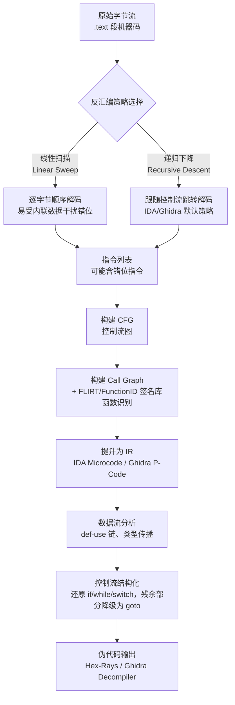
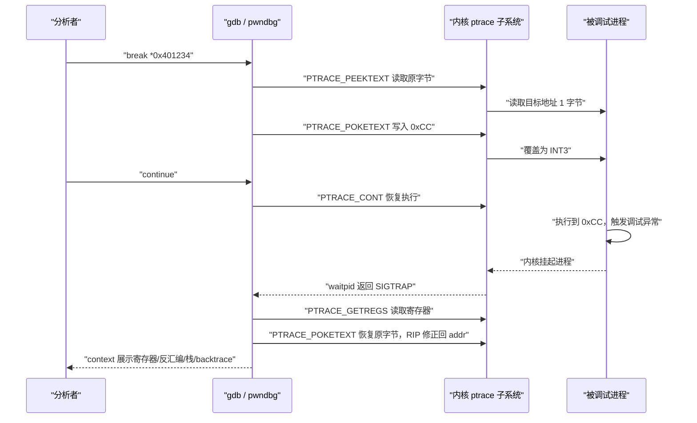
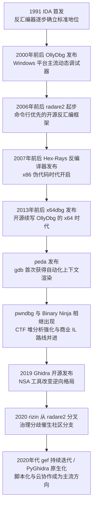
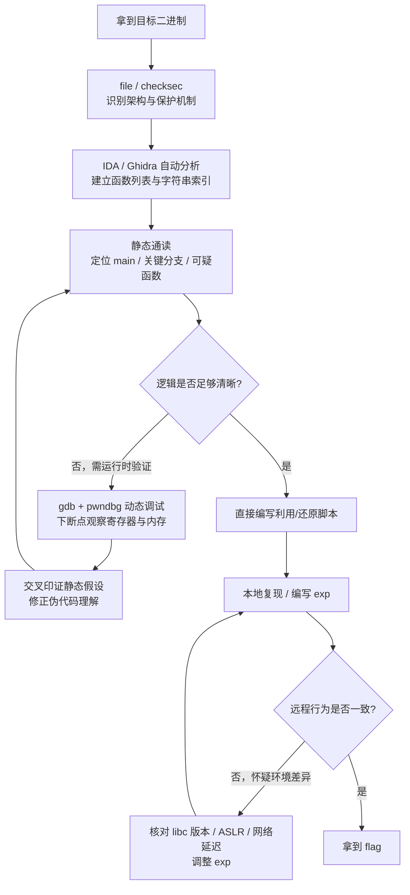

# CTF方法论体系（7）· 静态与动态分析速查

> [!abstract] TL;DR
> - 静态分析（IDA/Ghidra）负责建立"全局但不保真"的结构假设，动态调试（gdb+pwndbg/gef）用真实执行状态逐点验证——二者是同一套方法论的两种观测角度，单靠反编译伪代码判断漏洞、或者不看代码盲调，都容易在细节上翻车。
> - 反汇编本质是递归下降算法在变长指令集上做的启发式重建，反编译则是把机器码重新"抬升"为 IR（IDA Microcode / Ghidra P-Code）再做控制流结构化——理解这条流水线，才看得懂伪代码为什么会"看着对、参数个数却是错的"。
> - gdb 软件断点靠 `0xCC`（`INT3`）覆写目标字节 + `ptrace` + `SIGTRAP` 实现，硬件断点靠 `DR0`~`DR3`/`DR7` 寄存器不修改任何代码字节——遇到自校验/自修改代码时这个区别直接决定断点能不能下得住。
> - pwndbg/gef/peda 并不会让 gdb 获得任何原生没有的底层能力，它们只是把寄存器/栈/堆状态实时渲染成一屏上下文，选型看维护活跃度和堆分析深度，而不是能力代差。
> - IDA 的 Hex-Rays 反编译质量仍是天花板，Ghidra 开源且 P-Code 更适合写跨架构脚本，radare2/Binary Ninja/x64dbg 各自服务不同场景——工具选择应服务于"这一步是要精读逻辑还是快速定位"的判断，而非固守单一工具链。
> - 静态地址与运行时地址之间隔着一段 PIE 基址偏移，这是新手"断点下错地方"最常见的根因，必须用 `vmmap`/`/proc/pid/maps` 显式换算后再对照。

## 概述与定位

本篇在《CTF方法论体系》里承担的是"工具操作层"的收口角色，和前两篇存在明确边界：第 2 篇《Pwn解题范式与模板》与第 3 篇《Reverse解题范式》讲的是"拿到一道题该往哪个方向想、按什么套路拆解"，但两篇都刻意跳过了一个前提——这些思路要落地，靠的是对 IDA、Ghidra、gdb 这几件工具近乎肌肉记忆式的熟练操作。本篇要补的正是这一块：不重复解题范式本身，只讲工具怎么用、为什么这么设计、什么时候该切换到另一个工具，是一份贯穿静态与动态两条主线的操作速查。

先厘清"静态分析"与"动态分析"这对概念——它们不是两种互斥的技术，而是同一个逆向目标在两种观测模式下的呈现：

- **静态分析**：不运行目标程序，只对磁盘上的二进制文件本身做解剖——反汇编、反编译、字符串/交叉引用扫描、控制流图重建。优点是覆盖面广，能看到所有分支，包括永远不会被触发的代码路径，不依赖运行环境，也不会被反调试逻辑干扰；缺点是所有"值"都是符号化的猜测——寄存器里到底装的是什么、循环到底跑几次、间接跳转到底跳去哪，静态分析只能靠启发式推断，推断错了分析者往往当场不自知。
- **动态分析**：让目标程序真的跑起来，通过调试器接管进程后观察真实的寄存器、内存、调用栈状态。优点是"眼见为实"——具体数值、具体跳转目标、具体内存布局都是运行时的真值；缺点是只能看到当前这一条执行路径，覆盖率天然受限于测试用例，还会被反调试、自校验代码干扰。

CTF 里成熟的分析节奏几乎总是"静态铺开、动态验证、往复收敛"：先用 IDA/Ghidra 把整个二进制的函数骨架、字符串、明显的加密/校验逻辑摸一遍，形成一个"大概是这样"的假设；再用 gdb 在关键位置下断点跑一遍，拿真实寄存器/内存数据去验证或推翻这个假设；如果发现假设错了，回到反编译窗口重新读，如此迭代直到伪代码和运行时行为完全对得上，再动笔写 exploit 或还原算法脚本。这个"静态生成假设、动态验证假设"的往复循环，就是本篇要系统化的核心方法论，落到具体操作层面，对应的是三大工具矩阵：IDA Pro（商业标准，反编译质量最高）、Ghidra（NSA 开源，免费且脚本化能力强，适合团队协作与批量分析）、gdb + pwndbg/gef（动态调试事实标准，尤其在 Linux Pwn 方向几乎是唯一选择）。

Windows 平台下的逆向（尤其 Reverse 分类里常见的 crackme、.NET/C++ 商业软件分析）还会遇到 x64dbg 这类原生调试器，本篇也会提及，但不作为重点——CTF 里 Pwn 方向绝大多数目标是 Linux ELF，动态调试的默认工具链就是 gdb 系。此外，涉及具体的保护机制识别与绕过（Canary/NX/PIE/RELRO/CET 等）属于第 10 篇《常见保护与绕过速查》的范围，本篇只在必要处提及"如何用工具看见它"，不展开"如何绕过它"；涉及自动化路径探索与约束求解，属于第 9 篇《符号执行辅助解题：angr实战》的范围，本篇只在静态/动态手工分析走不动时指出这条升级路径的存在。

## 原理与机制

### 反汇编：从字节流到指令列表

现代反汇编器面对的输入只是一段裸字节流，输出目标是把它切分成"哪些字节属于同一条指令、指令边界在哪"。这件事在定长指令集上相对简单，但 x86/x86-64 是变长指令集，一条指令可能 1 到 15 字节，代码段里往往还混着跳转表、字符串常量、对齐填充字节这类"不是指令的字节"，这就让反汇编天然存在"从哪个字节开始切"的歧义。两种经典算法应对这个歧义：

- **线性扫描（Linear Sweep）**：从段起始地址开始，严格按"上一条指令结束的下一字节就是下一条指令开始"顺序切割。遇到内联在代码段里的数据（比如 switch 跳转表、字符串）会直接错位解析，后续所有指令可能全部解析错误，早期反汇编器多用此策略，胜在简单快速。
- **递归下降（Recursive Descent）**：从已知入口点（如 `_start`、导出函数）开始反汇编，遇到条件/无条件跳转、`call` 就把目标地址加入待处理队列，跟着控制流走，遇到内联数据不会被强行当成指令解析，因为递归下降只走"控制流真正会到达"的字节。IDA 和 Ghidra 默认都用递归下降加启发式补丁（比如识别函数序言 `push rbp; mov rbp, rsp` 模式来定位未被直接引用到的函数入口，弥补递归下降"只能发现被引用到的代码"这个盲区）。

这个原理直接决定了分析者会遇到的一个经典陷阱：反汇编器在没有显式交叉引用的地方（比如通过计算得到的间接跳转目标、手写汇编内嵌的花指令构造出的假地址）会"漏掉"或"错切"代码，界面上表现为一片无法识别的字节，或者被误判成数据。遇到这种情况需要手动 Undefine 后 Make Code / Make Function 强制重新反汇编，这也是为什么"递归下降 + 手工干预"是所有现代逆向工具的标准配置，而不是指望全自动一步到位。

### 反编译：把汇编"抬升"成伪代码

反编译不是反汇编的简单封装，而是一整条独立的分析流水线，本质上是"编译"这个正向过程的逆向重建：编译器把 `if/while/for` 这类结构化的高级语言"拍扁"成条件跳转和寄存器分配，反编译器要把这盘已经拍扁的散沙重新"揉"回结构化形式，具体分几个阶段：构建 CFG（控制流图，以基本块为节点、跳转/顺序执行为边）；提升为中间表示 IR（IDA 用自研的 Microcode，Ghidra 用 P-Code，都是比原生汇编更抽象、跨架构统一的表示形式，把加减乘除、内存访问、条件判断都归一化成有限的几类 IR 操作，方便后续分析代码复用而不必为每种 CPU 架构重写一遍）；做数据流分析（构建 def-use 链，识别哪些寄存器/栈槽实际上代表同一个"变量"，再做类型传播）；做控制流结构化（把 CFG 里的跳转模式匹配回 `if/else`、`while`、`for`、`switch`，无法匹配的保留为 `goto`）；最后输出伪代码，变量默认命名为 `v4`、`a1` 这类占位符，函数默认是 `sub_401234`，都需要分析者根据语义手动重命名。

下面的流程图展示了这条从机器码到伪代码的完整流水线：



理解这条流水线的意义在于：它解释了反编译结果"为什么有时候看起来完全合理，细节却是错的"——每一步都是启发式重建而非精确逆运算，最常见的翻车点是调用约定识别错误。x86 下 `cdecl`/`stdcall`/`fastcall`/`thiscall` 混淆，或者 x86-64 下 System V AMD64 ABI（Linux）与 Microsoft x64 调用约定（Windows）的参数传递寄存器完全不同，一旦反编译器猜错调用约定，参数个数和顺序会全部对不上；栈平衡被破坏（比如手写汇编故意多 `push` 了一次数据来跳过某条指令）之后，反编译器对整个函数的栈帧识别会彻底错乱，伪代码变得不可读，这时候必须回到汇编视图逐指令核对，靠反编译伪代码本身是看不出问题所在的。

静态分析里另一个关键动作，是把 `sub_XXX` 这类无名函数还原成 `strcpy`、`malloc` 这类已知库函数名，这靠的不是理解语义，而是纯字节模式匹配：IDA 的 FLIRT（Fast Library Identification and Recognition Technology）预先对各种编译器/版本/优化等级产出的库函数目标码做哈希签名，签名会对函数内部指向其他地址的引用（这类字节在最终链接前不确定，属于"可变部分"）做通配符处理，只对函数体里"确定不变"的部分做精确匹配，匹配到唯一签名就直接命名，并顺着交叉引用关系递归应用到该函数调用的其他库函数。Ghidra 的 FunctionID 机制原理相同。这解释了为什么静态链接、strip 过的二进制在有对应签名库时也能被自动识别出库函数名——这本质是"对号入座"而非真正读懂了字节码语义，遇到签名库没收录的编译器版本或者被混淆过的库函数，自动识别就会失效，需要人工比对开源库源码逐一核实。

### 动态调试的地基：ptrace 与断点机制

Linux 下几乎所有用户态调试器（gdb 及其插件、`strace`、部分沙箱）最终都建立在 `ptrace(2)` 系统调用之上。调试器进程通过 `PTRACE_ATTACH`（或子进程 `PTRACE_TRACEME` 后 `exec`）成为目标进程的"追踪者"，之后可以用 `PTRACE_PEEKTEXT`/`POKETEXT`（或直接读写 `/proc/pid/mem`）任意读写目标进程内存，用 `PTRACE_GETREGS`/`SETREGS` 读写目标寄存器组，用 `PTRACE_CONT` 恢复执行、`PTRACE_SINGLESTEP` 借助 CPU 的陷阱标志位（`EFLAGS` 里的 `TF` 位）单步执行一条指令后自动触发调试异常。

软件断点的实现极其朴素：调试器把断点地址原本的字节保存下来，替换成 `0xCC`（也就是 `INT3` 指令的机器码），进程执行到这里会触发调试异常，内核把它转换成 `SIGTRAP` 信号并挂起进程通知追踪者；调试器捕获到停止事件后，把该地址的字节改回原值（否则用户看到的反汇编和内存 dump 会显示一堆假的 `0xCC`）、把 `RIP` 往回修正一个字节（因为 CPU 已经执行完 `INT3` 并前移了 `RIP`），再把寄存器/栈状态渲染出来给分析者看；等分析者要继续执行时，先单步跨过原指令，再重新写入 `0xCC` 以保留断点。整套动作示意如下：

```
断点写入前：  55 48 89 E5 48 83 EC 20 ...   ; push rbp; mov rbp,rsp; sub rsp,0x20 ...
断点写入后：  CC 48 89 E5 48 83 EC 20 ...   ; 原首字节 0x55 被替换为 0xCC（INT3）
命中并单步跨过后（临时恢复+重新下断）：
              55 48 89 E5 48 83 EC 20 ...   ; RIP 由 addr+1 被调试器修正回 addr
```

这一整套"写字节-捕获信号-改回字节-单步-再写字节"的动作在 gdb 里对用户完全透明，但正是这个机制导致软件断点在两类场景下失效：一是自校验代码——程序运行时对自身代码段做 CRC/哈希校验，断点写入的 `0xCC` 会让校验失败进而触发反调试分支或直接崩溃；二是只读/共享代码页在某些加固场景下拒绝写入。这类保护机制的具体识别与绕过属于[[34.现代二进制防护机制/12.加固工具与checksec]]和第 10 篇的范围，本篇只需要理解"为什么软件断点在这些场景下会失效"这一条原理。

对付这两种场景的替代方案是硬件断点：x86 提供 `DR0`~`DR3` 四个调试地址寄存器、`DR6` 记录触发状态、`DR7` 做使能与类型配置，可以配置"执行到该地址中断""该地址被写入时中断""该地址被读写时中断"，由 CPU 微架构层面直接比对而不修改任何代码字节：

```
DR7 控制寄存器（简化示意，每个断点占 2 组控制位）：
  L0/G0 使能位   -> 是否启用 DR0 对应的断点
  R/W0（2 bit）  -> 00=仅执行断点  01=写入断点  11=读写断点（不含取指）
  LEN0（2 bit）  -> 断点覆盖长度：00=1字节 01=2字节 11=4字节 10=8字节(long mode)
  ... DR1~DR3 对应的控制位在 DR7 中同构重复
```

硬件断点的代价是数量上限只有 4 个，且部分虚拟化/沙箱环境会拦截对调试寄存器的访问。gdb 的 `watch`/`rwatch`/`awatch` 命令、以及大多数支持"data breakpoint"的图形调试器背后都是这套机制。下面的时序图展示了一次典型软件断点从设置到命中的完整交互：



### pwndbg/gef/peda：上下文渲染层，而非能力扩展

原生 gdb 的交互体验对逆向/pwn 场景并不友好——每次停下来都要手动敲 `info registers`、`x/20i $pc`、`x/20gx $sp` 才能拼出当前状态的全貌。peda、gef、pwndbg 这几个插件本质上都是用 gdb 自带的 Python API（`gdb.Command`、停止事件钩子）在每次程序停止时自动收集寄存器/反汇编/栈/backtrace，重新排版成一屏"context"展示出来，并附加了一批面向漏洞利用场景的便捷命令。需要强调的是：这些插件并没有让 gdb 具备任何它原本没有的底层调试能力，`ptrace` 能做的事情插件也只能做这些，它们改变的只是"人眼看懂当前状态"所需要的时间——这也是为什么选择用哪个插件更多是维护活跃度、堆分析细致程度、个人习惯的问题，而不是功能代差的问题，具体命令速查见下一节。

## 静态分析与动态调试技术详解

### 工具格局的演进脉络

理解 IDA/Ghidra/gdb 系为什么会成为今天的事实标准，离不开一段简要的发展史——这段历史本身也解释了它们各自的设计取向从何而来：



这条脉络里有几个值得注意的因果关系：Ghidra 2019 年开源直接冲击了 IDA 长期靠"高定价+能力垄断"维持的市场地位，此后 Hex-Rays 也在逐步放宽个人/教育场景下的获取门槛；pwndbg/gef 这类 gdb 增强插件几乎是和 CTF Pwn 方向的火热同步成长起来的，二者互为因果——题目对堆利用细节的要求越来越高，倒逼调试器上下文展示能力持续迭代；radare2 到 rizin 的分叉则提醒逆向工具生态和其他开源项目一样存在治理与技术路线分歧，同一套原理可能长出多个并行发展的实现。

### 速查：IDA 与 Ghidra 核心操作对照

| 操作 | IDA Pro | Ghidra |
|---|---|---|
| 反编译当前函数 | `F5` 生成 Pseudocode 窗口 | Decompile 面板与 Listing 实时联动 |
| 查看交叉引用 | `X`（谁引用当前地址） | `Ctrl+Shift+F` |
| 重命名 | `N` | `L` |
| 跳转到地址 | `G` | `G` |
| 字符串窗口 | `Shift+F12` | Window → Defined Strings |
| 定义/管理结构体 | `Shift+F9`（Structures） | Data Type Manager |
| 图形/文本视图切换 | 空格键 | Listing 常驻，Function Graph 为独立窗口 |
| 修改变量/返回值类型 | `Y` | `Ctrl+L`（Retype Variable） |
| 汇编↔伪代码双向跳转 | `Tab` | 点选自动联动高亮 |

这张表只覆盖高频动作，更关键的是理解每个视图背后的数据来源：反汇编视图和伪代码视图共享同一份底层数据库，切换视图不会丢失任何标注；交叉引用是静态分析里最常用的动作，不管是找"谁调用了这个函数"还是"这个字符串被哪个函数用到"，顺着交叉引用反查上下文，比通读全部代码快得多——很多题目根本不需要通读全部函数，从一条关键字符串反查调用者就能直接定位到核心逻辑。

### IDA Pro 深度要点

IDA 的字符串窗口（`Shift+F12`）列出 `.rodata`/`.data` 里所有可打印字符串，配合交叉引用是快速定位"flag 校验逻辑""格式化字符串漏洞点"的标准起点。**Structures**（`Shift+F9`）和 **Local Types**（`Shift+F1`）用于手动定义结构体后应用到伪代码里的指针变量上，能把一堆 `*(int *)(a1 + 0x18)` 这样的偏移访问还原成 `s->field_18`，极大提升可读性，这一步在解析自定义协议/复杂数据结构的题里几乎是必做项。补丁方面（Edit → Patch Program，或直接在十六进制视图改字节），IDA 修改的是内存里加载的数据库视图，需要额外操作（Edit Bytes / Apply Patches to Input File）才会真正写回磁盘文件，这个"看到的不等于文件本身"的区别是新手常见的困惑点。

脚本化方面，IDAPython（`idaapi`/`idautils`/`idc` 三个模块）是把重复劳动自动化的关键——批量重命名符合命名规律的函数、提取所有立即数常量去暴力匹配已知加密算法的 S-box/常量表、自动 patch 掉所有反调试检测点，这些在大型/多阶段逆向题里（比如带多层保护、或者需要跑很多次才能定位真正校验逻辑的题）几乎是刚需，手动点根本来不及。FLIRT 之外，IDA 还有 Lumina——联网向 Hex-Rays 云端提交/查询函数元数据的服务，同一份二进制如果之前有人分析过并上传过命名，可以直接拉取，但 CTF 比赛环境通常离线或不信任第三方服务，实战里更多依赖本地签名库和手工分析。

处理花指令（不透明谓词、垃圾跳转打断反汇编对齐）是 IDA 使用中绕不开的场景：典型表现是某个基本块反汇编出来指令长度对不上，或者图形视图里出现明显不该存在的分支，这时候需要人工判断哪些字节是"从未真正执行的垃圾数据"，用 Undefine 清除错误反汇编后手动 Make Code/Make Function 在正确的偏移重新反汇编，IDC/IDAPython 脚本也可以批量做这类"nop 掉花指令、修正代码边界"的操作。

### Ghidra 深度要点

Ghidra（NSA 开发，2019 年在 RSA 大会正式开源发布）采用不同的技术路线解决同一个问题。核心是 Code Browser（反汇编+函数列表+符号树）和 Decompiler 窗口联动，交互逻辑与 IDA 的双视图联动思路一致，但底层 IR 是 P-Code——比 IDA Microcode 更贴近"通用寄存器传输语言"风格，几乎每条目标指令都会展开成若干条 P-Code 操作，这个"更啰嗦但更规整"的特性使得写一个跨架构通用的分析脚本（比如"找到所有栈溢出可能点"这类通用检测逻辑）在 Ghidra 里往往比在 IDA 里更省心，因为不用单独处理不同 CPU 架构的 Microcode 差异。

Ghidra 内置 Version Tracking 工具，功能上对标 IDA 生态里常用的第三方插件 BinDiff——用于比较两个版本的二进制、找出改动的函数，这在"题目更新前后 diff 找漏洞点"或者分析补丁（patch diffing 定位 CVE 场景）这类需求上是刚需，不需要额外付费插件。团队协作上 Ghidra 提供 Ghidra Server，支持多人对同一个工程做 check-out 式协作标注，这是 IDA 传统上比较弱的一环，对大型 RE 项目、多人分工的 CTF 战队价值明显。Ghidra 的脚本生态（Script Manager，支持 Java 原生和通过 Jython 桥接的 Python 2 风格脚本，较新版本也在推进 PyGhidra 原生 Python 3 支持）和 IDAPython 定位类似，但因为 Ghidra 本身用 Java 写、反射能力强，写复杂批量分析脚本、甚至给 Ghidra 加插件的门槛比 IDC 略高但上限也更高。

Ghidra 最被诟病的短板历史上是反编译器成熟度不如 Hex-Rays——尤其是复杂 C++（虚函数表识别、多重继承、异常处理相关的编译器生成代码）和部分重度优化代码的可读性，这个差距近几年在持续缩小，但涉及 C++ 虚表还原这类场景，IDA 配合 Class Informer 一类插件目前仍然更省力。

### GDB + pwndbg/gef/peda 实战速查

原生 gdb 命令是所有插件的地基：

| 用途 | 命令 |
|---|---|
| 下断点 | `break`/`b <addr｜func>`，一次性断点 `tbreak` |
| 继续执行 | `continue`/`c` |
| 单步（进入调用） | `step`/`s`（源码级），`stepi`/`si`（指令级） |
| 单步（跳过调用） | `next`/`n`，`nexti`/`ni` |
| 跑到函数返回 | `finish` |
| 查看内存 | `x/<count><format><size> addr`，如 `x/20gx $rsp` |
| 查看寄存器 | `info registers`/`i r` |
| 调用栈回溯 | `backtrace`/`bt` |
| 观察点（硬件断点） | `watch`/`rwatch`/`awatch <expr>` |
| 条件断点 | `break *addr if $rax==0` |
| 断点触发脚本 | `commands ... end` |
| fork 场景跟踪 | `set follow-fork-mode child｜parent` |

pwndbg（CTF Pwn 方向目前使用率最高的插件）在此基础上叠加的核心能力集中在：`context` 每次停下自动打印寄存器、反汇编、栈、backtrace 拼成的一屏视图，是日常调试的默认工作台；`vmmap` 展示当前进程内存映射（等价于 `/proc/pid/maps` 但带权限高亮），用于确认 PIE/共享库实际加载基址；`telescope` 递归解引用一段内存，自动识别"这个值是不是指针、指向的地方还是不是指针"，快速看清一条指针链或栈上的内容布局；`heap`/`bins`/`tcache` 可视化 glibc 堆分配器的 chunk 结构和空闲链表状态，具体的堆利用技巧本身不是本篇范围（参见[[33.二进制漏洞与利用基础/00.二进制漏洞与利用基础总览]]），但这几个命令是"看清堆当前状态"的标准手段；`cyclic`/`cyclic -l` 直接复用 pwntools 的 De Bruijn 序列生成/回查逻辑，填充定位溢出偏移量时不需要切出 gdb 到 python 里再算一遍；`checksec` 在 gdb 里直接跑一遍保护机制检测，省去切终端（机制细节见[[34.现代二进制防护机制/12.加固工具与checksec]]）。

gef（hugsy 维护）和 peda 是同类竞品，三者能力集高度重叠，选择上更多是维护活跃度和个人习惯的差异——gef 常被认为在非 Linux/非 glibc 场景（比如题目静态链接了别的分配器，或者需要和模拟执行引擎联动）灵活度更高，pwndbg 在标准 glibc 堆题上打磨得更细。

远程/进阶调试场景值得单独提一句：`gdbserver` 可以在目标机（容器、开发板、甚至另一台跳板机）起一个精简的调试后端，本地 gdb/pwndbg 通过 `target remote host:port` 连接，IDA 的 Remote Linux Debugger 插件走的也是类似的 stub 思路；对付难以重现的时序相关 bug（比如条件竞争、偶发堆错乱），Mozilla 的 `rr` 记录回放调试器可以先完整录制一次执行，再无限次确定性回放并配合 gdb 反复调试，是 CTF 高阶选手和真实漏洞挖掘里都会用到的手段，原理是记录所有非确定性输入（系统调用返回值、信号、调度顺序）而不是重新执行代码本身。

### 静态地址与运行时地址的换算

这是新手最容易踩的坑，值得单独展开原理：IDA/Ghidra 静态分析看到的地址，对于 PIE（Position Independent Executable，现代 Linux 默认开启）二进制而言是"相对镜像基址为 0"的虚拟地址，而进程真正运行起来后，内核会把整个镜像加载到一个随 ASLR 变化的基址上，二者之间的换算公式是：

```
运行时真实地址 = 静态分析看到的镜像内偏移地址 + 运行时镜像加载基址

示例：
  IDA 里看到目标指令的静态地址为 0x1450（相对镜像基址 0）
  vmmap（pwndbg）或 /proc/pid/maps 读出该二进制本次加载基址为 0x555555554000
  实际应下断点地址 = 0x555555554000 + 0x1450 = 0x555555555450
```

调试时必须先读出当前基址，再把 IDA 里看到的静态偏移加上去才能下对断点；反过来，gdb 里 `backtrace` 打出来的真实地址要拿回 IDA 对照伪代码，也要减掉同样的基址。本地复现时，gdb 对它亲自 `fork`/`exec` 出来的子进程默认就会关闭地址随机化（`show disable-randomization` 默认为 on），这也是为什么很多人在 gdb 里调试时发现地址异常"稳定"——但这个默认行为只对 gdb 亲自拉起的进程生效，`attach` 到已经在运行的远程/服务端进程时并不受影响，仍然要按运行时实际基址显式换算。IDA/Ghidra 也都支持"Rebase Program"功能，把整个数据库重新映射到某个基址，方便和某一次具体运行的地址直接对照，不用每次手动加减。

## 工具视角与实战

### 一次典型分析的完整节奏

以一道"拿到一个去符号的 ELF64、题目描述只给了 nc 连接方式"的典型 Pwn/Reverse 混合题为例，把前面讲的原理串成实际操作序列：

1. **文件识别与保护扫描**：`file` 确认架构/是否动态链接，`checksec` 确认 Canary/NX/PIE/RELRO 开启情况——这一步直接决定后续分析和利用的方向，保护机制细节不在本篇展开。
2. **静态铺开**：丢进 IDA 或 Ghidra 自动分析，先看 Functions 窗口里有没有幸存的符号（静态链接的 libc 函数即使用户代码 strip 了，libc 本身的符号或者 FLIRT 签名往往还能识别出一批），再看字符串窗口——"Input flag:""Wrong!""Correct!"这类字符串几乎总是校验逻辑的入口，用交叉引用直接跳到调用者，比从 `main` 一行行读快得多。
3. **建立假设**：通读定位到的几个关键函数的伪代码，标注变量类型、重命名，形成"输入在这里被读取、这里做了某种变换、这里比较"的结构性理解，遇到看不懂的循环或疑似加密算法先记录下来不深究细节——具体是哪一类密码学算法、该怎么针对性攻击，交给[[37.密码学/53.密码学攻击概览]]处理。
4. **动态验证**：gdb+pwndbg 跑起来，在读输入和做比较的位置下断点，用真实输入观察寄存器/内存里的中间值，验证第 3 步的假设——静态分析里"看起来是异或"的操作，动态跑一遍立刻能确认异或的 key 到底是什么、有没有被静态分析漏掉的变换步骤。
5. **往复收敛**：动态验证如果推翻了某个假设，回到伪代码重新读、重新理解，如此反复直到伪代码和运行时行为完全吻合；如果人工往复几轮仍然定不下来路径条件（常见于重度混淆或深层状态机），是时候考虑升级到[[45.反编译器与反汇编引擎原理/11.符号执行与angr框架]]描述的自动化路径探索，而不是继续肉眼死磕。
6. **落地**：确认漏洞点/算法后，写出 exploit 或算法还原脚本（工程化细节见第 8 篇《漏洞利用脚本工程：pwntools进阶》），本地复现通过后再对远程目标验证，如果本地和远程行为不一致（常见于 libc 版本差异、超时差异），回头检查环境差异而不是怀疑漏洞本身不存在。



### 工具选型的决策依据

不同工具的差异不是能力代差，而是"设计取向"不同，选型应该服务于当前这一步分析的具体需求而不是固定死一条工具链：

| 工具 | 类型 | IR / 反编译 | 脚本能力 | 定位 |
|---|---|---|---|---|
| IDA Pro | 商业 | Microcode，Hex-Rays 反编译质量当前最高 | IDC / IDAPython | 精读复杂逻辑的标杆 |
| Ghidra | 开源（NSA） | P-Code，统一跨架构 IR | Java / Jython，PyGhidra 演进中 | 团队协作、免费、批量脚本分析 |
| Binary Ninja | 商业（个人版较低价） | LLIL/MLIL/HLIL 三层 IL | 原生 Python API | 脚本化自动分析，份额持续上升 |
| radare2 / rizin | 开源 | ESIL | `r2pipe`（多语言绑定） | 命令行批量处理、无 GUI 环境 |
| x64dbg | 开源 | 无（调试器非反编译器） | 插件（C++/`x64dbgpy`） | Windows 原生动态调试标准 |

具体到判断依据：**需要精读复杂逻辑**（重度优化代码、C++ 虚函数、多层加密）时优先 IDA，Hex-Rays 反编译器综合可读性仍是天花板，尤其配合 Class Informer 类插件对虚表的还原能力，是节省时间最明显的地方。**预算受限、需要团队协作标注同一份工程、或者要写批量/跨架构分析脚本**时选 Ghidra，开源免费、Ghidra Server 协作、P-Code 统一 IR 写通用脚本更省心，内置 Version Tracking 免费做到多数场景下的二进制 diff。**需要无 GUI 环境下批量处理大量样本**（自动化 writeup 脚本、CI 里跑分析）时选 radare2/rizin，命令行优先设计，`r2pipe` 把整个反汇编/反编译能力暴露成可脚本化的 API，启动开销远小于 IDA/Ghidra，代价是自身命令迷你语言学习曲线陡峭（其 GUI 前端 Cutter 可以缓解这一点）。**重视 Python API 简洁性、需要写大量自动化脚本、且预算允许商业授权**时，Binary Ninja 是近几年 CTF 圈子里份额上升明显的选项，三层 IL 设计给脚本开发者比单层 IR 更细粒度的介入点。**目标是 Windows 原生二进制**（部分 Reverse 分类的 crackme）时，动态调试首选 x64dbg，开源免费、操作习惯沿袭 OllyDbg 传统，插件生态针对 Windows 反调试对抗专门优化，gdb 在 Windows 原生程序调试上生态远不如 Linux 完善。**单纯确认"这里会不会崩、崩的时候寄存器长什么样"这种浅层验证**，不需要上升到完整反编译精读时，直接 gdb 动态调试就够——很多简单的裸栈溢出题甚至不需要打开 IDA，`checksec` 确认没开 Canary/PIE 后直接本地跑一遍看崩溃点，比正襟危坐反编译整个程序快得多。

补丁对比（patch diffing）是另一个值得单独强调的实战技巧：题目更新前后的两版二进制、或者软件打补丁前后的两个版本，用 BinDiff（配合 IDA）或 Ghidra 自带的 Version Tracking 做函数级别的相似度比对，能直接定位到"改动了哪个函数"，这在推测某次更新修复了什么漏洞、或者对抗出题者混淆过的多阶段程序时效率极高，比逐函数人工比对快一个数量级。

移动端目标（Android/iOS 逆向类考题）工具矩阵会有出入：静态分析用 jadx/Ghidra 反编译 smali/DEX 或原生 so 库，动态层面除了 gdb（配合 gdbserver attach 到目标进程）外还常搭配 Frida——一个基于代码注入而非 `ptrace` 的动态插桩框架，靠向目标进程注入 JS 引擎实现函数 hook 和参数篡改，不需要真正"断住"进程，对付有反调试检测的 App 有独特优势；如果考题涉及后续网络协议层面的分析，属于[[72.抓包与协议分析实战/13.抓包实战CTF与漏洞分析]]范围。面向 WASM 字节码的题目，反汇编/反编译的原理相通但工具链完全不同（`wasm-decompile`、Ghidra 的 WASM 插件、wabt 工具集），专项实战参考[[40.WASM与虚拟化壳逆向/08.WASM CTF实战]]，这些都已经超出本篇 IDA/Ghidra/gdb 面向原生 ELF/PE 的速查范围，这里只作为工具矩阵的延伸提示。

## 安全性与正确使用

> [!caution] 合规边界
> 本文所述静态反编译与动态调试技术仅用于自有资产、经授权的安全评估环境，以及 CTF/安全研究靶场中的教学与研究目的。逆向分析与调试能力天然是中性技术，同样一套操作可以用于 CTF 解题、企业内部漏洞挖掘、开源合规审计，也可能被滥用于绕过商业软件的授权保护或未经授权分析他人受版权保护的产品——本篇只从防御与研究视角讲解原理与操作，不提供针对真实生产系统的攻击性操作指南，也不为绕过商业授权提供武器化步骤。

除了法律与授权边界，逆向分析在实操层面还有几条容易被忽视的安全注意事项，值得作为操作规范固定下来。分析不明来源样本（尤其疑似真实恶意软件而非 CTF 题目）时，应当先完整过一遍静态分析，避免过早动态执行触发传播/破坏性逻辑；动态调试必须在隔离环境中进行——无网络访问的虚拟机、配合快照随时回滚，避免样本利用某个未知漏洞逃逸出沙箱，或者干脆直接联网上传数据。这里还有一层容易被忽视的风险：分析工具本身也是攻击面，IDA、Ghidra 这类需要解析高度不受信任、结构复杂的输入文件（PE/ELF 头、调试信息、字符串表）的软件历史上都曾曝出过解析特定构造的畸形文件触发自身漏洞的案例，分析高度可疑样本时不应该用日常工作机跑分析工具，专门的隔离分析虚拟机是必要投入而非可选项。

在取证场景（参见第 6 篇《Misc与取证与隐写》）下，还有一条操作纪律容易被静态分析工具的"顺手"特性破坏：应当始终对目标文件的副本进行分析、原始文件只读挂载或单独备份，避免 IDA 的 Patch 功能等编辑类操作误改动了原始证据文件，破坏证据链完整性——这类工具默认是面向"分析并逐步修改理解"设计的，并不会主动提醒你正在写入的是唯一一份原始样本。硬件断点/反自校验一类的绕过技巧如果被用来对抗真实商业软件的完整性保护，就已经越出了本篇的讨论边界，本篇只讲清楚断点机制本身"为什么在自校验代码前会失效"这一层原理，具体到"如何在 CTF 保护机制范围内识别与绕过"，交给第 10 篇在明确授权边界下继续讨论，同样不提供面向真实目标的成品配方。

## 小结

本篇把《CTF方法论体系》里反复被用到、却从未展开的"工具操作层"做了一次系统梳理，核心是一条方法论主线：静态分析（IDA/Ghidra）负责在不运行程序的前提下铺开全局结构、建立假设，动态调试（gdb+pwndbg/gef/peda）负责用真实执行状态逐点验证假设，二者通过"往复收敛"的节奏共同逼近对目标程序的准确理解。支撑这条主线的是三层原理：反汇编的递归下降算法与反编译的 IR 抬升+控制流结构化流水线，解释了静态分析结果为什么会"看着对、细节却可能错"；`ptrace` 与软件/硬件断点机制，解释了动态调试的能力边界与失效场景；PIE 基址换算，解释了静态地址与运行时地址之间最容易踩坑的一步换算。工具矩阵上，IDA、Ghidra、gdb 系插件、以及 Binary Ninja/radare2/x64dbg 这些外围选项各自服务不同的分析取向而非互相替代，选型应该服务于"这一步是要精读逻辑还是快速定位"这个具体判断。需要再次强调边界：具体的解题思路与套路见第 2、3 篇，具体的保护机制识别与绕过见第 10 篇，人工分析走不动时的自动化升级路径见第 9 篇，把这几篇和本篇的工具操作细节结合起来，才是完整的分析能力闭环。

## 相关阅读

- [[02.Pwn解题范式与模板]]——Pwn 方向的解题思路与套路，本篇工具操作的直接应用场景之一。
- [[03.Reverse解题范式]]——Reverse 方向的解题范式，本篇是其工具操作层的补充。
- [[09.符号执行辅助解题：angr实战]]——人工静态/动态分析走不动时的自动化路径探索升级方案。
- [[10.常见保护与绕过速查]]——Canary/NX/PIE/RELRO/CET 等保护机制的识别与绕过细节。
- [[33.二进制漏洞与利用基础/00.二进制漏洞与利用基础总览]]——堆/栈利用原语的系统梳理，pwndbg 的 heap/bins 命令服务于此。
- [[34.现代二进制防护机制/12.加固工具与checksec]]——checksec 输出字段与加固工具的完整解读。
- [[37.密码学/53.密码学攻击概览]]——静态分析定位到具体密码学算法后的攻击方法论。
- [[45.反编译器与反汇编引擎原理/11.符号执行与angr框架]]——反编译器 IR 与符号执行引擎 IR 的关系，及自动化分析的原理基础。
- [[40.WASM与虚拟化壳逆向/08.WASM CTF实战]]——静态/动态分析原理在 WASM 字节码目标上的专项应用。
- [[72.抓包与协议分析实战/13.抓包实战CTF与漏洞分析]]——定位到网络协议解析逻辑后的后续分析方法论。
- 官方文档与书目：Hex-Rays《IDA Pro Documentation》与《Hex-Rays Decompiler Manual》、NSA Ghidra 官方文档（`ghidra.re`/GitHub Wiki）、GNU《Debugging with GDB》手册、pwndbg/GEF 项目 GitHub Wiki、Chris Eagle《The IDA Pro Book》、Chris Eagle & Kara Nance《The Ghidra Book》、Dennis Andriesse《Practical Binary Analysis》、Mozilla `rr` 项目文档。

[[00.CTF方法论体系总览|⬆ 系列总览]] | [[06.Misc与取证与隐写|← 上一章]] | [[08.漏洞利用脚本工程：pwntools进阶|→ 下一章]]
