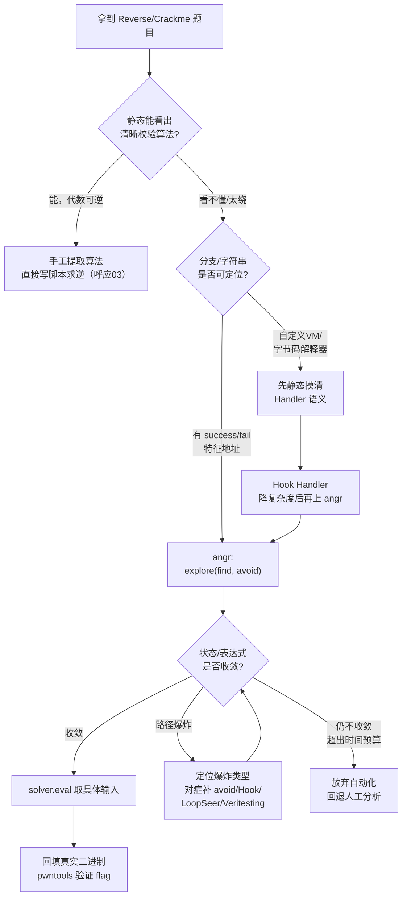
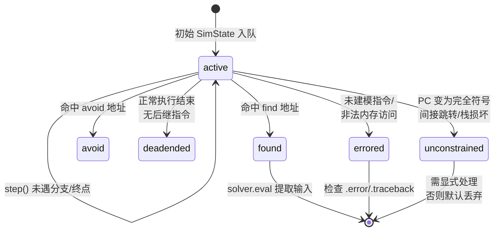
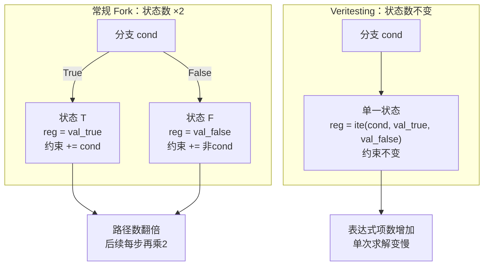
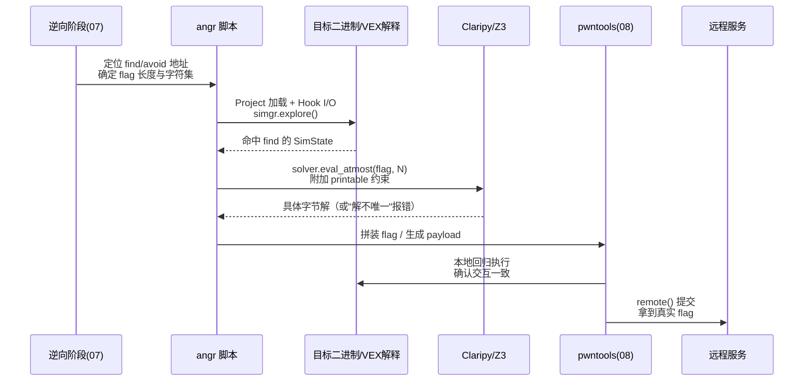

# CTF方法论体系（9）· 符号执行辅助解题：angr实战
> [!abstract] TL;DR
> - angr 在 CTF 里的定位是"用求解器替代人工猜算法"：静态分析看不出清晰校验逻辑、或逻辑被循环/跳表/VM 化打散到难以手工复原时，符号化输入 + `explore(find, avoid)` 常比死磕反编译更省时间；但能一眼看穿的算法，手写脚本永远比等符号执行收敛快，angr 不是无脑首选。
> - 路径爆炸并非单一现象，而有三种独立成因——真正数据相关的路径数指数增长、单路径符号表达式膨胀、间接跳转导致的"PC 完全符号化"（unconstrained）——三者应对手段完全不同，混为一谈是大多数人卡壳的根源。
> - 90% 的探索效率来自"精确打点"：静态定位 find/avoid 地址、Hook 掉库函数内部的无关分支，比事后调 LoopSeer/Veritesting 等通用探索技术更立竿见影，应该优先做。
> - 约束求解不是黑箱：`eval()` 只给"一个"解不代表唯一解，忘记加可打印字符集约束、不用 `eval_atmost` 检查解是否唯一，是"符号执行说 SAT 但 flag 交不对"的头号原因；求出的解必须回填真实二进制验证，因为 SimProcedure 对环境的建模始终是近似。
> - Unicorn 并发执行、Symbion 与真实进程桥接把符号执行从"纯解释执行"扩展到能穿透反调试/系统调用的程度，但这类技术会在真实 CPU/进程上执行代码，必须在授权环境内谨慎使用——本篇只讲原理与工程边界，不提供打真实目标的成品配方。

## 概述与定位

在 CTF 的时间压力下，Reverse（以及部分 Pwn）题目最耗时的环节往往不是"写利用脚本"，而是"看懂校验逻辑"。系列第 03 篇《Reverse解题范式》讲的是人工去混淆、算法识别与爆破的思路；第 07 篇给出了静态/动态分析的速查流程；但当校验逻辑被拆成几十个跳转、混进无关的库函数调用、甚至被编译成一套自定义字节码解释器时，"人眼通读反汇编"这条路径的边际收益会急剧下降。符号执行给出了另一条路：不去弄懂"程序为什么这样判断"，而是把输入换成符号变量，让程序在解释执行的过程中把每一步运算都记成符号表达式、把每一个分支条件都记成路径约束，最后把约束集丢给 SMT 求解器去问"存在不存在一组输入同时满足所有约束"。这把一个需要人类理解语义的逆向问题，转化成了一个纯粹的数学可满足性问题——机器不需要"看懂"算法在干什么，只需要忠实地记账、然后交给求解器去算。

本篇是《CTF方法论体系》系列第 9 章，承接第 08 章《漏洞利用脚本工程：pwntools进阶》——两者在实战流水线里通常首尾相连：angr 求出的具体输入（字节串、命令行参数、环境变量）经常要直接塞进 pwntools 的 `sendline()`/`process()` 去跟目标交互，二者不是替代关系而是接力关系。本篇也为第 10 章《常见保护与绕过速查》做铺垫：现代二进制的很多保护机制本质上都在给符号执行"使绊子"——虚拟化混淆增大解释开销、反调试破坏环境假设、地址随机化打乱静态定位的地址——理解 angr 在什么情况下会被拖垮，反过来就理解了这些保护机制的设计意图。

理论基础全部委托给系列 45：符号执行的基本模型（具体执行 vs 符号执行、路径约束、SAT 判定）、angr 的三层抽象（`Project`/`SimState`/`SimulationManager`）、Claripy 与 Z3 的接口细节，见 [[45.反编译器与反汇编引擎原理/11.符号执行与angr框架]]；SMT 求解器的内部机制（DPLL(T) 架构、位向量理论、可判定性边界、多求解器横向对比）见 [[45.反编译器与反汇编引擎原理/24.SMT约束求解器在逆向]]。本篇不重复这两篇已经讲透的基础，而是聚焦一个更窄、更实战的问题：**在限时比赛里，怎么让符号执行真的在预算时间内跑出结果**——核心是路径爆炸控制与约束求解的工程细节，这也是系列大纲里明确点名"呼应系列 45"的原因：45 系列建地基，本篇讲怎么在地基上盖出能限时交付的房子。

那么什么时候该上 angr、什么时候不该上？下面这张决策图是实战中反复验证过的经验法则：



这张图的核心判断标准分三层：**能否一眼看出算法**（能则手写脚本永远最快，符号执行反而是绕远路，参见系列 04《Crypto解题范式》里对经典算法直接数学求逆的思路，同样的原则也适用于 Reverse 里的简单算法）；**分支结构是否规则**（有清晰的"success/fail"字符串或返回值可以定位，find/avoid 就能立刻生效）；**符号执行是否收敛**（如果几分钟内活跃状态数或求解耗时还在涨，与其死等，不如回头补充 Hook 或干脆放弃转手工）。这也是本篇要反复强调的态度：angr 是效率工具，不是信仰——工程师要懂得什么时候切换回人工分析，而不是把比赛所剩不多的时间都耗在调探索参数上。

## 原理与机制

符号执行的基本思想一句话就能说清：**把程序输入替换成带名字的符号变量，解释执行时不立即计算具体数值，而是把每一步运算记录成符号表达式；遇到条件分支就把分支条件（或其否定）累加进"路径约束集"，并复制出两条独立状态分别往下走；最终对每条路径的约束集做可满足性判定，可满足则用求解器反解出一组具体输入。**这个模型的完整推导、以及直接用 Z3 建模的写法，[[45.反编译器与反汇编引擎原理/11.符号执行与angr框架]] 已经讲得很完整，这里只重申一条对 CTF 实战至关重要的推论：**符号执行本质上是"用计算资源换人力"**——不需要人类理解校验逻辑的语义，但需要机器遍历（或至少触碰）所有可能相关的路径与状态，而"遍历"这件事本身的开销，就是符号执行工程实践里几乎全部矛盾的来源。

angr 把这套模型封装成三层可编程的抽象。`Project` 负责用 CLE（"CLE Loads Everything"）加载 ELF/PE/Mach-O，解析符号表、重定位表、共享库依赖，构造出一份完整的虚拟地址空间视图。`SimState` 是某一时刻的完整机器状态快照——寄存器与内存里的每个字节既可能是具体值，也可能是一段 Claripy 符号表达式，外加当前积累的路径约束集合，以及 `posix`（标准输入输出、文件描述符）之类的环境模型。`SimulationManager`（simgr）管理一组 `SimState` 的集合，按 stash 分类（活跃 `active`、命中目标 `found`、触发规避 `avoid`、正常退出 `deadended`、执行报错 `errored`、PC 变符号 `unconstrained`），`step()`/`explore()`/`run()` 等方法驱动这些状态向前走、并按规则在 stash 之间搬运状态。引擎层面，angr 并不直接解释 x86/ARM 机器码，而是先用 VEX IR（借用 Valgrind 的中间表示，经 pyvex 提升）把每个基本块翻译成平台无关的三地址码，再对 IR 逐条解释——这也是 angr 能同时支持 x86/x64/ARM/ARM64/MIPS/PowerPC 等架构而不用为每个架构重写一遍语义的原因，与 [[45.反编译器与反汇编引擎原理/05.中间表示IR设计：LLVM-IR与VEX与P-Code]] 里 VEX 的设计目标一脉相承。

在深入路径爆炸的具体成因之前，先把 `SimulationManager` 的状态流转图立好——后面所有"控制路径爆炸"的手段，本质上都是在操纵这张图里状态从 `active` 转移到别处的时机与条件：



`active` 是主战场，`step()` 每推进一步都可能因为分支而复制出更多 active 状态，状态数量的膨胀速度直接决定内存占用与求解次数。`found`/`avoid` 是 `explore()` 给出的两个"提前退场"出口，越早触发意味着越少的后续路径被展开——这是控制路径爆炸最廉价也最有效的手段。`deadended` 是正常走到程序退出（`exit()`/返回到无后继指令）的路径，大量出现往往说明目标地址给错了或者根本没设 `avoid`，是探索配置有问题的信号。`errored` 是执行过程中出现 angr 无法处理的情况——未实现的系统调用、非法内存访问、SimProcedure 内部抛出异常，需要检查 `.error` 与 `.traceback` 才能定位根因。`unconstrained` 是最危险的一类：程序计数器本身变成了完全符号化的表达式，典型见于格式化字符串漏洞覆盖返回地址、或者调用一个由输入决定的函数指针；如果放任 angr 的默认行为去处理这个符号 PC，等价于要在整个地址空间里做可满足性搜索，几乎必然拖垮求解器，必须显式接管。

理解了这套分层，再来纠正一个常见的直觉误区：**"每个字节比较就是一次分叉"这句话在多数 CTF crackme 里其实是错的。** 典型的 `if (input[i] != key[i]) goto fail;` 循环里，`key[i]` 是编译进二进制的已知常量，符号执行遇到"符号字节 == 已知常量"这类比较时，只产生一次二元分叉（相等则继续、不等则跳到 fail），而不等分支一旦撞上显式设置的 `avoid` 地址就会被立刻剪掉——只要成功路径唯一，整条循环走下来活跃状态数会始终维持在 1 附近，复杂度是线性的 O(N) 而不是外行以为的 O(2^N)。真正会让状态数或表达式规模失控的，是三类性质完全不同的问题，下一节逐一拆解并给出对应的工程手段。

## 路径爆炸控制与约束求解详解

### 路径爆炸的三种面孔

把"跑不动"笼统地归因于"路径爆炸"，是大多数人调 angr 卡壳的根源——三种失控模式的诊断方法和处理手段完全不同，混为一谈只会病急乱投医。

**第一种：路径数指数增长（真正数据相关的分支）。** 这是教科书意义上的路径爆炸，产生条件是分支条件本身依赖于符号输入的多种可能取值，而不是与一个已知常量比较。典型场景：对输入做奇偶性判断后走不同的计算分支、根据输入字节的高低半字节分别索引不同的替换表、循环次数本身由输入决定（变长字段解析）。这类分支每多一个，活跃状态就可能翻倍，N 个这样的独立分支会撑出 2^N 条路径，是三种模式里唯一严格符合"指数"直觉的一种。

**第二种：单路径表达式膨胀。** 即使全程只有一条路径存活，符号表达式本身也可能因为反复的位运算堆叠而变得极其庞大——哈希函数、CRC、多轮 XOR/ROL 混合就是重灾区：每一轮运算都会把上一轮的表达式树整体包进新的运算节点，几十轮下来单个符号变量的表达式可能有几万个节点。这时候路径数是 1，`active` stash 看起来毫无问题，但最后一步 `solver.eval()` 会在 Z3 内部转译（bit-blast）这棵巨树时耗尽时间——这是和第一种截然不同的失控模式，加再多 `avoid` 也无济于事，需要的是化简表达式或者换求解策略。

**第三种：Unconstrained 状态（PC 完全符号化）。** 当程序计数器本身变成了符号表达式——间接调用一个由输入内容决定的函数指针、栈溢出后返回地址被符号字节覆盖——angr 无法知道下一条指令在哪里执行。默认策略会尝试把这类状态归入 `unconstrained` stash 而不是继续盲目 `step()`，但如果你的探索逻辑没有专门处理这个 stash（例如手工添加约束、或用 `driller`/`veritesting` 之类技术加以限制），这些状态要么被静默丢弃导致漏解，要么在某些配置下触发对海量可能跳转目标的枚举，同样会拖垮求解器。

### 路径爆炸的控制技术清单

针对上述三种模式，angr 生态里的对策可以按"性价比"从高到低排列：

**精确打点（find/avoid）是投入产出比最高的手段，没有之一。** 在动手写符号执行脚本之前，先用第 07 篇讲的静态/动态分析速查流程，在 IDA/Ghidra 里搜出 "Correct"/"Wrong" 之类的字符串引用地址，或者定位关键比较指令之后的两个基本块地址，直接喂给 `explore(find=..., avoid=[...])`。`avoid` 命中即时把状态从 `active` 移出，意味着错误分支根本不会被继续展开——这比事后调任何通用探索技术都更立竿见影，因为它从根子上掐断了状态的增殖。

**Hook/SimProcedure 摘要化消灭"无关的分支源"。** `strlen`、`strcmp`、`memcpy` 等库函数的真实汇编实现，为了适配不同的内存对齐、启用 SIMD 优化，内部往往塞了成打的分支——符号执行一旦真的去逐条解释这些实现，会平白多出大量与题目逻辑毫无关系的路径。用 `SimProcedure` 或简单 Hook 把这些函数替换成语义等价但零分支的 Python 实现，相当于直接删除了这部分状态增殖源。同样的思路可以用在自定义的字节码解释器上：与其让符号执行去跑"取指-译码-分派"这个循环本身（这个循环对每种字节码都要走一次分支，是路径爆炸的高发区），不如先静态摸清每个 Handler 的语义，直接 Hook 整个 Handler 让它一步执行完等价操作。

**Veritesting：用状态合并把路径数问题转成表达式问题。** 这是 angr 内置的自动优化技术，原理是在 CFG 上识别出"很快会重新汇合"的分支（比如 `if` 后面紧跟的小块代码），在汇合点主动合并两条状态，让寄存器/内存里原本分裂成两份的值合并成一个 `ite(cond, val_true, val_false)`（if-then-else）符号表达式，而不是让两条状态各自独立地继续往下跑。效果是活跃状态数量不再随分支数指数增长，但每个状态内部的表达式复杂度会相应上升——这本质上是把"第一种爆炸（路径数）"主动转化成了"第二种爆炸（表达式膨胀）"，是不是划算取决于题目：分支多但后续计算浅的代码适合 Veritesting，分支少但单路径计算深的代码则可能适得其反。



**LoopSeer：给循环设一道"计次闸门"。** LoopSeer 先跑一遍 `CFGFast` 识别出循环的回边（back edge），再在符号执行过程中给每个循环维护一个隐式计数器，超过设定的 `bound` 就强制把继续在循环体内打转的状态归入 `avoid`/丢弃。这对"循环次数与题目逻辑无关、但循环体本身会产生分支"的场景（比如一个先做无意义填充再做真正校验的混淆循环）特别有效——用一个已知上界换取避免陷入不必要的深层展开。

**DFS 与 BFS：内存与"运气"的取舍。** `SimulationManager` 默认的探索顺序接近广度优先——所有活跃状态大致同步往前推进，好处是不会偏科式地扎进某一条注定失败的分支太深，坏处是峰值内存会随着某一深度上所有路径的总数线性增长。`DFS` 探索技术反过来，一次只专注跑一条路径到底、内存占用低得多，但如果没有 `avoid` 指引，DFS 可能一头扎进一条根本走不到 `find` 的分支里很久才回溯。两者不是谁更优，而是"精确打点是否到位"决定了用哪个更划算：`avoid` 覆盖越完整，DFS 的风险越小、内存优势越明显。

**LengthLimiter 与步数上限是最后的安全阀。** 无论前面的手段有多精细，工程上都应该给探索设一个硬性的步数或状态数上限（`simgr.run(n=N)`、`LengthLimiter(max_length=K)`），避免脚本在没人盯着的时候无限跑下去耗尽资源——这是"控制路径爆炸"里最不优雅但最必要的一条。

**Spiller：把不活跃的状态换页到磁盘。** 当活跃状态数超过阈值，`Spiller` 会把当前看起来不太可能很快产出结果的状态序列化到磁盘、需要时再反序列化取回，思路上等价于操作系统的虚拟内存换页机制。它解决的是内存瓶颈而不是计算瓶颈，在状态数量巨大但单个状态本身不大的场景（比如宽度较小、但确实存在真实路径爆炸的字段解析题）比较适用。

**Unicorn 引擎加速：把纯具体执行的部分丢给真 CPU 仿真器跑。** 大量的基本块——尤其是库函数初始化、与符号数据完全无关的代码——从头到尾没有一个字节是符号值，这时候用 VEX IR 逐条解释纯粹是浪费：angr 可以把这类"全具体"的执行区间直接委托给 Unicorn（基于 QEMU 的 CPU 仿真引擎）执行，只有当某个基本块真正读到或分支于符号数据时才切回 VEX 符号解释。开启方式很简单：

```python
import angr

proj = angr.Project('./target', auto_load_libs=False)
state = proj.factory.entry_state(
    add_options=angr.options.unicorn  # 预置的 Unicorn 选项集合
)
simgr = proj.factory.simulation_manager(state)
simgr.use_technique(angr.exploration_techniques.Tracer())  # 可选：配合具体轨迹
simgr.explore(find=0x401200, avoid=[0x401100])
```

在有大段初始化代码（动态链接器、libc 启动例程、程序自身的非校验逻辑部分）的题目上，Unicorn 加速常常能带来数量级的提速，因为它绕开了 VEX 提升与逐条解释的固定开销，直接吃真实指令集的仿真速度。

**Symbion：与真实进程桥接，穿透模型盲区。** 有些行为 SimProcedure 天生建模不了或建模代价极高——真实的系统调用副作用、JIT 生成的代码、依赖具体硬件特征的反调试检测。Symbion 的思路是让 angr 通过 `gdbserver`/`avatar2` 之类的调试通道附加到一个**真实运行**的进程上，先让程序在真实 CPU 上具体执行过这些难缠的部分，跑到一个你选定的检查点后，把这个真实进程当前的寄存器与内存状态"快照"成一个 `SimState`，从这一步开始才切换回符号执行去解决你真正关心的那段逻辑（也可以反过来，符号执行到某一步后又切回真实进程继续跑）：

```python
import angr

proj = angr.Project('./target')
target = angr.exploration_techniques.Symbion(
    memory_concretize=[],  # 需要具体化后再回传符号执行的内存区域
)
entry_state = proj.factory.blank_state()
simgr = proj.factory.simulation_manager(entry_state)
simgr.use_technique(target)

# 先在真实进程里"具体"跑过反调试/初始化逻辑，到达检查点后再转符号执行
simgr.run(until=lambda sm: sm.active and sm.active[0].addr == CHECKPOINT_ADDR)
concrete_state = simgr.active[0]   # 之后可继续 .step()/.explore() 做符号分析
```

这类"具体执行穿透模型盲区、只在关键函数上符号化"的混合策略，是 angr 官方文档里反复强调的实战心法：**符号执行不必从头到尾都是符号的**，只符号化你真正需要求解器帮忙的那一小段，其余部分能具体跑就具体跑。

### 约束求解的 CTF 工程细节

路径控制解决的是"要不要展开这条状态"，约束求解解决的是"展开到终点之后怎么把答案算出来"，两者同样值得细抠。

**`eval()` 只给一个解，不代表解唯一。** `state.solver.eval(x)` 语义是"随便找一组满足当前约束集的赋值返回"，如果约束不够紧（比如没有限定 flag 必须是可打印字符、没有限定长度），返回的具体值可能只是无穷多合法解里凑巧被求解器先摸到的那一个，未必是出题人预期的那个人类可读的 flag。CTF 里"角本执行显示 SAT、但交上去的 flag 不对"，十有八九是这个原因。对策是**尽早**加约束——在创建符号变量之后立刻加上字符集限制（`0x20 <= byte <= 0x7e`）、已知前缀（`flag{`）、已知长度，而不是等 `explore()` 跑完才想起来加；约束加得越早，求解器在化简与传播阶段就能越早排除不合规的分支，这既提升了解的质量，往往也顺带减少了无谓展开的状态。

```python
found = simgr.found[0]

# 唯一性检查：如果解不唯一，eval_atmost 会抛异常提醒你约束不够紧
try:
    unique_val = found.solver.eval_atmost(flag_bytes, 1)
    print("唯一解:", unique_val)
except angr.errors.SimValueError:
    print("解不唯一，需要补充 charset/长度等约束后重新求解")

# 批量枚举候选解，人工挑出可读的那一个
candidates = found.solver.eval_upto(flag_bytes, 5, cast_to=bytes)
```

`eval_upto(expr, n)` 返回至多 n 个不同的可行解，是排查"解是否唯一"最直接的手段；`eval_atmost(expr, n)` 语义相反——如果解的数量超过 n 就直接抛 `SimValueError`，常被用作"断言这里应该只有一个解"的守卫，一旦抛异常就是在提示你漏加了约束。`min()`/`max()` 则用于需要求边界值而非任意可行解的场景（例如"最短满足条件的输入长度"）。

**约束求解器不是单体黑箱，而是会做结构拆分的。** Claripy 底层的 Composite Solver 会分析约束之间的变量依赖关系，把彼此无关的约束子集拆开独立求解——如果 flag 的第 0～3 字节和第 4～7 字节之间没有任何共享变量的约束（例如逐字节独立比较的场景），求解器实际上是分别对两个小规模子问题求解，而不是塞进一个大联合查询。这也是为什么"逐字节独立比较"的 crackme 即使字节数不少，求解也依然很快——真正影响求解耗时的从来不是符号变量的个数，而是约束之间纠缠的**深度**与**非线性程度**（乘法、复杂位运算比较的糅合是主要杀手，机制细节见 [[45.反编译器与反汇编引擎原理/24.SMT约束求解器在逆向]]）。

**始终设超时，并且优雅处理 unknown。** 复杂位运算约束可能让 Z3 求解时间呈指数增长，`state.solver.timeout = 10000`（毫秒）应该是每个 angr CTF 脚本的标配。超时或非线性约束会让 `check()` 返回 `unknown` 而不是 `sat`/`unsat`，此时 `model()` 不可调用，代码里必须区分"确定无解"和"没能在预算内判定"两种情况，后者需要降低约束复杂度重试，而不是当成"此路不通"直接放弃。

**长循环里定期化简约束集。** 手动分步驱动、状态存活很久的场景下，路径约束集会不断累积，`state.solver.simplify()` 可以合并/化简冗余的约束表达式，`state.solver.downsize()` 能清理求解器内部缓存，避免约束集无限膨胀拖慢每一次新增约束后的增量求解。

**回填真实二进制验证，永远是最后一道保险。** SimProcedure 对 libc/系统调用的建模是"足够用"而非"完全精确"的近似——缓冲区行为、locale 相关的字符处理、某些未初始化内存的默认填充策略，都可能与真实运行时存在细微出入。哪怕 `solver.check()` 明确返回 `sat`，也应该把求出的具体输入实际喂给真实二进制（本地进程或者 `pwntools` 的 `process()`）跑一遍确认行为一致，再拿去提交或者接远程——这一步在时间紧张时最容易被跳过，也最容易在跳过后吃亏。

## 工具视角与实战

把上面的原理落到一次完整的 CTF 解题流程里，典型协作关系如下：



**字节码 VM 类 crackme 的 Hook 模式。** 自定义虚拟机是近年 Reverse 方向的常客：程序把真正的校验逻辑编译成一套私有字节码，用一个"取指-译码-分派"循环去解释执行。如果直接对这个循环做符号执行，取指与译码阶段本身的分支会被反复符号化地走一遍，属于典型的"无关分支源"。更高效的做法是先静态摸清每种字节码对应的语义（通常只有加减异或、比较跳转、读写虚拟寄存器几大类），然后用 `SimProcedure` 直接 Hook 每个 Handler 的入口，让它一步到位地完成等价的符号运算，彻底跳过对解释器循环本身的逐条解释：

```python
class HandlerAdd(angr.SimProcedure):
    """把字节码 ADD 的语义直接搬进 Python，
    而不是让符号执行去跑解释器里的取指-译码-执行三段式。"""
    def run(self, vm_state_ptr):
        a = self.state.memory.load(vm_state_ptr + 0, 4, endness='Iend_LE')
        b = self.state.memory.load(vm_state_ptr + 4, 4, endness='Iend_LE')
        self.state.memory.store(vm_state_ptr, a + b, endness='Iend_LE')
        return

proj.hook(HANDLER_ADD_ADDR, HandlerAdd(), length=HANDLER_ADD_SIZE)
```

这个模式的收益是双重的：既消灭了解释器循环产生的无关分支，也顺手把"虚拟机字节码语义"这层间接性从符号执行的负担里拿掉，直接在语义层面工作——这与虚拟化保护逆向里"先定位 Handler 再化简"的思路是同一套方法论，可与 [[40.WASM与虚拟化壳逆向/08.WASM CTF实战]] 中对字节码沙箱的分析手法互相印证。

**排查 `errored`/`unconstrained` 的标准动作。** 探索结束后，`errored` 和 `unconstrained` 两个 stash 不该被无视：

```python
for err in simgr.errored:
    print(err.state)
    import traceback
    traceback.print_exception(type(err.error), err.error, err.error.__traceback__)

if simgr.unconstrained:
    # PC 完全符号化——需要显式接管，而不是放任默认行为
    u = simgr.unconstrained[0]
    print("PC 表达式:", u.regs.pc)
    print("依赖的符号变量:", u.regs.pc.variables)
```

`err.error` 是原始 Python 异常对象，绝大多数报错要么是"某条指令/系统调用没有对应的 SimProcedure/语义实现"，要么是"对一段完全符号化的地址做了内存读写"（需要为该访问显式指定 concretization 策略，如 `state.memory.read_strategies` 换成允许范围内枚举的策略），定位到具体是哪一类，才能决定是补一个自定义 `SimProcedure`，还是收窄符号化范围。

**交互式驱动往往比一次性脚本更实用。** 真实比赛里很少有人一遍写对完整脚本就收敛，更常见的工作方式是在 `ipython`/Jupyter 里逐步 `simgr.step()`，每步检查 `simgr.active` 里各状态的 `addr`、`constraints` 数量、`callstack`，边看边决定下一步加哪个 `avoid`、Hook 哪个函数——这也是官方 `angr-management`（一个类 IDA 的图形前端，能可视化 CFG 与探索过程）存在的意义。给自动化脚本设一个"跑 N 分钟不收敛就打断去交互式排查"的心理阈值，是比死磕自动 `explore()` 参数更省时间的习惯。

**版本与平台的现实差异。** angr 9.x 是当前的主线 API（`project.factory.simulation_manager(...)`），早期教程里常见的 `p.factory.simgr(...)` 是保留至今的别名，两者等价；更早的 `simuvex` 包早已合并进 `angr.engines`，遇到年代久远的教程代码报 `ImportError` 时应先确认是不是在用已废弃的模块路径。架构支持上，得益于 VEX 提升层，ARM/ARM64/MIPS 上的 CTF re/固件题目通常能获得和 x86/x64 相当的支持质量；Windows PE 是相对薄弱的一环——CLE 对 PE 的加载器成熟度、Win32 API 对应的 SimProcedure 覆盖面都明显弱于 Linux/ELF 生态，实战中 Windows 题目更常见的是用 x64dbg/WinDbg 配合手工分析（呼应第 07 篇），而不是指望 angr 开箱即用。

**同类工具的取舍。** angr 不是符号/并发执行领域唯一的选择，了解横向对比有助于在特定题型上做更优决策：

| 工具 | 技术路线 | CTF 场景优势 | 局限 |
|------|----------|--------------|------|
| angr | 静态提升 VEX IR + 符号执行 | 黑盒二进制开箱即用，社区案例（angr-ctf）丰富，Python 生态便于接 pwntools | 深层循环/大状态场景比原生并发执行慢；Windows 支持偏弱 |
| Triton | 动态插桩（Pin/QBDI）+ 污点/符号混合 | 边真实执行边记录轨迹，天然擅长脱壳、反混淆、穿透自修改代码 | 需要真实跑起来一遍，覆盖面受具体执行路径限制 |
| Manticore | 类似 angr 的静态符号执行，另支持 EVM 合约 | 多平台（含以太坊智能合约）符号执行统一接口 | 原生二进制场景社区活跃度不及 angr |
| KLEE | 基于 LLVM IR 的符号执行 | 学术界经典，覆盖率证明与测试生成能力强 | 需要 LLVM bitcode/源码，黑盒 CTF 二进制不适用 |
| SymCC/SymQEMU | 编译期插桩/QEMU 级并发执行 | 与具体执行结合的速度极快，适合 Fuzzing 混合驱动 | 面向源码插桩或全系统仿真，手工交互式 CTF 解题不如 angr 顺手 |

对 CTF 而言，angr 的核心优势是"黑盒二进制开箱即用 + Python 胶水语言"，这决定了它在 Reverse 方向的默认地位；而涉及自修改代码、深度反调试、或者需要先真实运行一遍才能穿透的场景，Triton 的动态插桩路线、或者 angr 自身的 Symbion/Unicorn 混合能力往往是更对症的选择。

## 安全性与正确使用

角度切回工程纪律。符号执行脚本一旦对参数设置不当，状态数量可能在几秒内失控增长，扫尽机器的 CPU 与内存——这不是"攻击风险"而是"自伤风险"：无人值守的自动化解题流水线（比如批量跑一批 CTF re 题目、或者接入某种打分平台）必须配上硬性墙钟超时、容器/cgroup 级别的内存与 CPU 上限，避免一个卡住的探索任务拖垮整台机器或者拖慢其他任务的调度。

真正需要划清边界的是**执行语义**这条线：纯粹的 VEX 符号解释从头到尾都不会在真实 CPU 上运行目标二进制的原始指令，因此天然比"直接运行未知样本"更安全；但一旦引入 Unicorn 加速（在真实 CPU 仿真器里跑具体执行区间）或者 Symbion（附加到真实运行的进程），符号执行的边界就被打穿了——这些区间的代码是**真实执行**的。分析来源不明、可能夹带恶意行为的 CTF 二进制（尤其是"逆向一个疑似样本"类题目）时，只要用到这两类技术，就应该在隔离虚拟机、断网或仅限内网靶场的环境里进行，不应该在日常工作机上直接跑。

正确性纪律同样重要：前文反复强调的"过约束/欠约束"问题（约束加多了导致本该可达的路径被误判 UNSAT、约束加少了导致解出的"flag"其实是幻象解）在 [[45.反编译器与反汇编引擎原理/11.符号执行与angr框架]] 里有更系统的讨论；这里补充一条工程习惯——**任何符号执行给出的"解"，在正式提交或用于下一步利用之前，都必须回填到真实二进制上跑一遍**，因为 SimProcedure 对系统调用与库函数的建模始终是近似而非精确复刻。

理解 angr 的短板，反过来也是设计"抗自动化"CTF 题目的正当思路：故意堆叠深层非线性哈希混合、引入真正的自定义 VM 字节码、依赖必须动态获取的运行时状态，都会显著推高符号执行的路径数或表达式复杂度，是出题人用来"卡掉无脑莽 angr"的常见手段——这也是一种防御视角的应用。

> [!caution] 合规边界
> 本篇讨论的符号执行与 angr 技术，仅用于**自有或已获授权的环境、CTF 靶场与合法安全研究**，一律采取**防御与教育视角**。文中的路径爆炸控制、约束求解、Unicorn/Symbion 混合执行等手法，都是为了讲清"自动化分析工具的能力边界与工程实践"，不构成针对任何真实生产系统或他人系统的武器化步骤；本文不提供、也不应被用于绕过商业软件授权、破解未获明确许可的目标、或攻击你不拥有的系统。研究自动化分析能力本身属于正当的安全工作，但**把技术拼成打真实目标的成品配方**不在本系列提供之列——原理讲透，配方止步。请始终遵守当地法律法规与所在赛事的规则边界。

## 小结

符号执行把"看懂算法"变成了"描述约束、让机器去搜"，这是它在 CTF 里的核心价值；但从"能跑"到"限时内跑出结果"之间的鸿沟，几乎全靠工程纪律来填。三种爆炸模式与对应手段可以归纳成一张表：

| 爆炸模式 | 根因 | 诊断信号 | 主要对策 |
|----------|------|----------|----------|
| 路径数指数增长 | 分支真正依赖符号输入的多种取值 | `active` 数量随步数指数上升 | 精确 find/avoid、Veritesting、LoopSeer、DFS |
| 单路径表达式膨胀 | 哈希/位运算多轮堆叠，表达式树过深 | 路径数正常但 `eval()` 长时间不返回 | 化简/降位宽、Hook 摘要化、设求解超时 |
| Unconstrained（PC 符号化） | 间接跳转/栈损坏导致 PC 完全符号 | `unconstrained` stash 非空 | 显式接管、约束跳转目标范围、必要时放弃全枚举 |

一句话收尾：**能用静态分析看穿的算法，永远优先手写脚本；看不穿的，先精确打点再上符号执行；跑不动了，先诊断是哪一种爆炸，再对症下药，而不是无脑加机器等。** 这套判断力，加上 find/avoid 打点、Hook 摘要化、Unicorn/Symbion 混合执行、以及"回填真实二进制验证"的收尾纪律，构成了 angr 在 CTF 实战里真正好用的全部秘密——理论细节仍要回到系列 45 去补，但工程直觉只能在一次次限时解题里练出来。

## 相关阅读

- [[45.反编译器与反汇编引擎原理/11.符号执行与angr框架]] — 符号执行理论基础与 angr 三层抽象、Hook 机制的完整推导，本篇的直接理论依托
- [[45.反编译器与反汇编引擎原理/24.SMT约束求解器在逆向]] — DPLL(T) 架构、位向量理论、可判定性边界与主流求解器横向对比
- [[45.反编译器与反汇编引擎原理/05.中间表示IR设计：LLVM-IR与VEX与P-Code]] — angr 底层 VEX IR 提升层的设计背景
- [[33.二进制漏洞与利用基础/00.二进制漏洞与利用基础总览]] — Pwn 方向依托，符号执行在漏洞挖掘中的延伸应用
- [[34.现代二进制防护机制/12.加固工具与checksec]] — 保护机制如何与符号执行的可行性相互影响，呼应第 10 章
- [[37.密码学/53.密码学攻击概览]] — 何时该用符号执行、何时该直接数学建模求逆的边界判断
- [[40.WASM与虚拟化壳逆向/08.WASM CTF实战]] — 字节码/VM 类目标的实战收编，与本篇 Handler Hook 模式互相印证
- [[72.抓包与协议分析实战/13.抓包实战CTF与漏洞分析]] — 协议类题目中约束建模思路的另一种应用场景
- [[07.静态与动态分析速查]]、[[08.漏洞利用脚本工程：pwntools进阶]]、[[10.常见保护与绕过速查]] — 本篇在系列内衔接的前后章节
- 官方资料：[angr 官方文档](https://docs.angr.io/)、[angr-ctf 练习题集](https://github.com/jakespringer/angr_ctf)、[Z3 Python API 文档](https://z3prover.github.io/api/html/namespacez3py.html)、[Triton](https://triton-library.github.io/)、[KLEE](https://klee-se.org/)

[[00.CTF方法论体系总览|⬆ 系列总览]] | [[08.漏洞利用脚本工程：pwntools进阶|← 上一章]] | [[10.常见保护与绕过速查|→ 下一章]]
