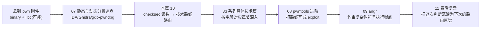
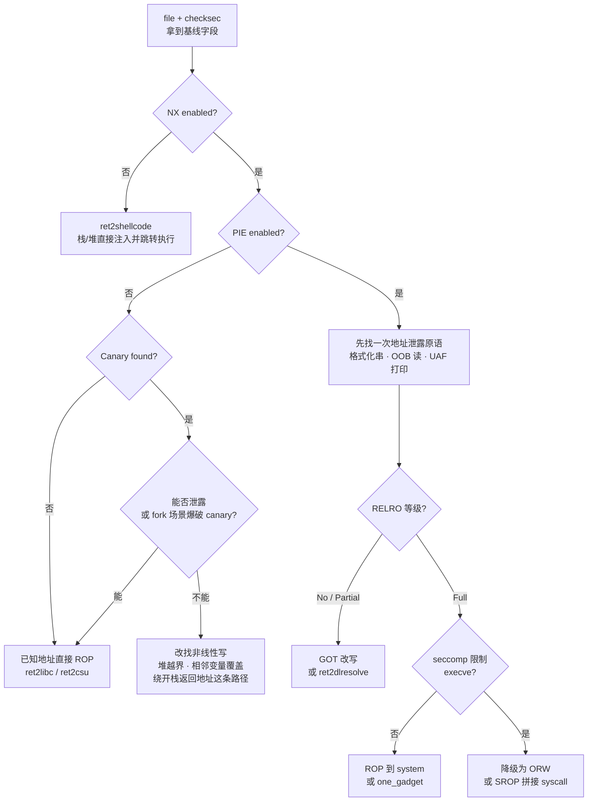
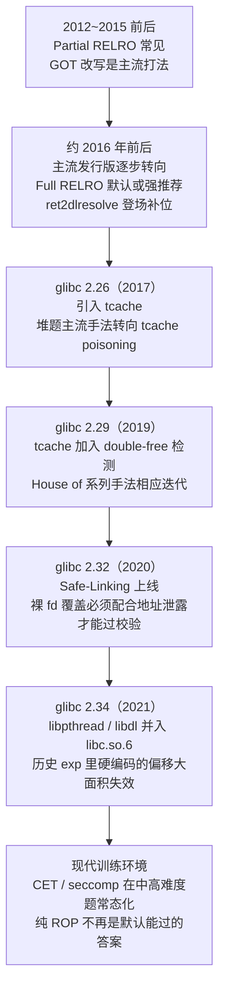

# CTF方法论体系（10）· 常见保护与绕过速查

> [!abstract] TL;DR
> - checksec 不产生新知识，它只是把 ELF 头、程序头、动态节、符号表里已经写死的编译期决策**读出来**；本篇的价值不是重讲这些字段从哪来（详见系列 34），而是把"读出来的字段"直接**路由**到系列 33 对应的绕过技术，压缩"看到题目"到"定型打法"之间的决策时间。
> - 单项防护从不孤立起作用，真正决定攻击链形状的是**防护组合**：同样是"有 Canary"，PIE 开/关、RELRO 等级、有无 seccomp 会把绕过路径导向完全不同的技术分支——本篇给出可直接套用的组合速查矩阵与决策流程图。
> - checksec 五个常见字段之外还有大片盲区：seccomp 白名单、运行时 ASLR 是否真的随机、glibc/堆分配器版本、IO_FILE vtable 校验都不在 checksec 报告里，必须用 `seccomp-tools`、`ldd`、`gdb` 等手段单独核实，漏查任一项都可能造成方向性的时间浪费。
> - glibc 2.26 / 2.29 / 2.32 / 2.34 等版本节点分别引入 tcache、双重释放检测、Safe-Linking、libpthread 合并，直接决定本地复现能否直接用系统自带 libc、网上现成 exploit 的偏移是否还有效——这是比"防护是否开启"更容易被忽视、却同样致命的实战变量。
> - checksec 全绿是**最低基线**而非终点：信息泄露、vtable 改写、非线性写、第三方弱加固库仍是常态化的残余攻击面，"全绿"只意味着最短路径变长，不意味着无路可走。

## 概述与定位

拿到一道 pwn 题，多数人第一反应是运行 `checksec`。但 `checksec` 本身只是把 ELF 里几处静态结构翻译成人类可读的字符串——它不会告诉你"该怎么打"。真正拉开解题速度差距的，是看到那份报告之后，能不能在几十秒内把五六个字段组合成一条唯一的技术路线，而不是逐条重新推理"这个防护原理是什么、能不能绕"。这正是本篇要解决的问题：**给出一张从 checksec 读数直接跳转到系列 33 具体绕过技术的路由表**，把"临场推导"变成"查表决策"。

系列定位上，本篇是《CTF方法论体系》"通用技术与工程层"的收尾一环：[[07.静态与动态分析速查]] 解决"怎么看代码"，[[08.漏洞利用脚本工程：pwntools进阶]] 解决"怎么写 exploit"，[[09.符号执行辅助解题：angr实战]] 解决"约束太复杂算不出来怎么办"，本篇解决的是介于两者之间、却常被忽视的一环——**在动手写 exploit 之前，先把可选技术空间收窄到一两条**。这一步做得好，后面的分析和编码都是顺着既定方向推进；做不好，往往是在两三种可能的打法之间反复横跳，浪费掉比赛里最宝贵的时间。

必须明确本篇的边界：`checksec` 是 **ELF/Pwn 方向**的工具，检测的是内存破坏类漏洞的经典缓解机制（NX、Canary、ASLR/PIE、RELRO、Fortify、CET）。它对 Web 方向的 WAF/CSP、Crypto 方向的算法强度、Reverse 方向的反调试与壳保护（花指令、VMP、UPX 等）不适用——这些分别属于 [[05.Web解题范式]]、[[04.Crypto解题范式]]、[[03.Reverse解题范式]] 与 [[07.静态与动态分析速查]] 的职责范围。本篇只聚焦"内存破坏漏洞 + 编译期/链接期缓解机制"这一交叉领域，与 [[33.二进制漏洞与利用基础/00.二进制漏洞与利用基础总览]]（攻击面）和 [[34.现代二进制防护机制/00.现代二进制防护机制总览]]（防护面）构成三角关系：34 讲机制怎么工作、33 讲怎么绕过、本篇讲拿到具体读数之后先做哪一个。



## 原理与机制

理解"为什么 checksec 能在完全不运行程序的情况下判断出防护开关"，是用好这张路由表的前提。所有编译期/链接期防护，本质上都会在产物里留下**静态、可枚举的痕迹**——编译器和链接器不可能"隐式"地开启一项防护而不留下任何结构性证据，因为运行时环境（内核加载器、动态链接器、glibc）需要读取这些痕迹才能知道要不要激活对应的运行时行为。这决定了 checksec 的工作方式永远是同一套模式：**去 ELF 的某个固定结构里找某个固定标记，标记存在与否直接映射为防护开或关**。具体的五处结构（`e_type`、`PT_GNU_STACK`/`PT_GNU_RELRO` 程序头、`.dynamic` 动态节、符号表、`.note.gnu.property`）已经在 [[34.现代二进制防护机制/12.加固工具与checksec]] 逐字段讲清楚，本篇不重复推导，只强调一个方法论层面的推论：**既然每个字段对应的是一个独立、正交的编译/链接决策，那么"防护读数"本身就是一个可以直接做布尔运算的向量**，这正是下一节"决策矩阵"能够成立的根本原因——如果字段之间互相耦合、无法独立判断，就不可能有一张通用的路由表。

但这套"静态痕迹反推防护状态"的逻辑有一个必须正视的边界：**它只能反映编译期/链接期就已经固化的决策，反映不了运行期才决定的行为**。ASLR 是否真正随机化、seccomp 过滤了哪些系统调用、glibc 具体是哪个版本（进而决定堆分配器的行为细节）——这些都不写在目标二进制自己的 ELF 结构里，前两者是内核/沙箱配置，后者是另一个独立文件（`libc.so.6`）的属性，checksec 天然看不到。这也是为什么 CTF 老手看到 checksec 报告后的第一反应从来不是"知道了"，而是"接下来还要查什么"——一份完整的防护画像必须由 checksec（编译期/链接期）+ `ldd`/`strings`（运行时依赖版本）+ `seccomp-tools`（运行时沙箱）+ `gdb` 实测（运行时随机化是否真的生效）四部分拼起来，缺一不可。

从解题流程的位置看，防护识别应当发生在"通读代码找漏洞"之前，而不是之后——这是一个容易被新手颠倒的顺序。原因在于，防护组合决定了你在读代码时应该**优先寻找哪一类原语**：No RELRO 的题目，读代码时要格外留意有没有格式化字符串或者能控制长度的写操作，因为一旦找到就能直接改 GOT 收工；Full RELRO 的题目，同样的格式化字符串漏洞就不能指望走 GOT 这条路，必须去看堆结构、`IO_FILE` 或者能不能凑出一次地址泄露。反过来，如果先读代码找到漏洞点，再回头看防护、才发现某条路根本走不通，往往意味着要推倒重来一次分析——这就是本篇把"防护矩阵"放在流程更靠前位置的原因。

## 防护矩阵与绕过路径详解

这一节是本篇的核心交付物：一张可以直接在比赛中打开对照的**字段级路由表**，一张**组合套餐速查表**，一份**checksec 盲区清单**，以及一份**版本敏感点速查**。四者共同构成"从读数到打法"的完整决策闭环。

### 字段级路由表：从 checksec 输出到系列 33 对应章节

下表的读法是：拿到 checksec 输出后，逐行核对自己题目的实际值，"关闭/较弱"列给出的是**该字段单独松动时最直接能打的技术**（实战中往往需要结合其他字段综合判断，详见下一小节的组合套餐）。

| checksec 字段 | 开启/较强时挡住什么 | 关闭/较弱时的直接打法 | 深入原理 | 具体绕过技术 |
|---|---|---|---|---|
| NX | 禁止在栈/堆等数据页上直接执行注入的代码 | 直接把 shellcode 写入可控内存并跳转执行 | [[34.现代二进制防护机制/02.DEP与NX]] | [[33.二进制漏洞与利用基础/03.shellcode编写与ret2shellcode]] |
| Stack（Canary） | 检测函数返回前栈上是否发生线性覆盖 | 无 canary：溢出可直接线性覆盖返回地址；有 canary：需泄露/爆破，或找非线性写绕开该函数 | [[34.现代二进制防护机制/04.Stack Canary]] | [[33.二进制漏洞与利用基础/14.Canary泄露与绕过]] |
| PIE | 主程序基址随进程启动随机化 | 无 PIE：`.text`/`.plt`/`.got` 均为编译期常量，无需泄露程序自身地址即可直接构造 ROP | [[34.现代二进制防护机制/06.PIE]]、[[34.现代二进制防护机制/03.ASLR深入]] | [[33.二进制漏洞与利用基础/15.ASLR与PIE绕过技术]] |
| RELRO | 控制 `.got`/`.got.plt` 的可写范围与延迟绑定通道 | No/Partial：`.got.plt` 可写，任意写原语可直接改跳转目标，延迟绑定通道也仍开放；Full：两条路同时封死 | [[34.现代二进制防护机制/05.RELRO]] | [[33.二进制漏洞与利用基础/16.GOT劫持与ret2dlresolve]] |
| FORTIFY | 危险函数调用点插入运行期长度校验 | 关闭，或命中编译器无法静态推断大小的调用点：`strcpy`/`sprintf`/格式化串更容易直接得手 | [[34.现代二进制防护机制/07.Fortify Source]] | [[33.二进制漏洞与利用基础/09.格式化字符串漏洞]]、[[33.二进制漏洞与利用基础/10.整数溢出与类型转换缺陷]] |
| CET（IBT/SHSTK） | 硬件校验间接跳转落点与 `ret` 返回地址 | 多数 CTF 训练环境默认关闭：经典 ROP/JOP 畅通无阻；一旦开启则 `ret` 类 gadget 大量失效 | [[34.现代二进制防护机制/09.Intel CET]]、[[34.现代二进制防护机制/08.CFI控制流完整性]] | [[33.二进制漏洞与利用基础/12.SROP信号帧伪造]]、[[33.二进制漏洞与利用基础/13.JOP与COP面向跳转与调用编程]] |
| Symbols（是否 strip） | 移除 `.symtab` 后逆向没有函数名可读 | 带符号：IDA/Ghidra 直接给出函数名，定位速度快得多；strip：需靠特征码识别 libc 函数、靠工具枚举 gadget | [[34.现代二进制防护机制/12.加固工具与checksec]] | [[07.静态与动态分析速查]] |
| RPATH/RUNPATH | 动态库搜索路径是否被硬编码 | CTF 中常被出题方/`pwninit` 用来强制加载题目自带的 libc；本身不构成攻击面，但决定"你本地跑的到底是不是远程那个 libc" | [[34.现代二进制防护机制/12.加固工具与checksec]] | [[33.二进制漏洞与利用基础/22.利用开发工具链：pwntools与ROPgadget]] |
| Arch | 纯信息字段，不直接构成防护 | x86/x64 变长指令集下 gadget 极为丰富；ARM/MIPS 定长指令集下 gadget 稀缺，往往要另辟蹊径 | — | [[33.二进制漏洞与利用基础/21.ARM64与MIPS架构利用差异]]、[[33.二进制漏洞与利用基础/07.ROP进阶：ret2csu与通用gadget]] |

这张表刻意压缩了每个字段"为什么这样设计"的推导过程——那是 34 系列各篇的职责，这里只保留"读数 → 下一步该翻开哪一章"这一层信息。这也是"速查"区别于"教程"的核心：教程回答"这是什么、为什么"，速查回答"现在手上这个值，下一步查谁"。

### 组合套餐：防护叠加时的典型攻击链选择

单看一个字段永远是不完整的判断，防护之间存在明显的**前置依赖关系**——某个防护是否值得花力气绕，取决于它前面那道防护是否已经挡住了你。下表按 CTF 训练题中最常见的几种组合"套餐"给出典型解法，这些组合大致也对应了系列 34 第一篇讲的攻防军备竞赛时间线上的几个历史切片，但这里的落点是"该做什么"而不是"历史上发生了什么"。

| 套餐 | 典型组合 | 首选打法 |
|---|---|---|
| 入门局 | No RELRO / No Canary / NX disabled / No PIE | 直接向栈或 `.bss` 写入 shellcode 并跳转执行，全程不需要任何泄露 |
| NX 时代 | NX enabled / No Canary / No PIE / No 或 Partial RELRO | 地址已知，直接 ROP 到 `system("/bin/sh")` 或走 ret2libc；RELRO 不满时 GOT 改写往往比 ROP 更省事 |
| Canary 登场 | NX + Canary + No PIE | 先解决 canary（泄露或利用 fork 场景逐字节爆破），PIE 关闭意味着地址仍是已知量，拿到 canary 后直接 ROP |
| 现代默认局 | NX + Canary + PIE + Partial/Full RELRO | 必须先争取一次信息泄露同时拿到 canary 与某个模块基址（常见于堆题的 UAF 打印、格式化串一次性泄露多个栈值），随后依 RELRO 强度决定是走 GOT 改写/ret2dlresolve 还是纯 ROP + one_gadget |
| 全家桶 + 沙箱 | 以上全部 + FORTIFY + seccomp 限制 `execve` | 拿到任意读写后先看 seccomp 白名单，白名单不含 `execve`/`execveat` 时整条链降级为 ORW 或 SROP 拼接系统调用 |
| CET/CFI 前沿局 | 全套 + CET SHSTK/IBT 或软件 CFI | 传统 `ret` 链大幅受限，转向落点必须是 `endbr64` 的 JOP、或利用尚未被过滤的信号帧路径，gadget 搜索策略需要相应调整 |

下面这张决策流程图把上表的判断逻辑串成一条可执行的流程，核心思路是**逐层判断"这一层挡住了吗"，挡住了就找对应的绕过原语，没挡住就直接抄近路**——这与 [[33.二进制漏洞与利用基础/00.二进制漏洞与利用基础总览]] 里"利用链全景"图的五阶段模型是同一件事的两种颗粒度：那张图讲的是"漏洞类型 → 防护识别 → 落地"的宏观五阶段，下面这张图专注在"拿到具体 checksec 读数后，几个关键分支该往哪走"这一步的可执行判断。



需要强调，这张图给出的是**最短路径优先**的默认选择，不是唯一解。实战中经常出现"最短路径被出题人特意堵死"的情况——比如 Full RELRO 但堆结构给了极强的任意写能力，此时即便理论上还能走通 ROP，直接打 `IO_FILE`/FSOP 或者 tcache 也可能更快。路由表给的是起点而不是终点，具体走哪条路仍要结合代码里实际能拿到的原语强度判断。

### checksec 的盲区：五字段之外还要查什么

把 checksec 报告当作完整防护画像是最常见的误判来源。以下几类信息**不会**出现在 checksec 输出里，但同样决定攻击链能否走通：

- **seccomp 沙箱**：checksec 完全不检测系统调用过滤规则，一个 checksec 五绿的题目完全可能在 `main` 里调用 `prctl(PR_SET_SECCOMP, ...)` 屏蔽掉 `execve`。必须用 `seccomp-tools dump` 单独核实，否则精心构造的 ROP 链在 `execve` 那一步直接被内核 `SIGSYS` 掉，参见 [[33.二进制漏洞与利用基础/20.seccomp沙箱与逃逸]]。
- **运行时 ASLR 是否真的随机**：PIE enabled 只说明二进制"有资格"被随机化，不代表当前运行环境真的在随机化它。本地用 gdb 调试时，`show disable-randomization` 默认是 `on`——地址每次都一样，容易让人误以为"这题不用泄露"，一到远程立刻爆掉；反过来也有极少数比赛环境为了降低难度手动关闭了内核级 ASLR，这些都不写在二进制自己的结构里，必须靠 `vmmap` 多次运行比对来实测。
- **glibc/堆分配器具体版本**：决定 tcache 是否存在、有没有 double-free 检测、有没有 Safe-Linking，这些都不是 ELF 头字段，要靠 `strings libc.so.6 | grep version` 或 `ldd` 核实，详见下一小节。
- **IO_FILE vtable 校验**：glibc 2.24 起加入的 `_IO_vtable_check` 直接影响 FSOP 类攻击是否可行，checksec 报告里没有对应字段，需要结合已知 libc 版本推断，参见 [[33.二进制漏洞与利用基础/17.IO_FILE结构利用与FSOP]]。
- **哪些函数真正被 canary 覆盖**：checksec 的 Canary 字段只说明二进制里**至少存在一处**对 `__stack_chk_fail` 的引用，不代表所有函数都插了 canary——`-fstack-protector-strong` 只保护含本地数组/取地址局部变量的函数，纯标量参数的函数天然没有保护，逆向时仍要逐函数确认。

这份盲区清单本质上是在提醒一件事：checksec 报告的是**编译期/链接期承诺**，而利用是否成功取决于**运行时事实**，两者之间永远存在需要人工核实的缝隙。

### 版本与发行版速查：同样的字段读数，不同时代的含义

同一份 checksec 报告，在不同 glibc/发行版版本下对应的实战含义并不相同——这是比"防护开没开"更隐蔽、也更容易让人在本地复现阶段卡住的变量。下图给出 CTF 训练环境中最常被提及的几个版本节点：



> [!warning] 时间线为近似值
> 具体版本落地到哪个发行版、哪一年，因发行版和更新节奏而异，上图给出的是 CTF 训练语境中被广泛引用的近似节点，不构成任何具体系统的精确断言。实战中版本判断永远以 `strings libc.so.6 | grep "GNU C Library"` 或 `ldd --version` 的实测结果为准。

这张时间线速查表在实战中的用法是：拿到题目附带的 `libc.so.6` 后，第一时间核实版本号落在哪个区间，再决定要不要在本地复现时启用 tcache 相关技巧、要不要考虑 Safe-Linking 对 `fd` 覆盖的干扰、要不要用旧版本 exploit 模板里的固定偏移——**版本判断错了，后面所有基于"该版本行为"的构造都会系统性出错**，这类错误往往比防护本身判断错误更难排查，因为报错现象（崩溃地址诡异、tcache 链看似正常却写不进目标）表面上很像是偏移算错了，实际根因却是版本假设错了。

## 工具视角与实战

把上一节的矩阵变成肌肉记忆，需要一套固定的命令序列——每次拿到新题目，都按同一顺序跑一遍，而不是每次临场重新想"我该先看什么"。

### CTF workflow 中的 checksec 定位与命令实战

```bash
file ./chall                     # 架构、是否动态链接、是否 stripped
checksec --file=./chall          # 五个基线字段速读
```

> [!warning] 示例输出为示意，非本机实跑

`checksec` 的两种形态（pwntools 自带版 / 独立 shell 脚本版）及每个字段的具体检测方式已在 [[34.现代二进制防护机制/12.加固工具与checksec]] 讲透，这里只强调 CTF workflow 里的用法差异：比赛场景通常同时拿到 `chall`、`libc.so.6`（可能还有 `ld-linux-x86-64.so.2`），三者要**分别** `checksec`——题目二进制本身可能是 No PIE，但附带的 libc 永远是 Full RELRO + PIE（发行版官方构建），如果只看了主程序的报告就下结论，很容易漏掉"libc 侧地址依然需要泄露"这一关键前提。

### pwninit / patchelf：让本地环境等于远程环境

CTF 远程环境的 `libc`/`ld` 版本几乎不会与本地开发机一致，直接用本地 libc 调试会导致函数偏移、`one_gadget` 地址全部错位。`pwninit` 把这一步自动化：

```bash
pwninit                       # 自动识别目录内 binary/libc.so.6/ld-linux*.so.2
                               # 自动 patchelf --set-interpreter 与 --set-rpath
                               # 生成 solve.py 模板
```

其底层做的事情等价于手工执行：

```bash
patchelf --set-interpreter ./ld-linux-x86-64.so.2 \
          --set-rpath . \
          ./chall_patched
```

这一步的原理正好对应上一节表格里的 RPATH/RUNPATH 字段——`patchelf` 写入的 RPATH 会强制动态链接器优先在当前目录找 `libc.so.6`，而不是系统默认路径下的那一份，从而让本地运行的进程与远程使用完全相同的 glibc 版本。**这不是绕过任何防护，而是消除"环境不一致"这个和防护无关、却同样能让 exploit 失败的变量**——很多"明明地址算对了却打不通"的排查案例，最终定位到的根因就是本地调试用错了 libc。

### seccomp-tools dump 实战读法

seccomp 不在 checksec 报告里，必须单独 dump：

```bash
seccomp-tools dump ./chall
```

一份典型（示意）输出：

```text
 line  CODE  JT   JF      K
=================================
 0000: 0x20 0x00 0x00 0x00000004  A = arch
 0001: 0x15 0x00 0x08 0xc000003e  if (A != ARCH_X86_64) goto 0010
 0002: 0x20 0x00 0x00 0x00000000  A = sys_number
 0003: 0x15 0x05 0x00 0x00000000  if (A == read)  goto 0009
 0004: 0x15 0x04 0x00 0x00000001  if (A == write) goto 0009
 0005: 0x15 0x03 0x00 0x00000002  if (A == open)  goto 0009
 0006: 0x15 0x02 0x00 0x00000003  if (A == close) goto 0009
 0007: 0x15 0x01 0x00 0x0000003c  if (A == exit)  goto 0009
 0008: 0x06 0x00 0x00 0x00000000  return KILL
 0009: 0x06 0x00 0x00 0x7fff0000  return ALLOW
 0010: 0x06 0x00 0x00 0x00000000  return KILL
```

> [!warning] 示例输出为示意，非本机实跑

读法很直接：逐条比较指令把 `sys_number` 与白名单中的调用号比对，命中则跳到 `ALLOW`（0009 行），落空则落到 `KILL`（0008/0010 行）。上面这份白名单里没有 `execve`/`execveat`，意味着无论控制流劫持做得多干净，最后一步走 `system`/`execve` 都会被内核直接终止进程——按照决策矩阵，这种情况应立即切换到 ORW（[[33.二进制漏洞与利用基础/19.ORW与读取flag]]）或 SROP 拼接系统调用（[[33.二进制漏洞与利用基础/12.SROP信号帧伪造]]），而不是继续在 `system("/bin/sh")` 这条已经确定走不通的路上反复调试。

### gdb-pwndbg 运行时复核：checksec 说的是"编译期承诺"，不是"运行时事实"

`pwndbg` 内置了一条命令直接复用 checksec 的解析逻辑，方便在调试会话中随手核对：

```text
pwndbg> checksec
```

更重要的是用 `vmmap` 做交叉验证——多次 `run` 之后对比同一程序的基址变化，才能确认 PIE/ASLR 在**当前实际运行环境**里是否真的生效，而不是仅仅相信二进制"有资格"被随机化。这一步呼应上一节"盲区"里提到的运行时陷阱：本地默认关闭随机化，容易让人对远程难度产生误判。

### 走查示例：从一份 checksec 读数到技术路线判定

以下是一次完整的路由演示，全程使用占位/示意数据，不指向任何具体题目或真实服务：

```text
[*] './demo'
    Arch:     amd64-64-little
    RELRO:    Partial RELRO
    Stack:    Canary found
    NX:       NX enabled
    PIE:      PIE enabled
    FORTIFY:  Enabled
```

> [!warning] 示例输出为示意，非本机实跑

对照决策流程图逐层判断：NX 开启，排除直接 shellcode 注入；PIE 开启，意味着必须先拿到一次地址泄露；Canary 存在，需要在泄露阶段一并解决（若代码里有格式化字符串或菜单堆题的越界打印，通常能一次性带出 canary 与某个模块地址）；RELRO 是 Partial，说明一旦拿到程序自身基址，`.got.plt` 仍然可写——`ret2dlresolve`（[[33.二进制漏洞与利用基础/16.GOT劫持与ret2dlresolve]]）或直接 GOT 改写都是候选项，且不要求先泄露 libc 基址，这比等价的 Full RELRO 场景要少走一步。据此可以确定：这是"现代默认局"套餐，下一步该做的是回到反编译代码里，专门寻找一次同时能泄露地址与 canary 的读原语，而不是继续泛泛地通读全部函数。


## 安全性与正确使用

把 checksec 用对，本质上是一种"元认知"能力：知道工具告诉了你什么，也知道工具**没有**告诉你什么。最常见的误用模式有三类。第一类是**过度信任全绿**——看到五个字段都是最强值就默认"这题很难/防不住"，从而在通读代码阶段松懈，漏掉本该重点关注的堆结构或逻辑漏洞；全绿只是抬高了到达 shell 的路径长度，不是宣告路径不存在。第二类是**忽视盲区**——只看 checksec 就下结论，不去核实 seccomp、不去核实 glibc 版本、不去用 gdb 实测随机化是否真的生效，结果在本地"跑通"的 exploit 一到远程环境就失败，往往还要浪费大量时间去怀疑漏洞点本身是不是找错了。第三类是**忽视版本敏感性**——直接套用网上找到的、针对某个特定 glibc 版本写的利用模板，不核对题目附带的 libc 版本是否落在同一区间，导致偏移、gadget、堆行为全部对不上。

从防御视角看，本篇给出的路由表也是一份**加固验收清单的镜像**：一名审计者拿到同样的 checksec 报告，走的是完全相同的表格，只是结论从"这样打"变成"这里要补哪项加固"——这与 [[34.现代二进制防护机制/12.加固工具与checksec]] 里给出的 CI 门控清单是同一张地图的两种走法。理解攻击路径的存在性，恰恰是判断"这项加固是否值得优先补"的依据：一个 Partial RELRO 但完全没有任何写原语的程序，补 Full RELRO 的收益远低于修掉那个写原语本身。

> [!caution] 合规边界
> 本篇涉及的一切防护识别与绕过路由，仅用于**自有环境、CTF 靶场与经授权的安全研究场景**。所有内容均以**防御视角**组织：目的是让读者理解"防护为什么会被这样绕过"，从而知道该在哪里补强，而不是提供可以直接对准真实生产系统或他人系统的武器化步骤。本篇不给出针对具体题目、具体服务的完整成品 exploit，走查示例中的数据均为占位/示意值；文中出现的所有命令、payload 结构均为通用方法论层面的教学演示，实际使用前必须确认目标处于你拥有明确授权的范围内。绕过他人系统防护、破坏他人服务，无论是否以"研究"为名，都可能触犯《网络安全法》等法律法规，后果自负。

## 小结

1. **checksec 是路由表的输入，不是答案本身**：它把编译期/链接期决策翻译成可读字段，但"该怎么打"永远需要结合具体代码里的漏洞原语综合判断。
2. **防护从不孤立起作用**：NX/PIE/Canary/RELRO/seccomp 的组合决定攻击链的形状，务必按组合套餐（或决策流程图）整体判断，而不是逐项孤立分析。
3. **checksec 有明确盲区**：seccomp、运行时随机化状态、glibc 版本、IO_FILE vtable 校验都不在报告里，需要 `seccomp-tools`、`ldd`、`gdb` 联合核实。
4. **版本敏感性和防护开关同等重要**：glibc 2.26/2.29/2.32/2.34 等节点直接决定堆利用手法与本地复现的可行性，判断错版本比判断错防护更难排查。
5. **工程闭环靠 `pwninit`/`patchelf` 完成**：让本地调试环境与远程环境使用同一份 libc/ld，是排除"非防护类失败因素"的第一步。
6. **全绿是基线不是终点**：残余攻击面（信息泄露、vtable、非线性写、第三方弱加固库）始终存在，回到系列 33/34 深入某一项时，本篇的路由结论应作为起点而非终点。

下一步的学习路径：把本篇的路由表在几道不同防护组合的训练题上实际走一遍，每次解题后按 [[11.赛后复盘与writeup方法]] 的模板记录"实际用时 vs 路由表预判是否一致"，逐步把查表决策内化为看到 checksec 输出时的第一反应。

## 相关阅读

- [[00.CTF方法论体系总览]] — 系列总览与篇目导航
- [[07.静态与动态分析速查]] — 防护识别之后的静动分析工具流
- [[08.漏洞利用脚本工程：pwntools进阶]] — 把路由结论写成可执行 exploit
- [[09.符号执行辅助解题：angr实战]] — 约束过于复杂时的兜底手段
- [[11.赛后复盘与writeup方法]] — 把路由判断沉淀为可复用经验
- [[33.二进制漏洞与利用基础/00.二进制漏洞与利用基础总览]] — 攻击面全景与利用链模型
- [[33.二进制漏洞与利用基础/14.Canary泄露与绕过]] — Canary 逐字节爆破与泄露技术细节
- [[33.二进制漏洞与利用基础/15.ASLR与PIE绕过技术]] — 信息泄露、部分覆盖、暴力枚举四类绕过
- [[33.二进制漏洞与利用基础/16.GOT劫持与ret2dlresolve]] — RELRO 等级与 GOT 改写/ret2dlresolve 的对应关系
- [[33.二进制漏洞与利用基础/20.seccomp沙箱与逃逸]] — seccomp 规则分析与 ORW 降级路径
- [[33.二进制漏洞与利用基础/18.one_gadget与magic_gadget]] — 拿到 libc 基址后的一击成型手法
- [[33.二进制漏洞与利用基础/21.ARM64与MIPS架构利用差异]] — 非 x86 架构下的 gadget 稀缺问题
- [[34.现代二进制防护机制/00.现代二进制防护机制总览]] — 防护面全景与纵深防御理念
- [[34.现代二进制防护机制/12.加固工具与checksec]] — checksec 逐字段原理与加固验收清单
- [[45.反编译器与反汇编引擎原理/11.符号执行与angr框架]] — 符号执行引擎原理
- [[40.WASM与虚拟化壳逆向/08.WASM CTF实战]] — 非传统 ELF 场景下的 CTF 实战案例
- [[72.抓包与协议分析实战/13.抓包实战CTF与漏洞分析]] — 网络层视角的 CTF 实战案例
- [[52.Linux内核机制与内核利用/17.绕过内核防护：KASLR与SMEP与SMAP与KPTI]] — 内核态对应的防护绕过速查

[[00.CTF方法论体系总览|⬆ 系列总览]] | [[09.符号执行辅助解题：angr实战|← 上一章]] | [[11.赛后复盘与writeup方法|→ 下一章]]
