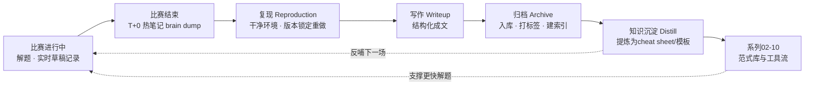
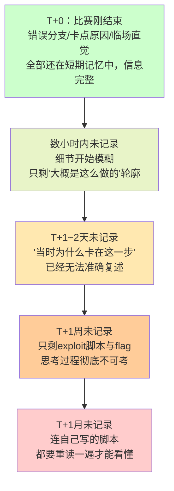
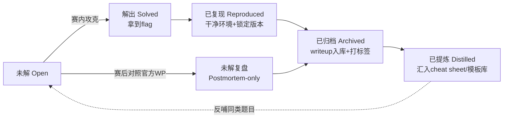

# CTF方法论体系（11）· 赛后复盘与writeup方法
> [!abstract] TL;DR
> - 复盘的本质，是把"侥幸拿到的flag"转化为"下次能稳定复用的范式"，其价值链条是**记录→复现→写作→归档→提炼→反哺**，任一环节缺失都会让经验在下一场比赛前流失殆尽。
> - 复现（reproduction）不是可选项：赛时"能跑就行"的exploit往往依赖侥幸的堆布局、巧合的ASLR偏移或临时的网络时序，赛后必须在干净、版本锁定的环境里重做一遍，才能确认自己是真正理解了漏洞，而不是蒙对了。
> - 记录时机比记录质量更关键：人类工作记忆在数小时内就会丢失"当时为什么卡在这里"的细节（遗忘曲线效应），赛后应遵循 T+0 热笔记 → T+24~48h 结构化writeup → T+1周归档 → 赛季末元复盘 的时间盒节奏。
> - writeup存在速记笔记、公开博客、官方提交体三种文体，读者对象不同则详略与脱敏程度不同；归档应保留信息最完整的私有主档案，对外发布的是脱敏、精简后的派生版本。
> - 知识沉淀不是把writeup堆进文件夹，而要提炼成可检索、可复用的技术标签与cheat sheet条目——这一步是本篇与系列07-10章形成闭环、让下一场比赛解题更快的关键所在。
> - 发布与归档必须遵守赛事的writeup禁运期、题目文件再分发条款与截图脱敏要求，这是CTF从业者的基本职业伦理，也是让复盘习惯能长期维持下去的合规前提。

---

## 概述与定位

### 本章在方法论体系中的坐标：从"解出"到"能力复利"的最后一环

前十章各自解决的是"如何在限时压力下解出一道题"：02-06章是Pwn/Reverse/Crypto/Web/Misc五个方向的解题范式，07-10章是静动分析、pwntools、angr、保护绕过四类横向工具能力。这些章节回答的都是"赛中怎么做"这一个问题。但一个非常容易被忽视的事实是：**如果比赛结束后什么都不做，上述所有能力都不会自动积累**——下一场比赛遇到同类型题目，大概率还是要把上一次踩过的坑重新踩一遍，只是换了一层皮。赛后复盘与writeup，就是把"这一次的解题过程"转化为"下一次可复用的范式、脚本与直觉"的唯一通道。

在系列总览的体系全景图中，本章被画成一条从末端指回中段的虚线——"经验回流"，这不是修辞性的装饰，而是精确描述了复盘在整个方法论体系里的位置：它不生产新的解题技巧，而是**把02-10章在实战中产出的一次性经验，蒸馏成可以直接喂回02-10章知识体系的结构化增量**。没有本章持续运转，02-10章的内容会停留在写下的那一刻；有了本章持续运转，这些章节对每一个具体的人而言会随每一场比赛不断增厚——这正是"方法论体系"区别于"技巧合集"的地方：前者能自我迭代，后者只能被动查阅。

### 要解决的现实问题

具体来说，本篇要回答几个在CTF圈子里反复出现、却极少被系统讨论的问题：为什么有人打了三年CTF，遇到新题依然从零摸索，而有人打半年就能显著提速？差别往往不在天赋或做题量，而在有没有把每一场比赛的经验结构化沉淀下来。赛时"能跑就行"的exploit脚本，往往包含大量侥幸成分，赛后不回头验证，这种脚本能不能称为"真正学会了"要打一个大大的问号。团队作战时，个人经验如果不写成他人可读的东西，团队的能力上限就约等于队内最强的那一两个人——复盘与writeup是团队知识从"个人技能"转化为"组织资产"的唯一路径。此外，writeup本身也是安全从业者最常见的作品集形式之一，招聘方、开源社区、CTFtime排名都会参考writeup的数量与质量，这是一个技术能力之外、但同样现实的产出维度。

### 本篇边界：不重复讲什么

本篇不重新讲解任何具体的漏洞原理或解题技巧——那是02-06章的职责；也不讨论赛制选择或环境准备——那是01章的职责；07-10章产出的静动分析流程、pwntools脚本、angr约束求解、保护绕过速查，在这里都是"待复盘的原始材料"而不是"待讲解的新知识"。本篇只聚焦一件事：**解题动作结束之后，如何让这次经历真正变成能力**。

### 与相邻章节的输入输出关系

本章的输入，是02-10章在实战中产生的全部原始材料：解题过程中的命令历史、失败的尝试、最终exploit脚本、checksec输出、angr约束求解脚本、pwntools模板的临时改动等等。本章的输出回流到两个方向：一是团队/个人的归档知识库，作为未来检索的素材；二是02-10章本身的cheat sheet与模板库，作为可直接复用的资产——例如10章"常见保护与绕过速查"里的条目，理想情况下应有相当比例源自若干场比赛复盘后提炼出的通用规律，而不是凭空整理的文档。可以说，02-10章教的是"怎么解"，本章教的是"解完之后，怎么让这次的'解'变成资产而不是一次性消费"。



## 原理与机制

### 复盘为什么有效：从"一次性经验"到"可迁移范式"的转化机制

复盘不是"回顾"的同义词，它有明确的认知科学依据。Kolb的经验学习循环把有效学习拆成四步：具体经验（做题）→反思观察（复盘时问"发生了什么"）→抽象概念化（提炼成一般规律，比如"tcache double free的检测特征是什么"）→主动实验（下一次遇到类似情况主动应用这条规律）。如果只有第一步没有后面三步，经验就停留在"肌肉记忆的碎片"层面——遇到几乎一模一样的题可能凭直觉做出来，换一个变体就会卡住，因为你从未把"为什么这么做"抽象出来过。

刻意练习理论进一步补充：单纯的重复（多打比赛）本身**不会**自动带来能力提升，真正起作用的是"带着明确目标的重复 + 即时反馈 + 针对性纠正"。赛后复盘恰好提供了CTF场景下最直接的反馈来源——flag对不对是最客观的信号，复盘要做的是把这个二元反馈展开成"为什么对/为什么错、下次怎么更快对"的丰富反馈。费曼技巧则解释了为什么"写"比"想"更有效：把解题过程写成别人能看懂的文字，会强迫你在每一步补齐自己其实没有真正想清楚、只是模糊感觉"大概是这样"的环节。很多人在写writeup时会突然发现某一步当时其实是蒙的、现在写不出令人信服的道理——这正是复盘捕捉到的、被比赛时间压力掩盖掉的知识盲区。换句话说，**写不出来的地方，就是没学会的地方**，这比"flag拿到了所以我懂了"的自我感觉可靠得多。

### 遗忘曲线与记录时机：为什么"等有空再补"几乎总会失败

艾宾浩斯遗忘曲线描述的规律是：新获得的信息在最初的几十分钟到几小时内衰减最快，此后衰减速度趋缓。这条规律直接决定了赛后复盘的黄金法则——**记录的时机比记录的精美程度重要得多**。比赛刚结束时，短期记忆里还保留着大量不会写进最终exploit脚本、但对理解"这道题为什么难/为什么巧妙"至关重要的信息：走过的错误分支、卡住二十分钟的原因、灵光一闪的触发点、队友提示带来的转折。这些信息不会出现在最终代码里——代码只记录"最终走通的那条路"，如果不趁热记录，几乎肯定会永久丢失。



正因如此，成熟的复盘流程会显式做**时间盒分层**，而不是笼统地说"赛后写writeup"：**T+0~2小时**是热笔记阶段，比赛一结束立刻做，不追求格式，只求把还留在脑子里的东西倒出来，产出可以很潦草，目标只是不让原始信息消失；**T+24~48小时**是结构化writeup阶段，趁热笔记还能看懂，把它整理成有章法的文档，此时人已从高压状态抽离，能更冷静地组织语言、补充原理解释；**T+1周内**是归档入库阶段，writeup连同exploit代码、环境快照一起归档打标签，拖过一周，"顺手归档"会变成"还要花时间回忆当时放在哪儿"，归档意愿会断崖式下跌；**赛季/季度末**是元复盘阶段，跨多场比赛回看归档内容，寻找重复出现的薄弱环节，这一层复盘产出的是训练计划，而不是单题笔记。

### 复盘的三个层次与各自的产出物

| 层次 | 触发时机 | 核心问题 | 典型产出 |
|---|---|---|---|
| 单题复盘 | 每道解出/放弃的题目 | 漏洞根因是什么？利用链怎么搭？下次怎么更快定位？ | writeup.md + 复现脚本 |
| 整场复盘 | 比赛结束当天/次日 | 时间分配是否合理？哪个方向拖了后腿？协作有没有卡点？ | 战绩表 + 团队复盘纪要 |
| 跨赛季复盘 | 每季度/每年 | 反复出现的弱项是什么？cheat sheet要不要更新？ | 训练计划 + cheat sheet修订 |

三个层次不是相互独立的，而是逐级抽象：单题复盘的原始材料喂给整场复盘做时间维度的分析，多场整场复盘的结果再喂给跨赛季复盘做趋势归纳。只做单题复盘而不做后两层，容易陷入"每题都复盘了，但依然不知道自己系统性短板在哪"的局面——这也是很多人"复盘了很多次却感觉不到进步"的根本原因：他们的复盘停留在最细粒度，从未向上聚合成可指导训练的结论。

### 已解出 vs 未解出：两种复盘同样重要，却容易被区别对待

大多数人只对自己解出的题做复盘，这是一种典型的幸存者偏差：长期只记录"我会的"，会让自我认知逐渐偏离真实水平，形成"我样样都会，只是这次没时间"的错觉。事实上，**未解出的题目的复盘价值往往更高**——它直接指向当前能力边界的真实位置。比赛结束后官方或其他队伍通常会发布writeup，此时应该主动对照：如果官方解法是完全没想到的角度，要记录"为什么我没往那个方向想"，而不只是抄一遍官方解法，这一步对应的是修正自己的假设生成能力，是复盘中最难但最有价值的部分；如果官方解法想到了但没时间实现，要记录卡在实现的哪个环节，这通常指向工具链熟练度问题（对应07-09章的工具能力），而不是思路问题；如果始终看不懂官方解法，说明这道题触及了一个全新的知识点，应该单独列为学习任务，而不是简单归档了事。

## 复现、归档与写作：流程与模板详解

### 复现：为什么"赛时能跑"不等于"真的学会了"

比赛进行中的exploit脚本，目标是"用最少时间换取一个flag"，为了达成这个目标，选手会做大量赛后应该被重新审视的妥协：硬编码某次运行观察到的堆地址偏移、依赖多次重试撞对ASLR（脚本里藏一个`while True`循环，"跑十次总有一次成功"）、依赖出题服务器当时恰好没有并发导致的堆状态稳定性、甚至依赖网络延迟带来的竞态窗口恰好命中。这些脚本的共同特点是：**它们证明了漏洞存在，但不证明你理解了漏洞的确定性利用条件**。复现，就是剥离掉这些侥幸成分，在一个干净、可控、版本锁定的环境里重新走一遍利用链，验证每一步是否都是"必然如此"而不是"恰好这次如此"。

复现还有一个更朴素但同样重要的动机：**比赛服务器会关**。绝大多数CTF平台在比赛结束后的几小时到几天内就会关闭远程题目实例，如果赛时只在脑子里留了个大概印象、没有落实成可独立运行的脚本和环境快照，赛后基本没有机会再验证任何细节——复现这件事，只有在"服务器还活着"或"自己把环境固化下来了"两个条件之一满足时才能做，晚了就真的晚了。

### 环境固化：把易逝的比赛环境变成长期可复现的工件

一道pwn/reverse题的"环境"至少包含题目二进制本身、动态链接的libc/ld版本、内核版本（涉及seccomp或内核态漏洞时）、题目给定的Docker镜像或启动脚本。这些要素中任何一个漂移，都可能让原本能打通的exploit失效——glibc在不同版本上对tcache的双重释放检测、safe-linking等内部结构调整意味着同一漏洞在不同libc版本下的利用手法可能完全不同。复现时必须显式锁定版本，而不是"本地随便装一个libc就行"：

```bash
# 用 pwninit 类工具（呼应08章 pwntools 进阶）
# 根据题目自带的 libc.so.6 自动匹配对应的 ld.so，
# patch 二进制的解释器路径，生成可直接本地复现的运行环境
pwninit --bin ./chall --libc ./libc.so.6

# 校验关键文件哈希，确认复现环境与赛时下发的完全一致
sha256sum chall libc.so.6 ld-linux-x86-64.so.2

# 用题目自带 Dockerfile（若主办方提供）固化整个运行环境，
# 避免"本地环境凑合能跑"掩盖掉真实的版本依赖问题
docker build -t ctf-2026-babyheap .
docker run --rm -p 9999:9999 ctf-2026-babyheap
```

固化的核心原则是**可重复性优先于便利性**：宁可多花十分钟拉一个精确匹配的Docker镜像，也不要用本地顺手的libc"大概齐"跑一遍就当作复现完成——后者复现出的很可能是另一个巧合，而不是原漏洞的确定性利用。对AWD赛制而言，环境固化的紧迫性更高：AWD的flag按轮次刷新，比赛一结束靶机立刻销毁，攻击脚本如果不在比赛期间就配合流量抓包、payload归档一起打包保存，赛后完全没有复现的可能——AWD复盘的数据必须是"比赛期间实时归档"的产物，而不能寄希望于"赛后回去慢慢复现"。

### 一键复现的验收标准：能不能被脚本自动验证

判断"复现是否完成"，一个可操作的验收标准是：能否写出一个无需人工干预、跑起来就能拿到flag的单一命令。这不只是懒惰的自动化，而是一种知识完整性的证明——如果利用链条中有任何一步依赖"人肉观察输出再手动调整参数"，说明利用条件还没有被完全刻画清楚。

```python
#!/usr/bin/env python3
# solve.py —— 复现验收的最小单元：单命令、可本地/远程切换、自带断言
from pwn import *

context.binary = exe = ELF("./chall", checksec=False)
libc = ELF("./libc.so.6", checksec=False)

def conn():
    if args.REMOTE:
        return remote("chall.example-ctf.com", 9999)
    return process([exe.path])

io = conn()
# ... 利用链条 ...
io.sendline(b"cat flag*")
flag = io.recvline()
assert flag.startswith(b"flag{") or flag.startswith(b"CTF{"), "复现失败：未拿到预期flag格式"
print(flag)
```

`assert`这一行是复现脚本区别于赛时"能跑就行"脚本的关键：它把"我觉得这个脚本应该没问题"变成了机器可验证的断言，配合Makefile或简单的批处理脚本，可以在归档时批量回归验证过去的exploit在环境升级后是否依然有效——这也是识别"哪些技术已经过时、哪些技术依然通用"的实用手段。

### writeup 的标准结构

无论最终呈现形式是私有笔记还是公开博客，writeup的核心信息骨架是稳定的，建议固定成模板，减少每次"从空白页开始想该写什么"的启动摩擦：

```markdown
# [赛事名] · [题目分类] · [题目名]

## 题目信息
- 分值 / 解出人数 / 难度标签
- 附件清单（二进制、libc、docker-compose等）

## 摘要（给三个月后的自己看的三行总结）
一句话漏洞类型 + 一句话利用手法 + 一句话关键trick

## 侦察 Recon
checksec 输出、文件结构、题目交互流程、有意留下的线索

## 漏洞点 Vulnerability
根因定位：哪一行代码、哪一种边界条件被打破；对应 CWE 编号更佳

## 利用思路 Exploitation Approach
从原语（读/写/执行）出发的推导过程，而非直接甩最终脚本；
说明每一步"为什么选这个技术"而不是"还有什么别的选项"

## exploit 代码
完整可独立运行的脚本 + 复现所需的环境说明

## 复现记录
环境版本、复现耗时、与赛时脚本的差异（去掉了哪些侥幸依赖）

## 踩坑与教训 Pitfalls
赛时实际走过的弯路、浪费时间的判断失误、下次的启发式规则

## 参考 References
官方 writeup、其他队伍 writeup、涉及的 CVE/论文/工具文档
```

其中"踩坑与教训"是最容易被省略、但价值密度最高的部分——它记录的不是"正确答案"（exploit代码已经说明了这部分），而是"当时是怎么想错的"，这才是真正提升下一次解题效率的信息。很多人写writeup只写"最终发现漏洞在某处"，却略去了中间试错的死路，这种"事后诸葛亮"式的writeup读起来顺畅，但既帮不了别人理解真实解题的思维过程，也帮不了自己复盘认知盲区。

### 三种文体：读者对象决定详略与脱敏程度

同一道题的writeup，面向不同读者时应该是不同的派生版本，而不是一份文档改改标题到处发：

| 文体 | 目标读者 | 侧重 | 典型载体 |
|---|---|---|---|
| 速记笔记 | 未来的自己/团队内部 | 效率优先，可以有缩写、跳步骤、私有吐槽 | 个人笔记软件私有库 |
| 公开博客 | 社区/潜在雇主 | 叙事性、配图、完整原理讲解，需脱敏 | 个人博客、代码托管平台仓库 |
| 官方提交体 | 赛事主办方（评writeup加分） | 按主办方模板格式，聚焦准确性与规范性 | 主办方指定提交渠道 |

归档知识库中应保留**最完整、未脱敏的私有版本**作为主档案（含所有内部讨论、失败尝试、内部工具路径），对外发布的公开博客版本是从主档案派生、经过脱敏和精简的子集。反过来做——先写脱敏简版，之后想补全内部细节——几乎不可能，因为最有价值的过程性信息在脱敏那一刻就已经被删掉且难以复原。

### 归档规范：让知识库在一年后依然可检索

归档不是把文件扔进文件夹了事，而是要建立可长期维护的组织结构。一个经过验证可行的目录约定：

```text
ctf-archive/
├── 2026/
│   ├── somectf-2026/
│   │   ├── pwn/
│   │   │   └── babyheap/
│   │   │       ├── writeup.md
│   │   │       ├── solve.py
│   │   │       ├── Dockerfile
│   │   │       └── libc.so.6        # 是否入库取决于赛事再分发条款
│   │   ├── web/
│   │   ├── crypto/
│   │   └── README.md                # 本场战绩、团队复盘纪要
│   └── ...
├── cheatsheet/                      # 反哺 07-10 章的通用速查
│   ├── heap-exploitation.md
│   ├── format-string.md
│   └── ...
└── index.md                         # 按技术标签聚合的全局索引
```

物理目录（按赛事/年份分类）解决"这道题原始出处是什么"的问题，但不擅长回答"我做过的所有tcache poisoning类型题目有哪些"这种跨赛事的技术检索需求——这正是标签体系要补的位置。在支持双向链接的笔记工具里，物理目录负责归档溯源，标签与链接图谱负责技术检索，两者互补而非二选一：给每篇writeup打上技术标签（如"tcache poisoning""format string""jwt none算法"）而不仅是分类标签（"pwn""web"），配合查询类插件即可按标签动态生成"所有涉及某技术点的题目列表"，这个列表本身就是该技术点的活教材。

标签体系设计上要避免两个极端：标签过粗（只有pwn/web/crypto三个标签，等于没分类）会让检索退化成"翻文件夹"；标签过细（每道题发明一个独一无二的标签）会让标签失去聚合能力。经验上，技术标签应该锚定在"可迁移的漏洞模式/技术手法"这一颗粒度上——即长期使用中命名会不断复用的量级，而不是题目细节本身。

版本控制上，建议每道题一次提交、提交信息包含赛事与题名，每场比赛结束打一个版本标签；私有仓库保留完整材料（含题目二进制、内部讨论），公开镜像仓库只同步writeup与自研代码，不同步可能涉及再分发限制的题目文件；大文件（流量包、内存镜像、大型libc集合）应排除在主仓库之外或用专门的大文件管理机制处理，避免仓库体积失控影响长期可维护性。



### 知识沉淀模板：从单篇writeup到可复用资产

单篇writeup是"点"，cheat sheet是"面"，把点连成面的动作就是知识沉淀。实践上可以用一张最小化的三字段卡片，作为writeup之外的第二产物：

| 字段 | 内容示例 |
|---|---|
| 技术模式 | tcache double-free 绕过 glibc safe-linking 检测 |
| 检测启发式 | free 两次同一 chunk 且中间无置空；关注 `fd` 字段是否被异或保护 |
| 可复用片段 | 计算受保护 `fd` 指针的通用编解码函数 |

这类卡片积累到一定数量后，按技术模式聚合就是cheat sheet的雏形——这也是为什么10章"常见保护与绕过速查"这类速查表不应该是一次性编写完就定稿的文档，而应该随每一场比赛的复盘持续追加条目。另一种有效的沉淀形式是间隔重复卡片：把"看到某种崩溃特征应该联想到哪种漏洞类型"做成问答卡片定期复习，这对需要快速模式识别的Reverse/Pwn方向尤其有效，能把"做过的题"转化成"看到类似特征时的条件反射"。

跨赛季的元复盘则在更高层面工作：定期回看归档索引，统计各技术标签出现的频率与自己的平均解题耗时，找出"反复出现但每次都要花很久"的模式——这类模式说明对应知识点还没有真正内化，应该转化为专项训练任务，而不是继续依赖临场发挥。

### 团队复盘：会议结构与协作伦理

团队作战场景下，个人写的私有速记笔记不会自动变成团队资产，必须有一个显式的团队复盘环节把个人经验汇总成团队知识。一个简洁可执行的赛后复盘会议结构分四步：第一步战绩回顾，列出各方向解出/未解题目清单、总分、排名，作为客观基线；第二步逐题速过，每道解出的题由解题人用两三分钟讲清漏洞是什么、怎么发现的、卡在哪儿，其他队员补充疑问，未解出的题对照官方writeup速览并标记谁负责补这个知识点；第三步协作复盘，讨论分工是否合理、信息同步是否及时（比如两人同时在攻同一道题却互不知道），这一层的产出是团队协作流程的改进而非技术层面的知识；第四步任务分派，把逐题速过中标记的知识缺口分配给具体队员整理成writeup或cheat sheet条目，明确不超过一周的截止时间，呼应前文的时间盒原则。

团队writeup要明确署名规则：谁主攻、谁提供关键思路、谁负责exploit实现，都应在writeup中体现，而不是笼统署团队名——这既是基本的协作伦理，也是团队内部建立信任与荣誉感的机制。引用官方writeup或其他队伍writeup中的思路时，同样需要明确标注来源，直接照搬不注明出处发布，在安全社区内是会被追溯认出并影响个人信誉的行为。

## 工具视角与实战

### 比赛进行中就要开始"复盘"：实时记录习惯

复盘的信息质量上限，其实在比赛进行中就已经被决定了——赛后能整理出多完整的writeup，取决于赛时留下了多少可追溯的痕迹。建议的习惯是：解每道题前先建一个对应的草稿笔记文件，做的每一个关键判断、试过的每一条命令都顺手记一笔，而不是全部依赖赛后回忆。这不需要额外占用很多解题时间——多数命令行工作流本身就会留下历史记录，稍微养成"每换一个思路补一行注释"的习惯，赛后热笔记阶段的效率会有数量级的提升。

```bash
# 一个低摩擦的实时记录范式：终端会话录制，赛后可按时间轴精确回放
mkdir -p ./notes/babyheap && cd ./notes/babyheap
script -q session.log      # 或用 asciinema record session.cast，
                            # 复盘时能按时间轴回放，精确还原"当时是怎么一步步试出来的"
```

### 复现工具链：把"重新走一遍"的成本压到最低

复现是否会被坚持执行，很大程度取决于复现的边际成本。把常用步骤脚手架化，能显著提高复现这件事的执行率：

```makefile
# Makefile —— 一条命令完成"拉环境 + 打patch + 跑exploit + 断言flag"
.PHONY: repro
repro:
	docker build -t $(CHALL)-repro .
	docker run -d --rm -p 9999:9999 --name $(CHALL)-repro-run $(CHALL)-repro
	python3 solve.py REMOTE
	docker stop $(CHALL)-repro-run
```

配合`pwninit`（自动匹配libc/ld并patch二进制，呼应08章pwntools进阶）、`checksec`（呼应34章加固工具与checksec，复现记录里应带上checksec输出作为环境快照的一部分）使用，可以把"复现"从一件需要专门腾出半天的苦差事，压缩成赛后归档流程里顺手一条命令的事情——这直接决定了复现这个环节到底会不会在长期实践中被坚持下去。

### 归档与检索的具体落地：以Obsidian风格笔记库为例

一套基于双向链接与结构化字段的笔记工具，可以直接复用在CTF归档上：每篇writeup作为一个笔记，frontmatter里填技术标签、赛事、耗时等结构化字段，配合查询类插件把归档和检索用同一套工具打通：

```dataview
TABLE event, points, time_spent
FROM #tcache-poisoning
SORT date DESC
```

这样的查询能实时列出所有打过`tcache-poisoning`标签的历史题目，比翻文件夹或凭记忆搜索快得多，也是前文"知识沉淀"承诺的具体落地——标签体系一旦建立，查询是免费的，价值会随归档量增长而增长，这也是坚持归档这件"看起来枯燥"的事情的长期回报所在。

### 借他山之石补全认知盲区

赛后复盘不应该局限在自己队伍解出的题，其他队伍与官方公布的writeup是重要的补充信息源：

| 渠道 | 内容 | 使用方式 |
|---|---|---|
| CTF赛事归档与评分平台 | 赛事归档、队伍评分、部分赛事官方writeup链接 | 赛后核对排名，查找同题其他解法 |
| 代码托管平台的writeup合集话题 | 各队伍自发布的writeup仓库 | 搜索题目关键特征找同题不同解法 |
| 社区维护的分类资源列表 | 分类整理的工具、资源、writeup合集 | 查漏补缺，发现未知工具 |
| 大型赛事官方赛后合集 | 出题人视角的intended solution | 对照自己的解法，判断是否为非预期解 |

对照官方writeup时，一个值得专门记录的维度是：自己的解法是"intended solution"（出题人预期的解法）还是"unintended solution"（俗称非预期解，圈内也常称"一血解"或"blood解"）。非预期解往往说明发现了出题人没考虑到的攻击面，这种发现本身很有价值，但也意味着这条利用链可能不具备教学意义上的普适性——下次同类型但没有这个疏漏的题目就用不上，复盘时应该把两种解法分别记录，不要用非预期解掩盖对intended solution的理解缺口。

### 指标化复盘：把"感觉"换成可对比的数字

单纯的文字复盘容易停留在模糊印象层面，引入简单的量化指标能让跨场次的对比更客观，进而指导下一次比赛的时间分配策略：

| 指标 | 计算方式 | 用途 |
|---|---|---|
| 分值/耗时比 | 该题得分 ÷ 实际投入时间 | 识别高性价比方向，指导下次优先级 |
| 首血耗时差 | 自己解出耗时 − 全场最快解出耗时 | 定位工具链熟练度短板 vs 思路短板 |
| 未解题目占比（按方向） | 未解题数 ÷ 该方向总题数 | 识别系统性薄弱方向，指导训练计划 |

这些数字不需要精确到分钟，量级对即可——目的不是做精细的绩效考核，而是避免"回忆式复盘"被情绪和近因效应（最后一道题的体验会不成比例地影响对整场比赛的印象）带偏，用几个简单数字校正主观印象。

## 安全性与正确使用

### writeup 的发布时机：不是解出就能立刻公开

不少赛事——尤其是设有多个赛区/晋级轮次的线下赛资格赛、企业内训赛、部分教学赛——会在规则中明确写出writeup禁运期，要求参赛者在官方公布之前不得公开发表解题过程，原因很直接：题目可能被复用于后续轮次或其他区域赛，过早公开等同于向仍在比赛中的其他队伍泄题。发布writeup前，第一件事应该是回头确认赛事规则页里有没有相关条款，而不是想当然地认为"比赛对我来说结束了就可以发"。

### 题目文件的再分发边界

题目二进制、源码、部署配置的版权通常归主办方所有，是否允许赛后再分发，取决于具体赛事的规则声明。很多知名公开赛事会主动开源全部题目供学习，这也是CTF社区生态健康发展的重要部分，但也存在明确禁止再分发的情况，比如题目复用了商业培训教材、或涉及主办方不愿公开的内部工具。不确定时的稳妥做法是：归档私有库时保留全部材料用于自己复现，但对外发布的公开版本只包含writeup正文与自己编写的exploit代码，不附带题目二进制本身；如需附带，先确认赛事规则或直接联系主办方获得许可。

### 截图与流量的脱敏

AWD赛制的战报截图、Web题的请求响应截图、流量分析题的数据包节选，都可能无意中带出不该公开的信息：AWD互攻流量中的对手IP与flag、Web请求头里的会话凭据，以及赛事下发的"个人化flag"——不少线上赛给每个参赛者或团队下发不同的flag文本，本意是防止抄袭作弊时能追溯来源，这类flag如果原样出现在公开writeup截图里，等于自证参与了作弊或被人冒用排查。发布前应逐张检查截图，把这类信息替换为占位符，而不是简单地信任"反正比赛都结束了"。

### 若发现真实漏洞：走负责任披露，而不是直接写进writeup

CTF题目历史上偶有使用真实、未打补丁的第三方组件而意外引入货真价实可利用漏洞的情况，区别于"故意设计的教学漏洞"。如果复盘过程中判断某个漏洞点实际对应一个尚未被厂商修复、可能影响真实生产环境的真实缺陷，正确做法是先通过厂商安全渠道、国家级漏洞共享平台等途径走负责任披露流程，给出修复窗口期后再公开技术细节，而不是直接把它当作普通CTF trick写进公开博客——这是CTF技能与真实漏洞研究交界处，最容易被忽视但后果最严重的边界。

### 署名与引用：团队协作与社区伦理的最低要求

团队writeup要清楚标注每个环节的贡献者；引用官方writeup、其他队伍writeup或公开技术文章中的思路时要明确标注来源链接，不能直接照搬后换个人称发布——这不仅是学术意义上的诚实，在安全社区里也直接关系到个人长期信誉：抄袭writeup被发现后造成的信誉损失，通常远大于"这次比赛多发一篇原创内容"带来的短期收益。

> [!caution] 合规边界
> 本篇讨论的复盘与writeup方法论，适用范围严格限定在**自有环境、CTF靶场与获得授权的安全研究**内：
> - 归档、复现、发布的对象应是CTF赛事题目或自建靶场，而不是未获授权的真实生产系统；
> - writeup的写作视角应是防御与教育导向——讲清楚漏洞根因与修复思路，而不是把writeup异化为"如何隐蔽地攻击某个真实目标"的操作手册；
> - 涉及真实第三方软件/服务的漏洞发现，优先走负责任披露流程，公开时间点服从厂商与相关协调机构的安排，不为抢首发而跳过披露窗口；
> - 不提供、不传播用于绕过CTF平台反作弊机制、抄袭检测或商业培训授权限制的技巧——这类内容超出了方法论的范畴，属于对社区生态与他人权益的破坏。
> 遵守这些边界，复盘与writeup才能长期作为个人与社区共同受益的正向循环，而不是引发纠纷或法律风险的源头。

## 小结

赛后复盘与writeup方法，本质上是把整套CTF方法论体系从"单点技巧集合"升级为"持续复利的个人能力系统"的最后一道工序。它的核心价值链条是记录（比赛中）→热笔记（T+0）→复现（剥离侥幸，验证确定性）→结构化writeup（费曼式地讲清楚）→归档（可长期检索）→提炼（喂回cheat sheet与训练计划），六个环节环环相扣，缺任何一环，经验都会在下一场比赛前大概率流失。复现不是可选的收尾动作，而是检验"是否真正理解漏洞"的试金石；writeup不是比赛结束后的义务性作业，而是费曼技巧意义上暴露认知盲区的工具；归档不是把文件堆进文件夹，而要靠标签与索引体系维持长期可检索性；知识沉淀的终点不是writeup本身，而是让下一场比赛的自己，能带着这一次踩过的坑，更快地解出同类题目。

最常见的失败模式集中在两端：一端是"只做不复盘"——打完比赛立刻投入下一场，从不回头整理，几年下来做过几百道题却依然在同类型题上反复卡壳；另一端是"复盘走过场"——归档了一堆只有exploit代码没有原理解释的writeup，半年后自己都看不懂当初写了什么，知识库变成一座只进不出的"写字墓地"。两者的共同解药，是把复盘当成解题流程本身不可分割的一部分来对待，而不是"有空再说"的可选项——按照遗忘曲线的规律，"有空再说"几乎总是意味着"信息已经丢了"。

## 相关阅读

- [[00.CTF方法论体系总览]] · 系列总览与体系全景
- [[02.Pwn解题范式与模板]] · 本章"复现"环节直接作用的对象之一
- [[07.静态与动态分析速查]] · 复盘中"复现记录"环节的环境快照来源
- [[08.漏洞利用脚本工程：pwntools进阶]] · solve.py 模板与 pwninit 类工具的依托
- [[09.符号执行辅助解题：angr实战]] · 约束求解脚本的归档同样适用本章模板
- [[10.常见保护与绕过速查]] · 本章"知识沉淀"环节反哺的典型目标之一
- [[33.二进制漏洞与利用基础/00.二进制漏洞与利用基础总览]] · Pwn方向复盘依托的原理体系
- [[34.现代二进制防护机制/12.加固工具与checksec]] · 复现记录中环境快照的取值依据
- [[37.密码学/53.密码学攻击概览]] · Crypto方向复盘依托的攻击分类
- [[45.反编译器与反汇编引擎原理/11.符号执行与angr框架]] · 符号执行类writeup的原理依托
- [[40.WASM与虚拟化壳逆向/08.WASM CTF实战]] · 既有实战writeup的归档范例
- [[72.抓包与协议分析实战/13.抓包实战CTF与漏洞分析]] · 流量类writeup的归档范例

[[00.CTF方法论体系总览|⬆ 系列总览]] | [[10.常见保护与绕过速查|← 上一章]]
