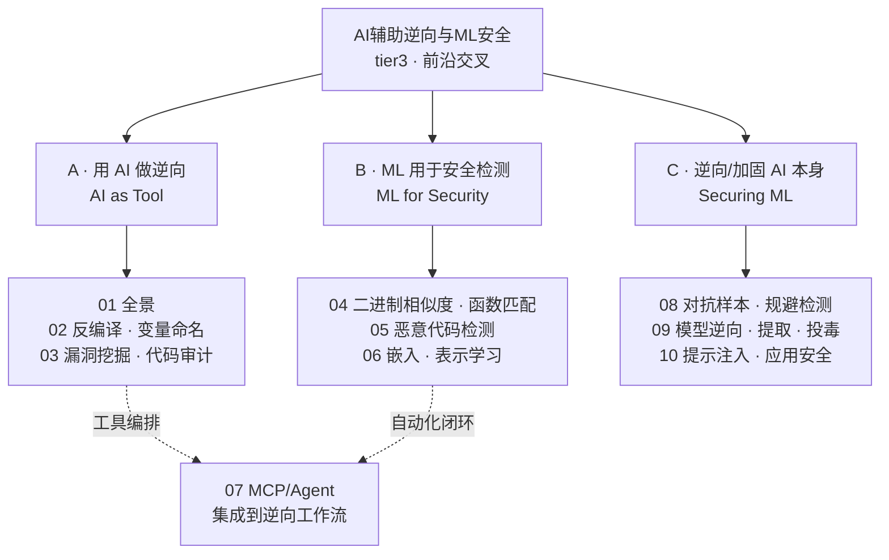
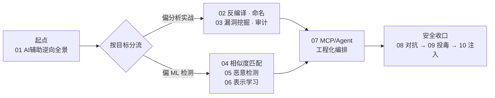

# AI辅助逆向与ML安全 · 系列总览

> 前沿交叉：一端是“用 AI 做逆向”——LLM 辅助反编译/审计、二进制相似度与 ML 恶意代码检测；另一端是“逆向 AI 本身”——ML 系统的对抗样本、模型窃取与提示注入。二者共享同一套表示学习与威胁建模直觉，互为攻防镜像。承接 [[91.Claude Code/07-Subagents与工作流|系列 91]]，把 Agent/MCP 工具链落到真实的分析与安全场景。

## 系列全景

## 篇目导航

| # | 章节 | 说明 |
| --- | --- | --- |
| 01 | [[01.AI辅助逆向全景]] | 能力边界、人机协作模式、可靠性 |
| 02 | [[02.LLM辅助反编译与变量命名]] | 反编译后处理、结构恢复、命名建议 |
| 03 | [[03.LLM驱动的漏洞挖掘与代码审计]] | 定向审计、补丁比对、误报控制 |
| 04 | [[04.二进制相似度与函数匹配]] | BinDiff、图匹配、embedding 检索 |
| 05 | [[05.机器学习恶意代码检测]] | 特征工程、静/动特征、模型选型 |
| 06 | [[06.嵌入与表示学习用于二进制]] | 指令/函数/CFG 表示、预训练 |
| 07 | [[07.MCP与Agent集成到逆向工作流]] | 工具编排、jadx/IDA MCP、自动化 |
| 08 | [[08.对抗样本与规避检测]] | 对抗扰动、免杀对抗 ML 检测 |
| 09 | [[09.模型逆向与提取与投毒]] | 模型窃取、成员推断、数据投毒 |
| 10 | [[10.提示注入与LLM应用安全]] | 注入、越狱、工具滥用与防护 |

## 学习路径

> [!tip] 学习建议与阅读顺序
> - **先立心智模型**：从 01 起步，认清 AI 在逆向中的能力边界与“可靠性天花板”——LLM 的反编译/审计输出是高价值线索，但不是可信真值，务必回读汇编、结合动态验证。
> - **两条主线可并行**：偏“用 AI 做分析”走 02 → 03；偏“ML 检测与表示”走 04 → 05 → 06。两线在 07（MCP/Agent 工程化）汇合成自动化闭环。
> - **安全三章相对独立**：08/09/10 可按需跳读——正在部署 LLM 应用就直取 10（提示注入），关心模型资产被窃/被投毒就先看 09。
> - **动手优先**：07 建议边读边搭 jadx/IDA MCP，把前六章的单点能力接成“分析—检测—验证”流水线。

## 与知识库既有体系的衔接

- 工具承接：[[91.Claude Code/06-MCP]]、[[91.Claude Code/07-Subagents与工作流]]
- 逆向依托：[[45.反编译器与反汇编引擎原理/07.Hex-Rays反编译器内部机制]]（AI 增强反编译）
- 恶意呼应：[[50.恶意代码分析与免杀对抗/02.恶意代码分类与家族谱系]]（ML 分类）
