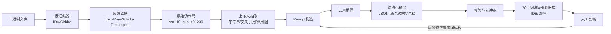
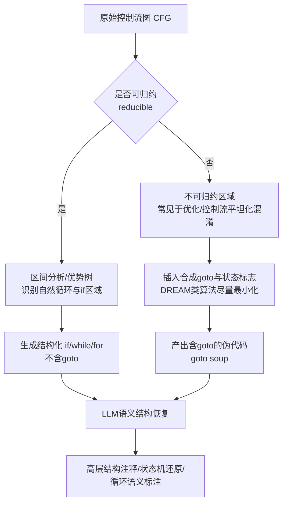
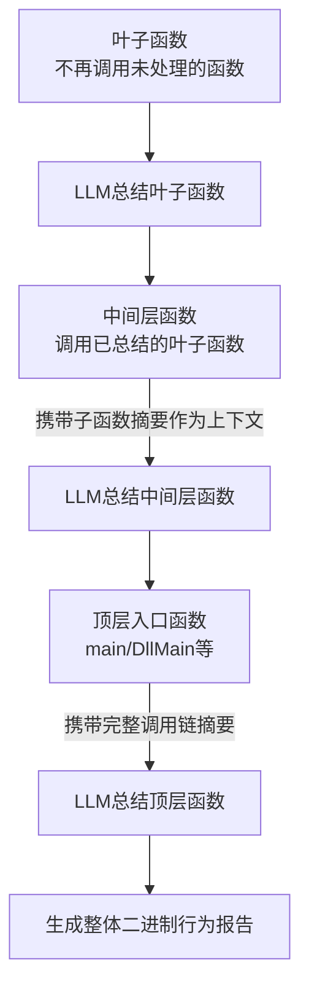
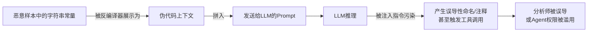

# AI辅助逆向与ML安全（2）· LLM辅助反编译与变量命名

> [!abstract] TL;DR
> - 反编译器（Hex-Rays、Ghidra Decompiler）只能靠确定性算法把控制流"结构化"为 if/while/for，但**变量名、类型语义、函数意图**这类信息在编译期已经永久丢失，属于算法本身无法单独填补的语义鸿沟，只能靠外部先验知识去补全——这正是 LLM 的切入点。
> - LLM 辅助反编译在架构上是一层"后处理层"：它不取代 Hex-Rays/Ghidra 内部确定性的结构化算法（区间分析、优势树、DREAM 类算法），而是在已经结构化好的伪代码之上叠加一层概率性的语义标注（改名、写注释、推类型、猜结构体）。
> - 命名质量高度依赖上下文供给——字符串交叉引用、导入表 API 原型、调用图中已解出的兄弟函数名——"喂给模型多少上下文"往往比"换多大的模型"对结果影响更大。
> - 学术界存在两条互补路线：DIRE、DIRTY、ReSym、LLM4Decompile 等专用模型在反编译器产出的"伪代码方言"上专门训练；Gepetto 等插件则走通用大模型的提示词工程路线，二者的能力边界并不重合。
> - LLM 输出必须被当作**假设**而非**事实**：命名幻觉、API 调用幻觉，以及恶意样本字符串常量对模型的提示注入，都会让分析结论悄悄跑偏，原始伪代码必须始终保留为可回溯的真值来源。
> - 面向机密代码或恶意样本的场景，云端 API 存在信息泄露、ToS 合规与可复现性三重风险，本地量化模型是更稳妥的工程选择，这也是本篇与系列第10篇提示注入内容衔接的伏笔。

## 概述与定位

反编译器把机器码或中间表示提升为类 C 伪代码，解决的是"控制流与表达式层面的可读性"问题：把跳转指令拼成 if/while/for，把寄存器分配还原成局部变量，把栈帧访问还原成参数与局部量。但这一步完全不解决"这段代码在业务、协议、算法语义上到底想干什么"这个更高层的问题。原因很直接——符号名、类型语义、注释这些纯粹给人类看、不影响程序执行结果的信息，在编译优化阶段就已经被丢弃，属于典型的不可逆信息丢失，无法靠对二进制本身做更聪明的静态分析补回来，只能靠外部先验知识去"猜"。

LLM 恰好是在海量真实源码上训练出来的、对"变量在什么使用模式下通常叫什么名字""这段代码惯用法通常实现什么功能"具有强统计先验的模型，所以它天然适合填补这道语义鸿沟。这不是巧合，本质上是反编译这个任务本身在"命名恢复"这个子问题上部分退化成了一个语言模型问题：反编译器负责语法层复原，LLM 负责语义层填空，二者分工明确、互不替代。

本篇在系列中的位置需要划清三条边界。与 [[01.AI辅助逆向全景]] 的关系：那一篇是整张地图，本篇是地图上一块具体拼图的放大镜，只聚焦"反编译产物增强"这一个环节。与 [[03.LLM驱动的漏洞挖掘与代码审计]] 的关系：第03篇是下游消费者，通常需要建立在本篇产出的"可读伪代码"之上才能高效展开——未命名、未注释的 `v1/v2/a1/a2` 代码，LLM 做漏洞审计的准确率会明显下降，这是承上启下的因果链条。与 [[45.反编译器与反汇编引擎原理/07.Hex-Rays反编译器内部机制]] 的关系：那一篇讲反编译器本身如何把机器码提升为伪代码（微码优化、Ctree 构建、类型传播等内部机制），本篇假设这一步已经完成，聚焦在其之后的后处理层。

还需要明确一个容易混淆的范围边界：本篇不覆盖"端到端神经反编译"这一研究方向——即训练一个专用解码器模型直接从字节码/汇编生成 C 源码（如 SLaDe、Nova 一类工作），而是聚焦目前工业界实际落地的主流形态：经典确定性反编译器产出结构化伪代码后，LLM 作为后处理/增强层介入，做变量命名、类型推断、结构语义标注和注释生成。两条路线的关系值得一提——后处理路线目前更成熟可靠，出错时可以随时回退到原始反汇编、试错代价小；端到端路线仍处于研究阶段，重编译率与语义等价性尚不稳定，但代表了更长远的技术方向。

## 原理与机制

### 编译期到底丢失了什么

要理解 LLM 能补什么，先要精确列出编译丢掉了什么：变量、函数、类型的原始名字；高级类型语义（结构体字段的业务含义、指针的所有权语义、枚举取值的具体意义）；程序员留下的注释；宏展开与函数内联之后原始的函数边界（一个源码函数可能被内联进调用者，或被优化器拆分、克隆成多份）；原始源码级控制结构在循环展开、跳转表优化等变换之后留下的形变痕迹。这些信息几乎全部只对人类阅读有意义、对程序执行没有任何意义，编译器的优化目标函数里根本不包含"保留这些信息"这一项，所以哪怕是不开优化的 Debug 构建，只要抽掉调试符号，这些信息一样会永久消失，这与优化等级无关，是符号表与源码本身分离存储这一编译模型决定的。

### 反编译器能做到的极限

通过确定性或半确定性算法——数据流分析、类型传播、库函数签名匹配（FLIRT）——反编译器能恢复一部分类型骨架和一部分名字，比如识别出调用的是 `CreateFileW` 之后，直接用该 API 已知原型把参数标注为 `lpFileName`、`dwDesiredAccess`。但对于纯业务逻辑函数——不调用任何可识别的库函数，全是加减乘除和内存读写——反编译器无能为力，只能给出 `v1 v2 a1 a2` 这类占位符。这正是 LLM 发挥作用的主战场：越是"看起来平平无奇、没有任何外部符号锚点"的函数，人工分析耗时占比越高，也越依赖 LLM 补充的语义猜测。

### LLM 为何能"猜"得比随机好

LLM 不是在"理解代码在执行"，而是在做统计模式匹配——它在预训练语料里见过海量带原始变量名的真实 C/C++/汇编代码，变量名与其使用模式（参与何种运算、被传给哪个 API、和哪些字面量比较、在循环里如何递增）之间存在强相关性，模型学到的其实是"使用模式 → 命名习惯"这个条件分布。这和人类逆向工程师看代码猜名字用的是同一套认知捷径，只是 LLM 见过的样本量是任何单个人类分析师的千万倍量级，因此统计意义上的猜测准确率能显著超过随机基线，但本质上仍然是猜测，而非从代码语义严格推导出的必然结论——这个区别是理解后文"幻觉"风险的关键前提。

### 处理管线全貌

一次完整的 LLM 辅助反编译，从二进制到写回大致经过如下环节：反汇编产出指令流，反编译器结构化为原始伪代码，脚本层抽取上下文（字符串引用、交叉引用、调用图、已知 API 原型、可识别的常量），拼装 Prompt，LLM 推理，解析结构化输出，校验去冲突，写回反编译器数据库，人工复核，复核中发现的系统性错误再反馈修正 Prompt 模板或上下文抽取策略。



这条链路的关键设计取舍在于：它是一个带反馈的闭环，而不是一次性单向管线。人工复核环节发现的系统性错误（比如模型总把某类缓冲区误判成输出参数）应当反馈进 Prompt 模板或上下文抽取策略，而不是每次都靠分析师就地手改了事——否则同样的错误会在下一个二进制、下一次分析中原样重复。

### 上下文窗口与确定性的工程约束

单函数级别的 Prompt 通常问题不大，几十到几百行伪代码大约落在一两千 token 量级，但真实二进制常有成百上千个函数，彼此通过调用关系形成复杂的调用图，不可能把整个二进制一次性塞进单个 Prompt。这就引出了"分块"与"自底向上摘要传播"的工程策略，具体做法会在下一节结合工具架构展开。

另外还有一个经常被忽视的问题：LLM 解码本身是采样过程，同一份伪代码在不同时间、不同请求下可能给出不同的命名结果，哪怕把温度参数调到接近零，也无法做到位级可复现——浮点运算的非结合性、后端负载均衡带来的路由差异，都会引入微小的不确定性。这对需要"结果可复现"的司法取证、合规审计场景是一个根本性张力，后文安全性章节会专门展开应对思路。

## 命名与结构恢复算法详解

### 经典结构化算法：从 CFG 到 if/while/for

在 LLM 介入之前，反编译器必须先用确定性算法把原始控制流图（CFG）结构化成人类习惯的 if/while/for 形式，这是 LLM 工作的地基，值得单独讲清楚。经典方法源自 Cristina Cifuentes 1994 年博士论文中的区间分析（interval analysis）与优势树（dominator tree）技术：通过分析 CFG 中的回边（back edge）识别自然循环，通过后必经关系识别 if-else 区域。当 CFG 满足"可归约"（reducible）性质——每个循环只有一个入口节点且该节点支配循环内所有其他节点——结构化通常能生成完全不含 goto 的纯净伪代码。

当 CFG"不可归约"时（常见于某些编译器优化，例如循环反转、公共代码合并，以及最典型的——控制流平坦化混淆），结构化算法必须退而求其次，插入合成的 goto 与状态标志来保证语义等价，这就是 Hex-Rays 伪代码里常见的"goto soup"现象。学术界对此有专门优化：Yakdan 等人提出的 DREAM 算法（NDSS 2015，"No More Gotos"）及其后续改进 DREAM++，采用模式无关的控制流结构化与保语义变换，在用户研究中验证了比原生 Hex-Rays 输出的 goto 更少、更易读。



### LLM 在结构恢复上新增的语义层

厘清分工边界很重要：LLM 不替代上面这套确定性结构化算法，那一层仍然由反编译器在生成伪代码之前就跑完了。LLM 的贡献在更高的语义层级——给一个逻辑上可以拆成几个步骤的巨型函数按区域打上"这一段在做什么"的注释；给循环标注它到底在遍历什么、为了什么目的（例如"这个 while 循环在解析 TLV 编码的配置记录"）；识别控制流平坦化混淆产生的 dispatcher 模式（switch-in-loop 结构配合一个状态变量），并尝试沿状态转移表还原出原始的逻辑顺序，尽管这只是启发式的、需要人工验证的还原，不等同于基于符号执行的确定性反平坦化；识别库代码或已知算法——哪怕一个 API 都没调用，仅凭一张常量表就能认出这是 AES 的 S-box、认出某个多项式是 CRC32 的生成多项式；辅助 C++ 二进制的 vtable/RTTI 识别与类层次推断，帮助分析师给匿名类打上语义化的名字。

### 命名推断的启发式与语义命名

命名推断可以分成两层。第一层是机械启发式，不需要 LLM 也能部分实现：循环计数器命名为 `i`/`idx`；作为 `malloc` 尺寸实参的变量命名为 `size`/`len`；Win32 句柄类型按匈牙利记法加 `h` 前缀；被反复传给 `strcmp`/`memcmp` 的字面量对应参数命名为比较目标的语义名。第二层是 LLM 特有的语义命名，它超越了局部使用模式，调用了训练语料中隐含的世界知识——识别出这是某个已知开源库的移植、某个已知协议的字段解析、某个 CTF 常见套路的变体，从而给出比"看用法猜类型"更贴近业务意图的名字。两层的本质区别在于：第一层是对局部数据流模式的确定性映射，可以用规则引擎实现且结果稳定；第二层依赖模型隐式记忆的海量代码语料，是概率性的、依赖模型见过什么样本，同一个模式换一个模型可能给出完全不同的命名倾向。

### 类型推断：从 TIE/retypd 到联合预测

类型推断同样有经典算法基础——CMU 提出的 TIE（Type Inference on Executables）与后续的 retypd 算法，基于类型格与约束求解，从寄存器/内存的使用方式（比如被用作数组下标、被解引用、参与浮点运算）反推最可能的类型格。DIRTY（USENIX Security 2022）这篇工作的关键洞察是把命名和类型联合预测而不是分开做——因为变量名本身就是类型的强信号（`len` 大概率是整数、`buf` 大概率是指针），类型也反过来约束合理的名字空间，两个任务之间存在信息增益，联合建模比独立建模效果更好，这也是目前专用反编译增强模型的主流设计范式。

### 数据结构/struct 布局恢复

结构体恢复是命名恢复的自然延伸：当同一个基址反复出现固定偏移的访问模式，就是结构体字段存在的强证据。

```c
// 反复出现的偏移访问模式
v1 = *(a1 + 0x18);      // 第1处：与某个长度比较
v2 = *(a1 + 0x1C);      // 第2处：被传给 memcpy 的 src 参数
*(a1 + 0x20) = v3;      // 第3处：v3 来自 recv() 的返回值

// 结合三处访问的上下文语义，LLM 可以建议如下结构体定义：
struct ConnState {
    /* 0x00 */ char     pad[0x18];
    /* 0x18 */ uint32_t capacity;    // v1：与长度比较，推断为容量字段
    /* 0x1C */ void*    recv_buf;    // v2：memcpy 源地址，推断为接收缓冲区指针
    /* 0x20 */ int32_t  last_len;    // v3：recv() 返回值，推断为最近一次接收长度
};
```

这个例子说明结构体恢复本质上不是单点命名任务，而是需要综合同一基址上多处访问点的上下文才能做出合理推断，这正是 LLM 相对传统单点启发式的优势所在——它能在一次推理里同时看到多处访问并做联合推理，而不是逐条规则孤立判断。

### 一致性传播与可靠性工程

全局符号的改名必须在所有交叉引用处保持一致，而不能出现"函数 A 里这个全局变量叫 `g_config`，函数 B 里同一个变量又被叫成别的名字"这种割裂。工程实践上，这通常靠脚本层在写回阶段做全局去冲突与传播，而不是对每个引用点各自重新问一次 LLM——重新问既浪费调用成本，也无法保证结果一致（回忆前面提到的采样非确定性）。

可靠性工程上有几个成熟手段值得强调：一是用结构化输出（JSON Schema 或 function calling 形式的约束解码）代替自由文本加正则解析，避免因为模型输出格式漂移导致下游脚本崩溃；二是多次采样投票（self-consistency），对同一个函数问模型若干次，取命名建议的众数，能显著降低单次采样的随机性带来的不稳定；三是设置置信度阈值配合"弃权"机制——模型给不出高置信度建议时，应当保留原始占位符名字或显式标记"待人工确认"，而不是为了凑一个像样的名字硬编造，量化判断可以用简单的相似度阈值来表达：

```
sim(name_pred, name_gt) = cos( embed(name_pred), embed(name_gt) )
接受条件：sim >= threshold（如 0.75）；否则弃权，保留原始占位符
```

### 专用微调模型 vs 通用大模型提示词工程

这一领域存在两条并行且互补的技术路线。专用路线以 DIRE（ASE 2019，LSTM+图神经网络）、DIRTY（USENIX Security 2022，Transformer 联合预测名字与类型）、SymLM（函数名预测）、ReSym（结构体符号恢复）为代表，它们直接在"反编译器输出的伪代码方言"上训练，见过大量 `v1/a1` 占位符与对应源码真值名的配对数据，对这个特定分布拟合得更准，模型体积小、可本地部署、推理成本低。通用路线以 Gepetto 一类调用 GPT/Claude 系列通用大模型做提示词工程的插件为代表，它们没有专门见过反编译伪代码这个分布，但携带海量世界知识——能认出某段代码是某个知名开源库的移植、某个标准协议字段、某个已知算法实现，这是专用小模型完全不具备的能力，因为专用模型的训练数据规模和多样性通常远小于通用大模型的预训练语料。工程上的最佳实践往往是二者结合：专用模型负责贴着代码本身的局部任务（类型骨架、局部变量名），通用大模型负责需要世界知识的任务（函数级摘要、算法识别、协议识别），两者的建议再通过前面提到的置信度机制做融合裁决。

## 工具视角与实战

### 两条落地架构：批处理管线 vs Agent 交互

实际落地基本分两条架构路线，区别值得讲清楚，因为它们适用的场景完全不同。

批处理/离线增强路线：脚本按调用图拓扑序遍历整个二进制的函数，叶子函数（不再调用任何未处理函数的函数）优先处理，其生成的摘要作为父函数 Prompt 上下文的一部分注入，逐层向上直到入口函数，最终产出一份对整个二进制预先增强过的分析基线。这条路线适合批量处理大量样本，比如恶意代码家族分类前的批量清洗、CI 式的样本入库流水线。



交互式/Agent 路线：分析师在 IDA/Ghidra 里实时提问，或者把反编译器能力通过 MCP 协议暴露给一个 LLM Agent，让 Agent 自主决定"看哪个函数、要不要改名、要不要深入某个被调函数"，这是一个多轮工具调用的会话过程。这条路线正是本系列 [[07.MCP与Agent集成到逆向工作流]] 要展开的主题，也与本知识库 [[91.Claude Code/06-MCP]]、[[91.Claude Code/07-Subagents与工作流]] 的机制直接对应——把"取伪代码""改名""查交叉引用"这些反编译器操作封装成 MCP tool，LLM Agent 就能像人类分析师一样边看边改边验证，而不是像批处理路线那样一次性无差别地跑完整个二进制。两条路线并非互斥，成熟的分析流水线往往是批处理路线打底做全量粗筛，交互路线在粗筛基础上做重点函数的深挖。

### 代表性工具速览

IDA Pro 生态中，Gepetto 是这个方向较早流行的开源插件，通过调用 GPT 系列模型对选中函数做改名与加注释；Hex-Rays 自身的 Lumina 是一个更早期、非 AI 的对照物——基于函数字节特征哈希做跨用户的众包函数元数据匹配，命中依赖"别人分析过同一份代码"这个前提，而 LLM 路线不依赖任何先验命中，这是二者本质区别所在。Binary Ninja 官方也提供了原生集成的 AI 辅助分析能力，能对函数做摘要与批量改名建议，无需额外插件。Ghidra 生态则更依赖社区方案：通过 Python 桥接调用外部 API，或者通过 GhidraMCP 一类项目把 Ghidra 的能力封装为 MCP server，配合支持 MCP 的 LLM 客户端使用；BinAssist、ReVA（Reverse Engineering Assistant）等聚合型插件也在这个方向上做了不同程度的封装。本地部署方向同样值得关注：用经过反编译语料微调的开源模型（如 LLM4Decompile 一类在 DeepSeek-Coder 基座上专门微调的模型）离线跑在分析师本机，适合无法出网或合规要求严格的场景，具体原因见下一节。

### 一个最小化实现示例

以下是一段说明性伪代码（并非可直接运行的完整脚本），展示批处理路线里单个函数的处理逻辑骨架：

```python
# 说明性伪代码：单个函数的 LLM 辅助改名流程
def enrich_function(func_ea):
    pseudocode = get_decompiled_text(func_ea)          # 取伪代码文本
    strings_xref = get_string_refs(func_ea)             # 抽取字符串交叉引用
    callees = get_called_functions(func_ea)             # 抽取调用的子函数
    callee_summaries = [cache.get(c) for c in callees]   # 复用已总结的子函数摘要

    prompt = build_prompt(
        pseudocode=pseudocode,
        strings=strings_xref,
        callee_context=callee_summaries,
        output_schema=RENAME_JSON_SCHEMA,               # 约束为结构化 JSON 输出
    )

    result = llm_call(prompt, temperature=0.0)           # 低温以降低采样波动
    parsed = parse_json_strict(result)                   # 严格解析，失败则整条丢弃

    for var in parsed["variables"]:
        if var["confidence"] >= THRESHOLD:
            apply_rename(func_ea, var["old"], var["new"])  # 写回反编译器数据库
        # 低置信度：保留原名，不强行改写

    if parsed["confidence"] >= THRESHOLD:
        set_function_comment(func_ea, parsed["summary"])
        cache[func_ea] = parsed["summary"]                # 供父函数复用
```

这段骨架体现了前面几节讲的几个关键设计：自底向上复用子函数摘要、结构化输出加严格解析、置信度阈值控制的弃权机制、低温采样降低不确定性。真实落地时 `get_decompiled_text`/`apply_rename` 对应 IDA 侧的 `ida_hexrays`/`idc` API 或 Ghidra 侧的 Program/DecompInterface API，此处略去平台细节以突出流程本身。

### 成本、延迟与优先级排序

真实二进制常有成百上千个函数，逐个调用 LLM 的成本会线性累积，工程上不应该无差别全跑，而应该按"值得投入分析精力"排序：优先处理被大量交叉引用的函数（复用价值高）、包含可疑 API 调用的函数（安全分析优先级高）、字符串密度高的函数（上下文信号丰富、LLM 更容易给出可靠结果）。并发调用要注意 API 速率限制，同一份伪代码文本做哈希缓存可以避免重复分析同一段被静态链接进多个样本的库代码，这在处理同源恶意代码家族的批量样本时尤其重要。

### 评估：如何判断改名"改得好不好"

学术界评估改名质量时不能用精确字符串匹配——过于严格，`count` 和 `num` 语义等价但字符串完全不同，常见做法是用编辑距离或子词重合度做软匹配，或者把预测名和真值名分别做 embedding 后计算余弦相似度，正如上一节展示的相似度阈值公式。但工程上更实际的评估维度是下游任务效果，比如"引入 LLM 辅助命名后，分析师完成同一个漏洞审计任务的平均耗时是否显著下降"，这类任务导向的评估比单纯比较名字像不像更能反映真实价值。

## 安全性与正确使用

### 幻觉的两种形态

需要分开理解两类幻觉，它们的危害机制不同。第一类是命名幻觉——给出的名字或注释语言上非常通顺，但语义错误甚至完全说反了，比如把加密函数命名为 `decrypt_data`，把发送逻辑注释成"接收远程配置"。LLM 的表达流畅度和判断正确率并不总是对齐，流畅性会掩盖错误，分析师如果不做交叉验证，很容易被"读起来很像那么回事"的注释带偏——这比原始的 `var_1` 没有任何信息更危险，因为错误信息比无信息更具破坏性，这是需要反复强调的认知点。第二类是 API 调用幻觉——模型可能"回忆"出一个训练语料里常见的搭配但当前代码里实际不存在的调用（比如看到网络相关的操作模式就联想出"这里应该调用了 send"，但这个函数根本没有该调用），根源是训练语料里的强共现偏差，模型把"经常一起出现"误当成"这里也出现了"。

### 信任边界与可回溯性

原则上 LLM 产出必须能在界面上和人工核实过的标注明确区分开（比如用不同颜色或前缀标记 AI 生成的注释），原始未加工的伪代码与反汇编必须始终保留可查，不能变成唯一真值来源被静默覆盖。一旦分析报告只引用 LLM 生成的命名而丢失了回溯到原始 `v1/a1` 的链路，复核和纠错成本会指数级上升——这也是为什么前面的实现示例里，低置信度场景选择"保留原名"而不是"强行改写"：改写动作本身就是在销毁可回溯性。

### 数据出境与合规

把二进制或伪代码发给云端 API，本质上是把可能包含商业机密、客户代码乃至恶意样本的内容传给第三方，需要考虑几层风险。知识产权层面，反编译得到的伪代码本身可能已经构成对原厂商版权的敏感处理，再传给第三方服务会放大风险；合规层面，多数云服务商的 ToS 明确禁止上传恶意软件样本用于其服务，批量把样本丢给通用聊天类 API 可能直接违反服务条款，这在做恶意代码分析时是真实存在的合规雷区；合同层面，对某些客户合同（NDA、政府或受控数据）而言，云端调用本身可能构成违约。工程上的应对是本地化部署——用量化开源模型跑在气隙环境或至少企业内网，牺牲一部分模型能力换取合规与保密，这也是前一节提到本地微调模型路线的现实意义所在，而不仅是成本考量。

### 提示注入：恶意样本对分析工具的反制

这是需要与本系列 [[10.提示注入与LLM应用安全]] 衔接的一个具体实例。如果恶意样本作者知道分析流程会把字符串常量喂给 LLM 做上下文，理论上就可以在样本里精心构造字符串常量——哪怕反编译器只会把它显示为普通数据——让这段"数据"在拼入 Prompt 后被 LLM 当成指令解读，进而产生误导性的命名或注释。如果分析流程是 Agent 化的、LLM 能直接调用改名/写注释甚至更危险的工具，被注入的指令甚至可能让 Agent 执行分析师未授权的操作。



防御思路上，应当把源自二进制的文本严格当作数据而非指令传参，不用同一个模型上下文同时兼顾"决策"与"读取不可信内容"两个角色，对 Agent 能调用的工具（尤其是写回、执行类工具）设置最小权限与人工确认关卡，这几条原则会在系列第10篇里做更系统的展开，此处先给出这个领域内的具体落地场景。

### 可复现性与取证场景

司法或合规场景下的分析结论需要可重现，而闭源云端模型的版本迭代或下线，会让几个月前生成的注释无法用同一模型重新验证得出相同结果。正确做法是记录模型版本号、采样参数、Prompt 模板并归档；关键结论优先靠可确定性复现的传统分析手段（反汇编、动态调试）交叉印证，LLM 结论只作为辅助线索，不应单独构成证据链的唯一支撑。

### 正确使用清单

- 人工复核不可省略，尤其是安全相关判断（加密/解密方向、权限提升路径）不能只信 LLM 单一来源结论。
- 结构化输出优先于自由文本解析，降低下游脚本因格式漂移而静默出错的风险。
- 重要判断采用多样本投票取多数，而非单次采样定论。
- 允许并鼓励模型显式"弃权"，拿不准时保留原始占位符名字，而不是强行给出一个像样但可能错误的答案。
- 处理敏感或恶意样本时优先使用本地部署模型，避免云端 API 带来的数据出境与合规风险。
- 记录模型版本、参数与 Prompt 模板存档，保证结论可追溯、可复现。
- Agent 化工作流中对写回类工具做最小权限封装，并对来自二进制内容的文本保持"数据而非指令"的警惕。

## 小结

反编译产出的伪代码在语法层面已经足够结构化，但变量名、类型语义与函数意图这类纯粹面向人类理解的信息在编译期已不可逆丢失，这道语义鸿沟正是 LLM 辅助反编译存在的根本原因。技术架构上，LLM 是叠加在经典确定性结构化算法（区间分析、DREAM 类算法）之上的一层概率性后处理，其效果高度依赖上下文供给（字符串、交叉引用、调用图、已解出的兄弟函数名），并需要结构化输出、置信度阈值、弃权机制、多样本投票等一整套可靠性工程手段来约束其固有的不确定性。专用微调模型（DIRE、DIRTY、ReSym 一类）与通用大模型提示词工程（Gepetto 一类）是两条互补而非互斥的路线，各自的优势分别在于分布拟合精度与世界知识广度。落地架构上批处理管线与 Agent 交互路线分别适配全量粗筛与重点深挖两种不同场景。最后也是最容易被忽视的一点：LLM 输出必须被当作需要交叉验证的假设，命名幻觉、API 调用幻觉与恶意样本可能构造的提示注入，都要求分析师始终保留原始伪代码作为可回溯的真值来源，绝不能让 AI 生成的标注悄然取代事实本身。下一篇将转向这层增强后的可读代码如何被进一步用于漏洞挖掘与代码审计。

## 相关阅读

- [[00.AI辅助逆向与ML安全总览]]
- [[01.AI辅助逆向全景]]
- [[03.LLM驱动的漏洞挖掘与代码审计]]
- [[04.二进制相似度与函数匹配]]
- [[07.MCP与Agent集成到逆向工作流]]
- [[10.提示注入与LLM应用安全]]
- [[91.Claude Code/06-MCP]]
- [[91.Claude Code/07-Subagents与工作流]]
- [[45.反编译器与反汇编引擎原理/07.Hex-Rays反编译器内部机制]]
- [[50.恶意代码分析与免杀对抗/02.恶意代码分类与家族谱系]]
- Cristina Cifuentes,《Reverse Compilation Techniques》，博士学位论文，Queensland University of Technology, 1994——结构化反编译算法的奠基性工作
- Yakdan et al., "No More Gotos: Decompilation Using Pattern-Independent Control-Flow Structuring and Semantic-Preserving Transformations", NDSS 2015，及后续 DREAM++ 用户研究工作
- Lacomis et al., "DIRE: A Neural Approach to Decompiled Identifier Renaming", ASE 2019
- Chen et al., "Augmenting Decompiler Output with Learned Variable Names and Types" (DIRTY), USENIX Security 2022
- Lee, Avgerinos, Brumley, "TIE: Principled Reverse Engineering of Types in Binary Programs", NDSS 2011；及后续 retypd 类型推断算法
- Hex-Rays 官方 SDK 文档（`hexrays.hpp`，Ctree/lvar 相关 API 说明）
- Ghidra 官方仓库文档中的 Decompiler 设计说明（DecompilerConcepts）

[[00.AI辅助逆向与ML安全总览|⬆ 系列总览]] | [[01.AI辅助逆向全景|← 上一章]] | [[03.LLM驱动的漏洞挖掘与代码审计|→ 下一章]]
